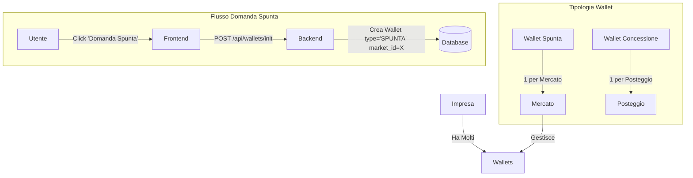

# 🔑 BLUEPRINT MIO HUB - AGGIORNATO 29 DICEMBRE 2025 (v3.1)

**DOCUMENTO DI CONTESTO PER NUOVE SESSIONI MANUS**

---

## 📋 INDICE

1. [Aggiornamento 29 Dicembre (Spunta & Storico)](#-aggiornamento-29-dicembre-2025-sessione-notturna---spunta--storico)
2. [Repository e Deploy](#-repository-e-deploy)
3. [Accesso Server Hetzner](#-accesso-server-hetzner)
4. [Database Neon PostgreSQL](#-database-neon-postgresql)
5. [Architettura Sistema Chat](#-architettura-sistema-chat)
6. [Schema Database agent_messages](#-schema-database-agent_messages)
7. [Flusso Messaggi e Mode](#-flusso-messaggi-e-mode)
8. [Logica di Rendering Frontend](#-logica-di-rendering-frontend)
9. [File Chiave da Conoscere](#-file-chiave-da-conoscere)
10. [Comandi Utili](#-comandi-utili)
11. [Agenti del Sistema](#-agenti-del-sistema)
12. [Wallet / PagoPA](#-wallet--pagopa)
13. [Imprese & Qualificazioni](#-imprese--qualificazioni)
14. [API Inventory (Integrazioni)](#-api-inventory-integrazioni)

---

## 💡 AGGIORNAMENTO 29 DICEMBRE 2025 (SESSIONE NOTTURNA - SPUNTA & STORICO)

### ✅ Nuove Funzionalità Implementate

1.  **UI Wallet & Spunta (Refactoring Completo)**
    -   **Wallet Chiusi di Default**: Le sezioni "Portafogli Spunta" e "Concessioni" nel pannello di dettaglio partono chiuse per pulizia.
    -   **Wallet Generico**: I wallet senza mercato associato sono etichettati come **"GENERICO"** (Badge Bianco), distinti da quelli di mercato (Badge Giallo).
    -   **Semafori Intelligenti**:
        -   **Verde**: Saldo > € 0.00
        -   **Rosso**: Saldo <= € 0.00 (Da Pagare/Ricaricare)
    -   **Header Riepilogativo**: Mostra il numero totale di wallet e la somma totale dei saldi in bianco.

2.  **Wallet Spunta Specifico per Mercato**
    -   **Architettura**: I wallet di tipo `SPUNTA` non sono più unici per azienda, ma specifici per ogni coppia `(Azienda, Mercato)`.
    -   **Motivazione**: I pagamenti della spunta devono confluire nelle casse specifiche del comune che gestisce quel mercato.
    -   **Visualizzazione**: Nella lista imprese, il badge "Spunta" mostra il saldo del wallet relativo al mercato che si sta visualizzando.

3.  **Domanda Spunta**
    -   **Nuovo Flusso**: Aggiunto pulsante "Domanda Spunta" nel tab Autorizzazioni.
    -   **Funzionamento**: Permette di creare un nuovo wallet spunta per un'impresa in uno specifico mercato.
    -   **UX**: La modale mostra esplicitamente il Mercato e il Comune di riferimento per evitare errori.
    -   **Nota**: Per le imprese con molti wallet spunta, la visualizzazione è filtrata per mostrare solo quello pertinente al mercato corrente.

4.  **Fix Storico PagoPA**
    -   **Problema**: Crash della pagina storico dovuto a conflitti di nomi (`History` vs `window.history`) e dati sporchi.
    -   **Soluzione**: Rinominato componente in `HistoryIcon`, blindato il rendering delle date e filtrati i dati non validi.

5.  **Indicatori Visivi (Semafori)**
    -   **Lista Imprese**: Aggiunti semafori (Verde/Rosso) e importi per:
        -   Concessioni (Posteggi)
        -   Wallet Spunta (Ricaricabile)
    -   **Logica**: € 0.00 è considerato "Da Pagare" (Rosso) per le concessioni, mentre per la spunta dipende dal saldo positivo/negativo.

6.  **Fix Backend Qualificazioni (v3.1)**
    -   **Problema**: Il badge delle qualificazioni nella lista imprese non si aggiornava automaticamente.
    -   **Soluzione**: Modificata la query principale `/api/imprese` per includere una subquery che recupera le qualificazioni 62	    -   **Stato**: Committato su `mihub-backend-rest` (master).
63	
64	7.  **Fix Dimensioni Posteggi & Popup (v3.1)**
65	    -   **Problema**: Dimensioni posteggi mancanti o stimate erroneamente, popup spunta incompleto.
66	    -   **Soluzione Dimensioni**: Implementata logica a cascata (Priority Fallback):
67	        1.  **DB**: Cerca dimensioni ufficiali nel database (`width` x `depth`).
68	        2.  **GeoJSON**: Se mancano, cerca nelle proprietà del file mappa.
69	        3.  **Stima**: Se mancano entrambe, calcola geometricamente dal poligono (Label "STIMATE").
70	    -   **Soluzione Popup Spunta**:
71	        -   Aggiunta visualizzazione **Impresa Intestataria**.
72	        -   Aggiunto pulsante **"Visita Vetrina"** (Link interno SPA).
73	        -   Allineata logica dimensioni a quella standard.
74	
75	### 📐 Architettura Wallet Spunta


---

## 🚀 REPOSITORY E DEPLOY

### Frontend (Vercel)
| Campo | Valore |
|-------|--------|
| **Repository** | `https://github.com/Chcndr/dms-hub-app-new` |
| **Branch** | `master` |
| **URL Produzione** | `https://dms-hub-app-new.vercel.app` |
| **Deploy** | Automatico su push a master |
| **Framework** | Vite + React + TypeScript + TailwindCSS |

### Backend (Hetzner)
| Campo | Valore |
|-------|--------|
| **Repository** | `https://github.com/Chcndr/mihub-backend-rest` |
| **Branch** | `master` |
| **URL Produzione** | `https://orchestratore.mio-hub.me` |
| **Deploy** | Manuale: `git pull` + `pm2 restart` |
| **Framework** | Node.js + Express |

### Flusso di Lavoro OBBLIGATORIO
```
1. Modifiche locali nel sandbox
2. git add -A && git commit -m "messaggio" && git push origin master
3. Per backend: SSH su Hetzner → git pull → pm2 restart mihub-backend
4. Per frontend: Vercel fa deploy automatico
```

**⚠️ MAI modificare direttamente sul server Hetzner!**

---

## 🖥️ ACCESSO SERVER HETZNER

| Campo | Valore |
|-------|--------|
| **IP** | `157.90.29.66` |
| **User** | `root` |
| **Chiave SSH** | `/home/ubuntu/.ssh/manus_hetzner_key` |
| **Percorso Backend** | `/root/mihub-backend-rest` |

### Comando SSH
```bash
ssh -i /home/ubuntu/.ssh/manus_hetzner_key root@157.90.29.66
```

### Deploy Backend (dopo push su GitHub)
```bash
ssh -i /home/ubuntu/.ssh/manus_hetzner_key root@157.90.29.66 'cd /root/mihub-backend-rest && git pull && pm2 restart mihub-backend'
```

---

## 💾 DATABASE NEON POSTGRESQL

| Campo | Valore |
|-------|--------|
| **Host** | `ep-bold-silence-adftsojg-pooler.c-2.us-east-1.aws.neon.tech` |
| **Database** | `neondb` |
| **User** | `neondb_owner` |
| **Password** | `npg_lYG6JQ5Krtsi` |
| **SSL** | `require` |

---

## 🏗️ ARCHITETTURA SISTEMA CHAT

### Viste Frontend
| Vista | Descrizione | Mode | Conversation ID |
|-------|-------------|------|-----------------|
| **Chat MIO** | Chat principale con orchestratore | `auto` | `mio-main` |
| **Vista 4 Agenti** | Mostra coordinamento MIO→Agenti | `auto` | `mio-{agent}-coordination` |
| **Chat Singola Manus** | Chat diretta con Manus | `direct` | `user-manus-direct` |
| **Chat Singola Abacus** | Chat diretta con Abacus | `direct` | `user-abacus-direct` |
| **Chat Singola GPT Dev** | Chat diretta con GPT Dev | `direct` | `user-gptdev-direct` |
| **Chat Singola Zapier** | Chat diretta con Zapier | `direct` | `user-zapier-direct` |

---

## 📊 SCHEMA DATABASE agent_messages

```sql
CREATE TABLE agent_messages (
  id                uuid PRIMARY KEY DEFAULT gen_random_uuid(),
  conversation_id   varchar NOT NULL,    -- ID conversazione
  sender            varchar NOT NULL,    -- Chi ha inviato: 'user', 'mio', 'manus', 'abacus', 'gptdev', 'zapier'
  recipient         varchar,             -- Destinatario (opzionale)
  role              varchar NOT NULL,    -- 'user' | 'assistant'
  message           text NOT NULL,       -- Contenuto del messaggio
  agent             varchar,             -- Agente che ha risposto
  mode              varchar DEFAULT 'auto',  -- 'auto' | 'direct'
  meta              jsonb,               -- Metadati aggiuntivi
  tool_call_id      varchar,             -- ID chiamata tool (se presente)
  tool_name         varchar,             -- Nome tool usato
  tool_args         jsonb,               -- Argomenti tool
  error             boolean,             -- Flag errore
  created_at        timestamptz DEFAULT NOW()
);
```

### Valori Campi Chiave

| Campo | Valori Possibili | Descrizione |
|-------|------------------|-------------|
| **sender** | `user`, `mio`, `manus`, `abacus`, `gptdev`, `zapier` | Chi ha inviato il messaggio |
| **role** | `user`, `assistant` | Ruolo nel contesto LLM |
| **mode** | `auto`, `direct` | Modalità di routing |
| **agent** | `null`, `mio`, `manus`, `abacus`, `gptdev`, `zapier` | Agente che ha processato |

---

## 🔄 FLUSSO MESSAGGI E MODE

### Flusso Mode AUTO (User → MIO → Agente)

```
1. User scrive a MIO
   └→ Salvato: mio-main, sender='user', role='user', mode='auto'

2. MIO analizza e delega a Manus
   └→ Salvato: mio-manus-coordination, sender='mio', role='user', mode='auto'

3. Manus risponde
   └→ Salvato: mio-manus-coordination, sender='manus', role='assistant', mode='auto'
   └→ Salvato: mio-main, sender='manus', role='assistant', mode='auto'

4. MIO elabora e risponde all'utente
   └→ Salvato: mio-main, sender='mio', role='assistant', mode='auto'
```

### Flusso Mode DIRECT (User → Agente)

```
1. User scrive direttamente a Manus
   └→ Salvato: user-manus-direct, sender='user', role='user', mode='direct'

2. Manus risponde
   └→ Salvato: user-manus-direct, sender='manus', role='assistant', mode='direct'
```

---

## 🎨 LOGICA DI RENDERING FRONTEND

### Chat Principale MIO

**File**: `DashboardPA.tsx` (riga 4102)

```tsx
<span>da {msg.role === 'user' ? 'Tu' : msg.agentName?.toUpperCase() || 'MIO'}</span>
```

- Se `role === 'user'`, mostra **"Tu"**
- Altrimenti, mostra il nome dell'agente (es. "MANUS") o "MIO" come fallback

### Vista Singola (GPT Dev, Manus, Abacus, Zapier)

**File**: `DashboardPA.tsx` (riga 4368)

```tsx
<span>da {msg.role === 'user' ? 'Tu' : (msg.agent || 'agente')}</span>
```

- Se `role === 'user'`, mostra **"Tu"**
- Altrimenti, mostra il nome dell'agente (es. "gptdev") o "agente" come fallback

---

## 📁 FILE CHIAVE DA CONOSCERE

### Backend (mihub-backend-rest)

| File | Descrizione |
|------|-------------|
| `routes/orchestrator.js` | Endpoint principale `/api/mihub/orchestrator`, routing messaggi |
| `utils/direct_saver.js` | Salvataggio diretto messaggi nel database |
| `src/modules/orchestrator/database.js` | Funzioni database: `addMessage`, `saveDirectMessage`, `createConversation` |
| `src/modules/orchestrator/llm.js` | Chiamate agli agenti LLM (MIO, Manus, Abacus, GPT Dev) |
| `config/database.js` | Configurazione connessione PostgreSQL |
| `routes/imprese.js` | API Imprese (Fix Qualificazioni v3.1) |

### Frontend (dms-hub-app-new)

| File | Descrizione |
|------|-------------|
| `src/components/DashboardPA.tsx` | Dashboard principale, logica chat e routing |
| `src/components/markets/WalletPanel.tsx` | Pannello Wallet (Spunta/Concessioni) |
| `src/components/markets/MarketCompaniesTab.tsx` | Lista Imprese con Badges |
| `src/components/markets/MarketAutorizzazioniTab.tsx` | Tab Autorizzazioni (Domanda Spunta) |

---

## 💻 COMANDI UTILI

### Avvio Server Backend (Locale)
```bash
cd mihub-backend-rest
npm install
npm start
```

### Avvio Frontend (Locale)
```bash
cd dms-hub-app-new
npm install
npm run dev
```

### Git Sync (Standard)
```bash
git add .
git commit -m "Update"
git push origin master
```

---

## 🤖 AGENTI DEL SISTEMA

| Agente | Ruolo | Capability |
|--------|-------|------------|
| **MIO** | Orchestratore | Routing, Sintesi, Gestione Contesto |
| **MANUS** | Esecutore Tecnico | Coding, Deploy, Debugging, Shell |
| **ABACUS** | Analista Dati | SQL, Analisi, Reportistica |
| **GPT DEV** | Sviluppatore | Code Generation, Refactoring |
| **ZAPIER** | Automazione | Integrazioni Esterne (Email, Calendar) |

---

## 💳 WALLET / PAGOPA

### Struttura Dati
- **Tabella**: `wallets`
- **Campi**: `id`, `company_id`, `market_id` (per Spunta), `concession_id` (per Concessioni), `balance`, `type` ('SPUNTA', 'CONCESSIONE').

### Logica Colori
- **Verde**: Saldo positivo (> 0)
- **Rosso**: Saldo negativo o zero (<= 0)
- **Giallo**: Badge identificativo "Spunta"
- **Blu**: Badge identificativo "Concessione"
- **Bianco**: Badge identificativo "Generico"

---

## 🏢 IMPRESE & QUALIFICAZIONI

### Badge Qualificazioni
- **Logica**: Il badge "Qualificato" appare se l'impresa ha almeno una qualificazione attiva.
- **Dati**: Recuperati via subquery in `GET /api/imprese` (v3.1).
- **Tabella**: `qualificazioni` (`company_id`, `type`, `status`, `start_date`, `end_date`).

---

## 🔌 API INVENTORY (INTEGRAZIONI)

### MIO Hub Core
- `POST /api/mihub/orchestrator`: Endpoint unico per messaggi chat.
- `GET /api/imprese`: Lista imprese con aggregati (wallet, concessioni, qualificazioni).
- `POST /api/wallets/init`: Creazione nuovi wallet (Spunta/Concessione).
- `POST /api/wallets/recharge`: Ricarica wallet (simulazione PagoPA).

---

## 📐 ARCHITETTURA FLUSSO DATI (DEFINITIVA v3.2)

Questa sezione definisce il "contratto" unico per il flusso dei dati tra Database, Backend e Frontend. Ogni modifica futura DEVE rispettare questo schema.

### 1. Dimensioni Posteggi (Stalls)

Il calcolo delle dimensioni NON deve mai essere stimato dal frontend se i dati esistono nel DB.

*   **Database (`stalls`)**:
    *   `width` (numeric): Larghezza in metri (es. 4.00).
    *   `depth` (numeric): Profondità in metri (es. 7.60).
    *   `area_mq` (numeric): Superficie in mq (es. 30.40).
*   **Backend (`GET /api/markets/:id/stalls`)**:
    *   Deve restituire un campo `dimensions` formattato come stringa `"WxD"` (es. `"4.00 x 7.60"`).
    *   Logica SQL: `CONCAT(ROUND(width, 2), ' x ', ROUND(depth, 2)) as dimensions`.
*   **Frontend (`MarketMapComponent`)**:
    *   **Priorità 1**: Usa `dbStall.dimensions` (dal backend).
    *   **Priorità 2**: Usa `props.dimensions` (dal GeoJSON, solo se il DB è vuoto).
    *   **Priorità 3 (Fallback)**: Calcolo geometrico (DA EVITARE, mostra etichetta "Stimate").

### 2. Link Vetrina (Showcase)

Il collegamento tra un posteggio e la vetrina dell'impresa deve essere deterministico.

*   **Database**:
    *   `vendors.impresa_id`: Chiave esterna che punta alla tabella `imprese`.
    *   `concessions.vendor_id`: Collega il posteggio al venditore.
*   **Backend**:
    *   La query `/api/markets/:id/stalls` esegue una JOIN tra `stalls` -> `concessions` -> `vendors`.
    *   Restituisce `impresa_id` per ogni posteggio occupato.
*   **Frontend**:
    *   Il link è: `/vetrine/{impresa_id}`.
    *   Se `impresa_id` è nullo ma c'è un nome impresa, fallback a `/vetrine?q={nome_impresa}`.

### 3. Wallet Spunta (Market-Specific)

I wallet di tipo "Spunta" sono strettamente legati al mercato di riferimento.

*   **Database (`wallets`)**:
    *   `type`: 'SPUNTA'
    *   `market_id`: ID del mercato (OBBLIGATORIO per tipo Spunta).
    *   `company_id`: ID dell'impresa.
*   **Logica di Visualizzazione**:
    *   Nella lista imprese di un mercato (es. Modena), si deve mostrare SOLO il saldo del wallet con `market_id` corrispondente a Modena.
    *   I wallet con `market_id` NULL sono considerati "GENERICI" e mostrati separatamente (badge bianco).

---
