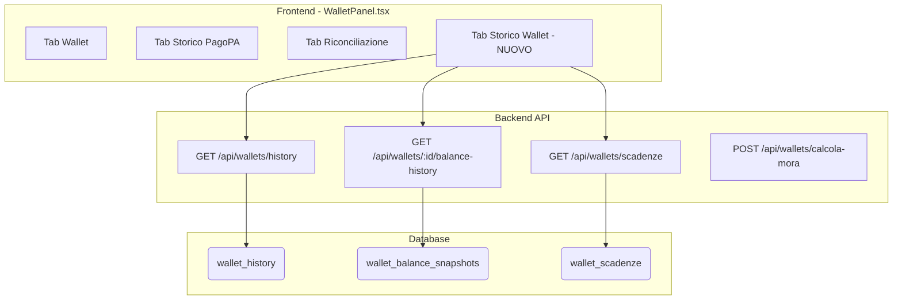
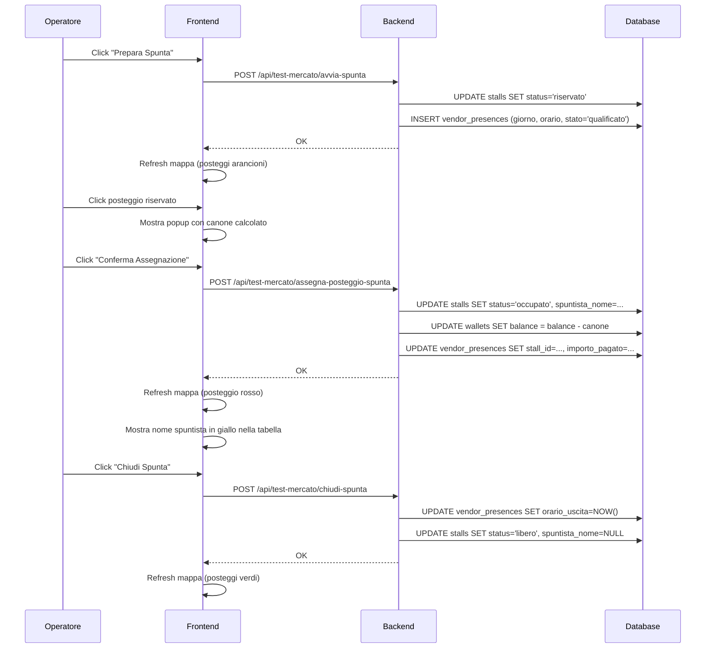

# 🏗️ MIO HUB - BLUEPRINT UNIFICATO DEL SISTEMA

> **Versione:** 3.77.0  
> **Data:** 02 Febbraio 2026  
> **Autore:** Sistema documentato da Manus AI  
> **Stato:** PRODUZIONE

---

## 📋 INDICE

1. [Panoramica Sistema](#panoramica-sistema)
2. [Architettura Completa](#architettura-completa)
3. [Repository GitHub](#repository-github)
4. [Servizi e Componenti](#servizi-e-componenti)
5. [MIO Agent - Sistema Multi-Agente](#mio-agent---sistema-multi-agente)
6. [Knowledge Base DMS](#knowledge-base-dms)
7. [Guardian - Sistema di Monitoraggio](#guardian---sistema-di-monitoraggio)
8. [Database e Storage](#database-e-storage)
9. [API Endpoints](#api-endpoints)
10. [SSO SUAP - Modulo SCIA](#sso-suap---modulo-scia)
11. [Deploy e CI/CD](#deploy-e-cicd)
12. [Credenziali e Accessi](#credenziali-e-accessi)
13. [Troubleshooting](#troubleshooting)
14. [Regole per Agenti AI](#regole-per-agenti-ai)

---

## 🎯 PANORAMICA SISTEMA

### Cos'è MIO HUB?

**MIO HUB** è un ecosistema digitale per la gestione dei mercati ambulanti italiani. Include:

- **DMS HUB** - Dashboard principale per Pubblica Amministrazione
- **MIO Agent** - Sistema multi-agente AI per automazione
- **Guardian** - Sistema di logging e monitoraggio API
- **Gestionale** - Backend per operazioni CRUD

### Stack Tecnologico

| Layer | Tecnologia |
|-------|------------|
| **Frontend** | React 19 + TypeScript + Tailwind CSS 4 + shadcn/ui |
| **Backend** | Node.js + Express + tRPC |
| **Database** | PostgreSQL (Neon) |
| **AI/LLM** | Google Gemini API |
| **Hosting Frontend** | Vercel |
| **Hosting Backend** | Hetzner VPS (157.90.29.66) |
| **CI/CD** | GitHub Actions + PM2 |

---

## 🏛️ ARCHITETTURA COMPLETA

```
┌─────────────────────────────────────────────────────────────────────────────┐
│                              INTERNET                                        │
└─────────────────────────────────────────────────────────────────────────────┘
                                    │
        ┌───────────────────────────┼───────────────────────────┐
        │                           │                           │
        ▼                           ▼                           ▼
┌───────────────┐         ┌─────────────────┐         ┌─────────────────┐
│   VERCEL      │         │  HETZNER VPS    │         │   NEON DB       │
│               │         │  157.90.29.66   │         │                 │
│ dms-hub-app-  │ ◄─────► │                 │ ◄─────► │  PostgreSQL     │
│ new.vercel.app│  API    │ orchestratore.  │  SQL    │  (Serverless)   │
│               │         │ mio-hub.me      │         │                 │
│ ┌───────────┐ │         │ ┌─────────────┐ │         │ ┌─────────────┐ │
│ │ React App │ │         │ │ Express API │ │         │ │ 542 mercati │ │
│ │ + tRPC    │ │         │ │ + PM2       │ │         │ │ + logs      │ │
│ │ client    │ │         │ │             │ │         │ │ + agents    │ │
│ └───────────┘ │         │ └─────────────┘ │         │ └─────────────┘ │
└───────────────┘         └─────────────────┘         └─────────────────┘
        │                           │
        │                           │
        ▼                           ▼
┌───────────────────────────────────────────────────────────────────────────┐
│                         MODULI INTERNI BACKEND                             │
│                                                                            │
│  ┌──────────────┐  ┌──────────────┐  ┌──────────────┐  ┌──────────────┐  │
│  │   GUARDIAN   │  │  MIO AGENT   │  │    LOGS      │  │   HEALTH     │  │
│  │              │  │              │  │              │  │   MONITOR    │  │
│  │ /api/guardian│  │ /api/mihub/  │  │ /api/logs/*  │  │ /api/health/ │  │
│  │ - health     │  │ orchestrator │  │ - createLog  │  │ - full       │  │
│  │ - testEndpoint│ │ - chats      │  │ - getLogs    │  │ - history    │  │
│  │ - logs       │  │ - messages   │  │ - stats      │  │ - alerts     │  │
│  │ - permissions│  │              │  │              │  │              │  │
│  └──────────────┘  └──────────────┘  └──────────────┘  └──────────────┘  │
│                           │                                               │
│                           ▼                                               │
│  ┌────────────────────────────────────────────────────────────────────┐  │
│  │                    ORCHESTRATORE MIO                                │  │
│  │                                                                     │  │
│  │   ┌─────────┐   ┌─────────┐   ┌─────────┐   ┌─────────┐           │  │
│  │   │   MIO   │   │ GPT Dev │   │  Manus  │   │ Abacus  │           │  │
│  │   │ (GPT-5) │──►│ GitHub  │   │ Server  │   │  SQL    │           │  │
│  │   │Coordina │   │  Code   │   │  PM2    │   │ Query   │           │  │
│  │   └─────────┘   └─────────┘   └─────────┘   └─────────┘           │  │
│  │        │                                          │                │  │
│  │        │        ┌─────────┐                       │                │  │
│  │        └───────►│ Zapier  │◄──────────────────────┘                │  │
│  │                 │ Email   │                                        │  │
│  │                 │WhatsApp │                                        │  │
│  │                 │Calendar │                                        │  │
│  │                 └─────────┘                                        │  │
│  └────────────────────────────────────────────────────────────────────┘  │
└───────────────────────────────────────────────────────────────────────────┘
```

---

## 📁 REPOSITORY GITHUB

| Repository | Descrizione | URL |
|------------|-------------|-----|
| **dms-hub-app-new** | Frontend React + tRPC | https://github.com/Chcndr/dms-hub-app-new |
| **mihub-backend-rest** | Backend Express + API | https://github.com/Chcndr/mihub-backend-rest |
| **dms-system-blueprint** | Documentazione sistema | https://github.com/Chcndr/dms-system-blueprint |
| **mio-hub-implementation-deploy** | Script deploy | https://github.com/Chcndr/mio-hub-implementation-deploy |

### Struttura Repository Principale

```
dms-hub-app-new/
├── client/                 # Frontend React
│   ├── src/
│   │   ├── pages/         # Pagine dashboard
│   │   ├── components/    # Componenti UI
│   │   └── lib/           # Utilities
│   └── public/            # Asset statici
├── server/                 # Backend tRPC (Vercel)
│   ├── routers.ts         # Router principale
│   ├── guardianRouter.ts  # Guardian API
│   └── services/          # Servizi business
└── shared/                 # Tipi condivisi

mihub-backend-rest/
├── routes/
│   ├── orchestrator.js    # MIO Agent orchestratore
│   ├── guardian.js        # Guardian API
│   ├── health-monitor.js  # Health check
│   ├── logs.js            # Sistema logging
│   └── integrations.js    # Integrazioni esterne
├── src/
│   └── modules/
│       └── orchestrator/  # Logica multi-agente
│           ├── llm.js     # Chiamate Gemini
│           ├── database.js # DB orchestratore
│           └── *.js       # Tool agenti
└── index.js               # Entry point
```

---

## 🤖 MIO AGENT - SISTEMA MULTI-AGENTE

### Cos'è MIO Agent?

MIO Agent è un **sistema multi-agente interno** che coordina 5 agenti AI specializzati. **NON è un servizio esterno** su un sottodominio separato.

### Endpoint Principale

```
POST https://orchestratore.mio-hub.me/api/mihub/orchestrator
```

### I 5 Agenti

| Agente | Ruolo | Capabilities |
|--------|-------|--------------||
| **MIO** | Coordinatore (Gemini 2.5 Flash) | Smista task, coordina agenti, risponde a saluti |
| **GPT Dev** | Sviluppatore | GitHub, commit, PR, codice, repository info |
| **Manus** | Operatore | SSH, PM2, file system, server status |
| **Abacus** | Analista SQL | Query SQL dirette, query multiple aggregate, analisi dati |
| **Zapier** | Automazioni | Email, WhatsApp, Calendar, Gmail, Google Docs |

### 🔥 Routing Intelligente (v3.3.0)

**Query singole** (es: "Quanti mercati ci sono?"):
- Routing diretto ad **Abacus** senza passare da Gemini
- Risposta immediata con risultato SQL

**Query multiple** (es: "Quanti mercati, posteggi e imprese ci sono?"):
- Routing diretto ad **Abacus** con logica multi-query
- Abacus esegue N query e aggrega i risultati
- Risposta formattata: "📊 Riepilogo Database: Mercati: 2, Posteggi: 564, Imprese: 13"

**Saluti e presentazioni** (es: "Ciao", "Chi sei?"):
- Routing a **MIO** che risponde direttamente senza delegare
- Nessun loop, risposta immediata

### Modalità di Funzionamento

```javascript
// Mode AUTO - MIO decide quale agente usare
POST /api/mihub/orchestrator
{
  "mode": "auto",
  "message": "Quanti mercati ci sono nel database?"
}
// MIO smista ad Abacus

// Mode DIRECT - Chiama agente specifico
POST /api/mihub/orchestrator
{
  "mode": "direct",
  "targetAgent": "manus",
  "message": "Mostra lo stato di PM2"
}
```

### Tabelle Database

```sql
-- Messaggi degli agenti
CREATE TABLE agent_messages (
  id SERIAL PRIMARY KEY,
  conversation_id VARCHAR(255),
  sender VARCHAR(50),
  recipient VARCHAR(50),
  agent VARCHAR(50),
  role VARCHAR(20),
  message TEXT,
  meta JSONB,
  created_at TIMESTAMP DEFAULT NOW()
);

-- Log delle chiamate
CREATE TABLE mio_agent_logs (
  id SERIAL PRIMARY KEY,
  timestamp TIMESTAMP DEFAULT NOW(),
  agent VARCHAR(50),
  service_id VARCHAR(100),
  endpoint VARCHAR(255),
  method VARCHAR(10),
  status_code INTEGER,
  risk VARCHAR(20),
  success BOOLEAN,
  message TEXT,
  meta_json JSONB
);
```

### 📚 Knowledge Base DMS (v1.0 - 30/12/2025)

MIO Agent include una **Knowledge Base completa** con riassunti di 30 documenti PDF strategici del sistema DMS.

**File sorgente:** `mihub-backend-rest/src/modules/orchestrator/llm.js` (righe 249-480)

**Commit:** `0741226 - 🧠 Expand MIO Knowledge Base with 30 DMS documents`

#### Documenti Inclusi nella Knowledge Base

| Categoria | Documenti |
|-----------|----------|
| **Strategici** | ANALISI E SOLUZIONE DMS, HUB NAZIONALE, DOSSIER NAZIONALE, PROGETTO NAZIONALE, **TPASS** |
| **Normativi** | BOLKESTEIN, ONCE ONLY SINGLE DIGITAL GATEWAY, PASSAPORTO DIGITALE EUROPEO |
| **Tecnici** | DMS AL CENTRO DI TUTTO, GEMELLO DMS, PRESENTAZIONE DMS, APP ASSISTENTE |
| **Carbon Credit** | CARBON CREDIT DMS, CARBON CREDIT LOGICA, DMS ECC, EQUILIBRIO ECOSOSTENIBILE, RIEQUILIBRIO |
| **Regionali** | DMS E CLUST-ER (Emilia-Romagna), HUB URBANI E DI PROSSIMITÀ, COSTI PA |
| **Operativi** | RELAZIONE CONTROLLI, USATO TRAFFICO RIMANENZE, DMS SSET (InfoCamere) |

#### Dati Chiave nel System Prompt

| Dato | Valore |
|------|--------|
| Negozi chiusi (2003-2023) | 190.000+ |
| Ambulanti persi | 24.000 (-25.6%) |
| Imprese ambulanti straniere | 53% |
| E-commerce Italia 2023 | €54.2 miliardi |
| Costo attuale PA/anno | €1.2 miliardi |
| Risparmio con DMS | €1.08 miliardi/anno |

#### Formula TPASS/TCO₂

```
TCO₂ (€) = PCF (kgCO₂e) × (ETS_anchor €/t ÷ 1000) × PM
```

- **PCF**: Product Carbon Footprint (impronta carbonica)
- **ETS_anchor**: Prezzo ETS (€80-100/tonnellata)
- **PM**: Policy Multiplier (default 1.0)

#### Gettito Potenziale TPASS

| Scenario | Volume TPASS/anno | Ricavi DMS |
|----------|-------------------|------------|
| Italia | 100M | €5,97M |
| UE Top-5 | 600M | €32,28M |
| UE-27 | 1 miliardo | €54,60M |

---

## 🛡️ GUARDIAN - SISTEMA DI MONITORAGGIO

### Cos'è Guardian?

Guardian è un **modulo interno del backend** che gestisce:
- Logging centralizzato di tutte le chiamate API
- Test endpoint (API Playground)
- Permessi degli agenti
- Statistiche di utilizzo

### Endpoint Guardian

| Endpoint | Metodo | Descrizione |
|----------|--------|-------------|
| `/api/guardian/health` | GET | Health check Guardian |
| `/api/guardian/debug/testEndpoint` | POST | Testa un endpoint API |
| `/api/guardian/logs` | GET | Recupera log agenti |
| `/api/guardian/permissions` | GET | Permessi agenti |
| `/api/logs/createLog` | POST | Crea nuovo log |
| `/api/logs/getLogs` | GET | Lista log con filtri |
| `/api/logs/stats` | GET | Statistiche log |

### Esempio Test Endpoint

```javascript
POST /api/guardian/debug/testEndpoint
{
  "serviceId": "test.api",
  "method": "GET",
  "path": "/api/health",
  "headers": {}
}

// Response
{
  "success": true,
  "request": { "method": "GET", "url": "...", "headers": {...} },
  "response": { "statusCode": 200, "durationMs": 42, "body": {...} }
}
```

---

## 💾 DATABASE E STORAGE

### Database Neon (PostgreSQL)

**Connection String:** Vedi variabile `DATABASE_URL` o `NEON_POSTGRES_URL`

### Tabelle Principali (Dati Reali - 2 Gennaio 2026)

| Tabella | Descrizione | Records |
|---------|-------------|-----------------||
| `markets` | Mercati | **2** |
| `stalls` | Posteggi | **564** |
| `imprese` | Imprese | **13** |
| `vendors` | Operatori | **11** |
| `concessions` | Concessioni | **34** |
| `agent_messages` | Chat agenti | ~500 |
| `mio_agent_logs` | Log API | ~1500 |
| `suap_pratiche` | Pratiche SUAP | **9** |
| `suap_eventi` | Eventi SUAP | variabile |

**Totale tabelle nel database:** 81

### Storage S3

- **Provider:** Cloudflare R2 (compatibile S3)
- **Stato:** In configurazione
- **Uso:** Documenti, allegati, export

---

## 🔌 API ENDPOINTS

### Endpoint Index (743 endpoint totali)

Gli endpoint sono documentati in:
```
MIO-hub/api/index.json (GitHub: Chcndr/MIO-hub)
```

### Riepilogo Endpoint per Servizio

| Servizio | Endpoint |
|----------|----------|
| MIHUB Backend REST | 301 |
| DMS HUB API | 194 |
| Security RBAC API | 47 |
| Altri Servizi | 40 |
| MIHUB Backend | 38 |
| Token Carbon Credit v2 (TCC v2) API | 30 |
| SUAP & Ente Sussidiario API | 29 |
| Sistema Notifiche Bidirezionali | 25 |
| Token Carbon Credit (TCC) API | 11 |
| **Civic Reports (Segnalazioni Civiche)** | **10** |
| GitHub REST API | 8 |
| MIO Agent Logs | 4 |
| **TOTALE** | **743** |

> **Nota**: La dashboard mostra 746 perché include 3 endpoint interni di sistema.

### Categorie Principali

| Categoria | Prefisso | Esempi |
|-----------|----------|--------|
| **DMS Hub** | `/api/trpc/dmsHub.*` | bookings, inspections, locations |
| **Guardian** | `/api/guardian/*` | health, logs, testEndpoint |
| **MIO Hub** | `/api/mihub/*` | orchestrator, chats, messages |
| **Logs** | `/api/logs/*` | createLog, getLogs, stats |
| **Health** | `/api/health/*` | full, history, alerts |
| **GIS** | `/api/gis/*` | market-map |
| **Imprese** | `/api/imprese/*` | qualificazioni, rating |
| **SUAP** | `/api/suap/*` | pratiche, stats, evaluate |
| **TCC v2** | `/api/tcc/v2/*` | wallet-impresa, qualifiche, settlement |
| **Notifiche** | `/api/notifiche/*` | suap, impresa, risposte, invio |
| **Controlli** | `/api/inspections/*` | stats, list, create |
| **Sanzioni** | `/api/sanctions/*` | list, create, update |
| **Verbali** | `/api/verbali/*` | pdf, invia, list |
| **Watchlist** | `/api/watchlist/*` | list, update, resolve |
| **Presenze** | `/api/presenze/*` | sessioni, dettaglio, chiudi |
| **Civic Reports** | `/api/civic-reports/*` | list, create, stats, config, resolve, assign |

---

## 💚 TCC WALLET-IMPRESA (v5.7.0)

### Cos'è il Sistema TCC Wallet-Impresa?

Il sistema **TCC Wallet-Impresa** collega i wallet Token Carbon Credit (TCC) direttamente alle imprese, implementando un controllo automatico basato sulle qualifiche aziendali. Questo garantisce che solo le imprese in regola possano operare con i crediti di carbonio.

### Funzionalità Principali

| Funzionalità | Descrizione |
|--------------|-------------|
| **Creazione Automatica Wallet** | Quando viene creato un nuovo negozio (shop), il sistema crea automaticamente un wallet TCC collegato all'impresa |
| **Semaforo Qualifiche** | Indicatore visivo (verde/rosso/grigio) che mostra lo stato del wallet basato sulle qualifiche |
| **Sospensione Automatica** | Il wallet viene sospeso automaticamente se le qualifiche scadono o mancano |
| **Blocco Transazioni** | I pulsanti "Assegna TCC" e "Riscuoti TCC" sono disabilitati quando il wallet è sospeso |

### Logica Semaforo Wallet

| Colore | Stato | Condizione |
|--------|-------|------------|
| 🟢 **Verde** | Attivo | Impresa ha almeno una qualifica valida (DURC, HACCP, etc.) |
| 🔴 **Rosso** | Sospeso | Tutte le qualifiche sono scadute o mancanti |
| ⚪ **Grigio** | Nessuna Qualifica | L'impresa non ha mai avuto qualifiche registrate |

### Qualifiche Monitorate

| Tipo | Descrizione | Obbligatorietà |
|------|-------------|----------------|
| DURC | Documento Unico Regolarità Contributiva | Obbligatorio |
| HACCP | Sicurezza Alimentare | Alimentare |
| ONORABILITA | Requisiti Morali Art. 71 | Obbligatorio |
| ANTIMAFIA | Dichiarazione Art. 67 | Obbligatorio |
| SAB | Somministrazione Alimenti | Alimentare |
| ISO 9001/14001 | Certificazioni Qualità | Opzionale |

### API Endpoints TCC Wallet-Impresa

| Endpoint | Metodo | Descrizione |
|----------|--------|-------------|
| `/api/tcc/v2/impresa/:impresaId/wallet` | GET | Recupera wallet TCC con stato qualifiche |
| `/api/tcc/v2/impresa/:impresaId/wallet/create` | POST | Crea nuovo wallet per impresa |
| `/api/tcc/v2/impresa/:impresaId/qualification-status` | GET | Stato qualifiche per semaforo |
| `/api/tcc/v2/impresa/:impresaId/wallet/status` | PUT | Aggiorna stato wallet (active/suspended) |
| `/api/tcc/v2/impresa/:impresaId/wallet/transactions` | GET | Storico transazioni wallet impresa |
| `/api/tcc/v2/impresa/:impresaId/wallet/sync-qualification` | POST | Sincronizza wallet con qualifiche |
| `/api/tcc/v2/wallets/all` | GET | Lista tutti i wallet con stato |

### Tabelle Database Coinvolte

| Tabella | Nuove Colonne | Descrizione |
|---------|---------------|-------------|
| `operator_daily_wallet` | `impresa_id`, `wallet_status` | Collegamento wallet-impresa e stato |
| `hub_shops` | `wallet_enabled` | Flag abilitazione wallet per negozio |
| `qualificazioni` | - | Fonte dati per verifica qualifiche |
| `imprese` | - | Anagrafica imprese |

### Flusso Operativo

```
1. Creazione Negozio (HUB)
   └─► Trigger: Crea wallet TCC automaticamente
       └─► Verifica qualifiche impresa
           ├─► Qualificata → wallet_status = 'active' (🟢)
           └─► Non qualificata → wallet_status = 'suspended' (🔴)

2. Operatore apre Hub Operatore
   └─► Sistema carica wallet e verifica qualifiche
       ├─► Semaforo verde → Pulsanti abilitati
       └─► Semaforo rosso → Pulsanti disabilitati + messaggio

3. Qualifica scade/viene rimossa
   └─► Sync automatico → wallet_status = 'suspended'
       └─► Operatore vede semaforo rosso

4. Qualifica rinnovata
   └─► Sync automatico → wallet_status = 'active'
       └─► Operatore vede semaforo verde
```

### Componenti Frontend

| File | Descrizione |
|------|-------------|
| `WalletStatusIndicator.jsx` | Componente semaforo nell'header Hub Operatore |
| `HubOperatore.jsx` | Dashboard operatore con pulsanti TCC |
| `ImpresaCard.jsx` | Card impresa con indicatore stato wallet |

### Impresa di Test

| Campo | Valore |
|-------|--------|
| Nome | MIO TEST |
| P.IVA | 01010101010 |
| ID | 38 |
| Operatore | Luca Bianchi (ID: 1) |

---

### 🆕 Aggiornamenti Settlement v5.8.0 (12 Gennaio 2026)

#### Numero Progressivo Settlement
Ogni chiusura giornata ora genera un **numero progressivo univoco** per tracciabilità:

| Campo | Formato | Esempio |
|-------|---------|---------|
| `settlement_number` | `YYYYMMDD-NNNN` | `20260112-0001` |

#### Multiple Chiusure Giornaliere
Il sistema ora supporta **multiple chiusure nello stesso giorno**:
- Non è un sistema fiscale, quindi non c'è limite alle chiusure
- Ogni chiusura crea un nuovo wallet con contatori azzerati
- Il numero progressivo distingue le chiusure dello stesso giorno

#### Modifiche Database
| Tabella | Modifica | Descrizione |
|---------|----------|-------------|
| `operator_daily_wallet` | `+settlement_number` | Numero progressivo chiusura |
| `operator_daily_wallet` | `-UNIQUE(operator_id, date)` | Rimosso vincolo per multiple chiusure |

#### Flusso Settlement Aggiornato
```
1. Operatore clicca "Chiudi Giornata"
   └─► Sistema genera settlement_number (es. 20260112-0001)
       └─► Wallet corrente → status = 'pending'
           └─► Crea NUOVO wallet per OGGI (non domani!)
               └─► Contatori azzerati, status = 'open'
                   └─► Frontend mostra nuovo wallet immediatamente

2. Storico Transazioni
   └─► Mostra "Chiusura Giornata #20260112-0001"
       └─► Numero visibile per tracciabilità
```

#### Migrazione Applicata
```sql
-- migrations/020_add_settlement_number.sql
ALTER TABLE operator_daily_wallet ADD COLUMN settlement_number VARCHAR(20);
CREATE INDEX idx_operator_daily_wallet_settlement_number ON operator_daily_wallet(settlement_number);
```


### 🆕 Aggiornamenti TCC v5.9.0 (13 Gennaio 2026)

#### Numeri Progressivi Transazioni
Tutte le transazioni TCC ora hanno un **numero progressivo univoco** per tracciabilità completa:

| Tipo Transazione | Formato Numero | Esempio |
|------------------|----------------|---------|
| **Vendita (issue)** | `#TRX-YYYYMMDD-NNNNNN` | `#TRX-20260113-000001` |
| **Pagamento TCC (redeem)** | `#TRX-YYYYMMDD-NNNNNN` | `#TRX-20260113-000002` |
| **Chiusura Giornata** | `#YYYYMMDD-NNNN` | `#20260113-0003` |
| **Rimborso Ricevuto** | `#YYYYMMDD-NNNN` | `#20260113-0003` |
| **Batch Rimborsi** | `[#YYYYMMDD-NNNN, ...]` | `[#20260113-0003]` |

#### Scanner QR "Incassa TCC" Migliorato
L'operatore ora vede i dettagli del cliente prima di incassare:

| Campo | Descrizione |
|-------|-------------|
| **Nome Cliente** | Nome completo del cliente |
| **Saldo Wallet** | TCC disponibili nel wallet cliente |
| **TCC da Incassare** | Importo TCC della transazione |
| **Valore Euro** | Controvalore in euro |

#### Nuovo Endpoint API
```
POST /api/tcc/v2/operator/validate-spend-qr
Body: { "qr_data": "tcc-spend://userId/token" }
Response: { customer_name, wallet_balance, tcc_amount, euro_amount }
```

#### Flusso Incasso TCC Aggiornato
```
1. Cliente genera QR di spesa (valido 15 minuti)
   └─► App cliente mostra QR con importo TCC

2. Operatore scansiona QR
   └─► Sistema valida token e recupera info cliente
       └─► Mostra: Nome, Saldo, TCC, Euro
           └─► Operatore conferma "Incassa X TCC (€Y)"
               └─► Transazione completata con numero progressivo
```

#### Fix Applicati
- ✅ **Wallet Query:** Restituisce sempre il wallet "open" indipendentemente dalla data
- ✅ **Date Rimborsi:** Formato DD/MM/YYYY invece di oggetto Date raw
- ✅ **Autocomplete Off:** Rimosso popup password Safari sui campi input
- ✅ **Numeri in Batch:** I batch rimborsi mostrano i settlement numbers

## 📋 SSO SUAP - MODULO SCIA

### Cos'è SSO SUAP?

Il modulo **SSO SUAP** (Sportello Unico Attività Produttive) gestisce le pratiche SCIA per il commercio su aree pubbliche. Include:

- **Dashboard SUAP** - Panoramica pratiche con statistiche
- **Form SCIA Guidato** - Compilazione assistita con dropdown dinamici
- **Valutazione Automatica v2.0** - Motore verifica con 23 controlli reali
- **Gestione Pratiche** - Lista, dettaglio, timeline eventi

### Struttura Tabella `suap_pratiche` (69 colonne)

| Categoria | Campi Principali |
|-----------|------------------|
| **Pratica** | id, ente_id, cui, tipo_pratica, stato, data_presentazione, numero_protocollo, comune_presentazione |
| **Tipologia** | tipo_segnalazione, motivo_subingresso, settore_merceologico, ruolo_dichiarante |
| **Subentrante** | richiedente_cf, sub_ragione_sociale, sub_nome, sub_cognome, sub_data_nascita, sub_luogo_nascita, sub_residenza_*, sub_sede_*, sub_pec, sub_telefono |
| **Cedente** | ced_cf, ced_ragione_sociale, ced_nome, ced_cognome, ced_data_nascita, ced_residenza_*, ced_pec, ced_scia_precedente |
| **Mercato** | mercato_id, mercato_nome, posteggio_id, posteggio_numero, ubicazione_mercato, giorno_mercato, fila, dimensioni_mq, dimensioni_lineari, attrezzature |
| **Atto Notarile** | notaio_rogante, numero_repertorio, data_atto |
| **Delegato** | del_nome, del_cognome, del_cf, del_data_nascita, del_luogo_nascita, del_qualifica, del_residenza_* |
| **Valutazione** | esito_automatico, score, created_at, updated_at |

### API Endpoints SUAP

| Endpoint | Metodo | Descrizione |
|----------|--------|-------------|
| `/api/suap/pratiche` | GET | Lista pratiche con filtri |
| `/api/suap/pratiche` | POST | Crea nuova pratica SCIA |
| `/api/suap/pratiche/:id` | GET | Dettaglio pratica con timeline e checks |
| `/api/suap/pratiche/:id/evaluate` | POST | Esegui valutazione automatica |
| `/api/suap/stats` | GET | Statistiche dashboard |

### Form SCIA - Sezioni

1. **Dati Pratica SCIA** - Numero protocollo (auto-generato SCIA-YYYY-NNNN), data e comune presentazione
2. **Tipo di Segnalazione** - Subingresso, Cessazione, Sospensione, Ripresa, Modifica RS, Variazione
3. **Tipologia Attività** - Settore merceologico (Alimentare/Non Alimentare/Misto), Ruolo dichiarante
4. **Dati Delegato** (condizionale) - Appare se ruolo ≠ Titolare
5. **Dati Subentrante** - CF/P.IVA con ricerca automatica, dati anagrafici, residenza, sede impresa
6. **Dati Cedente** - Compilazione automatica da posteggio selezionato
7. **Dati Posteggio e Mercato** - Dropdown dinamici con dati reali
8. **Estremi Atto Notarile** - Notaio, repertorio, data

### Motore Verifica SCIA v2.0

Il motore di verifica esegue **23 controlli automatici** su dati reali del sistema:

| Categoria | Controlli | Fonte Dati |
|-----------|-----------|------------|
| **Subentrante** | DURC, Onorabilità, Antimafia, Impresa Attiva, Limite Posteggi, Alimentare, HACCP | qualificazioni, imprese, concessions |
| **Cedente** | DURC, Onorabilità, Antimafia, Canone Unico | qualificazioni, wallets |
| **Pratica** | Dati Completi, PEC, Atto Notarile | suap_pratiche |

**Logica Limite Posteggi:**
- Mercato ≤ 100 posti: max **2 posteggi** per impresa
- Mercato > 100 posti: max **3 posteggi** per impresa

**Esiti Valutazione:**
- `AUTO_OK` - Score ≥ 80 (approvazione automatica)
- `REVIEW_NEEDED` - Score 50-79 (revisione manuale)
- `REJECTED` - Score < 50 (rigetto)

### Tipi Qualificazione Supportati

| Tipo | Descrizione | Categoria |
|------|-------------|----------|
| DURC | Regolarità Contributiva | Obbligatorio |
| ONORABILITA | Requisiti Morali Art. 71 D.Lgs. 59/2010 | Obbligatorio |
| ANTIMAFIA | Dichiarazione Art. 67 D.Lgs. 159/2011 | Obbligatorio |
| SAB | Somministrazione Alimenti e Bevande | Alimentare |
| REC | Registro Esercenti Commercio | Alimentare |
| CORSO_ALIMENTARE | Formazione Regionale | Alimentare |
| HACCP | Sicurezza Alimentare | Alimentare |
| ISO 9001/14001/22000 | Certificazioni Qualità | Opzionale |

### File Principali

| File | Descrizione |
|------|-------------|
| `client/src/pages/suap/SuapDashboard.tsx` | Dashboard principale SUAP |
| `client/src/pages/suap/SuapDetail.tsx` | Dettaglio pratica con tutti i dati |
| `client/src/pages/suap/SuapList.tsx` | Lista pratiche con filtri |
| `client/src/components/suap/SciaForm.tsx` | Form compilazione SCIA guidato |
| `client/src/components/SuapPanel.tsx` | Pannello SUAP con controlli v2.0 |
| `client/src/api/suap.ts` | Client API SUAP |
| `mihub-backend-rest/src/modules/suap/service.js` | Service backend SUAP + Motore Verifica v2.0 |
| `mihub-backend-rest/routes/suap.js` | Routes API SUAP |


### API Endpoints Concessioni (v2.0 - 3 Gennaio 2026)

Il sistema di gestione concessioni è stato completamente aggiornato per supportare il **subingresso automatico** con trasferimento posteggio e wallet.

| Endpoint | Metodo | Descrizione |
|----------|--------|-------------|
| `/api/concessions` | GET | Lista concessioni con filtri (market_id, vendor_id, active_only) |
| `/api/concessions/:id` | GET | Dettaglio singola concessione |
| `/api/concessions` | POST | **Crea nuova concessione** - Gestisce automaticamente subingresso |
| `/api/concessions/:id` | PUT | Aggiorna tutti i campi di una concessione |
| `/api/concessions/:id` | PATCH | Aggiorna campi specifici |
| `/api/concessions/:id` | DELETE | Elimina concessione e libera posteggio |
| `/api/concessions/:id/associa-posteggio` | POST | Associa posteggio per subingresso manuale |

#### Logica Subingresso Automatico (v2.0)

Il `POST /api/concessions` rileva automaticamente un subingresso quando:
- `tipo_concessione = 'subingresso'` **oppure**
- È presente `cedente_impresa_id`

**Flusso automatico:**
1. Verifica se esiste concessione attiva per il posteggio
2. Se subingresso:
   - Chiude la concessione del cedente (stato = CESSATA)
   - Trasferisce il saldo del wallet al subentrante
   - Crea la nuova concessione per il subentrante
   - Aggiorna lo stato del posteggio
3. Se NON subingresso ma esiste overlap → errore 409

#### Campi Supportati (60+ campi)

| Categoria | Campi |
|-----------|-------|
| **Generali** | numero_protocollo, data_protocollazione, oggetto, numero_file |
| **Concessione** | durata_anni, data_decorrenza, tipo_concessione, sottotipo_conversione, stato |
| **Concessionario** | cf_concessionario, partita_iva, ragione_sociale, qualita, nome, cognome, data_nascita, luogo_nascita |
| **Residenza** | residenza_via, residenza_comune, residenza_provincia, residenza_cap |
| **Sede Legale** | sede_legale_via, sede_legale_comune, sede_legale_provincia, sede_legale_cap |
| **Cedente** | cedente_cf, cedente_partita_iva, cedente_ragione_sociale, cedente_impresa_id |
| **Posteggio** | fila, mq, dimensioni_lineari, giorno, tipo_posteggio, attrezzature, ubicazione |
| **Conversione** | merceologia_precedente, merceologia_nuova, dimensioni_precedenti, dimensioni_nuove |
| **Economici** | canone_unico |
| **Riferimenti** | scia_precedente_numero, scia_precedente_data, scia_precedente_comune, scia_id |
| **Allegati** | planimetria_allegata, prescrizioni |

#### Esempio Chiamata Subingresso

```json
POST /api/concessions
{
  "market_id": 1,
  "stall_id": 7,
  "impresa_id": 4,
  "tipo_concessione": "subingresso",
  "cedente_impresa_id": 9,
  "valid_from": "2025-01-03",
  "valid_to": "2035-01-03",
  "durata_anni": 10,
  "settore_merceologico": "Alimentare",
  "numero_protocollo": "CONC-2025-001"
}
```

**Risposta:**
```json
{
  "success": true,
  "data": {
    "concession": { "id": 34, "stato": "ATTIVA", ... },
    "vendor_id": 17,
    "impresa_id": 4,
    "subingresso": {
      "old_concession_id": 16,
      "old_impresa_id": 9,
      "wallet_transferred": true,
      "transferred_balance": 150.00
    }
  },
  "message": "Subingresso completato con successo. Concessione 16 cessata, nuova concessione 34 creata."
}
```

#### File Principali Concessioni

| File | Descrizione |
|------|-------------|
| `mihub-backend-rest/routes/concessions.js` | API REST concessioni (1200+ righe) |
| `client/src/components/suap/ConcessioneForm.tsx` | Form frontespizio concessione |
| `client/src/pages/MarketCompaniesTab.tsx` | Tab concessioni nel mercato |

---

## 🚀 DEPLOY E CI/CD

### ⚠️ REGOLA FONDAMENTALE

```
╔═══════════════════════════════════════════════════════════════════╗
║  NON FARE MAI SSH MANUALE PER DEPLOY!                             ║
║  Il sistema è AUTO-DEPLOY tramite GitHub Actions                  ║
╚═══════════════════════════════════════════════════════════════════╝
```

### Flusso Deploy

```
┌─────────────┐     ┌─────────────┐     ┌─────────────┐     ┌─────────────┐
│   COMMIT    │────►│    PUSH     │────►│   GITHUB    │────►│   DEPLOY    │
│   locale    │     │   GitHub    │     │   Actions   │     │ automatico  │
└─────────────┘     └─────────────┘     └─────────────┘     └─────────────┘
                                              │
                    ┌─────────────────────────┼─────────────────────────┐
                    │                         │                         │
                    ▼                         ▼                         ▼
            ┌─────────────┐           ┌─────────────┐           ┌─────────────┐
            │   VERCEL    │           │   HETZNER   │           │    NEON     │
            │  Frontend   │           │   Backend   │           │  Database   │
            │  (auto)     │           │  (webhook)  │           │  (migrate)  │
            └─────────────┘           └─────────────┘           └─────────────┘
```

### Procedura Corretta

```bash
# 1. Modifica codice
# 2. Commit
git add .
git commit -m "feat: descrizione modifica"

# 3. Push (triggera auto-deploy)
git push origin master

# 4. Verifica (dopo 2-3 minuti)
curl https://orchestratore.mio-hub.me/api/health
```

---

## 🔐 CREDENZIALI E ACCESSI

### Variabili d'Ambiente Backend

| Variabile | Descrizione |
|-----------|-------------|
| `DATABASE_URL` | Connection string Neon |
| `GEMINI_API_KEY` | API key Google Gemini |
| `GITHUB_TOKEN` | Token GitHub per GPT Dev |
| `SSH_PRIVATE_KEY` | Chiave SSH per Manus |
| `ZAPIER_WEBHOOK_URL` | Webhook Zapier |
| `VERCEL_TOKEN` | Token deploy Vercel |

### Accessi Server

| Risorsa | Accesso |
|---------|---------|
| **Hetzner VPS** | SSH con chiave (solo per emergenze) |
| **Neon Dashboard** | https://console.neon.tech |
| **Vercel Dashboard** | https://vercel.com/dashboard |
| **GitHub** | https://github.com/Chcndr |

---

## 🔧 TROUBLESHOOTING

### Health Monitor mostra servizi Offline

| Servizio | Problema | Soluzione |
|----------|----------|-----------|
| Guardian | Era configurato su URL esterno inesistente | ✅ Fixato v2.1.0 - ora check interno |
| MIO Agent | Era configurato su URL esterno inesistente | ✅ Fixato v2.1.0 - ora check interno |
| S3 | Non configurato | Configurare quando necessario |
| PDND | Non configurato | Normale - per uso futuro |

### Backend non risponde

```bash
# Verifica stato PM2 (solo emergenza)
ssh user@157.90.29.66 "pm2 status"

# Riavvia (solo emergenza)
ssh user@157.90.29.66 "pm2 restart mihub-backend"
```

### Script Autoheal (Cron ogni 15 min)

**File:** `/root/mihub-backend-rest/scripts/autoheal.sh`

```bash
#!/bin/bash
URL="https://orchestratore.mio-hub.me/health"  # ⚠️ IMPORTANTE: usa /health, NON /api/mihub/status
if ! curl -fs $URL >/dev/null; then
  echo "$(date) – Orchestrator down, restarting..." >> /var/log/mio-autoheal.log
  cd /root/mihub-backend-rest && pm2 restart mihub-backend
fi
```

**Log:** `/var/log/mio-autoheal.log`

**Cron:** `*/15 * * * * /root/mihub-backend-rest/scripts/autoheal.sh`

### Frontend non si aggiorna

1. Verifica deploy Vercel: https://vercel.com/dashboard
2. Controlla build logs
3. Forza rebuild: push commit vuoto

---

## 🤖 REGOLE PER AGENTI AI

### ❌ NON FARE MAI

1. **NON** fare SSH manuale per deploy
2. **NON** modificare file direttamente sul server
3. **NON** creare nuovi repository paralleli
4. **NON** hardcodare URL endpoint nel frontend
5. **NON** modificare senza leggere prima questo Blueprint

### ✅ FARE SEMPRE

1. **LEGGERE** questo Blueprint prima di ogni modifica
2. **USARE** git commit + push per deploy
3. **VERIFICARE** api-index.json per endpoint
4. **TESTARE** con /api/health/full dopo modifiche
5. **DOCUMENTARE** ogni modifica significativa

### Checklist Pre-Modifica

- [ ] Ho letto il Blueprint?
- [ ] Ho verificato l'architettura esistente?
- [ ] Sto usando i repository corretti?
- [ ] Il mio deploy usa git push (non SSH)?
- [ ] Ho aggiornato la documentazione?

---

## 📊 STATO ATTUALE SISTEMA

### Servizi Online ✅

| Servizio | URL | Stato |
|----------|-----|-------|
| Frontend | https://dms-hub-app-new.vercel.app | ✅ Online |
| Backend | https://orchestratore.mio-hub.me | ✅ Online |
| Database | Neon PostgreSQL | ✅ Online |
| MIO Agent | /api/mihub/orchestrator | ✅ Funzionante |
| Guardian | /api/guardian/* | ✅ Funzionante |

### Statistiche

- **Endpoint totali:** 153
- **Mercati nel DB:** 2
- **Log totali:** ~1500
- **Agenti attivi:** 5 (MIO, GPT Dev, Manus, Abacus, Zapier)
- **Secrets configurati:** 10/10

---

## 📚 DOCUMENTAZIONE CORRELATA

Questo Blueprint unificato si integra con la documentazione esistente nel repository:

### LIVE_SYSTEM_DEC2025/

Documentazione del sistema funzionante in produzione:

| Cartella | Contenuto |
|----------|----------|
| `01_ARCHITECTURE/` | Architettura "8 Isole", flusso dati, deployment |
| `02_BACKEND_CORE/` | API map, LLM Engine, sistema tools |
| `03_DATABASE_SCHEMA/` | Schema PostgreSQL, query, migrazioni |
| `04_FRONTEND_DASHBOARD/` | 27 tabs dashboard, componenti, state management |

### 00_LEGACY_ARCHIVE/

Archivio storico con 87 documenti Markdown:

| Cartella | Contenuto |
|----------|----------|
| `01_architettura/` | MASTER_SYSTEM_PLAN, AS-IS/TO-BE, integrazioni |
| `01_architettura/legacy/` | Documentazione teorica vecchia |
| `01_architettura/legacy/root_legacy/` | CREDENZIALI, BACKEND_UFFICIALE, GIS_SYSTEM |
| `07_guide_operative/` | Guide deploy e troubleshooting |

### ROADMAP_2025/

Piano sviluppo organizzato per quarter:

| Quarter | Obiettivi Principali |
|---------|---------------------|
| **Q1 2025** | TAB Clienti/Prodotti, PDND, performance <2s |
| **Q2 2025** | TAB Sostenibilità/TPAS, IoT, 1000+ utenti |
| **Q3-Q4 2025** | Carbon Credits blockchain, TPER, 10.000+ utenti |

---


---

## 🚀 PROGETTO: Funzionalità "Nuovo Negozio" per HUB

> **Versione Target:** 3.18.0
> **Data Pianificazione:** 7 Gennaio 2026
> **Stato:** ✅ COMPLETATO (14 Gen 2026)

### Obiettivo

Permettere agli utenti di creare nuovi negozi/vetrine direttamente dalla lista Vetrine Commercianti, con:
1. Creazione automatica di una scheda impresa minima
2. Creazione del negozio (hub_shop) collegato all'HUB
3. Generazione automatica del point GIS sulla mappa

### Flusso Utente

```
Lista Vetrine → Tab "Nuovo Negozio" → Form Dati Essenziali → Salva
                                                              ↓
                                              ┌────────────────────────────────┐
                                              │ 1. Crea record in `imprese`    │
                                              │ 2. Crea record in `hub_shops`  │
                                              │ 3. Genera point GIS            │
                                              └────────────────────────────────┘
```

### Tabelle Database Coinvolte

| Tabella | Campi Obbligatori | Descrizione |
|---------|-------------------|-------------|
| `imprese` | id, denominazione, partita_iva, codice_fiscale, comune | Anagrafica impresa |
| `hub_shops` | id, hub_id, name, status | Negozio nell'HUB |
| `hub_locations` | - | HUB di riferimento (già esistente) |

### Campi Form "Nuovo Negozio"

| Campo | Obbligatorio | Mappa a | Note |
|-------|--------------|---------|------|
| Ragione Sociale | ✅ | imprese.denominazione, hub_shops.name | Nome negozio |
| Partita IVA | ✅ | imprese.partita_iva, hub_shops.vat_number | 11 caratteri |
| Codice Fiscale | ✅ | imprese.codice_fiscale | 16 caratteri |
| Comune | ✅ | imprese.comune | Città sede legale |
| Categoria | ❌ | hub_shops.category | Tipo attività |
| Telefono | ❌ | imprese.telefono, hub_shops.phone | Contatto |
| Email | ❌ | imprese.email, hub_shops.email | Contatto |
| HUB di Riferimento | ✅ | hub_shops.hub_id | Dropdown HUB disponibili |

### API Endpoints da Creare/Modificare

| Endpoint | Metodo | Descrizione |
|----------|--------|-------------|
| `/api/hub/shops/create-with-impresa` | POST | Crea impresa + shop in transazione |

### Logica Backend (Transazione Atomica)

```javascript
// POST /api/hub/shops/create-with-impresa
async function createShopWithImpresa(req, res) {
  const client = await pool.connect();
  try {
    await client.query('BEGIN');
    
    // 1. Crea impresa minima
    const impresaResult = await client.query(`
      INSERT INTO imprese (denominazione, partita_iva, codice_fiscale, comune, telefono, email, created_at)
      VALUES ($1, $2, $3, $4, $5, $6, NOW())
      RETURNING id
    `, [denominazione, partitaIva, codiceFiscale, comune, telefono, email]);
    
    const impresaId = impresaResult.rows[0].id;
    
    // 2. Crea hub_shop collegato
    const shopResult = await client.query(`
      INSERT INTO hub_shops (hub_id, name, category, owner_id, business_name, vat_number, phone, email, lat, lng, status, created_at, updated_at)
      VALUES ($1, $2, $3, $4, $5, $6, $7, $8, $9, $10, 'active', NOW(), NOW())
      RETURNING id
    `, [hubId, denominazione, categoria, impresaId, denominazione, partitaIva, telefono, email, lat, lng]);
    
    await client.query('COMMIT');
    
    res.json({ success: true, impresaId, shopId: shopResult.rows[0].id });
  } catch (error) {
    await client.query('ROLLBACK');
    res.status(500).json({ success: false, error: error.message });
  }
}
```

### Componenti Frontend da Creare/Modificare

| File | Modifica |
|------|----------|
| `VetrinePage.tsx` | Aggiungere tab "Nuovo Negozio" nella lista |
| `NuovoNegozioForm.tsx` | Nuovo componente form creazione |
| `GestioneHubNegozi.tsx` | Aggiungere pulsante "+" per nuovo negozio |

### Coordinate GIS per Nuovo Negozio

Per il point GIS del nuovo negozio:
- **Opzione 1:** Usa centro dell'HUB selezionato (hub_locations.center_lat/center_lng)
- **Opzione 2:** Permetti selezione manuale su mappa (futuro)
- **Opzione 3:** Calcola posizione automatica basata su negozi esistenti

### Checklist Implementazione

- [ ] Backend: Endpoint `/api/hub/shops/create-with-impresa`
- [ ] Frontend: Tab "Nuovo Negozio" in VetrinePage
- [ ] Frontend: Form con validazione campi obbligatori
- [ ] Frontend: Dropdown selezione HUB
- [ ] Frontend: Feedback successo/errore
- [ ] Test: Verifica creazione impresa + shop
- [ ] Test: Verifica visualizzazione in mappa HUB
- [ ] Deploy: Push e verifica su produzione


## 🆕 PROGETTO: GESTIONE CANONE UNICO E MORE (v3.35.0)

> **Data Progetto:** 14 Gennaio 2026  
> **Autore:** Manus AI  
> **Stato:** ✅ COMPLETATO (14 Gen 2026)

### Obiettivo

Implementare un sistema completo per la gestione del **Canone Unico Patrimoniale (CUP)**, includendo calcolo, scadenze, more, pagamenti straordinari e un **sistema di blocco automatico/manuale per le concessioni non pagate**.

### Architettura Frontend

**Nuovo Sotto-Tab:** "Canone Unico" nel `WalletPanel.tsx`

**Componenti:**
1.  **`CanoneUnicoPanel`**: Componente principale del nuovo tab.
    -   **Filtri**: Dropdown "Mercato/Fiera", Dropdown "Tipo Operatore", Search "Impresa/P.IVA".
    -   **Tabella Scadenze**: Elenco scadenze con stato (Pagato, Scaduto, **Bloccato**), giorni ritardo, importi.
    -   **Azioni**: "Genera Avviso Mora", "Genera Pagamento Straordinario".
    -   **Selettore Blocco Manuale**: Toggle "Blocca/Sblocca" per il dirigente (visibile solo in modalità manuale).

2.  **`CalcoloMoraDialog`**: Dialog con dettaglio calcolo mora e interessi.

3.  **`PagamentoStraordinarioDialog`**: Dialog per creare pagamenti per eventi specifici (fiere, etc.).

### 💎 Logica di Blocco/Sblocco Concessione

Sarà aggiunta un'impostazione a livello di Comune (`comuni.blocco_automatico_pagamenti` - boolean) per scegliere la modalità di gestione dei mancati pagamenti:

-   **Modalità Automatica (Default)**:
    1.  **Blocco**: Se il canone non viene pagato entro X giorni dalla scadenza (default 30), il sistema **sospende automaticamente la concessione** (`concessions.status = 'SOSPESA'`).
    2.  **Effetto**: L'operatore non potrà registrare la presenza al mercato.
    3.  **Sblocco**: Appena il sistema riceve la notifica di pagamento (tramite PagoPA), la concessione viene **riattivata automaticamente** (`concessions.status = 'ATTIVA'`).

-   **Modalità Manuale**:
    1.  **Notifica**: Se il canone non viene pagato, il sistema invia una **notifica al dirigente** nell'area "Notifiche" e mostra un alert nella tabella del "Canone Unico".
    2.  **Azione**: Il dirigente può usare il **selettore (toggle) "Blocca/Sblocca"** per decidere manualmente se sospendere la concessione.

### Architettura Backend

**Modifiche al Database:**
-   Aggiungere `status VARCHAR(20) DEFAULT 'ATTIVA'` alla tabella `concessions`.
-   Aggiungere `blocco_automatico_pagamenti BOOLEAN DEFAULT true` alla tabella `comuni`.

**Logica Aggiuntiva:**
-   Un **processo giornaliero (cron job)** verificherà le scadenze e applicherà il blocco automatico se attivo.
-   L'endpoint per la **registrazione delle presenze** (`POST /api/gis/presenze`) verificherà lo `status` della concessione.

**Nuovi Endpoint API:**

| Endpoint | Metodo | Descrizione |
|---|---|---|
| `POST /api/wallet-scadenze/genera-canone-annuo` | POST | Genera le scadenze del canone annuo per tutti i posteggi attivi |
| `POST /api/wallet-scadenze/genera-pagamento-straordinario` | POST | Genera avvisi di pagamento per un mercato/fiera straordinaria |
| `GET /api/wallet-scadenze/riepilogo` | GET | Riepilogo scadenze con filtri per mercato, tipo operatore, etc. |
| `PUT /api/concessions/:id/status` | PUT | Endpoint per il blocco/sblocco manuale del dirigente |

---

### 📝 CHANGELOG

### v3.55.0 (29/01/2026) - Modulo Segnalazioni Civiche Completo

**Nuove Funzionalità:**

1. **Backend - 10 Nuovi Endpoint** (`/routes/civic-reports.js`)
   - `GET /api/civic-reports` - Lista segnalazioni con filtri
   - `POST /api/civic-reports` - Crea nuova segnalazione
   - `GET /api/civic-reports/stats` - Statistiche per dashboard
   - `GET /api/civic-reports/config` - Leggi config TCC
   - `PUT /api/civic-reports/config` - Aggiorna config TCC
   - `GET /api/civic-reports/:id` - Dettaglio segnalazione
   - `PATCH /api/civic-reports/:id/status` - Aggiorna stato
   - `PATCH /api/civic-reports/:id/assign` - Assegna a PM
   - `POST /api/civic-reports/:id/resolve` - Risolvi + assegna TCC
   - `POST /api/civic-reports/:id/link-sanction` - Collega a verbale

2. **Database**
   - ALTER TABLE `civic_reports` (+13 colonne: comune_id, impresa_id, priority, assigned_to, tcc_reward, etc.)
   - CREATE TABLE `civic_config` (configurazione TCC per comune)
   - 5 indici per performance

3. **Frontend - CivicPage.tsx**
   - Collegamento a API reale invece di simulazione
   - Invio segnalazione con GPS e categoria

4. **Frontend - Dashboard PA**
   - Nuovo componente `CivicReportsPanel.tsx`
   - Dati reali invece di mockData
   - Card "Configurazione Reward TCC" modificabile

5. **Frontend - ControlliSanzioniPanel**
   - Nuovo subtab "Segnalazioni" per PM
   - Lista segnalazioni con azioni: Prendi in carico, Risolvi
   - Navigazione GPS verso segnalazione

**Commit:**
- Backend: `9adf514` - "feat: civic-reports.js con 10 endpoint"
- Frontend: `18425f1` - "feat: Segnalazioni Civiche v3.55.0"

**Totale Endpoint Sistema: 743** (733 + 10)

---

### v3.54.4 (29/01/2026) - Fix Sconto 30% Verbali e Notifiche

**Bug Fix Critici:**

1. **Fix notified/notified_at alla creazione verbale**
   - Prima: verbali creati avevano `notified=false` e `notified_at=null`
   - Conseguenza: lo sconto 30% non appariva in "Sanzioni da Pagare" nel Wallet Impresa
   - Ora: dopo INSERT notifica, viene eseguito `UPDATE sanctions SET notified=true, notified_at=NOW()`

2. **Fix INSERT notifiche_destinatari**
   - Prima: usava colonne errate (`destinatario_id`, `letto`) che non esistevano
   - Conseguenza: errore SQL, notifiche non arrivavano all'impresa
   - Ora: usa colonne corrette (`impresa_id`, `stato='INVIATO'`)

3. **Aggiornamento verbali esistenti**
   - Query SQL per aggiornare verbali con notifica ma `notified=false`
   - Tutti i 12 verbali esistenti ora hanno `notified=true` e `notified_at` corretto

**Commit:**
- Backend: `ad79a88` - "fix: notified/notified_at aggiornati alla creazione verbale"
- Backend: `31059a5` - "fix: corretto colonne notifiche_destinatari"

**File Modificati:**
- `mihub-backend-rest/routes/verbali.js` (v2.1.0) - Fix UPDATE notified + INSERT notifiche_destinatari

**Stato Allineamento Sistemi:**
- GitHub Backend: `31059a5` ✅
- Hetzner PM2: `31059a5` ✅
- GitHub Frontend: `9a790be` ✅
- Vercel: autodeploy ✅
- Neon DB: 12/12 verbali con notified=true ✅

---

### v3.54.0 (28/01/2026) - Modulo Pagamento Sanzioni/Verbali PM

**Nuove Funzionalità:**

1. **Pagamento Sanzioni Impresa** - Wallet Impresa
   - Nuova sezione "Sanzioni/Verbali PM da Pagare" nel tab Scadenze
   - Visualizzazione importo ridotto (-30%) se entro 5 giorni dalla notifica
   - Countdown giorni rimanenti per sconto
   - Pulsante "Paga" con dialog conferma PagoPA
   - Link diretto al PDF del verbale

2. **Gestione Sanzioni PA** - WalletPanel
   - Nuovo subtab "Sanzioni" (rosso) nella barra navigazione
   - Filtri per stato (Pagato/Non Pagato) e ricerca impresa
   - Card riepilogo: Da Incassare / Incassato / Totale
   - Lista verbali con badge stato e importo
   - Pulsante "Registra" per pagamento manuale (contanti/bonifico)
   - Dialog conferma registrazione pagamento

3. **Backend Endpoint** - 3 nuovi endpoint REST
   - `GET /api/sanctions/riepilogo-pagamenti` - Riepilogo per PA con totali
   - `GET /api/sanctions/impresa/:id/da-pagare` - Verbali non pagati per impresa
   - `POST /api/sanctions/:id/paga-pagopa` - Registra pagamento

4. **Database** - 4 nuove colonne su `sanctions`
   - `pagopa_iuv` - Identificativo Univoco Versamento
   - `pagopa_payment_date` - Data pagamento PagoPA
   - `reduced_amount` - Importo ridotto calcolato
   - `reduced_due_date` - Scadenza per pagamento ridotto

**Commit:**
- Backend: `[auto-deploy]` - "feat: 3 endpoint pagamento sanzioni"
- Frontend: `949e7c6` - "feat: v3.53.0 - modulo pagamento sanzioni/verbali PM"
- MIO-hub: `6b2971a` - "feat: aggiunto 3 endpoint pagamento sanzioni v3.53.0"

---

### v3.53.0 (28/01/2026) - Bug Fix Critici Sistema Verbali e Notifiche PM

**Bug Fix Critici:**

1. **Storico Sessioni Mercato** - Fix salvataggio sessioni
   - Endpoint `/api/test-mercato/chiudi-mercato` ora salva correttamente in `market_sessions` + `market_session_details`
   - Prima: chiudeva mercato ma NON salvava storico
   - Ora: UPSERT per evitare duplicati

2. **Conteggio Posteggi CSV** - Fix export CSV
   - Prima: contava righe totali (duplicati per ogni presenza)
   - Ora: conta posteggi unici con `new Set()`

3. **Notifiche Verbali PM** - Fix visibilità notifiche
   - Aggiunto INSERT in `notifiche_destinatari` con `mittente_id`
   - Le notifiche ora appaiono correttamente nel tab PM dell'app impresa
   - Aggiunto `link_riferimento` per accesso diretto al PDF verbale

4. **Link Visualizza Verbale** - Fix route inesistente
   - Prima: puntava a route frontend `/verbale/:id` (non esistente)
   - Ora: link diretto API PDF `/api/verbali/:id/pdf`

5. **Creazione Verbali** - Rimossi valori hardcoded
   - Prima: "Cesena" hardcoded come comune
   - Ora: usa dati da impersonificazione (`comune_id`, `comune_nome`, `provincia`, `corpo_pm`)

6. **Endpoint Concessioni** - Fix parametro URL
   - Prima: usava `marketCode` (non esistente)
   - Ora: usa correttamente `marketId`

7. **Query Database** - Fix colonne errate
   - Tabella `imprese`: usa `denominazione` (non `ragione_sociale`)
   - Tabella `pm_watchlist`: usa `trigger_type`, `trigger_description` (non `reason`, `notes`)

**Commit:**
- Backend: `2c49601` - "fix: corretto colonne i.denominazione e pm_watchlist trigger_type"
- Frontend: `b7bbdc0` - "fix: corretto endpoint concessioni (marketId invece di marketCode)"

**File Modificati:**
- `mihub-backend-rest/routes/verbali.js` - Usa dati impersonificazione per comune
- `mihub-backend-rest/routes/test-mercato.js` - Fix salvataggio sessioni
- `mihub-backend-rest/routes/notifiche.js` - Aggiunto link_riferimento e mittente_id
- `mihub-backend-rest/routes/market-settings.js` - Fix query usa i.denominazione
- `dms-hub-app-new/src/pages/ControlliSanzioniPanel.tsx` - Fix export CSV posteggi unici
- `dms-hub-app-new/src/pages/AppImpresaNotifiche.tsx` - Fix link visualizza verbale
- `dms-hub-app-new/src/pages/GestioneMercati.tsx` - Fix endpoint concessioni

**Stato Sistema:**
- ✅ Sistema stabile e funzionante
- ✅ Tutti i verbali mostrano il comune corretto
- ✅ Notifiche verbali arrivano correttamente all'app impresa
- ✅ Storico sessioni mercato funziona correttamente
- ✅ Codice allineato: GitHub = Hetzner = Vercel

---

### v3.52.0 (27/01/2026) - Fix Storico Sessioni Mercato + Ottimizzazione Polling Vercel

**Bug Fix:**
- **Endpoint `/api/test-mercato/chiudi-mercato`** ora salva correttamente lo storico in `market_sessions` e `market_session_details`
  - Prima: l'endpoint chiudeva il mercato ma NON salvava lo storico
  - Ora: salva sessione + dettagli presenze per consultazione futura
  - Usa UPSERT per evitare duplicati in caso di ri-chiusura
- **Polling agenti DashboardPA** ridotto da 10s a 30s + controllo `document.hidden`
  - Risparmio stimato: 90%+ del consumo CPU Vercel
  - Il polling si ferma quando la tab è in background

**Endpoint Modificati:**
- `POST /api/test-mercato/chiudi-mercato` - Aggiunto salvataggio in `market_sessions` + `market_session_details`

**File Modificati:**
- Backend: `routes/test-mercato.js` (linee 590-750)
- Frontend: `client/src/pages/DashboardPA.tsx` (linee 1475-1530)

---

### v3.35.0 (14/01/2026) - Progettazione Gestione Canone Unico e More

**Nuove Funzionalità Progettate:**
- Sotto-tab "Canone Unico" con filtri e tabella scadenze
- Logica di blocco/sblocco automatico e manuale delle concessioni
- Calcolo automatico mora e interessi
- Generazione avvisi di pagamento straordinari

---

### v3.34.0 (14/01/2026) - Storico Wallet e Gestione Scadenze Canone

**Nuove Funzionalità:**
- **Tab Storico Wallet** nel WalletPanel con cronologia eventi
  - Visualizza creazione/eliminazione/trasferimento wallet
  - Mostra motivo (SUBINGRESSO, CESSAZIONE, MANUALE)
  - Registra saldo residuo per eventuali rimborsi
  - Design coerente con Storico PagoPA

**Nuove Tabelle Database:**
- `wallet_history` - Storico eventi wallet
- `wallet_balance_snapshots` - Cronologia saldi annuali
- `wallet_scadenze` - Scadenze canone con calcolo more

**Nuovi Endpoint API:**
- `GET /api/wallet-history` - Lista eventi storico
- `GET /api/wallet-history/:wallet_id` - Storico singolo wallet
- `POST /api/wallet-history` - Registra evento
- `GET /api/wallet-scadenze` - Lista scadenze
- `POST /api/wallet-scadenze/calcola-mora` - Calcolo mora/interessi

**Modifiche Backend:**
- DELETE `/api/wallets/:id` ora registra evento in wallet_history
- Salva saldo_al_momento per tracciabilità rimborsi

**Commit:**
- Frontend: `61bcaa6` - Tab Storico Wallet
- Backend: `da4b694` - DELETE registra storico

---


### v3.28.0 (09/01/2026) - Indicatore Area mq + Fix Capoluoghi Italia

**Nuove Funzionalità:**
- **Indicatore Area (mq)** aggiunto nella barra controlli dopo "Indietro"
  - Calcolo dinamico: Σ (width × depth) per posteggi mercati
  - Calcolo dinamico: Σ (area_sqm) per HUB
  - Formato: numeri interi con punto separatore migliaia (es. 275.487 mq)
- **Rimosso pulsante RefreshCw** dalla barra di navigazione

**Fix Database:**
- **Napoli e Modena attivati** (active = 1)
- **regione_id aggiornato** per tutti i 20 capoluoghi di regione
- **Grosseto confermato come capoluogo** (comune pilota)
- **Eliminati duplicati**: test, Napoli duplicati, Modena duplicato ID 90
- **Totale HUB: 79** (21 capoluoghi + 9 province + 49 comuni)

**Fix Frontend:**
- Indicatori ATTIVI/INATTIVI ora mostrano somma di tutti i negozi in Vista Italia
- Rimosso limite 12 card per mostrare tutti gli HUB
- Formato Area mq senza decimali

**Capoluoghi Italia (21):**
| Città | Regione | regione_id |
|-------|---------|------------|
| Aosta | Valle d'Aosta | 2 |
| Torino | Piemonte | 1 |
| Genova | Liguria | 7 |
| Milano | Lombardia | 3 |
| Trento | Trentino-Alto Adige | 4 |
| Venezia | Veneto | 5 |
| Trieste | Friuli-Venezia Giulia | 6 |
| Bologna | Emilia-Romagna | 8 |
| Firenze | Toscana | 9 |
| Ancona | Marche | 11 |
| Perugia | Umbria | 10 |
| Roma | Lazio | 12 |
| L'Aquila | Abruzzo | 13 |
| Napoli | Campania | 15 |
| Campobasso | Molise | 14 |
| Bari | Puglia | 16 |
| Potenza | Basilicata | 17 |
| Catanzaro | Calabria | 18 |
| Palermo | Sicilia | 19 |
| Cagliari | Sardegna | 20 |
| **Grosseto** | Toscana (pilota) | 9 |

**File Modificati:**
- `client/src/components/GestioneHubMapWrapper.tsx`
- `routes/stalls.js` (backend)
- `routes/integrations.js` (backend)

**Commit:**
- Frontend: `2416a0b` - fix: Formato Area mq + indicatori ATTIVI/INATTIVI
- Backend: `d2c8866` - fix: Rimosso colonne non esistenti dalla query stalls

---

### v3.27.0 (08/01/2026) - Coordinate Centro HUB Emilia Romagna

**Aggiornamento Database:**
- **57 HUB aggiornati** con coordinate del centro (center_lat, center_lng)
- Coordinate calcolate tramite geocoding Nominatim/OpenStreetMap
- Preparazione per animazione zoom quando si clicca su un HUB

**Province Aggiornate:**
- Bologna (BO): 6 HUB
- Modena (MO): 11 HUB
- Reggio Emilia (RE): 10 HUB
- Parma (PR): 4 HUB
- Piacenza (PC): 3 HUB
- Ferrara (FE): 5 HUB
- Ravenna (RA): 2 HUB
- Forlì-Cesena (FC): 9 HUB
- Rimini (RN): 7 HUB

**Prossimi Passi:**
- Disegnare le aree perimetrate con Editor V3
- Calcolare centroide esatto dei poligoni
- Abbinare GeoJSON alla tabella hub_locations

**Script Utilizzati:**
- `geocode_hubs.py` - Geocoding automatico località
- `hub_coordinates_fixed.py` - Coordinate verificate manualmente
- `update_hub_centers.js` - Aggiornamento database

**Commit:**
- Database: Aggiornamento coordinate tramite script Node.js su Hetzner

---

### v3.26.0 (08/01/2026) - Sistema HUB Multi-Livello Emilia Romagna

**Nuova Funzionalità Maestrale:**
- **59 HUB Emilia Romagna** inseriti nel database con coordinate GPS
- **Sistema 3 Livelli di Colore:**
  - **Capoluogo** (viola pieno #9C27B0): Sempre visibile, marker grande 32px
  - **Provincia** (viola chiaro #BA68C8): Visibile in Vista Regione, marker medio 28px
  - **Comune** (viola pallido #CE93D8): Visibile in Vista Provincia, marker piccolo 24px

**Province Coperte (9):**
| Provincia | Sigla | N. HUB | Capoluogo |
|-----------|-------|--------|----------|
| Bologna | BO | 6 | Bologna |
| Modena | MO | 12 | Modena |
| Reggio Emilia | RE | 10 | Reggio Emilia |
| Parma | PR | 4 | Parma |
| Piacenza | PC | 3 | Piacenza |
| Ferrara | FE | 6 | Ferrara |
| Ravenna | RA | 2 | Ravenna |
| Forlì-Cesena | FC | 9 | Cesena |
| Rimini | RN | 7 | Rimini |

**Logica Visibilità:**
- Vista Italia → Solo capoluoghi
- Vista Regione (Emilia-Romagna) → Capoluoghi + Province
- Vista Provincia (es. Bologna) → Tutti gli HUB della provincia

**Database:**
- Nuove colonne in `hub_locations`: `provincia_id`, `regione_id`, `livello`, `tipo`, `provincia_sigla`
- Migration: `extend_hub_locations_emilia_romagna.sql`

**File Modificati:**
- `client/src/components/GestioneHubMapWrapper.tsx` - Filtro HUB per regione/provincia
- `client/src/components/HubMarketMapComponent.tsx` - Marker con colori dinamici
- `server/routes/hub.js` - API con nuovi campi

**Commit:**
- Frontend: `8a9d066` - feat: Sistema HUB multi-livello Emilia Romagna
- Backend: `4549856` - feat: API hub_locations con campi provincia_id, regione_id, livello, tipo

---

### v3.25.0 (08/01/2026) - Come Arrivare per Negozi HUB

**Nuova Funzionalità:**
- **Come Arrivare per Negozi HUB**: Il pulsante "Come Arrivare" nella vetrina ora funziona anche per i negozi HUB
  - Prima cerca se l'impresa ha un negozio HUB (tramite `owner_id` in `hub_shops`)
  - Se trova un negozio HUB con coordinate, naviga a `/route` con quelle coordinate
  - Altrimenti cerca nei posteggi del mercato (logica esistente)

**Logica Implementata:**
```javascript
// 1. Prima cerca negozio HUB
const hubShop = hubShopsResult.data.find(shop => shop.owner_id === impresa.id);
if (hubShop && hubShop.lat && hubShop.lng) {
  // Usa coordinate negozio HUB
  navigate(`/route?destinationLat=${hubShop.lat}&destinationLng=${hubShop.lng}&destinationName=${impresa.denominazione} - Negozio HUB`);
}
// 2. Altrimenti cerca posteggio mercato
```

**Risultato:**
- Farmacia Severi (id=33) → `Farmacia Severi - Negozio HUB (42.7597911, 11.1133894)`
- Ritual (id=34) → `Ritual - Negozio HUB (42.7588200, 11.1156698)`

**File Modificati:**
- `client/src/pages/VetrinePage.tsx` - handleNavigate supporta negozi HUB

**Commit:**
- `3becd74` - feat: handleNavigate ora supporta negozi HUB con coordinate

---

### v3.24.0 (08/01/2026) - Fix Zoom Mappa con Quarti di Scatto

**Fix Zoom Precisione:**
- **Quarti di scatto (0.25)**: Implementato zoom frazionario per adattamento perfetto
  - `zoomSnap: 0.25` e `zoomDelta: 0.25` nel MapContainer
  - Permette zoom precisi come 17.25, 17.5, 17.75
- **Offset +0.25**: Aggiunto offset per vista leggermente più ravvicinata
- **Grosseto e Modena**: Ora entrambi i mercati hanno zoom ottimale

**Logica Zoom:**
```javascript
const rawZoom = map.getBoundsZoom(bounds);
const roundedToQuarter = Math.round(rawZoom * 4) / 4;
const forcedZoom = roundedToQuarter + 0.25;
```

**File Modificati:**
- `client/src/hooks/useMapAnimation.ts` - Quarti di scatto + offset
- `client/src/components/HubMarketMapComponent.tsx` - zoomSnap/zoomDelta 0.25

**Commit:**
- `3d4bf51` - Fix: Add +0.25 offset to zoom
- `b2b7a39` - Fix: Use quarter-step zoom (0.25)

---


### v3.23.0 (08/01/2026) - Statistiche Aggregate Italia e Fix Zoom Mappa

**Nuove Funzionalità:**
- **Endpoint Statistiche Aggregate**: `/api/stalls/stats/totals` per statistiche posteggi Italia
  - Restituisce: markets, totali, occupati, assegnazione, liberi
  - Esempio: `{"markets":2,"totali":542,"occupati":126,"assegnazione":24,"liberi":392}`
- **Indicatori Vista Italia**: Mostra totali aggregati quando nessun mercato è selezionato
- **Integrazione Guardian**: Endpoint `stalls.stats.totals` monitorato

**Fix Mappa GIS:**
- **Zoom Mercato**: Corretto calcolo zoom usando `flyTo` invece di `flyToBounds`
  - `flyToBounds` ignorava lo zoom calcolato
  - Ora usa centro bounds + zoom forzato per controllo preciso
- **Area HUB durante animazione**: Nascosto poligono viola durante zoom (evita "macchia")
- **Marker Negozi**: Fix fallback lettera "N" quando `shop.letter` è null
- **Shops in Hub**: Endpoint `/api/hub/locations` ora include array `shops` per ogni HUB

**File Modificati:**
- `client/src/hooks/useMapAnimation.ts` - Logica zoom con flyTo
- `client/src/components/GestioneHubMapWrapper.tsx` - Fetch statistiche Italia
- `client/src/components/HubMarketMapComponent.tsx` - !isAnimating per area HUB
- `client/src/components/Integrazioni.tsx` - Nuovo endpoint nel playground
- `server/services/apiInventoryService.ts` - Endpoint in Guardian
- `mihub-backend-rest/routes/stalls.js` - Nuovo endpoint stats/totals
- `mihub-backend-rest/routes/hub.js` - Include shops in locations

**Commit:**
- Backend Hetzner: `0d580b8` - Include shops in hub/locations
- Backend Hetzner: `1219083` - Endpoint stalls/stats/totals
- Frontend Vercel: `805d276` - Fix zoom con flyTo
- MIO-hub: `68e559f` - Aggiunto endpoint in api/index.json

---

### v3.53.0 (28 Gennaio 2026) - Persistenza Impersonificazione e Sync Endpoint

**Obiettivo**: Risolvere problemi impersonificazione su Safari/iPad e sincronizzare tutti gli endpoint nel sistema.

**Backend (Hetzner):**
- ✅ Modificato `POST /api/verbali/:id/invia` per usare comune corretto dall'intestazione
- ✅ Aggiunta colonna `comune_id` alla tabella `notifiche`
- ✅ Aggiunta colonna `link_riferimento` alla tabella `notifiche`
- ✅ Notifica verbale ora include link diretto al PDF

**Frontend (Vercel):**
- ✅ `useImpersonation.ts` ora usa `sessionStorage` per persistere i dati
- ✅ `ImpersonationBanner.tsx` aggiornato con nuova logica
- ✅ `NuovoVerbalePage.tsx` legge comune da sessionStorage
- ✅ `ComuniPanel.tsx` redirect nella stessa pagina (fix Safari popup)
- ✅ `ControlliSanzioniPanel.tsx` filtro verbali per `comune_id`

**MIO-hub (api/index.json):**
- ✅ Sincronizzati 262 nuovi endpoint dal backend
- ✅ **Totale endpoint: 727** (era 477, rimossi 12 duplicati)

**Guardian**: 727 endpoint totali (+250)

**Commit:**
- Frontend: `07ed7d4` - fix(impersonation): redirect same page for Safari
- Frontend: `63b53fb` - fix(verbali): filter by comune_id from intestazione
- Backend: `243cbdb` - feat(verbali): notifica con comune corretto e link PDF
- MIO-hub: `45083d2` - feat(api): sync 250 new endpoints, remove duplicates (total: 727)

---

### v3.52.0 (27 Gennaio 2026) - Filtro Comune e Notifiche Verbali con PDF

**Obiettivo**: Implementare filtro per comune_id in tutti gli endpoint Controlli/Sanzioni e migliorare sistema notifiche verbali.

**Backend (Hetzner):**
- ✅ Tutti gli endpoint Controlli/Sanzioni ora filtrano per `comune_id`
- ✅ Endpoint `/api/notifiche/suap?comune_id=X` per notifiche SUAP filtrate
- ✅ Endpoint `/api/inspections/stats?comune_id=X` per statistiche filtrate
- ✅ Endpoint `/api/watchlist?comune_id=X` per watchlist filtrata
- ✅ Endpoint `/api/sanctions?comune_id=X` per sanzioni filtrate
- ✅ Endpoint `/api/presenze/sessioni?comune_id=X` per sessioni filtrate
- ✅ Migliorato `POST /api/verbali/:id/invia` con link diretto al PDF
- ✅ Notifica verbale ora include: 🔴 semaforo, importo, scadenza, link PDF

**Frontend (Vercel):**
- ✅ `ControlliSanzioniPanel.tsx` accetta prop `comuneId`
- ✅ `DashboardPA.tsx` passa `selectedComuneId` al pannello
- ✅ Tutti gli endpoint chiamati con filtro comune
- ✅ UI notifiche SUAP con semafori (🟢🟡🔴)

**Guardian**: 556 endpoint totali (+79)

**Nuovi Endpoint Documentati:**
| Endpoint | Metodo | Descrizione |
|----------|--------|-------------|
| `/api/notifiche/suap` | GET | Notifiche SUAP filtrate per comune |
| `/api/inspections/stats` | GET | Statistiche controlli per comune |
| `/api/watchlist` | GET | Watchlist imprese per comune |
| `/api/sanctions` | GET | Lista sanzioni per comune |
| `/api/presenze/sessioni` | GET | Storico sessioni mercato per comune |
| `/api/verbali/:id/pdf` | GET | Download PDF verbale |
| `/api/verbali/:id/invia` | POST | Invio notifica verbale con link PDF |

**Commit:**
- Frontend: `dba4a68` - feat(controlli-sanzioni): filtro notifiche SUAP per comune_id
- Backend: Modifica diretta `verbali.js` - Notifica con link PDF

---

### v3.51.0 (26 Gennaio 2026) - Sistema Controlli/Sanzioni e Storico Mercati

**Obiettivo**: Migliorare il pannello Controlli/Sanzioni con funzionalità avanzate per PM e storico mercati.

**Backend (Hetzner):**
- ✅ Nuovo endpoint `POST /api/presenze/mercato/:id/chiudi` - Chiusura sessione mercato con snapshot
- ✅ Nuovo endpoint `GET /api/presenze/sessioni` - Lista sessioni mercato chiuse (storico)
- ✅ Nuovo endpoint `GET /api/presenze/sessioni/:id/dettaglio` - Dettaglio presenze sessione
- ✅ Nuovo endpoint `POST /api/verbali/:id/invia` - Invio notifica verbale all'impresa
- ✅ Nuovo endpoint `GET /api/verbali/:id/pdf` - Download PDF verbale
- ✅ Fix INSERT notifiche con colonne corrette (target_id, target_tipo, letta)
- ✅ Tabella `market_sessions` per storico sessioni chiuse
- ✅ Tabella `market_session_details` per dettaglio presenze

**Frontend (Vercel):**
- ✅ Tab Storico: Barra ricerca per data + scroll interno container
- ✅ Tab Storico: Pulsante "Scarica CSV" per esportare dati sessioni
- ✅ Tab Verbali: Icona occhio (👁️) per visualizzare PDF + download separato
- ✅ Tab Da Controllare: Riga cliccabile per aprire modal dettagli
- ✅ Tab Da Controllare: Modal con info impresa, motivo controllo, priorità
- ✅ Tab Da Controllare: Pulsante "Avvia Navigazione GPS" verso posteggio
- ✅ Tab Da Controllare: Pulsanti "Prepara Verbale" e "Segna Controllato"

**Guardian**: 477 endpoint totali (+9)

**Commit:**
- Backend: `2148f33` - fix(verbali): correzione INSERT notifiche con colonne corrette
- Frontend: `98dc69f` - feat(controlli-sanzioni): miglioramenti UI multipli
- MIO-hub: `efd9809` - feat(api): add 9 new endpoints (presenze, verbali, pm)

---

### v3.50.0 (23 Gennaio 2026) - Sistema Gestione Permessi Tab Dashboard

**Obiettivo**: Permettere la gestione granulare dei permessi per ogni tab della dashboard attraverso la sezione Sicurezza.

**Backend (Hetzner):**
- ✅ Nuovo endpoint `PUT /api/security/roles/:id/permissions` per aggiornare i permessi di un ruolo
- ✅ Nuovo endpoint `GET /api/security/permissions/tabs` per ottenere la lista dei permessi tab
- ✅ Migration `017_add_tab_permissions.sql` con 39 nuovi permessi:
  - 27 permessi per tab sidebar (es. `tab.view.dashboard`, `tab.view.security`)
  - 12 permessi per accesso rapido (es. `quick.view.home`, `quick.view.bus_hub`)
- ✅ Permessi sensibili assegnati solo a `super_admin`: Sistema, Sicurezza, Comuni, Report, Integrazioni, Impostazioni, Documentazione, Workspace, BUS HUB

**Frontend (Vercel):**
- ✅ Nuovo `PermissionsContext` (`/contexts/PermissionsContext.tsx`) per gestire i permessi utente
- ✅ Nuovo componente `ProtectedTab` (`/components/ProtectedTab.tsx`) per render condizionale
- ✅ Matrice checkbox in Sicurezza → Permessi per gestione visuale permessi
- ✅ Wrapper `ProtectedTab` applicato ai tab sensibili in `DashboardPA.tsx`

**Guardian**: 463 endpoint totali (+4)

**Commit:**
- Backend: `956c122` - feat: register 2 new security endpoints in Guardian integrations
- Frontend: `706b925` - fix: remove useAuth dependency from PermissionsContext

---

### v3.49.0 (22 Gennaio 2026) - Sistema Multi-Comune e Impersonificazione

**Obiettivo**: Permettere all'admin MioHub di creare automaticamente credenziali per i comuni e di "entrare" nella loro vista.

**Backend (Hetzner):**
- ✅ Nuovo endpoint `POST /api/comuni/:id/provision-admin` per auto-provisioning admin comune
- ✅ Nuovo endpoint `GET /api/comuni/:id/admin-credentials` per verificare esistenza admin
- ✅ Filtro `comune_id` aggiunto a: concessions, imprese, wallets, autorizzazioni, qualificazioni, stats, markets, stalls

**Frontend (Vercel):**
- ✅ Pulsante "Accedi come" nella sezione Comuni
- ✅ Componente `ImpersonationBanner.tsx` per mostrare lo stato di impersonificazione
- ✅ Banner giallo con "Stai visualizzando come: [Nome Comune]" e pulsante "Esci"
- ✅ Filtro automatico dati per comune durante impersonificazione

**Database (Neon):**
- ✅ Nuova colonna `must_change_password` nella tabella `users`
- ✅ Relazione `comune_utenti` per associare utenti ai comuni

**Guardian**: 461 endpoint totali

---

### v3.48.0 (21 Gennaio 2026) - Sistema Notifiche Completo e Fix Gestione Mercati

**Sistema Notifiche:**
- ✅ Filtri messaggi: Tutti/Inviati/Ricevuti
- ✅ Icone busta aperta/chiusa per stato lettura
- ✅ Click per segnare come letto
- ✅ Badge notifiche corretto nella sidebar
- ✅ Endpoint `/api/notifiche/risposte/:id/letta`

**Fix Gestione Mercati:**
- ✅ Conteggio posteggi corretto: 160 (filtro `geometry_geojson IS NOT NULL`)
- ✅ Reset lista presenze al cambio mercato
- ✅ Importo spunta corretto con `toFixed(2)`
- ✅ "Inizia Mercato" azzera TUTTE le presenze

**Guardian**: 460 endpoint totali

---

### v3.47.0 (20 Gennaio 2026) - Progetto Enti Formatori e Bandi (Progettazione)

**Progettazione** (documentazione per sviluppo futuro):
- 📋 Nuovo tab "Enti Formatori" in Qualificazione
- 📋 Nuovo tab "Associazioni e Bandi"
- 📋 Nuove tabelle previste: `formazione_corsi`, `formazione_partecipanti`, `formazione_enti`, `bandi_attivi`, `bandi_domande`

---

### v3.46.0 (19 Gennaio 2026) - Pannello Dettaglio Posteggio con 4 Tab (Progettazione)

**Progettazione** (documentazione per sviluppo futuro):
- 📋 Espansione pannello dettaglio posteggio da 1 a 4 tab:
  1. **Impresa**: Anagrafica impresa (esistente)
  2. **Concessione**: Dati concessione abbinata
  3. **Autorizzazione**: Autorizzazione commerciale
  4. **Storico Presenze**: Storico presenze sul posteggio

---

### v3.45.0 (16-18 Gennaio 2026) - Sistema Presenze e Graduatoria v3

**Database (Neon):**
- ✅ Nuova tabella `graduatoria_presenze`
- ✅ Estensione tabella `vendor_presences` con campi aggiuntivi

**Backend (Hetzner):**
- ✅ Nuovi endpoint per gestione presenze e graduatoria
- ✅ Logica calcolo graduatoria automatica

**Frontend (Vercel):**
- ✅ 3 tab in Gestione Mercati: Concessionari, Spuntisti, Fiere/Straordinari
- ✅ Campi editabili per presenze storiche
- ✅ Sistema semafori qualifiche (verde/giallo/rosso)

---

### v3.44.0 (16 Gennaio 2026) - Flusso Mercato Completo

**Nuove Funzionalità:**
- ✅ Pulsante "🏪 Chiudi Mercato" - Libera TUTTI i posteggi e registra uscite
- ✅ Pulsante "🚀 Inizia Mercato" - Azzera tutte le presenze del giorno
- ✅ Popup Occupa/Libera per posteggi riservati/in_assegnazione
- ✅ Fix errore `.toFixed is not a function`

**Flusso Giornata Mercato:**
| Fase | Pulsante | Azione |
|------|----------|--------|
| 1 | 🚀 Inizia Mercato | Azzera presenze del giorno |
| 2 | ✅ Occupa | Registra arrivo concessionari + detrae wallet |
| 3 | 🟠 Prepara Spunta | Posteggi liberi → in_assegnazione |
| 4 | ✓ Spunta | Assegna posteggi agli spuntisti |
| 5 | 🏪 Chiudi Mercato | Libera tutti + registra uscite |

**Endpoint:**
- `POST /api/test-mercato/inizia-mercato`
- `POST /api/test-mercato/chiudi-mercato`

---

### v3.56.0 (01/02/2026) - Navigazione Turn-by-Turn su Mappa GIS

**Nuove Funzionalità:**
- **Flusso Ricerca → Vetrina**: Click su risultato ricerca ora apre VetrinePage invece di Dashboard PA
- **NavigationMode.tsx**: Nuovo componente per navigazione turn-by-turn sulla mappa GIS
- **GPS Tracking Real-time**: `watchPosition` per aggiornamento posizione continuo
- **Istruzioni OSRM**: Istruzioni di navigazione ("Gira a destra", "Prosegui dritto", ecc.)
- **Sintesi Vocale**: Istruzioni lette in italiano con Web Speech API
- **Ricalcolo Automatico**: Se fuori percorso >50m, ricalcola automaticamente
- **UI Overlay Navigazione**: Distanza/tempo rimanente, step corrente, pulsante termina
- **Marker Utente Direzionale**: Freccia blu che ruota in base alla direzione GPS
- **Percorso Tracciato**: Polyline verde sulla mappa Leaflet

**Flusso Completo Implementato:**
1. **HomePage** → Ricerca impresa/mercato → Click risultato → **VetrinePage**
2. **VetrinePage** → "Come Arrivare" → **RoutePage** (destinazione precompilata)
3. **RoutePage** → GPS/coordinate → "Pianifica Percorso" → Calcolo distanza/CO₂/crediti
4. **RoutePage** → "Avvia Navigazione" → **Navigazione sulla mappa GIS**

**File Modificati:**
- `client/src/pages/HomePage.tsx` - handleResultClick naviga a /vetrine/:id
- `client/src/pages/RoutePage.tsx` - Integrazione NavigationMode, fix destLat/destLng
- `client/src/components/NavigationMode.tsx` - NUOVO componente navigazione
- `client/src/components/GestioneHubMapWrapper.tsx` - Props navigationMode
- `client/src/components/HubMarketMapComponent.tsx` - Props navigationMode, integrazione NavigationMode

**Props NavigationMode:**
```typescript
interface NavigationModeProps {
  destination: { lat: number; lng: number };
  destinationName: string;
  mode: 'walking' | 'cycling' | 'driving';
  onClose: () => void;
}
```

**Commit:**
- `045e9be` - feat: Flusso ricerca → vetrina + routeConfig
- `9b966e5` - feat: Input manuale coordinate in RoutePage
- `e624e25` - fix: handleStartNavigation usa routeConfig.userLocation
- `5c88673` - feat: Navigazione turn-by-turn sulla mappa GIS
- `1b80586` - fix: Definire destLat/destLng per routeConfig

**Punto di Ripristino:**
- Tag: `v3.55.0-stable-pre-routing`
- Commit: `26ba096`

---

### v3.22.0 (08/01/2026) - Sistema Navigazione Geografica Regioni/Province

**Nuove Funzionalità:**
- **Database Regioni/Province**: Tabelle con tutte le 20 regioni italiane e 107 province con coordinate GPS
- **Dropdown Regione**: Selezione regione con zoom automatico sulla mappa (zoom 8)
- **Dropdown Provincia**: Selezione provincia con zoom automatico (zoom 10)
- **Badge Navigazione**: Mostra percorso selezionato (es. "Toscana → Grosseto (GR)")
- **Pulsante Reset (X)**: Torna alla vista Italia completa
- **API Endpoints**: `/api/regioni`, `/api/regioni/:id`, `/api/regioni/:id/province`, `/api/regioni/provinces/all`
- **Integrazione Guardian**: Endpoint registrati nel tab Integrazioni

**File Modificati:**
- `client/src/components/GestioneHubMapWrapper.tsx` - Nuovi dropdown e logica navigazione
- `client/src/components/HubMarketMapComponent.tsx` - Supporto customZoom
- `server/routes/regioni.js` - Nuovi endpoint API
- `migrations/create_regioni_province.sql` - Schema database

**Database:**
- Tabella `regioni`: 20 record con nome, codice, lat, lng, zoom
- Tabella `province`: 107 record con nome, sigla, regione_id, lat, lng, zoom

---

### v3.21.0 (07/01/2026) - Fix Connessione Posteggi-Imprese e Pulizia Dati

**Fix API Stalls - Connessione Posteggi → Imprese:**
- ✅ **JOIN Corretto:** Aggiunto JOIN con tabella `vendors` per ottenere `impresa_id` anche quando `concessions.impresa_id` è NULL
- ✅ **COALESCE:** Usa `COALESCE(c.impresa_id, v.impresa_id)` per prendere impresa_id da vendors se non presente in concessions
- ✅ **vendor_name:** Usa `COALESCE(i.denominazione, v.business_name)` per fallback su business_name
- ✅ **Posteggio #78:** Ora mostra correttamente "Intim8" e impresa_id: 9

**Fix Tasto Visita Vetrina per Negozi HUB:**
- ✅ **owner_id:** Il tasto "Visita Vetrina" ora usa `shop.owner_id` (impresa_id) invece di `shop.id`
- ✅ **Farmacia Severi:** Link corretto a `/vetrine/33` (impresa Farmacia Severi)

**Pulizia Database:**
- ✅ **Eliminati Negozi Test:** Rimossi 10 negozi di test (ID 1-10) senza owner_id
- ✅ **Negozi Validi:** Rimasti solo Fruttivendolo Mario (#11) e Farmacia Severi (#12)

**Stato Posteggi Grosseto:**
- 160 posteggi attivi (numeri 1-185 con 22 gap)
- 14 posteggi con concessione attiva e impresa collegata
- 89 posteggi "occupati" senza concessione nel DB (da creare)

**Commit:**
- Backend: `373b0ad` - fix: JOIN stalls con vendors per ottenere impresa_id corretto
- Frontend: `05e9f56` - fix: Tasto Visita Vetrina usa owner_id per negozi HUB

---

### v3.20.0 (07/01/2026) - Fix Popup Posteggi e Negozi HUB
- **Fix Popup Posteggi Mercato**: Dimensioni ora corrette usando width/depth dal DB invece del calcolo geometrico
- **Popup Negozi HUB Migliorato**: Nuovo design con header viola, coordinate, contatti e tasto Vetrina sempre visibile
- **Distinzione Colori**: Posteggi mercato (verde/rosso/giallo) vs Negozi HUB (viola)

### v3.19.0 (7 Gennaio 2026) - Sezione Imprese Completa in Gestione HUB

**Nuova Sezione Imprese in Gestione HUB:**
- ✅ Tab "Imprese" aggiunto in Gestione HUB (4 tab totali: Anagrafica, Imprese, Negozi, Servizi)
- ✅ Riutilizzato componente MarketCompaniesTab con tutti i sub-tab:
  - 🏢 Imprese
  - 📄 Concessioni
  - ✅ Qualificazioni
  - 📋 Autorizzazioni

**Filtro Tipo Impresa:**
- 🟢 **Tutte le Imprese** - Mostra tutte
- 🟠 **Ambulanti Mercato** - Solo imprese con concessioni mercato
- 🟣 **Negozi HUB** - Solo imprese negozi fissi HUB (senza concessioni)

**Modifiche Tecniche:**
- `GestioneHubNegozi.tsx`: Aggiunto import MarketCompaniesTab e nuovo TabsContent
- `MarketCompaniesTab.tsx`: Aggiunto prop filterType e stato impresaFilter
- Filtro visivo con 3 bottoni colorati sopra la barra ricerca


### v3.18.0 (7 Gennaio 2026) - Funzionalità Nuovo Negozio per HUB

**Nuova Funzionalità Completa:**
- ✅ Tab "Nuovo Negozio" nella pagina Vetrine Commercianti
- ✅ Form completo con validazione: Ragione Sociale, P.IVA, CF, Comune, HUB, Categoria, Telefono, Email
- ✅ API REST `/api/hub/shops/create-with-impresa` su Hetzner
- ✅ Transazione atomica: crea impresa + hub_shop + point GIS in un'unica operazione
- ✅ Endpoint registrato in MIO-hub/api/index.json (v8)
- ✅ Test endpoint disponibile in Dashboard PA → Integrazioni → API Dashboard

**Flusso Implementato:**
```
Lista Vetrine → Tab "Nuovo Negozio" → Compila Form → Salva
                                                      ↓
                                      1. Crea record imprese
                                      2. Crea record hub_shops
                                      3. Genera point GIS con coordinate HUB
```


### v3.17.3 (7 Gennaio 2026) - Fix Conteggi Posteggi e Zoom fitBounds

**Fix Conteggi Posteggi GestioneHubMapWrapper:**
- ✅ **Conteggi Semplificati:** Rimosso filtro `is_active` problematico, usa stessa logica di GestioneMercati
- ✅ **4 Colonne Stats:** Totali (rosso), Occupati (verde), In Assegnazione (giallo), Liberi (grigio)
- ✅ **Status Italiano:** Filtra per `occupato`, `libero`, `riservato` (non inglese)

**Fix Zoom Mappa con fitBounds:**
- ✅ **flyToBounds:** Sostituito `flyTo` con `flyToBounds` per adattare mappa ai bounds della pianta
- ✅ **Padding 30px:** Aggiunto padding [30, 30] pixel per non tagliare i bordi
- ✅ **Zoom Range 16-18:** Limita zoom tra 16 (minimo) e 18 (massimo) per vista bilanciata
- ✅ **Bounds dai Corner:** La mappa si adatta automaticamente ai 4 corner della pianta mercato

**Backend API Stalls:**
- ✅ **is_active in Query:** Aggiunto campo `is_active` alla SELECT per future implementazioni

**File Modificati:**
- `client/src/components/GestioneHubMapWrapper.tsx`
- `client/src/hooks/useMapAnimation.ts`
- `mihub-backend-rest/routes/stalls.js`

---

### v3.17.2 (7 Gennaio 2026) - Fix Zoom Mappa e Logica Vista Italia/Mercato

**Fix Critici Mappa HUB/Mercati:**
- ✅ **Coordinate Hub Centro:** Aggiornate a centro calcolato dal poligono (42.7609, 11.1137)
- ✅ **Mercato HUB Duplicato:** Rimosso dalla tabella markets (era duplicato di Hub Centro)
- ✅ **Validazione Coordinate:** Aggiunto `parseFloat()` e controllo `!isNaN()` per evitare errori
- ✅ **Fallback Italia:** Se coordinate invalide, usa centro Italia (42.5, 12.5)

**Fix Zoom Mercato:**
- ✅ **marketCenterFixed:** Ora usato nel calcolo di `mapCenter` per zoom corretto
- ✅ **effectiveZoom:** Aggiunto zoom 17 specifico per mercati con `marketCenterFixed`
- ✅ **Conversione Stringhe:** Coordinate mercato convertite da stringa a numero

**Fix Logica Pulsante Vista:**
- ✅ **Invertita Logica:** Quando in Vista Italia → pulsante dice "Vista Mercato/HUB"
- ✅ **Invertita Logica:** Quando in Vista Mercato → pulsante dice "Vista Italia"
- ✅ **handleGoToDetail():** Nuova funzione per zoomare al mercato/HUB selezionato
- ✅ **Disabilitato Corretto:** Pulsante disabilitato solo se Vista Italia E nessuna selezione

**Box Coordinate GPS:**
- ✅ **Scheda Mercato/HUB:** Aggiunto box con Lat/Lng nella scheda selezionato
- ✅ **Formato:** `Lat: xx.xxxxxx | Lng: xx.xxxxxx`

**File Modificati:**
- `client/src/components/GestioneHubMapWrapper.tsx`
- `client/src/components/HubMarketMapComponent.tsx`
- `client/src/hooks/useMapAnimation.ts`

---

### v3.17.1 (7 Gennaio 2026) - Sistema HUB Market e Negozi GIS

**Nuovo Sistema HUB Market per Visualizzazione Negozi:**

**Componenti Creati:**
- ✅ **HubMarketMapComponent.tsx:** Clone di MarketMapComponent con supporto dual-mode (Mercati/HUB)
- ✅ **GestioneHubMapWrapper.tsx:** Wrapper con toggle selector 🏪 Mercati / 🏢 HUB
- ✅ **GestioneHubNegozi.tsx:** Componente integrato nella Dashboard PA

**Funzionalità Mappa HUB:**
- ✅ **Toggle Mercati/HUB:** Selettore per switchare tra visualizzazione Mercati (poligoni) e HUB (punti)
- ✅ **Marker HUB:** Icona "H" viola (#9C27B0) per identificare gli HUB sulla mappa Italia
- ✅ **Marker Negozi:** Lettere A-J come point markers con colori stato (verde=attivo, rosso=chiuso, grigio=inattivo)
- ✅ **Popup Negozi:** Dettagli negozio con categoria, stato, telefono, link vetrina
- ✅ **Area HUB:** Poligono tratteggiato viola per delimitare l'area dell'HUB
- ✅ **Fine Corsa:** Bounds basati su `area_geojson` per limitare zoom/pan

**Fix Interfacce TypeScript:**
- ✅ **HubLocation:** Aggiornato per usare `lat`/`lng` invece di `latitude`/`longitude` (match API)
- ✅ **HubShop:** Interfaccia con `lat`, `lng`, `letter`, `name`, `category`, `status`, `vetrina_url`
- ✅ **Parsing Coordinate:** `parseFloat()` per gestire stringhe da API

**Database HUB (Neon PostgreSQL):**

| Tabella | Descrizione | Campi Chiave |
|---------|-------------|-------------|
| `hub_locations` | HUB indipendenti | id, name, lat, lng, area_geojson, area_sqm |
| `hub_shops` | Negozi per HUB | id, hub_id, letter, name, lat, lng, status |
| `hub_services` | Servizi HUB | id, hub_id, name, type, capacity |

**API Endpoints HUB:**

| Endpoint | Metodo | Descrizione |
|----------|--------|-------------|
| `/api/hub/locations` | GET | Lista tutti gli HUB |
| `/api/hub/locations/:id` | GET | Dettaglio HUB con negozi e servizi |
| `/api/hub/locations` | POST | Crea nuovo HUB (con negozi opzionali) |
| `/api/hub/locations/:id` | PUT | Aggiorna HUB |
| `/api/hub/shops` | POST | Aggiungi negozio a HUB |

**HUB Market Creati (12 città italiane):**
- Roma, Milano, Napoli, Torino, Firenze, Bologna
- Venezia, Genova, Palermo, Bari, Modena, Grosseto (Hub Centro con 10 negozi test)

**Integrazione Editor V3:**
- ✅ **Pulsante "🗄️ Salva nel Database (Pepe GIS)":** Esporta HUB + Negozi con coordinate
- ✅ **Formato Export:** `{ name, address, city, lat, lng, areaGeojson, shops: [...] }`
- ✅ **Negozi Export:** `{ shopNumber, letter, name, lat, lng, category, status }`

**File Modificati:**
- `client/src/components/HubMarketMapComponent.tsx`
- `client/src/components/GestioneHubMapWrapper.tsx`
- `mihub-backend-rest/routes/hub.js`

---

### v3.16.1 (5 Gennaio 2026) - PUNTO DI RIPRISTINO STABILE
**Fix Logica Rinnovo per Concessioni Scadute:**
- ✅ **Query Rinnovo Migliorata:** Ora cerca anche concessioni scadute (non solo attive)
- ✅ **Ordine per Data:** Trova la concessione più recente (`ORDER BY valid_to DESC`)
- ✅ **Esclusione CESSATE:** Ignora solo concessioni già in stato CESSATA

**Stato Sistema:**
- ✅ Frontend: `dms-hub-app-new` (Vercel) - Commit `58f85fd`
- ✅ Backend: `mihub-backend-rest` (Hetzner) - Commit `8938bf9`
- ✅ Database: Neon PostgreSQL - Stabile
- ✅ Logica Subingresso: Funzionante
- ✅ Logica Rinnovo: Funzionante (anche per concessioni scadute)
- ✅ Wallet: Trasferimento automatico attivo


### v3.16.0 (5 Gennaio 2026)
**Logica Rinnovo Concessione Automatico:**
- ✅ **Rilevamento Rinnovo:** Quando `tipo_concessione="rinnovo"`, il sistema gestisce automaticamente la sostituzione
- ✅ **Chiusura Concessione Precedente:** La vecchia concessione viene messa in stato CESSATA
- ✅ **Eliminazione Wallet:** Il wallet della vecchia concessione viene eliminato
- ✅ **Trasferimento Saldo:** Il saldo residuo viene trasferito al nuovo wallet
- ✅ **Risposta API:** Include dettagli rinnovo (old_concession_id, wallet_transferred, transferred_balance)

**Flusso Rinnovo:**
```
1. POST /api/concessions con tipo_concessione="rinnovo"
2. Sistema trova concessione attiva sullo stesso posteggio
3. Chiude vecchia concessione (stato=CESSATA)
4. Elimina wallet vecchia concessione
5. Crea nuova concessione con nuovo wallet (saldo trasferito)
```

**File Modificati:**
- `mihub-backend-rest/routes/concessions.js` - Aggiunta logica rinnovo (commit `9579ffa`)


### v3.14.0 (4 Gennaio 2026 - Sera)
### v3.15.0 (4 Gennaio 2026 - Notte)
**Fix Dettaglio Concessione Multi-Vista:**
- ✅ **Sede Legale Subentrante:** Aggiunta in tutte e 3 le tabelle (SSO SUAP, Gestione Mercati, Tab Imprese)
- ✅ **Sede Legale Cedente:** Aggiunta nel dettaglio concessione con fetch automatico da impresa cedente
- ✅ **Nome/Cognome Cedente:** Fetch automatico da `cedente_impresa_id` → `rappresentante_legale_nome/cognome`
- ✅ **Semafori Stato:** Fix logica priorità `stato_calcolato` su `stato` per colori corretti
- ✅ **Colori SSO SUAP:** Cambiato da giallo (#f59e0b) a verde (#14b8a6) in tabella, filtri, pulsanti

**Fetch Impresa Cedente:**
```javascript
// Quando si carica dettaglio concessione con cedente_impresa_id:
const cedenteResponse = await fetch(`/api/imprese/${cedente_impresa_id}`);
// Recupera: rappresentante_legale_nome, rappresentante_legale_cognome, sede legale
```

**Campi Aggiunti:**
| Campo | Descrizione | Fonte |
|-------|-------------|-------|
| `cedente_nome` | Nome rappresentante legale cedente | imprese.rappresentante_legale_nome |
| `cedente_cognome` | Cognome rappresentante legale cedente | imprese.rappresentante_legale_cognome |
| `cedente_sede_legale` | Sede legale cedente | imprese.indirizzo_* |
| `sede_legale_*` | Sede legale subentrante | concessions.sede_legale_* |


**Fix Concessioni Multi-Vista:**
- ✅ **Tab Imprese:** Statistiche dinamiche (Imprese Totali, Concessioni Attive, Comuni Coperti, Media)
- ✅ **SSO SUAP:** Colore tab Lista Concessioni cambiato da giallo a verde
- ✅ **Semafori Stato:** ATTIVA (verde), SCADUTA (rosso), CESSATA (grigio)
- ✅ **Caricamento Dettagli:** Chiamata API aggiuntiva per dati completi (cedente, autorizzazione precedente)
- ✅ **Mapping Campi:** Aggiunti 20+ campi mancanti (stall_number, cedente_*, autorizzazione_*, canone_unico, etc.)

**Modifiche Database:**
- ✅ **Colonna `scia_id`:** Modificata da INTEGER a TEXT per supportare UUID
- ✅ **Nuova colonna `concessione_id`:** Aggiunta a tabella `suap_pratiche` per collegamento bidirezionale

**Nuovi Endpoint API:**
- ✅ **PATCH /api/suap/pratiche/:id:** Aggiornamento campi pratica (concessione_id, stato, note)
- ✅ **Endpoint Registrati:** Aggiunti 15 nuovi endpoint in api/index.json (concessioni, imprese, qualificazioni)

**Allineamento Repository:**
- ✅ **GitHub ↔ Hetzner:** Backend allineato (commit `57c5e0d`)
- ✅ **Frontend Vercel:** Deploy automatico attivo


### v3.13.0 (4 Gennaio 2026)

**Subingresso Automatico Completo:**
- Implementata logica completa di subingresso nel `POST /api/concessions`
- Rilevamento automatico subingresso da `tipo_concessione` o `cedente_impresa_id`
- Trasferimento automatico wallet dal cedente al subentrante
- Eliminazione wallet cedente con relative transazioni
- Chiusura automatica concessione cedente (stato CESSATA)
- Aggiornamento posteggio con nuovo vendor

**Fix Visualizzazione Stati:**
- Priorità stato CESSATA/SOSPESA dal DB rispetto al calcolo dinamico
- Esclusione concessioni CESSATE dalla lista posteggi GIS
- Esclusione concessioni CESSATE dalla scheda imprese
- Fix semaforo qualifiche (supporto campo `end_date`)

**Nuovi Endpoint API:**
- `DELETE /api/wallets/:id` - Eliminazione wallet con transazioni
- `POST /api/wallets` - Creazione wallet manuale
- Registrazione endpoint concessioni in tab Integrazioni

**Fix Database:**
- Sanitizzazione campi numerici (stringhe vuote → null)
- Rimozione ON CONFLICT non supportati
- Correzione colonne wallets (`last_update` invece di `updated_at`)

**Correzioni Dati:**
- Fix qualifica REC Alimentari Rossi (SCADUTA → ATTIVA)
- Eliminazione wallet orfani da concessioni cessate

- ✅ **API Concessioni v2.0:** POST /api/concessions ora gestisce automaticamente subingresso
- ✅ **Trasferimento Wallet:** Saldo wallet cedente trasferito automaticamente al subentrante
- ✅ **60+ Campi Supportati:** Tutti i campi del frontespizio concessione
- ✅ **PUT /api/concessions/:id:** Nuovo endpoint per aggiornamento completo
- ✅ **Endpoint Registrati:** Tutti gli endpoint concessioni visibili in /api/dashboard/integrations
- ✅ **Fix Schema DB:** Corretti riferimenti a colonne inesistenti (stalls.vendor_id, wallets.updated_at)
- ✅ **Auto-creazione Vendor:** Se impresa_id fornito, vendor creato automaticamente con dati impresa

### v3.11.0 (02/01/2026) - Motore Verifica SCIA v2.0 con Controlli Reali
- ✅ **Motore Verifica SCIA v2.0** - Implementazione completa con controlli reali:
  - 23 controlli totali suddivisi in 3 categorie
  - Verifica su dati reali del sistema (qualificazioni, wallet, concessioni)
  - Punteggio affidabilità calcolato automaticamente
  - Esito: AUTO_OK (≥80), REVIEW_NEEDED (50-79), REJECTED (<50)
- ✅ **Controlli Subentrante (12):**
  - CHECK_DURC_SUB - Verifica DURC valido da tabella qualificazioni
  - CHECK_ONORABILITA_SUB - Verifica requisiti morali (Art. 71 D.Lgs. 59/2010)
  - CHECK_ANTIMAFIA_SUB - Verifica dichiarazione antimafia (Art. 67 D.Lgs. 159/2011)
  - CHECK_IMPRESA_ATTIVA_SUB - Verifica stato impresa attiva
  - CHECK_LIMITE_POSTEGGI - Max 2 posteggi (mercato ≤100) o 3 (mercato >100)
  - CHECK_ALIMENTARE_SUB - Verifica abilitazione SAB/REC/CORSO (solo settore alimentare)
  - CHECK_HACCP_SUB - Verifica certificazione HACCP (solo settore alimentare)
- ✅ **Controlli Cedente (8):**
  - CHECK_DURC_CED - Verifica DURC valido cedente
  - CHECK_ONORABILITA_CED - Verifica requisiti morali cedente
  - CHECK_ANTIMAFIA_CED - Verifica dichiarazione antimafia cedente
  - CHECK_CANONE_UNICO - Verifica wallet posteggio non in rosso (saldo ≥ 0)
- ✅ **Controlli Pratica (3):**
  - CHECK_DATI_COMPLETI - Verifica campi obbligatori
  - CHECK_PEC - Verifica PEC valida
  - CHECK_ATTO_NOTARILE - Verifica completezza atto notarile
- ✅ **Nuovi Tipi Qualificazione** - Aggiunti nel dropdown frontend:
  - ONORABILITA - Autocertificazione requisiti morali
  - ANTIMAFIA - Dichiarazione antimafia
  - SAB - Somministrazione Alimenti e Bevande
  - REC - Registro Esercenti Commercio
  - CORSO_ALIMENTARE - Formazione Regionale
- ✅ **Helper Functions Backend** - 6 nuove funzioni in service.js:
  - findImpresaByCF() - Trova impresa da CF/P.IVA
  - checkQualificazione() - Verifica qualificazione valida
  - checkImpresaAttiva() - Verifica stato impresa
  - checkWalletPosteggio() - Verifica saldo wallet
  - checkLimitePosteggi() - Verifica limite posteggi per mercato
  - checkAbilitazioneAlimentare() - Verifica SAB/REC/CORSO
- ✅ **Frontend Aggiornato** - Visualizzazione controlli v2.0:
  - Badge "v2.0" nel titolo sezione
  - Controlli raggruppati per categoria (Subentrante/Cedente/Pratica)
  - Colori distintivi per categoria
  - Motivo dettagliato per ogni controllo
- File modificati:
  - mihub-backend-rest/src/modules/suap/service.js (432 righe aggiunte)
  - client/src/components/markets/MarketCompaniesTab.tsx (nuovi tipi qualificazione)
  - client/src/components/SuapPanel.tsx (visualizzazione controlli v2.0)
- Commit backend: 95736d4
- Commit frontend: b173f54
- Tag checkpoint: v3.10.1-stable

### v3.10.1 (02/01/2026) - SciaForm Autocomplete Integrato nei Campi CF
- ✅ **Autocomplete Integrato nel Campo CF Subentrante** - Non più barra di ricerca separata:
  - Dropdown appare direttamente sotto il campo CF/P.IVA mentre si digita
  - Trigger dopo 2+ caratteri digitati
  - Cerca per nome impresa, Codice Fiscale o Partita IVA
  - Max 10 risultati con nome impresa, CF/P.IVA e comune
  - Click su risultato auto-popola tutti i campi Subentrante
  - Toast di conferma "Impresa selezionata!"
- ✅ **Autocomplete Integrato nel Campo CF Cedente** - Stessa funzionalità:
  - Dropdown sotto campo CF Cedente mentre si digita
  - Cerca per nome, CF o P.IVA
  - Click auto-popola tutti i campi Cedente
  - Toast di conferma "Cedente selezionato!"
- ✅ **Titoli Sezioni Semplificati** - Rimossi termini tecnici tra parentesi:
  - "A. Dati Subentrante (Cessionario)" → "A. Dati Subentrante"
  - "B. Dati Cedente (Dante Causa)" → "B. Dati Cedente"
- ✅ **Click Outside per Chiudere** - Dropdown si chiude cliccando fuori
- ✅ **Ref Separati** - `searchRef` per Subentrante, `searchCedenteRef` per Cedente
- File modificati: SciaForm.tsx
- Commit: 8a08220

### v3.10.0 (02/01/2026) - SciaForm Autocomplete e Filtri Intelligenti
- ✅ **Autocomplete Impresa** - Ricerca intelligente mentre digiti:
  - Dropdown suggerimenti dopo 2+ caratteri
  - Cerca per nome, CF o P.IVA
  - Max 10 suggerimenti ordinati per rilevanza
  - Badge impresa selezionata con pulsante X per deselezionare
  - Auto-popola dati subentrante quando selezionata
- ✅ **Filtro Mercati per Impresa** - Dopo selezione impresa:
  - Mostra solo mercati dove l'impresa ha posteggi
  - Indicatore "(N mercati dell'impresa)" nel label
  - Se impresa non ha posteggi, mostra tutti i mercati
- ✅ **Filtro Posteggi per Impresa** - Dopo selezione mercato:
  - Mostra solo posteggi intestati all'impresa selezionata
  - Indicatore "(N posteggi dell'impresa)" nel label
  - Carica posteggi da API `/api/markets/{id}/stalls`
- ✅ **Capitalizzazione Automatica** - Tutti i campi nome/cognome/via:
  - Funzione `capitalizeWords()` per maiuscole automatiche
  - CF e P.IVA sempre maiuscolo
  - PEC sempre minuscolo
  - Provincia maiuscolo (2 lettere)
- ✅ **Colori Uniformati** - Stile coerente con pagina Imprese:
  - Card principale: `bg-[#0f172a]` (grigio scuro)
  - Bordi: `border-[#334155]`
  - Input: `bg-[#0b1220]`
  - Titoli sezioni: `text-[#14b8a6]` (teal)
  - Protocollo: bordo `#14b8a6/30`
- File modificati: SciaForm.tsx
- Commit: f43943b

### v3.9.1 (02/01/2026) - SSO SUAP Fix Critico ENTE_ID
- ✅ **Fix Critico Chiamate API** - Tutte le funzioni API richiedevano `enteId` ma non veniva passato:
  - Aggiunto `const ENTE_ID = 'ente_modena'` a livello componente
  - `getSuapStats(ENTE_ID)` - prima chiamata senza parametri
  - `getSuapPratiche(ENTE_ID)` - prima chiamata senza parametri
  - `getSuapPraticaById(String(id), ENTE_ID)` - prima solo id
  - `createSuapPratica(ENTE_ID, praticaData)` - prima solo data
  - `evaluateSuapPratica(String(id), ENTE_ID)` - prima solo id
- ✅ **Test API Verificato** - Testato via curl, tutti i 50+ campi salvati correttamente
- File modificati: SuapPanel.tsx
- Commit: e4cff89

### v3.9.0 (02/01/2026) - SSO SUAP Fix Mapping Campi + UI Uniformata
- ✅ **Fix Critico Mapping Campi Form→Backend** - I dati del form SCIA ora vengono salvati correttamente:
  - Form usa: `ragione_sociale_sub`, `nome_sub`, `cf_cedente`, `mercato`, `posteggio`
  - Backend vuole: `sub_ragione_sociale`, `sub_nome`, `ced_cf`, `mercato_nome`, `posteggio_numero`
  - Corretta mappatura di 50+ campi in `handleSciaSubmit`
  - Aggiunto `data_presentazione` che mancava
  - Conversione `tipologia_attivita` → `settore_merceologico` (alimentare/non_alimentare/misto)
- ✅ **Colori Card Uniformati** - Stile coerente con le altre pagine:
  - Card: da `#0a1628` (blu scuro) a `#1e293b` (grigio scuro)
  - Bordi: da `#1e293b` a `#334155`
  - Icone sezioni: da `#00f0ff` (cyan) a `#14b8a6` (teal)
- ✅ **Sezione Delegato Migliorata** - Ora appare se:
  - `ruolo_dichiarante` ≠ "titolare", OPPURE
  - Esistono dati delegato (`del_cf` o `del_nome`)
- ✅ **Visualizzazione Mercato/Posteggio Intelligente** - Workaround per dati storici:
  - Se `mercato_nome` è vuoto, mostra `mercato_id` come nome
  - Se `posteggio_numero` è vuoto, mostra `posteggio_id` come numero
  - Nasconde ID se già usato come valore principale
- ✅ **Tutte le Sezioni Sempre Visibili** - Rimosse condizioni che nascondevano sezioni vuote:
  - Dati Posteggio e Mercato: sempre visibile
  - Dati Cedente: sempre visibile (per subingresso)
  - Residenza Subentrante: sempre visibile
  - Sede Impresa Subentrante: sempre visibile
  - Estremi Atto Notarile: sempre visibile
- File modificati: SuapPanel.tsx
- Commit: 6446a1c, ec7f842

### v3.8.0 (02/01/2026) - SSO SUAP Navigazione Tab + Valutazione Reale
- ✅ **Navigazione Tab** - Ristrutturato SuapPanel.tsx con 3 tab (come Gestione Mercati):
  - Tab Dashboard: statistiche, attività recente, stato integrazioni
  - Tab Lista Pratiche: tabella ricercabile con tutte le pratiche
  - Tab Dettaglio Pratica: visualizzazione completa quando selezionata
  - Rimossa navigazione a pagine separate (no più freccia indietro)
  - Barra navigazione principale sempre visibile
- ✅ **Visualizzazione Dettaglio Completa** - Aggiunte tutte le sezioni mancanti:
  - Residenza Subentrante (via, comune, CAP)
  - Sede Impresa Subentrante (via, comune, provincia, CAP)
  - Residenza Cedente (via, comune, CAP)
  - Dati Delegato/Procuratore (9 campi: nome, cognome, CF, nascita, qualifica, residenza)
  - Comune Presentazione SCIA Precedente nel Cedente
- ✅ **Fix Sistema Valutazione** - Rimosso MOCK casuale, ora validazione reale:
  - CHECK_CF_VALIDO: verifica formato CF (16 char) o P.IVA (11 char)
  - CHECK_DATI_COMPLETI: verifica campi obbligatori presenti
  - CHECK_MERCATO_VALIDO: verifica mercato/posteggio specificato
  - CHECK_ATTO_NOTARILE: verifica estremi atto notarile (soft)
  - CHECK_CEDENTE: verifica dati cedente per subingresso (soft)
  - CHECK_PEC: verifica formato PEC valido (soft)
- ✅ **Fix Visualizzazione Controlli** - Indicatori ora coerenti con punteggio:
  - Gestisce sia boolean che string per esito
  - Usa check_code quando tipo_check mancante
  - Mostra conteggio superati/falliti sotto punteggio
  - Timestamp formattato correttamente
- File modificati: SuapPanel.tsx, suap.ts, service.js
- Commit Frontend: b85c917, 4dfcf89
- Commit Backend: 15b779c

### v3.7.0 (02/01/2026) - SSO SUAP Database Completo SCIA
- ✅ **Migrazione Database** - Aggiunte 55+ nuove colonne a `suap_pratiche`:
  - Dati Pratica: numero_protocollo, comune_presentazione, tipo_segnalazione, motivo_subingresso, settore_merceologico, ruolo_dichiarante
  - Dati Subentrante: ragione_sociale, nome, cognome, data_nascita, luogo_nascita, residenza, sede_impresa, PEC, telefono
  - Dati Cedente: CF, ragione_sociale, nome, cognome, data_nascita, residenza, PEC, SCIA_precedente
  - Dati Mercato: mercato_id, mercato_nome, posteggio_id, posteggio_numero, ubicazione, giorno, fila, dimensioni, attrezzature
  - Dati Atto Notarile: notaio_rogante, numero_repertorio, data_atto
  - Dati Delegato: nome, cognome, CF, data_nascita, qualifica, residenza
- ✅ **Backend Aggiornato** - `createPratica` salva tutti i 63 parametri del form SCIA
- ✅ **Frontend Aggiornato** - `handleSciaSubmit` invia tutti i dati del form
- ✅ **Pagina Dettaglio Pratica** - `SuapDetail.tsx` mostra tutti i dati SCIA con sezioni dedicate
- ✅ **Fix CORS** - Passaggio `ente_id` nel body invece che nell'header
- File modificati: service.js, SuapDashboard.tsx, SuapDetail.tsx, suap.ts
- Script migrazione: scripts/add_scia_columns.js
- Commit Backend: ea620b9
- Commit Frontend: 3f6bdce

### v3.6.0 (02/01/2026) - SSO SUAP Sezione Delegato e Campi Sede Impresa
- ✅ **Sezione Delegato Condizionale** - Nuova sezione "Dati del Delegato / Procuratore"
  - Appare automaticamente quando ruolo_dichiarante ≠ 'titolare'
  - Campi: Nome, Cognome, CF, Data/Luogo Nascita, Qualifica, Residenza completa
  - Stile arancione per distinguerla dalle altre sezioni
- ✅ **Campi Sede Impresa Completi** - Aggiunti campi mancanti:
  - Provincia (2 caratteri, uppercase automatico)
  - CAP Sede (5 caratteri)
  - Telefono
- ✅ **Migliorata Gestione Errori** - handleSciaSubmit migliorato:
  - Console logging per debugging
  - Messaggi errore più chiari per l'utente
  - Gestione graceful dei fallimenti ricarica stats/pratiche
- File modificati: SciaForm.tsx, SuapDashboard.tsx
- Commit: bd7756c

### v3.5.0 (02/01/2026) - SSO SUAP Numero Protocollo e Refinements
- ✅ **Numero Protocollo SCIA** - Nuova sezione "Dati Pratica SCIA" in cima al form
  - Numero Protocollo auto-generato formato SCIA-YYYY-NNNN
  - Data Presentazione (default: data odierna)
  - Comune Presentazione (default: MODENA)
  - Tutti i campi modificabili dall'utente
- ✅ **Dropdown Verificati** - Confermati già presenti:
  - "Associazione" in Ruolo Dichiarante
  - "Alimentare" in Settore Merceologico
- ✅ **Attività Recente** - Già collegata al database reale
  - Nessun dato mock presente
  - Carica pratiche da /api/suap/pratiche
  - Mostra messaggio vuoto se nessuna pratica
- File modificati: SciaForm.tsx
- Commit: 4b1eb2a

### v3.4.0 (02/01/2026) - SSO SUAP Form SCIA Dinamici
- SciaForm.tsx v2 - Completamente riscritto con dropdown dinamici
- Motivazione SCIA - 6 opzioni: Subingresso, Cessazione, Sospensione, Ripresa, Modifica RS, Variazione
- Tipologia Attivita - Alimentare / Non Alimentare / Misto
- Ruolo Dichiarante - Titolare / Legale Rappresentante / Curatore / Erede / Altro
- Ricerca Subentrante - Cerca per CF, P.IVA o Nome/Denominazione
- Auto-compilazione Cedente - Quando selezioni posteggio occupato carica dati titolare da impresa_id
- Dropdown Mercati - Carica dinamicamente da /api/markets
- Dropdown Posteggi - Filtrato per mercato da /api/markets/:id/stalls
- Auto-popolamento - MQ, Dimensioni, Ubicazione, Giorno mercato
- Filtro Anti-Scan - Middleware per bloccare log di scansioni/attacchi bot
- File modificati: SciaForm.tsx, ConcessioneForm.tsx, apiLogger.js
- Commit: 4d9558c, ad0e170

### v3.3.0 (01/01/2026) - "Fix Agenti e Routing Intelligente"
- ✅ **Fix Abacus conteggio mercati:** Era 542 (contava stalls), ora 2 (conta markets)
- ✅ **Fix MIO Loop:** MIO ora risponde direttamente ai saluti senza entrare in loop infinito
- ✅ **Query Multiple Aggregate:** Abacus gestisce query su più entità (mercati+posteggi+imprese) con risposta formattata
- ✅ **Routing Intelligente:** Query multiple vanno direttamente ad Abacus (non a MIO che non usa i tool)
- ✅ **Pattern Abacus Estesi:** Aggiunti pattern per imprese, vendors, concessioni, comuni, utenti, prodotti, ispezioni, violazioni, wallets, tabelle
- ✅ **Prompt MIO Aggiornato:** Sezione SALUTI E PRESENTAZIONI per rispondere senza delegare
- ✅ **Allineamento GitHub-Server:** Commit `9ad9892` deployato su Hetzner
- ✅ **Blueprint Aggiornato:** Dati reali database (2 mercati, 564 posteggi, 13 imprese, 11 vendors, 23 concessioni, 81 tabelle)
- File modificati: `llm.js` (routing + prompt MIO + pattern Abacus multi-query)

### v3.2.5 (01/01/2026) - "Fix Chat MIO - Endpoint Vercel TUBO DIRETTO"
- ✅ **Fix get-messages.ts (Vercel)** - Endpoint TUBO DIRETTO database→frontend
- ✅ Cambiato default order da ASC a DESC per recuperare messaggi recenti
- ✅ Cambiato default limit da 200 a 100
- ✅ Array invertito per mantenere ordine cronologico nel frontend
- ✅ Commit: `d201d36` - "🐛 Fix get-messages: show latest 100 messages"

### v3.2.4 (01/01/2026) - "Fix Chat MIO - Messaggi Recenti (Backend Hetzner)"
- ✅ **Fix getMessages (Hetzner)** - Ora mostra gli ultimi 100 messaggi invece dei primi 20
- ✅ Cambiato ORDER BY da ASC a DESC per recuperare messaggi recenti
- ✅ Array invertito per mantenere ordine cronologico nel frontend
- ✅ Commit: `2b20f99` - "🐛 Fix getMessages: show latest 100 messages"

### v3.2.3 (01/01/2026) - "Fix Abacus + save_memory + zapierToolExecutor"
- ✅ **Fix Abacus prompt** - Aggiunta sezione FORBIDDEN COLUMNS in inglese
- ✅ Colonna `denominazione` NON `nome_impresa` (che non esiste)
- ✅ **Fix save_memory** - Implementato in zapierToolExecutor
- ✅ **Fix execute_sql_query** - Implementato in zapierToolExecutor
- ✅ Migliorato messaggio errore tool non implementati
- ✅ Commit: `f2923fc` - "🐛 Fix Abacus: FORBIDDEN COLUMNS section"
- ✅ Commit: `6e7d4e8` - "🐛 Fix save_memory in zapierToolExecutor"

### v3.2.2 (01/01/2026) - "Fix MIO Prompt - Tool Obbligatori + English Rules"
- ✅ **Fix prompt MIO** - Rafforzate regole per uso obbligatorio dei tool
- ✅ **Conversione regole in inglese** per migliori performance Gemini
- ✅ MIO ora usa `call_agent` invece di rispondere "Posso delegare"
- ✅ Aggiunta sezione FORBIDDEN esplicita con comportamenti vietati
- ✅ Caso EMAIL: estrae contesto dalla conversazione, non chiede dettagli
- ✅ Keywords italiane mantenute per matching, risposta resta in italiano
- ✅ Commit 1: `54cf37f` - "🧠 Rafforza prompt MIO: tool obbligatori"
- ✅ Commit 2: `6ef1f79` - "🧠 Convert MIO prompt rules to English"

### v3.2.1 (01/01/2026) - "Fix Autoheal & Stabilità Backend"
- ✅ **Fix script autoheal.sh** - Cambiato endpoint da `/api/mihub/status` (404) a `/health`
- ✅ Script autoheal ora controlla correttamente lo stato del backend
- ✅ Risolto problema 341 restart PM2 causati da health check errato
- ✅ Aggiunta colonne `settore_merceologico` e `comune_rilascio` alla tabella concessioni frontend
- ✅ Fix MarketCompaniesTab.tsx per visualizzare nuovi campi concessioni
- ✅ Zapier Gmail: verificato funzionante, problema era nel prompt MIO

### v3.2.0 (30/12/2025) - "Knowledge Base DMS Completa"
- ✅ **Creata Knowledge Base DMS** con 30 documenti PDF strategici
- ✅ Letti e riassunti tutti i PDF dalla pagina SPOT del sito DMS
- ✅ Integrato documento **TPASS** (155 pagine) - sistema TCO₂/TCC
- ✅ Aggiornato system prompt MIO in `llm.js` (commit `0741226`)
- ✅ Deploy automatico su Hetzner con git pull + PM2 restart
- ✅ MIO Agent ora risponde con dati precisi su TPASS, Carbon Credit, Bolkestein, etc.
- ✅ Formula TCO₂ integrata nel system prompt
- File creati: `DMS_KNOWLEDGE_BASE.md` (152KB, 2640 righe)

### v3.1.0 (30/12/2025) - "Collaudo MIO Agent + Fix Dipendenze"
- ✅ Collaudo completo MIO Agent (tutti gli agenti funzionanti)
- ✅ Fix orchestratorClient.ts - gestione errori non-JSON (rate limiting, timeout)
- ✅ Fix duplicati frontend - sistema "fingerprint" anti-duplicati
- ✅ Fix sezione "Attività Agenti Recente" - carica da agent_messages
- ✅ Fix ordinamento messaggi - parametro `order=desc` in get-messages.ts
- ✅ Fix dipendenze backend - aggiunti @aws-sdk/client-s3, @aws-sdk/s3-request-presigner, adm-zip, xml2js
- ✅ Test completati: MIO coordinamento, Zapier, GPT Dev, Abacus, Manus
- Sistema operativo all'85%+

### v3.0.0 (30/12/2025)
- Creato Blueprint unificato
- Documentata architettura completa
- Chiarito che Guardian e MIO Agent sono moduli interni
- Fixato Health Monitor (v2.1.0)
- Integrato riferimenti a documentazione legacy

### v2.2.0 (21/12/2025)
- Fix duplicazione messaggi chat singole
- Fix visualizzazione risposte agenti
- Nuovi conversation_id (`user-{agent}-direct`)
- Sistema Doppio Canale FRONTSTAGE/BACKSTAGE

### v2.1.0 (12/12/2025)
- Documentazione LIVE_SYSTEM_DEC2025 completa
- ROADMAP_2025 organizzata per quarter
- Endpoint `/api/guardian/logs` per dashboard
- Riorganizzazione completa repository

### v2.0.0 (11/12/2025) - "Operazione Specchio Reale"
- Separazione documentazione legacy da sistema live
- Implementato Health Monitor
- Aggiunto sistema logging Guardian
- Integrazione completa MIO Agent

---

## 🔗 LINK RAPIDI

### Produzione
- **Dashboard PA:** https://dms-hub-app-new.vercel.app/dashboard-pa
- **Backend API:** https://orchestratore.mio-hub.me
- **Health Check:** https://orchestratore.mio-hub.me/api/health/full

### Repository GitHub
- **Frontend:** https://github.com/Chcndr/dms-hub-app-new
- **Backend:** https://github.com/Chcndr/mihub-backend-rest
- **Blueprint:** https://github.com/Chcndr/dms-system-blueprint

### Documentazione Esterna
- **PDND:** https://docs.pdnd.italia.it
- **Neon PostgreSQL:** https://neon.tech/docs
- **Google Gemini:** https://ai.google.dev/docs

---

> **Nota:** Questo documento è la fonte di verità per il sistema MIO HUB.
> Ogni agente AI deve leggerlo prima di effettuare modifiche.
> Per documentazione dettagliata, consultare le cartelle LIVE_SYSTEM_DEC2025 e 00_LEGACY_ARCHIVE.


---

## 🛠️ TOOLS DI DIGITALIZZAZIONE MERCATI

### ⚠️ IMPORTANTE - POSIZIONE UFFICIALE DEI TOOLS

**TUTTI i tools di digitalizzazione mercati sono ospitati su HETZNER (api.mio-hub.me).**

La versione su GitHub Pages (chcndr.github.io) è **DEPRECATA** e fa redirect automatico a Hetzner.

### URL Ufficiali dei Tools

| Tool | URL Ufficiale | Descrizione |
|------|---------------|-------------|
| **BUS HUB** | https://api.mio-hub.me/tools/bus_hub.html | Centro di controllo workflow digitalizzazione |
| **Slot Editor V3** | https://api.mio-hub.me/tools/slot_editor_v3_unified.html | Editor principale per piante mercati, posteggi, HUB |
| **PNG Transparent Tool** | https://api.mio-hub.me/tools/stalls_alpha_tool.html | Rimozione sfondo piante mercato |

### ❌ URL Deprecati (NON USARE)

| URL Deprecato | Stato |
|---------------|-------|
| chcndr.github.io/dms-gemello-core/tools/bus_hub.html | ⚠️ Redirect a Hetzner |
| chcndr.github.io/dms-gemello-core/tools/slot_editor_v3_unified.html | ⚠️ Redirect a Hetzner |

### Workflow Digitalizzazione Mercato

```
1. BUS HUB → Configura nome mercato, coordinate, città
      ↓
2. PNG Transparent Tool → Carica pianta e rimuovi sfondo
      ↓
3. Slot Editor V3 → Georeferenzia pianta, crea posteggi, marker, aree
      ↓
4. Salva nel Database → Esporta in PostgreSQL (Neon)
```

### Funzionalità Slot Editor V3

- **Posteggi:** Crea/modifica/elimina posteggi con dimensioni e rotazione
- **Marker:** Aggiungi marker personalizzati (servizi, ingressi, etc.)
- **Negozi (Shops):** Aggiungi negozi fissi come Point scalabili
- **Aree:** Disegna aree personalizzate (zone, settori)
- **HUB:** Crea HUB indipendenti con centro e area poligonale
- **Esporta:** GeoJSON, Dashboard Admin, Database PostgreSQL

### Storage Dati

| Tipo | Storage | Chiave |
|------|---------|--------|
| Autosave completo | localStorage | `v3_autosave` |
| Dati HUB | localStorage | `dms_hub_data` |
| Posizione pianta | localStorage | `plant_marker_position` |
| Posizioni posteggi | localStorage | `slots_positions` |

### Accesso dalla Dashboard PA

Il pulsante **"BUS HUB"** nella Dashboard PA (dms-hub-app-new.vercel.app/dashboard-pa) apre direttamente:
```
https://api.mio-hub.me/tools/bus_hub.html
```

---


---

## 📋 GESTIONE ENDPOINT - GUIDA OPERATIVA

> **IMPORTANTE:** Questa sezione documenta dove e come registrare gli endpoint per mantenere il sistema allineato.

### 🎯 Principio Fondamentale

**Un endpoint deve essere registrato in UN SOLO posto principale:**
- `MIO-hub/api/index.json` → Fonte di verità per il Dashboard Integrazioni

### 📁 Struttura dei File Endpoint

| File | Repository | Scopo | Endpoint |
|------|------------|-------|----------|
| `api/index.json` | MIO-hub | **Dashboard Integrazioni** (visibilità) | 353 |
| `apiInventoryService.ts` | dms-hub-app-new | Guardian interno (legacy) | 166 |
| `routes/*.js` | mihub-backend-rest | **Implementazione backend** | 31+ |

### ✅ Procedura per Aggiungere un Nuovo Endpoint

#### 1. Implementare l'endpoint nel backend
```bash
# File: mihub-backend-rest/routes/[nome-modulo].js
router.get('/nuovo-endpoint', async (req, res) => {
  // implementazione
});
```

#### 2. Registrare in MIO-hub/api/index.json
```json
{
  "id": "modulo.nuovoEndpoint",
  "method": "GET",
  "path": "/api/nuovo-endpoint",
  "category": "Nome Categoria",
  "description": "Descrizione chiara",
  "risk_level": "low|medium|high",
  "require_auth": true,
  "enabled": true,
  "test": {
    "enabled": true,
    "expected_status": 200
  },
  "implementation_note": "REST endpoint in mihub-backend-rest/routes/xxx.js"
}
```

#### 3. Commit e Push
```bash
cd MIO-hub
git add api/index.json
git commit -m "feat(api): add [nome] endpoint"
git push origin master
```

### 🏷️ Categorie Endpoint Disponibili

| Categoria | Descrizione |
|-----------|-------------|
| `DmsHub` | Endpoint tRPC principali |
| `TCC Fondo` | Token Carbon Credit - Fondo |
| `TCC Wallet` | Token Carbon Credit - Wallet cittadino |
| `TCC v2 - Configurazione` | TCC v2 - Config globale |
| `TCC v2 - Hub Operatore` | TCC v2 - Operatori commerciali |
| `TCC v2 - Cittadino` | TCC v2 - Wallet cittadino |
| `TCC v2 - Dashboard PA` | TCC v2 - Rimborsi e statistiche PA |
| `TCC v2 - Wallet Impresa` | TCC v2 - Wallet aziende |
| `TCC v2 - Policy` | TCC v2 - Leva politica |
| `TCC v2 - Regole Boost` | TCC v2 - Regole bonus |
| `Analytics` | Statistiche e report |
| `Concessioni` | Gestione concessioni |
| `Imprese` | Anagrafica imprese |
| `Qualificazioni` | DURC, SUAP, certificazioni |
| `SUAP` | Pratiche SUAP |
| `Wallets REST` | Wallet pagamenti |
| `Guardian` | Monitoraggio sistema |
| `System & Auth` | Autenticazione |
| `Civic Reports` | Segnalazioni civiche cittadini/imprese |

### 🔄 Sincronizzazione

Il file `apiInventoryService.ts` è **legacy** e potrebbe essere deprecato in futuro.
Per ora, se aggiungi endpoint critici, aggiungili in entrambi i file.

### 📊 Punti di Ripristino Stabili

| Repository | Tag | Data | Descrizione |
|------------|-----|------|-------------|
| **dms-hub-app-new** | **v3.55.0-stable** | 29/01/2026 | Segnalazioni Civiche Complete (743 endpoint) |
| **mihub-backend-rest** | **v3.55.0-stable** | 29/01/2026 | 10 endpoint civic-reports, civic_config table |
| **MIO-hub** | **v39.0.0-stable** | 29/01/2026 | API Index con 740 endpoint |
| **miohub-backups** | **v3.55.0-stable** | 29/01/2026 | Database reference (civic_reports, civic_config) |
| dms-hub-app-new | v3.35.1-stable | 17/01/2026 | Gestione Mercati Posteggi Tab (Vista Italia, Prepara Spunta) |
| dms-hub-app-new | v3.32.0-stable | 13/01/2026 | TCC transaction numbers, QR validation |
| mihub-backend-rest | v3.32.0-stable | 13/01/2026 | TCC transaction numbers, QR validation |
| miohub-backups | v3.32.0-stable | 13/01/2026 | Database dump SQL (29 MB) |
| MIO-hub | v16.0.0-stable | 12/01/2026 | 353 endpoints |

#### Storico Punti di Ripristino
| Repository | Tag | Data | Note |
|------------|-----|------|------|
| dms-hub-app-new | v3.54.4-stable | 29/01/2026 | Fix sconto 30% verbali |
| mihub-backend-rest | v3.54.4-stable | 29/01/2026 | Fix notified/notified_at |
| dms-hub-app-new | v3.35.1-stable | 17/01/2026 | Gestione Mercati |
| dms-hub-app-new | v3.29.0-stable | 12/01/2026 | Settlement numbers |
| mihub-backend-rest | v5.7.0-stable | 12/01/2026 | Wallet-Impresa |

### 🔧 Come Ripristinare

```bash
# Frontend (Vercel si aggiorna automaticamente)
cd dms-hub-app-new
git checkout v3.55.0-stable
git push origin v3.55.0-stable:master --force

# Backend (Hetzner)
ssh root@157.90.29.66
cd /root/mihub-backend-rest
git fetch --tags
git checkout v3.55.0-stable
pm2 restart mihub-backend

# API Index
cd MIO-hub
git checkout v39.0.0-stable
git push origin v39.0.0-stable:master --force

# Database - Opzione 1: Da backup SQL (consigliato)
# 1. Scarica backup da https://github.com/Chcndr/miohub-backups
# 2. Vedi database/v3.55.0-stable/README.md per istruzioni

# Database - Opzione 2: Neon Point-in-Time (max 7 giorni)
# 1. Vai su https://console.neon.tech
# 2. Branches > Create Branch > Past data
```

---


---

## 🆕 PROGETTO: GESTIONE AUTORIZZAZIONI E SPUNTA (v3.33.0)

> **Data Progetto:** 13 Gennaio 2026  
> **Autore:** Manus AI  
> **Stato:** IN PROGETTAZIONE

### 1. Obiettivi

Estendere il modulo **SSO SUAP** per includere la gestione completa delle **Autorizzazioni per il commercio su aree pubbliche** e delle **Domande di Spunta**, in linea con la normativa vigente (D.Lgs. 114/1998).

### 2. Architettura e Connessioni

Il nuovo modulo si integrerà nell'architettura esistente come segue:

```mermaid
graph TD
    subgraph Vercel Frontend (dms-hub-app-new)
        A[SuapPanel.tsx] --> B{API Layer}
        B --> C[api/autorizzazioni.ts]
        B --> D[api/domande-spunta.ts]
    end

    subgraph Hetzner Backend (mihub-backend-rest)
        E[routes/autorizzazioni.js] --> F[services/autorizzazioniService.js]
        G[routes/domande-spunta.js] --> H[services/domandeSpuntaService.js]
    end

    subgraph Neon DB (PostgreSQL)
        I(autorizzazioni)
        J(domande_spunta)
    end

    C --> E
    D --> G
    F --> I
    H --> J
```

### 3. Modifiche al Database

Verranno create due nuove tabelle:

#### Tabella `autorizzazioni`

```sql
CREATE TABLE autorizzazioni (
    id SERIAL PRIMARY KEY,
    impresa_id INTEGER REFERENCES imprese(id),
    tipo VARCHAR(1) NOT NULL, -- 'A' per Posteggio, 'B' per Itinerante
    numero_autorizzazione VARCHAR(100) NOT NULL,
    data_rilascio DATE NOT NULL,
    comune_rilascio VARCHAR(100) NOT NULL,
    settore_merceologico VARCHAR(50) NOT NULL, -- Alimentare, Non Alimentare
    sottosettore VARCHAR(100),
    data_scadenza DATE, -- Per autorizzazioni a tempo
    stato VARCHAR(20) NOT NULL DEFAULT 'ATTIVA', -- ATTIVA, SOSPESA, REVOCATA, CESSATA
    mercato_id INTEGER REFERENCES markets(id), -- Solo per tipo 'A'
    posteggio_id INTEGER REFERENCES stalls(id), -- Solo per tipo 'A'
    durc_numero VARCHAR(50),
    durc_data_rilascio DATE,
    durc_data_scadenza DATE,
    created_at TIMESTAMPTZ NOT NULL DEFAULT NOW(),
    updated_at TIMESTAMPTZ NOT NULL DEFAULT NOW()
);
```

#### Tabella `domande_spunta`

```sql
CREATE TABLE domande_spunta (
    id SERIAL PRIMARY KEY,
    impresa_id INTEGER REFERENCES imprese(id) NOT NULL,
    autorizzazione_id INTEGER REFERENCES autorizzazioni(id) NOT NULL,
    mercato_id INTEGER REFERENCES markets(id) NOT NULL,
    giorno_settimana VARCHAR(20) NOT NULL,
    settore_richiesto VARCHAR(50) NOT NULL,
    numero_presenze INTEGER DEFAULT 0,
    data_prima_presenza DATE,
    stato VARCHAR(20) NOT NULL DEFAULT 'IN_ATTESA', -- IN_ATTESA, APPROVATA, RIFIUTATA, ATTIVA
    data_richiesta DATE NOT NULL DEFAULT CURRENT_DATE,
    data_approvazione DATE,
    note TEXT,
    created_at TIMESTAMPTZ NOT NULL DEFAULT NOW(),
    updated_at TIMESTAMPTZ NOT NULL DEFAULT NOW()
);
```

### 4. Modifiche al Frontend

#### `SuapPanel.tsx`

- **Nuovi Tab**: Aggiungere i tab "Lista Autorizzazioni" e "Lista Domande Spunta" dopo "Lista Concessioni".
- **Nuovi Pulsanti**: Aggiungere i pulsanti "Crea Autorizzazione" e "Crea Domanda Spunta" dopo "Nuova SCIA" e "Concessione".
- **State Management**: Gestire lo stato per i nuovi tab e i form modali.

```typescript
// in SuapPanel.tsx
const [activeTab, setActiveTab] = useState<
  'dashboard' | 'lista' | 'dettaglio' | 'concessioni' | 'autorizzazioni' | 'spunta'
>('dashboard');

// ...

<TabsList className="grid w-full grid-cols-6 ...">
  {/* ... tab esistenti ... */}
  <TabsTrigger value="autorizzazioni">Lista Autorizzazioni</TabsTrigger>
  <TabsTrigger value="spunta">Domande Spunta</TabsTrigger>
</TabsList>

<TabsContent value="autorizzazioni">
  <ListaAutorizzazioni />
</TabsContent>
<TabsContent value="spunta">
  <ListaDomandeSpunta />
</TabsContent>
```

#### Nuovi Componenti

- `ListaAutorizzazioni.tsx`: Tabella con la lista delle autorizzazioni, filtri e pulsante per creare.
- `ListaDomandeSpunta.tsx`: Tabella con la lista delle domande di spunta, filtri e pulsante per creare.
- `AutorizzazioneForm.tsx`: Form modale per creare/modificare un'autorizzazione, con logica di auto-popolamento simile a `ConcessioneForm.tsx`.
- `DomandaSpuntaForm.tsx`: Form modale per creare/modificare una domanda di spunta.

### 5. Modifiche al Backend

#### Nuove API Routes

- `mihub-backend-rest/routes/autorizzazioni.js`: API REST per CRUD su `autorizzazioni`.
- `mihub-backend-rest/routes/domande-spunta.js`: API REST per CRUD su `domande_spunta`.

#### Nuovi Servizi

- `mihub-backend-rest/src/modules/suap/autorizzazioniService.js`: Logica di business per le autorizzazioni.
- `mihub-backend-rest/src/modules/suap/domandeSpuntaService.js`: Logica di business per le domande di spunta.

### 6. Piano di Implementazione

1. **Fase 1: Backend (2 giorni)**
   - Creare le migrazioni per le nuove tabelle.
   - Sviluppare le API REST e i servizi per `autorizzazioni` e `domande_spunta`.

2. **Fase 2: Frontend (3 giorni)**
   - Sviluppare i componenti `AutorizzazioneForm.tsx` e `DomandaSpuntaForm.tsx`.
   - Sviluppare i componenti `ListaAutorizzazioni.tsx` e `ListaDomandeSpunta.tsx`.
   - Integrare i nuovi componenti e tab in `SuapPanel.tsx`.

3. **Fase 3: Test e Deploy (1 giorno)**
   - Test end-to-end del nuovo flusso.
   - Deploy su Vercel e Hetzner.

**Tempo stimato totale: 6 giorni**


### 7. Riferimenti Normativi

La gestione delle autorizzazioni e della spunta si basa sul **D.Lgs. 114/1998** (Riforma del Commercio), in particolare gli articoli 27, 28 e 29 del Titolo X dedicato al commercio su aree pubbliche.

#### 7.1 Tipi di Autorizzazione (Art. 28)

| Tipo | Denominazione | Cosa Autorizza | Chi Rilascia | Validità |
|------|---------------|----------------|--------------|----------|
| **A** | Posteggio Fisso | Commercio su posteggio in concessione | Sindaco del Comune sede del posteggio | 10 anni (rinnovabile) |
| **B** | Itinerante | Commercio su qualsiasi area pubblica in forma itinerante | Comune dove si avvia l'attività | Illimitata |

L'autorizzazione di **Tipo A** abilita automaticamente anche all'esercizio in forma itinerante nell'ambito del territorio regionale. L'autorizzazione di **Tipo B** abilita inoltre alla vendita al domicilio del consumatore e alla partecipazione alla spunta nei mercati.

#### 7.2 Requisiti per il Rilascio

| Requisito | Descrizione | Obbligatorietà |
|-----------|-------------|----------------|
| **DURC** | Documento Unico Regolarità Contributiva | Obbligatorio per tutti |
| **Requisiti Morali** | Art. 71 D.Lgs. 59/2010 (no fallimento, no condanne, no misure prevenzione) | Obbligatorio per tutti |
| **Requisiti Professionali** | Diploma/Corso/Esperienza nel settore alimentare | Solo per settore Alimentare |
| **Visura Camerale** | Iscrizione al Registro Imprese | Obbligatorio per tutti |

#### 7.3 La Spunta (Art. 28, comma 11)

La **spunta** è l'assegnazione giornaliera dei posteggi temporaneamente non occupati dai titolari della concessione. I posteggi vengono assegnati ai soggetti legittimati (titolari di autorizzazione Tipo A o B) che vantano il **maggior numero di presenze** nel mercato.

**Procedura per partecipare alla spunta:**

1. Presentare **comunicazione di partecipazione** al Comune (30 giorni prima)
2. Presentarsi al mercato **prima dell'orario di inizio** vendite
3. L'assegnazione avviene **30 minuti dopo** l'orario di inizio
4. Validità: **solo per la singola giornata**

**Criteri di priorità:**

1. Maggior numero di presenze nel mercato specifico
2. A parità di presenze: criteri stabiliti dal regolamento comunale
3. In caso di ulteriore parità: sorteggio

### 8. Struttura Dati Form

#### 8.1 Form Autorizzazione

Il form è suddiviso in sezioni logiche con auto-popolamento dai dati esistenti:

**Sezione 1: Dati Generali**

| Campo | Tipo | Auto-popolato | Note |
|-------|------|---------------|------|
| Numero Autorizzazione | text | Auto-generato | Formato: AUT-YYYY-NNNN |
| Data Rilascio | date | Data odierna | |
| Comune Rilascio | select | Da contesto ente | |
| Tipo Autorizzazione | select | - | A (Posteggio) / B (Itinerante) |

**Sezione 2: Dati Impresa (auto-popolati da ricerca)**

| Campo | Tipo | Auto-popolato | Note |
|-------|------|---------------|------|
| Cerca Impresa | autocomplete | - | Ricerca per P.IVA/CF/Denominazione |
| Partita IVA | text | ✅ Da imprese | |
| Codice Fiscale | text | ✅ Da imprese | |
| Ragione Sociale | text | ✅ Da imprese | |
| Sede Legale | text | ✅ Da imprese | Via, Comune, Provincia, CAP |
| PEC | text | ✅ Da imprese | |

**Sezione 3: Dati Titolare/Legale Rappresentante (auto-popolati)**

| Campo | Tipo | Auto-popolato | Note |
|-------|------|---------------|------|
| Qualità | select | - | Titolare / Legale Rappresentante |
| Nome | text | ✅ Da imprese | |
| Cognome | text | ✅ Da imprese | |
| Codice Fiscale | text | ✅ Da imprese | |
| Data Nascita | date | ✅ Da imprese | |
| Luogo Nascita | text | ✅ Da imprese | |
| Residenza | text | ✅ Da imprese | Via, Comune, Provincia, CAP |

**Sezione 4: Dati Posteggio (solo Tipo A, auto-popolati da selezione mercato)**

| Campo | Tipo | Auto-popolato | Note |
|-------|------|---------------|------|
| Mercato | select | - | Lista mercati disponibili |
| Ubicazione | text | ✅ Da mercato | |
| Posteggio | select | - | Lista posteggi liberi del mercato |
| Fila | text | ✅ Da posteggio | |
| MQ | number | ✅ Da posteggio | |
| Dimensioni | text | ✅ Da posteggio | Formato: LxP |
| Giorno | text | ✅ Da mercato | |
| Tipo Posteggio | text | ✅ Da posteggio | Fisso/Spunta |

**Sezione 5: Settore Merceologico**

| Campo | Tipo | Auto-popolato | Note |
|-------|------|---------------|------|
| Settore | select | - | Alimentare / Non Alimentare |
| Sottosettore | text | - | Es. Frutta e Verdura, Abbigliamento |
| Limitazioni | text | - | Es. Esclusi prodotti ittici |

**Sezione 6: DURC**

| Campo | Tipo | Auto-popolato | Note |
|-------|------|---------------|------|
| Numero DURC | text | - | |
| Data Rilascio | date | - | |
| Data Scadenza | date | - | Verifica automatica validità |

**Sezione 7: Generazione Documento**

| Azione | Descrizione |
|--------|-------------|
| Anteprima | Mostra preview del documento autorizzazione |
| Genera PDF | Genera il documento ufficiale in PDF |
| Salva | Salva l'autorizzazione nel database |

#### 8.2 Form Domanda Spunta

**Sezione 1: Dati Richiedente (auto-popolati)**

| Campo | Tipo | Auto-popolato | Note |
|-------|------|---------------|------|
| Cerca Impresa | autocomplete | - | Ricerca per P.IVA/CF/Denominazione |
| Ragione Sociale | text | ✅ Da imprese | |
| Partita IVA | text | ✅ Da imprese | |
| Codice Fiscale | text | ✅ Da imprese | |

**Sezione 2: Autorizzazione di Riferimento**

| Campo | Tipo | Auto-popolato | Note |
|-------|------|---------------|------|
| Autorizzazione | select | - | Lista autorizzazioni dell'impresa |
| Numero | text | ✅ Da autorizzazione | |
| Data Rilascio | date | ✅ Da autorizzazione | |
| Comune | text | ✅ Da autorizzazione | |
| Tipo | text | ✅ Da autorizzazione | A o B |

**Sezione 3: Mercato Richiesto**

| Campo | Tipo | Auto-popolato | Note |
|-------|------|---------------|------|
| Mercato | select | - | Lista mercati disponibili |
| Ubicazione | text | ✅ Da mercato | |
| Giorno/i | multiselect | ✅ Da mercato | Giorni in cui si svolge |
| Settore Richiesto | select | - | Deve corrispondere all'autorizzazione |

**Sezione 4: Presenze (se già partecipato)**

| Campo | Tipo | Auto-popolato | Note |
|-------|------|---------------|------|
| Numero Presenze | number | ✅ Da storico | Calcolato automaticamente |
| Data Prima Presenza | date | ✅ Da storico | |

**Sezione 5: Dichiarazioni**

| Campo | Tipo | Note |
|-------|------|------|
| Requisiti Morali | checkbox | Dichiarazione sostitutiva |
| DURC Valido | checkbox | Dichiarazione sostitutiva |
| Rispetto Regolamento | checkbox | Impegno a rispettare regolamento comunale |

### 9. API Endpoints

#### 9.1 Autorizzazioni

| Endpoint | Metodo | Descrizione |
|----------|--------|-------------|
| `/api/autorizzazioni` | GET | Lista autorizzazioni con filtri (impresa_id, tipo, stato, mercato_id) |
| `/api/autorizzazioni/:id` | GET | Dettaglio singola autorizzazione |
| `/api/autorizzazioni` | POST | Crea nuova autorizzazione |
| `/api/autorizzazioni/:id` | PUT | Aggiorna autorizzazione |
| `/api/autorizzazioni/:id` | DELETE | Elimina autorizzazione |
| `/api/autorizzazioni/:id/genera-pdf` | POST | Genera documento PDF |

#### 9.2 Domande Spunta

| Endpoint | Metodo | Descrizione |
|----------|--------|-------------|
| `/api/domande-spunta` | GET | Lista domande con filtri (impresa_id, mercato_id, stato) |
| `/api/domande-spunta/:id` | GET | Dettaglio singola domanda |
| `/api/domande-spunta` | POST | Crea nuova domanda |
| `/api/domande-spunta/:id` | PUT | Aggiorna domanda |
| `/api/domande-spunta/:id` | DELETE | Elimina domanda |
| `/api/domande-spunta/:id/approva` | POST | Approva domanda |
| `/api/domande-spunta/:id/rifiuta` | POST | Rifiuta domanda |
| `/api/domande-spunta/presenze/:impresa_id/:mercato_id` | GET | Calcola presenze impresa nel mercato |

### 10. File da Creare/Modificare

#### 10.1 Backend (mihub-backend-rest)

| File | Azione | Descrizione |
|------|--------|-------------|
| `migrations/021_create_autorizzazioni.sql` | Creare | Migrazione tabella autorizzazioni |
| `migrations/022_create_domande_spunta.sql` | Creare | Migrazione tabella domande_spunta |
| `routes/autorizzazioni.js` | Creare | API REST autorizzazioni |
| `routes/domande-spunta.js` | Creare | API REST domande spunta |
| `src/modules/suap/autorizzazioniService.js` | Creare | Service autorizzazioni |
| `src/modules/suap/domandeSpuntaService.js` | Creare | Service domande spunta |
| `index.js` | Modificare | Registrare nuove routes |

#### 10.2 Frontend (dms-hub-app-new/client/src)

| File | Azione | Descrizione |
|------|--------|-------------|
| `api/autorizzazioni.ts` | Creare | Client API autorizzazioni |
| `api/domande-spunta.ts` | Creare | Client API domande spunta |
| `components/suap/AutorizzazioneForm.tsx` | Creare | Form creazione autorizzazione |
| `components/suap/DomandaSpuntaForm.tsx` | Creare | Form creazione domanda spunta |
| `components/suap/ListaAutorizzazioni.tsx` | Creare | Tabella lista autorizzazioni |
| `components/suap/ListaDomandeSpunta.tsx` | Creare | Tabella lista domande spunta |
| `components/SuapPanel.tsx` | Modificare | Aggiungere nuovi tab e pulsanti |

### 11. Stima Tempi

| Fase | Attività | Giorni |
|------|----------|--------|
| 1 | Migrazioni database | 0.5 |
| 2 | API Backend autorizzazioni | 1 |
| 3 | API Backend domande spunta | 1 |
| 4 | Form AutorizzazioneForm.tsx | 1 |
| 5 | Form DomandaSpuntaForm.tsx | 1 |
| 6 | Liste e integrazione SuapPanel | 1 |
| 7 | Test e deploy | 0.5 |
| **Totale** | | **6 giorni** |

---


---

## 🆕 PROGETTO v2.0: INTEGRAZIONE AUTORIZZAZIONI E SPUNTA IN SSO SUAP

> **Data Progetto:** 13 Gennaio 2026  
> **Autore:** Manus AI  
> **Stato:** PROGETTO RIVISTO

### 1. Sintesi: Cosa Esiste Già

- **Backend:** Tabelle `autorizzazioni` e `wallets` (tipo SPUNTA) con API funzionanti.
- **Frontend:** Componenti per lista autorizzazioni e domanda spunta già presenti in Gestione Mercati.
- **Connessioni:** Creazione autorizzazione → semaforo impresa; domanda spunta → creazione wallet → semaforo impresa.

### 2. Architettura Connessioni Esistenti

```mermaid
graph TD
    subgraph Frontend
        A[MarketAutorizzazioniTab.tsx] --> B{API Layer}
    end

    subgraph Backend
        B --> C[/api/autorizzazioni]
        B --> D[/api/wallets/init]
        C --> E[autorizzazioniService]
        D --> F[walletsService]
    end

    subgraph Database
        G(autorizzazioni)
        H(wallets)
        I(imprese)
    end

    E --> G
    F --> H
    I --> G
    I --> H
```

### 3. Piano di Implementazione RIVISTO

1. **Fase 1: Estendere Backend (1 giorno)**
   - Aggiungere campi a `autorizzazioni` (tipo, settore, durc, posteggio_id, mercato_id).
   - Creare API per generare PDF autorizzazione.

2. **Fase 2: Frontend SSO SUAP (2 giorni)**
   - Creare `AutorizzazioneFormSuap.tsx` (form completo).
   - Creare `ListaAutorizzazioniSuap.tsx` e `ListaDomandeSpuntaSuap.tsx`.
   - Integrare in `SuapPanel.tsx`.

3. **Fase 3: Test e Deploy (0.5 giorni)**

**Tempo stimato totale: 3.5 giorni**

### 4. Connessioni da Mantenere

- **Crea Autorizzazione** → Semaforo "Autorizzato" in Scheda Impresa.
- **Invia Domanda Spunta** → Crea Wallet Spunta → Semaforo "Spunta Mercato X" in Scheda Impresa.

---


---

## 🆕 PROGETTO: STORICO WALLET E GESTIONE SCADENZE CANONE (v3.34.0)

> **Data Progetto:** 14 Gennaio 2026  
> **Autore:** Manus AI  
> **Stato:** ✅ COMPLETATO (14 Gen 2026)

### 1. Obiettivo

Implementare un sistema completo di **tracciamento storico wallet** e **gestione scadenze canone** nella sezione "Wallet Operatori & PagoPA". Il sistema deve:

1. **Storico Wallet**: Tracciare creazione, eliminazione, trasferimenti con motivi dettagliati
2. **Cronologia Saldi**: Mantenere storico saldi annuali per ogni wallet
3. **Saldo Residuo**: Preservare saldo alla chiusura per eventuali rimborsi
4. **Scadenze Canone**: Gestire date scadenza pagamento canone unico
5. **Calcolo More**: Tracciare giorni ritardo e calcolare interessi/mora

### 2. Architettura



### 3. Modifiche al Database

#### 3.1 Tabella `wallet_history` (Storico Eventi Wallet)

```sql
CREATE TABLE wallet_history (
    id SERIAL PRIMARY KEY,
    wallet_id INTEGER NOT NULL,
    impresa_id INTEGER REFERENCES imprese(id),
    evento VARCHAR(50) NOT NULL, -- CREATO, ELIMINATO, TRASFERITO, SOSPESO, RIATTIVATO
    motivo VARCHAR(100), -- SUBINGRESSO, CESSAZIONE, ERRORE, SCADENZA_CONCESSIONE, RINNOVO
    saldo_al_momento DECIMAL(10,2) DEFAULT 0,
    saldo_trasferito_a INTEGER, -- wallet_id destinatario (per subingresso)
    concessione_id INTEGER,
    mercato_id INTEGER REFERENCES markets(id),
    posteggio_id INTEGER REFERENCES stalls(id),
    note TEXT,
    operatore_id VARCHAR(100), -- Chi ha eseguito l'operazione
    created_at TIMESTAMPTZ NOT NULL DEFAULT NOW()
);

CREATE INDEX idx_wallet_history_wallet_id ON wallet_history(wallet_id);
CREATE INDEX idx_wallet_history_impresa_id ON wallet_history(impresa_id);
CREATE INDEX idx_wallet_history_evento ON wallet_history(evento);
```

#### 3.2 Tabella `wallet_balance_snapshots` (Snapshot Saldi Annuali)

```sql
CREATE TABLE wallet_balance_snapshots (
    id SERIAL PRIMARY KEY,
    wallet_id INTEGER NOT NULL,
    anno INTEGER NOT NULL,
    mese INTEGER, -- NULL = snapshot annuale, 1-12 = mensile
    saldo_iniziale DECIMAL(10,2) DEFAULT 0,
    saldo_finale DECIMAL(10,2) DEFAULT 0,
    totale_entrate DECIMAL(10,2) DEFAULT 0,
    totale_uscite DECIMAL(10,2) DEFAULT 0,
    numero_transazioni INTEGER DEFAULT 0,
    created_at TIMESTAMPTZ NOT NULL DEFAULT NOW(),
    UNIQUE(wallet_id, anno, mese)
);

CREATE INDEX idx_wallet_balance_snapshots_wallet ON wallet_balance_snapshots(wallet_id, anno);
```

#### 3.3 Tabella `wallet_scadenze` (Scadenze Canone Unico)

```sql
CREATE TABLE wallet_scadenze (
    id SERIAL PRIMARY KEY,
    wallet_id INTEGER NOT NULL,
    tipo VARCHAR(50) NOT NULL, -- CANONE_ANNUO, CANONE_SEMESTRALE, MORA, INTERESSI
    anno_riferimento INTEGER NOT NULL,
    importo_dovuto DECIMAL(10,2) NOT NULL,
    importo_pagato DECIMAL(10,2) DEFAULT 0,
    data_scadenza DATE NOT NULL,
    data_pagamento DATE,
    giorni_ritardo INTEGER DEFAULT 0,
    importo_mora DECIMAL(10,2) DEFAULT 0,
    importo_interessi DECIMAL(10,2) DEFAULT 0,
    tasso_mora DECIMAL(5,4) DEFAULT 0.05, -- 5% default
    tasso_interessi_giornaliero DECIMAL(8,6) DEFAULT 0.000137, -- ~5% annuo
    stato VARCHAR(20) NOT NULL DEFAULT 'DA_PAGARE', -- DA_PAGARE, PAGATO, SCADUTO, MORA
    avviso_pagopa_id INTEGER,
    note TEXT,
    created_at TIMESTAMPTZ NOT NULL DEFAULT NOW(),
    updated_at TIMESTAMPTZ NOT NULL DEFAULT NOW()
);

CREATE INDEX idx_wallet_scadenze_wallet ON wallet_scadenze(wallet_id);
CREATE INDEX idx_wallet_scadenze_stato ON wallet_scadenze(stato);
CREATE INDEX idx_wallet_scadenze_scadenza ON wallet_scadenze(data_scadenza);
```

### 4. API Endpoints

#### 4.1 Storico Wallet

| Endpoint | Metodo | Descrizione |
|----------|--------|-------------|
| `/api/wallets/history` | GET | Lista storico eventi tutti i wallet (filtri: impresa_id, evento, da_data, a_data) |
| `/api/wallets/:id/history` | GET | Storico eventi singolo wallet |
| `/api/wallets/:id/balance-history` | GET | Cronologia saldi annuali wallet |
| `/api/wallets/history` | POST | Registra evento storico (interno) |

#### 4.2 Scadenze e More

| Endpoint | Metodo | Descrizione |
|----------|--------|-------------|
| `/api/wallets/scadenze` | GET | Lista scadenze (filtri: stato, anno, wallet_id) |
| `/api/wallets/:id/scadenze` | GET | Scadenze singolo wallet |
| `/api/wallets/:id/scadenze` | POST | Crea nuova scadenza canone |
| `/api/wallets/scadenze/:id/calcola-mora` | POST | Calcola mora e interessi per scadenza |
| `/api/wallets/scadenze/:id/genera-pagamento-mora` | POST | Genera avviso PagoPA per mora |
| `/api/wallets/scadenze/aggiorna-ritardi` | POST | Job: aggiorna giorni ritardo tutte le scadenze |

### 5. Logica Calcolo Mora e Interessi

```javascript
// Calcolo mora e interessi
function calcolaMoraInteressi(scadenza) {
    const oggi = new Date();
    const dataScadenza = new Date(scadenza.data_scadenza);
    
    if (oggi <= dataScadenza || scadenza.stato === 'PAGATO') {
        return { mora: 0, interessi: 0, giorni_ritardo: 0 };
    }
    
    const giorniRitardo = Math.floor((oggi - dataScadenza) / (1000 * 60 * 60 * 24));
    const importoResiduo = scadenza.importo_dovuto - scadenza.importo_pagato;
    
    // Mora: percentuale fissa (default 5%)
    const mora = importoResiduo * scadenza.tasso_mora;
    
    // Interessi: tasso giornaliero * giorni ritardo
    const interessi = importoResiduo * scadenza.tasso_interessi_giornaliero * giorniRitardo;
    
    return {
        giorni_ritardo: giorniRitardo,
        mora: Math.round(mora * 100) / 100,
        interessi: Math.round(interessi * 100) / 100,
        totale_dovuto: importoResiduo + mora + interessi
    };
}
```

### 6. Frontend - Nuovo Tab "Storico Wallet"

#### 6.1 Struttura Tab

Il tab "Storico Wallet" si aggiunge ai tab esistenti in WalletPanel.tsx:

```
[Wallet] [Storico PagoPA] [Riconciliazione] [Storico Wallet] ← NUOVO
```

#### 6.2 Contenuto Tab Storico Wallet

**Sezione 1: Filtri**
- Cerca per Impresa (autocomplete)
- Tipo Evento (select: CREATO, ELIMINATO, TRASFERITO, etc.)
- Range Date (da/a)

**Sezione 2: Tabella Storico Eventi**

| DATA | WALLET | IMPRESA | EVENTO | MOTIVO | SALDO | DETTAGLI |
|------|--------|---------|--------|--------|-------|----------|
| 14/01/2026 | #123 | Rossi S.r.l. | ELIMINATO | SUBINGRESSO | € 150.00 | Trasferito a #124 |
| 13/01/2026 | #124 | Bianchi S.r.l. | CREATO | SUBINGRESSO | € 150.00 | Da wallet #123 |
| 10/01/2026 | #120 | Verdi S.r.l. | ELIMINATO | CESSAZIONE | € 45.00 | Saldo residuo per rimborso |

**Sezione 3: Dettaglio Wallet Selezionato (Collapsible)**
- Cronologia saldi annuali (grafico o tabella)
- Lista scadenze canone con stato
- Calcolo mora in tempo reale

#### 6.3 Sezione Scadenze Canone (in ogni wallet)

Nella card di ogni wallet (tab Wallet), aggiungere:

```
┌─────────────────────────────────────────────────────────┐
│ 📅 Scadenza Canone 2026                                 │
│ ─────────────────────────────────────────────────────── │
│ Importo: € 1.422,72    Scadenza: 31/03/2026            │
│ Stato: ⚠️ SCADUTO (15 giorni di ritardo)               │
│ Mora: € 71,14    Interessi: € 2,92                     │
│ ─────────────────────────────────────────────────────── │
│ [Paga Canone + Mora]  [Genera Avviso]                  │
└─────────────────────────────────────────────────────────┘
```

### 7. Flusso Subingresso con Storico

```
1. Subingresso Richiesto
   └─► Cedente: Wallet #100 (saldo € 150)
       └─► Registra evento: ELIMINATO, motivo: SUBINGRESSO
           └─► Salva saldo_al_momento: € 150
               └─► Crea wallet #101 per subentrante
                   └─► Registra evento: CREATO, motivo: SUBINGRESSO
                       └─► saldo_trasferito_a: #101
                           └─► Trasferisci € 150 a #101
```

### 8. Flusso Cessazione con Saldo Residuo

```
1. Cessazione Concessione
   └─► Wallet #100 (saldo € 45)
       └─► Registra evento: ELIMINATO, motivo: CESSAZIONE
           └─► Salva saldo_al_momento: € 45
               └─► note: "Saldo residuo € 45 - Da rimborsare"
                   └─► Wallet rimane in DB con status: CHIUSO
                       └─► Visibile in Storico per rimborso
```

### 9. Job Automatici

| Job | Frequenza | Descrizione |
|-----|-----------|-------------|
| `aggiorna-ritardi-scadenze` | Giornaliero 00:01 | Aggiorna giorni_ritardo per scadenze non pagate |
| `snapshot-saldi-mensile` | 1° del mese | Crea snapshot saldi mensili |
| `snapshot-saldi-annuale` | 1 Gennaio | Crea snapshot saldi annuali |
| `notifica-scadenze` | Giornaliero 08:00 | Invia notifiche per scadenze imminenti (7gg, 3gg, 1gg) |

### 10. File da Creare/Modificare

#### 10.1 Backend (mihub-backend-rest)

| File | Azione | Descrizione |
|------|--------|-------------|
| `migrations/023_create_wallet_history.sql` | Creare | Tabella storico wallet |
| `migrations/024_create_wallet_balance_snapshots.sql` | Creare | Tabella snapshot saldi |
| `migrations/025_create_wallet_scadenze.sql` | Creare | Tabella scadenze canone |
| `routes/wallet-history.js` | Creare | API storico wallet |
| `routes/wallet-scadenze.js` | Creare | API scadenze e more |
| `services/moraService.js` | Creare | Logica calcolo mora/interessi |
| `jobs/scadenzeJob.js` | Creare | Job aggiornamento ritardi |

#### 10.2 Frontend (dms-hub-app-new/client/src)

| File | Azione | Descrizione |
|------|--------|-------------|
| `components/WalletPanel.tsx` | Modificare | Aggiungere tab Storico Wallet |
| `components/wallet/StoricoWalletTab.tsx` | Creare | Contenuto tab storico |
| `components/wallet/ScadenzeCanone.tsx` | Creare | Sezione scadenze in card wallet |
| `components/wallet/WalletBalanceChart.tsx` | Creare | Grafico cronologia saldi |

### 11. Stima Tempi

| Fase | Attività | Ore |
|------|----------|-----|
| 1 | Migrazioni database (3 tabelle) | 2 |
| 2 | API storico wallet | 3 |
| 3 | API scadenze e more | 4 |
| 4 | Service calcolo mora | 2 |
| 5 | Frontend tab Storico Wallet | 4 |
| 6 | Frontend sezione scadenze | 3 |
| 7 | Job automatici | 2 |
| 8 | Test e deploy | 2 |
| **Totale** | | **22 ore (~3 giorni)** |

### 12. Integrazione con Flussi Esistenti

#### 12.1 Modifica DELETE /api/wallets/:id

Prima di eliminare un wallet, registrare l'evento nello storico:

```javascript
// In routes/wallets.js - DELETE /:id
router.delete('/:id', async (req, res) => {
    const { id } = req.params;
    const { motivo, note } = req.body; // Opzionali
    
    // 1. Recupera wallet corrente
    const wallet = await db.query('SELECT * FROM wallets WHERE id = $1', [id]);
    
    // 2. Registra evento storico
    await db.query(`
        INSERT INTO wallet_history 
        (wallet_id, impresa_id, evento, motivo, saldo_al_momento, mercato_id, posteggio_id, note)
        VALUES ($1, $2, 'ELIMINATO', $3, $4, $5, $6, $7)
    `, [id, wallet.company_id, motivo || 'MANUALE', wallet.balance, wallet.market_id, wallet.stall_id, note]);
    
    // 3. Se saldo > 0, marca per rimborso invece di eliminare
    if (wallet.balance > 0) {
        await db.query(`UPDATE wallets SET status = 'CHIUSO', note = 'Saldo residuo per rimborso' WHERE id = $1`, [id]);
    } else {
        await db.query('DELETE FROM wallets WHERE id = $1', [id]);
    }
    
    res.json({ success: true });
});
```

#### 12.2 Modifica POST /api/concessions (Subingresso)

Aggiungere registrazione storico durante trasferimento wallet:

```javascript
// Durante subingresso
if (tipo_concessione === 'subingresso') {
    // Registra eliminazione wallet cedente
    await db.query(`
        INSERT INTO wallet_history 
        (wallet_id, impresa_id, evento, motivo, saldo_al_momento, saldo_trasferito_a, note)
        VALUES ($1, $2, 'ELIMINATO', 'SUBINGRESSO', $3, $4, 'Trasferito a subentrante')
    `, [oldWalletId, cedenteImpresaId, saldoCedente, newWalletId]);
    
    // Registra creazione wallet subentrante
    await db.query(`
        INSERT INTO wallet_history 
        (wallet_id, impresa_id, evento, motivo, saldo_al_momento, note)
        VALUES ($1, $2, 'CREATO', 'SUBINGRESSO', $3, 'Saldo trasferito da cedente')
    `, [newWalletId, subentranteImpresaId, saldoCedente]);
}
```

---


---

## 🆕 PROGETTO: LISTA IMPRESE/CONCESSIONI TAB CANONE UNICO (v3.36.0)

> **Stato:** IN SVILUPPO

### Obiettivo
Implementare una lista di imprese per mercato con concessioni abbinate nel tab "Canone Unico", riutilizzando i badge esistenti dalla scheda imprese.

### Schema Collegamenti Database

```
wallets ──► concessions ──► stalls ──► markets
   │              │
   │              ▼
   └──────► imprese ──► qualificazioni
```

**Relazioni Chiave:**
- `wallets.concession_id` → `concessions.id`
- `wallets.company_id` → `imprese.id`
- `concessions.stall_id` → `stalls.id`
- `concessions.impresa_id` → `imprese.id`
- `stalls.market_id` → `markets.id`

### Componenti Riutilizzati

| Componente | Origine | Uso nel Tab Canone |
|------------|---------|-------------------|
| Badge Blu Posteggio | Scheda Imprese | Concessione attiva |
| Badge Rosso | Scheda Imprese | Concessione scaduta |
| Badge Giallo Spunta | Scheda Imprese | Wallet spunta |
| Saldo Wallet € | Scheda Imprese | Saldo corrente |

### API Endpoint

| Endpoint | Metodo | Descrizione |
|----------|--------|-------------|
| `GET /api/canone-unico/imprese-concessioni` | GET | Lista imprese con concessioni per mercato |

**Parametri:**
- `market_id` (required) - ID mercato
- `search` (optional) - Cerca denominazione/P.IVA

**Response:**
```json
{
  "success": true,
  "mercato": { "id": 1, "name": "Mercato Grosseto" },
  "data": [{
    "impresa_id": 4,
    "denominazione": "Alimentari Rossi",
    "partita_iva": "04567890123",
    "concessione_id": 39,
    "posteggio_numero": "152",
    "wallet_id": 66,
    "wallet_balance": 1422.72,
    "concessione_status": "ATTIVA",
    "valid_to": "2026-03-31"
  }]
}
```

### Fasi Implementazione

| Fase | Stato |
|------|-------|
| 1. Scrivi progetto Blueprint | ✅ |
| 2. Crea endpoint API backend | ⏳ |
| 3. Registra in Guardian | ⏳ |
| 4. Implementa frontend | ⏳ |
| 5. Deploy e test | ⏳ |


---

## 🗺️ GESTIONE MERCATI - POSTEGGI TAB (v3.35.1)

> **Data Aggiornamento:** 17 Gennaio 2026  
> **Autore:** Manus AI  
> **Stato:** STABILE - Punto di Ripristino

### 1. Panoramica

Il **Tab Posteggi** nella Gestione Mercati è il centro operativo per la gestione quotidiana del mercato. Include:

- **Vista Italia**: Panoramica nazionale con tutti i mercati (marker rossi "M")
- **Vista Mercato**: Pianta dettagliata con posteggi colorati per stato
- **Sistema Spunta**: Gestione assegnazione giornaliera posteggi liberi
- **Sincronizzazione Real-Time**: Aggiornamento istantaneo di mappa, lista e statistiche

### 2. Componenti Principali

| Componente | File | Descrizione |
|------------|------|-------------|
| **GestioneMercati** | `client/src/components/GestioneMercati.tsx` | Container principale con logica di stato |
| **MarketMapComponent** | `client/src/components/MarketMapComponent.tsx` | Mappa Leaflet con posteggi e popup |
| **PresenzeGraduatoriaPanel** | `client/src/components/PresenzeGraduatoriaPanel.tsx` | Lista presenze e graduatoria spuntisti |
| **useMapAnimation** | `client/src/hooks/useMapAnimation.ts` | Hook per animazioni flyTo della mappa |

### 3. Vista Italia / Vista Mercato

#### 3.1 Logica di Navigazione

```typescript
// Stato in GestioneMercati.tsx (MarketDetail)
const [viewMode, setViewMode] = useState<'italia' | 'mercato'>('italia');
const [viewTrigger, setViewTrigger] = useState(0);

// Pulsante di cambio vista
<Button onClick={() => {
  setViewMode(viewMode === 'italia' ? 'mercato' : 'italia');
  setViewTrigger(prev => prev + 1);
}}>
  {viewMode === 'italia' ? 'Vai a Vista Mercato' : 'Torna a Vista Italia'}
</Button>
```

#### 3.2 Coordinate e Zoom

| Vista | Center | Zoom | Descrizione |
|-------|--------|------|-------------|
| **Italia** | `[42.5, 12.5]` | 6 | Panoramica nazionale |
| **Mercato** | `mapData.center` | Auto (bounds) | Pianta dettagliata |

#### 3.3 Hook useMapAnimation

L'hook `useMapAnimation.ts` gestisce le animazioni flyTo:

```typescript
// Parametri ricevuti
interface UseMapAnimationParams {
  center: [number, number];
  zoom: number;
  showItalyView: boolean;
  isMarketView: boolean;
  trigger: number;
  bounds?: LatLngBoundsExpression;
}

// Logica principale
if (showItalyView && !isMarketView) {
  // FlyTo Italia
  map.flyTo([42.5, 12.5], 6, { duration: 1.5 });
} else if (isMarketView && bounds) {
  // FlyTo Mercato con bounds
  const rawZoom = map.getBoundsZoom(bounds);
  map.flyTo(boundsCenter, rawZoom + 0.25, { duration: 1.5 });
}
```

### 4. Sistema Spunta

#### 4.1 Pulsanti Operativi

| Pulsante | Colore | Funzione |
|----------|--------|----------|
| **Occupa** | Verde | Attiva modalità occupazione posteggi |
| **Libera** | Blu | Attiva modalità liberazione posteggi |
| **Prepara** | Arancione | Avvia animazione batch per preparare spunta |
| **Spunta** | Verde | Conferma assegnazioni spunta |

#### 4.2 Funzione Prepara Spunta (v3.36.0 - 18/01/2026)

La funzione `handlePreparaSpunta` chiama l'endpoint backend `/api/test-mercato/avvia-spunta` che:

1. Cambia lo stato di tutti i posteggi liberi da `'libero'` a `'riservato'` (arancione sulla mappa)
2. Registra la presenza di tutti gli spuntisti qualificati con:
   - `giorno_presenza`: data corrente
   - `orario_arrivo`: orario corrente
   - `stato_presenza`: "qualificato"
3. Aggiorna la mappa in tempo reale con i colori corretti

```typescript
const handlePreparaSpunta = async () => {
  if (!window.confirm('Preparare la spunta per oggi?')) return;
  
  try {
    await fetch(`${API_BASE_URL}/api/test-mercato/avvia-spunta`, {
      method: 'POST',
      headers: { 'Content-Type': 'application/json' },
      body: JSON.stringify({ marketId })
    });
    await fetchData(); // Refresh dati
    toast.success('Spunta preparata!');
  } catch (error) {
    toast.error('Errore nella preparazione spunta');
  }
};
```

#### 4.3 Funzione Assegna Posteggio Spunta (v3.36.0)

Quando si clicca su un posteggio riservato in modalità spunta, il popup mostra:
- Dimensioni posteggio (larghezza × lunghezza)
- **Canone calcolato**: superficie × €/mq del mercato
- Pulsante "Conferma Assegnazione"

Il click su "Conferma Assegnazione" chiama `/api/test-mercato/assegna-posteggio-spunta` che:

1. Trova il primo spuntista in graduatoria (per presenze totali)
2. Assegna il posteggio allo spuntista
3. **Scala l'importo dal wallet** dello spuntista
4. Incrementa `presenze_totali` dello spuntista
5. Cambia stato posteggio da `'riservato'` a `'occupato'`
6. Salva `spuntista_nome` nel posteggio per mostrarlo in giallo nella tabella

```typescript
const handleConfirmAssignment = async (stallId: number) => {
  if (!isSpuntaMode) return;
  
  try {
    await fetch(`${API_BASE_URL}/api/test-mercato/assegna-posteggio-spunta`, {
      method: 'POST',
      headers: { 'Content-Type': 'application/json' },
      body: JSON.stringify({ marketId, stallId })
    });
    await fetchData(); // Refresh dati
    toast.success('Posteggio assegnato!');
  } catch (error) {
    toast.error('Errore nell\'assegnazione');
  }
};
```

#### 4.4 Funzione Chiudi Spunta (v3.36.0)

Il pulsante "Chiudi Spunta" appare nella barra quando la modalità spunta è attiva. Chiama `/api/test-mercato/chiudi-spunta` che:

1. Registra `orario_uscita` per tutti gli spuntisti con posteggio assegnato
2. Libera i posteggi riservati non assegnati
3. Rimuove `spuntista_nome` dai posteggi

#### 4.5 Flusso Completo Spunta


```

### 5. Popup Posteggi

#### 5.1 Struttura Popup

Il popup scuro mostra:

- **Header**: Numero posteggio + Badge stato colorato
- **Dati Tecnici**: Tipo, Coordinate, Dimensioni (LxP), Superficie
- **Pulsante Azione**: Appare solo quando è attiva una modalità (Occupa/Libera/Spunta)

#### 5.2 Pulsanti di Azione nel Popup

```typescript
// Condizioni di visibilità
{activeMode === 'occupa' && stall.status === 'libero' && (
  <Button onClick={() => onConfirmOccupazione(stall.id)}>
    Conferma Occupazione
  </Button>
)}

{activeMode === 'libera' && stall.status === 'occupato' && (
  <Button onClick={() => onConfirmLiberazione(stall.id)}>
    Conferma Liberazione
  </Button>
)}

{activeMode === 'spunta' && stall.status === 'in_assegnazione' && (
  <Button onClick={() => onConfirmAssignment(stall.id)}>
    Conferma Assegnazione
  </Button>
)}
```

### 6. Sincronizzazione Real-Time

#### 6.1 Trigger di Aggiornamento

```typescript
// In GestioneMercati.tsx
const [refreshTrigger, setRefreshTrigger] = useState(0);

// Dopo ogni operazione su posteggio
const handleStallUpdate = async () => {
  await updateStall(...);
  setRefreshTrigger(prev => prev + 1); // Trigger aggiornamento
};
```

#### 6.2 Componenti che Reagiscono

| Componente | Prop | Reazione |
|------------|------|----------|
| **MarketMapComponent** | `stalls` | Ricolora posteggi |
| **Lista Posteggi** | `stalls` | Aggiorna badge stato |
| **PresenzeGraduatoriaPanel** | `refreshTrigger` | Ricarica dati presenze |
| **Contatori** | `stalls` | Ricalcola Occupati/Liberi/Riservati |

### 7. Marker e Colori

#### 7.1 Marker Mercato (Vista Italia)

- **Icona**: Cerchio rosso con "M" bianca
- **Dimensione**: 32px
- **Tooltip**: Nome mercato

#### 7.2 Colori Posteggi (Vista Mercato)

| Stato | Colore | Hex |
|-------|--------|-----|
| `libero` | Verde | `#22c55e` |
| `occupato` | Rosso | `#ef4444` |
| `in_assegnazione` | Arancione | `#f97316` |
| `riservato` | Giallo | `#eab308` |

### 8. File Principali

| File | Righe | Descrizione |
|------|-------|-------------|
| `GestioneMercati.tsx` | ~2500 | Container principale, logica di stato, pulsanti |
| `MarketMapComponent.tsx` | ~800 | Mappa Leaflet, posteggi, popup |
| `PresenzeGraduatoriaPanel.tsx` | ~400 | Lista presenze, graduatoria |
| `useMapAnimation.ts` | ~150 | Hook animazioni mappa |

### 9. Commit di Riferimento

| Commit | Descrizione |
|--------|-------------|
| `808a1ac` | Fix: rimuovo parseInt da stallsDataForMap - rompeva lookup colori mappa |
| `c536330` | Fix: getStallColor gestisce sia numeri che stringhe per matching colori |
| `32c2718` | Integrazione completa flusso spunta con wallet, presenze, nome giallo |
| `df25584` | Fix: corretto endpoint popup presenze e campo importo speso |
| `7c3a4a7` | Backend: Fix rimuovo updated_at da vendor_presences |
| `4e2f4d3` | Backend: Integrazione flusso spunta con stato qualificato |
| `47f5d09` | Backend: Aggiunto wallet_id nelle presenze spuntisti |

### 10. Problemi Noti e Soluzioni

| Problema | Causa | Soluzione |
|----------|-------|-----------|
| Posteggi tutti verdi sulla mappa | `parseInt` rompeva il lookup tra numeri GeoJSON e database | Usare `s.number` direttamente senza parseInt |
| Stato "rinunciato" invece di "qualificato" | Query backend usava logica errata | Modificato CASE in query spuntisti/mercato |
| Wallet non scalato | Endpoint assegna-posteggio non chiamava wallet | Aggiunto UPDATE wallets in assegna-posteggio-spunta |
| Nome spuntista non in giallo | Campo spuntista_nome non salvato nel posteggio | Aggiunto spuntista_nome in UPDATE stalls |
| Mappa non si sposta su Italia | `viewTrigger` non incrementato | Incrementare `viewTrigger` nel click |
| Popup senza pulsanti azione | `activeMode` non passato | Verificare props in MarketMapComponent |
| Lista presenze non si aggiorna | `refreshTrigger` non collegato | Passare `refreshTrigger` a PresenzeGraduatoriaPanel |
| Animazione Prepara non parte | Filtro stato errato | Verificare `stalls.filter(s => s.status === 'libero')` |

---


## 💡 AGGIORNAMENTO 20 GENNAIO 2026 - INTEGRAZIONE INDICEPA E DASHBOARD COMUNI

### 1. Integrazione IndicePA (IPA)

#### 1.1 Funzionalità Implementate

| Funzionalità | Endpoint | Descrizione |
|---|---|---|
| **Import Comuni da IPA** | `POST /api/ipa/import` | Importa comuni da IndicePA con dati arricchiti |
| **Import Settori/UO da IPA** | `GET /api/ipa/uo/:codice_ipa` | Importa Unità Organizzative di un ente |
| **Tipologie Enti IPA** | `GET /api/ipa/tipologie` | Lista tipologie enti (Comuni, Province, etc.) |

#### 1.2 Dati Importati da IPA

**Per i Comuni:**
- `codice_ipa` - Codice univoco IPA
- `codice_istat` - Codice ISTAT
- `codice_catastale` - Codice catastale
- `nome`, `provincia`, `regione`, `cap`
- `pec`, `email`, `telefono`, `sito_web`, `indirizzo`
- `latitudine`, `longitudine` (da geocoding)

**Per le Unità Organizzative (Settori):**
- `codice_uni_uo` - Codice univoco UO
- `tipo_settore` - Tipo mappato automaticamente
- `nome_settore` - Descrizione UO
- `responsabile_nome`, `responsabile_cognome`
- `email`, `pec`, `telefono`, `indirizzo`

#### 1.3 Mapping Automatico Tipi Settore

| Parola chiave in Descrizione_uo | tipo_settore |
|---|---|
| SUAP, Attività Produttive | SUAP |
| Commercio | COMMERCIO |
| Tributi | TRIBUTI |
| Polizia, Vigili | POLIZIA_LOCALE |
| Anagrafe, Demografici | ANAGRAFE |
| Urbanistica, Edilizia | URBANISTICA |
| Ambiente | AMBIENTE |
| Sociale, Servizi Sociali | SERVIZI_SOCIALI |
| Ragioneria, Bilancio | RAGIONERIA |
| Personale, Risorse Umane | PERSONALE |
| Segreteria | SEGRETERIA |
| Tecnico, Lavori Pubblici | TECNICO |
| (altro) | ALTRO |

---

### 2. Dashboard Comune a 5 Tab

#### 2.1 Struttura Tab

| Tab | Contenuto | Stato |
|---|---|---|
| **Anagrafica** | Dati base + dati IPA (PEC, CAP, ISTAT, Catastale) | ✅ Implementato |
| **Settori** | Gestione UO + Import da IPA | ✅ Implementato |
| **Mercati** | Lista mercati del comune | 🔶 Placeholder |
| **Fatturazione** | Contratti e fatture MIO-HUB | 🔶 Placeholder |
| **Permessi** | Ruoli e accessi per il comune | 🔶 Placeholder |

#### 2.2 Layout Migliorato

- **Senza selezione**: Lista comuni a larghezza piena
- **Con selezione**: Lista stretta (320px) + Dettaglio largo con 5 tab

#### 2.3 Funzionalità Ricerca

- Ricerca per nome, provincia, regione, CAP
- Deseleziona automaticamente il comune se non nei risultati filtrati

---

### 3. Schema Database Aggiornato

#### 3.1 Tabella comuni (16 colonne)

| Colonna | Tipo | Descrizione | Fonte IPA |
|---|---|---|---|
| id | integer | ID auto-incrementale | - |
| nome | varchar(100) | Nome del comune | Denominazione_ente |
| provincia | varchar(2) | Sigla provincia | Provincia |
| regione | varchar(50) | Nome regione | Regione |
| cap | varchar(5) | Codice postale | Cap |
| codice_istat | varchar(10) | Codice ISTAT | Codice_comune_ISTAT |
| codice_catastale | varchar(4) | Codice catastale | Codice_catastale_comune |
| codice_ipa | varchar(20) | Codice IPA univoco | Codice_IPA |
| pec | varchar(255) | PEC istituzionale | Mail1 (tipo PEC) |
| email | varchar(255) | Email istituzionale | Mail1 |
| telefono | varchar(20) | Telefono centralino | Telefono |
| sito_web | varchar(255) | Sito web ufficiale | Sito_istituzionale |
| indirizzo | varchar(255) | Indirizzo sede | Indirizzo |
| latitudine | numeric | Latitudine GPS | (da geocoding) |
| longitudine | numeric | Longitudine GPS | (da geocoding) |
| created_at | timestamp | Data creazione | - |
| updated_at | timestamp | Data aggiornamento | - |

#### 3.2 Tabella settori_comune (15 colonne)

| Colonna | Tipo | Descrizione | Fonte IPA (UO) |
|---|---|---|---|
| id | integer | ID auto-incrementale | - |
| comune_id | integer | FK a comuni.id | - |
| tipo_settore | varchar(50) | Tipo settore | Mappato da Descrizione_uo |
| nome_settore | varchar(100) | Nome completo settore | Descrizione_uo |
| codice_uni_uo | varchar(20) | Codice univoco UO | Codice_uni_uo |
| responsabile_nome | varchar(100) | Nome responsabile | Nome_responsabile |
| responsabile_cognome | varchar(100) | Cognome responsabile | Cognome_responsabile |
| email | varchar(255) | Email settore | Mail1 |
| pec | varchar(255) | PEC settore | Mail1 (tipo PEC) |
| telefono | varchar(20) | Telefono settore | Telefono |
| indirizzo | varchar(255) | Indirizzo settore | Indirizzo |
| orari_apertura | text | Orari di apertura | - |
| note | text | Note aggiuntive | - |
| created_at | timestamp | Data creazione | - |
| updated_at | timestamp | Data aggiornamento | - |

---

### 4. Progetto Tab Mancanti (Da Implementare)

#### 4.1 Tab Mercati ✅ COMPLETATA

**Connessione**: markets.municipality → comuni.nome

**Endpoint**: GET /api/comuni/:id/mercati (con area totale calcolata dai posteggi)

**Funzionalità**:
- Lista mercati del comune con stato (attivo/inattivo)
- **Area Totale** calcolata dalla somma dei posteggi (width × depth)
- Numero posteggi reali (stalls_count)
- Giorni mercato, costo/mq, giornate/anno
- Pulsante "Vai al mercato" per ogni mercato

#### 4.1b Tab HUB ✅ COMPLETATA

**Connessione**: hub_locations.city → comuni.nome

**Endpoint**: GET /api/comuni/:id/hub (con negozi e area totale)

**Funzionalità**:
- Lista HUB del comune con stato (attivo/inattivo)
- **Area Totale** dell'HUB in mq
- Numero negozi con lista dettagliata
- Badge livello (capoluogo, ecc.) e tipo (urbano, ecc.)
- Per ogni negozio: nome, categoria, telefono, stato
- Pulsante "Vai all'HUB" per ogni HUB

#### 4.2 Tab Fatturazione

**Tabelle create** ✅:

**comune_contratti**
| Colonna | Tipo | Descrizione |
|---|---|---|
| id | SERIAL | ID univoco |
| comune_id | INTEGER | FK a comuni.id |
| tipo_contratto | VARCHAR(50) | Tipo (servizio_miohub, licenza_annuale, manutenzione, consulenza) |
| descrizione | TEXT | Descrizione contratto |
| data_inizio | DATE | Data inizio contratto |
| data_fine | DATE | Data fine contratto |
| importo_annuale | NUMERIC(10,2) | Importo annuale del servizio |
| stato | VARCHAR(20) | Stato (attivo, scaduto, in_attesa, sospeso) |
| note | TEXT | Note aggiuntive |
| created_at | TIMESTAMP | Data creazione |
| updated_at | TIMESTAMP | Data ultimo aggiornamento |

**comune_fatture**
| Colonna | Tipo | Descrizione |
|---|---|---|
| id | SERIAL | ID univoco |
| comune_id | INTEGER | FK a comuni.id |
| contratto_id | INTEGER | FK a comune_contratti.id (opzionale) |
| numero_fattura | VARCHAR(50) | Numero fattura (es. FT-2025-001) |
| data_emissione | DATE | Data emissione fattura |
| data_scadenza | DATE | Data scadenza pagamento |
| importo | NUMERIC(10,2) | Importo imponibile |
| iva | NUMERIC(5,2) | Aliquota IVA (default 22%) |
| totale | NUMERIC(10,2) | Totale con IVA (calcolato) |
| stato | VARCHAR(20) | Stato (emessa, inviata, pagata, scaduta) |
| pagopa_iuv | VARCHAR(50) | IUV per pagamento PagoPA |
| data_pagamento | DATE | Data effettivo pagamento |
| note | TEXT | Note aggiuntive |
| created_at | TIMESTAMP | Data creazione |
| updated_at | TIMESTAMP | Data ultimo aggiornamento |

**comune_utenti**
| Colonna | Tipo | Descrizione |
|---|---|---|
| id | SERIAL | ID univoco |
| comune_id | INTEGER | FK a comuni.id |
| user_id | INTEGER | FK a users.id |
| ruolo | VARCHAR(50) | Ruolo (admin, operatore_mercato, polizia_locale, tributi, suap, operatore) |
| permessi | JSONB | Permessi specifici (opzionale) |
| attivo | BOOLEAN | Stato attivazione (default true) |
| created_at | TIMESTAMP | Data creazione |
| updated_at | TIMESTAMP | Data ultimo aggiornamento |

**Endpoint implementati** ✅:

| Endpoint | Metodo | Descrizione |
|---|---|---|
| `/api/comuni/:id/contratti` | GET | Lista contratti del comune |
| `/api/comuni/:id/contratti` | POST | Crea nuovo contratto |
| `/api/comuni/contratti/:id` | PUT | Aggiorna contratto |
| `/api/comuni/contratti/:id` | DELETE | Elimina contratto |
| `/api/comuni/:id/fatture` | GET | Lista fatture del comune |
| `/api/comuni/:id/fatture` | POST | Crea nuova fattura |
| `/api/comuni/fatture/:id` | PUT | Aggiorna stato fattura |
| `/api/comuni/:id/utenti` | GET | Lista utenti assegnati al comune |
| `/api/comuni/:id/utenti` | POST | Assegna utente con ruolo |
| `/api/comuni/utenti/:id` | PUT | Aggiorna ruolo/permessi utente |
| `/api/comuni/utenti/:id` | DELETE | Rimuove utente dal comune |
| `/api/comuni/:id/utenti/stats` | GET | Statistiche utenti per ruolo |

#### 4.3 Tab Permessi

**Ruoli disponibili**:
| Ruolo | Label | Descrizione |
|---|---|---|
| admin | Admin Comune | Accesso completo a tutte le funzionalità |
| operatore_mercato | Operatore Mercato | Gestione presenze e spunta mercati |
| polizia_locale | Polizia Locale | Controlli e verbali |
| tributi | Ufficio Tributi | Gestione COSAP e pagamenti |
| suap | SUAP | Autorizzazioni e pratiche |
| operatore | Operatore Generico | Accesso base in sola lettura |

**Funzionalità Frontend**:
- Riepilogo visivo per ruolo con conteggio utenti
- Lista utenti assegnati con nome/email
- Dropdown per cambiare ruolo al volo
- Modal per assegnare nuovi utenti (per email o ID)
- Pulsante elimina utente

---

### 5. Guardian Aggiornato

- **Versione**: v28
- **Endpoint monitorati**: 70 totali
- **Endpoint Comuni PA**: 25 (CRUD comuni, settori, mercati, **HUB**, contratti, fatture, utenti, IPA)

---

### 6. File Modificati

| File | Righe | Modifiche |
|---|---|---|
| ComuniPanel.tsx | ~2300 | Dashboard 5 tab complete, import IPA, fatturazione, permessi |
| routes/comuni.js | ~620 | Endpoint CRUD completi per tutte le entità |
| routes/integrations.js | ~650 | Guardian con 24 endpoint Comuni PA |
| routes/ipa.js | ~150 | Endpoint UO e tipologie |

---

*Aggiornamento del 20 Gennaio 2026 - Manus AI*


---

## 🆕 PROGETTO: SEGNALAZIONI CIVICHE (v3.55.0)

> **Data Progetto:** 29 Gennaio 2026  
> **Autore:** Manus AI  
> **Stato:** 📋 IN ATTESA APPROVAZIONE

---

### 1. Obiettivo

Completare il modulo **Segnalazioni Civiche** permettendo a cittadini e imprese di segnalare problemi urbani (degrado, rifiuti, buche, illuminazione, sicurezza), con gestione completa lato PA e Polizia Municipale, inclusa la configurazione dei **Token Carbon Credit (TCC)** come premio per le segnalazioni risolte.

---

### 2. Analisi Stato Attuale

#### 2.1 Componenti Esistenti

| Componente | File | Stato | Dettaglio |
|------------|------|-------|----------|
| **Form Segnalazione (App)** | `CivicPage.tsx` | ⚠️ PARZIALE | Form UI completo con GPS, ma usa `setTimeout` simulato - NON salva nel DB |
| **Tab BottomNav** | `BottomNav.tsx` | ✅ FUNZIONANTE | Route `/civic` con label "Segnala" e icona |
| **Tab Dashboard PA** | `DashboardPA.tsx` | ⚠️ PARZIALE | Tab "Segnalazioni & IoT" esiste con UI, ma usa `mockData.civicReports` |
| **Tabella DB** | `civic_reports` | ⚠️ PARZIALE | Esiste con 9 colonne base, 0 record, manca `comune_id` |
| **Backend Endpoints** | - | ❌ NON ESISTE | Nessun file `/routes/civic-reports.js` |
| **Subtab PM** | `ControlliSanzioniPanel.tsx` | ❌ NON ESISTE | Nessun subtab per segnalazioni civiche |

#### 2.2 Struttura Tabella `civic_reports` Attuale

```sql
-- TABELLA ESISTENTE (da Neon DB)
CREATE TABLE civic_reports (
  id          INTEGER PRIMARY KEY GENERATED ALWAYS AS IDENTITY,
  user_id     INTEGER REFERENCES users(id),
  type        VARCHAR(100) NOT NULL,        -- Categoria: Degrado, Rifiuti, etc.
  description TEXT NOT NULL,
  lat         VARCHAR(20),                  -- Latitudine GPS
  lng         VARCHAR(20),                  -- Longitudine GPS  
  photo_url   TEXT,                         -- URL foto (non implementato)
  status      VARCHAR(50) DEFAULT 'pending', -- pending, in_progress, resolved, rejected
  created_at  TIMESTAMP DEFAULT NOW()
);
-- Record attuali: 0
```

#### 2.3 Codice Frontend Attuale (CivicPage.tsx)

```typescript
// PROBLEMA: Simulazione invece di chiamata API reale
const handleSubmit = async (e: React.FormEvent) => {
  // ...
  setLoading(true);
  // ❌ SIMULA invio API con setTimeout
  setTimeout(() => {
    setLoading(false);
    setSubmitted(true);
    toast.success('Segnalazione inviata con successo! +20 crediti alla risoluzione');
  }, 1500);
};
```

#### 2.4 Codice Dashboard PA Attuale (DashboardPA.tsx)

```typescript
// PROBLEMA: Dati mock hardcoded invece di API reale
const mockData = {
  civicReports: {
    total: 127,
    pending: 45,
    inProgress: 38,
    resolved: 44,
    recent: [
      { id: 1, type: 'Rifiuti', description: 'Cassonetti pieni', location: 'Via Roma', ... },
      // ... altri dati mock
    ]
  }
};
```

---

### 3. Schema Architettura Completo

```
┌─────────────────────────────────────────────────────────────────────────────────────────┐
│                           ARCHITETTURA SEGNALAZIONI CIVICHE                              │
└─────────────────────────────────────────────────────────────────────────────────────────┘

                              ┌─────────────────────┐
                              │   CONFIGURAZIONE    │
                              │   TCC REWARD        │
                              │   (Dashboard PA)    │
                              │   Default: 20 TCC   │
                              └──────────┬──────────┘
                                         │
                                         ▼
┌───────────────────┐          ┌─────────────────────┐          ┌───────────────────┐
│   APP CITTADINO   │          │                     │          │   DASHBOARD PA    │
│   /IMPRESA        │          │   BACKEND API       │          │   Tab Civic IoT   │
│                   │          │   /api/civic-reports│          │                   │
│ ┌───────────────┐ │  POST    │                     │   GET    │ ┌───────────────┐ │
│ │ CivicPage.tsx │ │─────────▶│ ┌─────────────────┐ │◀─────────│ │ KPI Cards     │ │
│ │ - Categoria   │ │          │ │ civic-reports.js│ │          │ │ - Pending     │ │
│ │ - Descrizione │ │          │ │                 │ │          │ │ - In Progress │ │
│ │ - GPS (lat/lng│ │          │ │ POST /          │ │          │ │ - Resolved    │ │
│ │ - Foto (TODO) │ │          │ │ GET /           │ │          │ │ - Totali      │ │
│ └───────────────┘ │          │ │ GET /stats      │ │          │ └───────────────┘ │
└───────────────────┘          │ │ PATCH /:id/stat │ │          │ ┌───────────────┐ │
                               │ │ PATCH /:id/assig│ │          │ │ Mappa Leaflet │ │
                               │ │ POST /:id/link  │ │          │ │ con markers   │ │
                               │ │ GET /config     │ │          │ └───────────────┘ │
                               │ │ PUT /config     │ │          │ ┌───────────────┐ │
                               │ └─────────────────┘ │          │ │ Lista + Filtri│ │
                               │          │         │          │ └───────────────┘ │
                               │          ▼         │          │ ┌───────────────┐ │
                               │ ┌─────────────────┐│          │ │ ⚙️ Config TCC │ │
                               │ │   DATABASE      ││          │ │ Reward amount │ │
                               │ │   NEON          ││          │ └───────────────┘ │
                               │ │                 ││          └───────────────────┘
                               │ │ civic_reports   ││
                               │ │ civic_config    ││          ┌───────────────────┐
                               │ │ notifiche       ││          │  CONTROLLI PM     │
                               │ │ extended_users  ││          │  (Subtab)         │
                               │ └─────────────────┘│          │                   │
                               └─────────────────────┘          │ ┌───────────────┐ │
                                         │                      │ │ Lista Segnala │ │
                                         │ Notifica             │ │ da verificare │ │
                                         ▼                      │ └───────────────┘ │
                               ┌─────────────────────┐          │ ┌───────────────┐ │
                               │   SISTEMA NOTIFICHE │          │ │ Mappa PM      │ │
                               │                     │          │ └───────────────┘ │
                               │ - Notifica PA       │          │ ┌───────────────┐ │
                               │ - Notifica PM       │          │ │ Azioni:       │ │
                               │ - Notifica Cittadino│          │ │ - Assegna     │ │
                               │   (alla risoluzione)│          │ │ - Risolvi     │ │
                               └─────────────────────┘          │ │ - Crea Verbale│ │
                                                                │ └───────────────┘ │
                                                                └───────────────────┘
```

---

### 4. Modifiche Database

#### 4.1 ALTER TABLE civic_reports

```sql
-- Aggiungere colonne mancanti per impersonificazione e gestione completa
ALTER TABLE civic_reports 
  ADD COLUMN IF NOT EXISTS comune_id INTEGER,              -- FK per impersonificazione
  ADD COLUMN IF NOT EXISTS impresa_id INTEGER,             -- Se segnalazione da impresa
  ADD COLUMN IF NOT EXISTS address TEXT,                   -- Indirizzo testuale (reverse geocoding)
  ADD COLUMN IF NOT EXISTS priority VARCHAR(20) DEFAULT 'NORMAL',  -- LOW, NORMAL, HIGH, URGENT
  ADD COLUMN IF NOT EXISTS assigned_to INTEGER,            -- ID agente PM assegnato
  ADD COLUMN IF NOT EXISTS assigned_at TIMESTAMP,          -- Data assegnazione
  ADD COLUMN IF NOT EXISTS resolved_at TIMESTAMP,          -- Data risoluzione
  ADD COLUMN IF NOT EXISTS resolved_by INTEGER,            -- ID utente che ha risolto
  ADD COLUMN IF NOT EXISTS resolution_notes TEXT,          -- Note risoluzione
  ADD COLUMN IF NOT EXISTS tcc_reward INTEGER DEFAULT 20,  -- TCC assegnati (configurabile)
  ADD COLUMN IF NOT EXISTS tcc_rewarded BOOLEAN DEFAULT FALSE, -- TCC già assegnati?
  ADD COLUMN IF NOT EXISTS linked_sanction_id INTEGER,     -- FK a sanctions (se crea verbale)
  ADD COLUMN IF NOT EXISTS updated_at TIMESTAMP DEFAULT NOW();

-- Foreign Keys
ALTER TABLE civic_reports 
  ADD CONSTRAINT fk_civic_comune FOREIGN KEY (comune_id) REFERENCES comuni(id),
  ADD CONSTRAINT fk_civic_impresa FOREIGN KEY (impresa_id) REFERENCES imprese(id),
  ADD CONSTRAINT fk_civic_assigned FOREIGN KEY (assigned_to) REFERENCES users(id),
  ADD CONSTRAINT fk_civic_resolved FOREIGN KEY (resolved_by) REFERENCES users(id),
  ADD CONSTRAINT fk_civic_sanction FOREIGN KEY (linked_sanction_id) REFERENCES sanctions(id);

-- Indici per performance
CREATE INDEX IF NOT EXISTS idx_civic_reports_comune ON civic_reports(comune_id);
CREATE INDEX IF NOT EXISTS idx_civic_reports_status ON civic_reports(status);
CREATE INDEX IF NOT EXISTS idx_civic_reports_type ON civic_reports(type);
CREATE INDEX IF NOT EXISTS idx_civic_reports_priority ON civic_reports(priority);
CREATE INDEX IF NOT EXISTS idx_civic_reports_created ON civic_reports(created_at DESC);
```

#### 4.2 Nuova Tabella civic_config (Configurazione TCC per Comune)

```sql
-- Tabella per configurazione TCC reward per comune
CREATE TABLE IF NOT EXISTS civic_config (
  id SERIAL PRIMARY KEY,
  comune_id INTEGER UNIQUE REFERENCES comuni(id),
  tcc_reward_default INTEGER DEFAULT 20,           -- TCC default per segnalazione risolta
  tcc_reward_urgent INTEGER DEFAULT 30,            -- TCC per segnalazioni urgenti
  tcc_reward_photo_bonus INTEGER DEFAULT 5,        -- Bonus se include foto
  auto_assign_enabled BOOLEAN DEFAULT FALSE,       -- Auto-assegnazione a PM
  notify_pm_enabled BOOLEAN DEFAULT TRUE,          -- Notifica PM su nuova segnalazione
  notify_pa_enabled BOOLEAN DEFAULT TRUE,          -- Notifica PA su nuova segnalazione
  created_at TIMESTAMP DEFAULT NOW(),
  updated_at TIMESTAMP DEFAULT NOW()
);

-- Inserire config default per comuni esistenti
INSERT INTO civic_config (comune_id, tcc_reward_default)
SELECT id, 20 FROM comuni
ON CONFLICT (comune_id) DO NOTHING;
```

---

### 5. Nuovi Endpoint API Backend

#### 5.1 File: `/routes/civic-reports.js`

| # | Endpoint | Metodo | Descrizione | Parametri |
|---|----------|--------|-------------|----------|
| 1 | `/api/civic-reports` | GET | Lista segnalazioni con filtri | `?comune_id=&status=&type=&priority=&page=&limit=` |
| 2 | `/api/civic-reports` | POST | Crea nuova segnalazione | `{type, description, lat, lng, user_id?, impresa_id?, comune_id}` |
| 3 | `/api/civic-reports/stats` | GET | Statistiche per dashboard | `?comune_id=` |
| 4 | `/api/civic-reports/:id` | GET | Dettaglio singola segnalazione | - |
| 5 | `/api/civic-reports/:id/status` | PATCH | Aggiorna stato | `{status, resolution_notes?}` |
| 6 | `/api/civic-reports/:id/assign` | PATCH | Assegna a agente PM | `{assigned_to}` |
| 7 | `/api/civic-reports/:id/resolve` | POST | Risolvi e assegna TCC | `{resolution_notes}` |
| 8 | `/api/civic-reports/:id/link-sanction` | POST | Collega a verbale esistente | `{sanction_id}` |
| 9 | `/api/civic-reports/config` | GET | Leggi configurazione TCC | `?comune_id=` |
| 10 | `/api/civic-reports/config` | PUT | Aggiorna configurazione TCC | `{comune_id, tcc_reward_default, ...}` |

**Totale nuovi endpoint: 10**
**Nuovo totale endpoint sistema: 743** (733 + 10)

> **Guardian Monitoring**: Tutti i 10 endpoint sono monitorati dal sistema Guardian e visibili nella sezione "Integrazioni e API" della Dashboard PA.

#### 5.2 Logica Endpoint Chiave

```javascript
// POST /api/civic-reports - Crea segnalazione
router.post('/', async (req, res) => {
  const { type, description, lat, lng, user_id, impresa_id, comune_id } = req.body;
  
  // 1. Inserisci in civic_reports
  const result = await pool.query(`
    INSERT INTO civic_reports (type, description, lat, lng, user_id, impresa_id, comune_id, status)
    VALUES ($1, $2, $3, $4, $5, $6, $7, 'pending')
    RETURNING *
  `, [type, description, lat, lng, user_id, impresa_id, comune_id]);
  
  // 2. Crea notifica per PA
  await pool.query(`
    INSERT INTO notifiche (titolo, messaggio, tipo, comune_id, created_at)
    VALUES ($1, $2, 'SEGNALAZIONE_CIVICA', $3, NOW())
  `, [`Nuova segnalazione: ${type}`, description.substring(0, 100), comune_id]);
  
  // 3. Crea notifica per PM (se abilitato)
  // ...
  
  res.json({ success: true, data: result.rows[0] });
});

// POST /api/civic-reports/:id/resolve - Risolvi e assegna TCC
router.post('/:id/resolve', async (req, res) => {
  const { id } = req.params;
  const { resolution_notes, resolved_by } = req.body;
  
  // 1. Leggi segnalazione
  const report = await pool.query('SELECT * FROM civic_reports WHERE id = $1', [id]);
  if (!report.rows[0]) return res.status(404).json({ error: 'Segnalazione non trovata' });
  
  // 2. Leggi config TCC per comune
  const config = await pool.query(
    'SELECT tcc_reward_default FROM civic_config WHERE comune_id = $1',
    [report.rows[0].comune_id]
  );
  const tccReward = config.rows[0]?.tcc_reward_default || 20;
  
  // 3. Aggiorna stato a 'resolved'
  await pool.query(`
    UPDATE civic_reports 
    SET status = 'resolved', resolved_at = NOW(), resolved_by = $1, 
        resolution_notes = $2, tcc_rewarded = TRUE, tcc_reward = $3
    WHERE id = $4
  `, [resolved_by, resolution_notes, tccReward, id]);
  
  // 4. Assegna TCC al cittadino
  if (report.rows[0].user_id) {
    await pool.query(`
      UPDATE extended_users 
      SET wallet_balance = COALESCE(wallet_balance, 0) + $1 
      WHERE user_id = $2
    `, [tccReward, report.rows[0].user_id]);
  }
  
  // 5. Notifica cittadino
  await pool.query(`
    INSERT INTO notifiche (titolo, messaggio, tipo, destinatario_id, created_at)
    VALUES ($1, $2, 'TCC_REWARD', $3, NOW())
  `, [
    `Segnalazione risolta! +${tccReward} TCC`,
    `La tua segnalazione "${report.rows[0].type}" è stata risolta. Hai ricevuto ${tccReward} Token Carbon Credit!`,
    report.rows[0].user_id
  ]);
  
  res.json({ success: true, tcc_awarded: tccReward });
});
```

---

### 6. Modifiche Frontend

#### 6.1 CivicPage.tsx - Collegamento API Reale

```typescript
// PRIMA (simulazione)
setTimeout(() => {
  setLoading(false);
  setSubmitted(true);
}, 1500);

// DOPO (API reale)
const handleSubmit = async (e: React.FormEvent) => {
  e.preventDefault();
  if (!category || !description || !location) {
    toast.error('Compila tutti i campi obbligatori');
    return;
  }
  
  setLoading(true);
  try {
    const MIHUB_API = import.meta.env.VITE_MIHUB_API_BASE_URL || 'https://orchestratore.mio-hub.me/api';
    const response = await fetch(`${MIHUB_API}/civic-reports`, {
      method: 'POST',
      headers: { 'Content-Type': 'application/json' },
      body: JSON.stringify({
        type: category,
        description,
        lat: location.lat.toString(),
        lng: location.lng.toString(),
        user_id: currentUser?.id,        // Da useAuth()
        impresa_id: currentUser?.impresa_id,
        comune_id: getComuneIdFromLocation(location) // Reverse geocoding o default
      })
    });
    
    const data = await response.json();
    if (data.success) {
      setSubmitted(true);
      toast.success('Segnalazione inviata! Riceverai TCC quando sarà risolta.');
    } else {
      toast.error(data.error || 'Errore invio segnalazione');
    }
  } catch (err) {
    toast.error('Errore di connessione');
  } finally {
    setLoading(false);
  }
};
```

#### 6.2 DashboardPA.tsx - Tab Civic IoT con Dati Reali + Config TCC

```typescript
// Aggiungere sezione configurazione TCC nel tab civic
<Card className="bg-[#1a2332] border-[#06b6d4]/30">
  <CardHeader>
    <CardTitle className="text-[#e8fbff] flex items-center gap-2">
      <Settings className="h-5 w-5 text-[#06b6d4]" />
      Configurazione Reward TCC
    </CardTitle>
  </CardHeader>
  <CardContent>
    <div className="grid grid-cols-1 md:grid-cols-3 gap-4">
      <div className="space-y-2">
        <Label>TCC per Segnalazione Risolta</Label>
        <Input 
          type="number" 
          value={tccConfig.tcc_reward_default} 
          onChange={(e) => setTccConfig({...tccConfig, tcc_reward_default: parseInt(e.target.value)})}
          className="bg-[#0b1220] border-[#14b8a6]/30"
        />
      </div>
      <div className="space-y-2">
        <Label>TCC Bonus Urgenti</Label>
        <Input 
          type="number" 
          value={tccConfig.tcc_reward_urgent} 
          onChange={(e) => setTccConfig({...tccConfig, tcc_reward_urgent: parseInt(e.target.value)})}
          className="bg-[#0b1220] border-[#14b8a6]/30"
        />
      </div>
      <div className="space-y-2">
        <Label>TCC Bonus con Foto</Label>
        <Input 
          type="number" 
          value={tccConfig.tcc_reward_photo_bonus} 
          onChange={(e) => setTccConfig({...tccConfig, tcc_reward_photo_bonus: parseInt(e.target.value)})}
          className="bg-[#0b1220] border-[#14b8a6]/30"
        />
      </div>
    </div>
    <Button 
      onClick={handleSaveTccConfig} 
      className="mt-4 bg-[#14b8a6] hover:bg-[#0d9488]"
    >
      Salva Configurazione
    </Button>
  </CardContent>
</Card>
```

#### 6.3 ControlliSanzioniPanel.tsx - Nuovo Subtab "Segnalazioni"

```typescript
// Aggiungere subtab nella lista esistente
const subTabs = [
  { id: 'overview', label: 'Panoramica', icon: LayoutDashboard },
  { id: 'toCheck', label: 'Da Controllare', icon: ClipboardCheck },
  { id: 'verbali', label: 'Verbali', icon: FileText },
  { id: 'infractions', label: 'Tipi Infrazione', icon: AlertTriangle },
  { id: 'suap', label: 'Pratiche SUAP', icon: Building2 },
  { id: 'notifications', label: 'Notifiche PM', icon: Bell },
  { id: 'civic', label: 'Segnalazioni', icon: AlertCircle },  // 🆕 NUOVO
  { id: 'justifications', label: 'Giustifiche', icon: MessageSquare },
  { id: 'history', label: 'Storico', icon: History },
];

// Contenuto subtab civic
{activeSubTab === 'civic' && (
  <div className="space-y-6">
    {/* KPI Cards */}
    <div className="grid grid-cols-4 gap-4">
      <Card>Pending: {civicStats.pending}</Card>
      <Card>In Progress: {civicStats.inProgress}</Card>
      <Card>Resolved: {civicStats.resolved}</Card>
      <Card>Totali: {civicStats.total}</Card>
    </div>
    
    {/* Mappa con markers segnalazioni */}
    <Card>
      <CivicReportsMap reports={civicReports} onMarkerClick={handleSelectReport} />
    </Card>
    
    {/* Lista segnalazioni con azioni */}
    <Card>
      <Table>
        {civicReports.map(report => (
          <TableRow key={report.id}>
            <TableCell>{report.type}</TableCell>
            <TableCell>{report.description}</TableCell>
            <TableCell>{report.address || `${report.lat}, ${report.lng}`}</TableCell>
            <TableCell>
              <Badge variant={getPriorityVariant(report.priority)}>
                {report.priority}
              </Badge>
            </TableCell>
            <TableCell>
              <Button onClick={() => handleAssign(report.id)}>Assegna</Button>
              <Button onClick={() => handleResolve(report.id)}>Risolvi</Button>
              <Button onClick={() => handleCreateVerbale(report)}>Crea Verbale</Button>
            </TableCell>
          </TableRow>
        ))}
      </Table>
    </Card>
  </div>
)}
```

---

### 7. Flusso Stati Segnalazione

```
                                    ┌─────────────┐
                                    │   REJECTED  │
                                    │  (Invalida) │
                                    └─────────────┘
                                          ▲
                                          │ Rifiuta
                                          │
┌──────────┐     Assegna      ┌─────────────────┐     Risolvi      ┌──────────────┐
│ PENDING  │─────────────────▶│  IN_PROGRESS    │─────────────────▶│   RESOLVED   │
│ (Nuova)  │                  │  (Assegnata)    │                  │  (+N TCC)    │
└──────────┘                  └─────────────────┘                  └──────────────┘
     │                               │                                    │
     │                               │ Crea Verbale                       │
     │                               ▼                                    │
     │                        ┌─────────────────┐                         │
     │                        │ LINKED_SANCTION │                         │
     │                        │ (Verbale creato)│                         │
     │                        └─────────────────┘                         │
     │                                                                    │
     └────────────────────────────────────────────────────────────────────┘
                              Notifica cittadino con TCC
```

---

### 8. Categorie e Priorità

#### 8.1 Categorie Segnalazioni

| Categoria | Icona | Colore Marker | Priorità Default |
|-----------|-------|---------------|------------------|
| Degrado | 🏚️ | #EF4444 (Rosso) | NORMAL |
| Rifiuti | 🗑️ | #F59E0B (Giallo) | NORMAL |
| Illuminazione | 💡 | #10B981 (Verde) | LOW |
| Sicurezza | 🔒 | #3B82F6 (Blu) | HIGH |
| Buche | 🕳️ | #8B5CF6 (Viola) | HIGH |
| Microcriminalità | ⚠️ | #1F2937 (Nero) | URGENT |
| Strade | 🛣️ | #6B7280 (Grigio) | NORMAL |
| Altro | 📝 | #9CA3AF (Grigio chiaro) | LOW |

#### 8.2 Livelli Priorità

| Priorità | Badge Color | TCC Multiplier | Tempo Risposta Target |
|----------|-------------|----------------|----------------------|
| LOW | Verde | 1x | 7 giorni |
| NORMAL | Blu | 1x | 3 giorni |
| HIGH | Arancione | 1.25x | 24 ore |
| URGENT | Rosso | 1.5x | 4 ore |

---

### 9. Integrazione con Sistema Esistente

#### 9.1 Tabelle Collegate

| Tabella | Tipo Relazione | Campo FK | Uso |
|---------|----------------|----------|-----|
| `users` | FK | `user_id` | Cittadino che segnala |
| `imprese` | FK | `impresa_id` | Impresa che segnala |
| `comuni` | FK | `comune_id` | Impersonificazione e filtro dati |
| `sanctions` | FK | `linked_sanction_id` | Collegamento a verbale se creato |
| `notifiche` | INSERT | - | Notifiche PA, PM e cittadino |
| `extended_users` | UPDATE | `wallet_balance` | Assegnazione TCC reward |
| `civic_config` | FK | `comune_id` | Configurazione TCC per comune |

#### 9.2 Impersonificazione

Tutte le query devono rispettare il filtro `comune_id` quando l'utente è in modalità impersonificazione:

```javascript
// Esempio query con impersonificazione
const comuneId = req.query.comune_id || req.user?.comune_id;
const whereClause = comuneId ? 'WHERE comune_id = $1' : '';
const params = comuneId ? [comuneId] : [];

const result = await pool.query(`
  SELECT * FROM civic_reports ${whereClause} ORDER BY created_at DESC
`, params);
```

---

### 10. Registrazione Guardian

Aggiungere i 10 nuovi endpoint in `/routes/integrations.js`:

```javascript
// Sezione CIVIC REPORTS
{ method: 'GET', path: '/api/civic-reports', description: 'Lista segnalazioni civiche con filtri' },
{ method: 'POST', path: '/api/civic-reports', description: 'Crea nuova segnalazione civica' },
{ method: 'GET', path: '/api/civic-reports/stats', description: 'Statistiche segnalazioni per dashboard' },
{ method: 'GET', path: '/api/civic-reports/:id', description: 'Dettaglio singola segnalazione' },
{ method: 'PATCH', path: '/api/civic-reports/:id/status', description: 'Aggiorna stato segnalazione' },
{ method: 'PATCH', path: '/api/civic-reports/:id/assign', description: 'Assegna segnalazione a agente PM' },
{ method: 'POST', path: '/api/civic-reports/:id/resolve', description: 'Risolvi segnalazione e assegna TCC' },
{ method: 'POST', path: '/api/civic-reports/:id/link-sanction', description: 'Collega segnalazione a verbale' },
{ method: 'GET', path: '/api/civic-reports/config', description: 'Leggi configurazione TCC comune' },
{ method: 'PUT', path: '/api/civic-reports/config', description: 'Aggiorna configurazione TCC comune' },
```

---

### 11. Checklist Implementazione

#### 11.1 Database
- [ ] ALTER TABLE civic_reports (aggiungere 12 colonne)
- [ ] CREATE TABLE civic_config
- [ ] CREATE INDEX (5 indici)
- [ ] INSERT config default per comuni esistenti

#### 11.2 Backend
- [ ] Creare file `/routes/civic-reports.js`
- [ ] Implementare 10 endpoint
- [ ] Registrare route in `server.js`
- [ ] Registrare 10 endpoint in Guardian (`integrations.js`)
- [ ] Test endpoint con Postman/curl

#### 11.3 Frontend - CivicPage.tsx
- [ ] Sostituire setTimeout con fetch API reale
- [ ] Aggiungere gestione errori
- [ ] Aggiungere loading state migliorato

#### 11.4 Frontend - DashboardPA.tsx (Tab Civic IoT)
- [ ] Sostituire mockData con fetch da `/api/civic-reports/stats`
- [ ] Aggiungere Card configurazione TCC
- [ ] Collegare lista segnalazioni a dati reali
- [ ] Aggiungere mappa con markers reali

#### 11.5 Frontend - ControlliSanzioniPanel.tsx
- [ ] Aggiungere subtab "Segnalazioni" nella lista
- [ ] Creare contenuto subtab con mappa e lista
- [ ] Implementare azioni: Assegna, Risolvi, Crea Verbale

#### 11.6 Test & Deploy
- [ ] Test flusso completo: Invio → Assegnazione → Risoluzione → TCC
- [ ] Test impersonificazione
- [ ] Test configurazione TCC
- [ ] Deploy Backend (GitHub → Hetzner)
- [ ] Deploy Frontend (GitHub → Vercel)

---

### 12. Stima Tempi

| Fase | Attività | Tempo Stimato |
|------|----------|---------------|
| 1 | Database: ALTER + CREATE + INDEX | 20 min |
| 2 | Backend: civic-reports.js (10 endpoint) | 1h 30min |
| 3 | Backend: Registrazione Guardian | 15 min |
| 4 | Frontend: CivicPage.tsx (API reale) | 30 min |
| 5 | Frontend: DashboardPA.tsx (dati reali + config TCC) | 1h |
| 6 | Frontend: ControlliSanzioniPanel.tsx (subtab) | 1h 30min |
| 7 | Test flusso completo | 30 min |
| 8 | Deploy e verifica produzione | 15 min |
| **TOTALE** | | **~5-6 ore** |

---

### 13. Note Implementazione

#### 13.1 Regole Critiche

1. **NON modificare** codice esistente funzionante in altri moduli
2. **Riutilizzare** componenti esistenti (MarketMapComponent per mappa, Card per KPI)
3. **Rispettare** pattern impersonificazione esistente (`comune_id` in query params)
4. **Seguire** stile UI esistente (colori, spacing, componenti shadcn/ui)

#### 13.2 Dipendenze

- Nessuna nuova dipendenza npm richiesta
- Riutilizzo di: Leaflet (già presente), shadcn/ui, lucide-react

#### 13.3 Backward Compatibility

- La tabella `civic_reports` esistente rimane compatibile
- I nuovi campi hanno tutti valori default
- Il frontend continuerà a funzionare anche prima del deploy backend (fallback a mockData)

---

*Progetto documentato da Manus AI - 29 Gennaio 2026*
*Versione: 3.55.0 - In attesa approvazione*


---

## 📱 MODIFICHE UI MOBILE APP - v3.75.x (01/02/2026)

### Versione 3.75.0 - 3.75.2

**Commit:** 8513faf → fe08634 → 4680945

#### Modifiche HomePage

| Elemento | Prima | Dopo |
|----------|-------|------|
| Tab "Presentazione" | Visibile per tutti | **Solo PA** (filtrato con `canViewTab('dashboard')`) |
| Tab "Esci" | Non presente | Visibile per Cittadino e Impresa |

**File modificato:** `client/src/pages/HomePage.tsx`

#### Modifiche WalletPage

| Elemento | Prima | Dopo |
|----------|-------|------|
| Freccia indietro header | Nascosta su mobile | **Visibile sempre** (mobile + PC/Tablet) |
| Pulsante Logout header | Visibile sempre | **Solo PC/Tablet** (`hidden sm:flex`) |
| Barra saldo mobile | Piccola | **Più alta** con testo più grande (text-2xl) |
| Nome intestatario | Non presente | **Visibile** nell'header |
| Tasti Paga/Storico | Con sfondo colorato | **Trasparenti** con solo bordo (`bg-transparent border border-border/50`) |

**File modificato:** `client/src/pages/WalletPage.tsx`

#### Modifiche WalletPaga

| Elemento | Prima | Dopo |
|----------|-------|------|
| Header | Gradient amber | **Gradient teal/emerald** (coerente con Wallet) |
| Tasto "Genera QR" | Sfondo giallo | **Trasparente** con bordo (`bg-transparent border`) |

**File modificato:** `client/src/pages/WalletPaga.tsx`

#### Modifiche WalletStorico

| Elemento | Prima | Dopo |
|----------|-------|------|
| Header | Stile diverso | **Gradient teal/emerald** (coerente) |
| Indicatori | Piccoli | **Più grandi** (icone 14x14, padding aumentato) |
| Freccia indietro | `history.back()` | **Link diretto** a `/wallet` |

**File modificato:** `client/src/pages/WalletStorico.tsx`

---

## 🗺️ PROGETTO MODIFICHE MAPPA MOBILE - v3.76.x (IN PIANIFICAZIONE)

### Obiettivo

Ottimizzare la pagina Mappa per visualizzazione smartphone, mantenendo **INVARIATA** la versione PC/Tablet.

### ⚠️ REGOLA CRITICA: NON-INTERFERENZA

> **Il componente mappa è MOLTO DELICATO e ha richiesto molto tempo per essere perfezionato.**
> **NON modificare il codice esistente che funziona su PC/Tablet.**
> **Usare SOLO classi CSS responsive (`sm:hidden` / `hidden sm:block`) per differenziare le viste.**

---

### Struttura Attuale (Analisi Componenti)

#### File Coinvolti

| File | Descrizione | Righe |
|------|-------------|-------|
| `client/src/pages/MappaItaliaPage.tsx` | Pagina wrapper con header | 45 |
| `client/src/components/GestioneHubMapWrapper.tsx` | Wrapper principale con tutti i controlli | 1041 |
| `client/src/components/HubMarketMapComponent.tsx` | Componente mappa Leaflet | ~800 |
| `client/src/components/MapWithTransportLayer.tsx` | Layer trasporto pubblico | ~300 |

#### Struttura GestioneHubMapWrapper (Attuale)

```
┌─────────────────────────────────────────────────────────────────┐
│ HEADER INDICATORI (riga 718-765)                                │
│ ┌─────────────────┬─────┬─────┬─────┬─────┬─────────────────┐  │
│ │ GEMELLO DIGITALE│ HUB │NEGOZI│ATTIVI│INATT│ COORDINATE GPS │  │
│ │ DEL COMMERCIO   │  79 │  6  │  6  │  0  │ 42.5 | 12.5    │  │
│ └─────────────────┴─────┴─────┴─────┴─────┴─────────────────┘  │
├─────────────────────────────────────────────────────────────────┤
│ BARRA CONTROLLI (riga 767-923)                                  │
│ ┌──────────────┬────────────┬────────────┬────────┬────────┐   │
│ │ Mercati/HUB  │ Cerca...   │Vista Italia│Regione │ Prov.  │   │
│ └──────────────┴────────────┴────────────┴────────┴────────┘   │
├─────────────────────────────────────────────────────────────────┤
│ LISTA SCORREVOLE (riga 925-978)                                 │
│ ┌──────┬──────┬──────┬──────┬──────┬──────┐                    │
│ │ HUB  │ HUB  │ HUB  │ HUB  │ HUB  │ ...  │ ← scroll orizzontale│
│ └──────┴──────┴──────┴──────┴──────┴──────┘                    │
├─────────────────────────────────────────────────────────────────┤
│ MAPPA (riga 980-1037)                                           │
│ ┌─────────────────────────────────────────────────────────────┐│
│ │                                                             ││
│ │                    HubMarketMapComponent                    ││
│ │                    (con MapWithTransportLayer)              ││
│ │                                                             ││
│ └─────────────────────────────────────────────────────────────┘│
└─────────────────────────────────────────────────────────────────┘
```

---

### Modifiche Richieste (SOLO MOBILE < 640px)

#### Schermata 1: Selezione Hub/Mercato (Statica)

| # | Elemento | Stato Attuale | Modifica Mobile |
|---|----------|---------------|------------------|
| 1 | Container "GEMELLO DIGITALE DEL COMMERCIO" | Box con titolo + HUB: Italia | **RIMUOVERE** completamente |
| 2 | Indicatori (HUB, NEGOZI, ATTIVI, INATTIVI) | 4 box separati + coordinate | **Una riga** - 4 indicatori compatti SENZA coordinate |
| 3 | Tab "Mercati" / "HUB" | Sfondo colorato quando attivo | **Trasparenti** con bordo, MANTENERE colore quando attivo |
| 4 | Barra ricerca | Input con placeholder | **MANTENERE** invariata |
| 5 | Tab "Vista Italia" | Pulsante verde | **RIMUOVERE** (spostare in Schermata 2) |
| 6 | Tab "Regione" / "Prov." | Dropdown con sfondo | **Trasparenti** con bordo, aprono popup selezione |
| 7 | Tab "Area: NaN mq" | Indicatore area | **RIMUOVERE** su mobile |
| 8 | Lista hub/mercati | Card scorrevoli | **MANTENERE** invariata |
| 9 | Mappa | Visibile sotto lista | **NASCONDERE** (va in Schermata 2) |

#### Schermata 2: Mappa Fullscreen

| # | Elemento | Descrizione |
|---|----------|-------------|
| 1 | Layout | **Fullscreen** senza container (tipo YouTube a tutto schermo) |
| 2 | Mappa | Vista Italia a tutto schermo con markers |
| 3 | Tab "Apri" / "Chiudi" | **Singolo pulsante toggle** sopra la mappa |
| 4 | Animazione | Click "Apri" → zoom animato fino a hub/mercato selezionato |
| 5 | Pulsante "Vista Italia" | Torna a vista Italia (reset zoom) |
| 6 | Freccia indietro | Torna a Schermata 1 (selezione) |

---

### Piano Implementazione Dettagliato

#### Fase 1: Preparazione (NON toccare codice esistente)

1. Creare backup: `GestioneHubMapWrapper.tsx.backup-v3.75.2`
2. Aggiungere stato `isMobile` (già presente riga 190)
3. Aggiungere stato `showFullscreenMap` per toggle schermata

#### Fase 2: Modifiche CSS Responsive

**Strategia: Usare classi Tailwind per nascondere/mostrare elementi**

```tsx
// Esempio pattern da usare:
<div className="hidden sm:flex">  {/* Visibile solo su PC/Tablet */}
<div className="sm:hidden">       {/* Visibile solo su Mobile */}
```

#### Fase 3: Schermata 1 Mobile

```tsx
{/* MOBILE: Header compatto con indicatori su una riga */}
{isMobile && (
  <div className="sm:hidden flex items-center gap-2 p-2 overflow-x-auto">
    <StatIndicator label="HUB" value={stats.mercati} color="purple" compact />
    <StatIndicator label="Negozi" value={stats.totali} color="white" compact />
    <StatIndicator label="Attivi" value={stats.occupati} color="green" compact />
    <StatIndicator label="Inattivi" value={stats.liberi} color="white" compact />
  </div>
)}

{/* PC/TABLET: Header originale invariato */}
<div className="hidden sm:flex ...">
  {/* Codice esistente INVARIATO */}
</div>
```

#### Fase 4: Schermata 2 Mobile (Mappa Fullscreen)

```tsx
{/* MOBILE: Mappa fullscreen con toggle */}
{isMobile && showFullscreenMap && (
  <div className="fixed inset-0 z-50 bg-[#0b1220]">
    {/* Header con pulsanti */}
    <div className="absolute top-0 left-0 right-0 z-10 p-2 flex justify-between">
      <button onClick={() => setShowFullscreenMap(false)}>
        <ArrowLeft /> Indietro
      </button>
      <button onClick={handleToggleAnimation}>
        {isAnimating ? 'Chiudi' : 'Apri'}
      </button>
      <button onClick={handleResetToItaly}>
        Vista Italia
      </button>
    </div>
    
    {/* Mappa fullscreen */}
    <div className="h-full w-full">
      <HubMarketMapComponent ... />
    </div>
  </div>
)}
```

#### Fase 5: Pulsante "Apri Mappa" in Schermata 1

```tsx
{/* MOBILE: Pulsante per aprire mappa fullscreen */}
{isMobile && !showFullscreenMap && selectedItem && (
  <button 
    onClick={() => setShowFullscreenMap(true)}
    className="w-full py-3 bg-[#14b8a6] text-white rounded-lg"
  >
    <Map className="h-5 w-5 mr-2" />
    Apri Mappa
  </button>
)}
```

---

### Stile Tab Trasparenti (Come Home)

```tsx
// Stile base trasparente
const tabBaseStyle = "bg-transparent border border-border/40 backdrop-blur-sm";

// Stile attivo (mantiene colore)
const tabActiveStyle = mode === 'mercato' 
  ? 'bg-[#ef4444] text-white border-[#ef4444]' 
  : 'bg-[#9C27B0] text-white border-[#9C27B0]';
```

---

### Checklist Implementazione

- [ ] Backup file originale
- [ ] Aggiungere stato `showFullscreenMap`
- [ ] Creare versione mobile header indicatori (una riga)
- [ ] Nascondere container "GEMELLO DIGITALE" su mobile
- [ ] Nascondere coordinate GPS su mobile
- [ ] Nascondere "Vista Italia" e "Area mq" su mobile (Schermata 1)
- [ ] Rendere tab Mercati/HUB trasparenti su mobile
- [ ] Rendere tab Regione/Prov trasparenti su mobile
- [ ] Creare Schermata 2 fullscreen con mappa
- [ ] Implementare toggle Apri/Chiudi animazione
- [ ] Implementare pulsante "Vista Italia" in Schermata 2
- [ ] Implementare freccia indietro in Schermata 2
- [ ] Test su viewport mobile (< 640px)
- [ ] Test su viewport PC/Tablet (>= 640px) - DEVE essere IDENTICO
- [ ] Push su GitHub e deploy Vercel

---

### Note Critiche per l'Implementazione

1. **NON modificare** il codice che funziona su PC/Tablet
2. **Usare SOLO** classi CSS responsive per differenziare
3. **Il componente HubMarketMapComponent** non deve essere toccato
4. **Testare SEMPRE** entrambe le viste prima del deploy
5. **In caso di dubbio**, chiedere conferma prima di procedere

---

### Stima Tempi

| Fase | Attività | Tempo Stimato |
|------|----------|---------------|
| 1 | Backup e preparazione | 5 min |
| 2 | Modifiche header mobile | 20 min |
| 3 | Schermata 1 mobile | 30 min |
| 4 | Schermata 2 fullscreen | 45 min |
| 5 | Stile tab trasparenti | 15 min |
| 6 | Test e debug | 30 min |
| 7 | Deploy e verifica | 10 min |
| **TOTALE** | | **~2.5 ore** |

---

*Progetto documentato da Manus AI - 02 Febbraio 2026*
*Versione: 3.77.0 - PRODUZIONE*

---

## 📝 CHANGELOG v3.77.0 (02 Febbraio 2026)

### Mappa Mobile - Ottimizzazioni Completate

| Modifica | Descrizione |
|----------|-------------|
| **Zoom Italia ridotto** | Da 6 a 5 per visualizzare tutta la penisola su mobile |
| **Tab Italia rimosso** | Ridondante con pulsante "Indietro" |
| **Mappa fullscreen** | Altezza 100vh su mobile per riempire schermo |
| **Scroll automatico** | Scroll alla mappa su selezione Regione/Provincia/Indietro |

### Pagina Vetrina - Ottimizzazioni Mobile

| Modifica | Descrizione |
|----------|-------------|
| **Layout fullscreen** | Rimossi container e padding su mobile |
| **Tasto Modifica** | Visibile solo per Admin o Impresa titolare |
| **Galleria swipe** | Foto fullscreen con scroll orizzontale su mobile |
| **Numeri rimossi** | Rimossi badge numerici dalle foto galleria |
| **Controllo ruoli** | Integrato sistema RBAC per permessi modifica |

### File Modificati

- `client/src/components/HubMarketMapComponent.tsx` - Zoom Italia 5
- `client/src/components/GestioneHubMapWrapper.tsx` - Tab Italia rimosso, scroll handlers
- `client/src/pages/VetrinePage.tsx` - Layout mobile, controllo ruoli, galleria swipe
- `client/src/index.css` - Classe scrollbar-hide per gallerie

---

*Aggiornamento Blueprint: 02 Febbraio 2026 - v3.77.0*
*Prossima versione pianificata: v3.78.x (Import Mercato Modena Novi Sad)*
