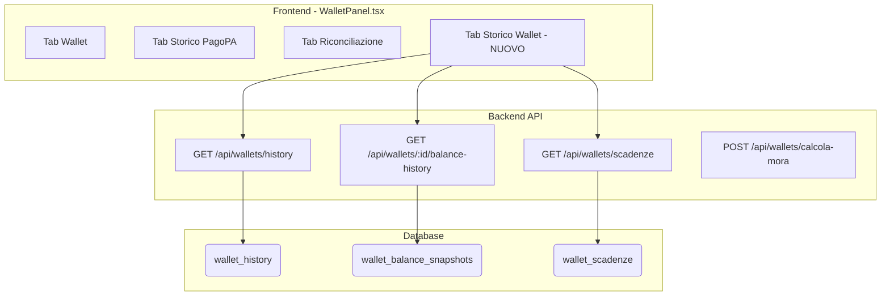
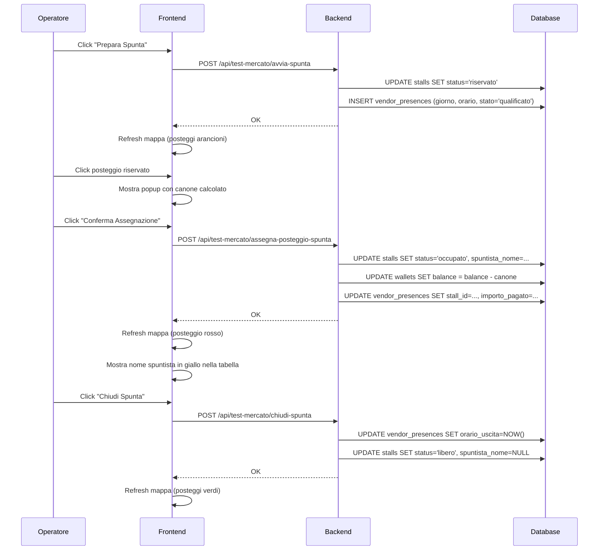

# 🏗️ MIO HUB - BLUEPRINT UNIFICATO DEL SISTEMA

> **Versione:** 3.49.0  
> **Data:** 22 Gennaio 2026  
> **Autore:** Sistema documentato da Manus AI  
> **Stato:** PRODUZIONE

---

## 📋 INDICE

1. [Panoramica Sistema](#panoramica-sistema)
2. [Architettura Completa](#architettura-completa)
3. [Repository GitHub](#repository-github)
4. [Servizi e Componenti](#servizi-e-componenti)
5. [MIO Agent - Sistema Multi-Agente](#mio-agent---sistema-multi-agente)
6. [Knowledge Base DMS](#knowledge-base-dms)
7. [Guardian - Sistema di Monitoraggio](#guardian---sistema-di-monitoraggio)
8. [Database e Storage](#database-e-storage)
9. [API Endpoints](#api-endpoints)
10. [SSO SUAP - Modulo SCIA](#sso-suap---modulo-scia)
11. [Deploy e CI/CD](#deploy-e-cicd)
12. [Credenziali e Accessi](#credenziali-e-accessi)
13. [Troubleshooting](#troubleshooting)
14. [Regole per Agenti AI](#regole-per-agenti-ai)

---

## 🎯 PANORAMICA SISTEMA

### Cos'è MIO HUB?

**MIO HUB** è un ecosistema digitale per la gestione dei mercati ambulanti italiani. Include:

- **DMS HUB** - Dashboard principale per Pubblica Amministrazione
- **MIO Agent** - Sistema multi-agente AI per automazione
- **Guardian** - Sistema di logging e monitoraggio API
- **Gestionale** - Backend per operazioni CRUD

### Stack Tecnologico

| Layer | Tecnologia |
|-------|------------|
| **Frontend** | React 19 + TypeScript + Tailwind CSS 4 + shadcn/ui |
| **Backend** | Node.js + Express + tRPC |
| **Database** | PostgreSQL (Neon) |
| **AI/LLM** | Google Gemini API |
| **Hosting Frontend** | Vercel |
| **Hosting Backend** | Hetzner VPS (157.90.29.66) |
| **CI/CD** | GitHub Actions + PM2 |

---

## 🏛️ ARCHITETTURA COMPLETA

```
┌─────────────────────────────────────────────────────────────────────────────┐
│                              INTERNET                                        │
└─────────────────────────────────────────────────────────────────────────────┘
                                    │
        ┌───────────────────────────┼───────────────────────────┐
        │                           │                           │
        ▼                           ▼                           ▼
┌───────────────┐         ┌─────────────────┐         ┌─────────────────┐
│   VERCEL      │         │  HETZNER VPS    │         │   NEON DB       │
│               │         │  157.90.29.66   │         │                 │
│ dms-hub-app-  │ ◄─────► │                 │ ◄─────► │  PostgreSQL     │
│ new.vercel.app│  API    │ orchestratore.  │  SQL    │  (Serverless)   │
│               │         │ mio-hub.me      │         │                 │
│ ┌───────────┐ │         │ ┌─────────────┐ │         │ ┌─────────────┐ │
│ │ React App │ │         │ │ Express API │ │         │ │ 542 mercati │ │
│ │ + tRPC    │ │         │ │ + PM2       │ │         │ │ + logs      │ │
│ │ client    │ │         │ │             │ │         │ │ + agents    │ │
│ └───────────┘ │         │ └─────────────┘ │         │ └─────────────┘ │
└───────────────┘         └─────────────────┘         └─────────────────┘
        │                           │
        │                           │
        ▼                           ▼
┌───────────────────────────────────────────────────────────────────────────┐
│                         MODULI INTERNI BACKEND                             │
│                                                                            │
│  ┌──────────────┐  ┌──────────────┐  ┌──────────────┐  ┌──────────────┐  │
│  │   GUARDIAN   │  │  MIO AGENT   │  │    LOGS      │  │   HEALTH     │  │
│  │              │  │              │  │              │  │   MONITOR    │  │
│  │ /api/guardian│  │ /api/mihub/  │  │ /api/logs/*  │  │ /api/health/ │  │
│  │ - health     │  │ orchestrator │  │ - createLog  │  │ - full       │  │
│  │ - testEndpoint│ │ - chats      │  │ - getLogs    │  │ - history    │  │
│  │ - logs       │  │ - messages   │  │ - stats      │  │ - alerts     │  │
│  │ - permissions│  │              │  │              │  │              │  │
│  └──────────────┘  └──────────────┘  └──────────────┘  └──────────────┘  │
│                           │                                               │
│                           ▼                                               │
│  ┌────────────────────────────────────────────────────────────────────┐  │
│  │                    ORCHESTRATORE MIO                                │  │
│  │                                                                     │  │
│  │   ┌─────────┐   ┌─────────┐   ┌─────────┐   ┌─────────┐           │  │
│  │   │   MIO   │   │ GPT Dev │   │  Manus  │   │ Abacus  │           │  │
│  │   │ (GPT-5) │──►│ GitHub  │   │ Server  │   │  SQL    │           │  │
│  │   │Coordina │   │  Code   │   │  PM2    │   │ Query   │           │  │
│  │   └─────────┘   └─────────┘   └─────────┘   └─────────┘           │  │
│  │        │                                          │                │  │
│  │        │        ┌─────────┐                       │                │  │
│  │        └───────►│ Zapier  │◄──────────────────────┘                │  │
│  │                 │ Email   │                                        │  │
│  │                 │WhatsApp │                                        │  │
│  │                 │Calendar │                                        │  │
│  │                 └─────────┘                                        │  │
│  └────────────────────────────────────────────────────────────────────┘  │
└───────────────────────────────────────────────────────────────────────────┘
```

---

## 📁 REPOSITORY GITHUB

| Repository | Descrizione | URL |
|------------|-------------|-----|
| **dms-hub-app-new** | Frontend React + tRPC | https://github.com/Chcndr/dms-hub-app-new |
| **mihub-backend-rest** | Backend Express + API | https://github.com/Chcndr/mihub-backend-rest |
| **dms-system-blueprint** | Documentazione sistema | https://github.com/Chcndr/dms-system-blueprint |
| **mio-hub-implementation-deploy** | Script deploy | https://github.com/Chcndr/mio-hub-implementation-deploy |

### Struttura Repository Principale

```
dms-hub-app-new/
├── client/                 # Frontend React
│   ├── src/
│   │   ├── pages/         # Pagine dashboard
│   │   ├── components/    # Componenti UI
│   │   └── lib/           # Utilities
│   └── public/            # Asset statici
├── server/                 # Backend tRPC (Vercel)
│   ├── routers.ts         # Router principale
│   ├── guardianRouter.ts  # Guardian API
│   └── services/          # Servizi business
└── shared/                 # Tipi condivisi

mihub-backend-rest/
├── routes/
│   ├── orchestrator.js    # MIO Agent orchestratore
│   ├── guardian.js        # Guardian API
│   ├── health-monitor.js  # Health check
│   ├── logs.js            # Sistema logging
│   └── integrations.js    # Integrazioni esterne
├── src/
│   └── modules/
│       └── orchestrator/  # Logica multi-agente
│           ├── llm.js     # Chiamate Gemini
│           ├── database.js # DB orchestratore
│           └── *.js       # Tool agenti
└── index.js               # Entry point
```

---

## 🤖 MIO AGENT - SISTEMA MULTI-AGENTE

### Cos'è MIO Agent?

MIO Agent è un **sistema multi-agente interno** che coordina 5 agenti AI specializzati. **NON è un servizio esterno** su un sottodominio separato.

### Endpoint Principale

```
POST https://orchestratore.mio-hub.me/api/mihub/orchestrator
```

### I 5 Agenti

| Agente | Ruolo | Capabilities |
|--------|-------|--------------||
| **MIO** | Coordinatore (Gemini 2.5 Flash) | Smista task, coordina agenti, risponde a saluti |
| **GPT Dev** | Sviluppatore | GitHub, commit, PR, codice, repository info |
| **Manus** | Operatore | SSH, PM2, file system, server status |
| **Abacus** | Analista SQL | Query SQL dirette, query multiple aggregate, analisi dati |
| **Zapier** | Automazioni | Email, WhatsApp, Calendar, Gmail, Google Docs |

### 🔥 Routing Intelligente (v3.3.0)

**Query singole** (es: "Quanti mercati ci sono?"):
- Routing diretto ad **Abacus** senza passare da Gemini
- Risposta immediata con risultato SQL

**Query multiple** (es: "Quanti mercati, posteggi e imprese ci sono?"):
- Routing diretto ad **Abacus** con logica multi-query
- Abacus esegue N query e aggrega i risultati
- Risposta formattata: "📊 Riepilogo Database: Mercati: 2, Posteggi: 564, Imprese: 13"

**Saluti e presentazioni** (es: "Ciao", "Chi sei?"):
- Routing a **MIO** che risponde direttamente senza delegare
- Nessun loop, risposta immediata

### Modalità di Funzionamento

```javascript
// Mode AUTO - MIO decide quale agente usare
POST /api/mihub/orchestrator
{
  "mode": "auto",
  "message": "Quanti mercati ci sono nel database?"
}
// MIO smista ad Abacus

// Mode DIRECT - Chiama agente specifico
POST /api/mihub/orchestrator
{
  "mode": "direct",
  "targetAgent": "manus",
  "message": "Mostra lo stato di PM2"
}
```

### Tabelle Database

```sql
-- Messaggi degli agenti
CREATE TABLE agent_messages (
  id SERIAL PRIMARY KEY,
  conversation_id VARCHAR(255),
  sender VARCHAR(50),
  recipient VARCHAR(50),
  agent VARCHAR(50),
  role VARCHAR(20),
  message TEXT,
  meta JSONB,
  created_at TIMESTAMP DEFAULT NOW()
);

-- Log delle chiamate
CREATE TABLE mio_agent_logs (
  id SERIAL PRIMARY KEY,
  timestamp TIMESTAMP DEFAULT NOW(),
  agent VARCHAR(50),
  service_id VARCHAR(100),
  endpoint VARCHAR(255),
  method VARCHAR(10),
  status_code INTEGER,
  risk VARCHAR(20),
  success BOOLEAN,
  message TEXT,
  meta_json JSONB
);
```

### 📚 Knowledge Base DMS (v1.0 - 30/12/2025)

MIO Agent include una **Knowledge Base completa** con riassunti di 30 documenti PDF strategici del sistema DMS.

**File sorgente:** `mihub-backend-rest/src/modules/orchestrator/llm.js` (righe 249-480)

**Commit:** `0741226 - 🧠 Expand MIO Knowledge Base with 30 DMS documents`

#### Documenti Inclusi nella Knowledge Base

| Categoria | Documenti |
|-----------|----------|
| **Strategici** | ANALISI E SOLUZIONE DMS, HUB NAZIONALE, DOSSIER NAZIONALE, PROGETTO NAZIONALE, **TPASS** |
| **Normativi** | BOLKESTEIN, ONCE ONLY SINGLE DIGITAL GATEWAY, PASSAPORTO DIGITALE EUROPEO |
| **Tecnici** | DMS AL CENTRO DI TUTTO, GEMELLO DMS, PRESENTAZIONE DMS, APP ASSISTENTE |
| **Carbon Credit** | CARBON CREDIT DMS, CARBON CREDIT LOGICA, DMS ECC, EQUILIBRIO ECOSOSTENIBILE, RIEQUILIBRIO |
| **Regionali** | DMS E CLUST-ER (Emilia-Romagna), HUB URBANI E DI PROSSIMITÀ, COSTI PA |
| **Operativi** | RELAZIONE CONTROLLI, USATO TRAFFICO RIMANENZE, DMS SSET (InfoCamere) |

#### Dati Chiave nel System Prompt

| Dato | Valore |
|------|--------|
| Negozi chiusi (2003-2023) | 190.000+ |
| Ambulanti persi | 24.000 (-25.6%) |
| Imprese ambulanti straniere | 53% |
| E-commerce Italia 2023 | €54.2 miliardi |
| Costo attuale PA/anno | €1.2 miliardi |
| Risparmio con DMS | €1.08 miliardi/anno |

#### Formula TPASS/TCO₂

```
TCO₂ (€) = PCF (kgCO₂e) × (ETS_anchor €/t ÷ 1000) × PM
```

- **PCF**: Product Carbon Footprint (impronta carbonica)
- **ETS_anchor**: Prezzo ETS (€80-100/tonnellata)
- **PM**: Policy Multiplier (default 1.0)

#### Gettito Potenziale TPASS

| Scenario | Volume TPASS/anno | Ricavi DMS |
|----------|-------------------|------------|
| Italia | 100M | €5,97M |
| UE Top-5 | 600M | €32,28M |
| UE-27 | 1 miliardo | €54,60M |

---

## 🛡️ GUARDIAN - SISTEMA DI MONITORAGGIO

### Cos'è Guardian?

Guardian è un **modulo interno del backend** che gestisce:
- Logging centralizzato di tutte le chiamate API
- Test endpoint (API Playground)
- Permessi degli agenti
- Statistiche di utilizzo

### Endpoint Guardian

| Endpoint | Metodo | Descrizione |
|----------|--------|-------------|
| `/api/guardian/health` | GET | Health check Guardian |
| `/api/guardian/debug/testEndpoint` | POST | Testa un endpoint API |
| `/api/guardian/logs` | GET | Recupera log agenti |
| `/api/guardian/permissions` | GET | Permessi agenti |
| `/api/logs/createLog` | POST | Crea nuovo log |
| `/api/logs/getLogs` | GET | Lista log con filtri |
| `/api/logs/stats` | GET | Statistiche log |

### Esempio Test Endpoint

```javascript
POST /api/guardian/debug/testEndpoint
{
  "serviceId": "test.api",
  "method": "GET",
  "path": "/api/health",
  "headers": {}
}

// Response
{
  "success": true,
  "request": { "method": "GET", "url": "...", "headers": {...} },
  "response": { "statusCode": 200, "durationMs": 42, "body": {...} }
}
```

---

## 💾 DATABASE E STORAGE

### Database Neon (PostgreSQL)

**Connection String:** Vedi variabile `DATABASE_URL` o `NEON_POSTGRES_URL`

### Tabelle Principali (Dati Reali - 2 Gennaio 2026)

| Tabella | Descrizione | Records |
|---------|-------------|-----------------||
| `markets` | Mercati | **2** |
| `stalls` | Posteggi | **564** |
| `imprese` | Imprese | **13** |
| `vendors` | Operatori | **11** |
| `concessions` | Concessioni | **34** |
| `agent_messages` | Chat agenti | ~500 |
| `mio_agent_logs` | Log API | ~1500 |
| `suap_pratiche` | Pratiche SUAP | **9** |
| `suap_eventi` | Eventi SUAP | variabile |

**Totale tabelle nel database:** 81

### Storage S3

- **Provider:** Cloudflare R2 (compatibile S3)
- **Stato:** In configurazione
- **Uso:** Documenti, allegati, export

---

## 🔌 API ENDPOINTS

### Endpoint Index (460 endpoint totali)

Gli endpoint sono documentati in:
```
/home/ubuntu/dms-hub-app-new/client/public/api-index.json
```

### Categorie Principali

| Categoria | Prefisso | Esempi |
|-----------|----------|--------|
| **DMS Hub** | `/api/trpc/dmsHub.*` | bookings, inspections, locations |
| **Guardian** | `/api/guardian/*` | health, logs, testEndpoint |
| **MIO Hub** | `/api/mihub/*` | orchestrator, chats, messages |
| **Logs** | `/api/logs/*` | createLog, getLogs, stats |
| **Health** | `/api/health/*` | full, history, alerts |
| **GIS** | `/api/gis/*` | market-map |
| **Imprese** | `/api/imprese/*` | qualificazioni, rating |
| **SUAP** | `/api/suap/*` | pratiche, stats, evaluate |
| **TCC v2** | `/api/tcc/v2/*` | wallet-impresa, qualifiche, settlement |

---

## 💚 TCC WALLET-IMPRESA (v5.7.0)

### Cos'è il Sistema TCC Wallet-Impresa?

Il sistema **TCC Wallet-Impresa** collega i wallet Token Carbon Credit (TCC) direttamente alle imprese, implementando un controllo automatico basato sulle qualifiche aziendali. Questo garantisce che solo le imprese in regola possano operare con i crediti di carbonio.

### Funzionalità Principali

| Funzionalità | Descrizione |
|--------------|-------------|
| **Creazione Automatica Wallet** | Quando viene creato un nuovo negozio (shop), il sistema crea automaticamente un wallet TCC collegato all'impresa |
| **Semaforo Qualifiche** | Indicatore visivo (verde/rosso/grigio) che mostra lo stato del wallet basato sulle qualifiche |
| **Sospensione Automatica** | Il wallet viene sospeso automaticamente se le qualifiche scadono o mancano |
| **Blocco Transazioni** | I pulsanti "Assegna TCC" e "Riscuoti TCC" sono disabilitati quando il wallet è sospeso |

### Logica Semaforo Wallet

| Colore | Stato | Condizione |
|--------|-------|------------|
| 🟢 **Verde** | Attivo | Impresa ha almeno una qualifica valida (DURC, HACCP, etc.) |
| 🔴 **Rosso** | Sospeso | Tutte le qualifiche sono scadute o mancanti |
| ⚪ **Grigio** | Nessuna Qualifica | L'impresa non ha mai avuto qualifiche registrate |

### Qualifiche Monitorate

| Tipo | Descrizione | Obbligatorietà |
|------|-------------|----------------|
| DURC | Documento Unico Regolarità Contributiva | Obbligatorio |
| HACCP | Sicurezza Alimentare | Alimentare |
| ONORABILITA | Requisiti Morali Art. 71 | Obbligatorio |
| ANTIMAFIA | Dichiarazione Art. 67 | Obbligatorio |
| SAB | Somministrazione Alimenti | Alimentare |
| ISO 9001/14001 | Certificazioni Qualità | Opzionale |

### API Endpoints TCC Wallet-Impresa

| Endpoint | Metodo | Descrizione |
|----------|--------|-------------|
| `/api/tcc/v2/impresa/:impresaId/wallet` | GET | Recupera wallet TCC con stato qualifiche |
| `/api/tcc/v2/impresa/:impresaId/wallet/create` | POST | Crea nuovo wallet per impresa |
| `/api/tcc/v2/impresa/:impresaId/qualification-status` | GET | Stato qualifiche per semaforo |
| `/api/tcc/v2/impresa/:impresaId/wallet/status` | PUT | Aggiorna stato wallet (active/suspended) |
| `/api/tcc/v2/impresa/:impresaId/wallet/transactions` | GET | Storico transazioni wallet impresa |
| `/api/tcc/v2/impresa/:impresaId/wallet/sync-qualification` | POST | Sincronizza wallet con qualifiche |
| `/api/tcc/v2/wallets/all` | GET | Lista tutti i wallet con stato |

### Tabelle Database Coinvolte

| Tabella | Nuove Colonne | Descrizione |
|---------|---------------|-------------|
| `operator_daily_wallet` | `impresa_id`, `wallet_status` | Collegamento wallet-impresa e stato |
| `hub_shops` | `wallet_enabled` | Flag abilitazione wallet per negozio |
| `qualificazioni` | - | Fonte dati per verifica qualifiche |
| `imprese` | - | Anagrafica imprese |

### Flusso Operativo

```
1. Creazione Negozio (HUB)
   └─► Trigger: Crea wallet TCC automaticamente
       └─► Verifica qualifiche impresa
           ├─► Qualificata → wallet_status = 'active' (🟢)
           └─► Non qualificata → wallet_status = 'suspended' (🔴)

2. Operatore apre Hub Operatore
   └─► Sistema carica wallet e verifica qualifiche
       ├─► Semaforo verde → Pulsanti abilitati
       └─► Semaforo rosso → Pulsanti disabilitati + messaggio

3. Qualifica scade/viene rimossa
   └─► Sync automatico → wallet_status = 'suspended'
       └─► Operatore vede semaforo rosso

4. Qualifica rinnovata
   └─► Sync automatico → wallet_status = 'active'
       └─► Operatore vede semaforo verde
```

### Componenti Frontend

| File | Descrizione |
|------|-------------|
| `WalletStatusIndicator.jsx` | Componente semaforo nell'header Hub Operatore |
| `HubOperatore.jsx` | Dashboard operatore con pulsanti TCC |
| `ImpresaCard.jsx` | Card impresa con indicatore stato wallet |

### Impresa di Test

| Campo | Valore |
|-------|--------|
| Nome | MIO TEST |
| P.IVA | 01010101010 |
| ID | 38 |
| Operatore | Luca Bianchi (ID: 1) |

---

### 🆕 Aggiornamenti Settlement v5.8.0 (12 Gennaio 2026)

#### Numero Progressivo Settlement
Ogni chiusura giornata ora genera un **numero progressivo univoco** per tracciabilità:

| Campo | Formato | Esempio |
|-------|---------|---------|
| `settlement_number` | `YYYYMMDD-NNNN` | `20260112-0001` |

#### Multiple Chiusure Giornaliere
Il sistema ora supporta **multiple chiusure nello stesso giorno**:
- Non è un sistema fiscale, quindi non c'è limite alle chiusure
- Ogni chiusura crea un nuovo wallet con contatori azzerati
- Il numero progressivo distingue le chiusure dello stesso giorno

#### Modifiche Database
| Tabella | Modifica | Descrizione |
|---------|----------|-------------|
| `operator_daily_wallet` | `+settlement_number` | Numero progressivo chiusura |
| `operator_daily_wallet` | `-UNIQUE(operator_id, date)` | Rimosso vincolo per multiple chiusure |

#### Flusso Settlement Aggiornato
```
1. Operatore clicca "Chiudi Giornata"
   └─► Sistema genera settlement_number (es. 20260112-0001)
       └─► Wallet corrente → status = 'pending'
           └─► Crea NUOVO wallet per OGGI (non domani!)
               └─► Contatori azzerati, status = 'open'
                   └─► Frontend mostra nuovo wallet immediatamente

2. Storico Transazioni
   └─► Mostra "Chiusura Giornata #20260112-0001"
       └─► Numero visibile per tracciabilità
```

#### Migrazione Applicata
```sql
-- migrations/020_add_settlement_number.sql
ALTER TABLE operator_daily_wallet ADD COLUMN settlement_number VARCHAR(20);
CREATE INDEX idx_operator_daily_wallet_settlement_number ON operator_daily_wallet(settlement_number);
```


### 🆕 Aggiornamenti TCC v5.9.0 (13 Gennaio 2026)

#### Numeri Progressivi Transazioni
Tutte le transazioni TCC ora hanno un **numero progressivo univoco** per tracciabilità completa:

| Tipo Transazione | Formato Numero | Esempio |
|------------------|----------------|---------|
| **Vendita (issue)** | `#TRX-YYYYMMDD-NNNNNN` | `#TRX-20260113-000001` |
| **Pagamento TCC (redeem)** | `#TRX-YYYYMMDD-NNNNNN` | `#TRX-20260113-000002` |
| **Chiusura Giornata** | `#YYYYMMDD-NNNN` | `#20260113-0003` |
| **Rimborso Ricevuto** | `#YYYYMMDD-NNNN` | `#20260113-0003` |
| **Batch Rimborsi** | `[#YYYYMMDD-NNNN, ...]` | `[#20260113-0003]` |

#### Scanner QR "Incassa TCC" Migliorato
L'operatore ora vede i dettagli del cliente prima di incassare:

| Campo | Descrizione |
|-------|-------------|
| **Nome Cliente** | Nome completo del cliente |
| **Saldo Wallet** | TCC disponibili nel wallet cliente |
| **TCC da Incassare** | Importo TCC della transazione |
| **Valore Euro** | Controvalore in euro |

#### Nuovo Endpoint API
```
POST /api/tcc/v2/operator/validate-spend-qr
Body: { "qr_data": "tcc-spend://userId/token" }
Response: { customer_name, wallet_balance, tcc_amount, euro_amount }
```

#### Flusso Incasso TCC Aggiornato
```
1. Cliente genera QR di spesa (valido 15 minuti)
   └─► App cliente mostra QR con importo TCC

2. Operatore scansiona QR
   └─► Sistema valida token e recupera info cliente
       └─► Mostra: Nome, Saldo, TCC, Euro
           └─► Operatore conferma "Incassa X TCC (€Y)"
               └─► Transazione completata con numero progressivo
```

#### Fix Applicati
- ✅ **Wallet Query:** Restituisce sempre il wallet "open" indipendentemente dalla data
- ✅ **Date Rimborsi:** Formato DD/MM/YYYY invece di oggetto Date raw
- ✅ **Autocomplete Off:** Rimosso popup password Safari sui campi input
- ✅ **Numeri in Batch:** I batch rimborsi mostrano i settlement numbers

## 📋 SSO SUAP - MODULO SCIA

### Cos'è SSO SUAP?

Il modulo **SSO SUAP** (Sportello Unico Attività Produttive) gestisce le pratiche SCIA per il commercio su aree pubbliche. Include:

- **Dashboard SUAP** - Panoramica pratiche con statistiche
- **Form SCIA Guidato** - Compilazione assistita con dropdown dinamici
- **Valutazione Automatica v2.0** - Motore verifica con 23 controlli reali
- **Gestione Pratiche** - Lista, dettaglio, timeline eventi

### Struttura Tabella `suap_pratiche` (69 colonne)

| Categoria | Campi Principali |
|-----------|------------------|
| **Pratica** | id, ente_id, cui, tipo_pratica, stato, data_presentazione, numero_protocollo, comune_presentazione |
| **Tipologia** | tipo_segnalazione, motivo_subingresso, settore_merceologico, ruolo_dichiarante |
| **Subentrante** | richiedente_cf, sub_ragione_sociale, sub_nome, sub_cognome, sub_data_nascita, sub_luogo_nascita, sub_residenza_*, sub_sede_*, sub_pec, sub_telefono |
| **Cedente** | ced_cf, ced_ragione_sociale, ced_nome, ced_cognome, ced_data_nascita, ced_residenza_*, ced_pec, ced_scia_precedente |
| **Mercato** | mercato_id, mercato_nome, posteggio_id, posteggio_numero, ubicazione_mercato, giorno_mercato, fila, dimensioni_mq, dimensioni_lineari, attrezzature |
| **Atto Notarile** | notaio_rogante, numero_repertorio, data_atto |
| **Delegato** | del_nome, del_cognome, del_cf, del_data_nascita, del_luogo_nascita, del_qualifica, del_residenza_* |
| **Valutazione** | esito_automatico, score, created_at, updated_at |

### API Endpoints SUAP

| Endpoint | Metodo | Descrizione |
|----------|--------|-------------|
| `/api/suap/pratiche` | GET | Lista pratiche con filtri |
| `/api/suap/pratiche` | POST | Crea nuova pratica SCIA |
| `/api/suap/pratiche/:id` | GET | Dettaglio pratica con timeline e checks |
| `/api/suap/pratiche/:id/evaluate` | POST | Esegui valutazione automatica |
| `/api/suap/stats` | GET | Statistiche dashboard |

### Form SCIA - Sezioni

1. **Dati Pratica SCIA** - Numero protocollo (auto-generato SCIA-YYYY-NNNN), data e comune presentazione
2. **Tipo di Segnalazione** - Subingresso, Cessazione, Sospensione, Ripresa, Modifica RS, Variazione
3. **Tipologia Attività** - Settore merceologico (Alimentare/Non Alimentare/Misto), Ruolo dichiarante
4. **Dati Delegato** (condizionale) - Appare se ruolo ≠ Titolare
5. **Dati Subentrante** - CF/P.IVA con ricerca automatica, dati anagrafici, residenza, sede impresa
6. **Dati Cedente** - Compilazione automatica da posteggio selezionato
7. **Dati Posteggio e Mercato** - Dropdown dinamici con dati reali
8. **Estremi Atto Notarile** - Notaio, repertorio, data

### Motore Verifica SCIA v2.0

Il motore di verifica esegue **23 controlli automatici** su dati reali del sistema:

| Categoria | Controlli | Fonte Dati |
|-----------|-----------|------------|
| **Subentrante** | DURC, Onorabilità, Antimafia, Impresa Attiva, Limite Posteggi, Alimentare, HACCP | qualificazioni, imprese, concessions |
| **Cedente** | DURC, Onorabilità, Antimafia, Canone Unico | qualificazioni, wallets |
| **Pratica** | Dati Completi, PEC, Atto Notarile | suap_pratiche |

**Logica Limite Posteggi:**
- Mercato ≤ 100 posti: max **2 posteggi** per impresa
- Mercato > 100 posti: max **3 posteggi** per impresa

**Esiti Valutazione:**
- `AUTO_OK` - Score ≥ 80 (approvazione automatica)
- `REVIEW_NEEDED` - Score 50-79 (revisione manuale)
- `REJECTED` - Score < 50 (rigetto)

### Tipi Qualificazione Supportati

| Tipo | Descrizione | Categoria |
|------|-------------|----------|
| DURC | Regolarità Contributiva | Obbligatorio |
| ONORABILITA | Requisiti Morali Art. 71 D.Lgs. 59/2010 | Obbligatorio |
| ANTIMAFIA | Dichiarazione Art. 67 D.Lgs. 159/2011 | Obbligatorio |
| SAB | Somministrazione Alimenti e Bevande | Alimentare |
| REC | Registro Esercenti Commercio | Alimentare |
| CORSO_ALIMENTARE | Formazione Regionale | Alimentare |
| HACCP | Sicurezza Alimentare | Alimentare |
| ISO 9001/14001/22000 | Certificazioni Qualità | Opzionale |

### File Principali

| File | Descrizione |
|------|-------------|
| `client/src/pages/suap/SuapDashboard.tsx` | Dashboard principale SUAP |
| `client/src/pages/suap/SuapDetail.tsx` | Dettaglio pratica con tutti i dati |
| `client/src/pages/suap/SuapList.tsx` | Lista pratiche con filtri |
| `client/src/components/suap/SciaForm.tsx` | Form compilazione SCIA guidato |
| `client/src/components/SuapPanel.tsx` | Pannello SUAP con controlli v2.0 |
| `client/src/api/suap.ts` | Client API SUAP |
| `mihub-backend-rest/src/modules/suap/service.js` | Service backend SUAP + Motore Verifica v2.0 |
| `mihub-backend-rest/routes/suap.js` | Routes API SUAP |


### API Endpoints Concessioni (v2.0 - 3 Gennaio 2026)

Il sistema di gestione concessioni è stato completamente aggiornato per supportare il **subingresso automatico** con trasferimento posteggio e wallet.

| Endpoint | Metodo | Descrizione |
|----------|--------|-------------|
| `/api/concessions` | GET | Lista concessioni con filtri (market_id, vendor_id, active_only) |
| `/api/concessions/:id` | GET | Dettaglio singola concessione |
| `/api/concessions` | POST | **Crea nuova concessione** - Gestisce automaticamente subingresso |
| `/api/concessions/:id` | PUT | Aggiorna tutti i campi di una concessione |
| `/api/concessions/:id` | PATCH | Aggiorna campi specifici |
| `/api/concessions/:id` | DELETE | Elimina concessione e libera posteggio |
| `/api/concessions/:id/associa-posteggio` | POST | Associa posteggio per subingresso manuale |

#### Logica Subingresso Automatico (v2.0)

Il `POST /api/concessions` rileva automaticamente un subingresso quando:
- `tipo_concessione = 'subingresso'` **oppure**
- È presente `cedente_impresa_id`

**Flusso automatico:**
1. Verifica se esiste concessione attiva per il posteggio
2. Se subingresso:
   - Chiude la concessione del cedente (stato = CESSATA)
   - Trasferisce il saldo del wallet al subentrante
   - Crea la nuova concessione per il subentrante
   - Aggiorna lo stato del posteggio
3. Se NON subingresso ma esiste overlap → errore 409

#### Campi Supportati (60+ campi)

| Categoria | Campi |
|-----------|-------|
| **Generali** | numero_protocollo, data_protocollazione, oggetto, numero_file |
| **Concessione** | durata_anni, data_decorrenza, tipo_concessione, sottotipo_conversione, stato |
| **Concessionario** | cf_concessionario, partita_iva, ragione_sociale, qualita, nome, cognome, data_nascita, luogo_nascita |
| **Residenza** | residenza_via, residenza_comune, residenza_provincia, residenza_cap |
| **Sede Legale** | sede_legale_via, sede_legale_comune, sede_legale_provincia, sede_legale_cap |
| **Cedente** | cedente_cf, cedente_partita_iva, cedente_ragione_sociale, cedente_impresa_id |
| **Posteggio** | fila, mq, dimensioni_lineari, giorno, tipo_posteggio, attrezzature, ubicazione |
| **Conversione** | merceologia_precedente, merceologia_nuova, dimensioni_precedenti, dimensioni_nuove |
| **Economici** | canone_unico |
| **Riferimenti** | scia_precedente_numero, scia_precedente_data, scia_precedente_comune, scia_id |
| **Allegati** | planimetria_allegata, prescrizioni |

#### Esempio Chiamata Subingresso

```json
POST /api/concessions
{
  "market_id": 1,
  "stall_id": 7,
  "impresa_id": 4,
  "tipo_concessione": "subingresso",
  "cedente_impresa_id": 9,
  "valid_from": "2025-01-03",
  "valid_to": "2035-01-03",
  "durata_anni": 10,
  "settore_merceologico": "Alimentare",
  "numero_protocollo": "CONC-2025-001"
}
```

**Risposta:**
```json
{
  "success": true,
  "data": {
    "concession": { "id": 34, "stato": "ATTIVA", ... },
    "vendor_id": 17,
    "impresa_id": 4,
    "subingresso": {
      "old_concession_id": 16,
      "old_impresa_id": 9,
      "wallet_transferred": true,
      "transferred_balance": 150.00
    }
  },
  "message": "Subingresso completato con successo. Concessione 16 cessata, nuova concessione 34 creata."
}
```

#### File Principali Concessioni

| File | Descrizione |
|------|-------------|
| `mihub-backend-rest/routes/concessions.js` | API REST concessioni (1200+ righe) |
| `client/src/components/suap/ConcessioneForm.tsx` | Form frontespizio concessione |
| `client/src/pages/MarketCompaniesTab.tsx` | Tab concessioni nel mercato |

---

## 🚀 DEPLOY E CI/CD

### ⚠️ REGOLA FONDAMENTALE

```
╔═══════════════════════════════════════════════════════════════════╗
║  NON FARE MAI SSH MANUALE PER DEPLOY!                             ║
║  Il sistema è AUTO-DEPLOY tramite GitHub Actions                  ║
╚═══════════════════════════════════════════════════════════════════╝
```

### Flusso Deploy

```
┌─────────────┐     ┌─────────────┐     ┌─────────────┐     ┌─────────────┐
│   COMMIT    │────►│    PUSH     │────►│   GITHUB    │────►│   DEPLOY    │
│   locale    │     │   GitHub    │     │   Actions   │     │ automatico  │
└─────────────┘     └─────────────┘     └─────────────┘     └─────────────┘
                                              │
                    ┌─────────────────────────┼─────────────────────────┐
                    │                         │                         │
                    ▼                         ▼                         ▼
            ┌─────────────┐           ┌─────────────┐           ┌─────────────┐
            │   VERCEL    │           │   HETZNER   │           │    NEON     │
            │  Frontend   │           │   Backend   │           │  Database   │
            │  (auto)     │           │  (webhook)  │           │  (migrate)  │
            └─────────────┘           └─────────────┘           └─────────────┘
```

### Procedura Corretta

```bash
# 1. Modifica codice
# 2. Commit
git add .
git commit -m "feat: descrizione modifica"

# 3. Push (triggera auto-deploy)
git push origin master

# 4. Verifica (dopo 2-3 minuti)
curl https://orchestratore.mio-hub.me/api/health
```

---

## 🔐 CREDENZIALI E ACCESSI

### Variabili d'Ambiente Backend

| Variabile | Descrizione |
|-----------|-------------|
| `DATABASE_URL` | Connection string Neon |
| `GEMINI_API_KEY` | API key Google Gemini |
| `GITHUB_TOKEN` | Token GitHub per GPT Dev |
| `SSH_PRIVATE_KEY` | Chiave SSH per Manus |
| `ZAPIER_WEBHOOK_URL` | Webhook Zapier |
| `VERCEL_TOKEN` | Token deploy Vercel |

### Accessi Server

| Risorsa | Accesso |
|---------|---------|
| **Hetzner VPS** | SSH con chiave (solo per emergenze) |
| **Neon Dashboard** | https://console.neon.tech |
| **Vercel Dashboard** | https://vercel.com/dashboard |
| **GitHub** | https://github.com/Chcndr |

---

## 🔧 TROUBLESHOOTING

### Health Monitor mostra servizi Offline

| Servizio | Problema | Soluzione |
|----------|----------|-----------|
| Guardian | Era configurato su URL esterno inesistente | ✅ Fixato v2.1.0 - ora check interno |
| MIO Agent | Era configurato su URL esterno inesistente | ✅ Fixato v2.1.0 - ora check interno |
| S3 | Non configurato | Configurare quando necessario |
| PDND | Non configurato | Normale - per uso futuro |

### Backend non risponde

```bash
# Verifica stato PM2 (solo emergenza)
ssh user@157.90.29.66 "pm2 status"

# Riavvia (solo emergenza)
ssh user@157.90.29.66 "pm2 restart mihub-backend"
```

### Script Autoheal (Cron ogni 15 min)

**File:** `/root/mihub-backend-rest/scripts/autoheal.sh`

```bash
#!/bin/bash
URL="https://orchestratore.mio-hub.me/health"  # ⚠️ IMPORTANTE: usa /health, NON /api/mihub/status
if ! curl -fs $URL >/dev/null; then
  echo "$(date) – Orchestrator down, restarting..." >> /var/log/mio-autoheal.log
  cd /root/mihub-backend-rest && pm2 restart mihub-backend
fi
```

**Log:** `/var/log/mio-autoheal.log`

**Cron:** `*/15 * * * * /root/mihub-backend-rest/scripts/autoheal.sh`

### Frontend non si aggiorna

1. Verifica deploy Vercel: https://vercel.com/dashboard
2. Controlla build logs
3. Forza rebuild: push commit vuoto

---

## 🤖 REGOLE PER AGENTI AI

### ❌ NON FARE MAI

1. **NON** fare SSH manuale per deploy
2. **NON** modificare file direttamente sul server
3. **NON** creare nuovi repository paralleli
4. **NON** hardcodare URL endpoint nel frontend
5. **NON** modificare senza leggere prima questo Blueprint

### ✅ FARE SEMPRE

1. **LEGGERE** questo Blueprint prima di ogni modifica
2. **USARE** git commit + push per deploy
3. **VERIFICARE** api-index.json per endpoint
4. **TESTARE** con /api/health/full dopo modifiche
5. **DOCUMENTARE** ogni modifica significativa

### Checklist Pre-Modifica

- [ ] Ho letto il Blueprint?
- [ ] Ho verificato l'architettura esistente?
- [ ] Sto usando i repository corretti?
- [ ] Il mio deploy usa git push (non SSH)?
- [ ] Ho aggiornato la documentazione?

---

## 📊 STATO ATTUALE SISTEMA

### Servizi Online ✅

| Servizio | URL | Stato |
|----------|-----|-------|
| Frontend | https://dms-hub-app-new.vercel.app | ✅ Online |
| Backend | https://orchestratore.mio-hub.me | ✅ Online |
| Database | Neon PostgreSQL | ✅ Online |
| MIO Agent | /api/mihub/orchestrator | ✅ Funzionante |
| Guardian | /api/guardian/* | ✅ Funzionante |

### Statistiche

- **Endpoint totali:** 448 (136 REST + 312 tRPC)
- **Endpoint Comuni PA:** 25
- **Mercati nel DB:** 3 (Grosseto, Novi Sad, Modena)
- **HUB nel DB:** 79
- **Comuni registrati:** 5
- **Posteggi totali:** 564 (160 con geometria)
- **Concessioni attive:** 6
- **Utenti TCC:** 3
- **TCC in circolazione:** 1.254
- **Log totali:** ~2000
- **Agenti attivi:** 5 (MIO, GPT Dev, Manus, Abacus, Zapier)
- **Secrets configurati:** 10/10

---

## 📚 DOCUMENTAZIONE CORRELATA

Questo Blueprint unificato si integra con la documentazione esistente nel repository:

### LIVE_SYSTEM_DEC2025/

Documentazione del sistema funzionante in produzione:

| Cartella | Contenuto |
|----------|----------|
| `01_ARCHITECTURE/` | Architettura "8 Isole", flusso dati, deployment |
| `02_BACKEND_CORE/` | API map, LLM Engine, sistema tools |
| `03_DATABASE_SCHEMA/` | Schema PostgreSQL, query, migrazioni |
| `04_FRONTEND_DASHBOARD/` | 27 tabs dashboard, componenti, state management |

### 00_LEGACY_ARCHIVE/

Archivio storico con 87 documenti Markdown:

| Cartella | Contenuto |
|----------|----------|
| `01_architettura/` | MASTER_SYSTEM_PLAN, AS-IS/TO-BE, integrazioni |
| `01_architettura/legacy/` | Documentazione teorica vecchia |
| `01_architettura/legacy/root_legacy/` | CREDENZIALI, BACKEND_UFFICIALE, GIS_SYSTEM |
| `07_guide_operative/` | Guide deploy e troubleshooting |

### ROADMAP_2025/

Piano sviluppo organizzato per quarter:

| Quarter | Obiettivi Principali |
|---------|---------------------|
| **Q1 2025** | TAB Clienti/Prodotti, PDND, performance <2s |
| **Q2 2025** | TAB Sostenibilità/TPAS, IoT, 1000+ utenti |
| **Q3-Q4 2025** | Carbon Credits blockchain, TPER, 10.000+ utenti |

---


---

## 🚀 PROGETTO: Funzionalità "Nuovo Negozio" per HUB

> **Versione Target:** 3.18.0
> **Data Pianificazione:** 7 Gennaio 2026
> **Stato:** ✅ COMPLETATO (14 Gen 2026)

### Obiettivo

Permettere agli utenti di creare nuovi negozi/vetrine direttamente dalla lista Vetrine Commercianti, con:
1. Creazione automatica di una scheda impresa minima
2. Creazione del negozio (hub_shop) collegato all'HUB
3. Generazione automatica del point GIS sulla mappa

### Flusso Utente

```
Lista Vetrine → Tab "Nuovo Negozio" → Form Dati Essenziali → Salva
                                                              ↓
                                              ┌────────────────────────────────┐
                                              │ 1. Crea record in `imprese`    │
                                              │ 2. Crea record in `hub_shops`  │
                                              │ 3. Genera point GIS            │
                                              └────────────────────────────────┘
```

### Tabelle Database Coinvolte

| Tabella | Campi Obbligatori | Descrizione |
|---------|-------------------|-------------|
| `imprese` | id, denominazione, partita_iva, codice_fiscale, comune | Anagrafica impresa |
| `hub_shops` | id, hub_id, name, status | Negozio nell'HUB |
| `hub_locations` | - | HUB di riferimento (già esistente) |

### Campi Form "Nuovo Negozio"

| Campo | Obbligatorio | Mappa a | Note |
|-------|--------------|---------|------|
| Ragione Sociale | ✅ | imprese.denominazione, hub_shops.name | Nome negozio |
| Partita IVA | ✅ | imprese.partita_iva, hub_shops.vat_number | 11 caratteri |
| Codice Fiscale | ✅ | imprese.codice_fiscale | 16 caratteri |
| Comune | ✅ | imprese.comune | Città sede legale |
| Categoria | ❌ | hub_shops.category | Tipo attività |
| Telefono | ❌ | imprese.telefono, hub_shops.phone | Contatto |
| Email | ❌ | imprese.email, hub_shops.email | Contatto |
| HUB di Riferimento | ✅ | hub_shops.hub_id | Dropdown HUB disponibili |

### API Endpoints da Creare/Modificare

| Endpoint | Metodo | Descrizione |
|----------|--------|-------------|
| `/api/hub/shops/create-with-impresa` | POST | Crea impresa + shop in transazione |

### Logica Backend (Transazione Atomica)

```javascript
// POST /api/hub/shops/create-with-impresa
async function createShopWithImpresa(req, res) {
  const client = await pool.connect();
  try {
    await client.query('BEGIN');
    
    // 1. Crea impresa minima
    const impresaResult = await client.query(`
      INSERT INTO imprese (denominazione, partita_iva, codice_fiscale, comune, telefono, email, created_at)
      VALUES ($1, $2, $3, $4, $5, $6, NOW())
      RETURNING id
    `, [denominazione, partitaIva, codiceFiscale, comune, telefono, email]);
    
    const impresaId = impresaResult.rows[0].id;
    
    // 2. Crea hub_shop collegato
    const shopResult = await client.query(`
      INSERT INTO hub_shops (hub_id, name, category, owner_id, business_name, vat_number, phone, email, lat, lng, status, created_at, updated_at)
      VALUES ($1, $2, $3, $4, $5, $6, $7, $8, $9, $10, 'active', NOW(), NOW())
      RETURNING id
    `, [hubId, denominazione, categoria, impresaId, denominazione, partitaIva, telefono, email, lat, lng]);
    
    await client.query('COMMIT');
    
    res.json({ success: true, impresaId, shopId: shopResult.rows[0].id });
  } catch (error) {
    await client.query('ROLLBACK');
    res.status(500).json({ success: false, error: error.message });
  }
}
```

### Componenti Frontend da Creare/Modificare

| File | Modifica |
|------|----------|
| `VetrinePage.tsx` | Aggiungere tab "Nuovo Negozio" nella lista |
| `NuovoNegozioForm.tsx` | Nuovo componente form creazione |
| `GestioneHubNegozi.tsx` | Aggiungere pulsante "+" per nuovo negozio |

### Coordinate GIS per Nuovo Negozio

Per il point GIS del nuovo negozio:
- **Opzione 1:** Usa centro dell'HUB selezionato (hub_locations.center_lat/center_lng)
- **Opzione 2:** Permetti selezione manuale su mappa (futuro)
- **Opzione 3:** Calcola posizione automatica basata su negozi esistenti

### Checklist Implementazione

- [ ] Backend: Endpoint `/api/hub/shops/create-with-impresa`
- [ ] Frontend: Tab "Nuovo Negozio" in VetrinePage
- [ ] Frontend: Form con validazione campi obbligatori
- [ ] Frontend: Dropdown selezione HUB
- [ ] Frontend: Feedback successo/errore
- [ ] Test: Verifica creazione impresa + shop
- [ ] Test: Verifica visualizzazione in mappa HUB
- [ ] Deploy: Push e verifica su produzione


## 🆕 PROGETTO: GESTIONE CANONE UNICO E MORE (v3.35.0)

> **Data Progetto:** 14 Gennaio 2026  
> **Autore:** Manus AI  
> **Stato:** ✅ COMPLETATO (14 Gen 2026)

### Obiettivo

Implementare un sistema completo per la gestione del **Canone Unico Patrimoniale (CUP)**, includendo calcolo, scadenze, more, pagamenti straordinari e un **sistema di blocco automatico/manuale per le concessioni non pagate**.

### Architettura Frontend

**Nuovo Sotto-Tab:** "Canone Unico" nel `WalletPanel.tsx`

**Componenti:**
1.  **`CanoneUnicoPanel`**: Componente principale del nuovo tab.
    -   **Filtri**: Dropdown "Mercato/Fiera", Dropdown "Tipo Operatore", Search "Impresa/P.IVA".
    -   **Tabella Scadenze**: Elenco scadenze con stato (Pagato, Scaduto, **Bloccato**), giorni ritardo, importi.
    -   **Azioni**: "Genera Avviso Mora", "Genera Pagamento Straordinario".
    -   **Selettore Blocco Manuale**: Toggle "Blocca/Sblocca" per il dirigente (visibile solo in modalità manuale).

2.  **`CalcoloMoraDialog`**: Dialog con dettaglio calcolo mora e interessi.

3.  **`PagamentoStraordinarioDialog`**: Dialog per creare pagamenti per eventi specifici (fiere, etc.).

### 💎 Logica di Blocco/Sblocco Concessione

Sarà aggiunta un'impostazione a livello di Comune (`comuni.blocco_automatico_pagamenti` - boolean) per scegliere la modalità di gestione dei mancati pagamenti:

-   **Modalità Automatica (Default)**:
    1.  **Blocco**: Se il canone non viene pagato entro X giorni dalla scadenza (default 30), il sistema **sospende automaticamente la concessione** (`concessions.status = 'SOSPESA'`).
    2.  **Effetto**: L'operatore non potrà registrare la presenza al mercato.
    3.  **Sblocco**: Appena il sistema riceve la notifica di pagamento (tramite PagoPA), la concessione viene **riattivata automaticamente** (`concessions.status = 'ATTIVA'`).

-   **Modalità Manuale**:
    1.  **Notifica**: Se il canone non viene pagato, il sistema invia una **notifica al dirigente** nell'area "Notifiche" e mostra un alert nella tabella del "Canone Unico".
    2.  **Azione**: Il dirigente può usare il **selettore (toggle) "Blocca/Sblocca"** per decidere manualmente se sospendere la concessione.

### Architettura Backend

**Modifiche al Database:**
-   Aggiungere `status VARCHAR(20) DEFAULT 'ATTIVA'` alla tabella `concessions`.
-   Aggiungere `blocco_automatico_pagamenti BOOLEAN DEFAULT true` alla tabella `comuni`.

**Logica Aggiuntiva:**
-   Un **processo giornaliero (cron job)** verificherà le scadenze e applicherà il blocco automatico se attivo.
-   L'endpoint per la **registrazione delle presenze** (`POST /api/gis/presenze`) verificherà lo `status` della concessione.

**Nuovi Endpoint API:**

| Endpoint | Metodo | Descrizione |
|---|---|---|
| `POST /api/wallet-scadenze/genera-canone-annuo` | POST | Genera le scadenze del canone annuo per tutti i posteggi attivi |
| `POST /api/wallet-scadenze/genera-pagamento-straordinario` | POST | Genera avvisi di pagamento per un mercato/fiera straordinaria |
| `GET /api/wallet-scadenze/riepilogo` | GET | Riepilogo scadenze con filtri per mercato, tipo operatore, etc. |
| `PUT /api/concessions/:id/status` | PUT | Endpoint per il blocco/sblocco manuale del dirigente |

---

### 📝 CHANGELOG

### v3.44.0 (20/01/2026) - Form Registrazione Attestati

**Backend - Nuovi Endpoint `/api/formazione/*`:**
- `GET /api/formazione/imprese/search?q=` - Ricerca imprese per nome/PIVA/CF
- `GET /api/formazione/tipi-attestato` - Lista tipi attestato disponibili
- `POST /api/formazione/attestati` - Registra nuovo attestato
- `GET /api/formazione/attestati` - Lista attestati (filtrabile per impresa/ente/tipo)

**Frontend - Tab Documentazione → Enti Formatori:**
- Form "Registra Nuovo Attestato" con:
  - Ricerca impresa con autocomplete live
  - Selezione tipo attestato (11 tipi: HACCP, Sicurezza Lavoro, Antincendio, Primo Soccorso, Privacy GDPR, Igiene Alimentare, RSPP, RLS, Carrellista, PES/PAV, Altro)
  - Date rilascio e scadenza
  - Campi opzionali: Ente rilascio, N. Attestato, Ore formazione, Docente, Note
  - Salvataggio in tabella `qualificazioni`

**Flusso Operativo:**
1. Ente formatore cerca impresa digitando nome/PIVA
2. Seleziona dall'elenco dropdown autocomplete
3. Compila tipo attestato, date, dettagli corso
4. Clicca "Registra Attestato"
5. L'attestato viene salvato e appare nella sezione Qualificazione dell'impresa

**Index.json Aggiornato:**
- Versione: 29
- Totale endpoint: 433 (+4)

---

### v3.43.0 (20/01/2026) - Tab Documentazione con Enti Formatori e Bandi

**Nuove Tabelle Database:**
- `formazione_enti` - Anagrafica enti formatori accreditati (5 record)
- `formazione_corsi` - Catalogo corsi di formazione (6 record)
- `bandi_associazioni` - Anagrafica associazioni partner (5 record)
- `bandi_catalogo` - Catalogo bandi disponibili (8 record)

**Backend - Nuovi Endpoint `/api/formazione/*`:**
- `GET /api/formazione/enti` - Lista enti formatori accreditati
- `POST /api/formazione/enti` - Crea nuovo ente formatore
- `GET /api/formazione/enti/:id` - Dettaglio ente con corsi
- `PUT /api/formazione/enti/:id` - Aggiorna ente formatore
- `GET /api/formazione/corsi` - Lista corsi disponibili
- `POST /api/formazione/corsi` - Crea nuovo corso
- `GET /api/formazione/corsi/:id` - Dettaglio corso
- `GET /api/formazione/stats` - Statistiche formazione

**Backend - Nuovi Endpoint `/api/bandi/*`:**
- `GET /api/bandi/associazioni` - Lista associazioni partner
- `POST /api/bandi/associazioni` - Crea nuova associazione
- `GET /api/bandi/associazioni/:id` - Dettaglio associazione
- `PUT /api/bandi/associazioni/:id` - Aggiorna associazione
- `GET /api/bandi/catalogo` - Lista bandi disponibili
- `POST /api/bandi/catalogo` - Crea nuovo bando
- `GET /api/bandi/catalogo/:id` - Dettaglio bando
- `GET /api/bandi/matching/:bando_id` - Matching imprese-bando
- `GET /api/bandi/stats` - Statistiche bandi

**Frontend - Tab Documentazione:**
- Sotto-tab "Enti Formatori":
  - 4 KPI: Enti Accreditati, Corsi Programmati, Completati, In Corso
  - Lista enti con rating e specializzazioni
  - Catalogo corsi con prezzi, durata, posti
- Sotto-tab "Associazioni & Bandi":
  - 4 KPI: Associazioni Partner, Bandi Aperti, Importo Totale, Rating
  - Lista associazioni con success rate
  - Catalogo bandi con importi e scadenze

**Index.json Aggiornato:**
- Versione: 28
- Totale endpoint: 429 (+22)
- Nuove categorie: Formazione (8), Bandi (9), Stats Qualificazione (5)

---

### v3.42.0 (20/01/2026) - Tab Qualificazione Imprese con Dati Reali

**Backend - Nuovi Endpoint `/api/stats/qualificazione/*`:**
- `GET /api/stats/qualificazione/overview` - KPI conformità imprese
  - Totale imprese: 28
  - Conformi: 0 (0%)
  - Con riserva: 3 (10.7%)
  - Non conformi: 4 (14.3%)
  - Non verificati: 21 (75%)
- `GET /api/stats/qualificazione/scadenze` - Scadenze qualifiche nei prossimi 90 giorni
  - 7 scadenze imminenti (da tabella `qualificazioni`)
- `GET /api/stats/qualificazione/demografia` - Demografia imprese
  - Aperture 2026: 15
  - Cessazioni 2026: 0
  - Crescita netta: +15
  - Per settore: 10 settori diversi
- `GET /api/stats/qualificazione/top-imprese` - Top 5 imprese per rating
  - Ordinate per rating e score_digitalizzazione
- `GET /api/stats/qualificazione/indici` - Indici strategici
  - Riqualificazione: 0% (nessuna impresa riqualificata)
  - Digitalizzazione: 45% (media score_digitalizzazione)
  - Sostenibilità: 100% (tutte le imprese con wallet TCC)
  - Conformità: 97.1% (qualifiche valide vs totali)

**Frontend - Tab Qualificazione Aggiornato:**
- **KPI Conformità** - Collegati a `/api/stats/qualificazione/overview`
  - Pienamente Conformi, Con Riserva, Non Conformi, Totale Imprese
  - Indicatore "Live" quando dati reali caricati
- **Scadenze Imminenti** - Collegato a `/api/stats/qualificazione/scadenze`
  - Lista scadenze con giorni rimanenti
  - Evidenziazione critica per scadenze < 15 giorni
- **Demografia Imprese** - Collegato a `/api/stats/qualificazione/demografia`
  - Aperture/Cessazioni anno corrente
  - Distribuzione per settore (Top 5)
- **Indici Strategici** - Collegato a `/api/stats/qualificazione/indici`
  - Riqualificazione, Digitalizzazione, Sostenibilità, Conformità
  - Barre di progresso animate
- **Top 5 Imprese** - Collegato a `/api/stats/qualificazione/top-imprese`
  - Nome, settore, score, digitalizzazione

**Sezioni ancora con Mock (Fase 2):**
- Formazione (richiede tabella `formazione_corsi`)
- Bandi Attivi (richiede tabella `bandi_attivi`)

**File Modificati:**
- Backend: `routes/stats-qualificazione.js` (nuovo)
- Backend: `index.js` (aggiunto mount route)
- Frontend: `DashboardPA.tsx` (147 inserzioni, 86 rimozioni)

**Commit:**
- Backend: `e1e6a6b` - feat: endpoint stats qualificazione
- Frontend: `a53c483` - feat: Tab Qualificazione collegato a dati reali

---

### v3.41.0 (20/01/2026) - Completamento Collegamento Dati Reali Dashboard PA

**Frontend - Collegamento Completo Indicatori:**
- **Tab Real-time** collegato a `/api/stats/realtime` con refresh automatico ogni 30 secondi
  - Utenti Online
  - Operatori Attivi
  - Check-in Oggi
  - Transazioni Oggi
- **Grafico Crescita Utenti** collegato a `/api/stats/growth`
  - Dati settimanali reali (14+3+4+10 nuovi utenti nelle ultime 4 settimane)
  - Indicatore "Live" visibile quando dati caricati
- **Tab Sostenibilità** collegato ai dati TCC reali
  - TCC in Circolazione: 1.254
  - TCC Emessi Totali: 14.440
  - TCC Riscattati: 13.186
  - Utenti TCC: 3
  - CO₂ Risparmiata e Alberi Equivalenti calcolati dinamicamente
- **Tab Prodotti** - Mostra avviso "Modulo in Sviluppo"
  - Dati disponibili con integrazione TPAS (Q1 2027)
  - Preview struttura futura (categorie, certificazioni)
- **Tab Controlli/Sanzioni** - Mostra avviso "Modulo in Sviluppo"
  - Dati disponibili con integrazione Guardian (Q2 2026)
  - Preview KPI futuri (programmati, completati, violazioni, multe)

**Hook useDashboardData Aggiornato:**
- Aggiunto fetch per `statsRealtime` da `/api/stats/realtime`
- Aggiunto fetch per `statsGrowth` da `/api/stats/growth`
- Tutti i dati disponibili nel return dell'hook

**Stato Indicatori Dashboard PA:**

| Tab | Dati Reali | Dati Mock | Stato |
|-----|------------|-----------|-------|
| Dashboard Overview | 4 KPI | 0 | 🟢 100% |
| Crescita Utenti | Grafico | 0 | 🟢 100% |
| Clienti | 4 | 0 | 🟢 100% |
| Wallet/PagoPA | 3 | 0 | 🟢 100% |
| Prodotti | 0 | 0 | 🟡 Preview |
| Sostenibilità | 4 TCC | 0 | 🟢 100% |
| Carbon Credits | 8 | 0 | 🟢 100% |
| Real-time | 4 | 0 | 🟢 100% |
| Comuni | 6 | 0 | 🟢 100% |
| Mercati | 4 | 0 | 🟢 100% |
| HUB | 4 | 0 | 🟢 100% |
| Controlli/Sanzioni | 0 | 0 | 🟡 Preview |

**Commit:**
- Frontend: `0debeda` - feat(dashboard-pa): collegamento dati reali per tutti i tab

---

### v3.40.0 (20/01/2026) - Implementazione Statistiche Dashboard PA

**Backend - Nuovi Endpoint Statistiche:**
- `GET /api/stats/overview` - Statistiche aggregate per Dashboard Overview
  - Utenti totali: 31 (da wallets)
  - Mercati attivi: 2
  - HUB: 79
  - Comuni: 5
  - Vendors: 12
  - Posteggi: 564
  - Imprese: 28
  - Autorizzazioni SUAP: 3
  - Domande Spunta: 10
  - Utenti TCC: 3
- `GET /api/stats/realtime` - Dati in tempo reale
- `GET /api/stats/inspections` - Statistiche controlli/sanzioni
- `GET /api/stats/growth` - Grafico crescita utenti

**Frontend - Collegamento KPI:**
- Hook `useDashboardData` modificato per chiamare `/api/stats/overview`
- Indicatori Dashboard Overview ora collegati a dati reali
- Rimossi mockData per indicatori principali

**Commit:**
- Backend: `stats.js` - Endpoint statistiche aggregate
- Frontend: `7473285` - Connect Dashboard PA KPIs to real stats/overview endpoint

---

### v3.39.0 (20/01/2026) - Progetto Statistiche Dashboard PA + Tab HUB Comuni

**Nuove Funzionalità:**
- **Tab HUB** nella Dashboard Comuni PA
  - Lista HUB del comune con negozi e area totale
  - Link "Vai all'HUB" → Gestione Hub Territoriale
- **Tab Mercati aggiornata** con area totale calcolata (solo posteggi con geometria)
  - Grosseto: 160 posteggi, 4.864 mq
- **Link corretti** per navigazione a Gestione Hub → Rete Hub

**Nuovi Endpoint API (25 totali per Comuni PA):**
- `GET /api/comuni/:id/hub` - Lista HUB del comune
- `GET/POST /api/comuni/:id/contratti` - Gestione contratti
- `PUT/DELETE /api/comuni/contratti/:id` - CRUD contratti
- `GET/POST /api/comuni/:id/fatture` - Gestione fatture
- `PUT /api/comuni/fatture/:id` - Aggiorna stato fattura
- `GET/POST /api/comuni/:id/utenti` - Gestione permessi utenti
- `PUT/DELETE /api/comuni/utenti/:id` - CRUD permessi
- `GET /api/comuni/:id/utenti/stats` - Statistiche per ruolo

**Tabelle Database Nuove:**
- `comune_contratti` - Contratti di servizio comuni
- `comune_fatture` - Fatture emesse ai comuni
- `comune_utenti` - Permessi utenti per comune

**Progetto Statistiche Dashboard PA:**

| Tab | Dati Reali | Dati Mock | Stato |
|-----|------------|-----------|-------|
| Dashboard | 1 | 5 | 🔴 20% |
| Clienti | 4 | 1 | 🟢 80% |
| Wallet/PagoPA | 3 | 0 | 🟢 100% |
| Prodotti | 0 | 2 | 🔴 0% |
| Sostenibilità | 0 | 6 | 🔴 0% |
| Carbon Credits | 8 | 0 | 🟢 100% |
| Real-time | 1 | 4 | 🟡 20% |
| Comuni | 6 | 0 | 🟢 100% |
| Gestione Mercati | 4 | 0 | 🟢 100% |
| Gestione HUB | 4 | 0 | 🟢 100% |

**Piano Implementazione Statistiche:**
1. Fase 1: Collegare indicatori Overview a dati reali
2. Fase 2: Creare endpoint `/api/stats/overview` aggregato
3. Fase 3: Rimuovere mockData dal frontend

**Commit:**
- Backend: `b6a23ea` - fix: syntax error query mercati
- Frontend: (in corso) - Tab HUB + link Gestione Hub

---

### v3.49.0 (22/01/2026) - Vista Impresa/Concessione e Fix Dimensioni Posteggi Grosseto

**Nuove Funzionalità Gestione Mercati:**
- ✅ **Vista Impresa con Form Completo:** Tab "Vista Impresa" mostra CompanyModal inline con 38 campi editabili
- ✅ **Vista Concessione Funzionante:** Tab "Vista Concessione" mostra tutti i dati della concessione (dati, concessionario, posteggio, economici, wallet, documenti)
- ✅ **Tab Sempre Visibili:** I tab Vista Impresa/Concessione rimangono visibili quando si seleziona un posteggio
- ✅ **CompanyModal Inline:** Modificato per non coprire i tab (usa flex-1 invece di absolute)

**Fix Dimensioni Posteggi Grosseto:**
- ✅ **Dimensioni Corrette:** Tutti i 160 posteggi aggiornati a 8x5 metri (40 m²)
- ✅ **Campi Aggiornati:** `width=8`, `depth=5`, `area_mq=40`, `dimensions='8x5'`
- ✅ **Concessioni Aggiornate:** `mq=40`, `dimensioni_lineari='8 x 5'` per le 6 concessioni attive
- ✅ **Popup Mappa:** Ora mostra correttamente 8m x 5m = 40 m²
- ✅ **Vista Concessione:** Ora mostra MQ: 40 e Dimensioni: 8 x 5

**Fix Import Lucide-React:**
- ✅ **Wallet e Calendar:** Aggiunti import mancanti per Vista Concessione

**Stato Posteggi Grosseto (market_id=1):**
- 160 posteggi totali con geometry_geojson
- Numerazione: 1-185 (con 22 gap per posteggi eliminati dopo ristrutturazione)
- Dimensioni uniformi: 8m x 5m = 40 m²
- Costo suolo: €36.00 (40 m² × €0.90)

**File Modificati Frontend (Vercel):**
- `client/src/components/GestioneMercati.tsx` - Vista Impresa/Concessione con tab sempre visibili
- `client/src/components/markets/MarketCompaniesTab.tsx` - CompanyModal inline senza absolute positioning

**File Modificati Backend (Hetzner):**
- `routes/markets.js` - Filtro geometry_geojson IS NOT NULL
- `routes/stalls.js` - Filtro geometry_geojson IS NOT NULL

**Modifiche Database (Neon):**
- `UPDATE stalls SET width=8, depth=5, area_mq=40, dimensions='8x5' WHERE market_id=1` (160 righe)
- `UPDATE concessions SET mq=40, dimensioni_lineari='8 x 5' WHERE stall_id IN (SELECT id FROM stalls WHERE market_id=1)` (6 righe)

**Commit:**
- Frontend: `169b76f` - Fix filtro posteggi
- Backend: `93cbacf` - Fix filtro geometry_geojson

---

### v3.48.0 (21/01/2026) - Fix Gestione Mercati e Sistema Notifiche Completo

**Fix Critici Gestione Mercati:**
- ✅ **Conteggio Posteggi Corretto:** Query ora filtra per `geometry_geojson IS NOT NULL` (160 invece di 182)
- ✅ **Reset Lista Presenze:** Quando cambi mercato, gli state `presenze` e `graduatoria` vengono azzerati
- ✅ **Importo Spunta Corretto:** Query usa `giorno_mercato` invece di `DATE(checkin_time)` per trovare presenze
- ✅ **Inizia Mercato Completo:** Ora azzera TUTTE le presenze (non solo quelle di oggi) per test più puliti

**Sistema Notifiche v3.47.0 Completato:**
- ✅ **Filtri Messaggi:** Pulsanti Tutti/Inviati/Ricevuti in Dashboard PA e App Impresa
- ✅ **Icone Busta:** Busta chiusa (gialla) = non letto, Busta aperta (grigia) = letto
- ✅ **Click per Leggere:** Click su messaggio lo segna come letto nel DB
- ✅ **Badge Corretto:** Conta solo risposte non lette (non tutti i destinatari)
- ✅ **Nuovo Endpoint:** `PUT /api/notifiche/risposte/:id/letta` aggiunto a Guardian

**File Modificati Backend (Hetzner):**
- `routes/test-mercato.js` - Query inizia-mercato con filtro geometry_geojson
- `routes/presenze.js` - Query spuntisti con giorno_mercato
- `routes/notifiche.js` - Endpoint risposte/:id/letta
- `routes/integrations.js` - Nuovo endpoint in inventario Guardian

**File Modificati Frontend (Vercel):**
- `client/src/components/GestioneMercati.tsx` - Reset state al cambio mercato
- `client/src/pages/DashboardPA.tsx` - Filtri notifiche, icone busta, click lettura
- `client/src/pages/AppImpresaNotifiche.tsx` - Filtri e testo messaggi inviati

**Commit:**
- Frontend: `4cd6fcc` - docs: Aggiorna Blueprint
- Backend: PM2 restart con modifiche manuali

---

### v3.38.0 (20/01/2026) - Tab Fatturazione e Permessi Comuni PA

**Nuove Funzionalità:**
- **Tab Fatturazione** completa nella Dashboard Comuni PA
  - Sezione Contratti con CRUD completo
  - Sezione Fatture con calcolo IVA automatico
  - Pulsante "Segna pagata" per aggiornare stato
- **Tab Permessi** completa nella Dashboard Comuni PA
  - Riepilogo visivo per ruolo (Admin, Operatore Mercato, Polizia Locale, Tributi, SUAP)
  - Lista utenti assegnati con dropdown cambio ruolo
  - Modal per assegnare nuovi utenti

---

### v3.37.0 (19/01/2026) - Tab Settori Comuni PA + Import IPA

**Nuove Funzionalità:**
- **Tab Settori** nella Dashboard Comuni PA
  - CRUD settori/UO del comune
  - Import automatico da IndicePA
  - Ricerca comuni su IPA

---

### v3.35.0 (14/01/2026) - Progettazione Gestione Canone Unico e More

**Nuove Funzionalità Progettate:**
- Sotto-tab "Canone Unico" con filtri e tabella scadenze
- Logica di blocco/sblocco automatico e manuale delle concessioni
- Calcolo automatico mora e interessi
- Generazione avvisi di pagamento straordinari

---

### v3.34.0 (14/01/2026) - Storico Wallet e Gestione Scadenze Canone

**Nuove Funzionalità:**
- **Tab Storico Wallet** nel WalletPanel con cronologia eventi
  - Visualizza creazione/eliminazione/trasferimento wallet
  - Mostra motivo (SUBINGRESSO, CESSAZIONE, MANUALE)
  - Registra saldo residuo per eventuali rimborsi
  - Design coerente con Storico PagoPA

**Nuove Tabelle Database:**
- `wallet_history` - Storico eventi wallet
- `wallet_balance_snapshots` - Cronologia saldi annuali
- `wallet_scadenze` - Scadenze canone con calcolo more

**Nuovi Endpoint API:**
- `GET /api/wallet-history` - Lista eventi storico
- `GET /api/wallet-history/:wallet_id` - Storico singolo wallet
- `POST /api/wallet-history` - Registra evento
- `GET /api/wallet-scadenze` - Lista scadenze
- `POST /api/wallet-scadenze/calcola-mora` - Calcolo mora/interessi

**Modifiche Backend:**
- DELETE `/api/wallets/:id` ora registra evento in wallet_history
- Salva saldo_al_momento per tracciabilità rimborsi

**Commit:**
- Frontend: `61bcaa6` - Tab Storico Wallet
- Backend: `da4b694` - DELETE registra storico

---


### v3.28.0 (09/01/2026) - Indicatore Area mq + Fix Capoluoghi Italia

**Nuove Funzionalità:**
- **Indicatore Area (mq)** aggiunto nella barra controlli dopo "Indietro"
  - Calcolo dinamico: Σ (width × depth) per posteggi mercati
  - Calcolo dinamico: Σ (area_sqm) per HUB
  - Formato: numeri interi con punto separatore migliaia (es. 275.487 mq)
- **Rimosso pulsante RefreshCw** dalla barra di navigazione

**Fix Database:**
- **Napoli e Modena attivati** (active = 1)
- **regione_id aggiornato** per tutti i 20 capoluoghi di regione
- **Grosseto confermato come capoluogo** (comune pilota)
- **Eliminati duplicati**: test, Napoli duplicati, Modena duplicato ID 90
- **Totale HUB: 79** (21 capoluoghi + 9 province + 49 comuni)

**Fix Frontend:**
- Indicatori ATTIVI/INATTIVI ora mostrano somma di tutti i negozi in Vista Italia
- Rimosso limite 12 card per mostrare tutti gli HUB
- Formato Area mq senza decimali

**Capoluoghi Italia (21):**
| Città | Regione | regione_id |
|-------|---------|------------|
| Aosta | Valle d'Aosta | 2 |
| Torino | Piemonte | 1 |
| Genova | Liguria | 7 |
| Milano | Lombardia | 3 |
| Trento | Trentino-Alto Adige | 4 |
| Venezia | Veneto | 5 |
| Trieste | Friuli-Venezia Giulia | 6 |
| Bologna | Emilia-Romagna | 8 |
| Firenze | Toscana | 9 |
| Ancona | Marche | 11 |
| Perugia | Umbria | 10 |
| Roma | Lazio | 12 |
| L'Aquila | Abruzzo | 13 |
| Napoli | Campania | 15 |
| Campobasso | Molise | 14 |
| Bari | Puglia | 16 |
| Potenza | Basilicata | 17 |
| Catanzaro | Calabria | 18 |
| Palermo | Sicilia | 19 |
| Cagliari | Sardegna | 20 |
| **Grosseto** | Toscana (pilota) | 9 |

**File Modificati:**
- `client/src/components/GestioneHubMapWrapper.tsx`
- `routes/stalls.js` (backend)
- `routes/integrations.js` (backend)

**Commit:**
- Frontend: `2416a0b` - fix: Formato Area mq + indicatori ATTIVI/INATTIVI
- Backend: `d2c8866` - fix: Rimosso colonne non esistenti dalla query stalls

---

### v3.27.0 (08/01/2026) - Coordinate Centro HUB Emilia Romagna

**Aggiornamento Database:**
- **57 HUB aggiornati** con coordinate del centro (center_lat, center_lng)
- Coordinate calcolate tramite geocoding Nominatim/OpenStreetMap
- Preparazione per animazione zoom quando si clicca su un HUB

**Province Aggiornate:**
- Bologna (BO): 6 HUB
- Modena (MO): 11 HUB
- Reggio Emilia (RE): 10 HUB
- Parma (PR): 4 HUB
- Piacenza (PC): 3 HUB
- Ferrara (FE): 5 HUB
- Ravenna (RA): 2 HUB
- Forlì-Cesena (FC): 9 HUB
- Rimini (RN): 7 HUB

**Prossimi Passi:**
- Disegnare le aree perimetrate con Editor V3
- Calcolare centroide esatto dei poligoni
- Abbinare GeoJSON alla tabella hub_locations

**Script Utilizzati:**
- `geocode_hubs.py` - Geocoding automatico località
- `hub_coordinates_fixed.py` - Coordinate verificate manualmente
- `update_hub_centers.js` - Aggiornamento database

**Commit:**
- Database: Aggiornamento coordinate tramite script Node.js su Hetzner

---

### v3.26.0 (08/01/2026) - Sistema HUB Multi-Livello Emilia Romagna

**Nuova Funzionalità Maestrale:**
- **59 HUB Emilia Romagna** inseriti nel database con coordinate GPS
- **Sistema 3 Livelli di Colore:**
  - **Capoluogo** (viola pieno #9C27B0): Sempre visibile, marker grande 32px
  - **Provincia** (viola chiaro #BA68C8): Visibile in Vista Regione, marker medio 28px
  - **Comune** (viola pallido #CE93D8): Visibile in Vista Provincia, marker piccolo 24px

**Province Coperte (9):**
| Provincia | Sigla | N. HUB | Capoluogo |
|-----------|-------|--------|----------|
| Bologna | BO | 6 | Bologna |
| Modena | MO | 12 | Modena |
| Reggio Emilia | RE | 10 | Reggio Emilia |
| Parma | PR | 4 | Parma |
| Piacenza | PC | 3 | Piacenza |
| Ferrara | FE | 6 | Ferrara |
| Ravenna | RA | 2 | Ravenna |
| Forlì-Cesena | FC | 9 | Cesena |
| Rimini | RN | 7 | Rimini |

**Logica Visibilità:**
- Vista Italia → Solo capoluoghi
- Vista Regione (Emilia-Romagna) → Capoluoghi + Province
- Vista Provincia (es. Bologna) → Tutti gli HUB della provincia

**Database:**
- Nuove colonne in `hub_locations`: `provincia_id`, `regione_id`, `livello`, `tipo`, `provincia_sigla`
- Migration: `extend_hub_locations_emilia_romagna.sql`

**File Modificati:**
- `client/src/components/GestioneHubMapWrapper.tsx` - Filtro HUB per regione/provincia
- `client/src/components/HubMarketMapComponent.tsx` - Marker con colori dinamici
- `server/routes/hub.js` - API con nuovi campi

**Commit:**
- Frontend: `8a9d066` - feat: Sistema HUB multi-livello Emilia Romagna
- Backend: `4549856` - feat: API hub_locations con campi provincia_id, regione_id, livello, tipo

---

### v3.25.0 (08/01/2026) - Come Arrivare per Negozi HUB

**Nuova Funzionalità:**
- **Come Arrivare per Negozi HUB**: Il pulsante "Come Arrivare" nella vetrina ora funziona anche per i negozi HUB
  - Prima cerca se l'impresa ha un negozio HUB (tramite `owner_id` in `hub_shops`)
  - Se trova un negozio HUB con coordinate, naviga a `/route` con quelle coordinate
  - Altrimenti cerca nei posteggi del mercato (logica esistente)

**Logica Implementata:**
```javascript
// 1. Prima cerca negozio HUB
const hubShop = hubShopsResult.data.find(shop => shop.owner_id === impresa.id);
if (hubShop && hubShop.lat && hubShop.lng) {
  // Usa coordinate negozio HUB
  navigate(`/route?destinationLat=${hubShop.lat}&destinationLng=${hubShop.lng}&destinationName=${impresa.denominazione} - Negozio HUB`);
}
// 2. Altrimenti cerca posteggio mercato
```

**Risultato:**
- Farmacia Severi (id=33) → `Farmacia Severi - Negozio HUB (42.7597911, 11.1133894)`
- Ritual (id=34) → `Ritual - Negozio HUB (42.7588200, 11.1156698)`

**File Modificati:**
- `client/src/pages/VetrinePage.tsx` - handleNavigate supporta negozi HUB

**Commit:**
- `3becd74` - feat: handleNavigate ora supporta negozi HUB con coordinate

---

### v3.24.0 (08/01/2026) - Fix Zoom Mappa con Quarti di Scatto

**Fix Zoom Precisione:**
- **Quarti di scatto (0.25)**: Implementato zoom frazionario per adattamento perfetto
  - `zoomSnap: 0.25` e `zoomDelta: 0.25` nel MapContainer
  - Permette zoom precisi come 17.25, 17.5, 17.75
- **Offset +0.25**: Aggiunto offset per vista leggermente più ravvicinata
- **Grosseto e Modena**: Ora entrambi i mercati hanno zoom ottimale

**Logica Zoom:**
```javascript
const rawZoom = map.getBoundsZoom(bounds);
const roundedToQuarter = Math.round(rawZoom * 4) / 4;
const forcedZoom = roundedToQuarter + 0.25;
```

**File Modificati:**
- `client/src/hooks/useMapAnimation.ts` - Quarti di scatto + offset
- `client/src/components/HubMarketMapComponent.tsx` - zoomSnap/zoomDelta 0.25

**Commit:**
- `3d4bf51` - Fix: Add +0.25 offset to zoom
- `b2b7a39` - Fix: Use quarter-step zoom (0.25)

---


### v3.23.0 (08/01/2026) - Statistiche Aggregate Italia e Fix Zoom Mappa

**Nuove Funzionalità:**
- **Endpoint Statistiche Aggregate**: `/api/stalls/stats/totals` per statistiche posteggi Italia
  - Restituisce: markets, totali, occupati, assegnazione, liberi
  - Esempio: `{"markets":2,"totali":542,"occupati":126,"assegnazione":24,"liberi":392}`
- **Indicatori Vista Italia**: Mostra totali aggregati quando nessun mercato è selezionato
- **Integrazione Guardian**: Endpoint `stalls.stats.totals` monitorato

**Fix Mappa GIS:**
- **Zoom Mercato**: Corretto calcolo zoom usando `flyTo` invece di `flyToBounds`
  - `flyToBounds` ignorava lo zoom calcolato
  - Ora usa centro bounds + zoom forzato per controllo preciso
- **Area HUB durante animazione**: Nascosto poligono viola durante zoom (evita "macchia")
- **Marker Negozi**: Fix fallback lettera "N" quando `shop.letter` è null
- **Shops in Hub**: Endpoint `/api/hub/locations` ora include array `shops` per ogni HUB

**File Modificati:**
- `client/src/hooks/useMapAnimation.ts` - Logica zoom con flyTo
- `client/src/components/GestioneHubMapWrapper.tsx` - Fetch statistiche Italia
- `client/src/components/HubMarketMapComponent.tsx` - !isAnimating per area HUB
- `client/src/components/Integrazioni.tsx` - Nuovo endpoint nel playground
- `server/services/apiInventoryService.ts` - Endpoint in Guardian
- `mihub-backend-rest/routes/stalls.js` - Nuovo endpoint stats/totals
- `mihub-backend-rest/routes/hub.js` - Include shops in locations

**Commit:**
- Backend Hetzner: `0d580b8` - Include shops in hub/locations
- Backend Hetzner: `1219083` - Endpoint stalls/stats/totals
- Frontend Vercel: `805d276` - Fix zoom con flyTo
- MIO-hub: `68e559f` - Aggiunto endpoint in api/index.json

---


### v3.22.0 (08/01/2026) - Sistema Navigazione Geografica Regioni/Province

**Nuove Funzionalità:**
- **Database Regioni/Province**: Tabelle con tutte le 20 regioni italiane e 107 province con coordinate GPS
- **Dropdown Regione**: Selezione regione con zoom automatico sulla mappa (zoom 8)
- **Dropdown Provincia**: Selezione provincia con zoom automatico (zoom 10)
- **Badge Navigazione**: Mostra percorso selezionato (es. "Toscana → Grosseto (GR)")
- **Pulsante Reset (X)**: Torna alla vista Italia completa
- **API Endpoints**: `/api/regioni`, `/api/regioni/:id`, `/api/regioni/:id/province`, `/api/regioni/provinces/all`
- **Integrazione Guardian**: Endpoint registrati nel tab Integrazioni

**File Modificati:**
- `client/src/components/GestioneHubMapWrapper.tsx` - Nuovi dropdown e logica navigazione
- `client/src/components/HubMarketMapComponent.tsx` - Supporto customZoom
- `server/routes/regioni.js` - Nuovi endpoint API
- `migrations/create_regioni_province.sql` - Schema database

**Database:**
- Tabella `regioni`: 20 record con nome, codice, lat, lng, zoom
- Tabella `province`: 107 record con nome, sigla, regione_id, lat, lng, zoom

---

### v3.21.0 (07/01/2026) - Fix Connessione Posteggi-Imprese e Pulizia Dati

**Fix API Stalls - Connessione Posteggi → Imprese:**
- ✅ **JOIN Corretto:** Aggiunto JOIN con tabella `vendors` per ottenere `impresa_id` anche quando `concessions.impresa_id` è NULL
- ✅ **COALESCE:** Usa `COALESCE(c.impresa_id, v.impresa_id)` per prendere impresa_id da vendors se non presente in concessions
- ✅ **vendor_name:** Usa `COALESCE(i.denominazione, v.business_name)` per fallback su business_name
- ✅ **Posteggio #78:** Ora mostra correttamente "Intim8" e impresa_id: 9

**Fix Tasto Visita Vetrina per Negozi HUB:**
- ✅ **owner_id:** Il tasto "Visita Vetrina" ora usa `shop.owner_id` (impresa_id) invece di `shop.id`
- ✅ **Farmacia Severi:** Link corretto a `/vetrine/33` (impresa Farmacia Severi)

**Pulizia Database:**
- ✅ **Eliminati Negozi Test:** Rimossi 10 negozi di test (ID 1-10) senza owner_id
- ✅ **Negozi Validi:** Rimasti solo Fruttivendolo Mario (#11) e Farmacia Severi (#12)

**Stato Posteggi Grosseto:**
- 160 posteggi attivi (numeri 1-185 con 22 gap)
- 14 posteggi con concessione attiva e impresa collegata
- 89 posteggi "occupati" senza concessione nel DB (da creare)

**Commit:**
- Backend: `373b0ad` - fix: JOIN stalls con vendors per ottenere impresa_id corretto
- Frontend: `05e9f56` - fix: Tasto Visita Vetrina usa owner_id per negozi HUB

---

### v3.20.0 (07/01/2026) - Fix Popup Posteggi e Negozi HUB
- **Fix Popup Posteggi Mercato**: Dimensioni ora corrette usando width/depth dal DB invece del calcolo geometrico
- **Popup Negozi HUB Migliorato**: Nuovo design con header viola, coordinate, contatti e tasto Vetrina sempre visibile
- **Distinzione Colori**: Posteggi mercato (verde/rosso/giallo) vs Negozi HUB (viola)

### v3.19.0 (7 Gennaio 2026) - Sezione Imprese Completa in Gestione HUB

**Nuova Sezione Imprese in Gestione HUB:**
- ✅ Tab "Imprese" aggiunto in Gestione HUB (4 tab totali: Anagrafica, Imprese, Negozi, Servizi)
- ✅ Riutilizzato componente MarketCompaniesTab con tutti i sub-tab:
  - 🏢 Imprese
  - 📄 Concessioni
  - ✅ Qualificazioni
  - 📋 Autorizzazioni

**Filtro Tipo Impresa:**
- 🟢 **Tutte le Imprese** - Mostra tutte
- 🟠 **Ambulanti Mercato** - Solo imprese con concessioni mercato
- 🟣 **Negozi HUB** - Solo imprese negozi fissi HUB (senza concessioni)

**Modifiche Tecniche:**
- `GestioneHubNegozi.tsx`: Aggiunto import MarketCompaniesTab e nuovo TabsContent
- `MarketCompaniesTab.tsx`: Aggiunto prop filterType e stato impresaFilter
- Filtro visivo con 3 bottoni colorati sopra la barra ricerca


### v3.18.0 (7 Gennaio 2026) - Funzionalità Nuovo Negozio per HUB

**Nuova Funzionalità Completa:**
- ✅ Tab "Nuovo Negozio" nella pagina Vetrine Commercianti
- ✅ Form completo con validazione: Ragione Sociale, P.IVA, CF, Comune, HUB, Categoria, Telefono, Email
- ✅ API REST `/api/hub/shops/create-with-impresa` su Hetzner
- ✅ Transazione atomica: crea impresa + hub_shop + point GIS in un'unica operazione
- ✅ Endpoint registrato in MIO-hub/api/index.json (v8)
- ✅ Test endpoint disponibile in Dashboard PA → Integrazioni → API Dashboard

**Flusso Implementato:**
```
Lista Vetrine → Tab "Nuovo Negozio" → Compila Form → Salva
                                                      ↓
                                      1. Crea record imprese
                                      2. Crea record hub_shops
                                      3. Genera point GIS con coordinate HUB
```


### v3.17.3 (7 Gennaio 2026) - Fix Conteggi Posteggi e Zoom fitBounds

**Fix Conteggi Posteggi GestioneHubMapWrapper:**
- ✅ **Conteggi Semplificati:** Rimosso filtro `is_active` problematico, usa stessa logica di GestioneMercati
- ✅ **4 Colonne Stats:** Totali (rosso), Occupati (verde), In Assegnazione (giallo), Liberi (grigio)
- ✅ **Status Italiano:** Filtra per `occupato`, `libero`, `riservato` (non inglese)

**Fix Zoom Mappa con fitBounds:**
- ✅ **flyToBounds:** Sostituito `flyTo` con `flyToBounds` per adattare mappa ai bounds della pianta
- ✅ **Padding 30px:** Aggiunto padding [30, 30] pixel per non tagliare i bordi
- ✅ **Zoom Range 16-18:** Limita zoom tra 16 (minimo) e 18 (massimo) per vista bilanciata
- ✅ **Bounds dai Corner:** La mappa si adatta automaticamente ai 4 corner della pianta mercato

**Backend API Stalls:**
- ✅ **is_active in Query:** Aggiunto campo `is_active` alla SELECT per future implementazioni

**File Modificati:**
- `client/src/components/GestioneHubMapWrapper.tsx`
- `client/src/hooks/useMapAnimation.ts`
- `mihub-backend-rest/routes/stalls.js`

---

### v3.17.2 (7 Gennaio 2026) - Fix Zoom Mappa e Logica Vista Italia/Mercato

**Fix Critici Mappa HUB/Mercati:**
- ✅ **Coordinate Hub Centro:** Aggiornate a centro calcolato dal poligono (42.7609, 11.1137)
- ✅ **Mercato HUB Duplicato:** Rimosso dalla tabella markets (era duplicato di Hub Centro)
- ✅ **Validazione Coordinate:** Aggiunto `parseFloat()` e controllo `!isNaN()` per evitare errori
- ✅ **Fallback Italia:** Se coordinate invalide, usa centro Italia (42.5, 12.5)

**Fix Zoom Mercato:**
- ✅ **marketCenterFixed:** Ora usato nel calcolo di `mapCenter` per zoom corretto
- ✅ **effectiveZoom:** Aggiunto zoom 17 specifico per mercati con `marketCenterFixed`
- ✅ **Conversione Stringhe:** Coordinate mercato convertite da stringa a numero

**Fix Logica Pulsante Vista:**
- ✅ **Invertita Logica:** Quando in Vista Italia → pulsante dice "Vista Mercato/HUB"
- ✅ **Invertita Logica:** Quando in Vista Mercato → pulsante dice "Vista Italia"
- ✅ **handleGoToDetail():** Nuova funzione per zoomare al mercato/HUB selezionato
- ✅ **Disabilitato Corretto:** Pulsante disabilitato solo se Vista Italia E nessuna selezione

**Box Coordinate GPS:**
- ✅ **Scheda Mercato/HUB:** Aggiunto box con Lat/Lng nella scheda selezionato
- ✅ **Formato:** `Lat: xx.xxxxxx | Lng: xx.xxxxxx`

**File Modificati:**
- `client/src/components/GestioneHubMapWrapper.tsx`
- `client/src/components/HubMarketMapComponent.tsx`
- `client/src/hooks/useMapAnimation.ts`

---

### v3.17.1 (7 Gennaio 2026) - Sistema HUB Market e Negozi GIS

**Nuovo Sistema HUB Market per Visualizzazione Negozi:**

**Componenti Creati:**
- ✅ **HubMarketMapComponent.tsx:** Clone di MarketMapComponent con supporto dual-mode (Mercati/HUB)
- ✅ **GestioneHubMapWrapper.tsx:** Wrapper con toggle selector 🏪 Mercati / 🏢 HUB
- ✅ **GestioneHubNegozi.tsx:** Componente integrato nella Dashboard PA

**Funzionalità Mappa HUB:**
- ✅ **Toggle Mercati/HUB:** Selettore per switchare tra visualizzazione Mercati (poligoni) e HUB (punti)
- ✅ **Marker HUB:** Icona "H" viola (#9C27B0) per identificare gli HUB sulla mappa Italia
- ✅ **Marker Negozi:** Lettere A-J come point markers con colori stato (verde=attivo, rosso=chiuso, grigio=inattivo)
- ✅ **Popup Negozi:** Dettagli negozio con categoria, stato, telefono, link vetrina
- ✅ **Area HUB:** Poligono tratteggiato viola per delimitare l'area dell'HUB
- ✅ **Fine Corsa:** Bounds basati su `area_geojson` per limitare zoom/pan

**Fix Interfacce TypeScript:**
- ✅ **HubLocation:** Aggiornato per usare `lat`/`lng` invece di `latitude`/`longitude` (match API)
- ✅ **HubShop:** Interfaccia con `lat`, `lng`, `letter`, `name`, `category`, `status`, `vetrina_url`
- ✅ **Parsing Coordinate:** `parseFloat()` per gestire stringhe da API

**Database HUB (Neon PostgreSQL):**

| Tabella | Descrizione | Campi Chiave |
|---------|-------------|-------------|
| `hub_locations` | HUB indipendenti | id, name, lat, lng, area_geojson, area_sqm |
| `hub_shops` | Negozi per HUB | id, hub_id, letter, name, lat, lng, status |
| `hub_services` | Servizi HUB | id, hub_id, name, type, capacity |

**API Endpoints HUB:**

| Endpoint | Metodo | Descrizione |
|----------|--------|-------------|
| `/api/hub/locations` | GET | Lista tutti gli HUB |
| `/api/hub/locations/:id` | GET | Dettaglio HUB con negozi e servizi |
| `/api/hub/locations` | POST | Crea nuovo HUB (con negozi opzionali) |
| `/api/hub/locations/:id` | PUT | Aggiorna HUB |
| `/api/hub/shops` | POST | Aggiungi negozio a HUB |

**HUB Market Creati (12 città italiane):**
- Roma, Milano, Napoli, Torino, Firenze, Bologna
- Venezia, Genova, Palermo, Bari, Modena, Grosseto (Hub Centro con 10 negozi test)

**Integrazione Editor V3:**
- ✅ **Pulsante "🗄️ Salva nel Database (Pepe GIS)":** Esporta HUB + Negozi con coordinate
- ✅ **Formato Export:** `{ name, address, city, lat, lng, areaGeojson, shops: [...] }`
- ✅ **Negozi Export:** `{ shopNumber, letter, name, lat, lng, category, status }`

**File Modificati:**
- `client/src/components/HubMarketMapComponent.tsx`
- `client/src/components/GestioneHubMapWrapper.tsx`
- `mihub-backend-rest/routes/hub.js`

---

### v3.16.1 (5 Gennaio 2026) - PUNTO DI RIPRISTINO STABILE
**Fix Logica Rinnovo per Concessioni Scadute:**
- ✅ **Query Rinnovo Migliorata:** Ora cerca anche concessioni scadute (non solo attive)
- ✅ **Ordine per Data:** Trova la concessione più recente (`ORDER BY valid_to DESC`)
- ✅ **Esclusione CESSATE:** Ignora solo concessioni già in stato CESSATA

**Stato Sistema:**
- ✅ Frontend: `dms-hub-app-new` (Vercel) - Commit `58f85fd`
- ✅ Backend: `mihub-backend-rest` (Hetzner) - Commit `8938bf9`
- ✅ Database: Neon PostgreSQL - Stabile
- ✅ Logica Subingresso: Funzionante
- ✅ Logica Rinnovo: Funzionante (anche per concessioni scadute)
- ✅ Wallet: Trasferimento automatico attivo


### v3.16.0 (5 Gennaio 2026)
**Logica Rinnovo Concessione Automatico:**
- ✅ **Rilevamento Rinnovo:** Quando `tipo_concessione="rinnovo"`, il sistema gestisce automaticamente la sostituzione
- ✅ **Chiusura Concessione Precedente:** La vecchia concessione viene messa in stato CESSATA
- ✅ **Eliminazione Wallet:** Il wallet della vecchia concessione viene eliminato
- ✅ **Trasferimento Saldo:** Il saldo residuo viene trasferito al nuovo wallet
- ✅ **Risposta API:** Include dettagli rinnovo (old_concession_id, wallet_transferred, transferred_balance)

**Flusso Rinnovo:**
```
1. POST /api/concessions con tipo_concessione="rinnovo"
2. Sistema trova concessione attiva sullo stesso posteggio
3. Chiude vecchia concessione (stato=CESSATA)
4. Elimina wallet vecchia concessione
5. Crea nuova concessione con nuovo wallet (saldo trasferito)
```

**File Modificati:**
- `mihub-backend-rest/routes/concessions.js` - Aggiunta logica rinnovo (commit `9579ffa`)


### v3.14.0 (4 Gennaio 2026 - Sera)
### v3.15.0 (4 Gennaio 2026 - Notte)
**Fix Dettaglio Concessione Multi-Vista:**
- ✅ **Sede Legale Subentrante:** Aggiunta in tutte e 3 le tabelle (SSO SUAP, Gestione Mercati, Tab Imprese)
- ✅ **Sede Legale Cedente:** Aggiunta nel dettaglio concessione con fetch automatico da impresa cedente
- ✅ **Nome/Cognome Cedente:** Fetch automatico da `cedente_impresa_id` → `rappresentante_legale_nome/cognome`
- ✅ **Semafori Stato:** Fix logica priorità `stato_calcolato` su `stato` per colori corretti
- ✅ **Colori SSO SUAP:** Cambiato da giallo (#f59e0b) a verde (#14b8a6) in tabella, filtri, pulsanti

**Fetch Impresa Cedente:**
```javascript
// Quando si carica dettaglio concessione con cedente_impresa_id:
const cedenteResponse = await fetch(`/api/imprese/${cedente_impresa_id}`);
// Recupera: rappresentante_legale_nome, rappresentante_legale_cognome, sede legale
```

**Campi Aggiunti:**
| Campo | Descrizione | Fonte |
|-------|-------------|-------|
| `cedente_nome` | Nome rappresentante legale cedente | imprese.rappresentante_legale_nome |
| `cedente_cognome` | Cognome rappresentante legale cedente | imprese.rappresentante_legale_cognome |
| `cedente_sede_legale` | Sede legale cedente | imprese.indirizzo_* |
| `sede_legale_*` | Sede legale subentrante | concessions.sede_legale_* |


**Fix Concessioni Multi-Vista:**
- ✅ **Tab Imprese:** Statistiche dinamiche (Imprese Totali, Concessioni Attive, Comuni Coperti, Media)
- ✅ **SSO SUAP:** Colore tab Lista Concessioni cambiato da giallo a verde
- ✅ **Semafori Stato:** ATTIVA (verde), SCADUTA (rosso), CESSATA (grigio)
- ✅ **Caricamento Dettagli:** Chiamata API aggiuntiva per dati completi (cedente, autorizzazione precedente)
- ✅ **Mapping Campi:** Aggiunti 20+ campi mancanti (stall_number, cedente_*, autorizzazione_*, canone_unico, etc.)

**Modifiche Database:**
- ✅ **Colonna `scia_id`:** Modificata da INTEGER a TEXT per supportare UUID
- ✅ **Nuova colonna `concessione_id`:** Aggiunta a tabella `suap_pratiche` per collegamento bidirezionale

**Nuovi Endpoint API:**
- ✅ **PATCH /api/suap/pratiche/:id:** Aggiornamento campi pratica (concessione_id, stato, note)
- ✅ **Endpoint Registrati:** Aggiunti 15 nuovi endpoint in api/index.json (concessioni, imprese, qualificazioni)

**Allineamento Repository:**
- ✅ **GitHub ↔ Hetzner:** Backend allineato (commit `57c5e0d`)
- ✅ **Frontend Vercel:** Deploy automatico attivo


### v3.13.0 (4 Gennaio 2026)

**Subingresso Automatico Completo:**
- Implementata logica completa di subingresso nel `POST /api/concessions`
- Rilevamento automatico subingresso da `tipo_concessione` o `cedente_impresa_id`
- Trasferimento automatico wallet dal cedente al subentrante
- Eliminazione wallet cedente con relative transazioni
- Chiusura automatica concessione cedente (stato CESSATA)
- Aggiornamento posteggio con nuovo vendor

**Fix Visualizzazione Stati:**
- Priorità stato CESSATA/SOSPESA dal DB rispetto al calcolo dinamico
- Esclusione concessioni CESSATE dalla lista posteggi GIS
- Esclusione concessioni CESSATE dalla scheda imprese
- Fix semaforo qualifiche (supporto campo `end_date`)

**Nuovi Endpoint API:**
- `DELETE /api/wallets/:id` - Eliminazione wallet con transazioni
- `POST /api/wallets` - Creazione wallet manuale
- Registrazione endpoint concessioni in tab Integrazioni

**Fix Database:**
- Sanitizzazione campi numerici (stringhe vuote → null)
- Rimozione ON CONFLICT non supportati
- Correzione colonne wallets (`last_update` invece di `updated_at`)

**Correzioni Dati:**
- Fix qualifica REC Alimentari Rossi (SCADUTA → ATTIVA)
- Eliminazione wallet orfani da concessioni cessate

- ✅ **API Concessioni v2.0:** POST /api/concessions ora gestisce automaticamente subingresso
- ✅ **Trasferimento Wallet:** Saldo wallet cedente trasferito automaticamente al subentrante
- ✅ **60+ Campi Supportati:** Tutti i campi del frontespizio concessione
- ✅ **PUT /api/concessions/:id:** Nuovo endpoint per aggiornamento completo
- ✅ **Endpoint Registrati:** Tutti gli endpoint concessioni visibili in /api/dashboard/integrations
- ✅ **Fix Schema DB:** Corretti riferimenti a colonne inesistenti (stalls.vendor_id, wallets.updated_at)
- ✅ **Auto-creazione Vendor:** Se impresa_id fornito, vendor creato automaticamente con dati impresa

### v3.11.0 (02/01/2026) - Motore Verifica SCIA v2.0 con Controlli Reali
- ✅ **Motore Verifica SCIA v2.0** - Implementazione completa con controlli reali:
  - 23 controlli totali suddivisi in 3 categorie
  - Verifica su dati reali del sistema (qualificazioni, wallet, concessioni)
  - Punteggio affidabilità calcolato automaticamente
  - Esito: AUTO_OK (≥80), REVIEW_NEEDED (50-79), REJECTED (<50)
- ✅ **Controlli Subentrante (12):**
  - CHECK_DURC_SUB - Verifica DURC valido da tabella qualificazioni
  - CHECK_ONORABILITA_SUB - Verifica requisiti morali (Art. 71 D.Lgs. 59/2010)
  - CHECK_ANTIMAFIA_SUB - Verifica dichiarazione antimafia (Art. 67 D.Lgs. 159/2011)
  - CHECK_IMPRESA_ATTIVA_SUB - Verifica stato impresa attiva
  - CHECK_LIMITE_POSTEGGI - Max 2 posteggi (mercato ≤100) o 3 (mercato >100)
  - CHECK_ALIMENTARE_SUB - Verifica abilitazione SAB/REC/CORSO (solo settore alimentare)
  - CHECK_HACCP_SUB - Verifica certificazione HACCP (solo settore alimentare)
- ✅ **Controlli Cedente (8):**
  - CHECK_DURC_CED - Verifica DURC valido cedente
  - CHECK_ONORABILITA_CED - Verifica requisiti morali cedente
  - CHECK_ANTIMAFIA_CED - Verifica dichiarazione antimafia cedente
  - CHECK_CANONE_UNICO - Verifica wallet posteggio non in rosso (saldo ≥ 0)
- ✅ **Controlli Pratica (3):**
  - CHECK_DATI_COMPLETI - Verifica campi obbligatori
  - CHECK_PEC - Verifica PEC valida
  - CHECK_ATTO_NOTARILE - Verifica completezza atto notarile
- ✅ **Nuovi Tipi Qualificazione** - Aggiunti nel dropdown frontend:
  - ONORABILITA - Autocertificazione requisiti morali
  - ANTIMAFIA - Dichiarazione antimafia
  - SAB - Somministrazione Alimenti e Bevande
  - REC - Registro Esercenti Commercio
  - CORSO_ALIMENTARE - Formazione Regionale
- ✅ **Helper Functions Backend** - 6 nuove funzioni in service.js:
  - findImpresaByCF() - Trova impresa da CF/P.IVA
  - checkQualificazione() - Verifica qualificazione valida
  - checkImpresaAttiva() - Verifica stato impresa
  - checkWalletPosteggio() - Verifica saldo wallet
  - checkLimitePosteggi() - Verifica limite posteggi per mercato
  - checkAbilitazioneAlimentare() - Verifica SAB/REC/CORSO
- ✅ **Frontend Aggiornato** - Visualizzazione controlli v2.0:
  - Badge "v2.0" nel titolo sezione
  - Controlli raggruppati per categoria (Subentrante/Cedente/Pratica)
  - Colori distintivi per categoria
  - Motivo dettagliato per ogni controllo
- File modificati:
  - mihub-backend-rest/src/modules/suap/service.js (432 righe aggiunte)
  - client/src/components/markets/MarketCompaniesTab.tsx (nuovi tipi qualificazione)
  - client/src/components/SuapPanel.tsx (visualizzazione controlli v2.0)
- Commit backend: 95736d4
- Commit frontend: b173f54
- Tag checkpoint: v3.10.1-stable

### v3.10.1 (02/01/2026) - SciaForm Autocomplete Integrato nei Campi CF
- ✅ **Autocomplete Integrato nel Campo CF Subentrante** - Non più barra di ricerca separata:
  - Dropdown appare direttamente sotto il campo CF/P.IVA mentre si digita
  - Trigger dopo 2+ caratteri digitati
  - Cerca per nome impresa, Codice Fiscale o Partita IVA
  - Max 10 risultati con nome impresa, CF/P.IVA e comune
  - Click su risultato auto-popola tutti i campi Subentrante
  - Toast di conferma "Impresa selezionata!"
- ✅ **Autocomplete Integrato nel Campo CF Cedente** - Stessa funzionalità:
  - Dropdown sotto campo CF Cedente mentre si digita
  - Cerca per nome, CF o P.IVA
  - Click auto-popola tutti i campi Cedente
  - Toast di conferma "Cedente selezionato!"
- ✅ **Titoli Sezioni Semplificati** - Rimossi termini tecnici tra parentesi:
  - "A. Dati Subentrante (Cessionario)" → "A. Dati Subentrante"
  - "B. Dati Cedente (Dante Causa)" → "B. Dati Cedente"
- ✅ **Click Outside per Chiudere** - Dropdown si chiude cliccando fuori
- ✅ **Ref Separati** - `searchRef` per Subentrante, `searchCedenteRef` per Cedente
- File modificati: SciaForm.tsx
- Commit: 8a08220

### v3.10.0 (02/01/2026) - SciaForm Autocomplete e Filtri Intelligenti
- ✅ **Autocomplete Impresa** - Ricerca intelligente mentre digiti:
  - Dropdown suggerimenti dopo 2+ caratteri
  - Cerca per nome, CF o P.IVA
  - Max 10 suggerimenti ordinati per rilevanza
  - Badge impresa selezionata con pulsante X per deselezionare
  - Auto-popola dati subentrante quando selezionata
- ✅ **Filtro Mercati per Impresa** - Dopo selezione impresa:
  - Mostra solo mercati dove l'impresa ha posteggi
  - Indicatore "(N mercati dell'impresa)" nel label
  - Se impresa non ha posteggi, mostra tutti i mercati
- ✅ **Filtro Posteggi per Impresa** - Dopo selezione mercato:
  - Mostra solo posteggi intestati all'impresa selezionata
  - Indicatore "(N posteggi dell'impresa)" nel label
  - Carica posteggi da API `/api/markets/{id}/stalls`
- ✅ **Capitalizzazione Automatica** - Tutti i campi nome/cognome/via:
  - Funzione `capitalizeWords()` per maiuscole automatiche
  - CF e P.IVA sempre maiuscolo
  - PEC sempre minuscolo
  - Provincia maiuscolo (2 lettere)
- ✅ **Colori Uniformati** - Stile coerente con pagina Imprese:
  - Card principale: `bg-[#0f172a]` (grigio scuro)
  - Bordi: `border-[#334155]`
  - Input: `bg-[#0b1220]`
  - Titoli sezioni: `text-[#14b8a6]` (teal)
  - Protocollo: bordo `#14b8a6/30`
- File modificati: SciaForm.tsx
- Commit: f43943b

### v3.9.1 (02/01/2026) - SSO SUAP Fix Critico ENTE_ID
- ✅ **Fix Critico Chiamate API** - Tutte le funzioni API richiedevano `enteId` ma non veniva passato:
  - Aggiunto `const ENTE_ID = 'ente_modena'` a livello componente
  - `getSuapStats(ENTE_ID)` - prima chiamata senza parametri
  - `getSuapPratiche(ENTE_ID)` - prima chiamata senza parametri
  - `getSuapPraticaById(String(id), ENTE_ID)` - prima solo id
  - `createSuapPratica(ENTE_ID, praticaData)` - prima solo data
  - `evaluateSuapPratica(String(id), ENTE_ID)` - prima solo id
- ✅ **Test API Verificato** - Testato via curl, tutti i 50+ campi salvati correttamente
- File modificati: SuapPanel.tsx
- Commit: e4cff89

### v3.9.0 (02/01/2026) - SSO SUAP Fix Mapping Campi + UI Uniformata
- ✅ **Fix Critico Mapping Campi Form→Backend** - I dati del form SCIA ora vengono salvati correttamente:
  - Form usa: `ragione_sociale_sub`, `nome_sub`, `cf_cedente`, `mercato`, `posteggio`
  - Backend vuole: `sub_ragione_sociale`, `sub_nome`, `ced_cf`, `mercato_nome`, `posteggio_numero`
  - Corretta mappatura di 50+ campi in `handleSciaSubmit`
  - Aggiunto `data_presentazione` che mancava
  - Conversione `tipologia_attivita` → `settore_merceologico` (alimentare/non_alimentare/misto)
- ✅ **Colori Card Uniformati** - Stile coerente con le altre pagine:
  - Card: da `#0a1628` (blu scuro) a `#1e293b` (grigio scuro)
  - Bordi: da `#1e293b` a `#334155`
  - Icone sezioni: da `#00f0ff` (cyan) a `#14b8a6` (teal)
- ✅ **Sezione Delegato Migliorata** - Ora appare se:
  - `ruolo_dichiarante` ≠ "titolare", OPPURE
  - Esistono dati delegato (`del_cf` o `del_nome`)
- ✅ **Visualizzazione Mercato/Posteggio Intelligente** - Workaround per dati storici:
  - Se `mercato_nome` è vuoto, mostra `mercato_id` come nome
  - Se `posteggio_numero` è vuoto, mostra `posteggio_id` come numero
  - Nasconde ID se già usato come valore principale
- ✅ **Tutte le Sezioni Sempre Visibili** - Rimosse condizioni che nascondevano sezioni vuote:
  - Dati Posteggio e Mercato: sempre visibile
  - Dati Cedente: sempre visibile (per subingresso)
  - Residenza Subentrante: sempre visibile
  - Sede Impresa Subentrante: sempre visibile
  - Estremi Atto Notarile: sempre visibile
- File modificati: SuapPanel.tsx
- Commit: 6446a1c, ec7f842

### v3.8.0 (02/01/2026) - SSO SUAP Navigazione Tab + Valutazione Reale
- ✅ **Navigazione Tab** - Ristrutturato SuapPanel.tsx con 3 tab (come Gestione Mercati):
  - Tab Dashboard: statistiche, attività recente, stato integrazioni
  - Tab Lista Pratiche: tabella ricercabile con tutte le pratiche
  - Tab Dettaglio Pratica: visualizzazione completa quando selezionata
  - Rimossa navigazione a pagine separate (no più freccia indietro)
  - Barra navigazione principale sempre visibile
- ✅ **Visualizzazione Dettaglio Completa** - Aggiunte tutte le sezioni mancanti:
  - Residenza Subentrante (via, comune, CAP)
  - Sede Impresa Subentrante (via, comune, provincia, CAP)
  - Residenza Cedente (via, comune, CAP)
  - Dati Delegato/Procuratore (9 campi: nome, cognome, CF, nascita, qualifica, residenza)
  - Comune Presentazione SCIA Precedente nel Cedente
- ✅ **Fix Sistema Valutazione** - Rimosso MOCK casuale, ora validazione reale:
  - CHECK_CF_VALIDO: verifica formato CF (16 char) o P.IVA (11 char)
  - CHECK_DATI_COMPLETI: verifica campi obbligatori presenti
  - CHECK_MERCATO_VALIDO: verifica mercato/posteggio specificato
  - CHECK_ATTO_NOTARILE: verifica estremi atto notarile (soft)
  - CHECK_CEDENTE: verifica dati cedente per subingresso (soft)
  - CHECK_PEC: verifica formato PEC valido (soft)
- ✅ **Fix Visualizzazione Controlli** - Indicatori ora coerenti con punteggio:
  - Gestisce sia boolean che string per esito
  - Usa check_code quando tipo_check mancante
  - Mostra conteggio superati/falliti sotto punteggio
  - Timestamp formattato correttamente
- File modificati: SuapPanel.tsx, suap.ts, service.js
- Commit Frontend: b85c917, 4dfcf89
- Commit Backend: 15b779c

### v3.7.0 (02/01/2026) - SSO SUAP Database Completo SCIA
- ✅ **Migrazione Database** - Aggiunte 55+ nuove colonne a `suap_pratiche`:
  - Dati Pratica: numero_protocollo, comune_presentazione, tipo_segnalazione, motivo_subingresso, settore_merceologico, ruolo_dichiarante
  - Dati Subentrante: ragione_sociale, nome, cognome, data_nascita, luogo_nascita, residenza, sede_impresa, PEC, telefono
  - Dati Cedente: CF, ragione_sociale, nome, cognome, data_nascita, residenza, PEC, SCIA_precedente
  - Dati Mercato: mercato_id, mercato_nome, posteggio_id, posteggio_numero, ubicazione, giorno, fila, dimensioni, attrezzature
  - Dati Atto Notarile: notaio_rogante, numero_repertorio, data_atto
  - Dati Delegato: nome, cognome, CF, data_nascita, qualifica, residenza
- ✅ **Backend Aggiornato** - `createPratica` salva tutti i 63 parametri del form SCIA
- ✅ **Frontend Aggiornato** - `handleSciaSubmit` invia tutti i dati del form
- ✅ **Pagina Dettaglio Pratica** - `SuapDetail.tsx` mostra tutti i dati SCIA con sezioni dedicate
- ✅ **Fix CORS** - Passaggio `ente_id` nel body invece che nell'header
- File modificati: service.js, SuapDashboard.tsx, SuapDetail.tsx, suap.ts
- Script migrazione: scripts/add_scia_columns.js
- Commit Backend: ea620b9
- Commit Frontend: 3f6bdce

### v3.6.0 (02/01/2026) - SSO SUAP Sezione Delegato e Campi Sede Impresa
- ✅ **Sezione Delegato Condizionale** - Nuova sezione "Dati del Delegato / Procuratore"
  - Appare automaticamente quando ruolo_dichiarante ≠ 'titolare'
  - Campi: Nome, Cognome, CF, Data/Luogo Nascita, Qualifica, Residenza completa
  - Stile arancione per distinguerla dalle altre sezioni
- ✅ **Campi Sede Impresa Completi** - Aggiunti campi mancanti:
  - Provincia (2 caratteri, uppercase automatico)
  - CAP Sede (5 caratteri)
  - Telefono
- ✅ **Migliorata Gestione Errori** - handleSciaSubmit migliorato:
  - Console logging per debugging
  - Messaggi errore più chiari per l'utente
  - Gestione graceful dei fallimenti ricarica stats/pratiche
- File modificati: SciaForm.tsx, SuapDashboard.tsx
- Commit: bd7756c

### v3.5.0 (02/01/2026) - SSO SUAP Numero Protocollo e Refinements
- ✅ **Numero Protocollo SCIA** - Nuova sezione "Dati Pratica SCIA" in cima al form
  - Numero Protocollo auto-generato formato SCIA-YYYY-NNNN
  - Data Presentazione (default: data odierna)
  - Comune Presentazione (default: MODENA)
  - Tutti i campi modificabili dall'utente
- ✅ **Dropdown Verificati** - Confermati già presenti:
  - "Associazione" in Ruolo Dichiarante
  - "Alimentare" in Settore Merceologico
- ✅ **Attività Recente** - Già collegata al database reale
  - Nessun dato mock presente
  - Carica pratiche da /api/suap/pratiche
  - Mostra messaggio vuoto se nessuna pratica
- File modificati: SciaForm.tsx
- Commit: 4b1eb2a

### v3.4.0 (02/01/2026) - SSO SUAP Form SCIA Dinamici
- SciaForm.tsx v2 - Completamente riscritto con dropdown dinamici
- Motivazione SCIA - 6 opzioni: Subingresso, Cessazione, Sospensione, Ripresa, Modifica RS, Variazione
- Tipologia Attivita - Alimentare / Non Alimentare / Misto
- Ruolo Dichiarante - Titolare / Legale Rappresentante / Curatore / Erede / Altro
- Ricerca Subentrante - Cerca per CF, P.IVA o Nome/Denominazione
- Auto-compilazione Cedente - Quando selezioni posteggio occupato carica dati titolare da impresa_id
- Dropdown Mercati - Carica dinamicamente da /api/markets
- Dropdown Posteggi - Filtrato per mercato da /api/markets/:id/stalls
- Auto-popolamento - MQ, Dimensioni, Ubicazione, Giorno mercato
- Filtro Anti-Scan - Middleware per bloccare log di scansioni/attacchi bot
- File modificati: SciaForm.tsx, ConcessioneForm.tsx, apiLogger.js
- Commit: 4d9558c, ad0e170

### v3.3.0 (01/01/2026) - "Fix Agenti e Routing Intelligente"
- ✅ **Fix Abacus conteggio mercati:** Era 542 (contava stalls), ora 2 (conta markets)
- ✅ **Fix MIO Loop:** MIO ora risponde direttamente ai saluti senza entrare in loop infinito
- ✅ **Query Multiple Aggregate:** Abacus gestisce query su più entità (mercati+posteggi+imprese) con risposta formattata
- ✅ **Routing Intelligente:** Query multiple vanno direttamente ad Abacus (non a MIO che non usa i tool)
- ✅ **Pattern Abacus Estesi:** Aggiunti pattern per imprese, vendors, concessioni, comuni, utenti, prodotti, ispezioni, violazioni, wallets, tabelle
- ✅ **Prompt MIO Aggiornato:** Sezione SALUTI E PRESENTAZIONI per rispondere senza delegare
- ✅ **Allineamento GitHub-Server:** Commit `9ad9892` deployato su Hetzner
- ✅ **Blueprint Aggiornato:** Dati reali database (2 mercati, 564 posteggi, 13 imprese, 11 vendors, 23 concessioni, 81 tabelle)
- File modificati: `llm.js` (routing + prompt MIO + pattern Abacus multi-query)

### v3.2.5 (01/01/2026) - "Fix Chat MIO - Endpoint Vercel TUBO DIRETTO"
- ✅ **Fix get-messages.ts (Vercel)** - Endpoint TUBO DIRETTO database→frontend
- ✅ Cambiato default order da ASC a DESC per recuperare messaggi recenti
- ✅ Cambiato default limit da 200 a 100
- ✅ Array invertito per mantenere ordine cronologico nel frontend
- ✅ Commit: `d201d36` - "🐛 Fix get-messages: show latest 100 messages"

### v3.2.4 (01/01/2026) - "Fix Chat MIO - Messaggi Recenti (Backend Hetzner)"
- ✅ **Fix getMessages (Hetzner)** - Ora mostra gli ultimi 100 messaggi invece dei primi 20
- ✅ Cambiato ORDER BY da ASC a DESC per recuperare messaggi recenti
- ✅ Array invertito per mantenere ordine cronologico nel frontend
- ✅ Commit: `2b20f99` - "🐛 Fix getMessages: show latest 100 messages"

### v3.2.3 (01/01/2026) - "Fix Abacus + save_memory + zapierToolExecutor"
- ✅ **Fix Abacus prompt** - Aggiunta sezione FORBIDDEN COLUMNS in inglese
- ✅ Colonna `denominazione` NON `nome_impresa` (che non esiste)
- ✅ **Fix save_memory** - Implementato in zapierToolExecutor
- ✅ **Fix execute_sql_query** - Implementato in zapierToolExecutor
- ✅ Migliorato messaggio errore tool non implementati
- ✅ Commit: `f2923fc` - "🐛 Fix Abacus: FORBIDDEN COLUMNS section"
- ✅ Commit: `6e7d4e8` - "🐛 Fix save_memory in zapierToolExecutor"

### v3.2.2 (01/01/2026) - "Fix MIO Prompt - Tool Obbligatori + English Rules"
- ✅ **Fix prompt MIO** - Rafforzate regole per uso obbligatorio dei tool
- ✅ **Conversione regole in inglese** per migliori performance Gemini
- ✅ MIO ora usa `call_agent` invece di rispondere "Posso delegare"
- ✅ Aggiunta sezione FORBIDDEN esplicita con comportamenti vietati
- ✅ Caso EMAIL: estrae contesto dalla conversazione, non chiede dettagli
- ✅ Keywords italiane mantenute per matching, risposta resta in italiano
- ✅ Commit 1: `54cf37f` - "🧠 Rafforza prompt MIO: tool obbligatori"
- ✅ Commit 2: `6ef1f79` - "🧠 Convert MIO prompt rules to English"

### v3.2.1 (01/01/2026) - "Fix Autoheal & Stabilità Backend"
- ✅ **Fix script autoheal.sh** - Cambiato endpoint da `/api/mihub/status` (404) a `/health`
- ✅ Script autoheal ora controlla correttamente lo stato del backend
- ✅ Risolto problema 341 restart PM2 causati da health check errato
- ✅ Aggiunta colonne `settore_merceologico` e `comune_rilascio` alla tabella concessioni frontend
- ✅ Fix MarketCompaniesTab.tsx per visualizzare nuovi campi concessioni
- ✅ Zapier Gmail: verificato funzionante, problema era nel prompt MIO

### v3.2.0 (30/12/2025) - "Knowledge Base DMS Completa"
- ✅ **Creata Knowledge Base DMS** con 30 documenti PDF strategici
- ✅ Letti e riassunti tutti i PDF dalla pagina SPOT del sito DMS
- ✅ Integrato documento **TPASS** (155 pagine) - sistema TCO₂/TCC
- ✅ Aggiornato system prompt MIO in `llm.js` (commit `0741226`)
- ✅ Deploy automatico su Hetzner con git pull + PM2 restart
- ✅ MIO Agent ora risponde con dati precisi su TPASS, Carbon Credit, Bolkestein, etc.
- ✅ Formula TCO₂ integrata nel system prompt
- File creati: `DMS_KNOWLEDGE_BASE.md` (152KB, 2640 righe)

### v3.1.0 (30/12/2025) - "Collaudo MIO Agent + Fix Dipendenze"
- ✅ Collaudo completo MIO Agent (tutti gli agenti funzionanti)
- ✅ Fix orchestratorClient.ts - gestione errori non-JSON (rate limiting, timeout)
- ✅ Fix duplicati frontend - sistema "fingerprint" anti-duplicati
- ✅ Fix sezione "Attività Agenti Recente" - carica da agent_messages
- ✅ Fix ordinamento messaggi - parametro `order=desc` in get-messages.ts
- ✅ Fix dipendenze backend - aggiunti @aws-sdk/client-s3, @aws-sdk/s3-request-presigner, adm-zip, xml2js
- ✅ Test completati: MIO coordinamento, Zapier, GPT Dev, Abacus, Manus
- Sistema operativo all'85%+

### v3.0.0 (30/12/2025)
- Creato Blueprint unificato
- Documentata architettura completa
- Chiarito che Guardian e MIO Agent sono moduli interni
- Fixato Health Monitor (v2.1.0)
- Integrato riferimenti a documentazione legacy

### v2.2.0 (21/12/2025)
- Fix duplicazione messaggi chat singole
- Fix visualizzazione risposte agenti
- Nuovi conversation_id (`user-{agent}-direct`)
- Sistema Doppio Canale FRONTSTAGE/BACKSTAGE

### v2.1.0 (12/12/2025)
- Documentazione LIVE_SYSTEM_DEC2025 completa
- ROADMAP_2025 organizzata per quarter
- Endpoint `/api/guardian/logs` per dashboard
- Riorganizzazione completa repository

### v2.0.0 (11/12/2025) - "Operazione Specchio Reale"
- Separazione documentazione legacy da sistema live
- Implementato Health Monitor
- Aggiunto sistema logging Guardian
- Integrazione completa MIO Agent

---

## 🔗 LINK RAPIDI

### Produzione
- **Dashboard PA:** https://dms-hub-app-new.vercel.app/dashboard-pa
- **Backend API:** https://orchestratore.mio-hub.me
- **Health Check:** https://orchestratore.mio-hub.me/api/health/full

### Repository GitHub
- **Frontend:** https://github.com/Chcndr/dms-hub-app-new
- **Backend:** https://github.com/Chcndr/mihub-backend-rest
- **Blueprint:** https://github.com/Chcndr/dms-system-blueprint

### Documentazione Esterna
- **PDND:** https://docs.pdnd.italia.it
- **Neon PostgreSQL:** https://neon.tech/docs
- **Google Gemini:** https://ai.google.dev/docs

---

> **Nota:** Questo documento è la fonte di verità per il sistema MIO HUB.
> Ogni agente AI deve leggerlo prima di effettuare modifiche.
> Per documentazione dettagliata, consultare le cartelle LIVE_SYSTEM_DEC2025 e 00_LEGACY_ARCHIVE.


---

## 🛠️ TOOLS DI DIGITALIZZAZIONE MERCATI

### ⚠️ IMPORTANTE - POSIZIONE UFFICIALE DEI TOOLS

**TUTTI i tools di digitalizzazione mercati sono ospitati su HETZNER (api.mio-hub.me).**

La versione su GitHub Pages (chcndr.github.io) è **DEPRECATA** e fa redirect automatico a Hetzner.

### URL Ufficiali dei Tools

| Tool | URL Ufficiale | Descrizione |
|------|---------------|-------------|
| **BUS HUB** | https://api.mio-hub.me/tools/bus_hub.html | Centro di controllo workflow digitalizzazione |
| **Slot Editor V3** | https://api.mio-hub.me/tools/slot_editor_v3_unified.html | Editor principale per piante mercati, posteggi, HUB |
| **PNG Transparent Tool** | https://api.mio-hub.me/tools/stalls_alpha_tool.html | Rimozione sfondo piante mercato |

### ❌ URL Deprecati (NON USARE)

| URL Deprecato | Stato |
|---------------|-------|
| chcndr.github.io/dms-gemello-core/tools/bus_hub.html | ⚠️ Redirect a Hetzner |
| chcndr.github.io/dms-gemello-core/tools/slot_editor_v3_unified.html | ⚠️ Redirect a Hetzner |

### Workflow Digitalizzazione Mercato

```
1. BUS HUB → Configura nome mercato, coordinate, città
      ↓
2. PNG Transparent Tool → Carica pianta e rimuovi sfondo
      ↓
3. Slot Editor V3 → Georeferenzia pianta, crea posteggi, marker, aree
      ↓
4. Salva nel Database → Esporta in PostgreSQL (Neon)
```

### Funzionalità Slot Editor V3

- **Posteggi:** Crea/modifica/elimina posteggi con dimensioni e rotazione
- **Marker:** Aggiungi marker personalizzati (servizi, ingressi, etc.)
- **Negozi (Shops):** Aggiungi negozi fissi come Point scalabili
- **Aree:** Disegna aree personalizzate (zone, settori)
- **HUB:** Crea HUB indipendenti con centro e area poligonale
- **Esporta:** GeoJSON, Dashboard Admin, Database PostgreSQL

### Storage Dati

| Tipo | Storage | Chiave |
|------|---------|--------|
| Autosave completo | localStorage | `v3_autosave` |
| Dati HUB | localStorage | `dms_hub_data` |
| Posizione pianta | localStorage | `plant_marker_position` |
| Posizioni posteggi | localStorage | `slots_positions` |

### Accesso dalla Dashboard PA

Il pulsante **"BUS HUB"** nella Dashboard PA (dms-hub-app-new.vercel.app/dashboard-pa) apre direttamente:
```
https://api.mio-hub.me/tools/bus_hub.html
```

---


---

## 📋 GESTIONE ENDPOINT - GUIDA OPERATIVA

> **IMPORTANTE:** Questa sezione documenta dove e come registrare gli endpoint per mantenere il sistema allineato.

### 🎯 Principio Fondamentale

**Un endpoint deve essere registrato in UN SOLO posto principale:**
- `MIO-hub/api/index.json` → Fonte di verità per il Dashboard Integrazioni

### 📁 Struttura dei File Endpoint

| File | Repository | Scopo | Endpoint |
|------|------------|-------|----------|
| `api/index.json` | MIO-hub | **Dashboard Integrazioni** (visibilità) | 353 |
| `apiInventoryService.ts` | dms-hub-app-new | Guardian interno (legacy) | 166 |
| `routes/*.js` | mihub-backend-rest | **Implementazione backend** | 31+ |

### ✅ Procedura per Aggiungere un Nuovo Endpoint

#### 1. Implementare l'endpoint nel backend
```bash
# File: mihub-backend-rest/routes/[nome-modulo].js
router.get('/nuovo-endpoint', async (req, res) => {
  // implementazione
});
```

#### 2. Registrare in MIO-hub/api/index.json
```json
{
  "id": "modulo.nuovoEndpoint",
  "method": "GET",
  "path": "/api/nuovo-endpoint",
  "category": "Nome Categoria",
  "description": "Descrizione chiara",
  "risk_level": "low|medium|high",
  "require_auth": true,
  "enabled": true,
  "test": {
    "enabled": true,
    "expected_status": 200
  },
  "implementation_note": "REST endpoint in mihub-backend-rest/routes/xxx.js"
}
```

#### 3. Commit e Push
```bash
cd MIO-hub
git add api/index.json
git commit -m "feat(api): add [nome] endpoint"
git push origin master
```

### 🏷️ Categorie Endpoint Disponibili

| Categoria | Descrizione |
|-----------|-------------|
| `DmsHub` | Endpoint tRPC principali |
| `TCC Fondo` | Token Carbon Credit - Fondo |
| `TCC Wallet` | Token Carbon Credit - Wallet cittadino |
| `TCC v2 - Configurazione` | TCC v2 - Config globale |
| `TCC v2 - Hub Operatore` | TCC v2 - Operatori commerciali |
| `TCC v2 - Cittadino` | TCC v2 - Wallet cittadino |
| `TCC v2 - Dashboard PA` | TCC v2 - Rimborsi e statistiche PA |
| `TCC v2 - Wallet Impresa` | TCC v2 - Wallet aziende |
| `TCC v2 - Policy` | TCC v2 - Leva politica |
| `TCC v2 - Regole Boost` | TCC v2 - Regole bonus |
| `Analytics` | Statistiche e report |
| `Concessioni` | Gestione concessioni |
| `Imprese` | Anagrafica imprese |
| `Qualificazioni` | DURC, SUAP, certificazioni |
| `SUAP` | Pratiche SUAP |
| `Wallets REST` | Wallet pagamenti |
| `Guardian` | Monitoraggio sistema |
| `System & Auth` | Autenticazione |

### 🔄 Sincronizzazione

Il file `apiInventoryService.ts` è **legacy** e potrebbe essere deprecato in futuro.
Per ora, se aggiungi endpoint critici, aggiungili in entrambi i file.

### 📊 Punti di Ripristino Stabili

| Repository | Tag | Data | Descrizione |
|------------|-----|------|-------------|
| dms-hub-app-new | **v3.48.0-stable** | 21/01/2026 | Sistema Notifiche completo + Fix Gestione Mercati |
| mihub-backend-rest | **v3.48.0-stable** | 21/01/2026 | Backup routes/ con fix notifiche e mercati |
| dms-hub-app-new | v3.35.1-stable | 17/01/2026 | Gestione Mercati Posteggi Tab (Vista Italia, Prepara Spunta) |
| dms-hub-app-new | v3.32.0-stable | 13/01/2026 | TCC transaction numbers, QR validation |
| mihub-backend-rest | **v3.32.0-stable** | 13/01/2026 | TCC transaction numbers, QR validation |
| **miohub-backups** | **v3.32.0-stable** | 13/01/2026 | Database dump SQL (29 MB) |
| MIO-hub | v16.0.0-stable | 12/01/2026 | 353 endpoints |

#### Storico Punti di Ripristino
| Repository | Tag | Data | Note |
|------------|-----|------|------|
| dms-hub-app-new | v3.29.0-stable | 12/01/2026 | Settlement numbers |
| mihub-backend-rest | v5.7.0-stable | 12/01/2026 | Wallet-Impresa |

### 🔧 Come Ripristinare

```bash
# Frontend (Vercel si aggiorna automaticamente)
cd dms-hub-app-new
git checkout v3.32.0-stable
git push origin v3.32.0-stable:master --force

# Backend (Hetzner)
ssh root@157.90.29.66
cd /root/mihub-backend-rest
git fetch --tags
git checkout v3.32.0-stable
pm2 restart mihub-backend

# Database - Opzione 1: Da backup SQL (consigliato)
# 1. Scarica backup da https://github.com/Chcndr/miohub-backups
# 2. gunzip backup_miohub_v3.32.0_*.sql.gz
# 3. psql "postgresql://..." < backup_miohub_v3.32.0_*.sql

# Database - Opzione 2: Neon Point-in-Time (max 6 ore)
# 1. Vai su https://console.neon.tech
# 2. Branches > Create Branch > Past data
```

---


---

## 🆕 PROGETTO: GESTIONE AUTORIZZAZIONI E SPUNTA (v3.33.0)

> **Data Progetto:** 13 Gennaio 2026  
> **Autore:** Manus AI  
> **Stato:** IN PROGETTAZIONE

### 1. Obiettivi

Estendere il modulo **SSO SUAP** per includere la gestione completa delle **Autorizzazioni per il commercio su aree pubbliche** e delle **Domande di Spunta**, in linea con la normativa vigente (D.Lgs. 114/1998).

### 2. Architettura e Connessioni

Il nuovo modulo si integrerà nell'architettura esistente come segue:

```mermaid
graph TD
    subgraph Vercel Frontend (dms-hub-app-new)
        A[SuapPanel.tsx] --> B{API Layer}
        B --> C[api/autorizzazioni.ts]
        B --> D[api/domande-spunta.ts]
    end

    subgraph Hetzner Backend (mihub-backend-rest)
        E[routes/autorizzazioni.js] --> F[services/autorizzazioniService.js]
        G[routes/domande-spunta.js] --> H[services/domandeSpuntaService.js]
    end

    subgraph Neon DB (PostgreSQL)
        I(autorizzazioni)
        J(domande_spunta)
    end

    C --> E
    D --> G
    F --> I
    H --> J
```

### 3. Modifiche al Database

Verranno create due nuove tabelle:

#### Tabella `autorizzazioni`

```sql
CREATE TABLE autorizzazioni (
    id SERIAL PRIMARY KEY,
    impresa_id INTEGER REFERENCES imprese(id),
    tipo VARCHAR(1) NOT NULL, -- 'A' per Posteggio, 'B' per Itinerante
    numero_autorizzazione VARCHAR(100) NOT NULL,
    data_rilascio DATE NOT NULL,
    comune_rilascio VARCHAR(100) NOT NULL,
    settore_merceologico VARCHAR(50) NOT NULL, -- Alimentare, Non Alimentare
    sottosettore VARCHAR(100),
    data_scadenza DATE, -- Per autorizzazioni a tempo
    stato VARCHAR(20) NOT NULL DEFAULT 'ATTIVA', -- ATTIVA, SOSPESA, REVOCATA, CESSATA
    mercato_id INTEGER REFERENCES markets(id), -- Solo per tipo 'A'
    posteggio_id INTEGER REFERENCES stalls(id), -- Solo per tipo 'A'
    durc_numero VARCHAR(50),
    durc_data_rilascio DATE,
    durc_data_scadenza DATE,
    created_at TIMESTAMPTZ NOT NULL DEFAULT NOW(),
    updated_at TIMESTAMPTZ NOT NULL DEFAULT NOW()
);
```

#### Tabella `domande_spunta`

```sql
CREATE TABLE domande_spunta (
    id SERIAL PRIMARY KEY,
    impresa_id INTEGER REFERENCES imprese(id) NOT NULL,
    autorizzazione_id INTEGER REFERENCES autorizzazioni(id) NOT NULL,
    mercato_id INTEGER REFERENCES markets(id) NOT NULL,
    giorno_settimana VARCHAR(20) NOT NULL,
    settore_richiesto VARCHAR(50) NOT NULL,
    numero_presenze INTEGER DEFAULT 0,
    data_prima_presenza DATE,
    stato VARCHAR(20) NOT NULL DEFAULT 'IN_ATTESA', -- IN_ATTESA, APPROVATA, RIFIUTATA, ATTIVA
    data_richiesta DATE NOT NULL DEFAULT CURRENT_DATE,
    data_approvazione DATE,
    note TEXT,
    created_at TIMESTAMPTZ NOT NULL DEFAULT NOW(),
    updated_at TIMESTAMPTZ NOT NULL DEFAULT NOW()
);
```

### 4. Modifiche al Frontend

#### `SuapPanel.tsx`

- **Nuovi Tab**: Aggiungere i tab "Lista Autorizzazioni" e "Lista Domande Spunta" dopo "Lista Concessioni".
- **Nuovi Pulsanti**: Aggiungere i pulsanti "Crea Autorizzazione" e "Crea Domanda Spunta" dopo "Nuova SCIA" e "Concessione".
- **State Management**: Gestire lo stato per i nuovi tab e i form modali.

```typescript
// in SuapPanel.tsx
const [activeTab, setActiveTab] = useState<
  'dashboard' | 'lista' | 'dettaglio' | 'concessioni' | 'autorizzazioni' | 'spunta'
>('dashboard');

// ...

<TabsList className="grid w-full grid-cols-6 ...">
  {/* ... tab esistenti ... */}
  <TabsTrigger value="autorizzazioni">Lista Autorizzazioni</TabsTrigger>
  <TabsTrigger value="spunta">Domande Spunta</TabsTrigger>
</TabsList>

<TabsContent value="autorizzazioni">
  <ListaAutorizzazioni />
</TabsContent>
<TabsContent value="spunta">
  <ListaDomandeSpunta />
</TabsContent>
```

#### Nuovi Componenti

- `ListaAutorizzazioni.tsx`: Tabella con la lista delle autorizzazioni, filtri e pulsante per creare.
- `ListaDomandeSpunta.tsx`: Tabella con la lista delle domande di spunta, filtri e pulsante per creare.
- `AutorizzazioneForm.tsx`: Form modale per creare/modificare un'autorizzazione, con logica di auto-popolamento simile a `ConcessioneForm.tsx`.
- `DomandaSpuntaForm.tsx`: Form modale per creare/modificare una domanda di spunta.

### 5. Modifiche al Backend

#### Nuove API Routes

- `mihub-backend-rest/routes/autorizzazioni.js`: API REST per CRUD su `autorizzazioni`.
- `mihub-backend-rest/routes/domande-spunta.js`: API REST per CRUD su `domande_spunta`.

#### Nuovi Servizi

- `mihub-backend-rest/src/modules/suap/autorizzazioniService.js`: Logica di business per le autorizzazioni.
- `mihub-backend-rest/src/modules/suap/domandeSpuntaService.js`: Logica di business per le domande di spunta.

### 6. Piano di Implementazione

1. **Fase 1: Backend (2 giorni)**
   - Creare le migrazioni per le nuove tabelle.
   - Sviluppare le API REST e i servizi per `autorizzazioni` e `domande_spunta`.

2. **Fase 2: Frontend (3 giorni)**
   - Sviluppare i componenti `AutorizzazioneForm.tsx` e `DomandaSpuntaForm.tsx`.
   - Sviluppare i componenti `ListaAutorizzazioni.tsx` e `ListaDomandeSpunta.tsx`.
   - Integrare i nuovi componenti e tab in `SuapPanel.tsx`.

3. **Fase 3: Test e Deploy (1 giorno)**
   - Test end-to-end del nuovo flusso.
   - Deploy su Vercel e Hetzner.

**Tempo stimato totale: 6 giorni**


### 7. Riferimenti Normativi

La gestione delle autorizzazioni e della spunta si basa sul **D.Lgs. 114/1998** (Riforma del Commercio), in particolare gli articoli 27, 28 e 29 del Titolo X dedicato al commercio su aree pubbliche.

#### 7.1 Tipi di Autorizzazione (Art. 28)

| Tipo | Denominazione | Cosa Autorizza | Chi Rilascia | Validità |
|------|---------------|----------------|--------------|----------|
| **A** | Posteggio Fisso | Commercio su posteggio in concessione | Sindaco del Comune sede del posteggio | 10 anni (rinnovabile) |
| **B** | Itinerante | Commercio su qualsiasi area pubblica in forma itinerante | Comune dove si avvia l'attività | Illimitata |

L'autorizzazione di **Tipo A** abilita automaticamente anche all'esercizio in forma itinerante nell'ambito del territorio regionale. L'autorizzazione di **Tipo B** abilita inoltre alla vendita al domicilio del consumatore e alla partecipazione alla spunta nei mercati.

#### 7.2 Requisiti per il Rilascio

| Requisito | Descrizione | Obbligatorietà |
|-----------|-------------|----------------|
| **DURC** | Documento Unico Regolarità Contributiva | Obbligatorio per tutti |
| **Requisiti Morali** | Art. 71 D.Lgs. 59/2010 (no fallimento, no condanne, no misure prevenzione) | Obbligatorio per tutti |
| **Requisiti Professionali** | Diploma/Corso/Esperienza nel settore alimentare | Solo per settore Alimentare |
| **Visura Camerale** | Iscrizione al Registro Imprese | Obbligatorio per tutti |

#### 7.3 La Spunta (Art. 28, comma 11)

La **spunta** è l'assegnazione giornaliera dei posteggi temporaneamente non occupati dai titolari della concessione. I posteggi vengono assegnati ai soggetti legittimati (titolari di autorizzazione Tipo A o B) che vantano il **maggior numero di presenze** nel mercato.

**Procedura per partecipare alla spunta:**

1. Presentare **comunicazione di partecipazione** al Comune (30 giorni prima)
2. Presentarsi al mercato **prima dell'orario di inizio** vendite
3. L'assegnazione avviene **30 minuti dopo** l'orario di inizio
4. Validità: **solo per la singola giornata**

**Criteri di priorità:**

1. Maggior numero di presenze nel mercato specifico
2. A parità di presenze: criteri stabiliti dal regolamento comunale
3. In caso di ulteriore parità: sorteggio

### 8. Struttura Dati Form

#### 8.1 Form Autorizzazione

Il form è suddiviso in sezioni logiche con auto-popolamento dai dati esistenti:

**Sezione 1: Dati Generali**

| Campo | Tipo | Auto-popolato | Note |
|-------|------|---------------|------|
| Numero Autorizzazione | text | Auto-generato | Formato: AUT-YYYY-NNNN |
| Data Rilascio | date | Data odierna | |
| Comune Rilascio | select | Da contesto ente | |
| Tipo Autorizzazione | select | - | A (Posteggio) / B (Itinerante) |

**Sezione 2: Dati Impresa (auto-popolati da ricerca)**

| Campo | Tipo | Auto-popolato | Note |
|-------|------|---------------|------|
| Cerca Impresa | autocomplete | - | Ricerca per P.IVA/CF/Denominazione |
| Partita IVA | text | ✅ Da imprese | |
| Codice Fiscale | text | ✅ Da imprese | |
| Ragione Sociale | text | ✅ Da imprese | |
| Sede Legale | text | ✅ Da imprese | Via, Comune, Provincia, CAP |
| PEC | text | ✅ Da imprese | |

**Sezione 3: Dati Titolare/Legale Rappresentante (auto-popolati)**

| Campo | Tipo | Auto-popolato | Note |
|-------|------|---------------|------|
| Qualità | select | - | Titolare / Legale Rappresentante |
| Nome | text | ✅ Da imprese | |
| Cognome | text | ✅ Da imprese | |
| Codice Fiscale | text | ✅ Da imprese | |
| Data Nascita | date | ✅ Da imprese | |
| Luogo Nascita | text | ✅ Da imprese | |
| Residenza | text | ✅ Da imprese | Via, Comune, Provincia, CAP |

**Sezione 4: Dati Posteggio (solo Tipo A, auto-popolati da selezione mercato)**

| Campo | Tipo | Auto-popolato | Note |
|-------|------|---------------|------|
| Mercato | select | - | Lista mercati disponibili |
| Ubicazione | text | ✅ Da mercato | |
| Posteggio | select | - | Lista posteggi liberi del mercato |
| Fila | text | ✅ Da posteggio | |
| MQ | number | ✅ Da posteggio | |
| Dimensioni | text | ✅ Da posteggio | Formato: LxP |
| Giorno | text | ✅ Da mercato | |
| Tipo Posteggio | text | ✅ Da posteggio | Fisso/Spunta |

**Sezione 5: Settore Merceologico**

| Campo | Tipo | Auto-popolato | Note |
|-------|------|---------------|------|
| Settore | select | - | Alimentare / Non Alimentare |
| Sottosettore | text | - | Es. Frutta e Verdura, Abbigliamento |
| Limitazioni | text | - | Es. Esclusi prodotti ittici |

**Sezione 6: DURC**

| Campo | Tipo | Auto-popolato | Note |
|-------|------|---------------|------|
| Numero DURC | text | - | |
| Data Rilascio | date | - | |
| Data Scadenza | date | - | Verifica automatica validità |

**Sezione 7: Generazione Documento**

| Azione | Descrizione |
|--------|-------------|
| Anteprima | Mostra preview del documento autorizzazione |
| Genera PDF | Genera il documento ufficiale in PDF |
| Salva | Salva l'autorizzazione nel database |

#### 8.2 Form Domanda Spunta

**Sezione 1: Dati Richiedente (auto-popolati)**

| Campo | Tipo | Auto-popolato | Note |
|-------|------|---------------|------|
| Cerca Impresa | autocomplete | - | Ricerca per P.IVA/CF/Denominazione |
| Ragione Sociale | text | ✅ Da imprese | |
| Partita IVA | text | ✅ Da imprese | |
| Codice Fiscale | text | ✅ Da imprese | |

**Sezione 2: Autorizzazione di Riferimento**

| Campo | Tipo | Auto-popolato | Note |
|-------|------|---------------|------|
| Autorizzazione | select | - | Lista autorizzazioni dell'impresa |
| Numero | text | ✅ Da autorizzazione | |
| Data Rilascio | date | ✅ Da autorizzazione | |
| Comune | text | ✅ Da autorizzazione | |
| Tipo | text | ✅ Da autorizzazione | A o B |

**Sezione 3: Mercato Richiesto**

| Campo | Tipo | Auto-popolato | Note |
|-------|------|---------------|------|
| Mercato | select | - | Lista mercati disponibili |
| Ubicazione | text | ✅ Da mercato | |
| Giorno/i | multiselect | ✅ Da mercato | Giorni in cui si svolge |
| Settore Richiesto | select | - | Deve corrispondere all'autorizzazione |

**Sezione 4: Presenze (se già partecipato)**

| Campo | Tipo | Auto-popolato | Note |
|-------|------|---------------|------|
| Numero Presenze | number | ✅ Da storico | Calcolato automaticamente |
| Data Prima Presenza | date | ✅ Da storico | |

**Sezione 5: Dichiarazioni**

| Campo | Tipo | Note |
|-------|------|------|
| Requisiti Morali | checkbox | Dichiarazione sostitutiva |
| DURC Valido | checkbox | Dichiarazione sostitutiva |
| Rispetto Regolamento | checkbox | Impegno a rispettare regolamento comunale |

### 9. API Endpoints

#### 9.1 Autorizzazioni

| Endpoint | Metodo | Descrizione |
|----------|--------|-------------|
| `/api/autorizzazioni` | GET | Lista autorizzazioni con filtri (impresa_id, tipo, stato, mercato_id) |
| `/api/autorizzazioni/:id` | GET | Dettaglio singola autorizzazione |
| `/api/autorizzazioni` | POST | Crea nuova autorizzazione |
| `/api/autorizzazioni/:id` | PUT | Aggiorna autorizzazione |
| `/api/autorizzazioni/:id` | DELETE | Elimina autorizzazione |
| `/api/autorizzazioni/:id/genera-pdf` | POST | Genera documento PDF |

#### 9.2 Domande Spunta

| Endpoint | Metodo | Descrizione |
|----------|--------|-------------|
| `/api/domande-spunta` | GET | Lista domande con filtri (impresa_id, mercato_id, stato) |
| `/api/domande-spunta/:id` | GET | Dettaglio singola domanda |
| `/api/domande-spunta` | POST | Crea nuova domanda |
| `/api/domande-spunta/:id` | PUT | Aggiorna domanda |
| `/api/domande-spunta/:id` | DELETE | Elimina domanda |
| `/api/domande-spunta/:id/approva` | POST | Approva domanda |
| `/api/domande-spunta/:id/rifiuta` | POST | Rifiuta domanda |
| `/api/domande-spunta/presenze/:impresa_id/:mercato_id` | GET | Calcola presenze impresa nel mercato |

### 10. File da Creare/Modificare

#### 10.1 Backend (mihub-backend-rest)

| File | Azione | Descrizione |
|------|--------|-------------|
| `migrations/021_create_autorizzazioni.sql` | Creare | Migrazione tabella autorizzazioni |
| `migrations/022_create_domande_spunta.sql` | Creare | Migrazione tabella domande_spunta |
| `routes/autorizzazioni.js` | Creare | API REST autorizzazioni |
| `routes/domande-spunta.js` | Creare | API REST domande spunta |
| `src/modules/suap/autorizzazioniService.js` | Creare | Service autorizzazioni |
| `src/modules/suap/domandeSpuntaService.js` | Creare | Service domande spunta |
| `index.js` | Modificare | Registrare nuove routes |

#### 10.2 Frontend (dms-hub-app-new/client/src)

| File | Azione | Descrizione |
|------|--------|-------------|
| `api/autorizzazioni.ts` | Creare | Client API autorizzazioni |
| `api/domande-spunta.ts` | Creare | Client API domande spunta |
| `components/suap/AutorizzazioneForm.tsx` | Creare | Form creazione autorizzazione |
| `components/suap/DomandaSpuntaForm.tsx` | Creare | Form creazione domanda spunta |
| `components/suap/ListaAutorizzazioni.tsx` | Creare | Tabella lista autorizzazioni |
| `components/suap/ListaDomandeSpunta.tsx` | Creare | Tabella lista domande spunta |
| `components/SuapPanel.tsx` | Modificare | Aggiungere nuovi tab e pulsanti |

### 11. Stima Tempi

| Fase | Attività | Giorni |
|------|----------|--------|
| 1 | Migrazioni database | 0.5 |
| 2 | API Backend autorizzazioni | 1 |
| 3 | API Backend domande spunta | 1 |
| 4 | Form AutorizzazioneForm.tsx | 1 |
| 5 | Form DomandaSpuntaForm.tsx | 1 |
| 6 | Liste e integrazione SuapPanel | 1 |
| 7 | Test e deploy | 0.5 |
| **Totale** | | **6 giorni** |

---


---

## 🆕 PROGETTO v2.0: INTEGRAZIONE AUTORIZZAZIONI E SPUNTA IN SSO SUAP

> **Data Progetto:** 13 Gennaio 2026  
> **Autore:** Manus AI  
> **Stato:** PROGETTO RIVISTO

### 1. Sintesi: Cosa Esiste Già

- **Backend:** Tabelle `autorizzazioni` e `wallets` (tipo SPUNTA) con API funzionanti.
- **Frontend:** Componenti per lista autorizzazioni e domanda spunta già presenti in Gestione Mercati.
- **Connessioni:** Creazione autorizzazione → semaforo impresa; domanda spunta → creazione wallet → semaforo impresa.

### 2. Architettura Connessioni Esistenti

```mermaid
graph TD
    subgraph Frontend
        A[MarketAutorizzazioniTab.tsx] --> B{API Layer}
    end

    subgraph Backend
        B --> C[/api/autorizzazioni]
        B --> D[/api/wallets/init]
        C --> E[autorizzazioniService]
        D --> F[walletsService]
    end

    subgraph Database
        G(autorizzazioni)
        H(wallets)
        I(imprese)
    end

    E --> G
    F --> H
    I --> G
    I --> H
```

### 3. Piano di Implementazione RIVISTO

1. **Fase 1: Estendere Backend (1 giorno)**
   - Aggiungere campi a `autorizzazioni` (tipo, settore, durc, posteggio_id, mercato_id).
   - Creare API per generare PDF autorizzazione.

2. **Fase 2: Frontend SSO SUAP (2 giorni)**
   - Creare `AutorizzazioneFormSuap.tsx` (form completo).
   - Creare `ListaAutorizzazioniSuap.tsx` e `ListaDomandeSpuntaSuap.tsx`.
   - Integrare in `SuapPanel.tsx`.

3. **Fase 3: Test e Deploy (0.5 giorni)**

**Tempo stimato totale: 3.5 giorni**

### 4. Connessioni da Mantenere

- **Crea Autorizzazione** → Semaforo "Autorizzato" in Scheda Impresa.
- **Invia Domanda Spunta** → Crea Wallet Spunta → Semaforo "Spunta Mercato X" in Scheda Impresa.

---


---

## 🆕 PROGETTO: STORICO WALLET E GESTIONE SCADENZE CANONE (v3.34.0)

> **Data Progetto:** 14 Gennaio 2026  
> **Autore:** Manus AI  
> **Stato:** ✅ COMPLETATO (14 Gen 2026)

### 1. Obiettivo

Implementare un sistema completo di **tracciamento storico wallet** e **gestione scadenze canone** nella sezione "Wallet Operatori & PagoPA". Il sistema deve:

1. **Storico Wallet**: Tracciare creazione, eliminazione, trasferimenti con motivi dettagliati
2. **Cronologia Saldi**: Mantenere storico saldi annuali per ogni wallet
3. **Saldo Residuo**: Preservare saldo alla chiusura per eventuali rimborsi
4. **Scadenze Canone**: Gestire date scadenza pagamento canone unico
5. **Calcolo More**: Tracciare giorni ritardo e calcolare interessi/mora

### 2. Architettura



### 3. Modifiche al Database

#### 3.1 Tabella `wallet_history` (Storico Eventi Wallet)

```sql
CREATE TABLE wallet_history (
    id SERIAL PRIMARY KEY,
    wallet_id INTEGER NOT NULL,
    impresa_id INTEGER REFERENCES imprese(id),
    evento VARCHAR(50) NOT NULL, -- CREATO, ELIMINATO, TRASFERITO, SOSPESO, RIATTIVATO
    motivo VARCHAR(100), -- SUBINGRESSO, CESSAZIONE, ERRORE, SCADENZA_CONCESSIONE, RINNOVO
    saldo_al_momento DECIMAL(10,2) DEFAULT 0,
    saldo_trasferito_a INTEGER, -- wallet_id destinatario (per subingresso)
    concessione_id INTEGER,
    mercato_id INTEGER REFERENCES markets(id),
    posteggio_id INTEGER REFERENCES stalls(id),
    note TEXT,
    operatore_id VARCHAR(100), -- Chi ha eseguito l'operazione
    created_at TIMESTAMPTZ NOT NULL DEFAULT NOW()
);

CREATE INDEX idx_wallet_history_wallet_id ON wallet_history(wallet_id);
CREATE INDEX idx_wallet_history_impresa_id ON wallet_history(impresa_id);
CREATE INDEX idx_wallet_history_evento ON wallet_history(evento);
```

#### 3.2 Tabella `wallet_balance_snapshots` (Snapshot Saldi Annuali)

```sql
CREATE TABLE wallet_balance_snapshots (
    id SERIAL PRIMARY KEY,
    wallet_id INTEGER NOT NULL,
    anno INTEGER NOT NULL,
    mese INTEGER, -- NULL = snapshot annuale, 1-12 = mensile
    saldo_iniziale DECIMAL(10,2) DEFAULT 0,
    saldo_finale DECIMAL(10,2) DEFAULT 0,
    totale_entrate DECIMAL(10,2) DEFAULT 0,
    totale_uscite DECIMAL(10,2) DEFAULT 0,
    numero_transazioni INTEGER DEFAULT 0,
    created_at TIMESTAMPTZ NOT NULL DEFAULT NOW(),
    UNIQUE(wallet_id, anno, mese)
);

CREATE INDEX idx_wallet_balance_snapshots_wallet ON wallet_balance_snapshots(wallet_id, anno);
```

#### 3.3 Tabella `wallet_scadenze` (Scadenze Canone Unico)

```sql
CREATE TABLE wallet_scadenze (
    id SERIAL PRIMARY KEY,
    wallet_id INTEGER NOT NULL,
    tipo VARCHAR(50) NOT NULL, -- CANONE_ANNUO, CANONE_SEMESTRALE, MORA, INTERESSI
    anno_riferimento INTEGER NOT NULL,
    importo_dovuto DECIMAL(10,2) NOT NULL,
    importo_pagato DECIMAL(10,2) DEFAULT 0,
    data_scadenza DATE NOT NULL,
    data_pagamento DATE,
    giorni_ritardo INTEGER DEFAULT 0,
    importo_mora DECIMAL(10,2) DEFAULT 0,
    importo_interessi DECIMAL(10,2) DEFAULT 0,
    tasso_mora DECIMAL(5,4) DEFAULT 0.05, -- 5% default
    tasso_interessi_giornaliero DECIMAL(8,6) DEFAULT 0.000137, -- ~5% annuo
    stato VARCHAR(20) NOT NULL DEFAULT 'DA_PAGARE', -- DA_PAGARE, PAGATO, SCADUTO, MORA
    avviso_pagopa_id INTEGER,
    note TEXT,
    created_at TIMESTAMPTZ NOT NULL DEFAULT NOW(),
    updated_at TIMESTAMPTZ NOT NULL DEFAULT NOW()
);

CREATE INDEX idx_wallet_scadenze_wallet ON wallet_scadenze(wallet_id);
CREATE INDEX idx_wallet_scadenze_stato ON wallet_scadenze(stato);
CREATE INDEX idx_wallet_scadenze_scadenza ON wallet_scadenze(data_scadenza);
```

### 4. API Endpoints

#### 4.1 Storico Wallet

| Endpoint | Metodo | Descrizione |
|----------|--------|-------------|
| `/api/wallets/history` | GET | Lista storico eventi tutti i wallet (filtri: impresa_id, evento, da_data, a_data) |
| `/api/wallets/:id/history` | GET | Storico eventi singolo wallet |
| `/api/wallets/:id/balance-history` | GET | Cronologia saldi annuali wallet |
| `/api/wallets/history` | POST | Registra evento storico (interno) |

#### 4.2 Scadenze e More

| Endpoint | Metodo | Descrizione |
|----------|--------|-------------|
| `/api/wallets/scadenze` | GET | Lista scadenze (filtri: stato, anno, wallet_id) |
| `/api/wallets/:id/scadenze` | GET | Scadenze singolo wallet |
| `/api/wallets/:id/scadenze` | POST | Crea nuova scadenza canone |
| `/api/wallets/scadenze/:id/calcola-mora` | POST | Calcola mora e interessi per scadenza |
| `/api/wallets/scadenze/:id/genera-pagamento-mora` | POST | Genera avviso PagoPA per mora |
| `/api/wallets/scadenze/aggiorna-ritardi` | POST | Job: aggiorna giorni ritardo tutte le scadenze |

### 5. Logica Calcolo Mora e Interessi

```javascript
// Calcolo mora e interessi
function calcolaMoraInteressi(scadenza) {
    const oggi = new Date();
    const dataScadenza = new Date(scadenza.data_scadenza);
    
    if (oggi <= dataScadenza || scadenza.stato === 'PAGATO') {
        return { mora: 0, interessi: 0, giorni_ritardo: 0 };
    }
    
    const giorniRitardo = Math.floor((oggi - dataScadenza) / (1000 * 60 * 60 * 24));
    const importoResiduo = scadenza.importo_dovuto - scadenza.importo_pagato;
    
    // Mora: percentuale fissa (default 5%)
    const mora = importoResiduo * scadenza.tasso_mora;
    
    // Interessi: tasso giornaliero * giorni ritardo
    const interessi = importoResiduo * scadenza.tasso_interessi_giornaliero * giorniRitardo;
    
    return {
        giorni_ritardo: giorniRitardo,
        mora: Math.round(mora * 100) / 100,
        interessi: Math.round(interessi * 100) / 100,
        totale_dovuto: importoResiduo + mora + interessi
    };
}
```

### 6. Frontend - Nuovo Tab "Storico Wallet"

#### 6.1 Struttura Tab

Il tab "Storico Wallet" si aggiunge ai tab esistenti in WalletPanel.tsx:

```
[Wallet] [Storico PagoPA] [Riconciliazione] [Storico Wallet] ← NUOVO
```

#### 6.2 Contenuto Tab Storico Wallet

**Sezione 1: Filtri**
- Cerca per Impresa (autocomplete)
- Tipo Evento (select: CREATO, ELIMINATO, TRASFERITO, etc.)
- Range Date (da/a)

**Sezione 2: Tabella Storico Eventi**

| DATA | WALLET | IMPRESA | EVENTO | MOTIVO | SALDO | DETTAGLI |
|------|--------|---------|--------|--------|-------|----------|
| 14/01/2026 | #123 | Rossi S.r.l. | ELIMINATO | SUBINGRESSO | € 150.00 | Trasferito a #124 |
| 13/01/2026 | #124 | Bianchi S.r.l. | CREATO | SUBINGRESSO | € 150.00 | Da wallet #123 |
| 10/01/2026 | #120 | Verdi S.r.l. | ELIMINATO | CESSAZIONE | € 45.00 | Saldo residuo per rimborso |

**Sezione 3: Dettaglio Wallet Selezionato (Collapsible)**
- Cronologia saldi annuali (grafico o tabella)
- Lista scadenze canone con stato
- Calcolo mora in tempo reale

#### 6.3 Sezione Scadenze Canone (in ogni wallet)

Nella card di ogni wallet (tab Wallet), aggiungere:

```
┌─────────────────────────────────────────────────────────┐
│ 📅 Scadenza Canone 2026                                 │
│ ─────────────────────────────────────────────────────── │
│ Importo: € 1.422,72    Scadenza: 31/03/2026            │
│ Stato: ⚠️ SCADUTO (15 giorni di ritardo)               │
│ Mora: € 71,14    Interessi: € 2,92                     │
│ ─────────────────────────────────────────────────────── │
│ [Paga Canone + Mora]  [Genera Avviso]                  │
└─────────────────────────────────────────────────────────┘
```

### 7. Flusso Subingresso con Storico

```
1. Subingresso Richiesto
   └─► Cedente: Wallet #100 (saldo € 150)
       └─► Registra evento: ELIMINATO, motivo: SUBINGRESSO
           └─► Salva saldo_al_momento: € 150
               └─► Crea wallet #101 per subentrante
                   └─► Registra evento: CREATO, motivo: SUBINGRESSO
                       └─► saldo_trasferito_a: #101
                           └─► Trasferisci € 150 a #101
```

### 8. Flusso Cessazione con Saldo Residuo

```
1. Cessazione Concessione
   └─► Wallet #100 (saldo € 45)
       └─► Registra evento: ELIMINATO, motivo: CESSAZIONE
           └─► Salva saldo_al_momento: € 45
               └─► note: "Saldo residuo € 45 - Da rimborsare"
                   └─► Wallet rimane in DB con status: CHIUSO
                       └─► Visibile in Storico per rimborso
```

### 9. Job Automatici

| Job | Frequenza | Descrizione |
|-----|-----------|-------------|
| `aggiorna-ritardi-scadenze` | Giornaliero 00:01 | Aggiorna giorni_ritardo per scadenze non pagate |
| `snapshot-saldi-mensile` | 1° del mese | Crea snapshot saldi mensili |
| `snapshot-saldi-annuale` | 1 Gennaio | Crea snapshot saldi annuali |
| `notifica-scadenze` | Giornaliero 08:00 | Invia notifiche per scadenze imminenti (7gg, 3gg, 1gg) |

### 10. File da Creare/Modificare

#### 10.1 Backend (mihub-backend-rest)

| File | Azione | Descrizione |
|------|--------|-------------|
| `migrations/023_create_wallet_history.sql` | Creare | Tabella storico wallet |
| `migrations/024_create_wallet_balance_snapshots.sql` | Creare | Tabella snapshot saldi |
| `migrations/025_create_wallet_scadenze.sql` | Creare | Tabella scadenze canone |
| `routes/wallet-history.js` | Creare | API storico wallet |
| `routes/wallet-scadenze.js` | Creare | API scadenze e more |
| `services/moraService.js` | Creare | Logica calcolo mora/interessi |
| `jobs/scadenzeJob.js` | Creare | Job aggiornamento ritardi |

#### 10.2 Frontend (dms-hub-app-new/client/src)

| File | Azione | Descrizione |
|------|--------|-------------|
| `components/WalletPanel.tsx` | Modificare | Aggiungere tab Storico Wallet |
| `components/wallet/StoricoWalletTab.tsx` | Creare | Contenuto tab storico |
| `components/wallet/ScadenzeCanone.tsx` | Creare | Sezione scadenze in card wallet |
| `components/wallet/WalletBalanceChart.tsx` | Creare | Grafico cronologia saldi |

### 11. Stima Tempi

| Fase | Attività | Ore |
|------|----------|-----|
| 1 | Migrazioni database (3 tabelle) | 2 |
| 2 | API storico wallet | 3 |
| 3 | API scadenze e more | 4 |
| 4 | Service calcolo mora | 2 |
| 5 | Frontend tab Storico Wallet | 4 |
| 6 | Frontend sezione scadenze | 3 |
| 7 | Job automatici | 2 |
| 8 | Test e deploy | 2 |
| **Totale** | | **22 ore (~3 giorni)** |

### 12. Integrazione con Flussi Esistenti

#### 12.1 Modifica DELETE /api/wallets/:id

Prima di eliminare un wallet, registrare l'evento nello storico:

```javascript
// In routes/wallets.js - DELETE /:id
router.delete('/:id', async (req, res) => {
    const { id } = req.params;
    const { motivo, note } = req.body; // Opzionali
    
    // 1. Recupera wallet corrente
    const wallet = await db.query('SELECT * FROM wallets WHERE id = $1', [id]);
    
    // 2. Registra evento storico
    await db.query(`
        INSERT INTO wallet_history 
        (wallet_id, impresa_id, evento, motivo, saldo_al_momento, mercato_id, posteggio_id, note)
        VALUES ($1, $2, 'ELIMINATO', $3, $4, $5, $6, $7)
    `, [id, wallet.company_id, motivo || 'MANUALE', wallet.balance, wallet.market_id, wallet.stall_id, note]);
    
    // 3. Se saldo > 0, marca per rimborso invece di eliminare
    if (wallet.balance > 0) {
        await db.query(`UPDATE wallets SET status = 'CHIUSO', note = 'Saldo residuo per rimborso' WHERE id = $1`, [id]);
    } else {
        await db.query('DELETE FROM wallets WHERE id = $1', [id]);
    }
    
    res.json({ success: true });
});
```

#### 12.2 Modifica POST /api/concessions (Subingresso)

Aggiungere registrazione storico durante trasferimento wallet:

```javascript
// Durante subingresso
if (tipo_concessione === 'subingresso') {
    // Registra eliminazione wallet cedente
    await db.query(`
        INSERT INTO wallet_history 
        (wallet_id, impresa_id, evento, motivo, saldo_al_momento, saldo_trasferito_a, note)
        VALUES ($1, $2, 'ELIMINATO', 'SUBINGRESSO', $3, $4, 'Trasferito a subentrante')
    `, [oldWalletId, cedenteImpresaId, saldoCedente, newWalletId]);
    
    // Registra creazione wallet subentrante
    await db.query(`
        INSERT INTO wallet_history 
        (wallet_id, impresa_id, evento, motivo, saldo_al_momento, note)
        VALUES ($1, $2, 'CREATO', 'SUBINGRESSO', $3, 'Saldo trasferito da cedente')
    `, [newWalletId, subentranteImpresaId, saldoCedente]);
}
```

---


---

## 🆕 PROGETTO: LISTA IMPRESE/CONCESSIONI TAB CANONE UNICO (v3.36.0)

> **Stato:** IN SVILUPPO

### Obiettivo
Implementare una lista di imprese per mercato con concessioni abbinate nel tab "Canone Unico", riutilizzando i badge esistenti dalla scheda imprese.

### Schema Collegamenti Database

```
wallets ──► concessions ──► stalls ──► markets
   │              │
   │              ▼
   └──────► imprese ──► qualificazioni
```

**Relazioni Chiave:**
- `wallets.concession_id` → `concessions.id`
- `wallets.company_id` → `imprese.id`
- `concessions.stall_id` → `stalls.id`
- `concessions.impresa_id` → `imprese.id`
- `stalls.market_id` → `markets.id`

### Componenti Riutilizzati

| Componente | Origine | Uso nel Tab Canone |
|------------|---------|-------------------|
| Badge Blu Posteggio | Scheda Imprese | Concessione attiva |
| Badge Rosso | Scheda Imprese | Concessione scaduta |
| Badge Giallo Spunta | Scheda Imprese | Wallet spunta |
| Saldo Wallet € | Scheda Imprese | Saldo corrente |

### API Endpoint

| Endpoint | Metodo | Descrizione |
|----------|--------|-------------|
| `GET /api/canone-unico/imprese-concessioni` | GET | Lista imprese con concessioni per mercato |

**Parametri:**
- `market_id` (required) - ID mercato
- `search` (optional) - Cerca denominazione/P.IVA

**Response:**
```json
{
  "success": true,
  "mercato": { "id": 1, "name": "Mercato Grosseto" },
  "data": [{
    "impresa_id": 4,
    "denominazione": "Alimentari Rossi",
    "partita_iva": "04567890123",
    "concessione_id": 39,
    "posteggio_numero": "152",
    "wallet_id": 66,
    "wallet_balance": 1422.72,
    "concessione_status": "ATTIVA",
    "valid_to": "2026-03-31"
  }]
}
```

### Fasi Implementazione

| Fase | Stato |
|------|-------|
| 1. Scrivi progetto Blueprint | ✅ |
| 2. Crea endpoint API backend | ⏳ |
| 3. Registra in Guardian | ⏳ |
| 4. Implementa frontend | ⏳ |
| 5. Deploy e test | ⏳ |


---

## 🗺️ GESTIONE MERCATI - POSTEGGI TAB (v3.35.1)

> **Data Aggiornamento:** 17 Gennaio 2026  
> **Autore:** Manus AI  
> **Stato:** STABILE - Punto di Ripristino

### 1. Panoramica

Il **Tab Posteggi** nella Gestione Mercati è il centro operativo per la gestione quotidiana del mercato. Include:

- **Vista Italia**: Panoramica nazionale con tutti i mercati (marker rossi "M")
- **Vista Mercato**: Pianta dettagliata con posteggi colorati per stato
- **Sistema Spunta**: Gestione assegnazione giornaliera posteggi liberi
- **Sincronizzazione Real-Time**: Aggiornamento istantaneo di mappa, lista e statistiche

### 2. Componenti Principali

| Componente | File | Descrizione |
|------------|------|-------------|
| **GestioneMercati** | `client/src/components/GestioneMercati.tsx` | Container principale con logica di stato |
| **MarketMapComponent** | `client/src/components/MarketMapComponent.tsx` | Mappa Leaflet con posteggi e popup |
| **PresenzeGraduatoriaPanel** | `client/src/components/PresenzeGraduatoriaPanel.tsx` | Lista presenze e graduatoria spuntisti |
| **useMapAnimation** | `client/src/hooks/useMapAnimation.ts` | Hook per animazioni flyTo della mappa |

### 3. Vista Italia / Vista Mercato

#### 3.1 Logica di Navigazione

```typescript
// Stato in GestioneMercati.tsx (MarketDetail)
const [viewMode, setViewMode] = useState<'italia' | 'mercato'>('italia');
const [viewTrigger, setViewTrigger] = useState(0);

// Pulsante di cambio vista
<Button onClick={() => {
  setViewMode(viewMode === 'italia' ? 'mercato' : 'italia');
  setViewTrigger(prev => prev + 1);
}}>
  {viewMode === 'italia' ? 'Vai a Vista Mercato' : 'Torna a Vista Italia'}
</Button>
```

#### 3.2 Coordinate e Zoom

| Vista | Center | Zoom | Descrizione |
|-------|--------|------|-------------|
| **Italia** | `[42.5, 12.5]` | 6 | Panoramica nazionale |
| **Mercato** | `mapData.center` | Auto (bounds) | Pianta dettagliata |

#### 3.3 Hook useMapAnimation

L'hook `useMapAnimation.ts` gestisce le animazioni flyTo:

```typescript
// Parametri ricevuti
interface UseMapAnimationParams {
  center: [number, number];
  zoom: number;
  showItalyView: boolean;
  isMarketView: boolean;
  trigger: number;
  bounds?: LatLngBoundsExpression;
}

// Logica principale
if (showItalyView && !isMarketView) {
  // FlyTo Italia
  map.flyTo([42.5, 12.5], 6, { duration: 1.5 });
} else if (isMarketView && bounds) {
  // FlyTo Mercato con bounds
  const rawZoom = map.getBoundsZoom(bounds);
  map.flyTo(boundsCenter, rawZoom + 0.25, { duration: 1.5 });
}
```

### 4. Sistema Spunta

#### 4.1 Pulsanti Operativi

| Pulsante | Colore | Funzione |
|----------|--------|----------|
| **Occupa** | Verde | Attiva modalità occupazione posteggi |
| **Libera** | Blu | Attiva modalità liberazione posteggi |
| **Prepara** | Arancione | Avvia animazione batch per preparare spunta |
| **Spunta** | Verde | Conferma assegnazioni spunta |

#### 4.2 Funzione Prepara Spunta (v3.36.0 - 18/01/2026)

La funzione `handlePreparaSpunta` chiama l'endpoint backend `/api/test-mercato/avvia-spunta` che:

1. Cambia lo stato di tutti i posteggi liberi da `'libero'` a `'riservato'` (arancione sulla mappa)
2. Registra la presenza di tutti gli spuntisti qualificati con:
   - `giorno_presenza`: data corrente
   - `orario_arrivo`: orario corrente
   - `stato_presenza`: "qualificato"
3. Aggiorna la mappa in tempo reale con i colori corretti

```typescript
const handlePreparaSpunta = async () => {
  if (!window.confirm('Preparare la spunta per oggi?')) return;
  
  try {
    await fetch(`${API_BASE_URL}/api/test-mercato/avvia-spunta`, {
      method: 'POST',
      headers: { 'Content-Type': 'application/json' },
      body: JSON.stringify({ marketId })
    });
    await fetchData(); // Refresh dati
    toast.success('Spunta preparata!');
  } catch (error) {
    toast.error('Errore nella preparazione spunta');
  }
};
```

#### 4.3 Funzione Assegna Posteggio Spunta (v3.36.0)

Quando si clicca su un posteggio riservato in modalità spunta, il popup mostra:
- Dimensioni posteggio (larghezza × lunghezza)
- **Canone calcolato**: superficie × €/mq del mercato
- Pulsante "Conferma Assegnazione"

Il click su "Conferma Assegnazione" chiama `/api/test-mercato/assegna-posteggio-spunta` che:

1. Trova il primo spuntista in graduatoria (per presenze totali)
2. Assegna il posteggio allo spuntista
3. **Scala l'importo dal wallet** dello spuntista
4. Incrementa `presenze_totali` dello spuntista
5. Cambia stato posteggio da `'riservato'` a `'occupato'`
6. Salva `spuntista_nome` nel posteggio per mostrarlo in giallo nella tabella

```typescript
const handleConfirmAssignment = async (stallId: number) => {
  if (!isSpuntaMode) return;
  
  try {
    await fetch(`${API_BASE_URL}/api/test-mercato/assegna-posteggio-spunta`, {
      method: 'POST',
      headers: { 'Content-Type': 'application/json' },
      body: JSON.stringify({ marketId, stallId })
    });
    await fetchData(); // Refresh dati
    toast.success('Posteggio assegnato!');
  } catch (error) {
    toast.error('Errore nell\'assegnazione');
  }
};
```

#### 4.4 Funzione Chiudi Spunta (v3.36.0)

Il pulsante "Chiudi Spunta" appare nella barra quando la modalità spunta è attiva. Chiama `/api/test-mercato/chiudi-spunta` che:

1. Registra `orario_uscita` per tutti gli spuntisti con posteggio assegnato
2. Libera i posteggi riservati non assegnati
3. Rimuove `spuntista_nome` dai posteggi

#### 4.5 Flusso Completo Spunta


```

### 5. Popup Posteggi

#### 5.1 Struttura Popup

Il popup scuro mostra:

- **Header**: Numero posteggio + Badge stato colorato
- **Dati Tecnici**: Tipo, Coordinate, Dimensioni (LxP), Superficie
- **Pulsante Azione**: Appare solo quando è attiva una modalità (Occupa/Libera/Spunta)

#### 5.2 Pulsanti di Azione nel Popup

```typescript
// Condizioni di visibilità
{activeMode === 'occupa' && stall.status === 'libero' && (
  <Button onClick={() => onConfirmOccupazione(stall.id)}>
    Conferma Occupazione
  </Button>
)}

{activeMode === 'libera' && stall.status === 'occupato' && (
  <Button onClick={() => onConfirmLiberazione(stall.id)}>
    Conferma Liberazione
  </Button>
)}

{activeMode === 'spunta' && stall.status === 'in_assegnazione' && (
  <Button onClick={() => onConfirmAssignment(stall.id)}>
    Conferma Assegnazione
  </Button>
)}
```

### 6. Sincronizzazione Real-Time

#### 6.1 Trigger di Aggiornamento

```typescript
// In GestioneMercati.tsx
const [refreshTrigger, setRefreshTrigger] = useState(0);

// Dopo ogni operazione su posteggio
const handleStallUpdate = async () => {
  await updateStall(...);
  setRefreshTrigger(prev => prev + 1); // Trigger aggiornamento
};
```

#### 6.2 Componenti che Reagiscono

| Componente | Prop | Reazione |
|------------|------|----------|
| **MarketMapComponent** | `stalls` | Ricolora posteggi |
| **Lista Posteggi** | `stalls` | Aggiorna badge stato |
| **PresenzeGraduatoriaPanel** | `refreshTrigger` | Ricarica dati presenze |
| **Contatori** | `stalls` | Ricalcola Occupati/Liberi/Riservati |

### 7. Marker e Colori

#### 7.1 Marker Mercato (Vista Italia)

- **Icona**: Cerchio rosso con "M" bianca
- **Dimensione**: 32px
- **Tooltip**: Nome mercato

#### 7.2 Colori Posteggi (Vista Mercato)

| Stato | Colore | Hex |
|-------|--------|-----|
| `libero` | Verde | `#22c55e` |
| `occupato` | Rosso | `#ef4444` |
| `in_assegnazione` | Arancione | `#f97316` |
| `riservato` | Giallo | `#eab308` |

### 8. File Principali

| File | Righe | Descrizione |
|------|-------|-------------|
| `GestioneMercati.tsx` | ~2500 | Container principale, logica di stato, pulsanti |
| `MarketMapComponent.tsx` | ~800 | Mappa Leaflet, posteggi, popup |
| `PresenzeGraduatoriaPanel.tsx` | ~400 | Lista presenze, graduatoria |
| `useMapAnimation.ts` | ~150 | Hook animazioni mappa |

### 9. Commit di Riferimento

| Commit | Descrizione |
|--------|-------------|
| `808a1ac` | Fix: rimuovo parseInt da stallsDataForMap - rompeva lookup colori mappa |
| `c536330` | Fix: getStallColor gestisce sia numeri che stringhe per matching colori |
| `32c2718` | Integrazione completa flusso spunta con wallet, presenze, nome giallo |
| `df25584` | Fix: corretto endpoint popup presenze e campo importo speso |
| `7c3a4a7` | Backend: Fix rimuovo updated_at da vendor_presences |
| `4e2f4d3` | Backend: Integrazione flusso spunta con stato qualificato |
| `47f5d09` | Backend: Aggiunto wallet_id nelle presenze spuntisti |

### 10. Problemi Noti e Soluzioni

| Problema | Causa | Soluzione |
|----------|-------|-----------|
| Posteggi tutti verdi sulla mappa | `parseInt` rompeva il lookup tra numeri GeoJSON e database | Usare `s.number` direttamente senza parseInt |
| Stato "rinunciato" invece di "qualificato" | Query backend usava logica errata | Modificato CASE in query spuntisti/mercato |
| Wallet non scalato | Endpoint assegna-posteggio non chiamava wallet | Aggiunto UPDATE wallets in assegna-posteggio-spunta |
| Nome spuntista non in giallo | Campo spuntista_nome non salvato nel posteggio | Aggiunto spuntista_nome in UPDATE stalls |
| Mappa non si sposta su Italia | `viewTrigger` non incrementato | Incrementare `viewTrigger` nel click |
| Popup senza pulsanti azione | `activeMode` non passato | Verificare props in MarketMapComponent |
| Lista presenze non si aggiorna | `refreshTrigger` non collegato | Passare `refreshTrigger` a PresenzeGraduatoriaPanel |
| Animazione Prepara non parte | Filtro stato errato | Verificare `stalls.filter(s => s.status === 'libero')` |

---


## 💡 AGGIORNAMENTO 20 GENNAIO 2026 - INTEGRAZIONE INDICEPA E DASHBOARD COMUNI

### 1. Integrazione IndicePA (IPA)

#### 1.1 Funzionalità Implementate

| Funzionalità | Endpoint | Descrizione |
|---|---|---|
| **Import Comuni da IPA** | `POST /api/ipa/import` | Importa comuni da IndicePA con dati arricchiti |
| **Import Settori/UO da IPA** | `GET /api/ipa/uo/:codice_ipa` | Importa Unità Organizzative di un ente |
| **Tipologie Enti IPA** | `GET /api/ipa/tipologie` | Lista tipologie enti (Comuni, Province, etc.) |

#### 1.2 Dati Importati da IPA

**Per i Comuni:**
- `codice_ipa` - Codice univoco IPA
- `codice_istat` - Codice ISTAT
- `codice_catastale` - Codice catastale
- `nome`, `provincia`, `regione`, `cap`
- `pec`, `email`, `telefono`, `sito_web`, `indirizzo`
- `latitudine`, `longitudine` (da geocoding)

**Per le Unità Organizzative (Settori):**
- `codice_uni_uo` - Codice univoco UO
- `tipo_settore` - Tipo mappato automaticamente
- `nome_settore` - Descrizione UO
- `responsabile_nome`, `responsabile_cognome`
- `email`, `pec`, `telefono`, `indirizzo`

#### 1.3 Mapping Automatico Tipi Settore

| Parola chiave in Descrizione_uo | tipo_settore |
|---|---|
| SUAP, Attività Produttive | SUAP |
| Commercio | COMMERCIO |
| Tributi | TRIBUTI |
| Polizia, Vigili | POLIZIA_LOCALE |
| Anagrafe, Demografici | ANAGRAFE |
| Urbanistica, Edilizia | URBANISTICA |
| Ambiente | AMBIENTE |
| Sociale, Servizi Sociali | SERVIZI_SOCIALI |
| Ragioneria, Bilancio | RAGIONERIA |
| Personale, Risorse Umane | PERSONALE |
| Segreteria | SEGRETERIA |
| Tecnico, Lavori Pubblici | TECNICO |
| (altro) | ALTRO |

---

### 2. Dashboard Comune a 5 Tab

#### 2.1 Struttura Tab

| Tab | Contenuto | Stato |
|---|---|---|
| **Anagrafica** | Dati base + dati IPA (PEC, CAP, ISTAT, Catastale) | ✅ Implementato |
| **Settori** | Gestione UO + Import da IPA | ✅ Implementato |
| **Mercati** | Lista mercati del comune | 🔶 Placeholder |
| **Fatturazione** | Contratti e fatture MIO-HUB | 🔶 Placeholder |
| **Permessi** | Ruoli e accessi per il comune | 🔶 Placeholder |

#### 2.2 Layout Migliorato

- **Senza selezione**: Lista comuni a larghezza piena
- **Con selezione**: Lista stretta (320px) + Dettaglio largo con 5 tab

#### 2.3 Funzionalità Ricerca

- Ricerca per nome, provincia, regione, CAP
- Deseleziona automaticamente il comune se non nei risultati filtrati

---

### 3. Schema Database Aggiornato

#### 3.1 Tabella comuni (16 colonne)

| Colonna | Tipo | Descrizione | Fonte IPA |
|---|---|---|---|
| id | integer | ID auto-incrementale | - |
| nome | varchar(100) | Nome del comune | Denominazione_ente |
| provincia | varchar(2) | Sigla provincia | Provincia |
| regione | varchar(50) | Nome regione | Regione |
| cap | varchar(5) | Codice postale | Cap |
| codice_istat | varchar(10) | Codice ISTAT | Codice_comune_ISTAT |
| codice_catastale | varchar(4) | Codice catastale | Codice_catastale_comune |
| codice_ipa | varchar(20) | Codice IPA univoco | Codice_IPA |
| pec | varchar(255) | PEC istituzionale | Mail1 (tipo PEC) |
| email | varchar(255) | Email istituzionale | Mail1 |
| telefono | varchar(20) | Telefono centralino | Telefono |
| sito_web | varchar(255) | Sito web ufficiale | Sito_istituzionale |
| indirizzo | varchar(255) | Indirizzo sede | Indirizzo |
| latitudine | numeric | Latitudine GPS | (da geocoding) |
| longitudine | numeric | Longitudine GPS | (da geocoding) |
| created_at | timestamp | Data creazione | - |
| updated_at | timestamp | Data aggiornamento | - |

#### 3.2 Tabella settori_comune (15 colonne)

| Colonna | Tipo | Descrizione | Fonte IPA (UO) |
|---|---|---|---|
| id | integer | ID auto-incrementale | - |
| comune_id | integer | FK a comuni.id | - |
| tipo_settore | varchar(50) | Tipo settore | Mappato da Descrizione_uo |
| nome_settore | varchar(100) | Nome completo settore | Descrizione_uo |
| codice_uni_uo | varchar(20) | Codice univoco UO | Codice_uni_uo |
| responsabile_nome | varchar(100) | Nome responsabile | Nome_responsabile |
| responsabile_cognome | varchar(100) | Cognome responsabile | Cognome_responsabile |
| email | varchar(255) | Email settore | Mail1 |
| pec | varchar(255) | PEC settore | Mail1 (tipo PEC) |
| telefono | varchar(20) | Telefono settore | Telefono |
| indirizzo | varchar(255) | Indirizzo settore | Indirizzo |
| orari_apertura | text | Orari di apertura | - |
| note | text | Note aggiuntive | - |
| created_at | timestamp | Data creazione | - |
| updated_at | timestamp | Data aggiornamento | - |

---

### 4. Progetto Tab Mancanti (Da Implementare)

#### 4.1 Tab Mercati ✅ COMPLETATA

**Connessione**: markets.municipality → comuni.nome

**Endpoint**: GET /api/comuni/:id/mercati (con area totale calcolata dai posteggi)

**Funzionalità**:
- Lista mercati del comune con stato (attivo/inattivo)
- **Area Totale** calcolata dalla somma dei posteggi (width × depth)
- Numero posteggi reali (stalls_count)
- Giorni mercato, costo/mq, giornate/anno
- Pulsante "Vai al mercato" per ogni mercato

#### 4.1b Tab HUB ✅ COMPLETATA

**Connessione**: hub_locations.city → comuni.nome

**Endpoint**: GET /api/comuni/:id/hub (con negozi e area totale)

**Funzionalità**:
- Lista HUB del comune con stato (attivo/inattivo)
- **Area Totale** dell'HUB in mq
- Numero negozi con lista dettagliata
- Badge livello (capoluogo, ecc.) e tipo (urbano, ecc.)
- Per ogni negozio: nome, categoria, telefono, stato
- Pulsante "Vai all'HUB" per ogni HUB

#### 4.2 Tab Fatturazione

**Tabelle create** ✅:

**comune_contratti**
| Colonna | Tipo | Descrizione |
|---|---|---|
| id | SERIAL | ID univoco |
| comune_id | INTEGER | FK a comuni.id |
| tipo_contratto | VARCHAR(50) | Tipo (servizio_miohub, licenza_annuale, manutenzione, consulenza) |
| descrizione | TEXT | Descrizione contratto |
| data_inizio | DATE | Data inizio contratto |
| data_fine | DATE | Data fine contratto |
| importo_annuale | NUMERIC(10,2) | Importo annuale del servizio |
| stato | VARCHAR(20) | Stato (attivo, scaduto, in_attesa, sospeso) |
| note | TEXT | Note aggiuntive |
| created_at | TIMESTAMP | Data creazione |
| updated_at | TIMESTAMP | Data ultimo aggiornamento |

**comune_fatture**
| Colonna | Tipo | Descrizione |
|---|---|---|
| id | SERIAL | ID univoco |
| comune_id | INTEGER | FK a comuni.id |
| contratto_id | INTEGER | FK a comune_contratti.id (opzionale) |
| numero_fattura | VARCHAR(50) | Numero fattura (es. FT-2025-001) |
| data_emissione | DATE | Data emissione fattura |
| data_scadenza | DATE | Data scadenza pagamento |
| importo | NUMERIC(10,2) | Importo imponibile |
| iva | NUMERIC(5,2) | Aliquota IVA (default 22%) |
| totale | NUMERIC(10,2) | Totale con IVA (calcolato) |
| stato | VARCHAR(20) | Stato (emessa, inviata, pagata, scaduta) |
| pagopa_iuv | VARCHAR(50) | IUV per pagamento PagoPA |
| data_pagamento | DATE | Data effettivo pagamento |
| note | TEXT | Note aggiuntive |
| created_at | TIMESTAMP | Data creazione |
| updated_at | TIMESTAMP | Data ultimo aggiornamento |

**comune_utenti**
| Colonna | Tipo | Descrizione |
|---|---|---|
| id | SERIAL | ID univoco |
| comune_id | INTEGER | FK a comuni.id |
| user_id | INTEGER | FK a users.id |
| ruolo | VARCHAR(50) | Ruolo (admin, operatore_mercato, polizia_locale, tributi, suap, operatore) |
| permessi | JSONB | Permessi specifici (opzionale) |
| attivo | BOOLEAN | Stato attivazione (default true) |
| created_at | TIMESTAMP | Data creazione |
| updated_at | TIMESTAMP | Data ultimo aggiornamento |

**Endpoint implementati** ✅:

| Endpoint | Metodo | Descrizione |
|---|---|---|
| `/api/comuni/:id/contratti` | GET | Lista contratti del comune |
| `/api/comuni/:id/contratti` | POST | Crea nuovo contratto |
| `/api/comuni/contratti/:id` | PUT | Aggiorna contratto |
| `/api/comuni/contratti/:id` | DELETE | Elimina contratto |
| `/api/comuni/:id/fatture` | GET | Lista fatture del comune |
| `/api/comuni/:id/fatture` | POST | Crea nuova fattura |
| `/api/comuni/fatture/:id` | PUT | Aggiorna stato fattura |
| `/api/comuni/:id/utenti` | GET | Lista utenti assegnati al comune |
| `/api/comuni/:id/utenti` | POST | Assegna utente con ruolo |
| `/api/comuni/utenti/:id` | PUT | Aggiorna ruolo/permessi utente |
| `/api/comuni/utenti/:id` | DELETE | Rimuove utente dal comune |
| `/api/comuni/:id/utenti/stats` | GET | Statistiche utenti per ruolo |

#### 4.3 Tab Permessi

**Ruoli disponibili**:
| Ruolo | Label | Descrizione |
|---|---|---|
| admin | Admin Comune | Accesso completo a tutte le funzionalità |
| operatore_mercato | Operatore Mercato | Gestione presenze e spunta mercati |
| polizia_locale | Polizia Locale | Controlli e verbali |
| tributi | Ufficio Tributi | Gestione COSAP e pagamenti |
| suap | SUAP | Autorizzazioni e pratiche |
| operatore | Operatore Generico | Accesso base in sola lettura |

**Funzionalità Frontend**:
- Riepilogo visivo per ruolo con conteggio utenti
- Lista utenti assegnati con nome/email
- Dropdown per cambiare ruolo al volo
- Modal per assegnare nuovi utenti (per email o ID)
- Pulsante elimina utente

---

### 5. Guardian Aggiornato

- **Versione**: v31
- **Endpoint monitorati**: 136 totali
- **Endpoint Comuni PA**: 25 (CRUD comuni, settori, mercati, **HUB**, contratti, fatture, utenti, IPA)

---

### 6. File Modificati

| File | Righe | Modifiche |
|---|---|---|
| ComuniPanel.tsx | ~2300 | Dashboard 5 tab complete, import IPA, fatturazione, permessi |
| routes/comuni.js | ~620 | Endpoint CRUD completi per tutte le entità |
| routes/integrations.js | ~650 | Guardian con 24 endpoint Comuni PA |
| routes/ipa.js | ~150 | Endpoint UO e tipologie |

---

## 🆕 v3.45.0 - v3.46.0 (21/01/2026) - Sistema Formazione e Servizi Associazioni

### 1. Sistema Iscrizioni Corsi Formazione

**Nuova Tabella Database:**

| Tabella | Descrizione |
|---------|-------------|
| `formazione_iscrizioni` | Iscrizioni imprese ai corsi formativi |

**Struttura formazione_iscrizioni:**

| Campo | Tipo | Descrizione |
|-------|------|-------------|
| id | SERIAL | ID univoco |
| corso_id | INTEGER | FK a formazione_corsi |
| impresa_id | INTEGER | FK a imprese |
| utente_nome | VARCHAR | Nome partecipante |
| utente_email | VARCHAR | Email partecipante |
| stato | VARCHAR | ISCRITTO, CONFERMATO, COMPLETATO, ANNULLATO |
| data_iscrizione | TIMESTAMP | Data iscrizione |
| note | TEXT | Note aggiuntive |

**Nuovi Endpoint Formazione:**

| Endpoint | Metodo | Descrizione |
|----------|--------|-------------|
| `/api/formazione/iscrizioni` | GET | Lista iscrizioni |
| `/api/formazione/iscrizioni` | POST | Crea iscrizione |
| `/api/formazione/iscrizioni/:id` | PUT | Aggiorna stato |
| `/api/formazione/iscrizioni/:id` | DELETE | Cancella iscrizione |
| `/api/formazione/iscrizioni/stats` | GET | Statistiche iscrizioni |

**Frontend - Tab Enti Formatori:**
- KPI: Iscritti, Confermati, Completati, Annullati
- Lista scorrevole con stato colorato
- Mostra: impresa, corso, ente, partecipante, date

---

### 2. Sistema Servizi Associazioni

**Nuove Tabelle Database:**

| Tabella | Record | Descrizione |
|---------|--------|-------------|
| `servizi_associazioni` | 24 | Catalogo servizi professionali |
| `richieste_servizi` | 10 | Richieste dalle imprese |
| `regolarita_imprese` | 20 | Stato regolarità documentale |

**Struttura servizi_associazioni:**

| Campo | Tipo | Descrizione |
|-------|------|-------------|
| id | SERIAL | ID univoco |
| associazione_id | INTEGER | FK a bandi_associazioni |
| codice | VARCHAR | Codice servizio |
| nome | VARCHAR | Nome servizio |
| descrizione | TEXT | Descrizione dettagliata |
| categoria | VARCHAR | REGOLARIZZAZIONE, PRATICHE, CONTABILITA, PAGHE, CONSULENZA, ASSOCIATIVO |
| prezzo_base | DECIMAL | Prezzo standard |
| prezzo_associati | DECIMAL | Prezzo scontato per associati |
| durata_media_giorni | INTEGER | Tempo medio evasione |

**Categorie Servizi (24 totali):**

| Categoria | Servizi | Esempi |
|-----------|---------|--------|
| REGOLARIZZAZIONE | 3 | Verifica DURC, Regolarizzazione DURC, Rateizzazione INPS |
| PRATICHE | 7 | SCIA Apertura/Modifica/Subingresso, Autorizzazione Sanitaria, Visura Camerale |
| CONTABILITA | 5 | Contabilità Ordinaria/Semplificata, Bilancio, Dichiarazione IVA, F24 |
| PAGHE | 4 | Elaborazione Paghe, Assunzione, Licenziamento, CU Annuale |
| CONSULENZA | 4 | Fiscale, Legale, Lavoro, Bandi |
| ASSOCIATIVO | 2 | Tessera Base, Tessera Premium |

**Struttura richieste_servizi:**

| Campo | Tipo | Descrizione |
|-------|------|-------------|
| id | SERIAL | ID univoco |
| servizio_id | INTEGER | FK a servizi_associazioni |
| impresa_id | INTEGER | FK a imprese |
| stato | VARCHAR | RICHIESTA, IN_LAVORAZIONE, COMPLETATA, ANNULLATA |
| priorita | VARCHAR | URGENTE, ALTA, NORMALE, BASSA |
| operatore_assegnato | VARCHAR | Nome operatore |
| importo_preventivo | DECIMAL | Preventivo |
| importo_finale | DECIMAL | Importo finale |

**Struttura regolarita_imprese:**

| Campo | Tipo | Descrizione |
|-------|------|-------------|
| id | SERIAL | ID univoco |
| impresa_id | INTEGER | FK a imprese |
| tipo | VARCHAR | DURC, SCIA, AUT_SANITARIA, VISURA_CAMERALE, ISCRIZIONE_ALBO |
| stato | VARCHAR | REGOLARE, IN_SCADENZA, SCADUTO, IRREGOLARE, DA_VERIFICARE |
| numero_documento | VARCHAR | Numero documento |
| data_rilascio | DATE | Data rilascio |
| data_scadenza | DATE | Data scadenza |
| ente_rilascio | VARCHAR | Ente che ha rilasciato |

**Nuovi Endpoint Bandi/Servizi:**

| Endpoint | Metodo | Descrizione |
|----------|--------|-------------|
| `/api/bandi/servizi` | GET | Lista servizi disponibili |
| `/api/bandi/servizi/categorie` | GET | Categorie servizi |
| `/api/bandi/richieste` | GET | Lista richieste |
| `/api/bandi/richieste` | POST | Crea richiesta |
| `/api/bandi/richieste/:id` | PUT | Aggiorna stato |
| `/api/bandi/richieste/stats` | GET | Statistiche richieste |
| `/api/bandi/regolarita` | GET | Lista regolarità |
| `/api/bandi/regolarita/:id` | PUT | Aggiorna regolarità |
| `/api/bandi/regolarita/stats` | GET | Imprese problematiche |

---

### 3. Frontend - Tab Associazioni & Bandi

**Nuove Sezioni:**

| Sezione | Descrizione |
|---------|-------------|
| Servizi Professionali | Catalogo 24 servizi con prezzi |
| Richieste Servizi | Lista richieste con stato e priorità |
| Imprese con Problemi | DURC irregolare, SCIA scaduta, ecc. |

**KPI Richieste Servizi:**
- In Attesa: 4
- In Lavorazione: 4
- Completate: 2
- Urgenti: 2
- Totale: 10

**KPI Regolarità Imprese:**
- Irregolari: 1
- Scaduti: 3
- In Scadenza: 5
- Da Verificare: 2
- Regolari: 9

---

### 4. Commit e Deploy

| Repository | Commit | Descrizione |
|------------|--------|-------------|
| mihub-backend-rest | `ccf3cdf` | Endpoint iscrizioni corsi |
| mihub-backend-rest | `7f8adb7` | Sistema servizi e regolarità |
| dms-hub-app-new | `5a21450` | Lista iscrizioni frontend |
| dms-hub-app-new | `4667bf9` | Servizi e regolarità frontend |
| MIO-hub | `e1af897` | Index.json v30 (iscrizioni) |
| MIO-hub | `646c489` | Index.json v31 (servizi) |

---

*Aggiornamento del 21 Gennaio 2026 - Manus AI*


---

## 🆕 PROGETTO: Sistema di Notifiche Bidirezionale (v3.47.0)

> **Versione Target:** 3.47.0  
> **Data Completamento:** 21 Gennaio 2026  
> **Stato:** ✅ COMPLETATO

### 1. Obiettivo

Creare un **sistema di notifiche bidirezionale** per facilitare la comunicazione tra la **Pubblica Amministrazione (PA) / Associazioni** e le **Imprese** (ambulanti e negozi). Il sistema permetterà l'invio di notifiche massive e singole, e consentirà alle imprese di rispondere e interagire tramite una nuova app dedicata.

### 2. Architettura e Flusso

Il sistema si baserà su tre componenti principali: la Dashboard PA, il Backend e una nuova App Impresa.

```mermaid
graph TD
    subgraph Dashboard PA
        A[Tab Enti & Associazioni] --> C{Invia Notifica};
        B[Tab Enti Formatori] --> C;
    end

    subgraph App Impresa (Nuova Pagina)
        F[Operatore Impresa] --> G{Leggi/Rispondi Notifiche};
        G --> H[Richiedi Appuntamento];
        G --> I[Iscriviti a Corso];
    end

    subgraph Backend (API REST)
        D[Endpoints Notifiche];
    end

    subgraph Database (Neon)
        E[Tabelle: notifiche, notifiche_destinatari];
    end

    C -- "POST /api/notifiche/send" --> D;
    D -- Salva/Recupera --> E;
    D -- "GET /api/notifiche/impresa/:id" --> G;
    G -- "POST /api/notifiche/reply" --> D;
```

**Flusso Operativo:**
1.  **Invio da PA:** Un operatore PA compone una notifica nei tab "Enti & Associazioni" o "Enti Formatori". Può scegliere destinatari multipli (tutte le imprese di un mercato/HUB) o un'impresa singola.
2.  **Salvataggio Backend:** L'API salva la notifica e la associa ai destinatari nella tabella `notifiche_destinatari`.
3.  **Visualizzazione Impresa:** L'operatore dell'impresa apre la nuova "App Impresa" (accessibile dal nuovo tab "Notifiche" nella barra rapida) e visualizza le notifiche ricevute.
4.  **Interazione Impresa:** L'operatore può rispondere alla notifica, richiedere un appuntamento o avviare l'iscrizione a un corso, inviando una richiesta al backend.

### 3. Tabelle Database

Saranno create due nuove tabelle.

**Tabella `notifiche`**

| Campo | Tipo | Descrizione |
|---|---|---|
| `id` | SERIAL | ID univoco della notifica |
| `mittente_id` | INTEGER | ID utente PA/associazione che invia |
| `mittente_tipo` | VARCHAR | 'PA', 'ASSOCIAZIONE', 'ENTE_FORMATORE' |
| `titolo` | VARCHAR(255) | Titolo della notifica |
| `messaggio` | TEXT | Corpo del messaggio (supporta Markdown) |
| `tipo_messaggio` | VARCHAR | 'INFORMATIVA', 'PROMOZIONALE', 'RISPOSTA' |
| `data_invio` | TIMESTAMP | Data e ora di invio |
| `id_conversazione` | INTEGER | ID per raggruppare messaggi della stessa conversazione |

**Tabella `notifiche_destinatari`**

| Campo | Tipo | Descrizione |
|---|---|---|
| `id` | SERIAL | ID univoco |
| `notifica_id` | INTEGER | FK a `notifiche.id` |
| `impresa_id` | INTEGER | FK a `imprese.id` (destinatario) |
| `data_lettura` | TIMESTAMP | Data e ora di prima lettura (NULL se non letta) |
| `stato` | VARCHAR | 'INVIATO', 'LETTO', 'ARCHIVIATO' |

### 4. API Endpoints

| Endpoint | Metodo | Descrizione |
|---|---|---|
| `/api/notifiche/send` | POST | Invia una nuova notifica (singola o massiva) |
| `/api/notifiche/impresa/:id` | GET | Recupera tutte le notifiche per un'impresa |
| `/api/notifiche/conversazione/:id` | GET | Recupera i messaggi di una specifica conversazione |
| `/api/notifiche/leggi/:id` | PUT | Segna una notifica come letta |
| `/api/notifiche/reply` | POST | Invia una risposta a una notifica esistente |
| `/api/notifiche/stats` | GET | Statistiche notifiche (inviate, lette) per la Dashboard PA |
| `/api/notifiche/risposte` | GET | Recupera risposte/messaggi dalle imprese verso PA |
| `/api/notifiche/messaggi/:mittente_tipo/:mittente_id` | GET | Messaggi filtrabili per tipo (tutti/inviati/ricevuti) |
| `/api/notifiche/risposte/:id/letta` | PUT | **NUOVO** - Segna risposta impresa come letta |

### 5. Modifiche Frontend (Dashboard PA)

1.  **Container "Invia Notifica":**
    *   **Posizione:** Aggiunto nei tab `Enti & Associazioni` e `Enti Formatori`.
    *   **Campi:**
        *   **Destinatari:** Dropdown con opzioni: "Impresa singola" (con ricerca), "Tutte le imprese del Mercato..." (con selezione mercato), "Tutti i negozi dell'HUB..." (con selezione HUB).
        *   **Titolo:** Campo di testo.
        *   **Messaggio:** Text area con supporto Markdown.
        *   **Pulsante "Invia Notifica"**.

2.  **Tab "Notifiche" nella Barra Rapida:**
    *   **Posizione:** Inserito tra "Hub Operatore" e "BUS HUB".
    *   **Icona:** `Bell` o simile.
    *   **Azione:** Apre la nuova pagina/app dedicata alle notifiche per le imprese in una nuova scheda del browser.

### 6. Nuova App Impresa (Pagina Web Dedicata)

*   **URL:** `/app/impresa/notifiche`
*   **Layout:** Simile a un'app di messaggistica.
    *   **Colonna Sinistra:** Lista delle conversazioni, ordinate per data più recente. Ogni item mostra il mittente, il titolo e un'anteprima del messaggio.
    *   **Area Destra:** Visualizzazione dei messaggi della conversazione selezionata.
    *   **Area Input Risposta:** In fondo all'area destra, per permettere all'operatore di rispondere.
    *   **Pulsanti Azione:** "Richiedi Appuntamento" e "Iscriviti a Corso" che pre-compilano una risposta o reindirizzano alla pagina corretta.

### 7. Fasi di Sviluppo

1.  ✅ **Fase 1: Progettazione** - Definizione requisiti e schemi nel Blueprint.
2.  ✅ **Fase 2: Database** - Creazione tabelle `notifiche` e `notifiche_destinatari` + colonna `letta`.
3.  ✅ **Fase 3: Backend** - Sviluppo endpoint API per la gestione delle notifiche.
4.  ✅ **Fase 4: Frontend (Dashboard PA)** - Implementazione form di invio nei tab Enti & Associazioni e Enti Formatori.
5.  ✅ **Fase 5: Frontend (App Impresa)** - Creazione pagina `/app/impresa/notifiche`.
6.  ✅ **Fase 6: Frontend (Dashboard PA)** - Aggiunta tab "Notifiche" nella barra rapida.
7.  ✅ **Fase 7: Test e Deploy** - Test end-to-end completato.

### 8. Funzionalità Implementate (21 Gennaio 2026)

| Funzionalità | Stato | Note |
|---|---|---|
| Filtri Messaggi (Tutti/Inviati/Ricevuti) | ✅ | Dashboard PA e App Impresa |
| Icone Busta Aperta/Chiusa | ✅ | Distingue messaggi letti/non letti |
| Click per Segnare come Letto | ✅ | Aggiorna DB e UI in tempo reale |
| Badge Notifiche Corretto | ✅ | Conta solo risposte non lette |
| Contatore Letture Messaggi Inviati | ✅ | Es. "Letti: 3/28" |
| Endpoint Guardian Monitorato | ✅ | `/api/notifiche/risposte/:id/letta` |

---

*Progetto completato il 21 Gennaio 2026 - Manus AI*


---

## 🚀 PROGETTI IN CORSO

### Progetto Concessione Digitale v3.49.0 - Dati Reali Wallet e Requisiti

**Obiettivo:** Sostituire i dati mock nel dettaglio concessione con dati reali provenienti dal database per le sezioni Wallet e Requisiti.

**Componenti Coinvolti:**
- **Database (Neon):** Modifica tabella `concessions`.
- **Backend (Hetzner):** Aggiornamento endpoint `/api/concessions/:id`.
- **Frontend (Vercel):** Aggiornamento componente `SuapPanel.tsx`.

#### Fase 1: Modifica Database (Tabella `concessions`)

Aggiungere i seguenti campi per allineare i dati dei requisiti direttamente alla concessione.

- `durc_valido` (BOOLEAN, default: `false`)
- `durc_data` (DATE, nullable)
- `requisiti_morali` (BOOLEAN, default: `true`)
- `requisiti_professionali` (BOOLEAN, default: `true`)

**Script di Migrazione SQL:**
```sql
ALTER TABLE concessions
ADD COLUMN durc_valido BOOLEAN DEFAULT false,
ADD COLUMN durc_data DATE,
ADD COLUMN requisiti_morali BOOLEAN DEFAULT true,
ADD COLUMN requisiti_professionali BOOLEAN DEFAULT true;
```

#### Fase 2: Aggiornamento Backend (Endpoint API)

**File da modificare:** `/root/mihub-backend-rest/server.js`

**Endpoint:** `GET /api/concessions/:id`

**Logica da implementare:**
1.  Modificare la query SQL per includere una `LEFT JOIN` con la tabella `wallets`.
    -   `LEFT JOIN wallets ON wallets.concession_id = concessions.id`
2.  Selezionare i campi del wallet e i nuovi campi dei requisiti.
    -   `wallets.id as wallet_id`
    -   `wallets.balance as wallet_balance`
    -   `wallets.status as wallet_status`
    -   `concessions.durc_valido`
    -   `concessions.durc_data`
    -   `concessions.requisiti_morali`
    -   `concessions.requisiti_professionali`

**Endpoint Correlato:** La modifica si rifletterà automaticamente sull'endpoint `GET /api/suap/pratiche` che già recupera i dati della concessione collegata.

#### Fase 3: Aggiornamento Frontend (Componente React)

**File da modificare:** `/home/ubuntu/dms-hub-app-new/client/src/components/SuapPanel.tsx`

**Logica da implementare:**
1.  Verificare che l'oggetto `selectedConcessione` ricevuto dall'API contenga i nuovi campi.
2.  Collegare i campi del componente ai dati reali, rimuovendo ogni valore statico o mock.
    -   **Wallet:** `selectedConcessione.wallet_id`, `selectedConcessione.wallet_balance`, `selectedConcessione.wallet_status`.
    -   **Requisiti:** `selectedConcessione.durc_valido`, `selectedConcessione.durc_data`, `selectedConcessione.requisiti_morali`, `selectedConcessione.requisiti_professionali`.


## 🐞 BUG E SOLUZIONI (21 Gennaio 2026)

### 1. Bug `vendor_id` errato nella creazione concessioni

**Problema:**
Quando si crea una nuova concessione (es. "Alimentari Verdi", impresa 19) su un posteggio (es. 101) che aveva una concessione precedente con un vendor diverso (es. vendor 2, "Impresa Aggiornata PUT"), il sistema assegna il `vendor_id` della vecchia concessione (2) invece di creare/usare il vendor corretto per la nuova impresa (3).

**Causa:**
La logica di creazione concessione (`/routes/concessions.js`) in caso di rinnovo/subingresso, non aggiorna correttamente il `vendor_id` se l'impresa cambia.

**Soluzione:**
1. **Correzione Dati:** Aggiornare manualmente il `vendor_id` della concessione 44 a 3 (vendor di "Alimentari Verdi").
2. **Correzione Codice:** Modificare la logica di creazione concessione per garantire che il `vendor_id` sia sempre quello corretto dell'impresa concessionaria, anche in caso di rinnovo/subingresso.
