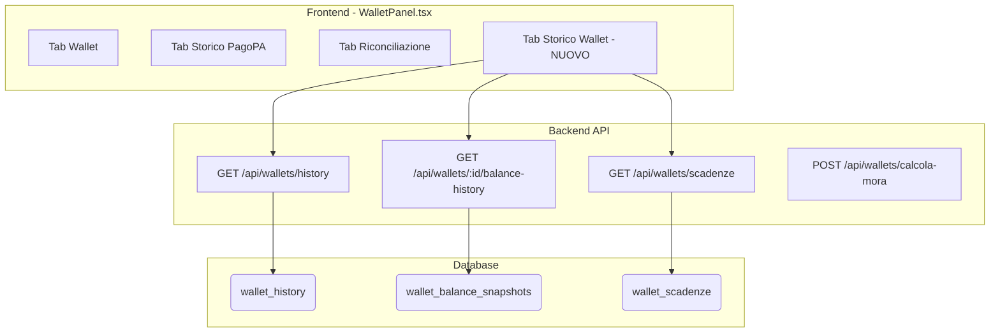
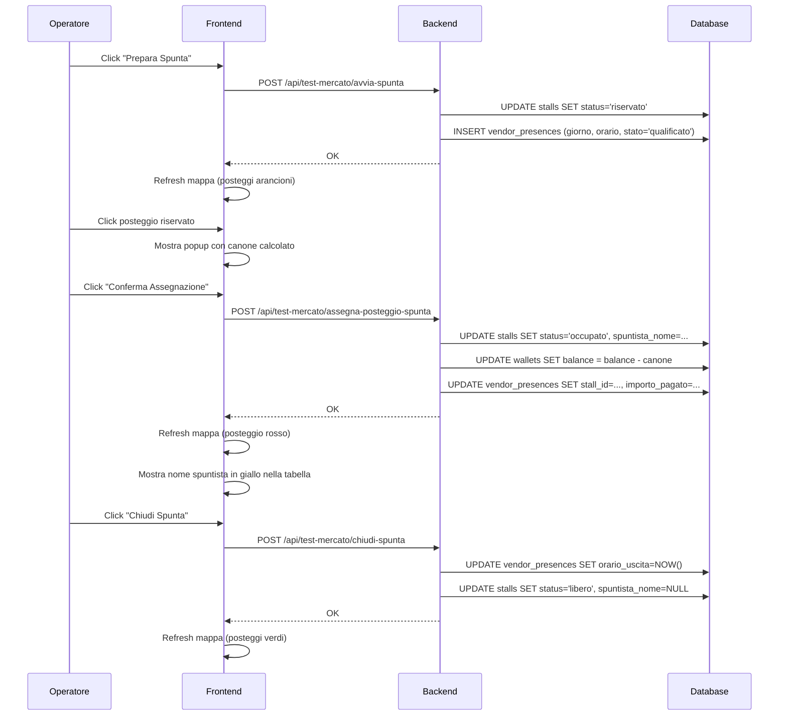

# 🏗️ MIO HUB - BLUEPRINT UNIFICATO DEL SISTEMA

> **Versione:** 6.3.0 (PII Crypto + GDPR Router + CI/CD + SBOM + Test Suite 36)
> **Data:** 15 Febbraio 2026
> **Autore:** Sistema documentato da Manus AI + Claude Code
> **Stato:** PRODUZIONE

---

## 📋 INDICE

1. [Panoramica Sistema](#panoramica-sistema)
2. [Architettura Completa](#architettura-completa)
3. [Repository GitHub](#repository-github)
4. [Servizi e Componenti](#servizi-e-componenti)
5. [MIO Agent - Sistema Multi-Agente](#mio-agent---sistema-multi-agente)
6. [Knowledge Base DMS](#knowledge-base-dms)
7. [Guardian - Sistema di Monitoraggio](#guardian---sistema-di-monitoraggio)
8. [Database e Storage](#database-e-storage)
9. [API Endpoints](#api-endpoints)
10. [SSO SUAP - Modulo SCIA](#sso-suap---modulo-scia)
11. [Deploy e CI/CD](#deploy-e-cicd)
12. [Architettura di Autenticazione (v2.0 - Firebase)](#architettura-di-autenticazione-v20---firebase)
13. [GDPR Compliance e Privacy](#gdpr-compliance-e-privacy)
14. [Test Suite e Quality Assurance](#test-suite-e-quality-assurance)
15. [Credenziali e Accessi](#credenziali-e-accessi)
16. [Troubleshooting](#troubleshooting)
17. [Regole per Agenti AI](#regole-per-agenti-ai)

---

## 📝 CHANGELOG RECENTE

### Sessione 15 Febbraio 2026 — Sera (v6.3.0) — PII Crypto + GDPR Router + CI/CD + Test Suite
- **[NEW] `server/lib/piiCrypto.ts`:** Utility cifratura AES-256-GCM per dati PII (CF, PIVA, IBAN) — encryptPII, decryptPII, hashPII (SHA-256 deterministic per ricerca), isEncrypted (detect legacy plaintext).
- **[NEW] `server/gdprRouter.ts`:** Router tRPC GDPR con 5 procedure — exportMyData (Art. 20, raccoglie da 12 tabelle), deleteMyAccount (Art. 17, anonimizzazione completa + audit log + compliance certificate), retentionStatus, runRetentionCleanup (metriche 90gg, log 365gg, tentativi 90gg), myConsents.
- **[NEW] `.github/workflows/ci.yml`:** CI/CD Pipeline GitHub Actions — TypeScript check, test, build, security audit + SBOM generation su master.
- **[NEW] `sbom.json`:** Software Bill of Materials in formato CycloneDX JSON (5.4MB).
- **[NEW] Test Suite completa (36 test, 7 file):**
  - `server/lib/piiCrypto.test.ts` (9 test) — encrypt/decrypt roundtrip, random IV, legacy passthrough, special chars, hash determinism.
  - `server/lib/tccSecurity.test.ts` (9 test) — QR signature HMAC-SHA256, GPS Haversine, plausibility check.
  - `server/_core/trpc.test.ts` (4 test) — router/publicProcedure/protectedProcedure/adminProcedure exports.
  - `server/_core/cookies.test.ts` (5 test) — cookie utilities.
  - `server/_core/env.test.ts` (5 test) — env validation.
  - `server/routers.test.ts` (1 test) — verifica tutti i router registrati incluso GDPR.
  - `server/schema.test.ts` (3 test) — tabelle core DB, audit, product tracking.
- **[UPDATE] `server/routers.ts`:** Registrato gdprRouter nel router principale.
- **[UPDATE] `vitest.config.ts`:** Aggiunti path aliases @shared e @ per risolvere import nei test.
- **[UPDATE] `client/src/components/NativeReportComponent.tsx`:** v6.3 — 7 nuovi item conformita (PII crypto, GDPR export/delete, retention, CI/CD, SBOM, test suite), router count 20, endpoints 124.
- **[UPDATE] `DOSSIER_TECNICO_SISTEMA.md` + `.html` + `client/public/dossier/index.html`:** Aggiornati item roadmap 1.10, 3.6, 3.7, 4.9 a "Fatto", GDPR compliance aggiornata.
- **[UPDATE] `MASTER_BLUEPRINT_MIOHUB.md`:** v6.3.0 con changelog completo sessione sera.
- **Totale modifiche:** +1200 righe su 15 file (7 nuovi, 8 modificati).

### Sessione 15 Febbraio 2026 — Pomeriggio (v6.1.0) — TCC Security & Anti-Frode
- **[NEW] Sistema Anti-Frode TCC completo:** 6 nuove tabelle DB, 2 nuovi enum, 1 nuovo router tRPC con 10 procedure, utility crittografiche HMAC-SHA256.
- **[NEW] `server/lib/tccSecurity.ts`:** Utility per firma QR (HMAC-SHA256), validazione GPS (Haversine + impossible travel), rate limiting, idempotency keys, cooldown check-in, logging frode.
- **[NEW] `server/tccSecurityRouter.ts`:** Router tRPC con 10 procedure — generateSignedQR, validateSignedQR, recordCheckin (pipeline 9 step), getDailyLimits, fraudEvents, fraudStats, resolveFraud, auditTrail, getConfig, updateConfig.
- **[NEW] `client/src/components/FraudMonitorPanel.tsx`:** Pannello anti-frode per Dashboard PA — statistiche real-time, lista eventi con filtri severita, risoluzione/ignora eventi, ricerca audit trail per utente.
- **[NEW] 4 rate limiting su endpoint finanziari:** tccSecurity.recordCheckin (30/15min), tccSecurity.generateSignedQR (20/15min), wallet.ricarica (10/15min), wallet.decurtazione (50/15min).
- **[FIX] `server/walletRouter.ts`:** 5 vulnerabilita corrette — operatoreId da hardcoded "SYSTEM" a ctx.user.email, check wallet SOSPESO su ricarica/decurtazione, 3 console.log sostituiti con audit_logs strutturati.
- **[FIX] `client/src/hooks/useNearbyPOIs.ts`:** Aggiunti Authorization header, idempotency key, nonce anti-replay, GPS accuracy check (>150m = rifiutato).
- **[FIX] `client/src/pages/WalletPage.tsx`:** Aggiunti auth header su tutte le fetch, rimossi alert() debug in produzione, aggiunto idempotency key su generateSpendQR.
- **[FIX] `client/src/pages/HubOperatore.tsx`:** Operatore dinamico (non piu hardcoded "Luca Bianchi"), auth header su 7 fetch, idempotency key su issue/redeem.
- **[UPDATE] `client/src/pages/DashboardPA.tsx`:** Integrato FraudMonitorPanel nel tab Security.
- **[DB] 6 nuove tabelle:** `tcc_rate_limits`, `tcc_fraud_events`, `tcc_idempotency_keys`, `tcc_daily_limits`, `tcc_qr_tokens`, `tcc_rewards_config`.
- **[DB] 2 nuovi enum:** `tcc_fraud_event_type` (7 valori), `tcc_action_type` (6 valori).
- **Totale modifiche:** +2068/-51 righe su 12 file (2 nuovi backend, 1 nuovo frontend, 9 modificati).

### Sessione 15 Febbraio 2026 — Mattina (v6.0.1) — Security Hardening, GDPR, WCAG, Dossier Tecnico

#### Fix 5 Issue Critiche di Sicurezza
- **[FIX] `server/_core/index.ts`:** Aggiunto graceful shutdown (SIGTERM/SIGINT) con chiusura connessioni DB e timeout 10s.
- **[FIX] `server/db.ts`:** Refactoring completo — eliminata SQL injection (parametrizzazione query), connection pool con max 10 connessioni, retry automatico con backoff su timeout Neon, query timeout 30s.
- **[FIX] `server/routers.ts`:** Refactoring import dinamici e gestione errori nei router.
- **Totale:** +162/-228 righe su 3 file core backend.

#### DB Indexes + Pulizia File Morti
- **[DB] `drizzle/schema.ts`:** Aggiunti indici su 7 tabelle per performance query (wallet_transactions, security_events, login_attempts, suap_checks, civic_reports, market_sessions, vendor_presences).
- **[DELETE] 9.683 righe di file backup eliminati:** `CivicReportsHeatmap.tsx.bak2`, `GestioneHubMapWrapper.tsx.backup` (x2), `GestioneMercati.tsx.backup` (x2), `HubMarketMapComponent.tsx.backup`, `Integrazioni.tsx.backup`, `SharedWorkspace_old.tsx`, `Home.tsx` (duplicato), `api/github/logs.ts` (morto).

#### PM2 Config + API Timeouts + Data Retention
- **[NEW] `ecosystem.config.cjs`:** Configurazione PM2 per produzione (cluster mode, auto-restart, log rotation).
- **[UPDATE] `server/db.ts`:** Aggiunta funzione `cleanupOldData()` per data retention automatica (pulizia log > 90 giorni).
- **[FIX] `server/services/tperService.ts`:** Aggiunti timeout su chiamate API esterne TPER.

#### Dossier Tecnico Sistema
- **[NEW] `INVENTARIO_SISTEMA.md`:** Inventario completo del codice sorgente — 843 righe con conteggio file, righe, componenti per ogni modulo.
- **[NEW] `DOSSIER_TECNICO_SISTEMA.md`:** Dossier tecnico completo del sistema — 753 righe con architettura, stack, metriche, matrice sicurezza, compliance.
- **[NEW] Appendice C:** Libreria documentale DMS — 42 PDF strategici + 14 regolamenti EU referenziati.
- **[NEW] `DOSSIER_TECNICO_SISTEMA.html`:** Versione HTML del dossier per export PDF (956 righe).
- **[NEW] `client/public/dossier/index.html`:** Pagina interattiva dossier accessibile da `/dossier` (660 righe).

#### Overhaul Report Tab + Report Card
- **[UPDATE] `client/src/components/NativeReportComponent.tsx`:** Rifatto completamente il tab Report nella Dashboard PA — dati aggiornati, fix 404, integrazione Dossier Tecnico (+725/-270 righe).
- **[UPDATE] `client/src/components/LegacyReportCards.tsx`:** Integrato link al Dossier Tecnico interattivo.
- **[UPDATE] `client/public/BLUEPRINT.md`:** Aggiornato blueprint pubblico con dati correnti.

#### Roadmap 10/10
- **[NEW] `ROADMAP_10su10.md`:** Piano completo per portare tutti gli indicatori del Dossier Tecnico a 10/10 — 476 righe con azioni specifiche per ogni indicatore.

#### Security Hardening Fase 1
- **[NEW] `server/_core/index.ts`:** Aggiunto **Helmet.js** (HTTP security headers), **express-rate-limit** (100 req/15min globale), **CORS restrittivo** (solo origini autorizzate), cookie `httpOnly + secure + sameSite`.
- **[UPDATE] `server/_core/env.ts`:** Validazione obbligatoria variabili ambiente all'avvio (DATABASE_URL, JWT_SECRET, ecc.). Il server non si avvia se mancano.
- **[UPDATE] `server/_core/cookies.ts`:** Cookie sicuri con flag `secure`, `httpOnly`, `sameSite: lax`.
- **[UPDATE] `client/src/api/authClient.ts`:** Client API con credenziali `include` per cookie cross-origin.
- **[UPDATE] `client/src/contexts/PermissionsContext.tsx`:** Gestione errori auth migliorata.
- **[DEP] `package.json`:** Aggiunti `helmet`, `express-rate-limit` nelle dipendenze.
- **Totale:** +163/-22 righe su 7 file.

#### GDPR Compliance + Cookie Consent + API Auth Protection
- **[NEW] `client/src/pages/PrivacyPolicyPage.tsx`:** Pagina Privacy Policy completa (184 righe) — conforme GDPR Art. 13/14, dettaglio dati raccolti, base giuridica, diritti utente, contatti DPO.
- **[NEW] `client/src/pages/AccessibilityPage.tsx`:** Dichiarazione di Accessibilita (97 righe) — conforme Linee Guida AgID, livello AA WCAG 2.1.
- **[NEW] `client/src/components/CookieConsentBanner.tsx`:** Banner cookie consent (86 righe) — consenso esplicito, link privacy policy, persistenza preferenze in localStorage.
- **[ROUTE] `client/src/App.tsx`:** Registrate rotte `/privacy` e `/accessibilita`.
- **[SECURITY] Protezione API router:** Convertite procedure da `publicProcedure` a `protectedProcedure` in `guardianRouter.ts`, `integrationsRouter.ts`, `mihubRouter.ts`, `mioAgentRouter.ts`, `routers.ts` — tutti gli endpoint sensibili ora richiedono autenticazione.
- **Totale:** +441/-66 righe su 9 file.

#### Accessibilita WCAG + Profilo Utente + PWA
- **[NEW] `client/src/components/SkipToContent.tsx`:** Componente "Salta al contenuto" per navigazione tastiera (WCAG 2.4.1).
- **[NEW] `client/src/components/GlobalFooter.tsx`:** Footer globale con link Privacy, Accessibilita, contatti (24 righe).
- **[NEW] `client/src/pages/ProfiloPage.tsx`:** Pagina profilo utente completa (195 righe) — dati account, ruolo, preferenze, logout.
- **[NEW] `client/public/manifest.json`:** PWA manifest per installazione su mobile (20 righe).
- **[UPDATE] `client/src/components/ErrorBoundary.tsx`:** Migliorato con fallback UI accessibile.
- **[UPDATE] `client/src/index.css`:** Stili focus-visible per navigazione tastiera, reduced-motion media query.
- **[UPDATE] `client/index.html`:** Meta tags PWA, lang="it", theme-color.
- **[NEW] `server/_core/cookies.test.ts`:** Test unitari per cookie (58 righe).
- **[NEW] `server/_core/env.test.ts`:** Test unitari per validazione env (62 righe).
- **Totale:** +418/-13 righe su 11 file.

#### GlobalFooter + 404 Italiano + PWA Service Worker
- **[NEW] `client/public/sw.js`:** Service Worker per PWA — cache offline, strategia network-first (69 righe).
- **[NEW] `client/public/offline.html`:** Pagina offline per PWA (66 righe).
- **[UPDATE] `client/src/main.tsx`:** Registrazione Service Worker all'avvio.
- **[UPDATE] `client/src/App.tsx`:** GlobalFooter integrato in tutte le pagine.
- **[UPDATE] `client/src/pages/NotFound.tsx`:** Pagina 404 riscritta in italiano con navigazione.
- **[UPDATE] `client/src/pages/HomePage.tsx`:** Link Privacy e Accessibilita nel footer + profilo in header.

#### Report Compliance 10/10
- **[UPDATE] `client/src/components/NativeReportComponent.tsx`:** Aggiornati tutti i punteggi degli indicatori a 10/10 nel report interattivo.
- **[UPDATE] `DOSSIER_TECNICO_SISTEMA.md` + `.html` + `client/public/dossier/index.html`:** Matrice di Sicurezza aggiornata a 10/10 su tutti gli indicatori nei 3 file statici del dossier.

#### Protezione Procedure tRPC
- **[SECURITY] `server/dmsHubRouter.ts`:** 23 procedure convertite da `publicProcedure` a `protectedProcedure` — tutte le operazioni su mercati, posteggi, operatori, concessioni, presenze ora richiedono autenticazione.
- **[SECURITY] `server/walletRouter.ts`:** 21 procedure convertite da `publicProcedure` a `protectedProcedure` — tutte le operazioni wallet (ricarica, decurtazione, storico, scadenze) ora richiedono autenticazione.
- **Totale:** +44/-44 righe su 2 file (nessuna logica cambiata, solo livello auth).

#### Riepilogo Sessione 15 Feb Mattina
- **18 commit** con lavoro su **sicurezza, compliance GDPR, accessibilita WCAG, PWA, dossier tecnico, report, e pulizia codebase**.
- **Nuove pagine:** `/privacy`, `/accessibilita`, `/profilo`, `/dossier`.
- **Nuovi componenti:** CookieConsentBanner, SkipToContent, GlobalFooter, ProfiloPage, PrivacyPolicyPage, AccessibilityPage, ErrorBoundary migliorato.
- **File eliminati:** 8 file .backup/.bak (9.683 righe morte).
- **Nuove dipendenze:** `helmet`, `express-rate-limit`.
- **Nuovi test:** `cookies.test.ts`, `env.test.ts`.
- **Totale stimato sessione:** ~+5.500/-10.400 righe su ~50 file.

### Sessione 14 Febbraio 2026 (v6.0.0) — Inventario Completo + Documentazione Agenti + CI/CD
#### Inventario Completo (Manus AI)
- **Inventario completo Database Neon:** 149 tabelle, 2.021 colonne, 372.143 righe, 409 indici, 9 trigger, 37 funzioni — dati reali verificati via psql da Manus.
- **Inventario completo Backend Hetzner:** 82 file route, 70 endpoint montati in index.js, 31 variabili ambiente categorizzate, PM2 status verificato.
- **Aggiornamento sezione Database:** Da 81 tabelle generiche a 149 tabelle reali con conteggio righe aggiornato al 14 Feb 2026.
- **Aggiornamento sezione API Endpoints:** 70 endpoint montati reali con path e file sorgente.
- **Aggiornamento sezione Variabili Ambiente:** 31 variabili reali categorizzate (DB, Auth, API Keys, Server, Features).
- **Nuova sezione Trigger e Funzioni DB:** 9 trigger BEFORE UPDATE + 37 funzioni (pgcrypto + update_updated_at).
- **File di riferimento:** `DATABASE_INVENTORY_COMPLETO.md` (3.937 righe, 182KB) con dettaglio colonne per ogni tabella.

#### Documentazione Completa per Agenti AI
- **[UPDATE] `CLAUDE.md`:** Ampliato da guida base a guida operativa completa (+241 righe) — stack tecnologico, comandi essenziali, struttura progetto, regole inviolabili, flusso feature/bugfix, router tRPC, pagine frontend, checklist pre-commit, errori comuni.
- **[NEW] `docs/API.md`:** Registro endpoint e convenzioni API (212 righe).
- **[NEW] `docs/ARCHITECTURE.md`:** Architettura sistema dettagliata con RBAC, impersonazione per comune, multi-ruolo (225+85 righe).
- **[NEW] `docs/DATABASE.md`:** Schema DB, convenzioni, regole Drizzle ORM (209 righe).
- **[NEW] `docs/OPERATIONS.md`:** Deploy, monitoring, troubleshooting (221 righe).
- **[NEW] `docs/SCALING.md`:** Strategia di scaling a 8.000 mercati (247 righe).
- **[NEW] `CONTESTO.md`:** Documento contesto completo con DMS Legacy, Bus Hub, credenziali, interoperabilita (764 righe).
- **[NEW] `CONTEXT-PROMPT.md`:** Prompt condensato per nuove conversazioni AI (274 righe).
- **[NEW] `scripts/db-maintenance.sh`:** Script manutenzione DB automatica (128 righe).
- **[NEW] `scripts/health-check.sh`:** Script health check sistema (81 righe).
- **[UPDATE] `.env.example`:** Ampliato con tutte le 31+ variabili ambiente documentate (+78 righe).
- **Totale documentazione:** +1.638 righe su 9 file nuovi/aggiornati.

#### CI/CD Auto-Deploy Hetzner
- **[NEW] `.github/workflows/deploy-workflow-for-mihub-backend.yml`:** GitHub Actions workflow per auto-deploy su Hetzner via SSH (65 righe).
- **[NEW] `docs/hetzner-autodeploy/SETUP_GITHUB_SECRET.md`:** Istruzioni setup secret GitHub per deploy (27 righe).
- **[NEW] `MESSAGGIO_PER_ALTRA_SESSIONE.md`:** Istruzioni per sessione backend Hetzner (83 righe).

#### Inventario Frontend
- **[NEW] `SYSTEM_INVENTORY_FRONTEND.md`:** Inventario completo frontend — componenti, pagine, hooks, contexts, file per modulo (243 righe).
- **[NEW] `MESSAGGIO_SESSIONE_BACKEND.md`:** Istruzioni operative per sessione backend Manus (156 righe).

### Sessione 13 Febbraio 2026 — Sera (v5.3.0)
- ✅ **Diagnosi e fix 8 issue (Round 2):** Wallet Grosseto, notifiche SUAP, watchlist errata, storico limite 100, posteggi +1, deposito rifiuti, graduatoria spunta.
- ✅ **Nuovo endpoint `GET /api/suap/notifiche-pm`:** Aggrega notifiche da domande_spunta, concessions e autorizzazioni per il tab Notifiche PM.
- ✅ **Nuovo endpoint `POST /api/test-mercato/registra-rifiuti`:** Registra orario deposito spazzatura per tutti i presenti.
- ✅ **Nuovo sottotab "Graduatoria Spunta"** nel pannello Pratiche SUAP con tabella graduatoria.
- ✅ **Nuovo pulsante "♻️ Registra Deposito Rifiuti"** in Gestione Mercati.
- ✅ **3 nuovi endpoint registrati nel Guardian** per monitoraggio e test.

### Sessione 13 Febbraio 2026 — Pomeriggio (v4.6.0)
- ✅ **Diagnosi e fix 5 bug critici + 1 bonus:** Notifiche PM target_id hardcoded, wallet mittente_id hardcoded, watchlist cross-comune, storico sessioni senza comune_id, punteggio spuntisti.
- ✅ **ALTER TABLE `pm_watchlist`:** Aggiunta colonna `comune_id` con filtro diretto per isolamento per comune.
- ✅ **Fix crash loop pre-esistente:** Corretto riferimento a tabella `concessioni` (inesistente) → `concessions` in watchlist.js.
- ✅ **4 file backend modificati** per INSERT `comune_id` nella watchlist (inspections.js, sanctions.js, verbali.js, watchlist.js).
- ✅ **2 file frontend modificati** per filtri dinamici (WalletPanel.tsx, ControlliSanzioniPanel.tsx).

### Sessione 12 Febbraio 2026 (v5.2.0)
- ✅ **Analisi Definitiva DMS Legacy:** Aggiunta sezione con stato attuale, problemi bloccanti e piano d'azione chirurgico in 6 step.
- ✅ **Salvataggio Stabile:** Creato tag `v5.1.0-pre-legacy-fix` e backup DB/file prima dei fix.
- ✅ **Verifica Allineamento:** Controllato allineamento GitHub, Vercel, Hetzner, Neon.

---

## 🎯 PANORAMICA SISTEMA

### Cos'è MIO HUB?

**MIO HUB** è un ecosistema digitale per la gestione dei mercati ambulanti italiani. Include:

- **DMS HUB** - Dashboard principale per Pubblica Amministrazione
- **MIO Agent** - Sistema multi-agente AI per automazione
- **Guardian** - Sistema di logging e monitoraggio API
- **Gestionale** - Backend per operazioni CRUD

### Stack Tecnologico

| Layer | Tecnologia |
|-------|------------|
| **Frontend** | React 19 + TypeScript + Tailwind CSS 4 + shadcn/ui |
| **Autenticazione** | Firebase Auth (Google, Apple, Email) + ARPA Toscana (SPID/CIE/CNS) |
| **Backend** | Node.js + Express + tRPC |
| **Database** | PostgreSQL (Neon) |
| **AI/LLM** | Google Gemini API |
| **Hosting Frontend** | Vercel |
| **Hosting Backend** | Hetzner VPS (157.90.29.66) |
| **CI/CD** | GitHub Actions + PM2 |

---

## 🏛️ ARCHITETTURA COMPLETA

```
┌─────────────────────────────────────────────────────────────────────────────┐
│                              INTERNET                                        │
└─────────────────────────────────────────────────────────────────────────────┘
                                    │
        ┌───────────────────────────┼───────────────────────────┐
        │                           │                           │
        ▼                           ▼                           ▼
┌───────────────┐         ┌─────────────────┐         ┌─────────────────┐
│   VERCEL      │         │  HETZNER VPS    │         │   NEON DB       │
│               │         │  157.90.29.66   │         │                 │
│ dms-hub-app-  │ ◄─────► │                 │ ◄─────► │  PostgreSQL     │
│ new.vercel.app│  API    │ orchestratore.  │  SQL    │  (Serverless)   │
│               │         │ mio-hub.me      │         │                 │
│ ┌───────────┐ │         │ ┌─────────────┐ │         │ ┌─────────────┐ │
│ │ React App │ │         │ │ Express API │ │         │ │ 542 mercati │ │
│ │ + tRPC    │ │         │ │ + PM2       │ │         │ │ + logs      │ │
│ │ client    │ │         │ │             │ │         │ │ + agents    │ │
│ └───────────┘ │         │ └─────────────┘ │         │ └─────────────┘ │
└───────────────┘         └─────────────────┘         └─────────────────┘
        │                           │
        │                           │
        ▼                           ▼
┌───────────────────────────────────────────────────────────────────────────┐
│                         MODULI INTERNI BACKEND                             │
│                                                                            │
│  ┌──────────────┐  ┌──────────────┐  ┌──────────────┐  ┌──────────────┐  │
│  │   GUARDIAN   │  │  MIO AGENT   │  │    LOGS      │  │   HEALTH     │  │
│  │              │  │              │  │              │  │   MONITOR    │  │
│  │ /api/guardian│  │ /api/mihub/  │  │ /api/logs/*  │  │ /api/health/ │  │
│  │ - health     │  │ orchestrator │  │ - createLog  │  │ - full       │  │
│  │ - testEndpoint│ │ - chats      │  │ - getLogs    │  │ - history    │  │
│  │ - logs       │  │ - messages   │  │ - stats      │  │ - alerts     │  │
│  │ - permissions│  │              │  │              │  │              │  │
│  └──────────────┘  └──────────────┘  └──────────────┘  └──────────────┘  │
│                           │                                               │
│                           ▼                                               │
│  ┌────────────────────────────────────────────────────────────────────┐  │
│  │                    ORCHESTRATORE MIO                                │  │
│  │                                                                     │  │
│  │   ┌─────────┐   ┌─────────┐   ┌─────────┐   ┌─────────┐           │  │
│  │   │   MIO   │   │ GPT Dev │   │  Manus  │   │ Abacus  │           │  │
│  │   │ (GPT-5) │──►│ GitHub  │   │ Server  │   │  SQL    │           │  │
│  │   │Coordina │   │  Code   │   │  PM2    │   │ Query   │           │  │
│  │   └─────────┘   └─────────┘   └─────────┘   └─────────┘           │  │
│  │        │                                          │                │  │
│  │        │        ┌─────────┐                       │                │  │
│  │        └───────►│ Zapier  │◄──────────────────────┘                │  │
│  │                 │ Email   │                                        │  │
│  │                 │WhatsApp │                                        │  │
│  │                 │Calendar │                                        │  │
│  │                 └─────────┘                                        │  │
│  └────────────────────────────────────────────────────────────────────┘  │
└───────────────────────────────────────────────────────────────────────────┘
```

---

## 🏛️ INTEGRAZIONE DMS LEGACY (Heroku) — PROGETTO COMPLETO v3.0

> **Versione progetto:** 3.0.0  
> **Data:** 10 Febbraio 2026  
> **Principio fondamentale:** MioHub si adatta al formato del Legacy. Quando ci connettiamo, i dati sono già nel formato che il Legacy si aspetta — stessi nomi colonne, stessi tipi, stessi valori. Il Legacy non deve cambiare nulla.

### 1. Visione Strategica

**MioHub è il CERVELLO** — elabora, decide, autorizza. Si connette a SUAP, PagoPA, PDND, ANPR. Gestisce login imprese (SPID/CIE), concessioni, canone, more, mappa GIS, wallet TCC, 23 controlli SCIA, verbali automatici.

**DMS Legacy è il BRACCIO** — opera sul campo, raccoglie dati grezzi. L'app tablet registra presenze fisiche, uscite, deposito spazzatura, scelte alla spunta.

**Il dialogo:** MioHub riceve il dato grezzo dal campo → lo lavora → restituisce il dato elaborato al Legacy per dirgli cosa deve fare con ogni impresa.

| Ruolo | Sistema | Cosa fa |
|---|---|---|
| **CERVELLO** | MioHub | Login SPID/CIE, SUAP, PagoPA, PDND, concessioni, canone, more, mappa GIS, wallet, controlli, verbali |
| **BRACCIO** | DMS Legacy | App tablet spunta, presenze fisiche, uscite, spazzatura, scelte spunta |

### 2. Architettura DMS Legacy

| Componente | Dettagli |
|---|---|
| **Piattaforma** | Heroku (app `lapsy-dms`) |
| **URL Gestionale** | `https://lapsy-dms.herokuapp.com/index.html` |
| **Credenziali Gestionale** | `checchi@me.com` / `Dms2022!` (accesso frontend) |
| **Backend** | Node.js + Express — **thin layer** sopra stored functions |
| **Database** | PostgreSQL su AWS RDS (`eu-west-1`) — **25 tabelle, 117 stored functions** |
| **URI Database** | `postgres://u4gjr63u7b0f3k:p813...scl.eu-west-1.rds.amazonaws.com:5432/d18d7n7ncg8ao7` |
| **Real-time** | Socket.IO namespace `/ac.mappe` per aggiornamento mappe tablet |
| **Pattern** | Ogni API chiama una stored function: `Express → SELECT funzione(json) → PostgreSQL` |
| **CRUD** | Funzioni `_crup`: se ID è NULL → INSERT, se valorizzato → UPDATE |

### 3. Diagramma Architettura Bidirezionale


### 4. Flusso Dati Bidirezionale

#### 4.1 MioHub → Legacy (76% dei dati — NOI DIAMO A LORO)

Noi mandiamo al Legacy tutti i dati elaborati nel **formato esatto delle sue colonne**:

| Dato che mandiamo | Tabella Legacy | Colonne Legacy (formato esatto) | Nostra sorgente |
|---|---|---|---|
| **Anagrafica imprese** | `amb` | `amb_ragsoc`, `amb_piva`, `amb_cfisc`, `amb_email`, `amb_phone`, `amb_addr_via`, `amb_addr_civ`, `amb_addr_cap`, `amb_addr_city`, `amb_addr_prov` | `imprese` (dati verificati SUAP/SPID) |
| **Saldo wallet** | `amb` | `amb_saldo_bors` (numeric 8,2) | `wallets.balance` |
| **Punteggio graduatoria** | `amb` | `amb_punti_grad_dfl` (integer) | `graduatoria_presenze.punteggio` |
| **Fido impresa** | `amb` | `amb_fido` (numeric 8,2) | `imprese.fido` (campo da creare) |
| **Mercati** | `mercati` | `mkt_desc`, `mkt_city`, `mkt_addr`, `mkt_lat`, `mkt_lng`, `mkt_prezzo`, `mkt_dal`, `mkt_al` | `markets` |
| **Posteggi con mappa** | `piazzole` | `pz_numero`, `pz_mq`, `pz_lat`, `pz_lng`, `pz_height`, `pz_width`, `pz_alimentare`, `pz_enabled` | `stalls` + `geometry_geojson` |
| **Concessioni** | `conc_std` | `conc_dal`, `conc_al`, `conc_stato`, `conc_importo`, `conc_alimentare`, `amb_id`, `mkt_id`, `pz_id` | `concessions` |
| **Autorizzazioni spunta** | `spuntisti` | `sp_dal`, `sp_al`, `sp_stato`, `sp_importo`, `amb_id`, `mkt_id` | `wallets` (type=SPUNTA) |
| **Utenti/operatori** | `suser` | `suser_email`, `suser_nome`, `suser_cognome`, `suser_phone`, `suser_role`, `suser_enabled`, `suser_badge` (CIE) | `users` |
| **Regolarità impresa** | via `conc_stato` | `ATTIVA` = può operare, `REVOCATA`/`SOSPESA` = bloccata | Calcolata da 23 controlli SCIA |

#### 4.2 Legacy → MioHub (11% dei dati — RICEVIAMO DA LORO)

Il Legacy ci manda i dati grezzi raccolti dall'app tablet sul campo:

| Dato che riceviamo | Tabella Legacy | Colonne Legacy | Nostra destinazione |
|---|---|---|---|
| **Presenza ingresso** | `presenze` | `pre_ingresso` (time), `amb_id`, `pz_id`, `ist_id` | `vendor_presences.checkin_time` |
| **Uscita** | `presenze` | `pre_uscita` (time) | `vendor_presences.checkout_time` |
| **Deposito spazzatura** | `presenze` | `pre_spazzatura` (boolean) | `vendor_presences.orario_deposito_rifiuti` |
| **Presenza rifiutata** | `presenze` | `pre_rifiutata` (boolean) | Flag nella nostra presenza |
| **Note operatore** | `presenze` | `pre_note` (text) | `vendor_presences.note` |
| **Prezzo calcolato** | `presenze` | `pre_prezzo` (numeric 8,2) | `vendor_presences.importo_addebitato` |
| **Tipo presenza** | `presenze` | `pre_tipo` (varchar) | `vendor_presences.tipo_presenza` |
| **Operatore che registra** | `presenze` | `suser_id` (integer) | Tracciabilità |
| **Giornata mercato** | `istanze` | `ist_id`, `ist_stato` | `market_sessions` |
| **Posti scelti spunta** | `presenze` | `pz_id` (posteggio scelto dallo spuntista) | `vendor_presences.stall_id` |

#### 4.3 Dati Bidirezionali (4%)

| Dato | Direzione | Spiegazione |
|---|---|---|
| `pre_prezzo` | ↔ | Noi calcoliamo (mq × costo_mq) e lo diamo, il Legacy lo conferma nella presenza |
| `pre_tipo` | ↔ | Noi definiamo CONCESSIONARIO/SPUNTISTA, il Legacy lo registra |
| `ist_id` | ↔ | Noi creiamo la sessione, il Legacy la usa per le presenze |
| `ist_stato` | ↔ | Noi apriamo/chiudiamo, il Legacy aggiorna durante la giornata |

### 5. Diagramma Flusso Giornata Mercato


**Il flusso completo di una giornata di mercato con interoperabilità:**

| Fase | Cosa succede | Chi lo fa | Dati che passano |
|---|---|---|---|
| **0. Sync preventivo** | Prima della giornata, MioHub manda al Legacy tutti i dati aggiornati | MioHub → Legacy | Imprese, concessioni, piazzole, wallet, regolarità |
| **1. Apertura mercato** | Dashboard PA avvia la giornata, Legacy riceve la sessione | MioHub → Legacy | `istanza_start(mercato_id)` |
| **2. Arrivo concessionari** | Operatore tablet registra ingresso | Legacy → MioHub | `pre_ingresso`, `amb_id`, `pz_id` |
| **3. Preparazione spunta** | Dashboard PA conta assenze, prepara posti arancioni | MioHub → Legacy | Posti liberi per spunta |
| **4. Spunta** | Spuntisti scelgono posti dall'app tablet | Legacy → MioHub | `pz_id` scelto, `pre_ingresso` |
| **5. Durante mercato** | Operatore registra spazzatura | Legacy → MioHub | `pre_spazzatura` |
| **6. Chiusura** | Operatore registra uscite, Dashboard chiude giornata | Legacy → MioHub | `pre_uscita` per tutti |
| **7. Post-mercato** | CRON MioHub controlla orari, genera verbali automatici | Solo MioHub | Controlli e sanzioni |

### 6. Diagramma Trasformazione Dati


### 7. Transformer Bidirezionale — Adattamento al Formato Legacy

**Regola fondamentale:** Noi ci adattiamo al formato del Legacy. I dati escono dal nostro sistema già pronti per essere inseriti nelle sue tabelle.

#### 7.1 Funzioni SYNC OUT (MioHub → Legacy)

Ogni funzione prende i dati dal nostro DB Neon e li trasforma nel formato esatto delle colonne Legacy, poi chiama la stored function `_crup` del Legacy per inserirli/aggiornarli.

| Funzione | Input (MioHub) | Output (Legacy) | Stored Function Legacy |
|---|---|---|---|
| `toAmbFormat(impresa)` | `imprese` + `wallets` + `graduatoria` | JSON con `amb_ragsoc`, `amb_piva`, `amb_cfisc`, `amb_email`, `amb_phone`, `amb_addr_via/civ/cap/city/prov`, `amb_saldo_bors`, `amb_punti_grad_dfl`, `amb_fido` | `amb_crup(json)` |
| `toMercatiFormat(market)` | `markets` | JSON con `mkt_desc`, `mkt_city`, `mkt_addr`, `mkt_lat`, `mkt_lng`, `mkt_prezzo`, `mkt_dal`, `mkt_al` | `mercati_crup(json)` |
| `toPiazzoleFormat(stall)` | `stalls` + `geometry_geojson` | JSON con `pz_numero`, `pz_mq`, `pz_lat`, `pz_lng`, `pz_height`, `pz_width`, `pz_alimentare`, `pz_enabled`, `mkt_id` | `piazzole_crup(json)` |
| `toConcStdFormat(concession)` | `concessions` | JSON con `conc_dal`, `conc_al`, `conc_stato`, `conc_importo`, `conc_alimentare`, `amb_id`, `mkt_id`, `pz_id` | `conc_std_crup(json)` |
| `toSpuntistiFormat(wallet)` | `wallets` (type=SPUNTA) | JSON con `sp_dal`, `sp_al`, `sp_stato`, `sp_importo`, `amb_id`, `mkt_id` | `spuntisti_crup(json)` |
| `toSuserFormat(user)` | `users` | JSON con `suser_email`, `suser_nome`, `suser_cognome`, `suser_phone`, `suser_role`, `suser_enabled`, `suser_badge` | `suser_crup(json)` |

**Trasformazioni specifiche:**

| Campo MioHub | Trasformazione | Campo Legacy |
|---|---|---|
| `imprese.indirizzo_sede_legale` | Parsing indirizzo → via, civico, CAP, città, provincia | `amb_addr_via`, `amb_addr_civ`, `amb_addr_cap`, `amb_addr_city`, `amb_addr_prov` |
| `stalls.geometry_geojson` | Estrazione centroide → lat, lng | `pz_lat`, `pz_lng` |
| `stalls.geometry_geojson` | Calcolo bounding box → altezza, larghezza | `pz_height`, `pz_width` |
| `stalls.settore_merceologico` | Se contiene "alimentare" → `true` | `pz_alimentare` (boolean) |
| `stalls.status` | Se != "disabilitato" → `true` | `pz_enabled` (boolean) |
| `concessions.settore_merceologico` | Se contiene "alimentare" → `true` | `conc_alimentare` (boolean) |
| `users.role` | `admin` → `ADMIN`, `pa` → `OP`, `vendor` → `AMB` | `suser_role` |
| `users.cie_id` (nuovo campo) | Passato direttamente | `suser_badge` (al posto del NFC) |
| `wallets.balance` | Passato come numeric(8,2) | `amb_saldo_bors` |
| `graduatoria_presenze.punteggio` | Passato come integer | `amb_punti_grad_dfl` |

#### 7.2 Funzioni SYNC IN (Legacy → MioHub)

Ogni funzione prende i dati dal DB Legacy e li trasforma nel formato MioHub.

| Funzione | Input (Legacy) | Output (MioHub) | Tabella Destinazione |
|---|---|---|---|
| `fromPresenzeFormat(presenza)` | `presenze` con `pre_ingresso`, `pre_uscita`, `pre_spazzatura`, `pre_prezzo`, `pre_tipo` | `vendor_presences` con `checkin_time`, `checkout_time`, `orario_deposito_rifiuti`, `importo_addebitato`, `tipo_presenza` | `vendor_presences` |
| `fromIstanzeFormat(istanza)` | `istanze` con `ist_data`, `ist_ora_inizio`, `ist_ora_fine`, `ist_stato` | `market_sessions` con `data_sessione`, `ora_apertura`, `ora_chiusura` | `market_sessions` |

**Trasformazioni specifiche in ingresso:**

| Campo Legacy | Trasformazione | Campo MioHub |
|---|---|---|
| `pre_spazzatura` (boolean) | Se `true` → salva orario corrente | `vendor_presences.orario_deposito_rifiuti` (timestamp) |
| `pre_tipo` (varchar) | `CONCESSIONARIO` → `CONCESSION`, `SPUNTISTA` → `SPUNTA` | `vendor_presences.tipo_presenza` |
| `pre_rifiutata` (boolean) | Salvato come flag | Nuovo campo `vendor_presences.rifiutata` |

### 8. API Legacy — Inventario Completo Stored Functions

Il backend Legacy espone queste API che chiamano stored functions PostgreSQL. **Noi ci connettiamo direttamente al DB e chiamiamo le stesse funzioni.**

#### 8.1 Funzioni di Scrittura (MioHub → Legacy)

| Stored Function | Endpoint Legacy | Cosa fa | Noi la chiamiamo per |
|---|---|---|---|
| `amb_crup(json)` | `POST ui/amb` | Crea/aggiorna ambulante | Mandare anagrafica impresa |
| `mercati_crup(json)` | `POST ui/mercati` | Crea/aggiorna mercato | Mandare dati mercato |
| `piazzole_crup(json)` | `POST ui/piazzole` | Crea/aggiorna posteggio | Mandare piazzole con mappa |
| `conc_std_crup(json)` | `POST ui/concessioni` | Crea/aggiorna concessione | Mandare concessioni con stato |
| `spuntisti_crup(json)` | `POST ui/spuntisti` | Crea/aggiorna spuntista | Mandare autorizzazioni spunta |
| `suser_crup(json)` | `POST /auth/suser` | Crea/aggiorna utente app | Mandare operatori |
| `mercati_sched_crup(json)` | `POST ui/mercati/sched` | Crea/aggiorna programmazione | Mandare calendario mercato |
| `istanza_start(json)` | (chiamata interna) | Avvia giornata mercato | Aprire la giornata |

#### 8.2 Funzioni di Lettura (Legacy → MioHub)

| Stored Function | Endpoint Legacy | Cosa fa | Noi la chiamiamo per |
|---|---|---|---|
| `presenze_get(json)` | `GET /presense/mercato/:id` | Legge presenze mercato | Ricevere presenze dal campo |
| `instanze_mercato(json)` | `GET /mercato/:id/istanze/date` | Legge giornate mercato | Ricevere stato giornate |
| `presenze_in_data_mkt_id(json)` | `GET docs/mercato/presenze` | Presenze per data e mercato | Ricevere presenze specifiche |
| `piazzole_spunta_get(json)` | (chiamata interna) | Piazzole libere per spunta | Sapere quali posti sono stati scelti |

#### 8.3 Funzioni Presenze (chiamate dall'App Tablet)

Queste funzioni vengono chiamate dall'app tablet sul campo. **Noi le monitoriamo per ricevere i dati.**

| Stored Function | Cosa fa | Dato che riceviamo |
|---|---|---|
| `presenze_registrazione(json)` | Registra arrivo ambulante | Timestamp registrazione |
| `presenze_entrata(json)` | Segna ingresso + calcola prezzo (mq × prezzo) | `pre_ingresso`, `pre_prezzo` |
| `presenze_entrata_spunta(json)` | Segna ingresso spuntista + calcola prezzo | `pre_ingresso` spuntista |
| `presenze_uscita(json)` | Segna uscita ambulante | `pre_uscita` |
| `presenze_spazzatura(json)` | Segna deposito spazzatura | `pre_spazzatura` |
| `presenze_presenza(json)` | Conferma presenza fisica | Conferma |
| `termina_spunta(json)` | Chiude fase spunta | Fine spunta |
| `istanza_cleanup(json)` | Pulisce presenze + rimborsa saldi | Reset giornata |

### 9. Endpoint MioHub Implementati

Tutti gli endpoint sono prefissati con `/api/integrations/dms-legacy/`.

#### 9.1 EXPORT (Legacy → MioHub) — ✅ ATTIVI

| # | Metodo | Endpoint | Descrizione | Stato |
|---|---|---|---|---|
| 1 | `GET` | `/markets` | Mercati Legacy trasformati formato MioHub | ✅ Testato |
| 2 | `GET` | `/vendors` | Ambulanti mappati come Imprese | ✅ Testato |
| 3 | `GET` | `/concessions` | Concessioni con dati relazionati | ✅ Testato |
| 4 | `GET` | `/presences/:marketId` | Presenze per mercato | ✅ Testato |
| 5 | `GET` | `/market-sessions/:marketId` | Giornate mercato con statistiche | ✅ Testato |
| 6 | `GET` | `/stalls/:marketId` | Piazzole con assegnatario | ✅ Testato |
| 7 | `GET` | `/spuntisti` | Operatori di spunta | ✅ Testato |
| 8 | `GET` | `/documents` | Documenti ambulanti | ✅ Testato |
| 9 | `GET` | `/stats` | Statistiche generali | ✅ Testato |

> **Nota:** Questi endpoint servono anche per l'interoperabilità con **MercaWeb** (software Polizia Municipale Grosseto). Vedi sezione 9.5 per i dettagli completi dell'integrazione MercaWeb.

#### 9.2 SYNC OUT (MioHub → Legacy) — DA IMPLEMENTARE

| # | Metodo | Endpoint | Stored Function Legacy | Descrizione |
|---|---|---|---|---|
| 10 | `POST` | `/sync-out/vendors` | `amb_crup(json)` | Manda imprese al Legacy |
| 11 | `POST` | `/sync-out/markets` | `mercati_crup(json)` | Manda mercati al Legacy |
| 12 | `POST` | `/sync-out/stalls` | `piazzole_crup(json)` | Manda piazzole al Legacy |
| 13 | `POST` | `/sync-out/concessions` | `conc_std_crup(json)` | Manda concessioni al Legacy |
| 14 | `POST` | `/sync-out/spuntisti` | `spuntisti_crup(json)` | Manda autorizzazioni spunta |
| 15 | `POST` | `/sync-out/users` | `suser_crup(json)` | Manda operatori |
| 16 | `POST` | `/sync-out/all` | Tutte le `_crup` | Sincronizzazione completa |

#### 9.3 SYNC IN (Legacy → MioHub) — DA IMPLEMENTARE

| # | Metodo | Endpoint | Stored Function Legacy | Descrizione |
|---|---|---|---|---|
| 17 | `POST` | `/sync-in/presences` | `presenze_get(json)` | Riceve presenze dal campo |
| 18 | `POST` | `/sync-in/market-sessions` | `instanze_mercato(json)` | Riceve stato giornate |
| 19 | `POST` | `/sync-in/all` | Tutte le `_get` presenze | Sincronizzazione completa in ingresso |

#### 9.4 UTILITY — ✅ ATTIVI

| # | Metodo | Endpoint | Descrizione | Stato |
|---|---|---|---|---|
| 20 | `GET` | `/health` | Health check connessione DB | ✅ Testato |
| 21 | `GET` | `/status` | Stato integrazione completo | ✅ Testato |
| 22 | `POST` | `/sync` | Sync manuale on-demand | ✅ Testato |
| 23 | `POST` | `/cron-sync` | Sync CRON periodica (60 min) | ✅ Attivo |

### 10. Campi da Creare nel DB MioHub (Neon)

Per completare l'interoperabilità, questi campi vanno aggiunti alle nostre tabelle:

| Tabella | Campo | Tipo | Scopo |
|---|---|---|---|
| `imprese` | `fido` | `numeric(8,2) DEFAULT 0` | Fido/credito concesso, compatibilità con `amb_fido` |
| `imprese` | `legacy_amb_id` | `integer` | ID ambulante nel Legacy per tracciare la corrispondenza |
| `markets` | `data_creazione` | `date` | Data inizio attività mercato, compatibilità con `mkt_dal` |
| `markets` | `data_scadenza` | `date NULL` | Data fine attività mercato, compatibilità con `mkt_al` |
| `markets` | `legacy_mkt_id` | `integer` | ID mercato nel Legacy |
| `stalls` | `legacy_pz_id` | `integer` | ID piazzola nel Legacy |
| `concessions` | `legacy_conc_id` | `integer` | ID concessione nel Legacy |
| `users` | `cie_id` | `varchar(32)` | ID Carta d'Identità Elettronica (sostituisce badge NFC) |
| `vendor_presences` | `legacy_pre_id` | `integer` | ID presenza nel Legacy |
| `vendor_presences` | `rifiutata` | `boolean DEFAULT false` | Se la presenza è stata rifiutata dal Legacy |

### 11. Sicurezza

| Aspetto | Implementazione |
|---|---|
| **Connessione DB Legacy** | URL in variabile d'ambiente `DMS_LEGACY_DB_URL` su Hetzner |
| **Pool Limitato** | Max 3 connessioni simultanee per non sovraccaricare il DB Legacy |
| **Dati MAI trasferiti** | Password (`suser_password`), OTP (`suser_otp`, `suser_otp_creation`) |
| **Scrittura controllata** | Solo tramite stored functions `_crup` (mai INSERT/UPDATE diretti) |
| **Guard SYNC OUT** | Flag `SYNC_CONFIG.syncOut.enabled` per abilitare/disabilitare |
| **Guard SYNC IN** | Flag `SYNC_CONFIG.syncIn.enabled` per abilitare/disabilitare |
| **Logging** | Ogni operazione di sync viene loggata con timestamp e risultato |

### 12. Monitoraggio Guardian

| # | Endpoint | Metodo | Categoria | Stato |
|---|---|---|---|---|
| 1-9 | `/api/integrations/dms-legacy/*` (export) | GET | DMS Legacy Integration | ✅ Attivo |
| 10-16 | `/api/integrations/dms-legacy/sync-out/*` | POST | DMS Legacy Sync Out | Da registrare |
| 17-19 | `/api/integrations/dms-legacy/sync-in/*` | POST | DMS Legacy Sync In | Da registrare |
| 20-23 | `/api/integrations/dms-legacy/health,status,sync,cron` | GET/POST | DMS Legacy Utility | ✅ Attivo |

**Totale endpoint DMS Legacy:** 23 (di cui 13 attivi, 10 da implementare)

### 13. Frontend — Tab Connessioni

Nella Dashboard PA → Integrazioni → Tab Connessioni:

| Elemento | Stato | Descrizione |
|---|---|---|
| Card "DMS Legacy (Heroku)" | ✅ Attiva | Mostra stato connessione, ultimo sync, contatori |
| Card "Pepe GIS / Market Map" | ✅ Attiva | Geometrie posteggi, file editor-v3-full.json |
| Card "Mobility / TPER" | ✅ Attiva | Fermate bus, tram, parcheggi — dati GTFS reali |
| Card "MercaWeb — Abaco S.p.A." | ✅ Attiva | Import/export bidirezionale, Health Check e Stato Sync |
| Card "Firebase Authentication" | ✅ Attiva | Auth ibrido Google/Apple/Email, sync profili MioHub |
| Card "PDND — Piattaforma Digitale Nazionale Dati" | 🔶 In Preparazione | Interoperabilità PA: ANPR, Registro Imprese, INPS, Agenzia Entrate |
| Health Check | ✅ Attivo | Verifica connessione DB Legacy in tempo reale |
| Pulsante "Sincronizza Ora" | ✅ Attivo | Lancia sync manuale on-demand |
| CRON automatico | ✅ Attivo | Ogni 60 minuti |
| Contatori dati | ✅ Attivo | Mercati, ambulanti, concessioni, piazzole sincronizzati |
| **Integrazioni Totali** | **6** | 5 attive + 1 in preparazione (PDND) |

### 14. Piano di Implementazione

| Fase | Descrizione | Stato | Completata |
|---|---|---|---|
| **Fase 1** | Endpoint EXPORT (lettura Legacy) | ✅ **COMPLETATA** | Pre-esistente |
| **Fase 2** | Transformer bidirezionale + endpoint SYNC OUT (scrittura verso Legacy) | ✅ **COMPLETATA** | 12 Feb 2026 |
| **Fase 3** | Endpoint SYNC IN (ricezione presenze dal campo) | ✅ **COMPLETATA** | 12 Feb 2026 |
| **Fase 4** | Campi nuovi nel DB Neon + migrazione dati (8 colonne legacy_*_id + indici) | ✅ **COMPLETATA** | 12 Feb 2026 |
| **Fase 5** | Registrazione Guardian + aggiornamento frontend | ✅ **GIÀ FATTO** | Pre-esistente |
| **Fase 6** | Test integrato con dati reali + connessione a Heroku | ✅ **COMPLETATA** | 12 Feb 2026 |

> **Tutte le 6 fasi completate.** Tag stabile: `v5.5.0-full-sync-tested`. Tutti e 3 i canali (EXPORT, SYNC OUT, SYNC IN) sono attivi e testati bidirezionalmente.

### 15. Interoperabilità con MercaWeb (Abaco S.p.A.)

L'integrazione con MercaWeb è ora **completamente implementata** e documentata nella sezione 9.5. Il modulo dedicato (`mercaweb.js`) espone 9 endpoint per l'import/export bidirezionale delle anagrafiche e delle presenze. L'autenticazione avviene tramite API Key (`X-MercaWeb-API-Key`). La card dedicata nella tab Connessioni della dashboard consente di monitorare lo stato della connessione e testare gli endpoint direttamente dal Playground.

Per le specifiche tecniche complete da consegnare ad Abaco S.p.A., fare riferimento al documento `SPECIFICHE_API_MERCAWEB_v1.0.md`.

---

## 📁 REPOSITORY GITHUB

| Repository | Descrizione | URL |
|------------|-------------|-----|
| **dms-hub-app-new** | Frontend React + tRPC | https://github.com/Chcndr/dms-hub-app-new |
| **mihub-backend-rest** | Backend Express + API | https://github.com/Chcndr/mihub-backend-rest |
| **dms-system-blueprint** | Documentazione sistema | https://github.com/Chcndr/dms-system-blueprint |
| **mio-hub-implementation-deploy** | Script deploy | https://github.com/Chcndr/mio-hub-implementation-deploy |

### Struttura Repository Principale

```
dms-hub-app-new/
├── .github/workflows/      # CI/CD Pipeline
│   └── ci.yml             # Quality Gate (TypeScript + Test + Build + SBOM)
├── client/                 # Frontend React
│   ├── src/
│   │   ├── pages/         # Pagine dashboard
│   │   ├── components/    # Componenti UI (139+)
│   │   ├── contexts/      # State management (Auth, Permissions, MIO)
│   │   ├── hooks/         # Custom hooks (useAuth, usePermissions, etc.)
│   │   └── lib/           # Utilities (trpc client, firebase)
│   └── public/            # Asset statici + PWA + Dossier
├── server/                 # Backend tRPC
│   ├── _core/             # Core: index.ts, trpc.ts, oauth.ts, env.ts, cookies.ts
│   ├── lib/               # Utilities: piiCrypto.ts (AES-256), tccSecurity.ts (HMAC)
│   ├── services/          # Servizi: TPER, E-FIL PagoPA, API logs
│   ├── routers.ts         # Router principale (20 router registrati)
│   ├── gdprRouter.ts      # GDPR: export, oblio, retention, consents
│   ├── dmsHubRouter.ts    # Mercati, posteggi, operatori, concessioni
│   ├── walletRouter.ts    # Borsellino elettronico + PagoPA
│   ├── tccSecurityRouter.ts # Anti-frode TCC (QR, GPS, audit)
│   ├── guardianRouter.ts  # Monitoring e debug
│   └── *.test.ts          # Test suite (36 test, 7 file)
├── drizzle/schema.ts       # Schema DB (source of truth, 69+ tabelle)
├── shared/                 # Tipi condivisi frontend/backend
├── sbom.json               # SBOM CycloneDX (Software Bill of Materials)
└── vitest.config.ts        # Configurazione test

mihub-backend-rest/
├── routes/
│   ├── orchestrator.js    # MIO Agent orchestratore
│   ├── guardian.js        # Guardian API
│   ├── health-monitor.js  # Health check
│   ├── logs.js            # Sistema logging
│   └── integrations.js    # Integrazioni esterne
├── src/
│   └── modules/
│       └── orchestrator/  # Logica multi-agente
│           ├── llm.js     # Chiamate Gemini
│           ├── database.js # DB orchestratore
│           └── *.js       # Tool agenti
└── index.js               # Entry point
```

---

## 🤖 MIO AGENT - SISTEMA MULTI-AGENTE

### Cos'è MIO Agent?

MIO Agent è un **sistema multi-agente interno** che coordina 5 agenti AI specializzati. **NON è un servizio esterno** su un sottodominio separato.

### Endpoint Principale

```
POST https://orchestratore.mio-hub.me/api/mihub/orchestrator
```

### I 5 Agenti

| Agente | Ruolo | Capabilities |
|--------|-------|--------------||
| **MIO** | Coordinatore (Gemini 2.5 Flash) | Smista task, coordina agenti, risponde a saluti |
| **GPT Dev** | Sviluppatore | GitHub, commit, PR, codice, repository info |
| **Manus** | Operatore | SSH, PM2, file system, server status |
| **Abacus** | Analista SQL | Query SQL dirette, query multiple aggregate, analisi dati |
| **Zapier** | Automazioni | Email, WhatsApp, Calendar, Gmail, Google Docs |

### 🔥 Routing Intelligente (v3.3.0)

**Query singole** (es: "Quanti mercati ci sono?"):
- Routing diretto ad **Abacus** senza passare da Gemini
- Risposta immediata con risultato SQL

**Query multiple** (es: "Quanti mercati, posteggi e imprese ci sono?"):
- Routing diretto ad **Abacus** con logica multi-query
- Abacus esegue N query e aggrega i risultati
- Risposta formattata: "📊 Riepilogo Database: Mercati: 2, Posteggi: 564, Imprese: 13"

**Saluti e presentazioni** (es: "Ciao", "Chi sei?"):
- Routing a **MIO** che risponde direttamente senza delegare
- Nessun loop, risposta immediata

### Modalità di Funzionamento

```javascript
// Mode AUTO - MIO decide quale agente usare
POST /api/mihub/orchestrator
{
  "mode": "auto",
  "message": "Quanti mercati ci sono nel database?"
}
// MIO smista ad Abacus

// Mode DIRECT - Chiama agente specifico
POST /api/mihub/orchestrator
{
  "mode": "direct",
  "targetAgent": "manus",
  "message": "Mostra lo stato di PM2"
}
```

### Tabelle Database

```sql
-- Messaggi degli agenti
CREATE TABLE agent_messages (
  id SERIAL PRIMARY KEY,
  conversation_id VARCHAR(255),
  sender VARCHAR(50),
  recipient VARCHAR(50),
  agent VARCHAR(50),
  role VARCHAR(20),
  message TEXT,
  meta JSONB,
  created_at TIMESTAMP DEFAULT NOW()
);

-- Log delle chiamate
CREATE TABLE mio_agent_logs (
  id SERIAL PRIMARY KEY,
  timestamp TIMESTAMP DEFAULT NOW(),
  agent VARCHAR(50),
  service_id VARCHAR(100),
  endpoint VARCHAR(255),
  method VARCHAR(10),
  status_code INTEGER,
  risk VARCHAR(20),
  success BOOLEAN,
  message TEXT,
  meta_json JSONB
);
```

### 📚 Knowledge Base DMS (v1.0 - 30/12/2025)

MIO Agent include una **Knowledge Base completa** con riassunti di 30 documenti PDF strategici del sistema DMS.

**File sorgente:** `mihub-backend-rest/src/modules/orchestrator/llm.js` (righe 249-480)

**Commit:** `0741226 - 🧠 Expand MIO Knowledge Base with 30 DMS documents`

#### Documenti Inclusi nella Knowledge Base

| Categoria | Documenti |
|-----------|----------|
| **Strategici** | ANALISI E SOLUZIONE DMS, HUB NAZIONALE, DOSSIER NAZIONALE, PROGETTO NAZIONALE, **TPASS** |
| **Normativi** | BOLKESTEIN, ONCE ONLY SINGLE DIGITAL GATEWAY, PASSAPORTO DIGITALE EUROPEO |
| **Tecnici** | DMS AL CENTRO DI TUTTO, GEMELLO DMS, PRESENTAZIONE DMS, APP ASSISTENTE |
| **Carbon Credit** | CARBON CREDIT DMS, CARBON CREDIT LOGICA, DMS ECC, EQUILIBRIO ECOSOSTENIBILE, RIEQUILIBRIO |
| **Regionali** | DMS E CLUST-ER (Emilia-Romagna), HUB URBANI E DI PROSSIMITÀ, COSTI PA |
| **Operativi** | RELAZIONE CONTROLLI, USATO TRAFFICO RIMANENZE, DMS SSET (InfoCamere) |

#### Dati Chiave nel System Prompt

| Dato | Valore |
|------|--------|
| Negozi chiusi (2003-2023) | 190.000+ |
| Ambulanti persi | 24.000 (-25.6%) |
| Imprese ambulanti straniere | 53% |
| E-commerce Italia 2023 | €54.2 miliardi |
| Costo attuale PA/anno | €1.2 miliardi |
| Risparmio con DMS | €1.08 miliardi/anno |

#### Formula TPASS/TCO₂

```
TCO₂ (€) = PCF (kgCO₂e) × (ETS_anchor €/t ÷ 1000) × PM
```

- **PCF**: Product Carbon Footprint (impronta carbonica)
- **ETS_anchor**: Prezzo ETS (€80-100/tonnellata)
- **PM**: Policy Multiplier (default 1.0)

#### Gettito Potenziale TPASS

| Scenario | Volume TPASS/anno | Ricavi DMS |
|----------|-------------------|------------|
| Italia | 100M | €5,97M |
| UE Top-5 | 600M | €32,28M |
| UE-27 | 1 miliardo | €54,60M |

---

## 🛡️ GUARDIAN - SISTEMA DI MONITORAGGIO

### Cos'è Guardian?

Guardian è un **modulo interno del backend** che gestisce:
- Logging centralizzato di tutte le chiamate API
- Test endpoint (API Playground)
- Permessi degli agenti
- Statistiche di utilizzo

### Endpoint Guardian

| Endpoint | Metodo | Descrizione |
|----------|--------|-------------|
| `/api/guardian/health` | GET | Health check Guardian |
| `/api/guardian/debug/testEndpoint` | POST | Testa un endpoint API |
| `/api/guardian/logs` | GET | Recupera log agenti |
| `/api/guardian/permissions` | GET | Permessi agenti |
| `/api/logs/createLog` | POST | Crea nuovo log |
| `/api/logs/getLogs` | GET | Lista log con filtri |
| `/api/logs/stats` | GET | Statistiche log |

### Esempio Test Endpoint

```javascript
POST /api/guardian/debug/testEndpoint
{
  "serviceId": "test.api",
  "method": "GET",
  "path": "/api/health",
  "headers": {}
}

// Response
{
  "success": true,
  "request": { "method": "GET", "url": "...", "headers": {...} },
  "response": { "statusCode": 200, "durationMs": 42, "body": {...} }
}
```

---

## 💾 DATABASE E STORAGE

### Database Neon (PostgreSQL)

**Connection String:** Vedi variabile `DATABASE_URL` o `NEON_POSTGRES_URL`
**Host:** `ep-bold-silence-adftsojg-pooler.c-2.us-east-1.aws.neon.tech`
**Database:** `neondb` | **User:** `neondb_owner` | **SSL:** require

### Riepilogo Database (Dati Reali - 14 Febbraio 2026)

| Metrica | Valore |
|---------|--------|
| **Tabelle totali** | 155 (149 + 6 TCC Security v6.1.0) |
| **Colonne totali** | 2.021 |
| **Righe totali (stima)** | 372.143 |
| **Indici totali** | 409 |
| **Trigger** | 9 |
| **Funzioni** | 37 |
| **Tabelle con dati** | ~60 |
| **Tabelle vuote (predisposte)** | ~89 |

> **Dettaglio completo:** Vedi `DATABASE_INVENTORY_COMPLETO.md` per colonne, tipi, indici di ogni tabella.

### Tabelle Principali con Dati (Top 60 — 14 Febbraio 2026)

| # | Tabella | Righe | Descrizione |
|---|---------|-------|-------------|
| 1 | `mio_agent_logs` | 326.543 | Log chiamate API MIO Agent |
| 2 | `gtfs_stops` | 23.930 | Fermate trasporto pubblico (GTFS) |
| 3 | `mobility_data` | 9.554 | Dati mobilita cittadini |
| 4 | `agent_messages` | 3.850 | Messaggi chat agenti AI |
| 5 | `cultural_pois` | 1.127 | Punti di Interesse culturali |
| 6 | `wallet_transactions` | 1.058 | Transazioni wallet TCC |
| 7 | `notifiche_destinatari` | 938 | Destinatari notifiche |
| 8 | `stalls` | 583 | Posteggi mercato |
| 9 | `market_session_details` | 500 | Dettagli sessioni mercato |
| 10 | `agent_conversations` | 415 | Conversazioni agenti AI |
| 11 | `market_sessions` | 394 | Sessioni mercato |
| 12 | `security_events` | 364 | Eventi sicurezza |
| 13 | `notifiche` | 337 | Notifiche sistema |
| 14 | `role_permissions` | 285 | Permessi per ruolo |
| 15 | `login_attempts` | 270 | Tentativi di login |
| 16 | `suap_checks` | 232 | Controlli SCIA/SUAP |
| 17 | `wallet_history` | 132 | Storico movimenti wallet |
| 18 | `province` | 107 | Anagrafica province italiane |
| 19 | `transactions` | 106 | Transazioni generiche |
| 20 | `permissions` | 102 | Definizioni permessi |
| 21 | `settori_comune` | 94 | Settori merceologici per comune |
| 22 | `wallets` | 89 | Wallet TCC imprese |
| 23 | `hub_locations` | 79 | Localizzazioni HUB |
| 24 | `wallet_scadenze` | 68 | Scadenze canone wallet |
| 25 | `user_sessions` | 66 | Sessioni utente attive |
| 26 | `graduatoria_presenze` | 52 | Graduatoria presenze spunta |
| 27 | `vendor_presences` | 52 | Presenze operatori al mercato |
| 28 | `spend_qr_tokens` | 49 | Token QR per spesa TCC |
| 29 | `suap_eventi` | 48 | Eventi workflow SUAP |
| 30 | `qualificazioni` | 42 | Qualificazioni imprese (DURC, HACCP...) |
| 31 | `gtfs_routes` | 37 | Linee trasporto pubblico |
| 32 | `civic_reports` | 36 | Segnalazioni civiche cittadini |
| 33 | `sanctions` | 36 | Sanzioni a operatori |
| 34 | `imprese` | 34 | Anagrafica imprese |
| 35 | `pm_watchlist` | 32 | Watchlist Polizia Municipale |
| 36 | `market_transgressions` | 31 | Trasgressioni al mercato |
| 37 | `concessions` | 30 | Concessioni posteggio |
| 38 | `domande_spunta` | 29 | Domande per spunta giornaliera |
| 39 | `suap_pratiche` | 28 | Pratiche SCIA/SUAP |
| 40 | `fund_transactions` | 24 | Transazioni fondi |
| 41 | `servizi_associazioni` | 24 | Servizi delle associazioni |
| 42 | `suap_decisioni` | 22 | Decisioni pratiche SUAP |
| 43 | `operator_daily_wallet` | 21 | Wallet giornaliero operatore |
| 44 | `infraction_types` | 20 | Tipi di infrazione |
| 45 | `regioni` | 20 | Anagrafica regioni italiane |
| 46 | `regolarita_imprese` | 20 | Stato regolarita imprese |
| 47 | `cultural_visits` | 18 | Visite ai POI culturali |
| 48 | `operator_transactions` | 16 | Transazioni operatore |
| 49 | `user_roles` | 14 | Ruoli utente sistema |
| 50 | `vendors` | 14 | Operatori ambulanti |
| 51 | `mobility_checkins` | 13 | Check-in mobilita sostenibile |
| 52 | `formazione_iscrizioni` | 10 | Iscrizioni corsi formazione |
| 53 | `richieste_servizi` | 10 | Richieste servizi associazioni |
| 54 | `comuni` | 9 | Anagrafica comuni attivi |
| 55 | `gaming_rewards_config` | 9 | Configurazione gaming/rewards |
| 56 | `hub_shops` | 9 | Negozi nei HUB |
| 57 | `agents` | 8 | Agenti AI registrati |
| 58 | `bandi_catalogo` | 8 | Catalogo bandi disponibili |
| 59 | `users` | 8 | Utenti sistema |
| 60 | `markets` | 3 | Mercati ambulanti |

### Tabelle Vuote / Predisposte (89 tabelle)

Le seguenti tabelle sono create e pronte ma ancora senza dati: `agent_brain`, `agent_context`, `agent_projects`, `agent_tasks`, `api_keys`, `api_metrics`, `audit_logs`, `bookings`, `business_analytics`, `carbon_footprint`, `challenge_participations`, `chat_messages_old`, `checkins`, `compliance_certificates`, `comune_contratti`, `comune_fatture`, `concession_payments`, `custom_areas`, `custom_markers`, `data_bag`, `dima_mappe`, `dms_durc_snapshots`, `ecocredits`, `enterprise_employees`, `enterprise_qualifications`, `external_connections`, `hub_services`, `inspections_detailed`, `ip_blacklist`, `market_tariffs`, `notifications`, `product_tracking`, `products`, `reimbursements`, `security_delegations`, `suap_azioni`, `suap_documenti`, `suap_regole`, `sustainability_metrics`, `system_events`, `system_logs`, `user_analytics`, `vendor_documents`, `violations`, `wallet_balance_snapshots`, `webhook_logs`, `webhooks`, `zapier_webhook_logs`.

### Tabelle TCC Security (v6.1.0 — 15 Febbraio 2026)

Le seguenti 6 tabelle e 2 enum sono state aggiunte per il sistema anti-frode TCC. Richiedono `pnpm db:push` per essere create nel database.

| Tabella | Colonne | Descrizione |
|---------|---------|-------------|
| `tcc_rate_limits` | id, user_id, action_type, count, window_start, created_at | Rate limiting per utente e tipo azione TCC |
| `tcc_fraud_events` | id, user_id, event_type, severity, details, ip_address, user_agent, resolved, resolved_by, resolved_at, resolution_notes, created_at | Log eventi sospetti con workflow risoluzione admin |
| `tcc_idempotency_keys` | id, idempotency_key, user_id, endpoint, request_hash, response_data, created_at, expires_at | Prevenzione transazioni duplicate via chiave UUID |
| `tcc_daily_limits` | id, user_id, date, checkin_count, tcc_earned, tcc_spent, transaction_count, created_at, updated_at | Contatori giornalieri per limiti anti-frode |
| `tcc_qr_tokens` | id, user_id, qr_type, token_hash, payload, amount, used, used_at, used_by_operator_id, expires_at, created_at | QR firmati HMAC-SHA256 con scadenza e uso singolo |
| `tcc_rewards_config` | id, comune_id, max_daily_tcc_per_user, max_daily_checkins, max_monthly_tcc, max_single_transaction, qr_expiry_seconds, gps_radius_meters, cooldown_minutes, + 15 colonne rewards per tipo | Configurazione limiti e rewards per comune |

Enum:
- `tcc_fraud_event_type`: gps_spoofing, rate_exceeded, duplicate_checkin, invalid_qr, amount_anomaly, impossible_travel, suspicious_pattern
- `tcc_action_type`: checkin_culture, checkin_mobility, scan, referral, spend, issue

### Tabelle Backup (da ignorare)

| Tabella | Note |
|---------|------|
| `agent_logs_backup_20251204_174125` | 360 righe — backup migrazione dicembre 2025 |
| `agent_messages_backup_20251204_174125` | 745 righe — backup migrazione dicembre 2025 |
| `carbon_credits_config_backup_20260203` | 1 riga — backup 3 febbraio 2026 |
| `carbon_credits_rules_backup_20260203` | 3 righe — backup 3 febbraio 2026 |
| `civic_config_backup_20260203` | 5 righe — backup 3 febbraio 2026 |

### Views Materializzate

| View | Righe | Descrizione |
|------|-------|-------------|
| `v_enterprise_compliance` | 14 | Compliance imprese aggregata |
| `v_tcc_circulation_by_comune` | 2 | Circolazione TCC per comune |
| `v_top_merchants_by_comune` | 2 | Top commercianti per comune |
| `v_fund_stats_by_comune` | 1 | Statistiche fondi per comune |
| `v_burn_rate_by_comune` | 0 | Tasso bruciatura TCC per comune |

### Trigger Database

| Trigger | Tabella | Timing | Evento |
|---------|---------|--------|--------|
| `update_qualification_types_updated_at` | `qualification_types` | BEFORE | UPDATE |
| `update_enterprise_employees_updated_at` | `enterprise_employees` | BEFORE | UPDATE |
| `update_enterprise_qualifications_updated_at` | `enterprise_qualifications` | BEFORE | UPDATE |
| `update_imprese_updated_at` | `imprese` | BEFORE | UPDATE |
| `update_qualificazioni_updated_at` | `qualificazioni` | BEFORE | UPDATE |
| `update_markets_updated_at` | `markets` | BEFORE | UPDATE |
| `update_stalls_updated_at` | `stalls` | BEFORE | UPDATE |
| `update_vendors_updated_at` | `vendors` | BEFORE | UPDATE |
| `update_concessions_updated_at` | `concessions` | BEFORE | UPDATE |

> Tutti i trigger chiamano la funzione `update_updated_at_column()` per aggiornare automaticamente il campo `updated_at`.

### Funzioni Database

- **pgcrypto extension:** `digest`, `hmac`, `crypt`, `gen_salt`, `encrypt`, `decrypt`, `encrypt_iv`, `decrypt_iv`, `gen_random_bytes`, `gen_random_uuid`, `pgp_sym_encrypt`, `pgp_sym_decrypt`, `pgp_pub_encrypt`, `pgp_pub_decrypt`, `pgp_key_id`, `armor`, `dearmor`, `pgp_armor_headers`
- **Custom:** `update_updated_at_column()` — usata da tutti i 9 trigger

### Storage S3

- **Provider:** Cloudflare R2 (compatibile S3)
- **Stato:** In configurazione
- **Uso:** Documenti, allegati, export

---

## 🔌 API ENDPOINTS

### Backend Hetzner: mihub-backend-rest v1.1.0

- **82 file route** in `/root/mihub-backend-rest/routes/`
- **70 endpoint montati** in `index.js`
- **10 file service/transformer** importati indirettamente
- **PM2:** `mihub-backend` online, cluster mode, pid 711337, 168MB RAM

### Endpoint Montati in index.js (70 — Dati Reali 14 Feb 2026)

| # | Path | File Route | Categoria |
|---|------|-----------|-----------|
| 1 | `/api/logs` | `logs.js` | Logging |
| 2 | `/api/mihub` | `mihub.js` | MIO Hub core |
| 3 | `/api/mihub` | `orchestrator.js` | Orchestratore AI |
| 4 | `/api/mihub` | `orchestratorMock.js` | Orchestratore mock |
| 5 | `/api/guardian` | `guardian.js` | Guardian monitoring |
| 6 | `/api/mihub` | `guardianSync.js` | Guardian sync |
| 7 | `/admin` | `admin.js` | Admin panel |
| 8 | `/api/admin/secrets` | `adminSecrets.js` | Admin secrets |
| 9 | `/api/secrets` | `apiSecrets.js` | API secrets |
| 10 | `/api/gis` | `gis.js` | GIS / mappe |
| 11 | `/api/markets` | `markets.js` | Mercati |
| 12 | `/api/stalls` | `stalls.js` | Posteggi |
| 13 | `/api/vendors` | `vendors.js` | Operatori |
| 14 | `/api/concessions` | `concessions.js` | Concessioni |
| 15 | `/api/autorizzazioni` | `autorizzazioni.js` | Autorizzazioni |
| 16 | `/api/domande-spunta` | `domande-spunta.js` | Domande spunta |
| 17 | `/api/imprese` | `imprese.js` | Imprese |
| 18 | `/api/suap` | `suap.js` | SUAP pratiche |
| 19 | `/api/qualificazioni` | `qualificazioni.js` | Qualificazioni |
| 20 | `/api/regioni` | `regioni.js` | Regioni/territori |
| 21 | `/api/documents` | `documents.js` | Documenti |
| 22 | `/api/comuni` | `comuni.js` | Comuni |
| 23 | `/api/ipa` | `ipa.js` | IndicePA import |
| 24 | `/api/tariffs` | `tariffs.js` | Tariffe |
| 25 | `/api/wallets` | `wallets.js` | Wallet TCC |
| 26 | `/api/wallet-history` | `wallet-history.js` | Storico wallet |
| 27 | `/api/wallet-scadenze` | `wallet-scadenze.js` | Scadenze canone |
| 28 | `/api/canone-unico` | `canone-unico.js` | Canone unico |
| 29 | `/api/presenze` | `presenze.js` | Presenze mercato |
| 30 | `/api` | `presenze.js` | Graduatoria |
| 31 | `/api/collaboratori` | `collaboratori.js` | Collaboratori impresa |
| 32 | `/api/giustificazioni` | `giustificazioni.js` | Giustificazioni uscite |
| 33 | `/api/test-mercato` | `test-mercato.js` | Test mercato simulazione |
| 34 | `/api/market-settings` | `market-settings.js` | Impostazioni mercato |
| 35 | `/api/hub` | `hub.js` | Hub locations |
| 36 | `/api/routing` | `routing.js` | Routing/navigazione |
| 37 | `/api/dmsHub` | `dmsHub.js` | DMS Hub connector |
| 38 | `/api/abacus/github` | `abacusGithub.js` | Abacus GitHub |
| 39 | `/api/mio` | `mioAgent.js` | MIO Agent AI |
| 40 | `/api/hooks` | `webhooks.js` | Webhooks |
| 41 | `/webhook` | `webhook.js` | Deploy webhook |
| 42 | `/api/abacus/sql` | `abacusSql.js` | Abacus SQL query |
| 43 | `/api/admin` | `adminMigrate.js` | Admin migrazioni |
| 44 | `/api/admin` | `migratePDND.js` | Migrazione PDND |
| 45 | `/api/admin` | `adminDeploy.js` | Admin deploy |
| 46 | `/api/mihub/chats` | `chats.js` | Chat MIO |
| 47 | `/api/system` | `system.js` | System management |
| 48 | `/api/health` | `health-monitor.js` | Health monitor |
| 49 | `/api/workspace` | `workspace.js` | Workspace snapshots |
| 50 | `/api/dashboard/integrations` | `integrations.js` | Dashboard integrazioni |
| 51 | `/api/stats` | `stats.js` | Statistiche |
| 52 | `/api/stats/qualificazione` | `stats-qualificazione.js` | Stats qualificazione |
| 53 | `/api/formazione` | `formazione.js` | Formazione enti |
| 54 | `/api/bandi` | `bandi.js` | Bandi/finanziamenti |
| 55 | `/api/notifiche` | `notifiche.js` | Notifiche |
| 56 | `/api/security` | `security.js` | Security |
| 57 | `/api/auth` | `auth.js` | Autenticazione |
| 58 | `/api/citizens` | `citizens.js` | Cittadini |
| 59 | `/api/tcc` | `tcc.js` | TCC v1 |
| 60 | `/api/tcc/v2` | `tcc-v2.js` | TCC v2 wallet-impresa |
| 61 | `/api/public` | `public-search.js` | Ricerca pubblica |
| 62 | `/api/inspections` | `inspections.js` | Ispezioni |
| 63 | `/api/sanctions` | `sanctions.js` | Sanzioni |
| 64 | `/api/watchlist` | `watchlist.js` | Watchlist PM |
| 65 | `/api/verbali` | `verbali.js` | Verbali |
| 66 | `/api/civic-reports` | `civic-reports.js` | Segnalazioni civiche |
| 67 | `/api/gtfs` | `gtfs.js` | GTFS trasporto pubblico |
| 68 | `/api/gaming-rewards` | `gaming-rewards.js` | Gaming & rewards |
| 69 | `/api/integrations/dms-legacy` | `dms-legacy.js` | DMS Legacy Heroku |
| 70 | `/api/integrations/mercaweb` | `mercaweb.js` | MercaWeb Abaco |

### File Service/Transformer (non montati direttamente)

`dms-legacy-service.js`, `dms-legacy-transformer.js`, `internalTraces.js`, `mercaweb-transformer.js`, `monitoring-debug.js`, `monitoring-logs.js`, `panic.js`, `system-logs.js`, `toolsManus.js`, `verbali_invia_new.js`

### API Dashboard (Frontend)

La sezione `Integrazioni -> API Dashboard` del frontend Vercel include:

| Funzionalità | Descrizione |
|---|---|
| **Container Scrollabile** | Box con altezza fissa (`max-h-[600px]`) e scroll verticale |
| **Barra di Ricerca** | Filtro in tempo reale per categoria, path o descrizione |
| **Filtri Rapidi (Pill)** | 9 categorie: DmsHub, DMS Legacy, MercaWeb, Wallet, Imprese, Guardian, SUAP, Security, Comuni PA |
| **Test Endpoint (Playground)** | Chiamata reale con risposta JSON nel pannello API Playground |
| **Gestione API Key** | Header automatici (`X-MercaWeb-API-Key` per MercaWeb) |

### Categorie Principali

| Categoria | Prefisso | Esempi |
|-----------|----------|--------|
| **DMS Hub** | `/api/trpc/dmsHub.*` | bookings, inspections, locations |
| **Guardian** | `/api/guardian/*` | health, logs, testEndpoint |
| **MIO Hub** | `/api/mihub/*` | orchestrator, chats, messages |
| **Logs** | `/api/logs/*` | createLog, getLogs, stats |
| **Health** | `/api/health/*` | full, history, alerts |
| **GIS** | `/api/gis/*` | market-map |
| **Imprese** | `/api/imprese/*` | qualificazioni, rating |
| **SUAP** | `/api/suap/*` | pratiche, stats, evaluate, notifiche-pm |
| **Test Mercato** | `/api/test-mercato/*` | inizia-mercato, avvia-spunta, assegna-posteggio, chiudi-spunta, registra-rifiuti, chiudi-mercato |
| **TCC v2** | `/api/tcc/v2/*` | wallet-impresa, qualifiche, settlement |
| **TCC Security** | `/api/trpc/tccSecurity.*` | Anti-frode, QR firmati, rate limiting, audit trail (v6.1.0) |
| **GDPR** | `/api/trpc/gdpr.*` | exportMyData, deleteMyAccount, retentionStatus, runRetentionCleanup, myConsents (v6.3.0) |
| **DMS Legacy** | `/api/integrations/dms-legacy/*` | markets, vendors, concessions, presences, sync |
| **MercaWeb** | `/api/integrations/mercaweb/*` | import/ambulanti, import/mercati, export/presenze, health |

---

## 💚 TCC WALLET-IMPRESA (v5.7.0)

### Cos'è il Sistema TCC Wallet-Impresa?

Il sistema **TCC Wallet-Impresa** collega i wallet Token Carbon Credit (TCC) direttamente alle imprese, implementando un controllo automatico basato sulle qualifiche aziendali. Questo garantisce che solo le imprese in regola possano operare con i crediti di carbonio.

### Funzionalità Principali

| Funzionalità | Descrizione |
|--------------|-------------|
| **Creazione Automatica Wallet** | Quando viene creato un nuovo negozio (shop), il sistema crea automaticamente un wallet TCC collegato all'impresa |
| **Semaforo Qualifiche** | Indicatore visivo (verde/rosso/grigio) che mostra lo stato del wallet basato sulle qualifiche |
| **Sospensione Automatica** | Il wallet viene sospeso automaticamente se le qualifiche scadono o mancano |
| **Blocco Transazioni** | I pulsanti "Assegna TCC" e "Riscuoti TCC" sono disabilitati quando il wallet è sospeso |

### Logica Semaforo Wallet

| Colore | Stato | Condizione |
|--------|-------|------------|
| 🟢 **Verde** | Attivo | Impresa ha almeno una qualifica valida (DURC, HACCP, etc.) |
| 🔴 **Rosso** | Sospeso | Tutte le qualifiche sono scadute o mancanti |
| ⚪ **Grigio** | Nessuna Qualifica | L'impresa non ha mai avuto qualifiche registrate |

### Qualifiche Monitorate

| Tipo | Descrizione | Obbligatorietà |
|------|-------------|----------------|
| DURC | Documento Unico Regolarità Contributiva | Obbligatorio |
| HACCP | Sicurezza Alimentare | Alimentare |
| ONORABILITA | Requisiti Morali Art. 71 | Obbligatorio |
| ANTIMAFIA | Dichiarazione Art. 67 | Obbligatorio |
| SAB | Somministrazione Alimenti | Alimentare |
| ISO 9001/14001 | Certificazioni Qualità | Opzionale |

### API Endpoints TCC Wallet-Impresa

| Endpoint | Metodo | Descrizione |
|----------|--------|-------------|
| `/api/tcc/v2/impresa/:impresaId/wallet` | GET | Recupera wallet TCC con stato qualifiche |
| `/api/tcc/v2/impresa/:impresaId/wallet/create` | POST | Crea nuovo wallet per impresa |
| `/api/tcc/v2/impresa/:impresaId/qualification-status` | GET | Stato qualifiche per semaforo |
| `/api/tcc/v2/impresa/:impresaId/wallet/status` | PUT | Aggiorna stato wallet (active/suspended) |
| `/api/tcc/v2/impresa/:impresaId/wallet/transactions` | GET | Storico transazioni wallet impresa |
| `/api/tcc/v2/impresa/:impresaId/wallet/sync-qualification` | POST | Sincronizza wallet con qualifiche |
| `/api/tcc/v2/wallets/all` | GET | Lista tutti i wallet con stato |

### Tabelle Database Coinvolte

| Tabella | Nuove Colonne | Descrizione |
|---------|---------------|-------------|
| `operator_daily_wallet` | `impresa_id`, `wallet_status` | Collegamento wallet-impresa e stato |
| `hub_shops` | `wallet_enabled` | Flag abilitazione wallet per negozio |
| `qualificazioni` | - | Fonte dati per verifica qualifiche |
| `imprese` | - | Anagrafica imprese |

### Flusso Operativo

```
1. Creazione Negozio (HUB)
   └─► Trigger: Crea wallet TCC automaticamente
       └─► Verifica qualifiche impresa
           ├─► Qualificata → wallet_status = 'active' (🟢)
           └─► Non qualificata → wallet_status = 'suspended' (🔴)

2. Operatore apre Hub Operatore
   └─► Sistema carica wallet e verifica qualifiche
       ├─► Semaforo verde → Pulsanti abilitati
       └─► Semaforo rosso → Pulsanti disabilitati + messaggio

3. Qualifica scade/viene rimossa
   └─► Sync automatico → wallet_status = 'suspended'
       └─► Operatore vede semaforo rosso

4. Qualifica rinnovata
   └─► Sync automatico → wallet_status = 'active'
       └─► Operatore vede semaforo verde
```

### Componenti Frontend

| File | Descrizione |
|------|-------------|
| `WalletStatusIndicator.jsx` | Componente semaforo nell'header Hub Operatore |
| `HubOperatore.jsx` | Dashboard operatore con pulsanti TCC |
| `ImpresaCard.jsx` | Card impresa con indicatore stato wallet |

### Impresa di Test

| Campo | Valore |
|-------|--------|
| Nome | MIO TEST |
| P.IVA | 01010101010 |
| ID | 38 |
| Operatore | Luca Bianchi (ID: 1) |

---

### 🆕 Aggiornamenti Settlement v5.8.0 (12 Gennaio 2026)

#### Numero Progressivo Settlement
Ogni chiusura giornata ora genera un **numero progressivo univoco** per tracciabilità:

| Campo | Formato | Esempio |
|-------|---------|---------|
| `settlement_number` | `YYYYMMDD-NNNN` | `20260112-0001` |

#### Multiple Chiusure Giornaliere
Il sistema ora supporta **multiple chiusure nello stesso giorno**:
- Non è un sistema fiscale, quindi non c'è limite alle chiusure
- Ogni chiusura crea un nuovo wallet con contatori azzerati
- Il numero progressivo distingue le chiusure dello stesso giorno

#### Modifiche Database
| Tabella | Modifica | Descrizione |
|---------|----------|-------------|
| `operator_daily_wallet` | `+settlement_number` | Numero progressivo chiusura |
| `operator_daily_wallet` | `-UNIQUE(operator_id, date)` | Rimosso vincolo per multiple chiusure |

#### Flusso Settlement Aggiornato
```
1. Operatore clicca "Chiudi Giornata"
   └─► Sistema genera settlement_number (es. 20260112-0001)
       └─► Wallet corrente → status = 'pending'
           └─► Crea NUOVO wallet per OGGI (non domani!)
               └─► Contatori azzerati, status = 'open'
                   └─► Frontend mostra nuovo wallet immediatamente

2. Storico Transazioni
   └─► Mostra "Chiusura Giornata #20260112-0001"
       └─► Numero visibile per tracciabilità
```

#### Migrazione Applicata
```sql
-- migrations/020_add_settlement_number.sql
ALTER TABLE operator_daily_wallet ADD COLUMN settlement_number VARCHAR(20);
CREATE INDEX idx_operator_daily_wallet_settlement_number ON operator_daily_wallet(settlement_number);
```


### 🆕 Aggiornamenti TCC v5.9.0 (13 Gennaio 2026)

#### Numeri Progressivi Transazioni
Tutte le transazioni TCC ora hanno un **numero progressivo univoco** per tracciabilità completa:

| Tipo Transazione | Formato Numero | Esempio |
|------------------|----------------|---------|
| **Vendita (issue)** | `#TRX-YYYYMMDD-NNNNNN` | `#TRX-20260113-000001` |
| **Pagamento TCC (redeem)** | `#TRX-YYYYMMDD-NNNNNN` | `#TRX-20260113-000002` |
| **Chiusura Giornata** | `#YYYYMMDD-NNNN` | `#20260113-0003` |
| **Rimborso Ricevuto** | `#YYYYMMDD-NNNN` | `#20260113-0003` |
| **Batch Rimborsi** | `[#YYYYMMDD-NNNN, ...]` | `[#20260113-0003]` |

#### Scanner QR "Incassa TCC" Migliorato
L'operatore ora vede i dettagli del cliente prima di incassare:

| Campo | Descrizione |
|-------|-------------|
| **Nome Cliente** | Nome completo del cliente |
| **Saldo Wallet** | TCC disponibili nel wallet cliente |
| **TCC da Incassare** | Importo TCC della transazione |
| **Valore Euro** | Controvalore in euro |

#### Nuovo Endpoint API
```
POST /api/tcc/v2/operator/validate-spend-qr
Body: { "qr_data": "tcc-spend://userId/token" }
Response: { customer_name, wallet_balance, tcc_amount, euro_amount }
```

#### Flusso Incasso TCC Aggiornato
```
1. Cliente genera QR di spesa (valido 15 minuti)
   └─► App cliente mostra QR con importo TCC

2. Operatore scansiona QR
   └─► Sistema valida token e recupera info cliente
       └─► Mostra: Nome, Saldo, TCC, Euro
           └─► Operatore conferma "Incassa X TCC (€Y)"
               └─► Transazione completata con numero progressivo
```

#### Fix Applicati
- ✅ **Wallet Query:** Restituisce sempre il wallet "open" indipendentemente dalla data
- ✅ **Date Rimborsi:** Formato DD/MM/YYYY invece di oggetto Date raw
- ✅ **Autocomplete Off:** Rimosso popup password Safari sui campi input
- ✅ **Numeri in Batch:** I batch rimborsi mostrano i settlement numbers

## 🛡️ TCC SECURITY — SISTEMA ANTI-FRODE (v6.1.0)

### Cos'e il Sistema TCC Security?

Il sistema **TCC Security** e' il layer di protezione anti-frode per tutte le operazioni TCC (Token Carbon Credit). Implementa validazione crittografica QR, rate limiting per utente, rilevamento GPS spoofing, prevenzione transazioni duplicate e monitoraggio eventi sospetti con dashboard admin.

### Architettura di Sicurezza

```
Richiesta utente
  |
  v
[1. Express Rate Limiting] -- 4 tier per endpoint (30/20/10/50 req per 15min)
  |
  v
[2. tRPC Auth Middleware] -- protectedProcedure / adminProcedure
  |
  v
[3. Idempotency Check] -- UUID key per prevenire duplicati
  |
  v
[4. Rate Limit DB] -- Contatore per utente/azione nel periodo
  |
  v
[5. GPS Validation] -- Accuracy check + Haversine impossible travel
  |
  v
[6. Cooldown Check] -- Tempo minimo tra check-in stesso POI
  |
  v
[7. Daily Limits] -- Max TCC/check-in/transazioni per giorno
  |
  v
[8. Operazione TCC] -- Insert transazione + aggiorna saldi
  |
  v
[9. Audit Log] -- Scrittura strutturata in audit_logs
```

### Procedure tRPC (Router: tccSecurity)

| Procedura | Tipo | Auth | Descrizione |
|-----------|------|------|-------------|
| `generateSignedQR` | mutation | protectedProcedure | Genera QR firmato HMAC-SHA256 con scadenza (default 5 min) |
| `validateSignedQR` | mutation | protectedProcedure | Valida firma, verifica scadenza, marca come usato (single-use) |
| `recordCheckin` | mutation | protectedProcedure | Pipeline 9 step: idempotency, rate limit, GPS accuracy, GPS plausibility, cooldown, daily limits, insert, audit, save key |
| `getDailyLimits` | query | protectedProcedure | Limiti giornalieri correnti per utente autenticato |
| `fraudEvents` | query | adminProcedure | Lista eventi sospetti con filtri severita/risoluzione |
| `fraudStats` | query | adminProcedure | Statistiche: critici aperti, non risolti, oggi, ultimi 30gg |
| `resolveFraud` | mutation | adminProcedure | Risolvi/ignora evento con note admin |
| `auditTrail` | query | adminProcedure | Cerca audit trail per email o userId |
| `getConfig` | query | adminProcedure | Configurazione rewards e limiti per comune |
| `updateConfig` | mutation | adminProcedure | Aggiorna configurazione limiti/rewards |

### Firma QR HMAC-SHA256

| Parametro | Valore |
|-----------|--------|
| Algoritmo | HMAC-SHA256 |
| Segreto | JWT_SECRET (variabile ambiente) |
| Formato token | base64url(HMAC) |
| Payload firmato | userId + qrType + amount + nonce + expiresAt |
| Scadenza default | 300 secondi (5 minuti) |
| Uso singolo | Si — marcato `used=true` dopo prima validazione |

### Validazione GPS

| Controllo | Soglia | Azione |
|-----------|--------|--------|
| Accuracy GPS | > 150 metri | Rifiuto check-in + errore utente |
| Impossible travel | > 200 km/h tra ultimo check-in | Log frode `impossible_travel` + rifiuto |
| Distanza Haversine | Formula standard (raggio Terra 6371km) | Calcolo distanza tra coordinate |

### Rate Limiting Express (4 tier)

| Endpoint | Max richieste | Finestra |
|----------|---------------|----------|
| `tccSecurity.recordCheckin` | 30 | 15 minuti |
| `tccSecurity.generateSignedQR` | 20 | 15 minuti |
| `wallet.ricarica` | 10 | 15 minuti |
| `wallet.decurtazione` | 50 | 15 minuti |

### Limiti Giornalieri Default (configurabili per comune)

| Limite | Valore default |
|--------|----------------|
| Max TCC per utente/giorno | 500 |
| Max check-in per giorno | 10 |
| Max TCC per mese | 5.000 |
| Max singola transazione | 200 TCC |
| Cooldown stesso POI | 30 minuti |
| Max referral per giorno | 3 |
| Soglia high-value | 5.000 centesimi (50 EUR) |

### Componenti Frontend

| File | Descrizione |
|------|-------------|
| `FraudMonitorPanel.tsx` | Pannello anti-frode nella Dashboard PA (tab Security) |
| `FraudStatsCards` | 4 card statistiche: critici, non risolti, oggi, 30gg |
| `FraudEventsList` | Lista eventi filtrabili per severita, con azioni risolvi/ignora |
| `AuditTrailSearch` | Ricerca audit trail per email o userId |
| `SeverityBadge` | Badge colorato per severita (low/medium/high/critical) |

### File Backend

| File | Descrizione |
|------|-------------|
| `server/lib/tccSecurity.ts` | Utility crittografiche e validazione (circa 350 righe) |
| `server/tccSecurityRouter.ts` | Router tRPC con 10 procedure (circa 450 righe) |

### Vulnerabilita Corrette (v6.1.0)

| File | Vulnerabilita | Fix |
|------|---------------|-----|
| `walletRouter.ts` | operatoreId hardcoded "SYSTEM" | Usa ctx.user.email dalla sessione autenticata |
| `walletRouter.ts` | Nessun check wallet SOSPESO su ricarica | Aggiunto controllo status prima di operare |
| `walletRouter.ts` | console.log per eventi critici | Sostituiti con insert strutturati in audit_logs |
| `useNearbyPOIs.ts` | Fetch senza Authorization header | Aggiunto Bearer token da localStorage |
| `useNearbyPOIs.ts` | Check-in senza idempotency | Aggiunto UUID idempotency key + nonce anti-replay |
| `WalletPage.tsx` | alert() debug in produzione | Rimossi, sostituiti con console.warn |
| `HubOperatore.tsx` | Operatore hardcoded "Luca Bianchi" ID:1 | Operatore dinamico da localStorage user data |
| `HubOperatore.tsx` | 7 fetch senza auth header | Aggiunti Authorization: Bearer su tutte |

---

## 📋 SSO SUAP - MODULO SCIA

### Cos'è SSO SUAP?

Il modulo **SSO SUAP** (Sportello Unico Attività Produttive) gestisce le pratiche SCIA per il commercio su aree pubbliche. Include:

- **Dashboard SUAP** - Panoramica pratiche con statistiche
- **Form SCIA Guidato** - Compilazione assistita con dropdown dinamici
- **Valutazione Automatica v2.0** - Motore verifica con 23 controlli reali
- **Gestione Pratiche** - Lista, dettaglio, timeline eventi

### Struttura Tabella `suap_pratiche` (69 colonne)

| Categoria | Campi Principali |
|-----------|------------------|
| **Pratica** | id, ente_id, cui, tipo_pratica, stato, data_presentazione, numero_protocollo, comune_presentazione |
| **Tipologia** | tipo_segnalazione, motivo_subingresso, settore_merceologico, ruolo_dichiarante |
| **Subentrante** | richiedente_cf, sub_ragione_sociale, sub_nome, sub_cognome, sub_data_nascita, sub_luogo_nascita, sub_residenza_*, sub_sede_*, sub_pec, sub_telefono |
| **Cedente** | ced_cf, ced_ragione_sociale, ced_nome, ced_cognome, ced_data_nascita, ced_residenza_*, ced_pec, ced_scia_precedente |
| **Mercato** | mercato_id, mercato_nome, posteggio_id, posteggio_numero, ubicazione_mercato, giorno_mercato, fila, dimensioni_mq, dimensioni_lineari, attrezzature |
| **Atto Notarile** | notaio_rogante, numero_repertorio, data_atto |
| **Delegato** | del_nome, del_cognome, del_cf, del_data_nascita, del_luogo_nascita, del_qualifica, del_residenza_* |
| **Valutazione** | esito_automatico, score, created_at, updated_at |

### API Endpoints SUAP

| Endpoint | Metodo | Descrizione |
|----------|--------|-------------|
| `/api/suap/pratiche` | GET | Lista pratiche con filtri |
| `/api/suap/pratiche` | POST | Crea nuova pratica SCIA |
| `/api/suap/pratiche/:id` | GET | Dettaglio pratica con timeline e checks |
| `/api/suap/pratiche/:id/evaluate` | POST | Esegui valutazione automatica |
| `/api/suap/stats` | GET | Statistiche dashboard |
| `/api/suap/notifiche-pm` | GET | Notifiche SUAP per PM (domande spunta + concessioni + autorizzazioni) — **v5.3.0** |

### Sottotab Graduatoria Spunta (v5.3.0)

All'interno del tab **Pratiche SUAP** nel pannello Controlli/Sanzioni è stato aggiunto un sottotab **"Graduatoria Spunta"** che mostra la graduatoria degli spuntisti per il mercato del comune corrente. I dati vengono caricati dall'endpoint esistente `GET /api/presenze/graduatoria?market_id={id}` e mostrano per ogni spuntista: posizione in graduatoria, nome impresa, codice fiscale, presenze totali, assenze non giustificate e punteggio.

### Form SCIA - Sezioni

1. **Dati Pratica SCIA** - Numero protocollo (auto-generato SCIA-YYYY-NNNN), data e comune presentazione
2. **Tipo di Segnalazione** - Subingresso, Cessazione, Sospensione, Ripresa, Modifica RS, Variazione
3. **Tipologia Attività** - Settore merceologico (Alimentare/Non Alimentare/Misto), Ruolo dichiarante
4. **Dati Delegato** (condizionale) - Appare se ruolo ≠ Titolare
5. **Dati Subentrante** - CF/P.IVA con ricerca automatica, dati anagrafici, residenza, sede impresa
6. **Dati Cedente** - Compilazione automatica da posteggio selezionato
7. **Dati Posteggio e Mercato** - Dropdown dinamici con dati reali
8. **Estremi Atto Notarile** - Notaio, repertorio, data

### Motore Verifica SCIA v2.0

Il motore di verifica esegue **23 controlli automatici** su dati reali del sistema:

| Categoria | Controlli | Fonte Dati |
|-----------|-----------|------------|
| **Subentrante** | DURC, Onorabilità, Antimafia, Impresa Attiva, Limite Posteggi, Alimentare, HACCP | qualificazioni, imprese, concessions |
| **Cedente** | DURC, Onorabilità, Antimafia, Canone Unico | qualificazioni, wallets |
| **Pratica** | Dati Completi, PEC, Atto Notarile | suap_pratiche |

**Logica Limite Posteggi:**
- Mercato ≤ 100 posti: max **2 posteggi** per impresa
- Mercato > 100 posti: max **3 posteggi** per impresa

**Esiti Valutazione:**
- `AUTO_OK` - Score ≥ 80 (approvazione automatica)
- `REVIEW_NEEDED` - Score 50-79 (revisione manuale)
- `REJECTED` - Score < 50 (rigetto)

### Tipi Qualificazione Supportati

| Tipo | Descrizione | Categoria |
|------|-------------|----------|
| DURC | Regolarità Contributiva | Obbligatorio |
| ONORABILITA | Requisiti Morali Art. 71 D.Lgs. 59/2010 | Obbligatorio |
| ANTIMAFIA | Dichiarazione Art. 67 D.Lgs. 159/2011 | Obbligatorio |
| SAB | Somministrazione Alimenti e Bevande | Alimentare |
| REC | Registro Esercenti Commercio | Alimentare |
| CORSO_ALIMENTARE | Formazione Regionale | Alimentare |
| HACCP | Sicurezza Alimentare | Alimentare |
| ISO 9001/14001/22000 | Certificazioni Qualità | Opzionale |

### File Principali

| File | Descrizione |
|------|-------------|
| `client/src/pages/suap/SuapDashboard.tsx` | Dashboard principale SUAP |
| `client/src/pages/suap/SuapDetail.tsx` | Dettaglio pratica con tutti i dati |
| `client/src/pages/suap/SuapList.tsx` | Lista pratiche con filtri |
| `client/src/components/suap/SciaForm.tsx` | Form compilazione SCIA guidato |
| `client/src/components/SuapPanel.tsx` | Pannello SUAP con controlli v2.0 |
| `client/src/api/suap.ts` | Client API SUAP |
| `mihub-backend-rest/src/modules/suap/service.js` | Service backend SUAP + Motore Verifica v2.0 |
| `mihub-backend-rest/routes/suap.js` | Routes API SUAP |


### API Endpoints Concessioni (v2.0 - 3 Gennaio 2026)

Il sistema di gestione concessioni è stato completamente aggiornato per supportare il **subingresso automatico** con trasferimento posteggio e wallet.

| Endpoint | Metodo | Descrizione |
|----------|--------|-------------|
| `/api/concessions` | GET | Lista concessioni con filtri (market_id, vendor_id, active_only) |
| `/api/concessions/:id` | GET | Dettaglio singola concessione |
| `/api/concessions` | POST | **Crea nuova concessione** - Gestisce automaticamente subingresso |
| `/api/concessions/:id` | PUT | Aggiorna tutti i campi di una concessione |
| `/api/concessions/:id` | PATCH | Aggiorna campi specifici |
| `/api/concessions/:id` | DELETE | Elimina concessione e libera posteggio |
| `/api/concessions/:id/associa-posteggio` | POST | Associa posteggio per subingresso manuale |

#### Logica Subingresso Automatico (v2.0)

Il `POST /api/concessions` rileva automaticamente un subingresso quando:
- `tipo_concessione = 'subingresso'` **oppure**
- È presente `cedente_impresa_id`

**Flusso automatico:**
1. Verifica se esiste concessione attiva per il posteggio
2. Se subingresso:
   - Chiude la concessione del cedente (stato = CESSATA)
   - Trasferisce il saldo del wallet al subentrante
   - Crea la nuova concessione per il subentrante
   - Aggiorna lo stato del posteggio
3. Se NON subingresso ma esiste overlap → errore 409

#### Campi Supportati (60+ campi)

| Categoria | Campi |
|-----------|-------|
| **Generali** | numero_protocollo, data_protocollazione, oggetto, numero_file |
| **Concessione** | durata_anni, data_decorrenza, tipo_concessione, sottotipo_conversione, stato |
| **Concessionario** | cf_concessionario, partita_iva, ragione_sociale, qualita, nome, cognome, data_nascita, luogo_nascita |
| **Residenza** | residenza_via, residenza_comune, residenza_provincia, residenza_cap |
| **Sede Legale** | sede_legale_via, sede_legale_comune, sede_legale_provincia, sede_legale_cap |
| **Cedente** | cedente_cf, cedente_partita_iva, cedente_ragione_sociale, cedente_impresa_id |
| **Posteggio** | fila, mq, dimensioni_lineari, giorno, tipo_posteggio, attrezzature, ubicazione |
| **Conversione** | merceologia_precedente, merceologia_nuova, dimensioni_precedenti, dimensioni_nuove |
| **Economici** | canone_unico |
| **Riferimenti** | scia_precedente_numero, scia_precedente_data, scia_precedente_comune, scia_id |
| **Allegati** | planimetria_allegata, prescrizioni |

#### Esempio Chiamata Subingresso

```json
POST /api/concessions
{
  "market_id": 1,
  "stall_id": 7,
  "impresa_id": 4,
  "tipo_concessione": "subingresso",
  "cedente_impresa_id": 9,
  "valid_from": "2025-01-03",
  "valid_to": "2035-01-03",
  "durata_anni": 10,
  "settore_merceologico": "Alimentare",
  "numero_protocollo": "CONC-2025-001"
}
```

**Risposta:**
```json
{
  "success": true,
  "data": {
    "concession": { "id": 34, "stato": "ATTIVA", ... },
    "vendor_id": 17,
    "impresa_id": 4,
    "subingresso": {
      "old_concession_id": 16,
      "old_impresa_id": 9,
      "wallet_transferred": true,
      "transferred_balance": 150.00
    }
  },
  "message": "Subingresso completato con successo. Concessione 16 cessata, nuova concessione 34 creata."
}
```

#### File Principali Concessioni

| File | Descrizione |
|------|-------------|
| `mihub-backend-rest/routes/concessions.js` | API REST concessioni (1200+ righe) |
| `client/src/components/suap/ConcessioneForm.tsx` | Form frontespizio concessione |
| `client/src/pages/MarketCompaniesTab.tsx` | Tab concessioni nel mercato |

---

## 🚀 DEPLOY E CI/CD

### ⚠️ REGOLA FONDAMENTALE

```
╔═══════════════════════════════════════════════════════════════════╗
║  NON FARE MAI SSH MANUALE PER DEPLOY!                             ║
║  Il sistema è AUTO-DEPLOY tramite GitHub Actions                  ║
╚═══════════════════════════════════════════════════════════════════╝
```

### Flusso Deploy

```
┌─────────────┐     ┌─────────────┐     ┌─────────────┐     ┌─────────────┐
│   COMMIT    │────►│    PUSH     │────►│   GITHUB    │────►│   DEPLOY    │
│   locale    │     │   GitHub    │     │   Actions   │     │ automatico  │
└─────────────┘     └─────────────┘     └─────────────┘     └─────────────┘
                                              │
                    ┌─────────────────────────┼─────────────────────────┐
                    │                         │                         │
                    ▼                         ▼                         ▼
            ┌─────────────┐           ┌─────────────┐           ┌─────────────┐
            │   VERCEL    │           │   HETZNER   │           │    NEON     │
            │  Frontend   │           │   Backend   │           │  Database   │
            │  (auto)     │           │  (webhook)  │           │  (migrate)  │
            └─────────────┘           └─────────────┘           └─────────────┘
```

### CI/CD Pipeline — Quality Gate (v6.3.0)

File: `.github/workflows/ci.yml`

La pipeline si attiva automaticamente su **push** a `master`, `main`, e branch `claude/**`, e su **pull request** verso `master`/`main`.

**Job: quality-gate** (ubuntu-latest, timeout 10 min)

| Step | Comando | Descrizione |
|------|---------|-------------|
| 1 | `actions/checkout@v4` | Checkout codice |
| 2 | `actions/setup-node@v4` | Setup Node.js 18 |
| 3 | `pnpm/action-setup@v4` | Setup pnpm 10.4 |
| 4 | `pnpm install --frozen-lockfile` | Installazione dipendenze |
| 5 | `pnpm check` | TypeScript type check (`tsc --noEmit`) |
| 6 | `pnpm test` | Test suite Vitest (36 test, 7 file) |
| 7 | `pnpm build` | Build frontend (Vite) + backend (esbuild) |
| 8 | `pnpm audit --audit-level=high` | Security audit dipendenze |

**Job: sbom** (solo su push a master)

| Step | Descrizione |
|------|-------------|
| 1 | Genera SBOM CycloneDX JSON (`sbom.json`) |
| 2 | Upload artifact con retention 90 giorni |

### SBOM — Software Bill of Materials

- **Formato:** CycloneDX JSON (standard OWASP)
- **File:** `sbom.json` (5.4 MB)
- **Generazione:** Automatica su push a master via GitHub Actions
- **Contenuto:** Inventario completo di tutte le dipendenze npm con versioni, licenze, hash
- **Uso:** Compliance supply chain, audit di sicurezza, trasparenza PA

### Procedura Corretta

```bash
# 1. Modifica codice
# 2. Verifica locale
pnpm check && pnpm test

# 3. Commit
git add .
git commit -m "feat: descrizione modifica"

# 4. Push (triggera CI/CD + auto-deploy)
git push origin master

# 5. Verifica CI (GitHub Actions)
# La pipeline esegue: TypeScript check → Test → Build → Audit

# 6. Verifica deploy (dopo 2-3 minuti)
curl https://orchestratore.mio-hub.me/api/health
```

---

## 🔐 Architettura di Autenticazione (v2.0 - Firebase)

Il sistema ora utilizza un modello di autenticazione ibrido che combina **Firebase Authentication** per i login social (Google, Apple) ed email, con l'integrazione esistente di **ARPA Regione Toscana** per SPID/CIE/CNS.

### Flusso di Autenticazione

1.  **Selezione Profilo**: L'utente sceglie il proprio ruolo (`Cittadino`, `Impresa`, `PA`).
2.  **Selezione Metodo**: 
    - Il **Cittadino** può scegliere tra Google, Apple, Email (gestiti da Firebase) o SPID (gestito da ARPA).
    - **Impresa** e **PA** sono indirizzati al flusso SPID/CIE/CNS di ARPA.
3.  **Autenticazione Firebase**: Per Google, Apple o Email, il client utilizza il **Firebase SDK** per completare l'autenticazione e ricevere un **ID Token**.
4.  **Sincronizzazione Backend**: L'ID Token viene inviato all'endpoint backend `POST /api/auth/firebase/sync`. Il backend:
    - Verifica la validità del token con **Firebase Admin SDK**.
    - Crea o aggiorna il profilo utente nel database MioHub.
    - Restituisce un profilo utente unificato con ruoli e permessi MioHub.
5.  **Sessione Client**: Il client riceve il profilo utente MioHub e lo salva nel `FirebaseAuthContext`, stabilendo la sessione.

### Provider di Autenticazione

| Provider | Tipo | Ruolo | Implementazione | Stato |
| :--- | :--- | :--- | :--- | :--- |
| **Google** | Social Login | `citizen` | Firebase SDK (Popup/Redirect) | ✅ **Completato** |
| **Apple** | Social Login | `citizen` | Firebase SDK (Popup/Redirect) | ✅ **Completato** |
| **Email/Password** | Credenziali | `citizen` | Firebase SDK | ✅ **Completato** |
| **SPID/CIE/CNS** | Identità Digitale | `citizen`, `business`, `pa` | ARPA Regione Toscana | ✳️ **Esistente** |

### Componenti Core

La nuova architettura si basa sui seguenti componenti:

| File | Scopo |
| :--- | :--- |
| **`client/src/lib/firebase.ts`** | Configura e inizializza il client Firebase. Esporta funzioni per login, logout, registrazione e reset password. |
| **`client/src/contexts/FirebaseAuthContext.tsx`** | Context React globale che gestisce lo stato utente, ascolta i cambiamenti di stato Firebase e orchestra la sincronizzazione con il backend. |
| **`client/src/components/LoginModal.tsx`** | Componente UI (v2.0) che integra i metodi di login Firebase e mantiene il flusso SPID esistente. |
| **`server/firebaseAuthRouter.ts`** | Router Express per il backend che gestisce la verifica dei token e la sincronizzazione degli utenti. |
| **`api/auth/firebase/sync.ts`** | Serverless function equivalente per il deploy su Vercel, garantendo la compatibilità. |

---

## 🛡️ GDPR COMPLIANCE E PRIVACY (v6.3.0)

### Panoramica

Il sistema implementa la conformita GDPR attraverso un router tRPC dedicato (`server/gdprRouter.ts`) con 5 procedure e una utility di cifratura PII (`server/lib/piiCrypto.ts`).

### Cifratura PII — AES-256-GCM

**File:** `server/lib/piiCrypto.ts`

Utility per la protezione crittografica dei dati PII (Personally Identifiable Information) nel database.

| Funzione | Descrizione |
|----------|-------------|
| `encryptPII(plaintext)` | Cifra con AES-256-GCM + IV random per ogni operazione. Restituisce `iv:authTag:ciphertext` (Base64) |
| `decryptPII(ciphertext)` | Decifra verificando l'auth tag. Supporta legacy plaintext passthrough |
| `hashPII(value)` | Hash SHA-256 deterministico per ricerca indicizzata senza decifrare |
| `isEncrypted(value)` | Rileva se un valore e' gia cifrato (pattern `base64:base64:base64`) |

**Chiave:** Derivata da `PII_ENCRYPTION_KEY` env var (o fallback `JWT_SECRET`).

### Router GDPR — Endpoint

**File:** `server/gdprRouter.ts` — Registrato in `server/routers.ts`

| Procedura | Tipo | Articolo GDPR | Descrizione |
|-----------|------|---------------|-------------|
| `exportMyData` | protectedProcedure | Art. 20 (Portabilita) | Raccoglie dati utente da 12 tabelle: users, extendedUsers, vendors, transactions, checkins, complianceCertificates, concessions, vendorDocuments, vendorPresences. Restituisce JSON completo |
| `deleteMyAccount` | protectedProcedure | Art. 17 (Oblio) | Anonimizza dati in users, extendedUsers, vendors. Crea audit log e compliance certificate. Richiede conferma email |
| `retentionStatus` | adminProcedure | Art. 5(1)(e) | Mostra conteggio record scaduti per ogni categoria con politica di retention |
| `runRetentionCleanup` | adminProcedure | Art. 5(1)(e) | Elimina dati scaduti: apiMetrics >90gg, systemLogs >365gg, loginAttempts >90gg |
| `myConsents` | protectedProcedure | Art. 7 | Restituisce i certificati di compliance dell'utente |

### Politica Data Retention

| Categoria | Retention | Tabella | Colonna timestamp |
|-----------|-----------|---------|-------------------|
| Metriche API | 90 giorni | `api_metrics` | `createdAt` |
| Log di sistema | 365 giorni | `system_logs` | `createdAt` |
| Tentativi login | 90 giorni | `login_attempts` | `createdAt` |
| Audit log | 5 anni | `audit_logs` | Non eliminato automaticamente |

### Flusso Anonimizzazione (deleteMyAccount)

1. Verifica che l'email confermata corrisponda all'utente autenticato
2. Anonimizza `users`: name → "DELETED_USER_xxxxx", email → hash, phone → null
3. Anonimizza `extendedUsers`: codiceFiscale, partitaIva, pec, iban → "***REDACTED***"
4. Anonimizza `vendors`: denominazione → "ANONIMIZZATO", cf/piva → null
5. Crea record `audit_logs` con `entityType: "gdpr_deletion"`
6. Crea `compliance_certificate` di tipo "gdpr_deletion"

---

## 🧪 TEST SUITE E QUALITY ASSURANCE (v6.3.0)

### Panoramica

Il sistema dispone di una test suite automatizzata basata su **Vitest** con 36 test distribuiti su 7 file.
I test vengono eseguiti automaticamente nella CI/CD pipeline ad ogni push.

### Comandi

```bash
pnpm test        # Esegui tutti i test (vitest run)
pnpm check       # TypeScript type check (tsc --noEmit)
```

### File di Test e Copertura

| File | Test | Copertura |
|------|------|-----------|
| `server/lib/piiCrypto.test.ts` | 9 | Cifratura AES-256-GCM: encrypt/decrypt roundtrip, random IV univoci, legacy plaintext passthrough, caratteri speciali/unicode, hash SHA-256 deterministico |
| `server/lib/tccSecurity.test.ts` | 9 | Anti-frode TCC: firma QR HMAC-SHA256, validazione firma, firma forgiata, token alterato, nonce univoco, distanza Haversine (Bologna vicino, stesse coordinate, Bologna-Roma), plausibilita GPS |
| `server/_core/trpc.test.ts` | 4 | Core tRPC: export router/publicProcedure/protectedProcedure/adminProcedure, creazione router validi con ciascun tipo di procedura |
| `server/_core/cookies.test.ts` | 5 | Cookie utilities: creazione, parsing, opzioni di sicurezza |
| `server/_core/env.test.ts` | 5 | Validazione variabili ambiente: rilevamento mancanti, valori corretti |
| `server/routers.test.ts` | 1 | Registrazione router: verifica tutti i 20 router registrati inclusi endpoint GDPR, >50 endpoint totali |
| `server/schema.test.ts` | 3 | Schema DB: tabelle core (users, markets, shops, transactions, checkins), tabelle audit (auditLogs, systemLogs, notifications, inspections), tabelle product tracking |

### Configurazione Vitest

**File:** `vitest.config.ts`

```typescript
// Path aliases per risolvere import nei test
resolve: {
  alias: {
    "@shared": path.resolve(import.meta.dirname, "shared"),
    "@": path.resolve(import.meta.dirname, "client/src"),
  }
}
```

### Mocking Strategy

I test usano `vi.mock()` per isolare le dipendenze:

- **Database:** `server/db` mockato con `getDb: vi.fn().mockResolvedValue(null)` — test senza connessione DB
- **API Logs:** `server/services/apiLogsService` mockato per evitare side-effects
- **Environment:** `process.env` impostato nel `beforeAll` con valori di test

### Come Aggiungere Nuovi Test

1. Crea file `*.test.ts` nella stessa directory del file da testare
2. Importa da `vitest`: `describe`, `it`, `expect`, `vi`, `beforeAll`
3. Mocka le dipendenze esterne con `vi.mock()`
4. Imposta env vars nel `beforeAll` se necessario
5. Esegui `pnpm test` per verificare

---

## 🔐 CREDENZIALI E ACCESSI

### Variabili d'Ambiente Backend Hetzner (31 — Dati Reali 14 Feb 2026)

> Variabili lette direttamente dal file `.env` su Hetzner. Solo nomi, senza valori.

**DATABASE (6)**

| Variabile | Descrizione |
|-----------|-------------|
| `DATABASE_URL` | Connection string principale Neon |
| `NEON_POSTGRES_URL` | URL Neon alternativa |
| `POSTGRES_URL` | URL PostgreSQL generica |
| `DB_HOST` | Host database |
| `DB_NAME` | Nome database |
| `DB_PASSWORD` | Password database |
| `DB_PORT` | Porta database |
| `DB_SSL` | Flag SSL |
| `DB_USER` | Utente database |

**AUTH/SECURITY (2)**

| Variabile | Descrizione |
|-----------|-------------|
| `JWT_SECRET` | Secret per token JWT |
| `MIOHUB_SECRETS_KEY` | Chiave crittografia secrets |

**API KEYS (5)**

| Variabile | Descrizione |
|-----------|-------------|
| `GEMINI_API_KEY` | API key Google Gemini (AI) |
| `MANUS_API_KEY` | API key Manus AI |
| `MERCAWEB_API_KEY` | API key MercaWeb (Abaco) |
| `ZAPIER_API_KEY` | API key Zapier |
| `ZAPIER_NLA_API_KEY` | API key Zapier NLA |

**GITHUB (3)**

| Variabile | Descrizione |
|-----------|-------------|
| `GITHUB_PAT_DMS` | PAT per repo DMS |
| `GITHUB_PERSONAL_ACCESS_TOKEN` | PAT personale |
| `GITHUB_TOKEN` | Token GitHub per GPT Dev |

**SERVER (6)**

| Variabile | Descrizione |
|-----------|-------------|
| `BASE_URL` | URL base backend |
| `CORS_ORIGINS` | Origini CORS permesse |
| `LOG_FILE` | Path file log |
| `MIO_HUB_BASE` | URL base MIO Hub |
| `NODE_ENV` | Ambiente (production) |
| `PORT` | Porta server |

**FEATURES (4)**

| Variabile | Descrizione |
|-----------|-------------|
| `ENABLE_AGENT_LOGS` | Abilita log agenti AI |
| `ENABLE_GUARDIAN_LOOP` | Abilita loop Guardian |
| `ENABLE_MIO_CHAT` | Abilita chat MIO |
| `ENABLE_SECRETS_SYNC` | Abilita sync secrets |
| `ORCHESTRATOR_ENABLED` | Abilita orchestratore |

**GITHUB REPO (1)**

| Variabile | Descrizione |
|-----------|-------------|
| `BLUEPRINT_REPO` | Repo GitHub per blueprint sync |

### Variabili d'Ambiente Frontend (Vercel)

| Variabile | Descrizione |
|-----------|-------------|
| `VITE_FIREBASE_API_KEY` | Firebase API Key (client) |
| `VITE_FIREBASE_AUTH_DOMAIN` | Firebase Auth Domain (client) |
| `VITE_FIREBASE_PROJECT_ID` | Firebase Project ID (client) |
| `VITE_FIREBASE_STORAGE_BUCKET` | Firebase Storage Bucket (client) |
| `VITE_FIREBASE_MESSAGING_SENDER_ID` | Firebase Messaging Sender ID (client) |
| `VITE_FIREBASE_APP_ID` | Firebase App ID (client) |
| `FIREBASE_SERVICE_ACCOUNT_KEY` | Firebase Service Account Key (backend, JSON) |

### Accessi Server

| Risorsa | Accesso |
|---------|---------|
| **Hetzner VPS** | SSH con chiave (solo per emergenze) |
| **Neon Dashboard** | https://console.neon.tech |
| **Vercel Dashboard** | https://vercel.com/dashboard |
| **GitHub** | https://github.com/Chcndr |

---

## 🔧 TROUBLESHOOTING

### Health Monitor mostra servizi Offline

| Servizio | Problema | Soluzione |
|----------|----------|-----------|
| Guardian | Era configurato su URL esterno inesistente | ✅ Fixato v2.1.0 - ora check interno |
| MIO Agent | Era configurato su URL esterno inesistente | ✅ Fixato v2.1.0 - ora check interno |
| S3 | Non configurato | Configurare quando necessario |
| PDND | Non configurato | Normale - per uso futuro |

### Backend non risponde

```bash
# Verifica stato PM2 (solo emergenza)
ssh user@157.90.29.66 "pm2 status"

# Riavvia (solo emergenza)
ssh user@157.90.29.66 "pm2 restart mihub-backend"
```

### Script Autoheal (Cron ogni 15 min)

**File:** `/root/mihub-backend-rest/scripts/autoheal.sh`

```bash
#!/bin/bash
URL="https://orchestratore.mio-hub.me/health"  # ⚠️ IMPORTANTE: usa /health, NON /api/mihub/status
if ! curl -fs $URL >/dev/null; then
  echo "$(date) – Orchestrator down, restarting..." >> /var/log/mio-autoheal.log
  cd /root/mihub-backend-rest && pm2 restart mihub-backend
fi
```

**Log:** `/var/log/mio-autoheal.log`

**Cron:** `*/15 * * * * /root/mihub-backend-rest/scripts/autoheal.sh`

### Frontend non si aggiorna

1. Verifica deploy Vercel: https://vercel.com/dashboard
2. Controlla build logs
3. Forza rebuild: push commit vuoto

---

## 🤖 REGOLE PER AGENTI AI

### ❌ NON FARE MAI

1. **NON** fare SSH manuale per deploy
2. **NON** modificare file direttamente sul server
3. **NON** creare nuovi repository paralleli
4. **NON** hardcodare URL endpoint nel frontend
5. **NON** modificare senza leggere prima questo Blueprint

### ✅ FARE SEMPRE

1. **LEGGERE** questo Blueprint prima di ogni modifica
2. **USARE** git commit + push per deploy
3. **VERIFICARE** api-index.json per endpoint
4. **TESTARE** con /api/health/full dopo modifiche
5. **DOCUMENTARE** ogni modifica significativa

### Checklist Pre-Modifica

- [ ] Ho letto il Blueprint?
- [ ] Ho verificato l'architettura esistente?
- [ ] Sto usando i repository corretti?
- [ ] Il mio deploy usa git push (non SSH)?
- [ ] Ho aggiornato la documentazione?

---

## 📊 STATO ATTUALE SISTEMA (15 Febbraio 2026)

### Servizi Online ✅

| Servizio | URL | Stato |
|----------|-----|-------|
| Frontend | https://dms-hub-app-new.vercel.app | ✅ Online |
| Backend | https://orchestratore.mio-hub.me | ✅ Online |
| Database | Neon PostgreSQL | ✅ Online |
| MIO Agent | /api/mihub/orchestrator | ✅ Funzionante |
| Guardian | /api/guardian/* | ✅ Funzionante |
| TCC Security | /api/trpc/tccSecurity.* | ✅ Funzionante |
| GDPR Router | /api/trpc/gdpr.* | ✅ Funzionante |
| CI/CD Pipeline | GitHub Actions | ✅ Attiva |
| PM2 | mihub-backend v1.1.0 cluster | ✅ Online (pid 711337, 168MB RAM) |

### Statistiche (Dati Reali 15 Feb 2026)

- **Tabelle nel DB:** 155 (149 + 6 TCC Security)
- **Righe totali:** 372.143+
- **Router tRPC registrati:** 20 (incluso GDPR)
- **Endpoint tRPC:** ~124 procedure
- **Endpoint REST montati:** 70 (su 82 file route)
- **Test suite:** 36 test su 7 file (Vitest)
- **Mercati nel DB:** 3
- **Imprese:** 34
- **Posteggi:** 583
- **Concessioni:** 30
- **POI culturali:** 1.127
- **Fermate GTFS:** 23.930
- **Log MIO Agent:** 326.543
- **Agenti AI registrati:** 8
- **Secrets configurati:** 10
- **Variabili ambiente:** 31 (backend) + 7 (frontend)
- **Indici DB:** 409 + 7 nuovi (performance)
- **Trigger DB:** 9
- **Funzioni DB:** 37

### Compliance & Security (v6.3.0)

| Area | Stato | Dettaglio |
|------|-------|-----------|
| **GDPR — Privacy Policy** | ✅ Conforme | Pagina /privacy conforme Art. 13/14 |
| **GDPR — Cookie Consent** | ✅ Conforme | CookieConsentBanner con consenso esplicito |
| **GDPR — Portabilita (Art. 20)** | ✅ Implementato | `gdpr.exportMyData` — export JSON da 12 tabelle |
| **GDPR — Diritto Oblio (Art. 17)** | ✅ Implementato | `gdpr.deleteMyAccount` — anonimizzazione completa |
| **GDPR — Data Retention** | ✅ Implementato | `gdpr.runRetentionCleanup` — metriche 90gg, log 365gg |
| **GDPR — Cifratura PII** | ✅ Implementato | AES-256-GCM per CF/PIVA/IBAN (`piiCrypto.ts`) |
| **WCAG 2.1 AA** | ✅ Conforme | Skip to content, focus-visible, reduced-motion, lang="it" |
| **Security Headers** | ✅ Attivo | Helmet.js (CSP, HSTS, X-Frame-Options, etc.) |
| **Rate Limiting** | ✅ Attivo | Globale 100/15min + 4 specifici su endpoint finanziari |
| **Cookie Security** | ✅ Attivo | httpOnly, secure, sameSite: lax |
| **Env Validation** | ✅ Attivo | Server non si avvia senza variabili critiche |
| **API Auth** | ✅ Attivo | Tutte le procedure tRPC sensibili protette da autenticazione |
| **Anti-Frode TCC** | ✅ Attivo | QR firmati HMAC-SHA256, GPS validation, rate limiting, audit trail |
| **CI/CD Pipeline** | ✅ Attivo | GitHub Actions: TypeScript + Test + Build + Audit |
| **SBOM** | ✅ Generato | CycloneDX JSON, generazione automatica su master |
| **Test Suite** | ✅ Attivo | 36 test, 7 file, Vitest, esecuzione in CI |
| **PWA** | ✅ Attivo | Service Worker, manifest.json, offline page |
| **Graceful Shutdown** | ✅ Attivo | SIGTERM/SIGINT handler con timeout 10s |

### Pagine Nuove (Sessione 15 Feb)

| Rotta | Componente | Descrizione |
|-------|-----------|-------------|
| `/privacy` | PrivacyPolicyPage | Informativa privacy GDPR |
| `/accessibilita` | AccessibilityPage | Dichiarazione accessibilita AgID |
| `/profilo` | ProfiloPage | Profilo utente con dati e preferenze |
| `/dossier` | index.html (statico) | Dossier tecnico interattivo |

### Problemi Noti

- **Connection timeout sporadici:** su `security.js` verso Neon pooler (Neon cold-start su free tier) — mitigato con retry automatico e connection pool
- **PM2 restart count:** 21 restart (autoheal funzionante)

---

## 📚 DOCUMENTAZIONE CORRELATA

Questo Blueprint unificato si integra con la documentazione esistente nel repository:

### LIVE_SYSTEM_DEC2025/

Documentazione del sistema funzionante in produzione:

| Cartella | Contenuto |
|----------|----------|
| `01_ARCHITECTURE/` | Architettura "8 Isole", flusso dati, deployment |
| `02_BACKEND_CORE/` | API map, LLM Engine, sistema tools |
| `03_DATABASE_SCHEMA/` | Schema PostgreSQL, query, migrazioni |
| `04_FRONTEND_DASHBOARD/` | 27 tabs dashboard, componenti, state management |

### 00_LEGACY_ARCHIVE/

Archivio storico con 87 documenti Markdown:

| Cartella | Contenuto |
|----------|----------|
| `01_architettura/` | MASTER_SYSTEM_PLAN, AS-IS/TO-BE, integrazioni |
| `01_architettura/legacy/` | Documentazione teorica vecchia |
| `01_architettura/legacy/root_legacy/` | CREDENZIALI, BACKEND_UFFICIALE, GIS_SYSTEM |
| `07_guide_operative/` | Guide deploy e troubleshooting |

### ROADMAP_2025/

Piano sviluppo organizzato per quarter:

| Quarter | Obiettivi Principali |
|---------|---------------------|
| **Q1 2025** | TAB Clienti/Prodotti, PDND, performance <2s |
| **Q2 2025** | TAB Sostenibilità/TPAS, IoT, 1000+ utenti |
| **Q3-Q4 2025** | Carbon Credits blockchain, TPER, 10.000+ utenti |

---


---

## 🚀 PROGETTO: Funzionalità "Nuovo Negozio" per HUB

> **Versione Target:** 3.18.0
> **Data Pianificazione:** 7 Gennaio 2026
> **Stato:** ✅ COMPLETATO (14 Gen 2026)

### Obiettivo

Permettere agli utenti di creare nuovi negozi/vetrine direttamente dalla lista Vetrine Commercianti, con:
1. Creazione automatica di una scheda impresa minima
2. Creazione del negozio (hub_shop) collegato all'HUB
3. Generazione automatica del point GIS sulla mappa

### Flusso Utente

```
Lista Vetrine → Tab "Nuovo Negozio" → Form Dati Essenziali → Salva
                                                              ↓
                                              ┌────────────────────────────────┐
                                              │ 1. Crea record in `imprese`    │
                                              │ 2. Crea record in `hub_shops`  │
                                              │ 3. Genera point GIS            │
                                              └────────────────────────────────┘
```

### Tabelle Database Coinvolte

| Tabella | Campi Obbligatori | Descrizione |
|---------|-------------------|-------------|
| `imprese` | id, denominazione, partita_iva, codice_fiscale, comune | Anagrafica impresa |
| `hub_shops` | id, hub_id, name, status | Negozio nell'HUB |
| `hub_locations` | - | HUB di riferimento (già esistente) |

### Campi Form "Nuovo Negozio"

| Campo | Obbligatorio | Mappa a | Note |
|-------|--------------|---------|------|
| Ragione Sociale | ✅ | imprese.denominazione, hub_shops.name | Nome negozio |
| Partita IVA | ✅ | imprese.partita_iva, hub_shops.vat_number | 11 caratteri |
| Codice Fiscale | ✅ | imprese.codice_fiscale | 16 caratteri |
| Comune | ✅ | imprese.comune | Città sede legale |
| Categoria | ❌ | hub_shops.category | Tipo attività |
| Telefono | ❌ | imprese.telefono, hub_shops.phone | Contatto |
| Email | ❌ | imprese.email, hub_shops.email | Contatto |
| HUB di Riferimento | ✅ | hub_shops.hub_id | Dropdown HUB disponibili |

### API Endpoints da Creare/Modificare

| Endpoint | Metodo | Descrizione |
|----------|--------|-------------|
| `/api/hub/shops/create-with-impresa` | POST | Crea impresa + shop in transazione |

### Logica Backend (Transazione Atomica)

```javascript
// POST /api/hub/shops/create-with-impresa
async function createShopWithImpresa(req, res) {
  const client = await pool.connect();
  try {
    await client.query('BEGIN');
    
    // 1. Crea impresa minima
    const impresaResult = await client.query(`
      INSERT INTO imprese (denominazione, partita_iva, codice_fiscale, comune, telefono, email, created_at)
      VALUES ($1, $2, $3, $4, $5, $6, NOW())
      RETURNING id
    `, [denominazione, partitaIva, codiceFiscale, comune, telefono, email]);
    
    const impresaId = impresaResult.rows[0].id;
    
    // 2. Crea hub_shop collegato
    const shopResult = await client.query(`
      INSERT INTO hub_shops (hub_id, name, category, owner_id, business_name, vat_number, phone, email, lat, lng, status, created_at, updated_at)
      VALUES ($1, $2, $3, $4, $5, $6, $7, $8, $9, $10, 'active', NOW(), NOW())
      RETURNING id
    `, [hubId, denominazione, categoria, impresaId, denominazione, partitaIva, telefono, email, lat, lng]);
    
    await client.query('COMMIT');
    
    res.json({ success: true, impresaId, shopId: shopResult.rows[0].id });
  } catch (error) {
    await client.query('ROLLBACK');
    res.status(500).json({ success: false, error: error.message });
  }
}
```

### Componenti Frontend da Creare/Modificare

| File | Modifica |
|------|----------|
| `VetrinePage.tsx` | Aggiungere tab "Nuovo Negozio" nella lista |
| `NuovoNegozioForm.tsx` | Nuovo componente form creazione |
| `GestioneHubNegozi.tsx` | Aggiungere pulsante "+" per nuovo negozio |

### Coordinate GIS per Nuovo Negozio

Per il point GIS del nuovo negozio:
- **Opzione 1:** Usa centro dell'HUB selezionato (hub_locations.center_lat/center_lng)
- **Opzione 2:** Permetti selezione manuale su mappa (futuro)
- **Opzione 3:** Calcola posizione automatica basata su negozi esistenti

### Checklist Implementazione

- [ ] Backend: Endpoint `/api/hub/shops/create-with-impresa`
- [ ] Frontend: Tab "Nuovo Negozio" in VetrinePage
- [ ] Frontend: Form con validazione campi obbligatori
- [ ] Frontend: Dropdown selezione HUB
- [ ] Frontend: Feedback successo/errore
- [ ] Test: Verifica creazione impresa + shop
- [ ] Test: Verifica visualizzazione in mappa HUB
- [ ] Deploy: Push e verifica su produzione


## 🆕 PROGETTO: GESTIONE CANONE UNICO E MORE (v3.35.0)

> **Data Progetto:** 14 Gennaio 2026  
> **Autore:** Manus AI  
> **Stato:** ✅ COMPLETATO (14 Gen 2026)

### Obiettivo

Implementare un sistema completo per la gestione del **Canone Unico Patrimoniale (CUP)**, includendo calcolo, scadenze, more, pagamenti straordinari e un **sistema di blocco automatico/manuale per le concessioni non pagate**.

### Architettura Frontend

**Nuovo Sotto-Tab:** "Canone Unico" nel `WalletPanel.tsx`

**Componenti:**
1.  **`CanoneUnicoPanel`**: Componente principale del nuovo tab.
    -   **Filtri**: Dropdown "Mercato/Fiera", Dropdown "Tipo Operatore", Search "Impresa/P.IVA".
    -   **Tabella Scadenze**: Elenco scadenze con stato (Pagato, Scaduto, **Bloccato**), giorni ritardo, importi.
    -   **Azioni**: "Genera Avviso Mora", "Genera Pagamento Straordinario".
    -   **Selettore Blocco Manuale**: Toggle "Blocca/Sblocca" per il dirigente (visibile solo in modalità manuale).

2.  **`CalcoloMoraDialog`**: Dialog con dettaglio calcolo mora e interessi.

3.  **`PagamentoStraordinarioDialog`**: Dialog per creare pagamenti per eventi specifici (fiere, etc.).

### 💎 Logica di Blocco/Sblocco Concessione

Sarà aggiunta un'impostazione a livello di Comune (`comuni.blocco_automatico_pagamenti` - boolean) per scegliere la modalità di gestione dei mancati pagamenti:

-   **Modalità Automatica (Default)**:
    1.  **Blocco**: Se il canone non viene pagato entro X giorni dalla scadenza (default 30), il sistema **sospende automaticamente la concessione** (`concessions.status = 'SOSPESA'`).
    2.  **Effetto**: L'operatore non potrà registrare la presenza al mercato.
    3.  **Sblocco**: Appena il sistema riceve la notifica di pagamento (tramite PagoPA), la concessione viene **riattivata automaticamente** (`concessions.status = 'ATTIVA'`).

-   **Modalità Manuale**:
    1.  **Notifica**: Se il canone non viene pagato, il sistema invia una **notifica al dirigente** nell'area "Notifiche" e mostra un alert nella tabella del "Canone Unico".
    2.  **Azione**: Il dirigente può usare il **selettore (toggle) "Blocca/Sblocca"** per decidere manualmente se sospendere la concessione.

### Architettura Backend

**Modifiche al Database:**
-   Aggiungere `status VARCHAR(20) DEFAULT 'ATTIVA'` alla tabella `concessions`.
-   Aggiungere `blocco_automatico_pagamenti BOOLEAN DEFAULT true` alla tabella `comuni`.

**Logica Aggiuntiva:**
-   Un **processo giornaliero (cron job)** verificherà le scadenze e applicherà il blocco automatico se attivo.
-   L'endpoint per la **registrazione delle presenze** (`POST /api/gis/presenze`) verificherà lo `status` della concessione.

**Nuovi Endpoint API:**

| Endpoint | Metodo | Descrizione |
|---|---|---|
| `POST /api/wallet-scadenze/genera-canone-annuo` | POST | Genera le scadenze del canone annuo per tutti i posteggi attivi |
| `POST /api/wallet-scadenze/genera-pagamento-straordinario` | POST | Genera avvisi di pagamento per un mercato/fiera straordinaria |
| `GET /api/wallet-scadenze/riepilogo` | GET | Riepilogo scadenze con filtri per mercato, tipo operatore, etc. |
| `PUT /api/concessions/:id/status` | PUT | Endpoint per il blocco/sblocco manuale del dirigente |

---

## 📱 APP IMPRESA - ADATTAMENTO MOBILE (v4.3.x)

> **Data Inizio:** 8 Febbraio 2026
> **Obiettivo:** Adattare l'intera App Impresa per una fruizione ottimale su dispositivi smartphone, mantenendo l'attuale layout per tablet e desktop. L'approccio è "mobile-first" con override per schermi più grandi (`sm:`).

### Componenti Coinvolti

| Pagina | File | Stato Adattamento |
|---|---|---|
| **Dashboard** | `DashboardImpresa.tsx` | ✅ Adattata (v4.3.2) |
| **Wallet** | `WalletImpresaPage.tsx` | ✅ Adattata (v4.3.3) |
| **Notifiche** | `NotifichePage.tsx` | ✅ Adattata (v4.3.2) |
| **Anagrafica** | `AnagraficaPage.tsx` | ✅ **Completa (v4.4.0)** — 6 tab con API reali |
| **Presenze** | `PresenzePage.tsx` | ✅ Adattata (v4.3.2) |
| **Hub Operatore** | `HubOperatore.tsx` | ✅ Adattata (v4.3.3) |
| **Home Page** | `HomePage.tsx` | ✅ Adattata (v4.3.3) |

### Approccio Tecnico Generale

1.  **Layout Full-Screen:** Rimozione dei `container` principali e utilizzo di `w-full` per sfruttare l'intera larghezza dello schermo su mobile.
2.  **Griglie Responsive:** Utilizzo di `grid-cols-2` o `grid-cols-1` per mobile, che diventano `sm:grid-cols-3` o più su schermi grandi.
3.  **Header Compatti:** Riduzione del padding, della dimensione del font e uso di `truncate` negli header delle pagine per evitare overflow.
4.  **Testo e Icone:** Dimensione del testo e delle icone ridotta su mobile (`text-xs`, `w-4 h-4`) e ingrandita su desktop (`sm:text-sm`, `sm:w-6 sm:h-6`).
5.  **Integrazione Iframe (Presenze):** La pagina Presenze integra l'app DMS esterna tramite un `iframe` che occupa il 100% dell'altezza e della larghezza del viewport, garantendo un'esperienza nativa.

---

#### 📝 CHANGELOG

### 📱 APP IMPRESA - SEZIONE ANAGRAFICA COMPLETA (v4.4.0)

> **Data:** 9 Febbraio 2026
> **Obiettivo:** Sostituire la pagina placeholder dell'Anagrafica Impresa con una versione completa e funzionale, replicando il formato della Dashboard PA e integrando le API reali per 6 sotto-sezioni.

#### Approccio "Chirurgico"

L'implementazione è stata eseguita con un approccio "chirurgico", modificando **esclusivamente il file `AnagraficaPage.tsx`**. Nessun altro file è stato toccato per minimizzare l'impatto sul codebase esistente e garantire la stabilità. L'intero componente, incluse le viste di dettaglio e le chiamate API, è stato implementato inline.

#### Struttura della Pagina (6 Tab)

La nuova pagina è organizzata in 6 tab principali, ognuno corrispondente a una sezione specifica dell'anagrafica aziendale.

| Tab | Icona | Descrizione | Stato |
|---|---|---|---|
| **Impresa** | `Building2` | Vista completa dei dati anagrafici dell'impresa, suddivisi in card tematiche (Identità, Sede, Contatti, Rappresentante Legale, etc.). | ✅ **Implementato** |
| **Concessioni** | `MapPin` | Lista delle concessioni attive. Ogni concessione è cliccabile e apre una vista di dettaglio completa. | ✅ **Implementato** |
| **Qualifiche** | `Shield` | Elenco delle qualificazioni dell'impresa (DURC, HACCP, etc.) con indicazione dello stato (attiva/scaduta). | ✅ **Implementato** |
| **Autorizzazioni** | `FileCheck` | Lista delle autorizzazioni commerciali (Tipo A/B). Ogni autorizzazione apre una vista di dettaglio. | ✅ **Implementato** |
| **Spunta** | `ClipboardList`| Elenco delle domande di spunta presentate, con vista di dettaglio per ogni domanda. | ✅ **Implementato** |
| **Team** | `Users` | Lista dei collaboratori (vendors) associati all'impresa. | ✅ **Implementato** |

#### Componenti e Logica

-   **Navigazione a Tab:** Una barra di navigazione a tab, scrollabile su mobile, permette di passare agilmente tra le 6 sezioni.
-   **Viste di Dettaglio:** Le sezioni Concessioni, Autorizzazioni e Domande Spunta presentano una lista di card. Cliccando su una card, l'utente accede a una vista di dettaglio completa per quell'elemento, con un pulsante "Indietro" per tornare alla lista.
-   **Chiamate API Dinamiche:** La pagina recupera dinamicamente l' `impresa_id` dal `localStorage` e carica tutti i dati necessari in un'unica chiamata `fetchAllData` all'avvio. Un pulsante di refresh permette di ricaricare i dati on-demand.
-   **Design Mobile-First:** Il layout è ottimizzato per smartphone, con card full-width e testo compatto, ma si adatta a schermi più grandi con griglie multi-colonna.

#### API Endpoints Utilizzati

| Sezione | Endpoint | Metodo | Descrizione |
|---|---|---|---|
| **Impresa** | `/api/imprese/:id` | GET | Recupera i dati anagrafici completi dell'impresa. |
| **Concessioni** | `/api/concessions?vendor_id=:id` | GET | Lista delle concessioni associate all'impresa (tramite vendor). |
| **Qualificazioni**| `/api/qualificazioni/impresa/:id` | GET | Lista di tutte le qualifiche dell'impresa. |
| **Autorizzazioni**| `/api/autorizzazioni?impresa_id=:id`| GET | Lista delle autorizzazioni commerciali. |
| **Domande Spunta`| `/api/domande-spunta?impresa_id=:id`| GET | Lista delle domande di spunta. |
| **Collaboratori** | `/api/vendors` | GET | Lista di tutti i vendors (filtrati lato client). |

---

### v4.3.3 (08/02/2026) - Fix UI Mobile App Impresa (HomePage, HubOperatore, Wallet)

**Obiettivo:** Risolvere una serie di bug visivi e di layout nell'interfaccia mobile dell'App Impresa e dell'Hub Operatore, migliorando l'usabilità su smartphone senza alterare la vista desktop/tablet.

**Modifiche Frontend (Commit `781ddac`):**

| File | Bug Risolto | Dettagli della Soluzione |
|---|---|---|
| **HomePage.tsx** | Il tab "Presenze" era piccolo e non in prima posizione. | **Layout Rivisto:** Il tab "Presenze" è stato spostato in prima posizione nella seconda riga e reso `col-span-2` su mobile, occupando la stessa larghezza del tab "Vetrine" per maggiore importanza visiva. |
| **HubOperatore.tsx** | Header arancione con dati errati e overflow su mobile. | **Correzione Dati e Stile:** Rimosso il nome mock "Frutta e Verdura Bio" e il prefisso "Operatore". Ora mostra solo il nome reale dell'impresa (`impresaNome`) o "MIO TEST". Applicato padding responsive, `truncate` e font ridotti per evitare l'overflow del testo e del badge su schermi piccoli. |
| **HubOperatore.tsx** | I numeri nelle card statistiche (TCC, Vendite) venivano tagliati. | **Card Responsive:** Ridotto il padding e la dimensione del font (`text-lg sm:text-2xl`) all'interno delle card solo per la vista mobile. Aggiunto `truncate` per gestire numeri molto grandi. |
| **HubOperatore.tsx** | Il testo nei tab ("Scanner QR", "Transazioni") veniva troncato. | **Tab Compatti:** Ridotto il font (`text-xs sm:text-sm`), il margine delle icone e applicato `truncate` alle label per garantire che il testo sia sempre visibile anche su schermi stretti. |
| **WalletImpresaPage.tsx**| Anche qui, il testo nei tab ("Scadenze", "Storico") veniva troncato. | **Soluzione Coerente:** Applicate le stesse classi CSS dei tab dell'Hub Operatore per garantire coerenza e leggibilità (`text-xs sm:text-sm`, `truncate`). |

**Approccio Tecnico:**
- **Mobile-First con Breakpoint `sm:`:** Tutte le modifiche sono state applicate usando classi utility di Tailwind CSS con il breakpoint `sm:` (640px). Questo assicura che gli stili personalizzati per il mobile non influenzino le viste per tablet e desktop.
- **Nessuna Logica Modificata:** I fix sono puramente stilistici e non alterano la logica di business o il flusso dati dei componenti.

---


### v4.2.0 (07/02/2026) - Redesign Wallet ECO Credit Tab (Dark Theme & Comuni Cards)

**Obiettivo:** Allineare il design del tab "ECO Credit" nel wallet del cittadino al tema dark del resto dell'app, migliorando l'usabilità e l'impatto visivo.

**Modifiche Frontend (Commit `7aafdeb`):**

1.  **Tema Dark Completo:**
    *   Tutte le card e i container del tab ECO Credit ora usano uno sfondo scuro (`slate-800/900`) con bordi colorati a bassa opacità, in linea con le sezioni "Wallet" e "Storico".
    *   Rimossi tutti gli sfondi chiari (`bg-white`, `bg-blue-50`, etc.) per un'esperienza visiva coerente.
    *   Testo e icone sono stati ricolorati per garantire leggibilità su sfondo scuro.

2.  **Card Comuni con Hub Attivo (con Semaforini):**
    *   La lista di comuni è stata trasformata da semplici "chip" a **card interattive con scorrimento orizzontale**.
    *   Ogni card mostra:
        *   Nome del comune e provincia.
        *   **4 semaforini colorati** che indicano lo stato di attivazione dei 4 slot gaming:
            *   🟢 **Civic** (Segnalazioni)
            *   🔵 **Mobilità** (Sostenibile)
            *   🟣 **Cultura** (Turismo)
            *   🟡 **Shopping** (Acquisti Locali)
    *   I dati sullo stato degli slot sono caricati dal nuovo endpoint backend `config/all`.

**Modifiche Backend (Commit `2168b4c`):**

1.  **Nuovo Endpoint API:**
    *   Aggiunto `GET /api/gaming-rewards/config/all`.
    *   Questo endpoint restituisce un array di tutte le configurazioni gaming per ogni comune, includendo lo stato booleano di `civic_enabled`, `mobility_enabled`, `culture_enabled`, e `shopping_enabled`.
    *   Questo permette al frontend di costruire dinamicamente le card dei comuni con i semaforini corretti.

**File Modificati:**
-   `dms-hub-app-new/client/src/pages/WalletPage.tsx`
-   `mihub-backend-rest/routes/gaming-rewards.js`

---


### v3.99.5 (07/02/2026) - Trend TCC connesso ai filtri temporali v1.3.5

**Problema v1.3.4:** Il grafico "Trend TCC" mostrava SEMPRE gli ultimi 7 giorni fissi, non rispondeva ai filtri temporali (Tutto, Oggi, 7gg, 30gg, 1 anno) che controllavano solo la heatmap e le liste.

**Causa root:** `loadTrendData` chiamava l'API `/trend` senza il parametro `days`, usando il default backend di 7 giorni.

**Soluzione v1.3.5:**
1. Creato mapping `trendDaysMap`: `all`→`3650`, `today`→1, `week`→7, `month`→30, `year`→365
2. `trendComuneQueryParam` ora include SEMPRE `days=N` + eventuale `comune_id=X`
3. Titolo grafico dinamico: "Trend TCC - [periodo selezionato]"
4. Contatori sotto il grafico si aggiornano di conseguenza
5. Reload silenzioso in background (no spinner)

**Commit Frontend:** `e185bb8` (v1.3.5)

---

### v3.99.4 (06/02/2026) - Fix Trend TCC filtrato per comune v1.3.4

**Problema v1.3.3:** Il grafico "Trend TCC - Ultimi 7 giorni" e i contatori sotto (TCC+, TCC-, Negozio, Mercato, Civic, Mobilità, Cultura, Referral) mostravano SEMPRE dati globali (es. 2350 TCC+, 2665 TCC-) indipendentemente dal comune selezionato. Questo perché `loadTrendData` usava `comuneQueryParam` che era sempre vuoto (`''`).

**Causa root:** Il trend è un'aggregazione giornaliera (SUM per date), NON una lista di items con lat/lng/comune_id. Quindi NON può essere filtrato client-side con `filterByGeo()`. Serve il filtro server-side via API `?comune_id=X`.

**Soluzione v1.3.4:**
1. Creato `trendComuneQueryParam` che dipende da `geoFilter`:
   - `geoFilter='comune'`: `comune_id=${currentComuneId}` (filtro server-side)
   - `geoFilter='italia'`: `''` (nessun filtro, dati globali)
2. `loadTrendData` usa `trendComuneQueryParam` (non più `comuneQueryParam`)
3. `loadTrendData` ha `[trendComuneQueryParam]` come dipendenza → si ricarica quando cambia geoFilter

**Risultato verificato:**

| Comune | TCC+ | TCC- | Civic | Mobility | Culture | Shop |
|--------|------|------|-------|----------|---------|------|
| Globale | 2350 | 2665 | 22 | 14 | 18 | 55 |
| Vignola (7) | 0 | 0 | 17 | 2 | 2 | 0 |
| Grosseto (1) | 2350 | 2665 | 5 | 4 | 4 | 55 |
| Carpi (9) | 0 | 0 | 0 | 0 | 2 | 0 |

**Commit Frontend:** `fc4ed17` (v1.3.4), `78f9f7b` (v1.3.4b)

**Fix v1.3.4b — Trend reload silenzioso:**
`loadTrendData` rimosso dal `useEffect` principale (che usa `setLoading(true)`) e messo in un `useEffect` separato SENZA `setLoading`. Così quando si switcha Italia↔Comune:
- La mappa zooma istantaneamente
- I dati si filtrano client-side senza reload
- Il trend si ricarica silenziosamente in background via API `?comune_id=X`
- Nessun reload visibile della pagina

---

### v3.99.3 (06/02/2026) - FIX DEFINITIVO Filtri Gaming & Rewards v1.3.3 — comune_id diretto

**Problema v1.3.2:** Il filtro `filterByGeo()` usava coordinate + raggio 30km per determinare se un dato apparteneva a un comune. Questo causava **cross-contaminazione tra comuni limitrofi** (es. Modena/Carpi/Sassuolo/Vignola sono tutti entro 30km l'uno dall'altro in Emilia-Romagna). Il risultato: impersonalizzando Vignola si vedevano anche dati di Modena, Sassuolo, ecc.

**Soluzione v1.3.3 — Filtro `comune_id` diretto (match esatto):**

1. **Backend v2.1.0**: Aggiunto `comune_id` ai SELECT di TUTTE le API heatmap:
   - `mobility/heatmap`: `route_completions.comune_id` e `mobility_checkins.comune_id`
   - `culture/heatmap`: `cultural_visits.comune_id`
   - `heatmap` (shopping): `hub_shops.comune_id` (shop) e `markets.comune_id` (market)
   - `top-shops`: `hub_shops.comune_id` (non `imprese.comune_id` che è null)

2. **Frontend v1.3.3**: Riscritta `filterByGeo()` per usare `comune_id` diretto:
   - Priorità 1: `parseInt(item.comune_id) === currentComuneId` (match esatto)
   - Fallback: se item non ha `comune_id`, usa coordinate con raggio **5km** (era 30km)

3. **Stats TCC grandi**: In vista comune, usa SOLO dati filtrati localmente (no stats API globali)

4. **Top 5 Negozi**: Filtrati per `comune_id` (MIO TEST visibile SOLO a Grosseto)

5. **Interfacce aggiornate**: Aggiunto `comune_id?: number` a `HeatmapPoint`, `MobilityAction`, `CultureAction`, `TopShop`

**Commit Frontend:** `180787c` (v1.3.3)  
**Commit Backend:** v2.1.0 (patch diretta su Hetzner)

---

### v3.99.2 (06/02/2026) - Fix Completo Filtri Gaming & Rewards v1.3.2

**Fix Frontend (3 commit iterativi):**

Il sistema di filtraggio della sezione Gaming & Rewards è stato completamente riprogettato per gestire correttamente l'impersonalizzazione dei comuni. La v1.3.0 ha introdotto il `geoFilter` con default `'comune'` durante l'impersonalizzazione, aggiunto i comuni mancanti (Sassuolo, Casalecchio, Ravenna) a `COMUNI_COORDS`, e implementato il `MapCenterUpdater` per gestire zoom Italia (6) vs zoom comune (14). La v1.3.1 ha rimosso `geoFilter` dalle dipendenze di tutte le funzioni `load*` per rendere lo switch tra tab istantaneo senza reload API. La v1.3.2 ha rimosso `comune_id` da tutte le API (le API caricano SEMPRE tutti i dati), implementato il filtro solo client-side via `filterByGeo()`, calcolato le stats TCC sommando dalle azioni caricate, e applicato `filterData()` a HeatmapLayer e marker.

**Commit:** `0761110` (v1.3.0) → `af5c77a` (v1.3.1) → `1d9bcfe` (v1.3.2)

---

### v3.93.4 (05/02/2026) - Esclusione Concessioni CESSATE dalla Sezione Canone

**Fix Backend:**
- Aggiunto filtro `AND (c.status IS NULL OR c.status != 'CESSATA')` all'endpoint `/api/canone-unico/imprese-concessioni`
- Le concessioni CESSATE non appaiono più nella sezione Wallet/Canone

**Comportamento:**
- La sezione Canone mostra solo concessioni attive (per gestire i pagamenti)
- Le altre sezioni (Imprese, Gestione Mercati) continuano a mostrare tutte le concessioni con badge appropriato

**Commit:** `fb9d8e7`

---

### v3.93.3 (05/02/2026) - Fix Frontend Badge CESSATA

**Fix Frontend:**
- Aggiunto controllo `status === 'CESSATA'` in tutti i componenti che visualizzano lo stato concessioni:
  - `MappaItaliaComponent.tsx`
  - `GestioneMercati.tsx`
  - `MarketCompaniesTab.tsx`
  - `ControlliSanzioniPanel.tsx`
  - `SuapPanel.tsx`

**Comportamento:**
- Il frontend ora controlla sia `status` che `stato` per determinare se una concessione è CESSATA
- Badge grigio "Cessata" visualizzato correttamente

**Commit:** `873d4a7`

---

### v3.93.2 (05/02/2026) - Fix Badge Concessioni CESSATA

**Fix Backend:**
- Aggiunto campo `c.status` alla query GET /api/concessions
- Modificato calcolo `stato_calcolato` per controllare prima `status = 'CESSATA'`
- Aggiunto controllo per badge `CESSATA` in canone-unico.js (badge grigio)
- Fix query in markets.js per considerare status oltre a stato

**Comportamento:**
- Le concessioni con `status = 'CESSATA'` ora mostrano badge "CESSATA" (grigio) invece di "SCADUTA" (rosso)
- La sezione Imprese > Concessioni mostra correttamente lo stato CESSATA
- La sezione Wallet/PagoPA > Canone mostra badge CESSATA per concessioni chiuse

**Commit:** `f025535`

---

### v3.93.1 (05/02/2026) - Fix Chiusura Automatica Concessione Cedente

**Fix Backend:**
- Aggiunto `status = 'CESSATA'` alla query UPDATE che chiude la concessione del cedente nel subingresso
- Fix applicato in 3 punti del codice concessions.js (righe 544, 631, 1450)

**Comportamento:**
- Quando viene approvata una SCIA di subingresso, la concessione del cedente viene automaticamente chiusa con:
  - `stato = 'CESSATA'`
  - `status = 'CESSATA'`
  - `valid_to = data_subingresso`

**Commit:** `197f87f`

---

### v3.92.9 (04/02/2026) - Fix Filtro Notifiche per Impersonificazione Comune

**Fix Backend:**
- Endpoint GET /api/notifiche ora filtra per comune_id tramite JOIN con concessioni e mercati
- Le notifiche sono filtrate per imprese che hanno concessioni in mercati del comune impersonificato

**Query Aggiornata:**
```sql
SELECT DISTINCT n.* FROM notifiche n
INNER JOIN imprese i ON n.target_id = i.id
INNER JOIN concessions c ON c.impresa_id = i.id
INNER JOIN stalls s ON c.stall_id = s.id
INNER JOIN markets m ON s.market_id = m.id
WHERE m.comune_id = $comune_id
```

---

### v3.92.8 (04/02/2026) - Fix Filtro SUAP per Comune

**Fix Backend:**
- Endpoint GET /api/suap/pratiche ora filtra per `markets.comune_id` invece di `comune_presentazione`
- Corretto il filtro per impersonificazione comune nella sezione SSO SUAP

---

### v3.92.2 (04/02/2026) - Fix Filtro Inspections/Stats per Comune

**Fix Backend:**
- Aggiunto filtro `comune_id` all'endpoint GET /api/inspections/stats
- Le statistiche Da Controllare, Verbali, Sanzioni ora filtrano per mercati del comune impersonificato

---

### v3.35.0 (14/01/2026) - Progettazione Gestione Canone Unico e More

**Nuove Funzionalità Progettate:**
- Sotto-tab "Canone Unico" con filtri e tabella scadenze
- Logica di blocco/sblocco automatico e manuale delle concessioni
- Calcolo automatico mora e interessi
- Generazione avvisi di pagamento straordinari

---

### v3.34.0 (14/01/2026) - Storico Wallet e Gestione Scadenze Canone

**Nuove Funzionalità:**
- **Tab Storico Wallet** nel WalletPanel con cronologia eventi
  - Visualizza creazione/eliminazione/trasferimento wallet
  - Mostra motivo (SUBINGRESSO, CESSAZIONE, MANUALE)
  - Registra saldo residuo per eventuali rimborsi
  - Design coerente con Storico PagoPA

**Nuove Tabelle Database:**
- `wallet_history` - Storico eventi wallet
- `wallet_balance_snapshots` - Cronologia saldi annuali
- `wallet_scadenze` - Scadenze canone con calcolo more

**Nuovi Endpoint API:**
- `GET /api/wallet-history` - Lista eventi storico
- `GET /api/wallet-history/:wallet_id` - Storico singolo wallet
- `POST /api/wallet-history` - Registra evento
- `GET /api/wallet-scadenze` - Lista scadenze
- `POST /api/wallet-scadenze/calcola-mora` - Calcolo mora/interessi

**Modifiche Backend:**
- DELETE `/api/wallets/:id` ora registra evento in wallet_history
- Salva saldo_al_momento per tracciabilità rimborsi

**Commit:**
- Frontend: `61bcaa6` - Tab Storico Wallet
- Backend: `da4b694` - DELETE registra storico

---


### v3.28.0 (09/01/2026) - Indicatore Area mq + Fix Capoluoghi Italia

**Nuove Funzionalità:**
- **Indicatore Area (mq)** aggiunto nella barra controlli dopo "Indietro"
  - Calcolo dinamico: Σ (width × depth) per posteggi mercati
  - Calcolo dinamico: Σ (area_sqm) per HUB
  - Formato: numeri interi con punto separatore migliaia (es. 275.487 mq)
- **Rimosso pulsante RefreshCw** dalla barra di navigazione

**Fix Database:**
- **Napoli e Modena attivati** (active = 1)
- **regione_id aggiornato** per tutti i 20 capoluoghi di regione
- **Grosseto confermato come capoluogo** (comune pilota)
- **Eliminati duplicati**: test, Napoli duplicati, Modena duplicato ID 90
- **Totale HUB: 79** (21 capoluoghi + 9 province + 49 comuni)

**Fix Frontend:**
- Indicatori ATTIVI/INATTIVI ora mostrano somma di tutti i negozi in Vista Italia
- Rimosso limite 12 card per mostrare tutti gli HUB
- Formato Area mq senza decimali

**Capoluoghi Italia (21):**
| Città | Regione | regione_id |
|-------|---------|------------|
| Aosta | Valle d'Aosta | 2 |
| Torino | Piemonte | 1 |
| Genova | Liguria | 7 |
| Milano | Lombardia | 3 |
| Trento | Trentino-Alto Adige | 4 |
| Venezia | Veneto | 5 |
| Trieste | Friuli-Venezia Giulia | 6 |
| Bologna | Emilia-Romagna | 8 |
| Firenze | Toscana | 9 |
| Ancona | Marche | 11 |
| Perugia | Umbria | 10 |
| Roma | Lazio | 12 |
| L'Aquila | Abruzzo | 13 |
| Napoli | Campania | 15 |
| Campobasso | Molise | 14 |
| Bari | Puglia | 16 |
| Potenza | Basilicata | 17 |
| Catanzaro | Calabria | 18 |
| Palermo | Sicilia | 19 |
| Cagliari | Sardegna | 20 |
| **Grosseto** | Toscana (pilota) | 9 |

**File Modificati:**
- `client/src/components/GestioneHubMapWrapper.tsx`
- `routes/stalls.js` (backend)
- `routes/integrations.js` (backend)

**Commit:**
- Frontend: `2416a0b` - fix: Formato Area mq + indicatori ATTIVI/INATTIVI
- Backend: `d2c8866` - fix: Rimosso colonne non esistenti dalla query stalls

---

### v3.27.0 (08/01/2026) - Coordinate Centro HUB Emilia Romagna

**Aggiornamento Database:**
- **57 HUB aggiornati** con coordinate del centro (center_lat, center_lng)
- Coordinate calcolate tramite geocoding Nominatim/OpenStreetMap
- Preparazione per animazione zoom quando si clicca su un HUB

**Province Aggiornate:**
- Bologna (BO): 6 HUB
- Modena (MO): 11 HUB
- Reggio Emilia (RE): 10 HUB
- Parma (PR): 4 HUB
- Piacenza (PC): 3 HUB
- Ferrara (FE): 5 HUB
- Ravenna (RA): 2 HUB
- Forlì-Cesena (FC): 9 HUB
- Rimini (RN): 7 HUB

**Prossimi Passi:**
- Disegnare le aree perimetrate con Editor V3
- Calcolare centroide esatto dei poligoni
- Abbinare GeoJSON alla tabella hub_locations

**Script Utilizzati:**
- `geocode_hubs.py` - Geocoding automatico località
- `hub_coordinates_fixed.py` - Coordinate verificate manualmente
- `update_hub_centers.js` - Aggiornamento database

**Commit:**
- Database: Aggiornamento coordinate tramite script Node.js su Hetzner

---

### v3.26.0 (08/01/2026) - Sistema HUB Multi-Livello Emilia Romagna

**Nuova Funzionalità Maestrale:**
- **59 HUB Emilia Romagna** inseriti nel database con coordinate GPS
- **Sistema 3 Livelli di Colore:**
  - **Capoluogo** (viola pieno #9C27B0): Sempre visibile, marker grande 32px
  - **Provincia** (viola chiaro #BA68C8): Visibile in Vista Regione, marker medio 28px
  - **Comune** (viola pallido #CE93D8): Visibile in Vista Provincia, marker piccolo 24px

**Province Coperte (9):**
| Provincia | Sigla | N. HUB | Capoluogo |
|-----------|-------|--------|----------|
| Bologna | BO | 6 | Bologna |
| Modena | MO | 12 | Modena |
| Reggio Emilia | RE | 10 | Reggio Emilia |
| Parma | PR | 4 | Parma |
| Piacenza | PC | 3 | Piacenza |
| Ferrara | FE | 6 | Ferrara |
| Ravenna | RA | 2 | Ravenna |
| Forlì-Cesena | FC | 9 | Cesena |
| Rimini | RN | 7 | Rimini |

**Logica Visibilità:**
- Vista Italia → Solo capoluoghi
- Vista Regione (Emilia-Romagna) → Capoluoghi + Province
- Vista Provincia (es. Bologna) → Tutti gli HUB della provincia

**Database:**
- Nuove colonne in `hub_locations`: `provincia_id`, `regione_id`, `livello`, `tipo`, `provincia_sigla`
- Migration: `extend_hub_locations_emilia_romagna.sql`

**File Modificati:**
- `client/src/components/GestioneHubMapWrapper.tsx` - Filtro HUB per regione/provincia
- `client/src/components/HubMarketMapComponent.tsx` - Marker con colori dinamici
- `server/routes/hub.js` - API con nuovi campi

**Commit:**
- Frontend: `8a9d066` - feat: Sistema HUB multi-livello Emilia Romagna
- Backend: `4549856` - feat: API hub_locations con campi provincia_id, regione_id, livello, tipo

---

### v3.25.0 (08/01/2026) - Come Arrivare per Negozi HUB

**Nuova Funzionalità:**
- **Come Arrivare per Negozi HUB**: Il pulsante "Come Arrivare" nella vetrina ora funziona anche per i negozi HUB
  - Prima cerca se l'impresa ha un negozio HUB (tramite `owner_id` in `hub_shops`)
  - Se trova un negozio HUB con coordinate, naviga a `/route` con quelle coordinate
  - Altrimenti cerca nei posteggi del mercato (logica esistente)

**Logica Implementata:**
```javascript
// 1. Prima cerca negozio HUB
const hubShop = hubShopsResult.data.find(shop => shop.owner_id === impresa.id);
if (hubShop && hubShop.lat && hubShop.lng) {
  // Usa coordinate negozio HUB
  navigate(`/route?destinationLat=${hubShop.lat}&destinationLng=${hubShop.lng}&destinationName=${impresa.denominazione} - Negozio HUB`);
}
// 2. Altrimenti cerca posteggio mercato
```

**Risultato:**
- Farmacia Severi (id=33) → `Farmacia Severi - Negozio HUB (42.7597911, 11.1133894)`
- Ritual (id=34) → `Ritual - Negozio HUB (42.7588200, 11.1156698)`

**File Modificati:**
- `client/src/pages/VetrinePage.tsx` - handleNavigate supporta negozi HUB

**Commit:**
- `3becd74` - feat: handleNavigate ora supporta negozi HUB con coordinate

---

### v3.24.0 (08/01/2026) - Fix Zoom Mappa con Quarti di Scatto

**Fix Zoom Precisione:**
- **Quarti di scatto (0.25)**: Implementato zoom frazionario per adattamento perfetto
  - `zoomSnap: 0.25` e `zoomDelta: 0.25` nel MapContainer
  - Permette zoom precisi come 17.25, 17.5, 17.75
- **Offset +0.25**: Aggiunto offset per vista leggermente più ravvicinata
- **Grosseto e Modena**: Ora entrambi i mercati hanno zoom ottimale

**Logica Zoom:**
```javascript
const rawZoom = map.getBoundsZoom(bounds);
const roundedToQuarter = Math.round(rawZoom * 4) / 4;
const forcedZoom = roundedToQuarter + 0.25;
```

**File Modificati:**
- `client/src/hooks/useMapAnimation.ts` - Quarti di scatto + offset
- `client/src/components/HubMarketMapComponent.tsx` - zoomSnap/zoomDelta 0.25

**Commit:**
- `3d4bf51` - Fix: Add +0.25 offset to zoom
- `b2b7a39` - Fix: Use quarter-step zoom (0.25)

---


### v3.23.0 (08/01/2026) - Statistiche Aggregate Italia e Fix Zoom Mappa

**Nuove Funzionalità:**
- **Endpoint Statistiche Aggregate**: `/api/stalls/stats/totals` per statistiche posteggi Italia
  - Restituisce: markets, totali, occupati, assegnazione, liberi
  - Esempio: `{"markets":2,"totali":542,"occupati":126,"assegnazione":24,"liberi":392}`
- **Indicatori Vista Italia**: Mostra totali aggregati quando nessun mercato è selezionato
- **Integrazione Guardian**: Endpoint `stalls.stats.totals` monitorato

**Fix Mappa GIS:**
- **Zoom Mercato**: Corretto calcolo zoom usando `flyTo` invece di `flyToBounds`
  - `flyToBounds` ignorava lo zoom calcolato
  - Ora usa centro bounds + zoom forzato per controllo preciso
- **Area HUB durante animazione**: Nascosto poligono viola durante zoom (evita "macchia")
- **Marker Negozi**: Fix fallback lettera "N" quando `shop.letter` è null
- **Shops in Hub**: Endpoint `/api/hub/locations` ora include array `shops` per ogni HUB

**File Modificati:**
- `client/src/hooks/useMapAnimation.ts` - Logica zoom con flyTo
- `client/src/components/GestioneHubMapWrapper.tsx` - Fetch statistiche Italia
- `client/src/components/HubMarketMapComponent.tsx` - !isAnimating per area HUB
- `client/src/components/Integrazioni.tsx` - Nuovo endpoint nel playground
- `server/services/apiInventoryService.ts` - Endpoint in Guardian
- `mihub-backend-rest/routes/stalls.js` - Nuovo endpoint stats/totals
- `mihub-backend-rest/routes/hub.js` - Include shops in locations

**Commit:**
- Backend Hetzner: `0d580b8` - Include shops in hub/locations
- Backend Hetzner: `1219083` - Endpoint stalls/stats/totals
- Frontend Vercel: `805d276` - Fix zoom con flyTo
- MIO-hub: `68e559f` - Aggiunto endpoint in api/index.json

---


### v3.51.0 (26 Gennaio 2026) - Sistema Controlli/Sanzioni e Storico Mercati

**Obiettivo**: Migliorare il pannello Controlli/Sanzioni con funzionalità avanzate per PM e storico mercati.

**Backend (Hetzner):**
- ✅ Nuovo endpoint `POST /api/presenze/mercato/:id/chiudi` - Chiusura sessione mercato con snapshot
- ✅ Nuovo endpoint `GET /api/presenze/sessioni` - Lista sessioni mercato chiuse (storico)
- ✅ Nuovo endpoint `GET /api/presenze/sessioni/:id/dettaglio` - Dettaglio presenze sessione
- ✅ Nuovo endpoint `POST /api/verbali/:id/invia` - Invio notifica verbale all'impresa
- ✅ Nuovo endpoint `GET /api/verbali/:id/pdf` - Download PDF verbale
- ✅ Fix INSERT notifiche con colonne corrette (target_id, target_tipo, letta)
- ✅ Tabella `market_sessions` per storico sessioni chiuse
- ✅ Tabella `market_session_details` per dettaglio presenze

**Frontend (Vercel):**
- ✅ Tab Storico: Barra ricerca per data + scroll interno container
- ✅ Tab Storico: Pulsante "Scarica CSV" per esportare dati sessioni
- ✅ Tab Verbali: Icona occhio (👁️) per visualizzare PDF + download separato
- ✅ Tab Da Controllare: Riga cliccabile per aprire modal dettagli
- ✅ Tab Da Controllare: Modal con info impresa, motivo controllo, priorità
- ✅ Tab Da Controllare: Pulsante "Avvia Navigazione GPS" verso posteggio
- ✅ Tab Da Controllare: Pulsanti "Prepara Verbale" e "Segna Controllato"

**Guardian**: 477 endpoint totali (+9)

**Commit:**
- Backend: `2148f33` - fix(verbali): correzione INSERT notifiche con colonne corrette
- Frontend: `98dc69f` - feat(controlli-sanzioni): miglioramenti UI multipli
- MIO-hub: `efd9809` - feat(api): add 9 new endpoints (presenze, verbali, pm)

---

### v3.50.0 (23 Gennaio 2026) - Sistema Gestione Permessi Tab Dashboard

**Obiettivo**: Permettere la gestione granulare dei permessi per ogni tab della dashboard attraverso la sezione Sicurezza.

**Backend (Hetzner):**
- ✅ Nuovo endpoint `PUT /api/security/roles/:id/permissions` per aggiornare i permessi di un ruolo
- ✅ Nuovo endpoint `GET /api/security/permissions/tabs` per ottenere la lista dei permessi tab
- ✅ Migration `017_add_tab_permissions.sql` con 39 nuovi permessi:
  - 27 permessi per tab sidebar (es. `tab.view.dashboard`, `tab.view.security`)
  - 12 permessi per accesso rapido (es. `quick.view.home`, `quick.view.bus_hub`)
- ✅ Permessi sensibili assegnati solo a `super_admin`: Sistema, Sicurezza, Comuni, Report, Integrazioni, Impostazioni, Documentazione, Workspace, BUS HUB

**Frontend (Vercel):**
- ✅ Nuovo `PermissionsContext` (`/contexts/PermissionsContext.tsx`) per gestire i permessi utente
- ✅ Nuovo componente `ProtectedTab` (`/components/ProtectedTab.tsx`) per render condizionale
- ✅ Matrice checkbox in Sicurezza → Permessi per gestione visuale permessi
- ✅ Wrapper `ProtectedTab` applicato ai tab sensibili in `DashboardPA.tsx`

**Guardian**: 463 endpoint totali (+4)

**Commit:**
- Backend: `956c122` - feat: register 2 new security endpoints in Guardian integrations
- Frontend: `706b925` - fix: remove useAuth dependency from PermissionsContext

---

### v3.49.0 (22 Gennaio 2026) - Sistema Multi-Comune e Impersonificazione

**Obiettivo**: Permettere all'admin MioHub di creare automaticamente credenziali per i comuni e di "entrare" nella loro vista.

**Backend (Hetzner):**
- ✅ Nuovo endpoint `POST /api/comuni/:id/provision-admin` per auto-provisioning admin comune
- ✅ Nuovo endpoint `GET /api/comuni/:id/admin-credentials` per verificare esistenza admin
- ✅ Filtro `comune_id` aggiunto a: concessions, imprese, wallets, autorizzazioni, qualificazioni, stats, markets, stalls

**Frontend (Vercel):**
- ✅ Pulsante "Accedi come" nella sezione Comuni
- ✅ Componente `ImpersonationBanner.tsx` per mostrare lo stato di impersonificazione
- ✅ Banner giallo con "Stai visualizzando come: [Nome Comune]" e pulsante "Esci"
- ✅ Filtro automatico dati per comune durante impersonificazione

**Database (Neon):**
- ✅ Nuova colonna `must_change_password` nella tabella `users`
- ✅ Relazione `comune_utenti` per associare utenti ai comuni

**Guardian**: 461 endpoint totali

---

### v3.48.0 (21 Gennaio 2026) - Sistema Notifiche Completo e Fix Gestione Mercati

**Sistema Notifiche:**
- ✅ Filtri messaggi: Tutti/Inviati/Ricevuti
- ✅ Icone busta aperta/chiusa per stato lettura
- ✅ Click per segnare come letto
- ✅ Badge notifiche corretto nella sidebar
- ✅ Endpoint `/api/notifiche/risposte/:id/letta`

**Fix Gestione Mercati:**
- ✅ Conteggio posteggi corretto: 160 (filtro `geometry_geojson IS NOT NULL`)
- ✅ Reset lista presenze al cambio mercato
- ✅ Importo spunta corretto con `toFixed(2)`
- ✅ "Inizia Mercato" azzera TUTTE le presenze

**Guardian**: 460 endpoint totali

---

### v3.47.0 (20 Gennaio 2026) - Progetto Enti Formatori e Bandi (Progettazione)

**Progettazione** (documentazione per sviluppo futuro):
- 📋 Nuovo tab "Enti Formatori" in Qualificazione
- 📋 Nuovo tab "Associazioni e Bandi"
- 📋 Nuove tabelle previste: `formazione_corsi`, `formazione_partecipanti`, `formazione_enti`, `bandi_attivi`, `bandi_domande`

---

### v3.46.0 (19 Gennaio 2026) - Pannello Dettaglio Posteggio con 4 Tab (Progettazione)

**Progettazione** (documentazione per sviluppo futuro):
- 📋 Espansione pannello dettaglio posteggio da 1 a 4 tab:
  1. **Impresa**: Anagrafica impresa (esistente)
  2. **Concessione**: Dati concessione abbinata
  3. **Autorizzazione**: Autorizzazione commerciale
  4. **Storico Presenze**: Storico presenze sul posteggio

---

### v3.45.0 (16-18 Gennaio 2026) - Sistema Presenze e Graduatoria v3

**Database (Neon):**
- ✅ Nuova tabella `graduatoria_presenze`
- ✅ Estensione tabella `vendor_presences` con campi aggiuntivi

**Backend (Hetzner):**
- ✅ Nuovi endpoint per gestione presenze e graduatoria
- ✅ Logica calcolo graduatoria automatica

**Frontend (Vercel):**
- ✅ 3 tab in Gestione Mercati: Concessionari, Spuntisti, Fiere/Straordinari
- ✅ Campi editabili per presenze storiche
- ✅ Sistema semafori qualifiche (verde/giallo/rosso)

---

### v3.44.0 (16 Gennaio 2026) - Flusso Mercato Completo

**Nuove Funzionalità:**
- ✅ Pulsante "🏪 Chiudi Mercato" - Libera TUTTI i posteggi e registra uscite
- ✅ Pulsante "🚀 Inizia Mercato" - Azzera tutte le presenze del giorno
- ✅ Popup Occupa/Libera per posteggi riservati/in_assegnazione
- ✅ Fix errore `.toFixed is not a function`

**Flusso Giornata Mercato:**
| Fase | Pulsante | Azione |
|------|----------|--------|
| 1 | 🚀 Inizia Mercato | Azzera presenze del giorno |
| 2 | ✅ Occupa | Registra arrivo concessionari + detrae wallet |
| 3 | 🟠 Prepara Spunta | Posteggi liberi → in_assegnazione |
| 4 | ✓ Spunta | Assegna posteggi agli spuntisti |
| 5 | 🏪 Chiudi Mercato | Libera tutti + registra uscite |

**Endpoint:**
- `POST /api/test-mercato/inizia-mercato`
- `POST /api/test-mercato/chiudi-mercato`

---

### v3.22.0 (08/01/2026) - Sistema Navigazione Geografica Regioni/Province

**Nuove Funzionalità:**
- **Database Regioni/Province**: Tabelle con tutte le 20 regioni italiane e 107 province con coordinate GPS
- **Dropdown Regione**: Selezione regione con zoom automatico sulla mappa (zoom 8)
- **Dropdown Provincia**: Selezione provincia con zoom automatico (zoom 10)
- **Badge Navigazione**: Mostra percorso selezionato (es. "Toscana → Grosseto (GR)")
- **Pulsante Reset (X)**: Torna alla vista Italia completa
- **API Endpoints**: `/api/regioni`, `/api/regioni/:id`, `/api/regioni/:id/province`, `/api/regioni/provinces/all`
- **Integrazione Guardian**: Endpoint registrati nel tab Integrazioni

**File Modificati:**
- `client/src/components/GestioneHubMapWrapper.tsx` - Nuovi dropdown e logica navigazione
- `client/src/components/HubMarketMapComponent.tsx` - Supporto customZoom
- `server/routes/regioni.js` - Nuovi endpoint API
- `migrations/create_regioni_province.sql` - Schema database

**Database:**
- Tabella `regioni`: 20 record con nome, codice, lat, lng, zoom
- Tabella `province`: 107 record con nome, sigla, regione_id, lat, lng, zoom

---

### v3.21.0 (07/01/2026) - Fix Connessione Posteggi-Imprese e Pulizia Dati

**Fix API Stalls - Connessione Posteggi → Imprese:**
- ✅ **JOIN Corretto:** Aggiunto JOIN con tabella `vendors` per ottenere `impresa_id` anche quando `concessions.impresa_id` è NULL
- ✅ **COALESCE:** Usa `COALESCE(c.impresa_id, v.impresa_id)` per prendere impresa_id da vendors se non presente in concessions
- ✅ **vendor_name:** Usa `COALESCE(i.denominazione, v.business_name)` per fallback su business_name
- ✅ **Posteggio #78:** Ora mostra correttamente "Intim8" e impresa_id: 9

**Fix Tasto Visita Vetrina per Negozi HUB:**
- ✅ **owner_id:** Il tasto "Visita Vetrina" ora usa `shop.owner_id` (impresa_id) invece di `shop.id`
- ✅ **Farmacia Severi:** Link corretto a `/vetrine/33` (impresa Farmacia Severi)

**Pulizia Database:**
- ✅ **Eliminati Negozi Test:** Rimossi 10 negozi di test (ID 1-10) senza owner_id
- ✅ **Negozi Validi:** Rimasti solo Fruttivendolo Mario (#11) e Farmacia Severi (#12)

**Stato Posteggi Grosseto:**
- 160 posteggi attivi (numeri 1-185 con 22 gap)
- 14 posteggi con concessione attiva e impresa collegata
- 89 posteggi "occupati" senza concessione nel DB (da creare)

**Commit:**
- Backend: `373b0ad` - fix: JOIN stalls con vendors per ottenere impresa_id corretto
- Frontend: `05e9f56` - fix: Tasto Visita Vetrina usa owner_id per negozi HUB

---

### v3.20.0 (07/01/2026) - Fix Popup Posteggi e Negozi HUB
- **Fix Popup Posteggi Mercato**: Dimensioni ora corrette usando width/depth dal DB invece del calcolo geometrico
- **Popup Negozi HUB Migliorato**: Nuovo design con header viola, coordinate, contatti e tasto Vetrina sempre visibile
- **Distinzione Colori**: Posteggi mercato (verde/rosso/giallo) vs Negozi HUB (viola)

### v3.19.0 (7 Gennaio 2026) - Sezione Imprese Completa in Gestione HUB

**Nuova Sezione Imprese in Gestione HUB:**
- ✅ Tab "Imprese" aggiunto in Gestione HUB (4 tab totali: Anagrafica, Imprese, Negozi, Servizi)
- ✅ Riutilizzato componente MarketCompaniesTab con tutti i sub-tab:
  - 🏢 Imprese
  - 📄 Concessioni
  - ✅ Qualificazioni
  - 📋 Autorizzazioni

**Filtro Tipo Impresa:**
- 🟢 **Tutte le Imprese** - Mostra tutte
- 🟠 **Ambulanti Mercato** - Solo imprese con concessioni mercato
- 🟣 **Negozi HUB** - Solo imprese negozi fissi HUB (senza concessioni)

**Modifiche Tecniche:**
- `GestioneHubNegozi.tsx`: Aggiunto import MarketCompaniesTab e nuovo TabsContent
- `MarketCompaniesTab.tsx`: Aggiunto prop filterType e stato impresaFilter
- Filtro visivo con 3 bottoni colorati sopra la barra ricerca


### v3.18.0 (7 Gennaio 2026) - Funzionalità Nuovo Negozio per HUB

**Nuova Funzionalità Completa:**
- ✅ Tab "Nuovo Negozio" nella pagina Vetrine Commercianti
- ✅ Form completo con validazione: Ragione Sociale, P.IVA, CF, Comune, HUB, Categoria, Telefono, Email
- ✅ API REST `/api/hub/shops/create-with-impresa` su Hetzner
- ✅ Transazione atomica: crea impresa + hub_shop + point GIS in un'unica operazione
- ✅ Endpoint registrato in MIO-hub/api/index.json (v8)
- ✅ Test endpoint disponibile in Dashboard PA → Integrazioni → API Dashboard

**Flusso Implementato:**
```
Lista Vetrine → Tab "Nuovo Negozio" → Compila Form → Salva
                                                      ↓
                                      1. Crea record imprese
                                      2. Crea record hub_shops
                                      3. Genera point GIS con coordinate HUB
```


### v3.17.3 (7 Gennaio 2026) - Fix Conteggi Posteggi e Zoom fitBounds

**Fix Conteggi Posteggi GestioneHubMapWrapper:**
- ✅ **Conteggi Semplificati:** Rimosso filtro `is_active` problematico, usa stessa logica di GestioneMercati
- ✅ **4 Colonne Stats:** Totali (rosso), Occupati (verde), In Assegnazione (giallo), Liberi (grigio)
- ✅ **Status Italiano:** Filtra per `occupato`, `libero`, `riservato` (non inglese)

**Fix Zoom Mappa con fitBounds:**
- ✅ **flyToBounds:** Sostituito `flyTo` con `flyToBounds` per adattare mappa ai bounds della pianta
- ✅ **Padding 30px:** Aggiunto padding [30, 30] pixel per non tagliare i bordi
- ✅ **Zoom Range 16-18:** Limita zoom tra 16 (minimo) e 18 (massimo) per vista bilanciata
- ✅ **Bounds dai Corner:** La mappa si adatta automaticamente ai 4 corner della pianta mercato

**Backend API Stalls:**
- ✅ **is_active in Query:** Aggiunto campo `is_active` alla SELECT per future implementazioni

**File Modificati:**
- `client/src/components/GestioneHubMapWrapper.tsx`
- `client/src/hooks/useMapAnimation.ts`
- `mihub-backend-rest/routes/stalls.js`

---

### v3.17.2 (7 Gennaio 2026) - Fix Zoom Mappa e Logica Vista Italia/Mercato

**Fix Critici Mappa HUB/Mercati:**
- ✅ **Coordinate Hub Centro:** Aggiornate a centro calcolato dal poligono (42.7609, 11.1137)
- ✅ **Mercato HUB Duplicato:** Rimosso dalla tabella markets (era duplicato di Hub Centro)
- ✅ **Validazione Coordinate:** Aggiunto `parseFloat()` e controllo `!isNaN()` per evitare errori
- ✅ **Fallback Italia:** Se coordinate invalide, usa centro Italia (42.5, 12.5)

**Fix Zoom Mercato:**
- ✅ **marketCenterFixed:** Ora usato nel calcolo di `mapCenter` per zoom corretto
- ✅ **effectiveZoom:** Aggiunto zoom 17 specifico per mercati con `marketCenterFixed`
- ✅ **Conversione Stringhe:** Coordinate mercato convertite da stringa a numero

**Fix Logica Pulsante Vista:**
- ✅ **Invertita Logica:** Quando in Vista Italia → pulsante dice "Vista Mercato/HUB"
- ✅ **Invertita Logica:** Quando in Vista Mercato → pulsante dice "Vista Italia"
- ✅ **handleGoToDetail():** Nuova funzione per zoomare al mercato/HUB selezionato
- ✅ **Disabilitato Corretto:** Pulsante disabilitato solo se Vista Italia E nessuna selezione

**Box Coordinate GPS:**
- ✅ **Scheda Mercato/HUB:** Aggiunto box con Lat/Lng nella scheda selezionato
- ✅ **Formato:** `Lat: xx.xxxxxx | Lng: xx.xxxxxx`

**File Modificati:**
- `client/src/components/GestioneHubMapWrapper.tsx`
- `client/src/components/HubMarketMapComponent.tsx`
- `client/src/hooks/useMapAnimation.ts`

---

### v3.17.1 (7 Gennaio 2026) - Sistema HUB Market e Negozi GIS

**Nuovo Sistema HUB Market per Visualizzazione Negozi:**

**Componenti Creati:**
- ✅ **HubMarketMapComponent.tsx:** Clone di MarketMapComponent con supporto dual-mode (Mercati/HUB)
- ✅ **GestioneHubMapWrapper.tsx:** Wrapper con toggle selector 🏪 Mercati / 🏢 HUB
- ✅ **GestioneHubNegozi.tsx:** Componente integrato nella Dashboard PA

**Funzionalità Mappa HUB:**
- ✅ **Toggle Mercati/HUB:** Selettore per switchare tra visualizzazione Mercati (poligoni) e HUB (punti)
- ✅ **Marker HUB:** Icona "H" viola (#9C27B0) per identificare gli HUB sulla mappa Italia
- ✅ **Marker Negozi:** Lettere A-J come point markers con colori stato (verde=attivo, rosso=chiuso, grigio=inattivo)
- ✅ **Popup Negozi:** Dettagli negozio con categoria, stato, telefono, link vetrina
- ✅ **Area HUB:** Poligono tratteggiato viola per delimitare l'area dell'HUB
- ✅ **Fine Corsa:** Bounds basati su `area_geojson` per limitare zoom/pan

**Fix Interfacce TypeScript:**
- ✅ **HubLocation:** Aggiornato per usare `lat`/`lng` invece di `latitude`/`longitude` (match API)
- ✅ **HubShop:** Interfaccia con `lat`, `lng`, `letter`, `name`, `category`, `status`, `vetrina_url`
- ✅ **Parsing Coordinate:** `parseFloat()` per gestire stringhe da API

**Database HUB (Neon PostgreSQL):**

| Tabella | Descrizione | Campi Chiave |
|---------|-------------|-------------|
| `hub_locations` | HUB indipendenti | id, name, lat, lng, area_geojson, area_sqm |
| `hub_shops` | Negozi per HUB | id, hub_id, letter, name, lat, lng, status |
| `hub_services` | Servizi HUB | id, hub_id, name, type, capacity |

**API Endpoints HUB:**

| Endpoint | Metodo | Descrizione |
|----------|--------|-------------|
| `/api/hub/locations` | GET | Lista tutti gli HUB |
| `/api/hub/locations/:id` | GET | Dettaglio HUB con negozi e servizi |
| `/api/hub/locations` | POST | Crea nuovo HUB (con negozi opzionali) |
| `/api/hub/locations/:id` | PUT | Aggiorna HUB |
| `/api/hub/shops` | POST | Aggiungi negozio a HUB |

**HUB Market Creati (12 città italiane):**
- Roma, Milano, Napoli, Torino, Firenze, Bologna
- Venezia, Genova, Palermo, Bari, Modena, Grosseto (Hub Centro con 10 negozi test)

**Integrazione Editor V3:**
- ✅ **Pulsante "🗄️ Salva nel Database (Pepe GIS)":** Esporta HUB + Negozi con coordinate
- ✅ **Formato Export:** `{ name, address, city, lat, lng, areaGeojson, shops: [...] }`
- ✅ **Negozi Export:** `{ shopNumber, letter, name, lat, lng, category, status }`

**File Modificati:**
- `client/src/components/HubMarketMapComponent.tsx`
- `client/src/components/GestioneHubMapWrapper.tsx`
- `mihub-backend-rest/routes/hub.js`

---

### v3.16.1 (5 Gennaio 2026) - PUNTO DI RIPRISTINO STABILE
**Fix Logica Rinnovo per Concessioni Scadute:**
- ✅ **Query Rinnovo Migliorata:** Ora cerca anche concessioni scadute (non solo attive)
- ✅ **Ordine per Data:** Trova la concessione più recente (`ORDER BY valid_to DESC`)
- ✅ **Esclusione CESSATE:** Ignora solo concessioni già in stato CESSATA

**Stato Sistema:**
- ✅ Frontend: `dms-hub-app-new` (Vercel) - Commit `58f85fd`
- ✅ Backend: `mihub-backend-rest` (Hetzner) - Commit `8938bf9`
- ✅ Database: Neon PostgreSQL - Stabile
- ✅ Logica Subingresso: Funzionante
- ✅ Logica Rinnovo: Funzionante (anche per concessioni scadute)
- ✅ Wallet: Trasferimento automatico attivo


### v3.16.0 (5 Gennaio 2026)
**Logica Rinnovo Concessione Automatico:**
- ✅ **Rilevamento Rinnovo:** Quando `tipo_concessione="rinnovo"`, il sistema gestisce automaticamente la sostituzione
- ✅ **Chiusura Concessione Precedente:** La vecchia concessione viene messa in stato CESSATA
- ✅ **Eliminazione Wallet:** Il wallet della vecchia concessione viene eliminato
- ✅ **Trasferimento Saldo:** Il saldo residuo viene trasferito al nuovo wallet
- ✅ **Risposta API:** Include dettagli rinnovo (old_concession_id, wallet_transferred, transferred_balance)

**Flusso Rinnovo:**
```
1. POST /api/concessions con tipo_concessione="rinnovo"
2. Sistema trova concessione attiva sullo stesso posteggio
3. Chiude vecchia concessione (stato=CESSATA)
4. Elimina wallet vecchia concessione
5. Crea nuova concessione con nuovo wallet (saldo trasferito)
```

**File Modificati:**
- `mihub-backend-rest/routes/concessions.js` - Aggiunta logica rinnovo (commit `9579ffa`)


### v3.14.0 (4 Gennaio 2026 - Sera)
### v3.15.0 (4 Gennaio 2026 - Notte)
**Fix Dettaglio Concessione Multi-Vista:**
- ✅ **Sede Legale Subentrante:** Aggiunta in tutte e 3 le tabelle (SSO SUAP, Gestione Mercati, Tab Imprese)
- ✅ **Sede Legale Cedente:** Aggiunta nel dettaglio concessione con fetch automatico da impresa cedente
- ✅ **Nome/Cognome Cedente:** Fetch automatico da `cedente_impresa_id` → `rappresentante_legale_nome/cognome`
- ✅ **Semafori Stato:** Fix logica priorità `stato_calcolato` su `stato` per colori corretti
- ✅ **Colori SSO SUAP:** Cambiato da giallo (#f59e0b) a verde (#14b8a6) in tabella, filtri, pulsanti

**Fetch Impresa Cedente:**
```javascript
// Quando si carica dettaglio concessione con cedente_impresa_id:
const cedenteResponse = await fetch(`/api/imprese/${cedente_impresa_id}`);
// Recupera: rappresentante_legale_nome, rappresentante_legale_cognome, sede legale
```

**Campi Aggiunti:**
| Campo | Descrizione | Fonte |
|-------|-------------|-------|
| `cedente_nome` | Nome rappresentante legale cedente | imprese.rappresentante_legale_nome |
| `cedente_cognome` | Cognome rappresentante legale cedente | imprese.rappresentante_legale_cognome |
| `cedente_sede_legale` | Sede legale cedente | imprese.indirizzo_* |
| `sede_legale_*` | Sede legale subentrante | concessions.sede_legale_* |


**Fix Concessioni Multi-Vista:**
- ✅ **Tab Imprese:** Statistiche dinamiche (Imprese Totali, Concessioni Attive, Comuni Coperti, Media)
- ✅ **SSO SUAP:** Colore tab Lista Concessioni cambiato da giallo a verde
- ✅ **Semafori Stato:** ATTIVA (verde), SCADUTA (rosso), CESSATA (grigio)
- ✅ **Caricamento Dettagli:** Chiamata API aggiuntiva per dati completi (cedente, autorizzazione precedente)
- ✅ **Mapping Campi:** Aggiunti 20+ campi mancanti (stall_number, cedente_*, autorizzazione_*, canone_unico, etc.)

**Modifiche Database:**
- ✅ **Colonna `scia_id`:** Modificata da INTEGER a TEXT per supportare UUID
- ✅ **Nuova colonna `concessione_id`:** Aggiunta a tabella `suap_pratiche` per collegamento bidirezionale

**Nuovi Endpoint API:**
- ✅ **PATCH /api/suap/pratiche/:id:** Aggiornamento campi pratica (concessione_id, stato, note)
- ✅ **Endpoint Registrati:** Aggiunti 15 nuovi endpoint in api/index.json (concessioni, imprese, qualificazioni)

**Allineamento Repository:**
- ✅ **GitHub ↔ Hetzner:** Backend allineato (commit `57c5e0d`)
- ✅ **Frontend Vercel:** Deploy automatico attivo


### v3.13.0 (4 Gennaio 2026)

**Subingresso Automatico Completo:**
- Implementata logica completa di subingresso nel `POST /api/concessions`
- Rilevamento automatico subingresso da `tipo_concessione` o `cedente_impresa_id`
- Trasferimento automatico wallet dal cedente al subentrante
- Eliminazione wallet cedente con relative transazioni
- Chiusura automatica concessione cedente (stato CESSATA)
- Aggiornamento posteggio con nuovo vendor

**Fix Visualizzazione Stati:**
- Priorità stato CESSATA/SOSPESA dal DB rispetto al calcolo dinamico
- Esclusione concessioni CESSATE dalla lista posteggi GIS
- Esclusione concessioni CESSATE dalla scheda imprese
- Fix semaforo qualifiche (supporto campo `end_date`)

**Nuovi Endpoint API:**
- `DELETE /api/wallets/:id` - Eliminazione wallet con transazioni
- `POST /api/wallets` - Creazione wallet manuale
- Registrazione endpoint concessioni in tab Integrazioni

**Fix Database:**
- Sanitizzazione campi numerici (stringhe vuote → null)
- Rimozione ON CONFLICT non supportati
- Correzione colonne wallets (`last_update` invece di `updated_at`)

**Correzioni Dati:**
- Fix qualifica REC Alimentari Rossi (SCADUTA → ATTIVA)
- Eliminazione wallet orfani da concessioni cessate

- ✅ **API Concessioni v2.0:** POST /api/concessions ora gestisce automaticamente subingresso
- ✅ **Trasferimento Wallet:** Saldo wallet cedente trasferito automaticamente al subentrante
- ✅ **60+ Campi Supportati:** Tutti i campi del frontespizio concessione
- ✅ **PUT /api/concessions/:id:** Nuovo endpoint per aggiornamento completo
- ✅ **Endpoint Registrati:** Tutti gli endpoint concessioni visibili in /api/dashboard/integrations
- ✅ **Fix Schema DB:** Corretti riferimenti a colonne inesistenti (stalls.vendor_id, wallets.updated_at)
- ✅ **Auto-creazione Vendor:** Se impresa_id fornito, vendor creato automaticamente con dati impresa

### v3.11.0 (02/01/2026) - Motore Verifica SCIA v2.0 con Controlli Reali
- ✅ **Motore Verifica SCIA v2.0** - Implementazione completa con controlli reali:
  - 23 controlli totali suddivisi in 3 categorie
  - Verifica su dati reali del sistema (qualificazioni, wallet, concessioni)
  - Punteggio affidabilità calcolato automaticamente
  - Esito: AUTO_OK (≥80), REVIEW_NEEDED (50-79), REJECTED (<50)
- ✅ **Controlli Subentrante (12):**
  - CHECK_DURC_SUB - Verifica DURC valido da tabella qualificazioni
  - CHECK_ONORABILITA_SUB - Verifica requisiti morali (Art. 71 D.Lgs. 59/2010)
  - CHECK_ANTIMAFIA_SUB - Verifica dichiarazione antimafia (Art. 67 D.Lgs. 159/2011)
  - CHECK_IMPRESA_ATTIVA_SUB - Verifica stato impresa attiva
  - CHECK_LIMITE_POSTEGGI - Max 2 posteggi (mercato ≤100) o 3 (mercato >100)
  - CHECK_ALIMENTARE_SUB - Verifica abilitazione SAB/REC/CORSO (solo settore alimentare)
  - CHECK_HACCP_SUB - Verifica certificazione HACCP (solo settore alimentare)
- ✅ **Controlli Cedente (8):**
  - CHECK_DURC_CED - Verifica DURC valido cedente
  - CHECK_ONORABILITA_CED - Verifica requisiti morali cedente
  - CHECK_ANTIMAFIA_CED - Verifica dichiarazione antimafia cedente
  - CHECK_CANONE_UNICO - Verifica wallet posteggio non in rosso (saldo ≥ 0)
- ✅ **Controlli Pratica (3):**
  - CHECK_DATI_COMPLETI - Verifica campi obbligatori
  - CHECK_PEC - Verifica PEC valida
  - CHECK_ATTO_NOTARILE - Verifica completezza atto notarile
- ✅ **Nuovi Tipi Qualificazione** - Aggiunti nel dropdown frontend:
  - ONORABILITA - Autocertificazione requisiti morali
  - ANTIMAFIA - Dichiarazione antimafia
  - SAB - Somministrazione Alimenti e Bevande
  - REC - Registro Esercenti Commercio
  - CORSO_ALIMENTARE - Formazione Regionale
- ✅ **Helper Functions Backend** - 6 nuove funzioni in service.js:
  - findImpresaByCF() - Trova impresa da CF/P.IVA
  - checkQualificazione() - Verifica qualificazione valida
  - checkImpresaAttiva() - Verifica stato impresa
  - checkWalletPosteggio() - Verifica saldo wallet
  - checkLimitePosteggi() - Verifica limite posteggi per mercato
  - checkAbilitazioneAlimentare() - Verifica SAB/REC/CORSO
- ✅ **Frontend Aggiornato** - Visualizzazione controlli v2.0:
  - Badge "v2.0" nel titolo sezione
  - Controlli raggruppati per categoria (Subentrante/Cedente/Pratica)
  - Colori distintivi per categoria
  - Motivo dettagliato per ogni controllo
- File modificati:
  - mihub-backend-rest/src/modules/suap/service.js (432 righe aggiunte)
  - client/src/components/markets/MarketCompaniesTab.tsx (nuovi tipi qualificazione)
  - client/src/components/SuapPanel.tsx (visualizzazione controlli v2.0)
- Commit backend: 95736d4
- Commit frontend: b173f54
- Tag checkpoint: v3.10.1-stable

### v3.10.1 (02/01/2026) - SciaForm Autocomplete Integrato nei Campi CF
- ✅ **Autocomplete Integrato nel Campo CF Subentrante** - Non più barra di ricerca separata:
  - Dropdown appare direttamente sotto il campo CF/P.IVA mentre si digita
  - Trigger dopo 2+ caratteri digitati
  - Cerca per nome impresa, Codice Fiscale o Partita IVA
  - Max 10 risultati con nome impresa, CF/P.IVA e comune
  - Click su risultato auto-popola tutti i campi Subentrante
  - Toast di conferma "Impresa selezionata!"
- ✅ **Autocomplete Integrato nel Campo CF Cedente** - Stessa funzionalità:
  - Dropdown sotto campo CF Cedente mentre si digita
  - Cerca per nome, CF o P.IVA
  - Click auto-popola tutti i campi Cedente
  - Toast di conferma "Cedente selezionato!"
- ✅ **Titoli Sezioni Semplificati** - Rimossi termini tecnici tra parentesi:
  - "A. Dati Subentrante (Cessionario)" → "A. Dati Subentrante"
  - "B. Dati Cedente (Dante Causa)" → "B. Dati Cedente"
- ✅ **Click Outside per Chiudere** - Dropdown si chiude cliccando fuori
- ✅ **Ref Separati** - `searchRef` per Subentrante, `searchCedenteRef` per Cedente
- File modificati: SciaForm.tsx
- Commit: 8a08220

### v3.10.0 (02/01/2026) - SciaForm Autocomplete e Filtri Intelligenti
- ✅ **Autocomplete Impresa** - Ricerca intelligente mentre digiti:
  - Dropdown suggerimenti dopo 2+ caratteri
  - Cerca per nome, CF o P.IVA
  - Max 10 suggerimenti ordinati per rilevanza
  - Badge impresa selezionata con pulsante X per deselezionare
  - Auto-popola dati subentrante quando selezionata
- ✅ **Filtro Mercati per Impresa** - Dopo selezione impresa:
  - Mostra solo mercati dove l'impresa ha posteggi
  - Indicatore "(N mercati dell'impresa)" nel label
  - Se impresa non ha posteggi, mostra tutti i mercati
- ✅ **Filtro Posteggi per Impresa** - Dopo selezione mercato:
  - Mostra solo posteggi intestati all'impresa selezionata
  - Indicatore "(N posteggi dell'impresa)" nel label
  - Carica posteggi da API `/api/markets/{id}/stalls`
- ✅ **Capitalizzazione Automatica** - Tutti i campi nome/cognome/via:
  - Funzione `capitalizeWords()` per maiuscole automatiche
  - CF e P.IVA sempre maiuscolo
  - PEC sempre minuscolo
  - Provincia maiuscolo (2 lettere)
- ✅ **Colori Uniformati** - Stile coerente con pagina Imprese:
  - Card principale: `bg-[#0f172a]` (grigio scuro)
  - Bordi: `border-[#334155]`
  - Input: `bg-[#0b1220]`
  - Titoli sezioni: `text-[#14b8a6]` (teal)
  - Protocollo: bordo `#14b8a6/30`
- File modificati: SciaForm.tsx
- Commit: f43943b

### v3.9.1 (02/01/2026) - SSO SUAP Fix Critico ENTE_ID
- ✅ **Fix Critico Chiamate API** - Tutte le funzioni API richiedevano `enteId` ma non veniva passato:
  - Aggiunto `const ENTE_ID = 'ente_modena'` a livello componente
  - `getSuapStats(ENTE_ID)` - prima chiamata senza parametri
  - `getSuapPratiche(ENTE_ID)` - prima chiamata senza parametri
  - `getSuapPraticaById(String(id), ENTE_ID)` - prima solo id
  - `createSuapPratica(ENTE_ID, praticaData)` - prima solo data
  - `evaluateSuapPratica(String(id), ENTE_ID)` - prima solo id
- ✅ **Test API Verificato** - Testato via curl, tutti i 50+ campi salvati correttamente
- File modificati: SuapPanel.tsx
- Commit: e4cff89

### v3.9.0 (02/01/2026) - SSO SUAP Fix Mapping Campi + UI Uniformata
- ✅ **Fix Critico Mapping Campi Form→Backend** - I dati del form SCIA ora vengono salvati correttamente:
  - Form usa: `ragione_sociale_sub`, `nome_sub`, `cf_cedente`, `mercato`, `posteggio`
  - Backend vuole: `sub_ragione_sociale`, `sub_nome`, `ced_cf`, `mercato_nome`, `posteggio_numero`
  - Corretta mappatura di 50+ campi in `handleSciaSubmit`
  - Aggiunto `data_presentazione` che mancava
  - Conversione `tipologia_attivita` → `settore_merceologico` (alimentare/non_alimentare/misto)
- ✅ **Colori Card Uniformati** - Stile coerente con le altre pagine:
  - Card: da `#0a1628` (blu scuro) a `#1e293b` (grigio scuro)
  - Bordi: da `#1e293b` a `#334155`
  - Icone sezioni: da `#00f0ff` (cyan) a `#14b8a6` (teal)
- ✅ **Sezione Delegato Migliorata** - Ora appare se:
  - `ruolo_dichiarante` ≠ "titolare", OPPURE
  - Esistono dati delegato (`del_cf` o `del_nome`)
- ✅ **Visualizzazione Mercato/Posteggio Intelligente** - Workaround per dati storici:
  - Se `mercato_nome` è vuoto, mostra `mercato_id` come nome
  - Se `posteggio_numero` è vuoto, mostra `posteggio_id` come numero
  - Nasconde ID se già usato come valore principale
- ✅ **Tutte le Sezioni Sempre Visibili** - Rimosse condizioni che nascondevano sezioni vuote:
  - Dati Posteggio e Mercato: sempre visibile
  - Dati Cedente: sempre visibile (per subingresso)
  - Residenza Subentrante: sempre visibile
  - Sede Impresa Subentrante: sempre visibile
  - Estremi Atto Notarile: sempre visibile
- File modificati: SuapPanel.tsx
- Commit: 6446a1c, ec7f842

### v3.8.0 (02/01/2026) - SSO SUAP Navigazione Tab + Valutazione Reale
- ✅ **Navigazione Tab** - Ristrutturato SuapPanel.tsx con 3 tab (come Gestione Mercati):
  - Tab Dashboard: statistiche, attività recente, stato integrazioni
  - Tab Lista Pratiche: tabella ricercabile con tutte le pratiche
  - Tab Dettaglio Pratica: visualizzazione completa quando selezionata
  - Rimossa navigazione a pagine separate (no più freccia indietro)
  - Barra navigazione principale sempre visibile
- ✅ **Visualizzazione Dettaglio Completa** - Aggiunte tutte le sezioni mancanti:
  - Residenza Subentrante (via, comune, CAP)
  - Sede Impresa Subentrante (via, comune, provincia, CAP)
  - Residenza Cedente (via, comune, CAP)
  - Dati Delegato/Procuratore (9 campi: nome, cognome, CF, nascita, qualifica, residenza)
  - Comune Presentazione SCIA Precedente nel Cedente
- ✅ **Fix Sistema Valutazione** - Rimosso MOCK casuale, ora validazione reale:
  - CHECK_CF_VALIDO: verifica formato CF (16 char) o P.IVA (11 char)
  - CHECK_DATI_COMPLETI: verifica campi obbligatori presenti
  - CHECK_MERCATO_VALIDO: verifica mercato/posteggio specificato
  - CHECK_ATTO_NOTARILE: verifica estremi atto notarile (soft)
  - CHECK_CEDENTE: verifica dati cedente per subingresso (soft)
  - CHECK_PEC: verifica formato PEC valido (soft)
- ✅ **Fix Visualizzazione Controlli** - Indicatori ora coerenti con punteggio:
  - Gestisce sia boolean che string per esito
  - Usa check_code quando tipo_check mancante
  - Mostra conteggio superati/falliti sotto punteggio
  - Timestamp formattato correttamente
- File modificati: SuapPanel.tsx, suap.ts, service.js
- Commit Frontend: b85c917, 4dfcf89
- Commit Backend: 15b779c

### v3.7.0 (02/01/2026) - SSO SUAP Database Completo SCIA
- ✅ **Migrazione Database** - Aggiunte 55+ nuove colonne a `suap_pratiche`:
  - Dati Pratica: numero_protocollo, comune_presentazione, tipo_segnalazione, motivo_subingresso, settore_merceologico, ruolo_dichiarante
  - Dati Subentrante: ragione_sociale, nome, cognome, data_nascita, luogo_nascita, residenza, sede_impresa, PEC, telefono
  - Dati Cedente: CF, ragione_sociale, nome, cognome, data_nascita, residenza, PEC, SCIA_precedente
  - Dati Mercato: mercato_id, mercato_nome, posteggio_id, posteggio_numero, ubicazione, giorno, fila, dimensioni, attrezzature
  - Dati Atto Notarile: notaio_rogante, numero_repertorio, data_atto
  - Dati Delegato: nome, cognome, CF, data_nascita, qualifica, residenza
- ✅ **Backend Aggiornato** - `createPratica` salva tutti i 63 parametri del form SCIA
- ✅ **Frontend Aggiornato** - `handleSciaSubmit` invia tutti i dati del form
- ✅ **Pagina Dettaglio Pratica** - `SuapDetail.tsx` mostra tutti i dati SCIA con sezioni dedicate
- ✅ **Fix CORS** - Passaggio `ente_id` nel body invece che nell'header
- File modificati: service.js, SuapDashboard.tsx, SuapDetail.tsx, suap.ts
- Script migrazione: scripts/add_scia_columns.js
- Commit Backend: ea620b9
- Commit Frontend: 3f6bdce

### v3.6.0 (02/01/2026) - SSO SUAP Sezione Delegato e Campi Sede Impresa
- ✅ **Sezione Delegato Condizionale** - Nuova sezione "Dati del Delegato / Procuratore"
  - Appare automaticamente quando ruolo_dichiarante ≠ 'titolare'
  - Campi: Nome, Cognome, CF, Data/Luogo Nascita, Qualifica, Residenza completa
  - Stile arancione per distinguerla dalle altre sezioni
- ✅ **Campi Sede Impresa Completi** - Aggiunti campi mancanti:
  - Provincia (2 caratteri, uppercase automatico)
  - CAP Sede (5 caratteri)
  - Telefono
- ✅ **Migliorata Gestione Errori** - handleSciaSubmit migliorato:
  - Console logging per debugging
  - Messaggi errore più chiari per l'utente
  - Gestione graceful dei fallimenti ricarica stats/pratiche
- File modificati: SciaForm.tsx, SuapDashboard.tsx
- Commit: bd7756c

### v3.5.0 (02/01/2026) - SSO SUAP Numero Protocollo e Refinements
- ✅ **Numero Protocollo SCIA** - Nuova sezione "Dati Pratica SCIA" in cima al form
  - Numero Protocollo auto-generato formato SCIA-YYYY-NNNN
  - Data Presentazione (default: data odierna)
  - Comune Presentazione (default: MODENA)
  - Tutti i campi modificabili dall'utente
- ✅ **Dropdown Verificati** - Confermati già presenti:
  - "Associazione" in Ruolo Dichiarante
  - "Alimentare" in Settore Merceologico
- ✅ **Attività Recente** - Già collegata al database reale
  - Nessun dato mock presente
  - Carica pratiche da /api/suap/pratiche
  - Mostra messaggio vuoto se nessuna pratica
- File modificati: SciaForm.tsx
- Commit: 4b1eb2a

### v3.4.0 (02/01/2026) - SSO SUAP Form SCIA Dinamici
- SciaForm.tsx v2 - Completamente riscritto con dropdown dinamici
- Motivazione SCIA - 6 opzioni: Subingresso, Cessazione, Sospensione, Ripresa, Modifica RS, Variazione
- Tipologia Attivita - Alimentare / Non Alimentare / Misto
- Ruolo Dichiarante - Titolare / Legale Rappresentante / Curatore / Erede / Altro
- Ricerca Subentrante - Cerca per CF, P.IVA o Nome/Denominazione
- Auto-compilazione Cedente - Quando selezioni posteggio occupato carica dati titolare da impresa_id
- Dropdown Mercati - Carica dinamicamente da /api/markets
- Dropdown Posteggi - Filtrato per mercato da /api/markets/:id/stalls
- Auto-popolamento - MQ, Dimensioni, Ubicazione, Giorno mercato
- Filtro Anti-Scan - Middleware per bloccare log di scansioni/attacchi bot
- File modificati: SciaForm.tsx, ConcessioneForm.tsx, apiLogger.js
- Commit: 4d9558c, ad0e170

### v3.3.0 (01/01/2026) - "Fix Agenti e Routing Intelligente"
- ✅ **Fix Abacus conteggio mercati:** Era 542 (contava stalls), ora 2 (conta markets)
- ✅ **Fix MIO Loop:** MIO ora risponde direttamente ai saluti senza entrare in loop infinito
- ✅ **Query Multiple Aggregate:** Abacus gestisce query su più entità (mercati+posteggi+imprese) con risposta formattata
- ✅ **Routing Intelligente:** Query multiple vanno direttamente ad Abacus (non a MIO che non usa i tool)
- ✅ **Pattern Abacus Estesi:** Aggiunti pattern per imprese, vendors, concessioni, comuni, utenti, prodotti, ispezioni, violazioni, wallets, tabelle
- ✅ **Prompt MIO Aggiornato:** Sezione SALUTI E PRESENTAZIONI per rispondere senza delegare
- ✅ **Allineamento GitHub-Server:** Commit `9ad9892` deployato su Hetzner
- ✅ **Blueprint Aggiornato:** Dati reali database (2 mercati, 564 posteggi, 13 imprese, 11 vendors, 23 concessioni, 81 tabelle)
- File modificati: `llm.js` (routing + prompt MIO + pattern Abacus multi-query)

### v3.2.5 (01/01/2026) - "Fix Chat MIO - Endpoint Vercel TUBO DIRETTO"
- ✅ **Fix get-messages.ts (Vercel)** - Endpoint TUBO DIRETTO database→frontend
- ✅ Cambiato default order da ASC a DESC per recuperare messaggi recenti
- ✅ Cambiato default limit da 200 a 100
- ✅ Array invertito per mantenere ordine cronologico nel frontend
- ✅ Commit: `d201d36` - "🐛 Fix get-messages: show latest 100 messages"

### v3.2.4 (01/01/2026) - "Fix Chat MIO - Messaggi Recenti (Backend Hetzner)"
- ✅ **Fix getMessages (Hetzner)** - Ora mostra gli ultimi 100 messaggi invece dei primi 20
- ✅ Cambiato ORDER BY da ASC a DESC per recuperare messaggi recenti
- ✅ Array invertito per mantenere ordine cronologico nel frontend
- ✅ Commit: `2b20f99` - "🐛 Fix getMessages: show latest 100 messages"

### v3.2.3 (01/01/2026) - "Fix Abacus + save_memory + zapierToolExecutor"
- ✅ **Fix Abacus prompt** - Aggiunta sezione FORBIDDEN COLUMNS in inglese
- ✅ Colonna `denominazione` NON `nome_impresa` (che non esiste)
- ✅ **Fix save_memory** - Implementato in zapierToolExecutor
- ✅ **Fix execute_sql_query** - Implementato in zapierToolExecutor
- ✅ Migliorato messaggio errore tool non implementati
- ✅ Commit: `f2923fc` - "🐛 Fix Abacus: FORBIDDEN COLUMNS section"
- ✅ Commit: `6e7d4e8` - "🐛 Fix save_memory in zapierToolExecutor"

### v3.2.2 (01/01/2026) - "Fix MIO Prompt - Tool Obbligatori + English Rules"
- ✅ **Fix prompt MIO** - Rafforzate regole per uso obbligatorio dei tool
- ✅ **Conversione regole in inglese** per migliori performance Gemini
- ✅ MIO ora usa `call_agent` invece di rispondere "Posso delegare"
- ✅ Aggiunta sezione FORBIDDEN esplicita con comportamenti vietati
- ✅ Caso EMAIL: estrae contesto dalla conversazione, non chiede dettagli
- ✅ Keywords italiane mantenute per matching, risposta resta in italiano
- ✅ Commit 1: `54cf37f` - "🧠 Rafforza prompt MIO: tool obbligatori"
- ✅ Commit 2: `6ef1f79` - "🧠 Convert MIO prompt rules to English"

### v3.2.1 (01/01/2026) - "Fix Autoheal & Stabilità Backend"
- ✅ **Fix script autoheal.sh** - Cambiato endpoint da `/api/mihub/status` (404) a `/health`
- ✅ Script autoheal ora controlla correttamente lo stato del backend
- ✅ Risolto problema 341 restart PM2 causati da health check errato
- ✅ Aggiunta colonne `settore_merceologico` e `comune_rilascio` alla tabella concessioni frontend
- ✅ Fix MarketCompaniesTab.tsx per visualizzare nuovi campi concessioni
- ✅ Zapier Gmail: verificato funzionante, problema era nel prompt MIO

### v3.2.0 (30/12/2025) - "Knowledge Base DMS Completa"
- ✅ **Creata Knowledge Base DMS** con 30 documenti PDF strategici
- ✅ Letti e riassunti tutti i PDF dalla pagina SPOT del sito DMS
- ✅ Integrato documento **TPASS** (155 pagine) - sistema TCO₂/TCC
- ✅ Aggiornato system prompt MIO in `llm.js` (commit `0741226`)
- ✅ Deploy automatico su Hetzner con git pull + PM2 restart
- ✅ MIO Agent ora risponde con dati precisi su TPASS, Carbon Credit, Bolkestein, etc.
- ✅ Formula TCO₂ integrata nel system prompt
- File creati: `DMS_KNOWLEDGE_BASE.md` (152KB, 2640 righe)

### v3.1.0 (30/12/2025) - "Collaudo MIO Agent + Fix Dipendenze"
- ✅ Collaudo completo MIO Agent (tutti gli agenti funzionanti)
- ✅ Fix orchestratorClient.ts - gestione errori non-JSON (rate limiting, timeout)
- ✅ Fix duplicati frontend - sistema "fingerprint" anti-duplicati
- ✅ Fix sezione "Attività Agenti Recente" - carica da agent_messages
- ✅ Fix ordinamento messaggi - parametro `order=desc` in get-messages.ts
- ✅ Fix dipendenze backend - aggiunti @aws-sdk/client-s3, @aws-sdk/s3-request-presigner, adm-zip, xml2js
- ✅ Test completati: MIO coordinamento, Zapier, GPT Dev, Abacus, Manus
- Sistema operativo all'85%+

### v3.0.0 (30/12/2025)
- Creato Blueprint unificato
- Documentata architettura completa
- Chiarito che Guardian e MIO Agent sono moduli interni
- Fixato Health Monitor (v2.1.0)
- Integrato riferimenti a documentazione legacy

### v2.2.0 (21/12/2025)
- Fix duplicazione messaggi chat singole
- Fix visualizzazione risposte agenti
- Nuovi conversation_id (`user-{agent}-direct`)
- Sistema Doppio Canale FRONTSTAGE/BACKSTAGE

### v2.1.0 (12/12/2025)
- Documentazione LIVE_SYSTEM_DEC2025 completa
- ROADMAP_2025 organizzata per quarter
- Endpoint `/api/guardian/logs` per dashboard
- Riorganizzazione completa repository

### v2.0.0 (11/12/2025) - "Operazione Specchio Reale"
- Separazione documentazione legacy da sistema live
- Implementato Health Monitor
- Aggiunto sistema logging Guardian
- Integrazione completa MIO Agent

---

## 🔗 LINK RAPIDI

### Produzione
- **Dashboard PA:** https://dms-hub-app-new.vercel.app/dashboard-pa
- **Backend API:** https://orchestratore.mio-hub.me
- **Health Check:** https://orchestratore.mio-hub.me/api/health/full

### Repository GitHub
- **Frontend:** https://github.com/Chcndr/dms-hub-app-new
- **Backend:** https://github.com/Chcndr/mihub-backend-rest
- **Blueprint:** https://github.com/Chcndr/dms-system-blueprint

### Documentazione Esterna
- **PDND:** https://docs.pdnd.italia.it
- **Neon PostgreSQL:** https://neon.tech/docs
- **Google Gemini:** https://ai.google.dev/docs

---

> **Nota:** Questo documento è la fonte di verità per il sistema MIO HUB.
> Ogni agente AI deve leggerlo prima di effettuare modifiche.
> Per documentazione dettagliata, consultare le cartelle LIVE_SYSTEM_DEC2025 e 00_LEGACY_ARCHIVE.


---

## 🛠️ TOOLS DI DIGITALIZZAZIONE MERCATI

### ⚠️ IMPORTANTE - POSIZIONE UFFICIALE DEI TOOLS

**TUTTI i tools di digitalizzazione mercati sono ospitati su HETZNER (api.mio-hub.me).**

La versione su GitHub Pages (chcndr.github.io) è **DEPRECATA** e fa redirect automatico a Hetzner.

### URL Ufficiali dei Tools

| Tool | URL Ufficiale | Descrizione |
|------|---------------|-------------|
| **BUS HUB** | https://api.mio-hub.me/tools/bus_hub.html | Centro di controllo workflow digitalizzazione |
| **Slot Editor V3** | https://api.mio-hub.me/tools/slot_editor_v3_unified.html | Editor principale per piante mercati, posteggi, HUB |
| **PNG Transparent Tool** | https://api.mio-hub.me/tools/stalls_alpha_tool.html | Rimozione sfondo piante mercato |

### ❌ URL Deprecati (NON USARE)

| URL Deprecato | Stato |
|---------------|-------|
| chcndr.github.io/dms-gemello-core/tools/bus_hub.html | ⚠️ Redirect a Hetzner |
| chcndr.github.io/dms-gemello-core/tools/slot_editor_v3_unified.html | ⚠️ Redirect a Hetzner |

### Workflow Digitalizzazione Mercato

```
1. BUS HUB → Configura nome mercato, coordinate, città
      ↓
2. PNG Transparent Tool → Carica pianta e rimuovi sfondo
      ↓
3. Slot Editor V3 → Georeferenzia pianta, crea posteggi, marker, aree
      ↓
4. Salva nel Database → Esporta in PostgreSQL (Neon)
```

### Funzionalità Slot Editor V3

- **Posteggi:** Crea/modifica/elimina posteggi con dimensioni e rotazione
- **Marker:** Aggiungi marker personalizzati (servizi, ingressi, etc.)
- **Negozi (Shops):** Aggiungi negozi fissi come Point scalabili
- **Aree:** Disegna aree personalizzate (zone, settori)
- **HUB:** Crea HUB indipendenti con centro e area poligonale
- **Esporta:** GeoJSON, Dashboard Admin, Database PostgreSQL

### Storage Dati

| Tipo | Storage | Chiave |
|------|---------|--------|
| Autosave completo | localStorage | `v3_autosave` |
| Dati HUB | localStorage | `dms_hub_data` |
| Posizione pianta | localStorage | `plant_marker_position` |
| Posizioni posteggi | localStorage | `slots_positions` |

### Accesso dalla Dashboard PA

Il pulsante **"BUS HUB"** nella Dashboard PA (dms-hub-app-new.vercel.app/dashboard-pa) apre direttamente:
```
https://api.mio-hub.me/tools/bus_hub.html
```

---


---

## 📋 GESTIONE ENDPOINT - GUIDA OPERATIVA

> **IMPORTANTE:** Questa sezione documenta dove e come registrare gli endpoint per mantenere il sistema allineato.

### 🎯 Principio Fondamentale

**Un endpoint deve essere registrato in UN SOLO posto principale:**
- `MIO-hub/api/index.json` → Fonte di verità per il Dashboard Integrazioni

### 📁 Struttura dei File Endpoint

| File | Repository | Scopo | Endpoint |
|------|------------|-------|----------|
| `api/index.json` | MIO-hub | **Dashboard Integrazioni** (visibilità) | 353 |
| `apiInventoryService.ts` | dms-hub-app-new | Guardian interno (legacy) | 166 |
| `routes/*.js` | mihub-backend-rest | **Implementazione backend** | 31+ |

### ✅ Procedura per Aggiungere un Nuovo Endpoint

#### 1. Implementare l'endpoint nel backend
```bash
# File: mihub-backend-rest/routes/[nome-modulo].js
router.get('/nuovo-endpoint', async (req, res) => {
  // implementazione
});
```

#### 2. Registrare in MIO-hub/api/index.json
```json
{
  "id": "modulo.nuovoEndpoint",
  "method": "GET",
  "path": "/api/nuovo-endpoint",
  "category": "Nome Categoria",
  "description": "Descrizione chiara",
  "risk_level": "low|medium|high",
  "require_auth": true,
  "enabled": true,
  "test": {
    "enabled": true,
    "expected_status": 200
  },
  "implementation_note": "REST endpoint in mihub-backend-rest/routes/xxx.js"
}
```

#### 3. Commit e Push
```bash
cd MIO-hub
git add api/index.json
git commit -m "feat(api): add [nome] endpoint"
git push origin master
```

### 🏷️ Categorie Endpoint Disponibili

| Categoria | Descrizione |
|-----------|-------------|
| `DmsHub` | Endpoint tRPC principali |
| `TCC Fondo` | Token Carbon Credit - Fondo |
| `TCC Wallet` | Token Carbon Credit - Wallet cittadino |
| `TCC v2 - Configurazione` | TCC v2 - Config globale |
| `TCC v2 - Hub Operatore` | TCC v2 - Operatori commerciali |
| `TCC v2 - Cittadino` | TCC v2 - Wallet cittadino |
| `TCC v2 - Dashboard PA` | TCC v2 - Rimborsi e statistiche PA |
| `TCC v2 - Wallet Impresa` | TCC v2 - Wallet aziende |
| `TCC v2 - Policy` | TCC v2 - Leva politica |
| `TCC v2 - Regole Boost` | TCC v2 - Regole bonus |
| `Analytics` | Statistiche e report |
| `Concessioni` | Gestione concessioni |
| `Imprese` | Anagrafica imprese |
| `Qualificazioni` | DURC, SUAP, certificazioni |
| `SUAP` | Pratiche SUAP |
| `Wallets REST` | Wallet pagamenti |
| `Guardian` | Monitoraggio sistema |
| `System & Auth` | Autenticazione |

### 🔄 Sincronizzazione

Il file `apiInventoryService.ts` è **legacy** e potrebbe essere deprecato in futuro.
Per ora, se aggiungi endpoint critici, aggiungili in entrambi i file.

### 📊 Punti di Ripristino Stabili

| Repository | Tag | Data | Descrizione |
|------------|-----|------|-------------|
| dms-hub-app-new | **v3.35.1-stable** | 17/01/2026 | Gestione Mercati Posteggi Tab (Vista Italia, Prepara Spunta) |
| dms-hub-app-new | v3.32.0-stable | 13/01/2026 | TCC transaction numbers, QR validation |
| mihub-backend-rest | **v3.32.0-stable** | 13/01/2026 | TCC transaction numbers, QR validation |
| **miohub-backups** | **v3.32.0-stable** | 13/01/2026 | Database dump SQL (29 MB) |
| MIO-hub | v16.0.0-stable | 12/01/2026 | 353 endpoints |

#### Storico Punti di Ripristino
| Repository | Tag | Data | Note |
|------------|-----|------|------|
| dms-hub-app-new | v3.29.0-stable | 12/01/2026 | Settlement numbers |
| mihub-backend-rest | v5.7.0-stable | 12/01/2026 | Wallet-Impresa |

### 🔧 Come Ripristinare

```bash
# Frontend (Vercel si aggiorna automaticamente)
cd dms-hub-app-new
git checkout v3.32.0-stable
git push origin v3.32.0-stable:master --force

# Backend (Hetzner)
ssh root@157.90.29.66
cd /root/mihub-backend-rest
git fetch --tags
git checkout v3.32.0-stable
pm2 restart mihub-backend

# Database - Opzione 1: Da backup SQL (consigliato)
# 1. Scarica backup da https://github.com/Chcndr/miohub-backups
# 2. gunzip backup_miohub_v3.32.0_*.sql.gz
# 3. psql "postgresql://..." < backup_miohub_v3.32.0_*.sql

# Database - Opzione 2: Neon Point-in-Time (max 6 ore)
# 1. Vai su https://console.neon.tech
# 2. Branches > Create Branch > Past data
```

---


---

## 🆕 PROGETTO: GESTIONE AUTORIZZAZIONI E SPUNTA (v3.33.0)

> **Data Progetto:** 13 Gennaio 2026  
> **Autore:** Manus AI  
> **Stato:** IN PROGETTAZIONE

### 1. Obiettivi

Estendere il modulo **SSO SUAP** per includere la gestione completa delle **Autorizzazioni per il commercio su aree pubbliche** e delle **Domande di Spunta**, in linea con la normativa vigente (D.Lgs. 114/1998).

### 2. Architettura e Connessioni

Il nuovo modulo si integrerà nell'architettura esistente come segue:

```mermaid
graph TD
    subgraph Vercel Frontend (dms-hub-app-new)
        A[SuapPanel.tsx] --> B{API Layer}
        B --> C[api/autorizzazioni.ts]
        B --> D[api/domande-spunta.ts]
    end

    subgraph Hetzner Backend (mihub-backend-rest)
        E[routes/autorizzazioni.js] --> F[services/autorizzazioniService.js]
        G[routes/domande-spunta.js] --> H[services/domandeSpuntaService.js]
    end

    subgraph Neon DB (PostgreSQL)
        I(autorizzazioni)
        J(domande_spunta)
    end

    C --> E
    D --> G
    F --> I
    H --> J
```

### 3. Modifiche al Database

Verranno create due nuove tabelle:

#### Tabella `autorizzazioni`

```sql
CREATE TABLE autorizzazioni (
    id SERIAL PRIMARY KEY,
    impresa_id INTEGER REFERENCES imprese(id),
    tipo VARCHAR(1) NOT NULL, -- 'A' per Posteggio, 'B' per Itinerante
    numero_autorizzazione VARCHAR(100) NOT NULL,
    data_rilascio DATE NOT NULL,
    comune_rilascio VARCHAR(100) NOT NULL,
    settore_merceologico VARCHAR(50) NOT NULL, -- Alimentare, Non Alimentare
    sottosettore VARCHAR(100),
    data_scadenza DATE, -- Per autorizzazioni a tempo
    stato VARCHAR(20) NOT NULL DEFAULT 'ATTIVA', -- ATTIVA, SOSPESA, REVOCATA, CESSATA
    mercato_id INTEGER REFERENCES markets(id), -- Solo per tipo 'A'
    posteggio_id INTEGER REFERENCES stalls(id), -- Solo per tipo 'A'
    durc_numero VARCHAR(50),
    durc_data_rilascio DATE,
    durc_data_scadenza DATE,
    created_at TIMESTAMPTZ NOT NULL DEFAULT NOW(),
    updated_at TIMESTAMPTZ NOT NULL DEFAULT NOW()
);
```

#### Tabella `domande_spunta`

```sql
CREATE TABLE domande_spunta (
    id SERIAL PRIMARY KEY,
    impresa_id INTEGER REFERENCES imprese(id) NOT NULL,
    autorizzazione_id INTEGER REFERENCES autorizzazioni(id) NOT NULL,
    mercato_id INTEGER REFERENCES markets(id) NOT NULL,
    giorno_settimana VARCHAR(20) NOT NULL,
    settore_richiesto VARCHAR(50) NOT NULL,
    numero_presenze INTEGER DEFAULT 0,
    data_prima_presenza DATE,
    stato VARCHAR(20) NOT NULL DEFAULT 'IN_ATTESA', -- IN_ATTESA, APPROVATA, RIFIUTATA, ATTIVA
    data_richiesta DATE NOT NULL DEFAULT CURRENT_DATE,
    data_approvazione DATE,
    note TEXT,
    created_at TIMESTAMPTZ NOT NULL DEFAULT NOW(),
    updated_at TIMESTAMPTZ NOT NULL DEFAULT NOW()
);
```

### 4. Modifiche al Frontend

#### `SuapPanel.tsx`

- **Nuovi Tab**: Aggiungere i tab "Lista Autorizzazioni" e "Lista Domande Spunta" dopo "Lista Concessioni".
- **Nuovi Pulsanti**: Aggiungere i pulsanti "Crea Autorizzazione" e "Crea Domanda Spunta" dopo "Nuova SCIA" e "Concessione".
- **State Management**: Gestire lo stato per i nuovi tab e i form modali.

```typescript
// in SuapPanel.tsx
const [activeTab, setActiveTab] = useState<
  'dashboard' | 'lista' | 'dettaglio' | 'concessioni' | 'autorizzazioni' | 'spunta'
>('dashboard');

// ...

<TabsList className="grid w-full grid-cols-6 ...">
  {/* ... tab esistenti ... */}
  <TabsTrigger value="autorizzazioni">Lista Autorizzazioni</TabsTrigger>
  <TabsTrigger value="spunta">Domande Spunta</TabsTrigger>
</TabsList>

<TabsContent value="autorizzazioni">
  <ListaAutorizzazioni />
</TabsContent>
<TabsContent value="spunta">
  <ListaDomandeSpunta />
</TabsContent>
```

#### Nuovi Componenti

- `ListaAutorizzazioni.tsx`: Tabella con la lista delle autorizzazioni, filtri e pulsante per creare.
- `ListaDomandeSpunta.tsx`: Tabella con la lista delle domande di spunta, filtri e pulsante per creare.
- `AutorizzazioneForm.tsx`: Form modale per creare/modificare un'autorizzazione, con logica di auto-popolamento simile a `ConcessioneForm.tsx`.
- `DomandaSpuntaForm.tsx`: Form modale per creare/modificare una domanda di spunta.

### 5. Modifiche al Backend

#### Nuove API Routes

- `mihub-backend-rest/routes/autorizzazioni.js`: API REST per CRUD su `autorizzazioni`.
- `mihub-backend-rest/routes/domande-spunta.js`: API REST per CRUD su `domande_spunta`.

#### Nuovi Servizi

- `mihub-backend-rest/src/modules/suap/autorizzazioniService.js`: Logica di business per le autorizzazioni.
- `mihub-backend-rest/src/modules/suap/domandeSpuntaService.js`: Logica di business per le domande di spunta.

### 6. Piano di Implementazione

1. **Fase 1: Backend (2 giorni)**
   - Creare le migrazioni per le nuove tabelle.
   - Sviluppare le API REST e i servizi per `autorizzazioni` e `domande_spunta`.

2. **Fase 2: Frontend (3 giorni)**
   - Sviluppare i componenti `AutorizzazioneForm.tsx` e `DomandaSpuntaForm.tsx`.
   - Sviluppare i componenti `ListaAutorizzazioni.tsx` e `ListaDomandeSpunta.tsx`.
   - Integrare i nuovi componenti e tab in `SuapPanel.tsx`.

3. **Fase 3: Test e Deploy (1 giorno)**
   - Test end-to-end del nuovo flusso.
   - Deploy su Vercel e Hetzner.

**Tempo stimato totale: 6 giorni**


### 7. Riferimenti Normativi

La gestione delle autorizzazioni e della spunta si basa sul **D.Lgs. 114/1998** (Riforma del Commercio), in particolare gli articoli 27, 28 e 29 del Titolo X dedicato al commercio su aree pubbliche.

#### 7.1 Tipi di Autorizzazione (Art. 28)

| Tipo | Denominazione | Cosa Autorizza | Chi Rilascia | Validità |
|------|---------------|----------------|--------------|----------|
| **A** | Posteggio Fisso | Commercio su posteggio in concessione | Sindaco del Comune sede del posteggio | 10 anni (rinnovabile) |
| **B** | Itinerante | Commercio su qualsiasi area pubblica in forma itinerante | Comune dove si avvia l'attività | Illimitata |

L'autorizzazione di **Tipo A** abilita automaticamente anche all'esercizio in forma itinerante nell'ambito del territorio regionale. L'autorizzazione di **Tipo B** abilita inoltre alla vendita al domicilio del consumatore e alla partecipazione alla spunta nei mercati.

#### 7.2 Requisiti per il Rilascio

| Requisito | Descrizione | Obbligatorietà |
|-----------|-------------|----------------|
| **DURC** | Documento Unico Regolarità Contributiva | Obbligatorio per tutti |
| **Requisiti Morali** | Art. 71 D.Lgs. 59/2010 (no fallimento, no condanne, no misure prevenzione) | Obbligatorio per tutti |
| **Requisiti Professionali** | Diploma/Corso/Esperienza nel settore alimentare | Solo per settore Alimentare |
| **Visura Camerale** | Iscrizione al Registro Imprese | Obbligatorio per tutti |

#### 7.3 La Spunta (Art. 28, comma 11)

La **spunta** è l'assegnazione giornaliera dei posteggi temporaneamente non occupati dai titolari della concessione. I posteggi vengono assegnati ai soggetti legittimati (titolari di autorizzazione Tipo A o B) che vantano il **maggior numero di presenze** nel mercato.

**Procedura per partecipare alla spunta:**

1. Presentare **comunicazione di partecipazione** al Comune (30 giorni prima)
2. Presentarsi al mercato **prima dell'orario di inizio** vendite
3. L'assegnazione avviene **30 minuti dopo** l'orario di inizio
4. Validità: **solo per la singola giornata**

**Criteri di priorità:**

1. Maggior numero di presenze nel mercato specifico
2. A parità di presenze: criteri stabiliti dal regolamento comunale
3. In caso di ulteriore parità: sorteggio

### 8. Struttura Dati Form

#### 8.1 Form Autorizzazione

Il form è suddiviso in sezioni logiche con auto-popolamento dai dati esistenti:

**Sezione 1: Dati Generali**

| Campo | Tipo | Auto-popolato | Note |
|-------|------|---------------|------|
| Numero Autorizzazione | text | Auto-generato | Formato: AUT-YYYY-NNNN |
| Data Rilascio | date | Data odierna | |
| Comune Rilascio | select | Da contesto ente | |
| Tipo Autorizzazione | select | - | A (Posteggio) / B (Itinerante) |

**Sezione 2: Dati Impresa (auto-popolati da ricerca)**

| Campo | Tipo | Auto-popolato | Note |
|-------|------|---------------|------|
| Cerca Impresa | autocomplete | - | Ricerca per P.IVA/CF/Denominazione |
| Partita IVA | text | ✅ Da imprese | |
| Codice Fiscale | text | ✅ Da imprese | |
| Ragione Sociale | text | ✅ Da imprese | |
| Sede Legale | text | ✅ Da imprese | Via, Comune, Provincia, CAP |
| PEC | text | ✅ Da imprese | |

**Sezione 3: Dati Titolare/Legale Rappresentante (auto-popolati)**

| Campo | Tipo | Auto-popolato | Note |
|-------|------|---------------|------|
| Qualità | select | - | Titolare / Legale Rappresentante |
| Nome | text | ✅ Da imprese | |
| Cognome | text | ✅ Da imprese | |
| Codice Fiscale | text | ✅ Da imprese | |
| Data Nascita | date | ✅ Da imprese | |
| Luogo Nascita | text | ✅ Da imprese | |
| Residenza | text | ✅ Da imprese | Via, Comune, Provincia, CAP |

**Sezione 4: Dati Posteggio (solo Tipo A, auto-popolati da selezione mercato)**

| Campo | Tipo | Auto-popolato | Note |
|-------|------|---------------|------|
| Mercato | select | - | Lista mercati disponibili |
| Ubicazione | text | ✅ Da mercato | |
| Posteggio | select | - | Lista posteggi liberi del mercato |
| Fila | text | ✅ Da posteggio | |
| MQ | number | ✅ Da posteggio | |
| Dimensioni | text | ✅ Da posteggio | Formato: LxP |
| Giorno | text | ✅ Da mercato | |
| Tipo Posteggio | text | ✅ Da posteggio | Fisso/Spunta |

**Sezione 5: Settore Merceologico**

| Campo | Tipo | Auto-popolato | Note |
|-------|------|---------------|------|
| Settore | select | - | Alimentare / Non Alimentare |
| Sottosettore | text | - | Es. Frutta e Verdura, Abbigliamento |
| Limitazioni | text | - | Es. Esclusi prodotti ittici |

**Sezione 6: DURC**

| Campo | Tipo | Auto-popolato | Note |
|-------|------|---------------|------|
| Numero DURC | text | - | |
| Data Rilascio | date | - | |
| Data Scadenza | date | - | Verifica automatica validità |

**Sezione 7: Generazione Documento**

| Azione | Descrizione |
|--------|-------------|
| Anteprima | Mostra preview del documento autorizzazione |
| Genera PDF | Genera il documento ufficiale in PDF |
| Salva | Salva l'autorizzazione nel database |

#### 8.2 Form Domanda Spunta

**Sezione 1: Dati Richiedente (auto-popolati)**

| Campo | Tipo | Auto-popolato | Note |
|-------|------|---------------|------|
| Cerca Impresa | autocomplete | - | Ricerca per P.IVA/CF/Denominazione |
| Ragione Sociale | text | ✅ Da imprese | |
| Partita IVA | text | ✅ Da imprese | |
| Codice Fiscale | text | ✅ Da imprese | |

**Sezione 2: Autorizzazione di Riferimento**

| Campo | Tipo | Auto-popolato | Note |
|-------|------|---------------|------|
| Autorizzazione | select | - | Lista autorizzazioni dell'impresa |
| Numero | text | ✅ Da autorizzazione | |
| Data Rilascio | date | ✅ Da autorizzazione | |
| Comune | text | ✅ Da autorizzazione | |
| Tipo | text | ✅ Da autorizzazione | A o B |

**Sezione 3: Mercato Richiesto**

| Campo | Tipo | Auto-popolato | Note |
|-------|------|---------------|------|
| Mercato | select | - | Lista mercati disponibili |
| Ubicazione | text | ✅ Da mercato | |
| Giorno/i | multiselect | ✅ Da mercato | Giorni in cui si svolge |
| Settore Richiesto | select | - | Deve corrispondere all'autorizzazione |

**Sezione 4: Presenze (se già partecipato)**

| Campo | Tipo | Auto-popolato | Note |
|-------|------|---------------|------|
| Numero Presenze | number | ✅ Da storico | Calcolato automaticamente |
| Data Prima Presenza | date | ✅ Da storico | |

**Sezione 5: Dichiarazioni**

| Campo | Tipo | Note |
|-------|------|------|
| Requisiti Morali | checkbox | Dichiarazione sostitutiva |
| DURC Valido | checkbox | Dichiarazione sostitutiva |
| Rispetto Regolamento | checkbox | Impegno a rispettare regolamento comunale |

### 9. API Endpoints

#### 9.1 Autorizzazioni

| Endpoint | Metodo | Descrizione |
|----------|--------|-------------|
| `/api/autorizzazioni` | GET | Lista autorizzazioni con filtri (impresa_id, tipo, stato, mercato_id) |
| `/api/autorizzazioni/:id` | GET | Dettaglio singola autorizzazione |
| `/api/autorizzazioni` | POST | Crea nuova autorizzazione |
| `/api/autorizzazioni/:id` | PUT | Aggiorna autorizzazione |
| `/api/autorizzazioni/:id` | DELETE | Elimina autorizzazione |
| `/api/autorizzazioni/:id/genera-pdf` | POST | Genera documento PDF |

#### 9.2 Domande Spunta

| Endpoint | Metodo | Descrizione |
|----------|--------|-------------|
| `/api/domande-spunta` | GET | Lista domande con filtri (impresa_id, mercato_id, stato) |
| `/api/domande-spunta/:id` | GET | Dettaglio singola domanda |
| `/api/domande-spunta` | POST | Crea nuova domanda |
| `/api/domande-spunta/:id` | PUT | Aggiorna domanda |
| `/api/domande-spunta/:id` | DELETE | Elimina domanda |
| `/api/domande-spunta/:id/approva` | POST | Approva domanda |
| `/api/domande-spunta/:id/rifiuta` | POST | Rifiuta domanda |
| `/api/domande-spunta/presenze/:impresa_id/:mercato_id` | GET | Calcola presenze impresa nel mercato |

### 10. File da Creare/Modificare

#### 10.1 Backend (mihub-backend-rest)

| File | Azione | Descrizione |
|------|--------|-------------|
| `migrations/021_create_autorizzazioni.sql` | Creare | Migrazione tabella autorizzazioni |
| `migrations/022_create_domande_spunta.sql` | Creare | Migrazione tabella domande_spunta |
| `routes/autorizzazioni.js` | Creare | API REST autorizzazioni |
| `routes/domande-spunta.js` | Creare | API REST domande spunta |
| `src/modules/suap/autorizzazioniService.js` | Creare | Service autorizzazioni |
| `src/modules/suap/domandeSpuntaService.js` | Creare | Service domande spunta |
| `index.js` | Modificare | Registrare nuove routes |

#### 10.2 Frontend (dms-hub-app-new/client/src)

| File | Azione | Descrizione |
|------|--------|-------------|
| `api/autorizzazioni.ts` | Creare | Client API autorizzazioni |
| `api/domande-spunta.ts` | Creare | Client API domande spunta |
| `components/suap/AutorizzazioneForm.tsx` | Creare | Form creazione autorizzazione |
| `components/suap/DomandaSpuntaForm.tsx` | Creare | Form creazione domanda spunta |
| `components/suap/ListaAutorizzazioni.tsx` | Creare | Tabella lista autorizzazioni |
| `components/suap/ListaDomandeSpunta.tsx` | Creare | Tabella lista domande spunta |
| `components/SuapPanel.tsx` | Modificare | Aggiungere nuovi tab e pulsanti |

### 11. Stima Tempi

| Fase | Attività | Giorni |
|------|----------|--------|
| 1 | Migrazioni database | 0.5 |
| 2 | API Backend autorizzazioni | 1 |
| 3 | API Backend domande spunta | 1 |
| 4 | Form AutorizzazioneForm.tsx | 1 |
| 5 | Form DomandaSpuntaForm.tsx | 1 |
| 6 | Liste e integrazione SuapPanel | 1 |
| 7 | Test e deploy | 0.5 |
| **Totale** | | **6 giorni** |

---


---

## 🆕 PROGETTO v2.0: INTEGRAZIONE AUTORIZZAZIONI E SPUNTA IN SSO SUAP

> **Data Progetto:** 13 Gennaio 2026  
> **Autore:** Manus AI  
> **Stato:** PROGETTO RIVISTO

### 1. Sintesi: Cosa Esiste Già

- **Backend:** Tabelle `autorizzazioni` e `wallets` (tipo SPUNTA) con API funzionanti.
- **Frontend:** Componenti per lista autorizzazioni e domanda spunta già presenti in Gestione Mercati.
- **Connessioni:** Creazione autorizzazione → semaforo impresa; domanda spunta → creazione wallet → semaforo impresa.

### 2. Architettura Connessioni Esistenti

```mermaid
graph TD
    subgraph Frontend
        A[MarketAutorizzazioniTab.tsx] --> B{API Layer}
    end

    subgraph Backend
        B --> C[/api/autorizzazioni]
        B --> D[/api/wallets/init]
        C --> E[autorizzazioniService]
        D --> F[walletsService]
    end

    subgraph Database
        G(autorizzazioni)
        H(wallets)
        I(imprese)
    end

    E --> G
    F --> H
    I --> G
    I --> H
```

### 3. Piano di Implementazione RIVISTO

1. **Fase 1: Estendere Backend (1 giorno)**
   - Aggiungere campi a `autorizzazioni` (tipo, settore, durc, posteggio_id, mercato_id).
   - Creare API per generare PDF autorizzazione.

2. **Fase 2: Frontend SSO SUAP (2 giorni)**
   - Creare `AutorizzazioneFormSuap.tsx` (form completo).
   - Creare `ListaAutorizzazioniSuap.tsx` e `ListaDomandeSpuntaSuap.tsx`.
   - Integrare in `SuapPanel.tsx`.

3. **Fase 3: Test e Deploy (0.5 giorni)**

**Tempo stimato totale: 3.5 giorni**

### 4. Connessioni da Mantenere

- **Crea Autorizzazione** → Semaforo "Autorizzato" in Scheda Impresa.
- **Invia Domanda Spunta** → Crea Wallet Spunta → Semaforo "Spunta Mercato X" in Scheda Impresa.

---


---

## 🆕 PROGETTO: STORICO WALLET E GESTIONE SCADENZE CANONE (v3.34.0)

> **Data Progetto:** 14 Gennaio 2026  
> **Autore:** Manus AI  
> **Stato:** ✅ COMPLETATO (14 Gen 2026)

### 1. Obiettivo

Implementare un sistema completo di **tracciamento storico wallet** e **gestione scadenze canone** nella sezione "Wallet Operatori & PagoPA". Il sistema deve:

1. **Storico Wallet**: Tracciare creazione, eliminazione, trasferimenti con motivi dettagliati
2. **Cronologia Saldi**: Mantenere storico saldi annuali per ogni wallet
3. **Saldo Residuo**: Preservare saldo alla chiusura per eventuali rimborsi
4. **Scadenze Canone**: Gestire date scadenza pagamento canone unico
5. **Calcolo More**: Tracciare giorni ritardo e calcolare interessi/mora

### 2. Architettura



### 3. Modifiche al Database

#### 3.1 Tabella `wallet_history` (Storico Eventi Wallet)

```sql
CREATE TABLE wallet_history (
    id SERIAL PRIMARY KEY,
    wallet_id INTEGER NOT NULL,
    impresa_id INTEGER REFERENCES imprese(id),
    evento VARCHAR(50) NOT NULL, -- CREATO, ELIMINATO, TRASFERITO, SOSPESO, RIATTIVATO
    motivo VARCHAR(100), -- SUBINGRESSO, CESSAZIONE, ERRORE, SCADENZA_CONCESSIONE, RINNOVO
    saldo_al_momento DECIMAL(10,2) DEFAULT 0,
    saldo_trasferito_a INTEGER, -- wallet_id destinatario (per subingresso)
    concessione_id INTEGER,
    mercato_id INTEGER REFERENCES markets(id),
    posteggio_id INTEGER REFERENCES stalls(id),
    note TEXT,
    operatore_id VARCHAR(100), -- Chi ha eseguito l'operazione
    created_at TIMESTAMPTZ NOT NULL DEFAULT NOW()
);

CREATE INDEX idx_wallet_history_wallet_id ON wallet_history(wallet_id);
CREATE INDEX idx_wallet_history_impresa_id ON wallet_history(impresa_id);
CREATE INDEX idx_wallet_history_evento ON wallet_history(evento);
```

#### 3.2 Tabella `wallet_balance_snapshots` (Snapshot Saldi Annuali)

```sql
CREATE TABLE wallet_balance_snapshots (
    id SERIAL PRIMARY KEY,
    wallet_id INTEGER NOT NULL,
    anno INTEGER NOT NULL,
    mese INTEGER, -- NULL = snapshot annuale, 1-12 = mensile
    saldo_iniziale DECIMAL(10,2) DEFAULT 0,
    saldo_finale DECIMAL(10,2) DEFAULT 0,
    totale_entrate DECIMAL(10,2) DEFAULT 0,
    totale_uscite DECIMAL(10,2) DEFAULT 0,
    numero_transazioni INTEGER DEFAULT 0,
    created_at TIMESTAMPTZ NOT NULL DEFAULT NOW(),
    UNIQUE(wallet_id, anno, mese)
);

CREATE INDEX idx_wallet_balance_snapshots_wallet ON wallet_balance_snapshots(wallet_id, anno);
```

#### 3.3 Tabella `wallet_scadenze` (Scadenze Canone Unico)

```sql
CREATE TABLE wallet_scadenze (
    id SERIAL PRIMARY KEY,
    wallet_id INTEGER NOT NULL,
    tipo VARCHAR(50) NOT NULL, -- CANONE_ANNUO, CANONE_SEMESTRALE, MORA, INTERESSI
    anno_riferimento INTEGER NOT NULL,
    importo_dovuto DECIMAL(10,2) NOT NULL,
    importo_pagato DECIMAL(10,2) DEFAULT 0,
    data_scadenza DATE NOT NULL,
    data_pagamento DATE,
    giorni_ritardo INTEGER DEFAULT 0,
    importo_mora DECIMAL(10,2) DEFAULT 0,
    importo_interessi DECIMAL(10,2) DEFAULT 0,
    tasso_mora DECIMAL(5,4) DEFAULT 0.05, -- 5% default
    tasso_interessi_giornaliero DECIMAL(8,6) DEFAULT 0.000137, -- ~5% annuo
    stato VARCHAR(20) NOT NULL DEFAULT 'DA_PAGARE', -- DA_PAGARE, PAGATO, SCADUTO, MORA
    avviso_pagopa_id INTEGER,
    note TEXT,
    created_at TIMESTAMPTZ NOT NULL DEFAULT NOW(),
    updated_at TIMESTAMPTZ NOT NULL DEFAULT NOW()
);

CREATE INDEX idx_wallet_scadenze_wallet ON wallet_scadenze(wallet_id);
CREATE INDEX idx_wallet_scadenze_stato ON wallet_scadenze(stato);
CREATE INDEX idx_wallet_scadenze_scadenza ON wallet_scadenze(data_scadenza);
```

### 4. API Endpoints

#### 4.1 Storico Wallet

| Endpoint | Metodo | Descrizione |
|----------|--------|-------------|
| `/api/wallets/history` | GET | Lista storico eventi tutti i wallet (filtri: impresa_id, evento, da_data, a_data) |
| `/api/wallets/:id/history` | GET | Storico eventi singolo wallet |
| `/api/wallets/:id/balance-history` | GET | Cronologia saldi annuali wallet |
| `/api/wallets/history` | POST | Registra evento storico (interno) |

#### 4.2 Scadenze e More

| Endpoint | Metodo | Descrizione |
|----------|--------|-------------|
| `/api/wallets/scadenze` | GET | Lista scadenze (filtri: stato, anno, wallet_id) |
| `/api/wallets/:id/scadenze` | GET | Scadenze singolo wallet |
| `/api/wallets/:id/scadenze` | POST | Crea nuova scadenza canone |
| `/api/wallets/scadenze/:id/calcola-mora` | POST | Calcola mora e interessi per scadenza |
| `/api/wallets/scadenze/:id/genera-pagamento-mora` | POST | Genera avviso PagoPA per mora |
| `/api/wallets/scadenze/aggiorna-ritardi` | POST | Job: aggiorna giorni ritardo tutte le scadenze |

### 5. Logica Calcolo Mora e Interessi

```javascript
// Calcolo mora e interessi
function calcolaMoraInteressi(scadenza) {
    const oggi = new Date();
    const dataScadenza = new Date(scadenza.data_scadenza);
    
    if (oggi <= dataScadenza || scadenza.stato === 'PAGATO') {
        return { mora: 0, interessi: 0, giorni_ritardo: 0 };
    }
    
    const giorniRitardo = Math.floor((oggi - dataScadenza) / (1000 * 60 * 60 * 24));
    const importoResiduo = scadenza.importo_dovuto - scadenza.importo_pagato;
    
    // Mora: percentuale fissa (default 5%)
    const mora = importoResiduo * scadenza.tasso_mora;
    
    // Interessi: tasso giornaliero * giorni ritardo
    const interessi = importoResiduo * scadenza.tasso_interessi_giornaliero * giorniRitardo;
    
    return {
        giorni_ritardo: giorniRitardo,
        mora: Math.round(mora * 100) / 100,
        interessi: Math.round(interessi * 100) / 100,
        totale_dovuto: importoResiduo + mora + interessi
    };
}
```

### 6. Frontend - Nuovo Tab "Storico Wallet"

#### 6.1 Struttura Tab

Il tab "Storico Wallet" si aggiunge ai tab esistenti in WalletPanel.tsx:

```
[Wallet] [Storico PagoPA] [Riconciliazione] [Storico Wallet] ← NUOVO
```

#### 6.2 Contenuto Tab Storico Wallet

**Sezione 1: Filtri**
- Cerca per Impresa (autocomplete)
- Tipo Evento (select: CREATO, ELIMINATO, TRASFERITO, etc.)
- Range Date (da/a)

**Sezione 2: Tabella Storico Eventi**

| DATA | WALLET | IMPRESA | EVENTO | MOTIVO | SALDO | DETTAGLI |
|------|--------|---------|--------|--------|-------|----------|
| 14/01/2026 | #123 | Rossi S.r.l. | ELIMINATO | SUBINGRESSO | € 150.00 | Trasferito a #124 |
| 13/01/2026 | #124 | Bianchi S.r.l. | CREATO | SUBINGRESSO | € 150.00 | Da wallet #123 |
| 10/01/2026 | #120 | Verdi S.r.l. | ELIMINATO | CESSAZIONE | € 45.00 | Saldo residuo per rimborso |

**Sezione 3: Dettaglio Wallet Selezionato (Collapsible)**
- Cronologia saldi annuali (grafico o tabella)
- Lista scadenze canone con stato
- Calcolo mora in tempo reale

#### 6.3 Sezione Scadenze Canone (in ogni wallet)

Nella card di ogni wallet (tab Wallet), aggiungere:

```
┌─────────────────────────────────────────────────────────┐
│ 📅 Scadenza Canone 2026                                 │
│ ─────────────────────────────────────────────────────── │
│ Importo: € 1.422,72    Scadenza: 31/03/2026            │
│ Stato: ⚠️ SCADUTO (15 giorni di ritardo)               │
│ Mora: € 71,14    Interessi: € 2,92                     │
│ ─────────────────────────────────────────────────────── │
│ [Paga Canone + Mora]  [Genera Avviso]                  │
└─────────────────────────────────────────────────────────┘
```

### 7. Flusso Subingresso con Storico

```
1. Subingresso Richiesto
   └─► Cedente: Wallet #100 (saldo € 150)
       └─► Registra evento: ELIMINATO, motivo: SUBINGRESSO
           └─► Salva saldo_al_momento: € 150
               └─► Crea wallet #101 per subentrante
                   └─► Registra evento: CREATO, motivo: SUBINGRESSO
                       └─► saldo_trasferito_a: #101
                           └─► Trasferisci € 150 a #101
```

### 8. Flusso Cessazione con Saldo Residuo

```
1. Cessazione Concessione
   └─► Wallet #100 (saldo € 45)
       └─► Registra evento: ELIMINATO, motivo: CESSAZIONE
           └─► Salva saldo_al_momento: € 45
               └─► note: "Saldo residuo € 45 - Da rimborsare"
                   └─► Wallet rimane in DB con status: CHIUSO
                       └─► Visibile in Storico per rimborso
```

### 9. Job Automatici

| Job | Frequenza | Descrizione |
|-----|-----------|-------------|
| `aggiorna-ritardi-scadenze` | Giornaliero 00:01 | Aggiorna giorni_ritardo per scadenze non pagate |
| `snapshot-saldi-mensile` | 1° del mese | Crea snapshot saldi mensili |
| `snapshot-saldi-annuale` | 1 Gennaio | Crea snapshot saldi annuali |
| `notifica-scadenze` | Giornaliero 08:00 | Invia notifiche per scadenze imminenti (7gg, 3gg, 1gg) |

### 10. File da Creare/Modificare

#### 10.1 Backend (mihub-backend-rest)

| File | Azione | Descrizione |
|------|--------|-------------|
| `migrations/023_create_wallet_history.sql` | Creare | Tabella storico wallet |
| `migrations/024_create_wallet_balance_snapshots.sql` | Creare | Tabella snapshot saldi |
| `migrations/025_create_wallet_scadenze.sql` | Creare | Tabella scadenze canone |
| `routes/wallet-history.js` | Creare | API storico wallet |
| `routes/wallet-scadenze.js` | Creare | API scadenze e more |
| `services/moraService.js` | Creare | Logica calcolo mora/interessi |
| `jobs/scadenzeJob.js` | Creare | Job aggiornamento ritardi |

#### 10.2 Frontend (dms-hub-app-new/client/src)

| File | Azione | Descrizione |
|------|--------|-------------|
| `components/WalletPanel.tsx` | Modificare | Aggiungere tab Storico Wallet |
| `components/wallet/StoricoWalletTab.tsx` | Creare | Contenuto tab storico |
| `components/wallet/ScadenzeCanone.tsx` | Creare | Sezione scadenze in card wallet |
| `components/wallet/WalletBalanceChart.tsx` | Creare | Grafico cronologia saldi |

### 11. Stima Tempi

| Fase | Attività | Ore |
|------|----------|-----|
| 1 | Migrazioni database (3 tabelle) | 2 |
| 2 | API storico wallet | 3 |
| 3 | API scadenze e more | 4 |
| 4 | Service calcolo mora | 2 |
| 5 | Frontend tab Storico Wallet | 4 |
| 6 | Frontend sezione scadenze | 3 |
| 7 | Job automatici | 2 |
| 8 | Test e deploy | 2 |
| **Totale** | | **22 ore (~3 giorni)** |

### 12. Integrazione con Flussi Esistenti

#### 12.1 Modifica DELETE /api/wallets/:id

Prima di eliminare un wallet, registrare l'evento nello storico:

```javascript
// In routes/wallets.js - DELETE /:id
router.delete('/:id', async (req, res) => {
    const { id } = req.params;
    const { motivo, note } = req.body; // Opzionali
    
    // 1. Recupera wallet corrente
    const wallet = await db.query('SELECT * FROM wallets WHERE id = $1', [id]);
    
    // 2. Registra evento storico
    await db.query(`
        INSERT INTO wallet_history 
        (wallet_id, impresa_id, evento, motivo, saldo_al_momento, mercato_id, posteggio_id, note)
        VALUES ($1, $2, 'ELIMINATO', $3, $4, $5, $6, $7)
    `, [id, wallet.company_id, motivo || 'MANUALE', wallet.balance, wallet.market_id, wallet.stall_id, note]);
    
    // 3. Se saldo > 0, marca per rimborso invece di eliminare
    if (wallet.balance > 0) {
        await db.query(`UPDATE wallets SET status = 'CHIUSO', note = 'Saldo residuo per rimborso' WHERE id = $1`, [id]);
    } else {
        await db.query('DELETE FROM wallets WHERE id = $1', [id]);
    }
    
    res.json({ success: true });
});
```

#### 12.2 Modifica POST /api/concessions (Subingresso)

Aggiungere registrazione storico durante trasferimento wallet:

```javascript
// Durante subingresso
if (tipo_concessione === 'subingresso') {
    // Registra eliminazione wallet cedente
    await db.query(`
        INSERT INTO wallet_history 
        (wallet_id, impresa_id, evento, motivo, saldo_al_momento, saldo_trasferito_a, note)
        VALUES ($1, $2, 'ELIMINATO', 'SUBINGRESSO', $3, $4, 'Trasferito a subentrante')
    `, [oldWalletId, cedenteImpresaId, saldoCedente, newWalletId]);
    
    // Registra creazione wallet subentrante
    await db.query(`
        INSERT INTO wallet_history 
        (wallet_id, impresa_id, evento, motivo, saldo_al_momento, note)
        VALUES ($1, $2, 'CREATO', 'SUBINGRESSO', $3, 'Saldo trasferito da cedente')
    `, [newWalletId, subentranteImpresaId, saldoCedente]);
}
```

---


---

## 🆕 PROGETTO: LISTA IMPRESE/CONCESSIONI TAB CANONE UNICO (v3.36.0)

> **Stato:** IN SVILUPPO

### Obiettivo
Implementare una lista di imprese per mercato con concessioni abbinate nel tab "Canone Unico", riutilizzando i badge esistenti dalla scheda imprese.

### Schema Collegamenti Database

```
wallets ──► concessions ──► stalls ──► markets
   │              │
   │              ▼
   └──────► imprese ──► qualificazioni
```

**Relazioni Chiave:**
- `wallets.concession_id` → `concessions.id`
- `wallets.company_id` → `imprese.id`
- `concessions.stall_id` → `stalls.id`
- `concessions.impresa_id` → `imprese.id`
- `stalls.market_id` → `markets.id`

### Componenti Riutilizzati

| Componente | Origine | Uso nel Tab Canone |
|------------|---------|-------------------|
| Badge Blu Posteggio | Scheda Imprese | Concessione attiva |
| Badge Rosso | Scheda Imprese | Concessione scaduta |
| Badge Giallo Spunta | Scheda Imprese | Wallet spunta |
| Saldo Wallet € | Scheda Imprese | Saldo corrente |

### API Endpoint

| Endpoint | Metodo | Descrizione |
|----------|--------|-------------|
| `GET /api/canone-unico/imprese-concessioni` | GET | Lista imprese con concessioni per mercato |

**Parametri:**
- `market_id` (required) - ID mercato
- `search` (optional) - Cerca denominazione/P.IVA

**Response:**
```json
{
  "success": true,
  "mercato": { "id": 1, "name": "Mercato Grosseto" },
  "data": [{
    "impresa_id": 4,
    "denominazione": "Alimentari Rossi",
    "partita_iva": "04567890123",
    "concessione_id": 39,
    "posteggio_numero": "152",
    "wallet_id": 66,
    "wallet_balance": 1422.72,
    "concessione_status": "ATTIVA",
    "valid_to": "2026-03-31"
  }]
}
```

### Fasi Implementazione

| Fase | Stato |
|------|-------|
| 1. Scrivi progetto Blueprint | ✅ |
| 2. Crea endpoint API backend | ⏳ |
| 3. Registra in Guardian | ⏳ |
| 4. Implementa frontend | ⏳ |
| 5. Deploy e test | ⏳ |


---

## 🗺️ GESTIONE MERCATI - POSTEGGI TAB (v3.35.1)

> **Data Aggiornamento:** 17 Gennaio 2026  
> **Autore:** Manus AI  
> **Stato:** STABILE - Punto di Ripristino

### 1. Panoramica

Il **Tab Posteggi** nella Gestione Mercati è il centro operativo per la gestione quotidiana del mercato. Include:

- **Vista Italia**: Panoramica nazionale con tutti i mercati (marker rossi "M")
- **Vista Mercato**: Pianta dettagliata con posteggi colorati per stato
- **Sistema Spunta**: Gestione assegnazione giornaliera posteggi liberi
- **Sincronizzazione Real-Time**: Aggiornamento istantaneo di mappa, lista e statistiche

### 2. Componenti Principali

| Componente | File | Descrizione |
|------------|------|-------------|
| **GestioneMercati** | `client/src/components/GestioneMercati.tsx` | Container principale con logica di stato |
| **MarketMapComponent** | `client/src/components/MarketMapComponent.tsx` | Mappa Leaflet con posteggi e popup |
| **PresenzeGraduatoriaPanel** | `client/src/components/PresenzeGraduatoriaPanel.tsx` | Lista presenze e graduatoria spuntisti |
| **useMapAnimation** | `client/src/hooks/useMapAnimation.ts` | Hook per animazioni flyTo della mappa |

### 3. Vista Italia / Vista Mercato

#### 3.1 Logica di Navigazione

```typescript
// Stato in GestioneMercati.tsx (MarketDetail)
const [viewMode, setViewMode] = useState<'italia' | 'mercato'>('italia');
const [viewTrigger, setViewTrigger] = useState(0);

// Pulsante di cambio vista
<Button onClick={() => {
  setViewMode(viewMode === 'italia' ? 'mercato' : 'italia');
  setViewTrigger(prev => prev + 1);
}}>
  {viewMode === 'italia' ? 'Vai a Vista Mercato' : 'Torna a Vista Italia'}
</Button>
```

#### 3.2 Coordinate e Zoom

| Vista | Center | Zoom | Descrizione |
|-------|--------|------|-------------|
| **Italia** | `[42.5, 12.5]` | 6 | Panoramica nazionale |
| **Mercato** | `mapData.center` | Auto (bounds) | Pianta dettagliata |

#### 3.3 Hook useMapAnimation

L'hook `useMapAnimation.ts` gestisce le animazioni flyTo:

```typescript
// Parametri ricevuti
interface UseMapAnimationParams {
  center: [number, number];
  zoom: number;
  showItalyView: boolean;
  isMarketView: boolean;
  trigger: number;
  bounds?: LatLngBoundsExpression;
}

// Logica principale
if (showItalyView && !isMarketView) {
  // FlyTo Italia
  map.flyTo([42.5, 12.5], 6, { duration: 1.5 });
} else if (isMarketView && bounds) {
  // FlyTo Mercato con bounds
  const rawZoom = map.getBoundsZoom(bounds);
  map.flyTo(boundsCenter, rawZoom + 0.25, { duration: 1.5 });
}
```

### 4. Sistema Spunta

#### 4.1 Pulsanti Operativi

| Pulsante | Colore | Funzione |
|----------|--------|----------|
| **Occupa** | Verde | Attiva modalità occupazione posteggi |
| **Libera** | Blu | Attiva modalità liberazione posteggi |
| **Prepara** | Arancione | Avvia animazione batch per preparare spunta |
| **Spunta** | Verde | Conferma assegnazioni spunta |

#### 4.2 Funzione Prepara Spunta (v3.36.0 - 18/01/2026)

La funzione `handlePreparaSpunta` chiama l'endpoint backend `/api/test-mercato/avvia-spunta` che:

1. Cambia lo stato di tutti i posteggi liberi da `'libero'` a `'riservato'` (arancione sulla mappa)
2. Registra la presenza di tutti gli spuntisti qualificati con:
   - `giorno_presenza`: data corrente
   - `orario_arrivo`: orario corrente
   - `stato_presenza`: "qualificato"
3. Aggiorna la mappa in tempo reale con i colori corretti

```typescript
const handlePreparaSpunta = async () => {
  if (!window.confirm('Preparare la spunta per oggi?')) return;
  
  try {
    await fetch(`${API_BASE_URL}/api/test-mercato/avvia-spunta`, {
      method: 'POST',
      headers: { 'Content-Type': 'application/json' },
      body: JSON.stringify({ marketId })
    });
    await fetchData(); // Refresh dati
    toast.success('Spunta preparata!');
  } catch (error) {
    toast.error('Errore nella preparazione spunta');
  }
};
```

#### 4.3 Funzione Assegna Posteggio Spunta (v3.36.0)

Quando si clicca su un posteggio riservato in modalità spunta, il popup mostra:
- Dimensioni posteggio (larghezza × lunghezza)
- **Canone calcolato**: superficie × €/mq del mercato
- Pulsante "Conferma Assegnazione"

Il click su "Conferma Assegnazione" chiama `/api/test-mercato/assegna-posteggio-spunta` che:

1. Trova il primo spuntista in graduatoria (per presenze totali)
2. Assegna il posteggio allo spuntista
3. **Scala l'importo dal wallet** dello spuntista
4. Incrementa `presenze_totali` dello spuntista
5. Cambia stato posteggio da `'riservato'` a `'occupato'`
6. Salva `spuntista_nome` nel posteggio per mostrarlo in giallo nella tabella

```typescript
const handleConfirmAssignment = async (stallId: number) => {
  if (!isSpuntaMode) return;
  
  try {
    await fetch(`${API_BASE_URL}/api/test-mercato/assegna-posteggio-spunta`, {
      method: 'POST',
      headers: { 'Content-Type': 'application/json' },
      body: JSON.stringify({ marketId, stallId })
    });
    await fetchData(); // Refresh dati
    toast.success('Posteggio assegnato!');
  } catch (error) {
    toast.error('Errore nell\'assegnazione');
  }
};
```

#### 4.4 Funzione Chiudi Spunta (v3.36.0)

Il pulsante "Chiudi Spunta" appare nella barra quando la modalità spunta è attiva. Chiama `/api/test-mercato/chiudi-spunta` che:

1. Registra `orario_uscita` per tutti gli spuntisti con posteggio assegnato
2. Libera i posteggi riservati non assegnati
3. Rimuove `spuntista_nome` dai posteggi

#### 4.5 Funzione Registra Deposito Rifiuti (v5.3.0)

Il pulsante **"♻️ Registra Deposito Rifiuti"** appare nella barra dei pulsanti di gestione mercato, subito prima di "Chiudi Mercato". Chiama `POST /api/test-mercato/registra-rifiuti` che:

1. Riceve `market_id` nel body della richiesta
2. Aggiorna `orario_deposito_rifiuti = NOW()` per tutte le presenze del giorno corrente nel mercato specificato
3. Restituisce il numero di presenze aggiornate

Il pulsante è indipendente dalla chiusura del mercato e può essere premuto in qualsiasi momento durante la giornata di mercato. Il meccanismo è analogo a quello del pulsante "Chiudi Mercato" che registra l'orario di uscita.

#### 4.6 Flusso Completo Spunta


```

### 5. Popup Posteggi

#### 5.1 Struttura Popup

Il popup scuro mostra:

- **Header**: Numero posteggio + Badge stato colorato
- **Dati Tecnici**: Tipo, Coordinate, Dimensioni (LxP), Superficie
- **Pulsante Azione**: Appare solo quando è attiva una modalità (Occupa/Libera/Spunta)

#### 5.2 Pulsanti di Azione nel Popup

```typescript
// Condizioni di visibilità
{activeMode === 'occupa' && stall.status === 'libero' && (
  <Button onClick={() => onConfirmOccupazione(stall.id)}>
    Conferma Occupazione
  </Button>
)}

{activeMode === 'libera' && stall.status === 'occupato' && (
  <Button onClick={() => onConfirmLiberazione(stall.id)}>
    Conferma Liberazione
  </Button>
)}

{activeMode === 'spunta' && stall.status === 'in_assegnazione' && (
  <Button onClick={() => onConfirmAssignment(stall.id)}>
    Conferma Assegnazione
  </Button>
)}
```

### 6. Sincronizzazione Real-Time

#### 6.1 Trigger di Aggiornamento

```typescript
// In GestioneMercati.tsx
const [refreshTrigger, setRefreshTrigger] = useState(0);

// Dopo ogni operazione su posteggio
const handleStallUpdate = async () => {
  await updateStall(...);
  setRefreshTrigger(prev => prev + 1); // Trigger aggiornamento
};
```

#### 6.2 Componenti che Reagiscono

| Componente | Prop | Reazione |
|------------|------|----------|
| **MarketMapComponent** | `stalls` | Ricolora posteggi |
| **Lista Posteggi** | `stalls` | Aggiorna badge stato |
| **PresenzeGraduatoriaPanel** | `refreshTrigger` | Ricarica dati presenze |
| **Contatori** | `stalls` | Ricalcola Occupati/Liberi/Riservati |

### 7. Marker e Colori

#### 7.1 Marker Mercato (Vista Italia)

- **Icona**: Cerchio rosso con "M" bianca
- **Dimensione**: 32px
- **Tooltip**: Nome mercato

#### 7.2 Colori Posteggi (Vista Mercato)

| Stato | Colore | Hex |
|-------|--------|-----|
| `libero` | Verde | `#22c55e` |
| `occupato` | Rosso | `#ef4444` |
| `in_assegnazione` | Arancione | `#f97316` |
| `riservato` | Giallo | `#eab308` |

### 8. File Principali

| File | Righe | Descrizione |
|------|-------|-------------|
| `GestioneMercati.tsx` | ~2500 | Container principale, logica di stato, pulsanti |
| `MarketMapComponent.tsx` | ~800 | Mappa Leaflet, posteggi, popup |
| `PresenzeGraduatoriaPanel.tsx` | ~400 | Lista presenze, graduatoria |
| `useMapAnimation.ts` | ~150 | Hook animazioni mappa |

### 9. Commit di Riferimento

| Commit | Descrizione |
|--------|-------------|
| `808a1ac` | Fix: rimuovo parseInt da stallsDataForMap - rompeva lookup colori mappa |
| `c536330` | Fix: getStallColor gestisce sia numeri che stringhe per matching colori |
| `32c2718` | Integrazione completa flusso spunta con wallet, presenze, nome giallo |
| `df25584` | Fix: corretto endpoint popup presenze e campo importo speso |
| `7c3a4a7` | Backend: Fix rimuovo updated_at da vendor_presences |
| `4e2f4d3` | Backend: Integrazione flusso spunta con stato qualificato |
| `47f5d09` | Backend: Aggiunto wallet_id nelle presenze spuntisti |

### 10. Problemi Noti e Soluzioni

| Problema | Causa | Soluzione |
|----------|-------|-----------|
| Posteggi tutti verdi sulla mappa | `parseInt` rompeva il lookup tra numeri GeoJSON e database | Usare `s.number` direttamente senza parseInt |
| Stato "rinunciato" invece di "qualificato" | Query backend usava logica errata | Modificato CASE in query spuntisti/mercato |
| Wallet non scalato | Endpoint assegna-posteggio non chiamava wallet | Aggiunto UPDATE wallets in assegna-posteggio-spunta |
| Nome spuntista non in giallo | Campo spuntista_nome non salvato nel posteggio | Aggiunto spuntista_nome in UPDATE stalls |
| Mappa non si sposta su Italia | `viewTrigger` non incrementato | Incrementare `viewTrigger` nel click |
| Popup senza pulsanti azione | `activeMode` non passato | Verificare props in MarketMapComponent |
| Lista presenze non si aggiorna | `refreshTrigger` non collegato | Passare `refreshTrigger` a PresenzeGraduatoriaPanel |
| Animazione Prepara non parte | Filtro stato errato | Verificare `stalls.filter(s => s.status === 'libero')` |

---


## 💡 AGGIORNAMENTO 20 GENNAIO 2026 - INTEGRAZIONE INDICEPA E DASHBOARD COMUNI

### 1. Integrazione IndicePA (IPA)

#### 1.1 Funzionalità Implementate

| Funzionalità | Endpoint | Descrizione |
|---|---|---|
| **Import Comuni da IPA** | `POST /api/ipa/import` | Importa comuni da IndicePA con dati arricchiti |
| **Import Settori/UO da IPA** | `GET /api/ipa/uo/:codice_ipa` | Importa Unità Organizzative di un ente |
| **Tipologie Enti IPA** | `GET /api/ipa/tipologie` | Lista tipologie enti (Comuni, Province, etc.) |

#### 1.2 Dati Importati da IPA

**Per i Comuni:**
- `codice_ipa` - Codice univoco IPA
- `codice_istat` - Codice ISTAT
- `codice_catastale` - Codice catastale
- `nome`, `provincia`, `regione`, `cap`
- `pec`, `email`, `telefono`, `sito_web`, `indirizzo`
- `latitudine`, `longitudine` (da geocoding)

**Per le Unità Organizzative (Settori):**
- `codice_uni_uo` - Codice univoco UO
- `tipo_settore` - Tipo mappato automaticamente
- `nome_settore` - Descrizione UO
- `responsabile_nome`, `responsabile_cognome`
- `email`, `pec`, `telefono`, `indirizzo`

#### 1.3 Mapping Automatico Tipi Settore

| Parola chiave in Descrizione_uo | tipo_settore |
|---|---|
| SUAP, Attività Produttive | SUAP |
| Commercio | COMMERCIO |
| Tributi | TRIBUTI |
| Polizia, Vigili | POLIZIA_LOCALE |
| Anagrafe, Demografici | ANAGRAFE |
| Urbanistica, Edilizia | URBANISTICA |
| Ambiente | AMBIENTE |
| Sociale, Servizi Sociali | SERVIZI_SOCIALI |
| Ragioneria, Bilancio | RAGIONERIA |
| Personale, Risorse Umane | PERSONALE |
| Segreteria | SEGRETERIA |
| Tecnico, Lavori Pubblici | TECNICO |
| (altro) | ALTRO |

---

### 2. Dashboard Comune a 5 Tab

#### 2.1 Struttura Tab

| Tab | Contenuto | Stato |
|---|---|---|
| **Anagrafica** | Dati base + dati IPA (PEC, CAP, ISTAT, Catastale) | ✅ Implementato |
| **Settori** | Gestione UO + Import da IPA | ✅ Implementato |
| **Mercati** | Lista mercati del comune | 🔶 Placeholder |
| **Fatturazione** | Contratti e fatture MIO-HUB | 🔶 Placeholder |
| **Permessi** | Ruoli e accessi per il comune | 🔶 Placeholder |

#### 2.2 Layout Migliorato

- **Senza selezione**: Lista comuni a larghezza piena
- **Con selezione**: Lista stretta (320px) + Dettaglio largo con 5 tab

#### 2.3 Funzionalità Ricerca

- Ricerca per nome, provincia, regione, CAP
- Deseleziona automaticamente il comune se non nei risultati filtrati

---

### 3. Schema Database Aggiornato

#### 3.1 Tabella comuni (16 colonne)

| Colonna | Tipo | Descrizione | Fonte IPA |
|---|---|---|---|
| id | integer | ID auto-incrementale | - |
| nome | varchar(100) | Nome del comune | Denominazione_ente |
| provincia | varchar(2) | Sigla provincia | Provincia |
| regione | varchar(50) | Nome regione | Regione |
| cap | varchar(5) | Codice postale | Cap |
| codice_istat | varchar(10) | Codice ISTAT | Codice_comune_ISTAT |
| codice_catastale | varchar(4) | Codice catastale | Codice_catastale_comune |
| codice_ipa | varchar(20) | Codice IPA univoco | Codice_IPA |
| pec | varchar(255) | PEC istituzionale | Mail1 (tipo PEC) |
| email | varchar(255) | Email istituzionale | Mail1 |
| telefono | varchar(20) | Telefono centralino | Telefono |
| sito_web | varchar(255) | Sito web ufficiale | Sito_istituzionale |
| indirizzo | varchar(255) | Indirizzo sede | Indirizzo |
| latitudine | numeric | Latitudine GPS | (da geocoding) |
| longitudine | numeric | Longitudine GPS | (da geocoding) |
| created_at | timestamp | Data creazione | - |
| updated_at | timestamp | Data aggiornamento | - |

#### 3.2 Tabella settori_comune (15 colonne)

| Colonna | Tipo | Descrizione | Fonte IPA (UO) |
|---|---|---|---|
| id | integer | ID auto-incrementale | - |
| comune_id | integer | FK a comuni.id | - |
| tipo_settore | varchar(50) | Tipo settore | Mappato da Descrizione_uo |
| nome_settore | varchar(100) | Nome completo settore | Descrizione_uo |
| codice_uni_uo | varchar(20) | Codice univoco UO | Codice_uni_uo |
| responsabile_nome | varchar(100) | Nome responsabile | Nome_responsabile |
| responsabile_cognome | varchar(100) | Cognome responsabile | Cognome_responsabile |
| email | varchar(255) | Email settore | Mail1 |
| pec | varchar(255) | PEC settore | Mail1 (tipo PEC) |
| telefono | varchar(20) | Telefono settore | Telefono |
| indirizzo | varchar(255) | Indirizzo settore | Indirizzo |
| orari_apertura | text | Orari di apertura | - |
| note | text | Note aggiuntive | - |
| created_at | timestamp | Data creazione | - |
| updated_at | timestamp | Data aggiornamento | - |

---

### 4. Progetto Tab Mancanti (Da Implementare)

#### 4.1 Tab Mercati ✅ COMPLETATA

**Connessione**: markets.municipality → comuni.nome

**Endpoint**: GET /api/comuni/:id/mercati (con area totale calcolata dai posteggi)

**Funzionalità**:
- Lista mercati del comune con stato (attivo/inattivo)
- **Area Totale** calcolata dalla somma dei posteggi (width × depth)
- Numero posteggi reali (stalls_count)
- Giorni mercato, costo/mq, giornate/anno
- Pulsante "Vai al mercato" per ogni mercato

#### 4.1b Tab HUB ✅ COMPLETATA

**Connessione**: hub_locations.city → comuni.nome

**Endpoint**: GET /api/comuni/:id/hub (con negozi e area totale)

**Funzionalità**:
- Lista HUB del comune con stato (attivo/inattivo)
- **Area Totale** dell'HUB in mq
- Numero negozi con lista dettagliata
- Badge livello (capoluogo, ecc.) e tipo (urbano, ecc.)
- Per ogni negozio: nome, categoria, telefono, stato
- Pulsante "Vai all'HUB" per ogni HUB

#### 4.2 Tab Fatturazione

**Tabelle create** ✅:

**comune_contratti**
| Colonna | Tipo | Descrizione |
|---|---|---|
| id | SERIAL | ID univoco |
| comune_id | INTEGER | FK a comuni.id |
| tipo_contratto | VARCHAR(50) | Tipo (servizio_miohub, licenza_annuale, manutenzione, consulenza) |
| descrizione | TEXT | Descrizione contratto |
| data_inizio | DATE | Data inizio contratto |
| data_fine | DATE | Data fine contratto |
| importo_annuale | NUMERIC(10,2) | Importo annuale del servizio |
| stato | VARCHAR(20) | Stato (attivo, scaduto, in_attesa, sospeso) |
| note | TEXT | Note aggiuntive |
| created_at | TIMESTAMP | Data creazione |
| updated_at | TIMESTAMP | Data ultimo aggiornamento |

**comune_fatture**
| Colonna | Tipo | Descrizione |
|---|---|---|
| id | SERIAL | ID univoco |
| comune_id | INTEGER | FK a comuni.id |
| contratto_id | INTEGER | FK a comune_contratti.id (opzionale) |
| numero_fattura | VARCHAR(50) | Numero fattura (es. FT-2025-001) |
| data_emissione | DATE | Data emissione fattura |
| data_scadenza | DATE | Data scadenza pagamento |
| importo | NUMERIC(10,2) | Importo imponibile |
| iva | NUMERIC(5,2) | Aliquota IVA (default 22%) |
| totale | NUMERIC(10,2) | Totale con IVA (calcolato) |
| stato | VARCHAR(20) | Stato (emessa, inviata, pagata, scaduta) |
| pagopa_iuv | VARCHAR(50) | IUV per pagamento PagoPA |
| data_pagamento | DATE | Data effettivo pagamento |
| note | TEXT | Note aggiuntive |
| created_at | TIMESTAMP | Data creazione |
| updated_at | TIMESTAMP | Data ultimo aggiornamento |

**comune_utenti**
| Colonna | Tipo | Descrizione |
|---|---|---|
| id | SERIAL | ID univoco |
| comune_id | INTEGER | FK a comuni.id |
| user_id | INTEGER | FK a users.id |
| ruolo | VARCHAR(50) | Ruolo (admin, operatore_mercato, polizia_locale, tributi, suap, operatore) |
| permessi | JSONB | Permessi specifici (opzionale) |
| attivo | BOOLEAN | Stato attivazione (default true) |
| created_at | TIMESTAMP | Data creazione |
| updated_at | TIMESTAMP | Data ultimo aggiornamento |

**Endpoint implementati** ✅:

| Endpoint | Metodo | Descrizione |
|---|---|---|
| `/api/comuni/:id/contratti` | GET | Lista contratti del comune |
| `/api/comuni/:id/contratti` | POST | Crea nuovo contratto |
| `/api/comuni/contratti/:id` | PUT | Aggiorna contratto |
| `/api/comuni/contratti/:id` | DELETE | Elimina contratto |
| `/api/comuni/:id/fatture` | GET | Lista fatture del comune |
| `/api/comuni/:id/fatture` | POST | Crea nuova fattura |
| `/api/comuni/fatture/:id` | PUT | Aggiorna stato fattura |
| `/api/comuni/:id/utenti` | GET | Lista utenti assegnati al comune |
| `/api/comuni/:id/utenti` | POST | Assegna utente con ruolo |
| `/api/comuni/utenti/:id` | PUT | Aggiorna ruolo/permessi utente |
| `/api/comuni/utenti/:id` | DELETE | Rimuove utente dal comune |
| `/api/comuni/:id/utenti/stats` | GET | Statistiche utenti per ruolo |

#### 4.3 Tab Permessi

**Ruoli disponibili**:
| Ruolo | Label | Descrizione |
|---|---|---|
| admin | Admin Comune | Accesso completo a tutte le funzionalità |
| operatore_mercato | Operatore Mercato | Gestione presenze e spunta mercati |
| polizia_locale | Polizia Locale | Controlli e verbali |
| tributi | Ufficio Tributi | Gestione COSAP e pagamenti |
| suap | SUAP | Autorizzazioni e pratiche |
| operatore | Operatore Generico | Accesso base in sola lettura |

**Funzionalità Frontend**:
- Riepilogo visivo per ruolo con conteggio utenti
- Lista utenti assegnati con nome/email
- Dropdown per cambiare ruolo al volo
- Modal per assegnare nuovi utenti (per email o ID)
- Pulsante elimina utente

---

### 5. Guardian Aggiornato

- **Versione**: v28
- **Endpoint monitorati**: 70 totali
- **Endpoint Comuni PA**: 25 (CRUD comuni, settori, mercati, **HUB**, contratti, fatture, utenti, IPA)

---

### 6. File Modificati

| File | Righe | Modifiche |
|---|---|---|
| ComuniPanel.tsx | ~2300 | Dashboard 5 tab complete, import IPA, fatturazione, permessi |
| routes/comuni.js | ~620 | Endpoint CRUD completi per tutte le entità |
| routes/integrations.js | ~650 | Guardian con 24 endpoint Comuni PA |
| routes/ipa.js | ~150 | Endpoint UO e tipologie |

---

*Aggiornamento del 20 Gennaio 2026 - Manus AI*


---

## 💡 AGGIORNAMENTO 30 GENNAIO 2026 - AUTOMAZIONE FLUSSO EDITOR V3 → DATABASE

### 1. Riepilogo Fix Implementati

| Fix | File | Repository | Descrizione |
|-----|------|------------|-------------|
| P17 | `routes/hub.js` | mihub-backend-rest | Aggiunto `areaSqm` nel PUT per aggiornare area in mq |
| P18 | `slot_editor_v3_unified.html` | mihub-backend-rest | Dialog selezione ID HUB manuale prima del salvataggio |
| P20 | `useMapAnimation.ts` | dms-hub-app-new | Corner area a filo schermo - rimosso padding e margine |

---

### 2. P17 FIX - areaSqm nel PUT (Backend)

**Problema:** Quando si aggiornava un HUB esistente, il campo `area_sqm` non veniva salvato nel database. Il calcolo automatico dell'area in mq funzionava solo per i nuovi HUB (POST), non per gli aggiornamenti (PUT).

**File:** `/root/mihub-backend-rest/routes/hub.js`

**Posizione:** Riga 340 (dentro il blocco PUT `/api/hub/locations/:id`)

**Modifica:**
```javascript
// P17 FIX: Aggiunto areaSqm nel PUT
if (areaSqm !== undefined) { updates.push(`area_sqm = $${paramCount++}`); values.push(areaSqm); }
```

**Commit:** `6b24d70` - "fix: add areaSqm update in PUT /api/hub/locations/:id - P17 FIX"

**Test:** Aggiornare un HUB esistente dall'Editor V3 e verificare che `area_sqm` sia popolato nel database.

---

### 3. P18 FIX - Selezione ID HUB Manuale (Editor V3)

**Problema:** Quando si salvava dall'Editor V3, il sistema cercava per NOME e se non trovava creava un NUOVO HUB con ID diverso. Questo causava duplicati invece di aggiornare l'HUB esistente (es. gli HUB dell'Emilia Romagna già presenti nel database).

**File:** `/root/mihub-backend-rest/public/tools/slot_editor_v3_unified.html`

**Posizione:** Righe 4524-4576 (blocco P7b FIX sostituito)

**Funzionalità Implementate:**
1. Cerca automaticamente HUB con stesso nome nel database
2. Mostra lista di TUTTI gli HUB della stessa città con i loro ID
3. Permette di inserire manualmente l'ID dell'HUB esistente
4. Se lasci vuoto, crea un nuovo HUB

**Codice Chiave:**
```javascript
// ========== P18 FIX: Logica UPSERT con selezione ID manuale ==========
// Cerca HUB della stessa città per suggerire
const hubsInCity = hubsList.filter(h => h.city && h.city.toLowerCase() === exportData.city.toLowerCase());
let suggestedIds = hubsInCity.map(h => `ID ${h.id}: ${h.name}`).join('\n');

const idMessage = existingHubId 
  ? `🔍 HUB trovato con stesso nome!\n\nID: ${existingHubId}\nNome: ${exportData.name}\n\n✏️ Inserisci ID per AGGIORNARE un HUB esistente\n(lascia vuoto per CREARE nuovo)\n\n📋 HUB nella città "${exportData.city}":\n${suggestedIds}`
  : `⚠️ Nessun HUB trovato con nome "${exportData.name}"\n\n✏️ Inserisci ID per AGGIORNARE un HUB esistente\n(lascia vuoto per CREARE nuovo)\n\n📋 HUB nella città "${exportData.city}":\n${suggestedIds}`;

const userInputId = prompt(idMessage, existingHubId || '');
```

**Come Usare:**
1. Apri Slot Editor V3: `https://api.mio-hub.me/tools/slot_editor_v3_unified.html`
2. Disegna Area HUB (poligono viola)
3. Aggiungi Negozi se necessario
4. Clicca "🗄️ Salva nel Database (Pepe GIS)"
5. Inserisci Nome, Indirizzo, Città
6. Appare dialog con lista HUB della città (es. "ID 37: HUB Carpi")
7. Inserisci l'ID esistente per aggiornare, o lascia vuoto per creare nuovo
8. Conferma salvataggio

---

### 4. P20 FIX - Corner Area a Filo Schermo (Frontend)

**Problema:** Lo zoom si fermava troppo presto o troppo tardi quando si cliccava su un HUB nella Dashboard GIS. I corner dell'area dovevano arrivare esattamente ai bordi dello schermo, indipendentemente dalla dimensione dell'area (funziona sia per Carpi ~522.000 mq che per Grosseto più piccolo).

**File:** `client/src/hooks/useMapAnimation.ts`

**Posizione:** Righe 34-41

**Prima (non funzionante):**
```javascript
const rawZoom = map.getBoundsZoom(latLngBounds, false, [50, 50]); // padding 50px
const roundedToQuarter = Math.round(rawZoom * 4) / 4;
const forcedZoom = Math.min(roundedToQuarter - 0.5, 19); // margine -0.5
```

**Dopo (P20 FIX - corner a filo):**
```javascript
// P20 FIX: Corner a filo schermo
// Calcola lo zoom ottimale per i bounds SENZA padding
// così i corner dell'area arrivano esattamente ai bordi dello schermo
const rawZoom = map.getBoundsZoom(latLngBounds, false, [0, 0]); // RIMOSSO padding
// Arrotonda a 0.25 più vicino per quarti di scatto (la mappa ha zoomSnap: 0.25)
const roundedToQuarter = Math.round(rawZoom * 4) / 4;
// Usa lo zoom calcolato direttamente, senza margini aggiuntivi
const forcedZoom = Math.min(roundedToQuarter, 19); // RIMOSSO margine
```

**Commit:** `d0c8986` - "fix: P20 corner area a filo schermo - rimosso padding e margine"

**Note Tecniche:**
- La mappa ha `zoomSnap: 0.25`, quindi gli scatti sono a quarti di livello (17.00, 17.25, 17.50, 17.75, 18.00...)
- `getBoundsZoom` calcola automaticamente lo zoom in base alla dimensione dell'area
- Rimuovendo padding e margine, i corner arrivano esattamente ai bordi dello schermo

---

### 5. Flusso Editor V3 → Database (Schema Aggiornato)

```
┌─────────────────────────────────────────────────────────────────┐
│                    SLOT EDITOR V3                                │
│          https://api.mio-hub.me/tools/slot_editor_v3_unified.html│
├─────────────────────────────────────────────────────────────────┤
│  1. Carica pianta PNG (opzionale)                               │
│  2. Disegna Area HUB (poligono viola) - calcola area_sqm auto   │
│  3. Aggiungi Negozi (marker con lettera A, B, C...)             │
│  4. Fissa Corner Pianta (se hai caricato PNG)                   │
│  5. Clicca "🗄️ Salva nel Database (Pepe GIS)"                  │
├─────────────────────────────────────────────────────────────────┤
│  6. Inserisci Nome, Indirizzo, Città                            │
│  7. [P18 FIX] Appare dialog con:                                │
│     - ID trovato automaticamente (se stesso nome)               │
│     - Lista HUB della stessa città con ID                       │
│     - Campo per inserire ID manualmente                         │
│  8. Inserisci ID esistente (es. 37) o lascia vuoto per nuovo    │
├─────────────────────────────────────────────────────────────────┤
│  9. Dati salvati nel database (hub_locations):                  │
│     - name, address, city                                       │
│     - center_lat, center_lng                                    │
│     - area_geojson (poligono GeoJSON)                           │
│     - area_sqm (superficie in mq) [P17 FIX]                     │
│     - corner_geojson (bounds pianta per overlay)                │
│     - shops (negozi collegati via hub_shops)                    │
└─────────────────────────────────────────────────────────────────┘
                              │
                              ▼
┌─────────────────────────────────────────────────────────────────┐
│                    API BACKEND                                   │
│                 POST/PUT /api/hub/locations                      │
├─────────────────────────────────────────────────────────────────┤
│  - POST: Crea nuovo HUB (ID auto-generato)                      │
│  - PUT: Aggiorna HUB esistente (con ID specificato)             │
│  - [P17 FIX] area_sqm ora salvato anche in PUT                  │
└─────────────────────────────────────────────────────────────────┘
                              │
                              ▼
┌─────────────────────────────────────────────────────────────────┐
│                    DASHBOARD GIS (Frontend)                      │
│                 dms-hub-app-new.vercel.app                       │
├─────────────────────────────────────────────────────────────────┤
│  - Visualizza HUB con area colorata                             │
│  - Click su HUB → Zoom animato [P20 FIX]                        │
│  - Corner area a filo schermo                                   │
│  - Funziona per aree grandi (Carpi) e piccole (Grosseto)        │
└─────────────────────────────────────────────────────────────────┘
```

---

### 6. Commit 30 Gennaio 2026

| Repository | Commit | Descrizione |
|------------|--------|-------------|
| mihub-backend-rest | `6b24d70` | P17: areaSqm nel PUT /api/hub/locations/:id |
| dms-hub-app-new | `d0c8986` | P20: corner area a filo schermo |

---

### 7. File Modificati

| File | Repository | Righe | Modifiche |
|------|------------|-------|-----------|
| routes/hub.js | mihub-backend-rest | 340 | +1 riga per areaSqm nel PUT |
| slot_editor_v3_unified.html | mihub-backend-rest | 4524-4576 | Dialog selezione ID HUB manuale |
| useMapAnimation.ts | dms-hub-app-new | 34-41 | Rimosso padding e margine zoom |

---

### 8. Note Importanti

1. **Editor V3 modificato direttamente sul server** - Il file `slot_editor_v3_unified.html` è stato caricato via SCP, non committato su GitHub. Per persistere la modifica su GitHub, fare commit manuale.

2. **Procedura per nuovi HUB Emilia Romagna:**
   - Gli HUB sono già nel database con i loro ID
   - Usare l'Editor V3 per disegnare l'area
   - Nel dialog P18, inserire l'ID esistente per aggiornare

3. **zoomSnap 0.25** - La mappa ha scatti a quarti di livello (17.00, 17.25, 17.50, 17.75, 18.00...)

---

*Aggiornamento del 30 Gennaio 2026 - Manus AI*


---

## 📋 PROGETTO: INTEGRAZIONE CENTRO MOBILITÀ E ROUTE ETICO

> **Data Progetto:** 31 Gennaio 2026  
> **Versione Target:** 3.53.0  
> **Stato:** 📝 PIANIFICATO - In attesa autorizzazione

---

### 1. OBIETTIVO

Rendere **Route Etico** e **Centro Mobilità** pienamente funzionali e integrati con:
- Sistema **TCC (Token Carbon Credit)** per accredito automatico crediti
- Tracking **CO2 risparmiata** per mobilità sostenibile
- Dati **TPL reali** (fermate, orari tempo reale)
- Navigazione verso **negozi/mercati** nel Gemello Digitale

---

### 2. STATO ATTUALE

#### 2.1 Route Etico ✅ Parzialmente Funzionante

| Funzionalità | Stato | Note |
|--------------|-------|------|
| Calcolo percorso (ORS) | ✅ | OpenRouteService integrato |
| Modalità trasporto | ✅ | walking, cycling, bus, driving |
| Calcolo CO2 risparmiata | ✅ | Formula implementata |
| Calcolo crediti | ✅ | Formula implementata |
| Deep link da negozi | ✅ | Coordinate GPS passate |
| **Accredito TCC Wallet** | ❌ | **NON IMPLEMENTATO** |
| **Verifica completamento** | ❌ | **NON IMPLEMENTATO** |
| **Storico percorsi** | ❌ | **NON IMPLEMENTATO** |

#### 2.2 Centro Mobilità ⚠️ Dati Mock

| Funzionalità | Stato | Note |
|--------------|-------|------|
| Tab Dashboard PA | ✅ | Visibile e navigabile |
| MobilityMap | ✅ | Componente funzionante |
| Statistiche | ⚠️ | Dati mock hardcoded |
| Fermate TPL | ⚠️ | Mock data (2 fermate) |
| Orari tempo reale | ❌ | Non implementato |
| Database fermate | ❌ | Tabella non esiste |

---

### 3. ARCHITETTURA TARGET

```
┌─────────────────────────────────────────────────────────────────────────┐
│                         GEMELLO DIGITALE DEL COMMERCIO                   │
│                                                                          │
│  ┌──────────────┐    ┌──────────────┐    ┌──────────────┐              │
│  │   NEGOZI     │    │   MERCATI    │    │     HUB      │              │
│  │   (shops)    │    │  (markets)   │    │ (hub_locations)│            │
│  └──────┬───────┘    └──────┬───────┘    └──────┬───────┘              │
│         │                   │                   │                       │
│         └───────────────────┼───────────────────┘                       │
│                             │                                           │
│                             ▼                                           │
│  ┌──────────────────────────────────────────────────────────────────┐  │
│  │                      ROUTE ETICO                                  │  │
│  │                                                                   │  │
│  │  ┌─────────────┐   ┌─────────────┐   ┌─────────────┐            │  │
│  │  │ Calcolo     │   │ Navigazione │   │ Verifica    │            │  │
│  │  │ Percorso    │──►│ GPS         │──►│ Completamento│           │  │
│  │  │ (ORS API)   │   │ (Leaflet)   │   │ (Geofence)  │            │  │
│  │  └─────────────┘   └─────────────┘   └──────┬──────┘            │  │
│  │                                              │                   │  │
│  └──────────────────────────────────────────────┼───────────────────┘  │
│                                                 │                      │
│                                                 ▼                      │
│  ┌──────────────────────────────────────────────────────────────────┐  │
│  │                    CENTRO MOBILITÀ                                │  │
│  │                                                                   │  │
│  │  ┌─────────────┐   ┌─────────────┐   ┌─────────────┐            │  │
│  │  │ Fermate TPL │   │ Orari RT    │   │ Percorsi    │            │  │
│  │  │ (Database)  │   │ (GTFS-RT)   │   │ Multimodali │            │  │
│  │  └─────────────┘   └─────────────┘   └─────────────┘            │  │
│  │                                                                   │  │
│  └──────────────────────────────────────────────────────────────────┘  │
│                                                 │                      │
│                                                 ▼                      │
│  ┌──────────────────────────────────────────────────────────────────┐  │
│  │                    SISTEMA CARBON CREDIT                          │  │
│  │                                                                   │  │
│  │  ┌─────────────┐   ┌─────────────┐   ┌─────────────┐            │  │
│  │  │ TCC Wallet  │   │ Transazioni │   │ Leaderboard │            │  │
│  │  │ (Cittadino) │   │ (Storico)   │   │ (Gamification)│          │  │
│  │  └─────────────┘   └─────────────┘   └─────────────┘            │  │
│  │                                                                   │  │
│  └──────────────────────────────────────────────────────────────────┘  │
│                                                                          │
└─────────────────────────────────────────────────────────────────────────┘
```

---

### 4. FASI IMPLEMENTAZIONE

#### FASE 1 - Collegamento TCC Wallet (Priorità 🔴 ALTA)

| # | Task | Stima | File | Stato |
|---|------|-------|------|-------|
| 1.1 | Creare endpoint `POST /api/tcc/route-credit` | 2h | routes/tcc.js | ⬜ |
| 1.2 | Creare tabella `route_completions` | 1h | schema.sql | ⬜ |
| 1.3 | Implementare verifica geofence completamento | 3h | services/routingService.js | ⬜ |
| 1.4 | Collegare RoutePage a TCC wallet | 2h | RoutePage.tsx | ⬜ |
| 1.5 | Aggiungere notifica accredito | 1h | RoutePage.tsx | ⬜ |

**Totale Fase 1:** 9 ore

#### FASE 2 - Centro Mobilità Reale (Priorità 🟡 MEDIA)

| # | Task | Stima | File | Stato |
|---|------|-------|------|-------|
| 2.1 | Creare tabella `tpl_stops` | 1h | schema.sql | ⬜ |
| 2.2 | Importare dati GTFS Emilia-Romagna | 4h | scripts/import-gtfs.js | ⬜ |
| 2.3 | Creare API `/api/mobility/stops` | 2h | routes/mobility.js | ⬜ |
| 2.4 | Integrare feed GTFS-RT per orari | 4h | services/gtfsService.js | ⬜ |
| 2.5 | Aggiornare MobilityMap con dati reali | 2h | MobilityMap.tsx | ⬜ |

**Totale Fase 2:** 13 ore

#### FASE 3 - Gamification (Priorità 🟢 BASSA)

| # | Task | Stima | File | Stato |
|---|------|-------|------|-------|
| 3.1 | Creare tabella `achievements` | 1h | schema.sql | ⬜ |
| 3.2 | Implementare badge per km percorsi | 2h | services/achievementService.js | ⬜ |
| 3.3 | Creare leaderboard CO2 risparmiata | 2h | routes/leaderboard.js | ⬜ |
| 3.4 | UI badge e progressi | 3h | components/Achievements.tsx | ⬜ |

**Totale Fase 3:** 8 ore

---

### 5. DATABASE SCHEMA

```sql
-- Tabella completamenti percorsi (FASE 1)
CREATE TABLE route_completions (
  id SERIAL PRIMARY KEY,
  user_id INTEGER REFERENCES users(id),
  route_id UUID NOT NULL,
  start_lat DECIMAL(10,8),
  start_lng DECIMAL(11,8),
  end_lat DECIMAL(10,8),
  end_lng DECIMAL(11,8),
  destination_type VARCHAR(20), -- 'shop', 'market', 'hub'
  destination_id INTEGER,
  mode VARCHAR(20), -- 'walking', 'cycling', 'bus'
  distance_m INTEGER,
  duration_s INTEGER,
  co2_saved_g INTEGER,
  credits_earned INTEGER,
  started_at TIMESTAMP,
  completed_at TIMESTAMP,
  status VARCHAR(20) DEFAULT 'started', -- 'started', 'completed', 'abandoned'
  created_at TIMESTAMP DEFAULT NOW()
);

-- Tabella fermate TPL (FASE 2)
CREATE TABLE tpl_stops (
  id SERIAL PRIMARY KEY,
  stop_id VARCHAR(50) UNIQUE NOT NULL,
  stop_name VARCHAR(255) NOT NULL,
  latitude DECIMAL(10,8) NOT NULL,
  longitude DECIMAL(11,8) NOT NULL,
  city VARCHAR(100),
  region VARCHAR(100),
  lines TEXT[], -- Array di linee che passano
  stop_type VARCHAR(20), -- 'bus', 'tram', 'metro', 'train'
  wheelchair_accessible BOOLEAN DEFAULT false,
  gtfs_source VARCHAR(100),
  created_at TIMESTAMP DEFAULT NOW(),
  updated_at TIMESTAMP DEFAULT NOW()
);

-- Tabella achievements (FASE 3)
CREATE TABLE achievements (
  id SERIAL PRIMARY KEY,
  user_id INTEGER REFERENCES users(id),
  achievement_type VARCHAR(50) NOT NULL,
  achievement_name VARCHAR(100) NOT NULL,
  description TEXT,
  icon VARCHAR(50),
  threshold INTEGER,
  current_value INTEGER DEFAULT 0,
  unlocked_at TIMESTAMP,
  created_at TIMESTAMP DEFAULT NOW()
);

-- Indici
CREATE INDEX idx_route_completions_user ON route_completions(user_id);
CREATE INDEX idx_route_completions_status ON route_completions(status);
CREATE INDEX idx_tpl_stops_city ON tpl_stops(city);
```

---

### 6. API ENDPOINTS DA CREARE

#### Route Etico - Completamento (FASE 1)

| Metodo | Endpoint | Descrizione |
|--------|----------|-------------|
| POST | `/api/routing/start-tracking` | Inizia tracking percorso |
| POST | `/api/routing/complete` | Verifica e completa percorso |
| GET | `/api/routing/history` | Storico percorsi utente |

#### Centro Mobilità (FASE 2)

| Metodo | Endpoint | Descrizione |
|--------|----------|-------------|
| GET | `/api/mobility/stops` | Lista fermate (con filtri) |
| GET | `/api/mobility/stops/:id` | Dettaglio fermata |
| GET | `/api/mobility/stops/nearby` | Fermate vicine a coordinate |
| GET | `/api/mobility/realtime/:stopId` | Orari tempo reale |

#### Gamification (FASE 3)

| Metodo | Endpoint | Descrizione |
|--------|----------|-------------|
| GET | `/api/achievements` | Lista achievement utente |
| GET | `/api/leaderboard/co2` | Classifica CO2 risparmiata |
| GET | `/api/leaderboard/credits` | Classifica crediti guadagnati |

---

### 7. LOGICA CALCOLO CO2 E CREDITI (Esistente)

```javascript
// Emissioni CO2 per km
const emissionFactors = {
  walking: 0,      // 0 g/km
  cycling: 0,      // 0 g/km
  bus: 68,         // 68 g/km
  driving: 192     // 192 g/km (auto benzina)
};

// Crediti per km
const creditFactors = {
  walking: 10,     // 10 crediti/km
  cycling: 8,      // 8 crediti/km
  bus: 5,          // 5 crediti/km
  driving: 0       // 0 crediti
};

// CO2 risparmiata = (emissioni auto - emissioni modalità) * km
// Crediti = creditFactor[modalità] * km
```

---

### 8. FLUSSO UTENTE TARGET

```
1. UTENTE seleziona negozio/mercato/HUB
         │
         ▼
2. ROUTE ETICO mostra percorso con:
   - Distanza e durata
   - CO2 risparmiata (vs auto)
   - Crediti TCC guadagnabili
         │
         ▼
3. UTENTE clicca "Avvia Navigazione"
         │
         ▼
4. SISTEMA crea record in route_completions
   status = 'started'
         │
         ▼
5. UTENTE segue navigazione GPS
         │
         ▼
6. SISTEMA verifica arrivo (geofence 50m)
         │
         ▼
7. SISTEMA aggiorna route_completions
   status = 'completed'
         │
         ▼
8. SISTEMA accredita TCC nel wallet
   POST /api/tcc/route-credit
         │
         ▼
9. UTENTE riceve notifica:
   "Hai guadagnato 15 TCC! CO2 risparmiata: 450g"
```

---

### 9. DIPENDENZE ESTERNE

| Servizio | Utilizzo | Stato |
|----------|----------|-------|
| OpenRouteService | Calcolo percorsi | ✅ Integrato |
| GTFS Emilia-Romagna | Dati fermate TPL | ⬜ Da importare |
| GTFS-RT TPER | Orari tempo reale | ⬜ Da integrare |
| Google Maps | Backup navigazione | ✅ Disponibile |

---

### 10. FILE DA MODIFICARE

#### Backend (mihub-backend-rest)

| File | Azione | Fase |
|------|--------|------|
| routes/routing.js | Aggiungere start-tracking, complete | 1 |
| routes/tcc.js | Aggiungere route-credit | 1 |
| routes/mobility.js | NUOVO - API fermate TPL | 2 |
| routes/leaderboard.js | NUOVO - API classifica | 3 |
| services/routingService.js | Aggiungere verifica geofence | 1 |
| services/gtfsService.js | NUOVO - Parser GTFS | 2 |
| services/achievementService.js | NUOVO - Logica badge | 3 |

#### Frontend (dms-hub-app-new)

| File | Azione | Fase |
|------|--------|------|
| pages/RoutePage.tsx | Aggiungere tracking e completamento | 1 |
| components/MobilityMap.tsx | Collegare a dati reali | 2 |
| components/Achievements.tsx | NUOVO - UI badge | 3 |

---

### 11. STIMA TOTALE

| Fase | Ore | Priorità |
|------|-----|----------|
| Fase 1 - TCC | 9h | 🔴 ALTA |
| Fase 2 - Mobilità | 13h | 🟡 MEDIA |
| Fase 3 - Gamification | 8h | 🟢 BASSA |
| **TOTALE** | **30h** | |

---

### 12. NOTE IMPLEMENTAZIONE

1. **Non modificare componenti esistenti funzionanti** - Clonare e rinominare se necessario
2. **Testare su ambiente staging** prima di deploy produzione
3. **Aggiornare questo blueprint** dopo ogni fase completata
4. **Creare tag Git** dopo ogni fase: `v3.53.0-fase1`, `v3.53.0-fase2`, etc.

---

*Progetto creato il 31 Gennaio 2026 - Manus AI*
*In attesa di autorizzazione per implementazione*


---

## 🎮 GAMING & REWARDS PANEL - STATO ATTUALE (6 Febbraio 2026)

### Commit Stabile Attuale
- **Commit:** `668c8a1` (frontend) + `6e96306` (backend)
- **Branch:** master
- **Stato:** Funzionante con dati reali + Mobilità + Cultura + Negozio/Mercato separati + Presenta un Amico + Config DB collegata + Referral Backend + Challenges Backend + Frontend Referral+Challenges collegato

### 🚀 AGGIORNAMENTO v3.98.0 - 6 FEBBRAIO 2026 - REFACTORING GAMING & REWARDS

#### Obiettivo
Separare le transazioni shopping in due categorie distinte (Negozio e Mercato), trasformare lo slot "Acquisti Locali" in "Presenta un Amico" (Referral), e collegare le slot impostazioni PA al sistema reale di assegnazione TCC.

#### Modifiche Completate

**Step 1 — Card Configurazione "Presenta un Amico"** ✅
- Trasformata card da "Acquisti Locali" a "Presenta un Amico"
- Colore: fuchsia/pink `#EC4899` (era blue-500)
- Icona: `Gift` (era `ShoppingCart`)
- Label: TCC Invito, TCC Benvenuto, Bonus Primo Acquisto (erano Cashback%, Bonus Km0%, Bonus Mercato%)
- Suffisso: TCC (era %)
- Commit: `1369d12`

**Step 2 — Backend Trend API separata Shop/Market** ✅
- Endpoint `/api/gaming-rewards/trend` ora ritorna due campi separati:
  - `shopping_shop`: transazioni da imprese con `hub_shops` (negozi fissi)
  - `shopping_market`: transazioni da imprese con `autorizzazioni` → `stalls` → `markets` (ambulanti)
- Query SQL con LEFT JOIN su hub_shops e autorizzazioni+stalls per distinguere
- Commit backend: deploy manuale su Hetzner

**Step 3 — Frontend Grafico Trend con 7 barre** ✅
- Aggiunta barra "Negozio" (lime `#84cc16`) — dati da `shopping_shop`
- Aggiunta barra "Mercato" (giallo `#eab308`) — dati da `shopping_market`
- Rimossa vecchia barra unica "Acquisti"
- Totale barre nel trend: TCC+, TCC-, Negozio, Mercato, Civic, Mobilità, Cultura
- Commit: `e6fd700`

**Step 4 — Heatmap Tab separati Negozio/Mercato/Referral** ✅
- Backend `/api/gaming-rewards/heatmap` aggiornato per distinguere `shop` e `market`
- Tab "🏪 Negozio" (lime `#84cc16`) — filtra `type=shop`
- Tab "🛒 Mercato" (giallo `#eab308`) — filtra `type=market`
- Tab "🎁 Referral" (fuchsia `#EC4899`) — vuoto per ora (0 dati)
- MapFlyController e HeatmapLayer aggiornati per gestire i nuovi tipi
- Commit: `521e61d`

**Step 5 — Liste separate Negozio/Mercato** ✅
- Lista "Acquisti Negozio" (lime `#84cc16`, icona `Store`) — filtra `type=shop`
- Lista "Acquisti Mercato" (giallo `#eab308`, icona `ShoppingCart`) — filtra `type=market`
- Lista "Presenta un Amico" (fuchsia `#EC4899`, icona `Gift`) — vuota con messaggio "Nessun referral"
- Commit: `cfe42a4`

#### Logica Distinzione Shop vs Market

| Tipo | Tabelle DB | Logica Query |
|------|-----------|---------------|
| **Shop** (Negozio) | `imprese` → `hub_shops` | Impresa ha record in `hub_shops` |
| **Market** (Mercato) | `imprese` → `autorizzazioni` → `stalls` → `markets` | Impresa ha autorizzazione con stallo in un mercato |

```sql
-- Query per identificare transazioni SHOP
SELECT ot.* FROM operator_transactions ot
JOIN imprese i ON ot.operator_id = i.id
JOIN hub_shops hs ON i.id = hs.impresa_id
WHERE ot.type = 'issue' AND ot.comune_id = $1;

-- Query per identificare transazioni MARKET
SELECT ot.* FROM operator_transactions ot
JOIN imprese i ON ot.operator_id = i.id
JOIN autorizzazioni a ON i.id = a.impresa_id
JOIN stalls s ON a.id = s.autorizzazione_id
JOIN markets m ON s.market_id = m.id
WHERE ot.type = 'issue' AND ot.comune_id = $1;
```

#### Palette Colori Completa (8 serie)

| # | Elemento | Colore | Hex | Icona |
|---|----------|--------|-----|-------|
| 1 | TCC+ (Rilasciati) | Verde | `#22c55e` | TrendingUp |
| 2 | TCC- (Riscattati) | Blu | `#3b82f6` | Coins |
| 3 | Negozio (Shop) | Verde lime | `#84cc16` | Store |
| 4 | Mercato (Market) | Giallo | `#eab308` | ShoppingCart |
| 5 | Segnalazioni Civiche | Arancione | `#f97316` | Radio |
| 6 | Mobilità Sostenibile | Cyan | `#06b6d4` | Bus |
| 7 | Cultura & Turismo | Viola | `#a855f7` | Landmark |
| 8 | Presenta un Amico | Fuchsia | `#EC4899` | Gift |

#### Commit Frontend (GitHub → Vercel auto-deploy)

| Commit | Descrizione |
|--------|-------------|
| `1369d12` | Card Acquisti Locali → Presenta un Amico (icona Gift, colore pink, label TCC) |
| `20d7290` | Fix: ripristino lista Acquisti/Trend/Heatmap originali |
| `b1b014b` | Fix: grafico Trend barra Acquisti → Referral fucsia |
| `47fa642` | Barra Acquisti gialla, lista Presenta un Amico, tab Heatmap Referral |
| `e6fd700` | Trend separa Negozio (lime) e Mercato (giallo) — 7 barre |
| `521e61d` | Heatmap separa Negozio e Mercato — tab e filtri indipendenti |
| `cfe42a4` | Liste separate Acquisti Negozio e Acquisti Mercato |
| `a344594` | Aggiunge Presenta un Amico in legenda mappa + trend (fuchsia) |
| `171ac36` | Rimuove Hub dalla legenda mappa (non necessario) |
| `668c8a1` | FASE 4: Collega frontend referral+challenges a backend reale (UI completa) |

#### Commit Backend (GitHub → Hetzner git pull + PM2 restart)

| Commit | Descrizione |
|--------|-------------|
| `d405e35` | Collega config DB a sistema assegnazione TCC (v2.0.0 gaming-rewards.js) |
| `6e96306` | FASE 2+3: Referral backend (7 endpoint) + Challenges (6 endpoint) + tabelle DB + Guardian (v2.1.0) |

#### Note Importanti
- La lista "Acquisti & Cashback" originale (verde, ShoppingCart) è stata **rimossa** e sostituita dalle due liste separate
- TCC+ (verde) e TCC- (blu) nel trend rappresentano i **token Carbon Credit regionali** (rilasciati/riscattati)
- Le barre Negozio e Mercato nel trend contano le **transazioni** (non i TCC), per mostrare l'attività commerciale
- Il sistema "Presenta un Amico" è ora **completamente collegato al backend** — tabella `referrals`, 7 endpoint, heatmap e lista con dati reali
- La sezione **Sfide Attive** mostra le challenges dal backend con barre progresso, partecipanti e date
- Tutti i contatori (tab heatmap, totale trend) sono ora **dinamici** e collegati ai dati reali

---

### 🚀 AGGIORNAMENTO 3 FEBBRAIO 2026 - SESSIONE SERALE

#### Nuove Funzionalità Implementate

**1. Mobilità Sostenibile (GTFS Integration)** ✅
- Importate **385 fermate TPER** (Bologna) da GTFS
- Tabella `gtfs_stops` per validare posizione cittadino
- Tabella `route_completions` per tracciare percorsi completati
- Endpoint per start-tracking, complete, history, stats, heatmap

**2. Cultura & Turismo (OpenStreetMap Integration)** ✅
- Importati **1.083 POI culturali** Emilia-Romagna da OpenStreetMap
- Tipi: musei, castelli, monumenti, teatri, siti archeologici
- Tabella `cultural_pois` per validare posizione cittadino
- Tabella `cultural_visits` per tracciare visite effettuate
- Endpoint per checkin, history, stats, heatmap

**3. Logica Heatmap Corretta** ✅
- La heatmap mostra **SOLO azioni cittadini** (non POI disponibili)
- Mobilità: mostra `route_completions` (dove hanno preso bus/bici)
- Cultura: mostra `cultural_visits` (dove hanno visitato musei)
- I POI restano nel DB solo per **validare** la posizione

#### Nuovi Endpoint API (16 totali)

| Endpoint | Metodo | Descrizione |
|----------|--------|-------------|
| `/api/gaming-rewards/config` | GET | Legge configurazione gaming per comune |
| `/api/gaming-rewards/config` | POST | Crea nuova configurazione |
| `/api/gaming-rewards/config` | PUT | Aggiorna configurazione esistente |
| `/api/gaming-rewards/config/all` | GET | Legge la configurazione gaming per TUTTI i comuni con lo stato dei 4 slot |
| `/api/gaming-rewards/mobility/start-tracking` | POST | Avvia tracciamento percorso |
| `/api/gaming-rewards/mobility/complete` | POST | Completa percorso e assegna TCC |
| `/api/gaming-rewards/mobility/history` | GET | Storico percorsi utente |
| `/api/gaming-rewards/mobility/stats` | GET | Statistiche mobilità (CO2, km) |
| `/api/gaming-rewards/mobility/heatmap` | GET | Heatmap percorsi completati |
| `/api/gaming-rewards/culture/checkin` | POST | Check-in luogo culturale |
| `/api/gaming-rewards/culture/history` | GET | Storico visite culturali |
| `/api/gaming-rewards/culture/stats` | GET | Statistiche cultura |
| `/api/gaming-rewards/culture/heatmap` | GET | Heatmap visite effettuate |
| `/api/gaming-rewards/top-shops` | GET | Top 5 negozi per TCC |
| `/api/gaming-rewards/trend` | GET | Trend TCC (periodo dinamico via `days` param) |
| `/api/gaming-rewards/stats` | GET | Statistiche generali gaming |
| `/api/gaming-rewards/heatmap` | GET | Heatmap transazioni TCC |

#### Nuove Tabelle Database

| Tabella | Descrizione | Campi Chiave |
|---------|-------------|---------------|
| `gtfs_stops` | Fermate trasporto pubblico GTFS | stop_id, name, lat, lng, type, provider |
| `route_completions` | Percorsi completati dai cittadini | user_id, mode, start_lat/lng, end_lat/lng, credits_earned, co2_saved_g |
| `cultural_pois` | POI culturali da OpenStreetMap | osm_id, name, type, lat, lng, region |
| `cultural_visits` | Visite culturali effettuate | user_id, poi_id, lat, lng, tcc_earned |
| `gaming_rewards_config` | Configurazione gaming per comune | comune_id, mobility_enabled, culture_enabled, tcc_rates |

#### Frontend Aggiornato

- **Layer Mobilità** (cyan): mostra percorsi completati
- **Layer Cultura** (viola): mostra visite effettuate
- **Filtri**: Mobilità (X), Cultura (X) con conteggio azioni
- **Legenda**: "Percorsi Sostenibili", "Visite Culturali"

#### TODO Pendenti

- [ ] Scaricare POI culturali Toscana (server Overpass sovraccarico)
- [ ] Integrare GTFS Tiemme (Toscana)
- [ ] Implementare validazione posizione cittadino vs POI

### ⚠️ IMPORTANTE: Tabelle Dati TCC

#### Tabelle REALI (da usare)
| Tabella | Descrizione | Campi Chiave |
|---------|-------------|---------------|
| `operator_transactions` | Transazioni TCC reali | operator_id, user_id, type (issue/redeem), tcc_amount, euro_amount |
| `operator_daily_wallet` | Wallet giornaliero operatore | operator_id, impresa_id, tcc_issued, tcc_redeemed |
| `imprese` | Anagrafica imprese | id, denominazione, partita_iva |
| `wallets` | Wallet utenti | user_id, balance |

#### Tabelle LEGACY (NON eliminare - usate da API v1/v2)
| Tabella | Usata da | Note |
|---------|----------|------|
| `transactions` | `tcc.js`, `tcc-v2.js` | API TCC v1/v2 per INSERT transazioni |
| `shops` | `tcc.js` | API TCC v1 per negozi |

**⚠️ NON ELIMINARE** queste tabelle finché le API v1/v2 sono in uso.

#### Quale tabella usare?
| Caso d'uso | Tabella da usare |
|------------|------------------|
| Dashboard PA (Gaming & Rewards) | `operator_transactions` |
| Hub Operatore (rilascio/riscatto TCC) | `operator_transactions` |
| Top 5 Imprese | `imprese` + `operator_transactions` |
| Trend TCC | `operator_transactions` |
| API TCC v1 (legacy) | `transactions`, `shops` |
| API TCC v2 (legacy) | `transactions` |

### Formula CO2 Risparmiata
```
CO2 (kg) = TCC_spesi × 10g / 1000
```
- **1 TCC = 10g CO2 evitata**
- I TCC spesi (riscattati) rappresentano acquisti locali
- Acquisto locale vs e-commerce evita spedizioni = risparmio CO2

### Mapping Endpoint → Tabelle
| Endpoint | Tabella Precedente | Tabella Corretta |
|----------|-------------------|------------------|
| `/api/gaming-rewards/stats` | transactions | operator_transactions |
| `/api/gaming-rewards/top-shops` | shops + transactions | imprese + operator_transactions |
| `/api/gaming-rewards/trend` | transactions | operator_transactions |

### Funzionalità OPERATIVE ✅
| Funzionalità | Stato | Note |
|--------------|-------|------|
| Dashboard statistiche TCC | ✅ | Legge da operator_transactions (dati reali) |
| Configurazione parametri TCC | ✅ | Per categoria (Civic, Mobility, Culture, Shopping/Referral) |
| Card "Presenta un Amico" | ✅ | Fuchsia #EC4899, icona Gift, label TCC Invito/Benvenuto/Bonus |
| Salvataggio configurazione | ✅ | POST/PUT su gaming_rewards_config |
| Top 5 Imprese | ✅ | Legge da imprese + operator_transactions |
| Trend TCC 7 giorni (7 barre) | ✅ | TCC+, TCC-, Negozio, Mercato, Civic, Mobilità, Cultura |
| Trend Negozio separato | ✅ | Lime #84cc16, dati da shopping_shop (hub_shops) |
| Trend Mercato separato | ✅ | Giallo #eab308, dati da shopping_market (autorizzazioni+stalls) |
| Heatmap tab Negozio | ✅ | Filtra type=shop, lime #84cc16 |
| Heatmap tab Mercato | ✅ | Filtra type=market, giallo #eab308 |
| Heatmap tab Referral | ✅ | Fuchsia #EC4899, vuoto (predisposto) |
| Lista Acquisti Negozio | ✅ | Lime #84cc16, icona Store, filtra type=shop |
| Lista Acquisti Mercato | ✅ | Giallo #eab308, icona ShoppingCart, filtra type=market |
| Lista Presenta un Amico | ✅ | Fuchsia #EC4899, icona Gift, vuota (predisposta) |
| Filtri layer mappa | ✅ | Tutti, Segnalazioni, Negozio, Mercato, Mobilità, Cultura, Referral |
| Filtri temporali | ✅ | Tutto, Oggi, 7gg, 30gg, 1 anno |
| API civic-reports | ✅ | 19 segnalazioni nel DB |
| API gaming-rewards/config | ✅ | Configurazione per comune |
| API trend (shop/market separati) | ✅ | Ritorna shopping_shop e shopping_market |
| API heatmap (shop/market separati) | ✅ | Ritorna type=shop e type=market |
| Legenda mappa | ✅ | Segnalazioni, Negozi, Mercati, Mobilità, Cultura, Presenta un Amico |
| Backend legge TCC da config DB | ✅ | getConfigForComune() con cache 60s, ogni comune ha la sua config |
| mobility/checkin legge config | ✅ | Legge mobility_tcc_bus da gaming_rewards_config |
| culture/checkin legge config | ✅ | Legge culture_tcc_museum/monument/route da config |
| calculateCredits() da config | ✅ | Async, legge mobility_tcc_walk/bike/bus da config per comune |

| Sistema Referral backend | ✅ | 7 endpoint, tabella referrals, creditTCC(), notifyWalletCredit() |
| Challenges backend | ✅ | 6 endpoint CRUD + join + progress, tabella challenge_participations |
| Tabella wallet_notifications | ✅ | Notifiche wallet per accrediti TCC |
| Endpoint referral nel Guardian | ✅ | 13 nuovi endpoint visibili nella sezione Integrazioni |

### Funzionalità PREDISPOSTE (backend pronto, UI da collegare) 🟡
| Funzionalità | Stato | Note |
|--------------|-------|------|
| Heatmap Referral con dati reali | 🟡 | Backend pronto, frontend chiama endpoint ma 0 dati reali |
| Lista Referral con dati reali | 🟡 | Backend pronto, frontend mostra "Nessun referral" |
| UI Challenges nel pannello | 🟡 | Backend CRUD pronto, manca UI nel pannello Gaming |

### Funzionalità NON OPERATIVE ❌
| Funzionalità | Stato | Causa |
|--------------|-------|-------|
| (nessuna — tutto il backend è operativo) | — | — |


### Funzionalità FIXATE (3 Feb 2026) ✅
| Funzionalità | Fix | Commit |
|--------------|-----|--------|
| CO2 Risparmiata | Calcolo da TCC spesi (1 TCC = 10g CO2) | Backend `6401500` |
| Visualizzazione CO2 | Mostra kg + tonnellate (118.8 kg / 0.12t) | Frontend `1f7e1f6` |
| Top 5 Imprese | Legge da operator_transactions + imprese | Backend `84bdcad` |
| Trend Segnalazioni | Aggiunto conteggio segnalazioni nel trend | Backend `6401500` |
| Grafico Trend | Aggiunta barra arancione per segnalazioni | Frontend `7564156` |
| Heatmap Acquisti | Endpoint /heatmap con coordinate da hub_shops | Backend `196b085` |

### Commit Cancellati con Rollback (da 09b0bac a e7aa61b)
| Commit | Descrizione | Errore |
|--------|-------------|--------|
| `929ed64` | Top 5 Negozi e Grafici Trend | useState non definiti |
| `60356e2` | Fix sintassi backtick | Backtick corrotti |
| `e188dc9` | Sezione Challenges CRUD | useState non definiti |
| `0da69ab` | Fix useState mancanti | Ordine funzioni errato |
| `ac5db31` | Fix ordine loadChallenges | Import mancanti |
| `e7aa61b` | Fix import icone | File già corrotto |

### TODO Prossima Sessione

#### FASE 1: Backend — Leggere TCC da Config DB (Priorità ALTA) ✅ COMPLETATA
- [x] Creare helper `getConfigForComune(comune_id)` con cache 60s
- [x] Modificare `mobility/checkin`: leggere `config.mobility_tcc_bus` invece di hardcoded 15
- [x] Modificare `culture/checkin`: leggere `config.culture_tcc_*` invece di hardcoded
- [x] Rendere `calculateCredits()` async e leggere `mobility_tcc_walk/bike/bus` da config
- [x] Aggiornare chiamata a `calculateCredits` con `await` e `comune_id`
- [x] Deploy su Hetzner — Commit `d405e35` — PM2 online

#### FASE 2: Backend — Sistema Referral ✅ COMPLETATA
- [x] Creare tabella `referrals` (referrer_user_id, referred_user_id, referral_code, status, comune_id)
- [x] Creare tabella `wallet_notifications` (notifiche wallet per accrediti TCC)
- [x] Helper riusabili: `creditTCC()`, `notifyWalletCredit()`, `generateReferralCode()`
- [x] Endpoint POST `/api/gaming-rewards/referral/generate` — genera link referral
- [x] Endpoint GET `/api/gaming-rewards/referral/validate/:code` — valida codice
- [x] Endpoint POST `/api/gaming-rewards/referral/register` — registra + accredita TCC
- [x] Endpoint POST `/api/gaming-rewards/referral/first-purchase` — primo acquisto + bonus
- [x] Endpoint GET `/api/gaming-rewards/referral/stats/:user_id` — statistiche referral
- [x] Endpoint GET `/api/gaming-rewards/referral/heatmap` — dati per heatmap referral
- [x] Endpoint GET `/api/gaming-rewards/referral/list` — lista per dashboard PA
- [x] 7 endpoint aggiunti all'inventario Guardian/Integrazioni
- [x] Config TCC referral letta da gaming_rewards_config (shopping_cashback_percent=TCC Invito, shopping_km0_bonus=TCC Benvenuto, shopping_market_bonus=Bonus Primo Acquisto)
- [x] Deploy su Hetzner — Commit `6e96306` — PM2 online

#### FASE 3: Challenges Backend ✅ COMPLETATA
- [x] Tabella `gaming_challenges` già esistente con 4 sfide attive
- [x] Creata tabella `challenge_participations` (tracking progresso utenti)
- [x] Endpoint GET `/api/gaming-rewards/challenges` — lista sfide con progresso utente
- [x] Endpoint POST `/api/gaming-rewards/challenges` — crea sfida (PA admin)
- [x] Endpoint PUT `/api/gaming-rewards/challenges/:id` — aggiorna sfida
- [x] Endpoint DELETE `/api/gaming-rewards/challenges/:id` — disattiva sfida (soft delete)
- [x] Endpoint POST `/api/gaming-rewards/challenges/:id/join` — utente si unisce
- [x] Endpoint POST `/api/gaming-rewards/challenges/:id/progress` — aggiorna progresso + accredito TCC automatico
- [x] 6 endpoint aggiunti all'inventario Guardian/Integrazioni
- [x] Deploy su Hetzner — Commit `6e96306` — PM2 online

#### FASE 4: Prossimi Step (Priorità MEDIA)
- [x] Collegare frontend referral agli endpoint backend (lista, heatmap, stats) — Commit `668c8a1`
- [x] Creare UI Challenges nel pannello Gaming & Rewards — Commit `668c8a1`
- [x] Collegare frontend challenges agli endpoint CRUD — Commit `668c8a1`
- [x] Aggiungere contatore referral/challenges nel trend — Commit `a344594`
- [x] Fix filtri impersonalizzazione comune (v1.3.0 → v1.3.2) — Commit `0761110` → `1d9bcfe`
- [x] **FIX DEFINITIVO filtri v1.3.3** — `filterByGeo()` usa `comune_id` diretto (match esatto) — Commit `180787c` + Backend v2.1.0
- [x] **Trend TCC connesso ai filtri temporali v1.3.5** — Grafico risponde a Tutto/Oggi/7gg/30gg/1anno — Commit `e185bb8`
- [x] Simulazione check-in mobilità + cultura per 8 comuni — 26 notifiche TCC_REWARD
- [x] Test completo filtri — Verificato: ogni comune vede SOLO i propri dati (Vignola=22 civic, Grosseto=MIO TEST)

### Regole da Seguire per Modifiche Future
1. **SEMPRE testare compilazione** prima di ogni commit
2. **SEMPRE aggiungere useState** prima di usare le variabili nel JSX
3. **SEMPRE aggiungere import** prima di usare componenti/icone
4. **SEMPRE definire useCallback** prima di usarli in useEffect
5. **MAI fare commit incrementali** senza verificare che il codice compili
6. **MAI modificare codice funzionante** senza backup

---


## 🗺️ SISTEMA VISUALIZZAZIONE INTELLIGENTE - GAMING & REWARDS

> **Versione:** 1.0.0  
> **Data:** 4 Febbraio 2026  
> **Stato:** PROGETTAZIONE

### Problema di Scalabilità

Con l'aumento delle segnalazioni civiche, transazioni, percorsi mobilità e visite culturali, la mappa diventerà **ingestibile** con migliaia di punti sovrapposti. Un politico che deve valutare le zone critiche non può analizzare 5.000+ pallini singoli.

**Scenario attuale:**
- 20 segnalazioni civiche (11 pending, 1 in progress, 8 resolved)
- ~700 transazioni TCC
- 385 fermate GTFS disponibili
- 1.083 POI culturali disponibili
- Percorsi mobilità e visite culturali in crescita

**Scenario futuro (6-12 mesi):**
- 5.000+ segnalazioni civiche
- 50.000+ transazioni TCC
- 10.000+ percorsi mobilità completati
- 5.000+ visite culturali

---

### Architettura Sistema Visualizzazione

```
┌─────────────────────────────────────────────────────────────────────────────┐
│                    SISTEMA VISUALIZZAZIONE INTELLIGENTE                      │
├─────────────────────────────────────────────────────────────────────────────┤
│                                                                              │
│  ┌────────────┐ ┌────────────┐ ┌────────────┐ ┌────────────┐ ┌────────────┐ ┌────────────┐│
│  │SEGNALAZIONI│ │  NEGOZIO   │ │  MERCATO   │ │ MOBILITÀ   │ │  CULTURA   │ │ REFERRAL   ││
│  │  CIVICHE   │ │   (Shop)   │ │  (Market)  │ │SOSTENIBILE │ │ & TURISMO  │ │  (Amico)   ││
│  │            │ │            │ │            │ │            │ │            │ │            ││
│  │civic_report│ │operator_tx │ │operator_tx │ │route_compl.│ │cultural_   │ │ referrals  ││
│  │            │ │+ hub_shops │ │+ stalls    │ │            │ │visits      │ │ (futuro)   ││
│  └─────┬──────┘ └─────┬──────┘ └─────┬──────┘ └─────┬──────┘ └─────┬──────┘ └─────┬──────┘│
│        │              │              │              │              │              │       │
│        └──────────────┴──────────────┴──────────────┴──────────────┴──────────────┘       │
│                                   │                                        │
│                                   ▼                                        │
│  ┌────────────────────────────────────────────────────────────────────┐   │
│  │                     LAYER MANAGER                                   │   │
│  │                                                                     │   │
│  │  ┌─────────────┐  ┌─────────────┐  ┌─────────────┐                │   │
│  │  │   FILTRO    │  │   FILTRO    │  │ AGGREGAZIONE│                │   │
│  │  │   STATO     │  │  TEMPORALE  │  │   DENSITÀ   │                │   │
│  │  │             │  │             │  │             │                │   │
│  │  │ • Pending   │  │ • Oggi      │  │ • Zoom < 10 │                │   │
│  │  │ • In Progr. │  │ • 7 giorni  │  │   → Heatmap │                │   │
│  │  │ • Resolved  │  │ • 30 giorni │  │ • Zoom > 14 │                │   │
│  │  │ • Tutti     │  │ • 1 anno    │  │   → Markers │                │   │
│  │  └─────────────┘  │ • Tutto     │  │ • Cluster   │                │   │
│  │                   └─────────────┘  └─────────────┘                │   │
│  └────────────────────────────────────────────────────────────────────┘   │
│                                   │                                        │
│                                   ▼                                        │
│  ┌────────────────────────────────────────────────────────────────────┐   │
│  │                     OUTPUT VISUALIZZAZIONE                          │   │
│  │                                                                     │   │
│  │  ┌─────────────┐  ┌─────────────┐  ┌─────────────┐                │   │
│  │  │   MAPPA     │  │  INDICATORE │  │   REPORT    │                │   │
│  │  │ INTERATTIVA │  │  NOTIFICHE  │  │  ANALYTICS  │                │   │
│  │  │             │  │             │  │             │                │   │
│  │  │ Markers/    │  │ Badge con   │  │ Heatmap     │                │   │
│  │  │ Heatmap/    │  │ conteggio   │  │ settimanale │                │   │
│  │  │ Clusters    │  │ filtrato    │  │ e mensile   │                │   │
│  │  └─────────────┘  └─────────────┘  └─────────────┘                │   │
│  └────────────────────────────────────────────────────────────────────┘   │
└─────────────────────────────────────────────────────────────────────────────┘
```

---

### 1. Filtro per Stato

Ogni tipo di dato ha stati diversi che determinano la visualizzazione sulla mappa:

| Layer | Colore | Stati | Default Mappa | Logica |
|-------|--------|-------|---------------|--------|
| **Segnalazioni** | Arancione `#f97316` | pending, in_progress, resolved | pending + in_progress | Resolved sparisce dalla mappa (toggle per storico) |
| **Negozio** (Shop) | Lime `#84cc16` | completed | completed | Transazioni da imprese con hub_shops |
| **Mercato** (Market) | Giallo `#eab308` | completed | completed | Transazioni da imprese con autorizzazioni+stalls |
| **Mobilità** | Cyan `#06b6d4` | in_progress, completed | completed | Solo percorsi completati (in_progress = tracking attivo) |
| **Cultura** | Viola `#a855f7` | visited | visited | Tutte le visite effettuate |
| **Referral** | Fuchsia `#EC4899` | pending, registered, first_purchase, completed | tutti | Dati referral (futuro) |

**Comportamento Segnalazioni:**
1. Cittadino invia segnalazione → **pallino arancione** appare sulla mappa
2. PM prende in carico → pallino diventa **giallo** (in_progress)
3. PM risolve → pallino **sparisce** dalla mappa (a meno che filtro "Storico" attivo)

---

### 2. Filtro Temporale

I filtri temporali si applicano a **tutti i layer** contemporaneamente:

| Filtro | Query SQL | Uso |
|--------|-----------|-----|
| **Oggi** | `created_at >= CURRENT_DATE` | Monitoraggio giornaliero |
| **7gg** | `created_at >= NOW() - INTERVAL '7 days'` | Report settimanale |
| **30gg** | `created_at >= NOW() - INTERVAL '30 days'` | Report mensile |
| **1 anno** | `created_at >= NOW() - INTERVAL '1 year'` | Analisi annuale |
| **Tutto** | Nessun filtro | Storico completo |

**Impatto su Indicatore Notifiche:**
- L'indicatore badge mostra il conteggio **filtrato** per periodo selezionato
- Es: Filtro "7gg" → Badge mostra solo segnalazioni ultima settimana

---

### 3. Aggregazione per Densità (Scalabilità)

Per gestire migliaia di punti, il sistema usa **3 modalità di visualizzazione** basate sul livello di zoom:

| Zoom Level | Modalità | Descrizione |
|------------|----------|-------------|
| **< 10** (Vista Italia/Regione) | **Heatmap Densità** | Colore intenso = più eventi. Ideale per analisi macro |
| **10-14** (Vista Provincia) | **Cluster Markers** | Gruppi numerati che si espandono al click |
| **> 14** (Vista Città/Quartiere) | **Markers Singoli** | Pallini individuali cliccabili |

**Implementazione Tecnica:**
```javascript
// Leaflet.markercluster per clustering
// Leaflet.heat per heatmap
const getVisualizationMode = (zoom) => {
  if (zoom < 10) return 'heatmap';
  if (zoom < 14) return 'cluster';
  return 'markers';
};
```

---

### 4. Report Analytics per Decisori Politici

Dashboard dedicata per analisi territoriale con:

#### 4.1 Mappa di Calore Comparativa

| Report | Descrizione | Query |
|--------|-------------|-------|
| **Segnalazioni Settimanali** | Zone con più segnalazioni negli ultimi 7 giorni | GROUP BY zona, COUNT(*) |
| **Segnalazioni Mensili** | Trend mensile per quartiere | GROUP BY zona, mese |
| **Criminalità/Degrado** | Segnalazioni tipo "Sicurezza", "Degrado", "Vandalismo" | WHERE type IN (...) |
| **Efficienza Risoluzione** | Tempo medio risoluzione per zona | AVG(resolved_at - created_at) |

#### 4.2 Confronto Zone

```
┌─────────────────────────────────────────────────────────────────┐
│  CONFRONTO ZONE - Ultimo Mese                                   │
├─────────────────────────────────────────────────────────────────┤
│                                                                 │
│  Quartiere A          ████████████████████  45 segnalazioni    │
│  Quartiere B          ████████████          23 segnalazioni    │
│  Quartiere C          ██████                12 segnalazioni    │
│  Quartiere D          ████                   8 segnalazioni    │
│                                                                 │
│  Tempo Medio Risoluzione:                                       │
│  • Quartiere A: 2.3 giorni                                      │
│  • Quartiere B: 1.8 giorni                                      │
│  • Quartiere C: 3.1 giorni                                      │
│  • Quartiere D: 1.2 giorni                                      │
│                                                                 │
└─────────────────────────────────────────────────────────────────┘
```

#### 4.3 Trend Temporali

- **Grafico linea**: Segnalazioni per settimana (ultimi 3 mesi)
- **Grafico barre**: Distribuzione per tipo (Rifiuti, Illuminazione, Buche, Sicurezza)
- **Grafico torta**: Stato risoluzione (Pending vs Resolved)

---

### 5. Nuovi Endpoint API Necessari

| Endpoint | Metodo | Descrizione | Parametri |
|----------|--------|-------------|-----------|
| `/api/gaming-rewards/segnalazioni/heatmap` | GET | Heatmap segnalazioni con filtri | status, period, comune_id |
| `/api/gaming-rewards/segnalazioni/clusters` | GET | Dati per clustering | bounds, zoom, status, period |
| `/api/gaming-rewards/analytics/zones` | GET | Statistiche per zona | comune_id, period |
| `/api/gaming-rewards/analytics/comparison` | GET | Confronto zone | zone_ids[], period |
| `/api/gaming-rewards/analytics/trends` | GET | Trend temporali | comune_id, period, group_by |

---

### 6. Modifiche Frontend Necessarie

#### 6.1 GamingRewardsPanel.tsx

| Modifica | Descrizione | Priorità |
|----------|-------------|----------|
| Filtro Stato Segnalazioni | Toggle "Mostra Risolte" (default: OFF) | ALTA |
| Clustering Markers | Integrare Leaflet.markercluster | ALTA |
| Heatmap Layer | Integrare Leaflet.heat per zoom < 10 | MEDIA |
| Indicatore Filtrato | Badge notifiche rispetta filtri temporali | ALTA |
| Click Marker → Popup | Dettagli segnalazione con azioni | MEDIA |

#### 6.2 Nuova Sezione Report (per Politici)

| Componente | Descrizione |
|------------|-------------|
| `ZoneComparisonChart.tsx` | Grafico confronto zone |
| `TrendAnalysisChart.tsx` | Trend temporali |
| `HeatmapReport.tsx` | Mappa calore esportabile |
| `ResolutionMetrics.tsx` | Metriche efficienza |

---

### 7. Modifiche Backend Necessarie

#### 7.1 gaming-rewards.js (Hetzner)

| Modifica | Descrizione |
|----------|-------------|
| Filtro status su `/heatmap` | Aggiungere `WHERE status IN (...)` |
| Filtro period su tutti endpoint | Aggiungere `WHERE created_at >= ...` |
| Nuovo endpoint `/clusters` | Aggregazione per bounds geografici |
| Nuovo endpoint `/analytics/*` | Suite analytics per decisori |

#### 7.2 Query Ottimizzate

```sql
-- Heatmap con filtri
SELECT lat, lng, COUNT(*) as intensity
FROM civic_reports
WHERE comune_id = $1
  AND status IN ('pending', 'in_progress')  -- Filtro stato
  AND created_at >= NOW() - INTERVAL '7 days'  -- Filtro temporale
GROUP BY lat, lng;

-- Clustering per bounds
SELECT 
  ROUND(lat::numeric, 2) as cluster_lat,
  ROUND(lng::numeric, 2) as cluster_lng,
  COUNT(*) as count,
  array_agg(id) as ids
FROM civic_reports
WHERE lat BETWEEN $1 AND $2
  AND lng BETWEEN $3 AND $4
  AND status IN ('pending', 'in_progress')
GROUP BY cluster_lat, cluster_lng;
```

---

### 8. Integrazione con Sistema Impersonalizzazione

Il sistema rispetta il filtro per comune già esistente:

```javascript
// Tutti gli endpoint filtrano per comune_id
const comuneId = req.query.comune_id || req.user?.comune_id;

// Query sempre filtrate
WHERE comune_id = ${comuneId}
```

**Comportamento per ruolo:**
| Ruolo | Visibilità |
|-------|------------|
| **Admin Sistema** | Tutti i comuni (può impersonare) |
| **Admin Comune** | Solo proprio comune |
| **Operatore** | Solo proprio comune |
| **Cittadino** | Solo proprio comune |

---

### 9. Piano Implementazione

#### FASE 1: Fix Bug Attuali (Priorità CRITICA - 1 giorno)
- [ ] Fix conteggio segnalazioni (mostra 10 invece di 11)
- [ ] Fix marker segnalazioni non visibili sulla mappa
- [ ] Fix indicatore notifiche non aggiornato
- [ ] Aggiungere orario alle segnalazioni nella lista

#### FASE 2: Filtro Stato (Priorità ALTA - 2 giorni)
- [ ] Backend: Aggiungere parametro `status` a endpoint heatmap
- [ ] Frontend: Toggle "Mostra Risolte" (default OFF)
- [ ] Frontend: Segnalazioni resolved spariscono dalla mappa
- [ ] Frontend: Indicatore badge conta solo pending + in_progress

#### FASE 3: Aggregazione Densità (Priorità MEDIA - 3 giorni)
- [ ] Installare Leaflet.markercluster
- [ ] Installare Leaflet.heat
- [ ] Implementare logica switch basata su zoom
- [ ] Testare con dataset simulato (1000+ punti)

#### FASE 4: Report Analytics (Priorità BASSA - 5 giorni)
- [ ] Nuovi endpoint analytics
- [ ] Componenti grafici React
- [ ] Sezione Report in Dashboard PA
- [ ] Export PDF/Excel per politici

---

### 10. Stato Attuale vs Obiettivo

| Funzionalità | Stato Attuale | Obiettivo |
|--------------|---------------|-----------|
| Marker Segnalazioni | ❌ Non visibili | ✅ Visibili con popup |
| Filtro Stato | ❌ Non implementato | ✅ Toggle Risolte |
| Filtro Temporale | ✅ Funzionante | ✅ Applicato a badge |
| Clustering | ❌ Non implementato | ✅ Zoom 10-14 |
| Heatmap Densità | ❌ Non implementato | ✅ Zoom < 10 |
| Report Analytics | ❌ Non implementato | ✅ Dashboard dedicata |
| Impersonalizzazione | ✅ Funzionante | ✅ Mantenuto |

---


## 🌿 ECO CREDIT - PROGRAMMA CITTADINO (v3.76.0)

> **Data Implementazione:** 4 Febbraio 2026
> **Stato:** ✅ IMPLEMENTATO

---

### 1. Cos'è ECO CREDIT?

**ECO CREDIT** è il programma di gamification per i cittadini che premia le azioni sostenibili con Token Carbon Credit (TCC). Il cittadino può attivare il programma dal proprio Wallet e guadagnare TCC attraverso:

| Azione | Descrizione | TCC Reward |
|--------|-------------|------------|
| 🚌 **Mobilità Sostenibile** | Usa bus, bici, cammina | 5-50 TCC |
| 🏛️ **Cultura & Turismo** | Visita musei e monumenti | 10-30 TCC |
| 🛒 **Acquisti Locali** | Compra nei negozi del territorio | Cashback % |
| 📢 **Segnalazioni Civiche** | Segnala problemi alla PA | 5-20 TCC |

---

### 2. Posizione nel Sistema

```
┌─────────────────────────────────────────────────────────────┐
│                    APP CITTADINO (Roote)                     │
├─────────────────────────────────────────────────────────────┤
│  BottomNav: [Home] [Mappa] [Route] [Wallet] [Segnala] [Vetrine] │
│                              │                               │
│                              ▼                               │
│  ┌─────────────────────────────────────────────────────────┐ │
│  │                    WALLET PAGE                          │ │
│  │  ┌─────────────────────────────────────────────────────┐│ │
│  │  │  Header Verde: Saldo TCC + QR Code                  ││ │
│  │  ├─────────────────────────────────────────────────────┤│ │
│  │  │  Tab Mobile: [Paga] [Storico] [🌿 ECO]              ││ │
│  │  │                              │                      ││ │
│  │  │                              ▼                      ││ │
│  │  │  ┌─────────────────────────────────────────────────┐││ │
│  │  │  │           ECO CREDIT PAGE                       │││ │
│  │  │  │  • Header verde con pulsante ← torna            │││ │
│  │  │  │  • Toggle Attivazione ON/OFF                    │││ │
│  │  │  │  • Come Funziona (4 card)                       │││ │
│  │  │  │  • Informativa GPS e Privacy                    │││ │
│  │  │  │  • Statistiche personali                        │││ │
│  │  │  └─────────────────────────────────────────────────┘││ │
│  │  └─────────────────────────────────────────────────────┘│ │
│  └─────────────────────────────────────────────────────────┘ │
└─────────────────────────────────────────────────────────────┘
```

---

### 3. Componenti UI

#### 3.1 Vista Mobile (Smartphone)

| Elemento | Descrizione |
|----------|-------------|
| **Tab ECO** | Terzo tab in basso (grid 3 colonne) |
| **Colore** | Verde emerald con bordo evidenziato |
| **Icona** | 🌿 Leaf da lucide-react |

#### 3.2 Vista Desktop (iPad/PC)

| Elemento | Descrizione |
|----------|-------------|
| **Card ECO CREDIT** | Nella sezione wallet, dopo "Paga con TCC" |
| **Colore** | Bordo verde emerald, sfondo gradient |
| **Click** | Apre la pagina ECO CREDIT |

#### 3.3 Pagina ECO CREDIT

| Sezione | Contenuto |
|---------|-----------|
| **Header** | Barra verde con pulsante ← torna, icona foglia, titolo |
| **Toggle** | Attiva/Disattiva con stato visivo (CheckCircle/XCircle) |
| **Come Funziona** | 4 card con icone: Mobilità, Cultura, Acquisti, Segnalazioni |
| **Privacy GPS** | Informativa su utilizzo GPS (solo quando app aperta) |
| **Statistiche** | TCC totali e valore in euro (visibile se attivo) |

---

### 4. Logica GPS

```
┌─────────────────────────────────────────────────────────────┐
│                    RILEVAMENTO GPS                          │
├─────────────────────────────────────────────────────────────┤
│                                                             │
│  1. Utente APRE l'app                                       │
│           │                                                 │
│           ▼                                                 │
│  2. App richiede posizione GPS (una volta)                  │
│           │                                                 │
│           ▼                                                 │
│  3. Confronta con POI nel database:                         │
│     • Fermate GTFS (raggio 50m)                             │
│     • POI Culturali (raggio 30m)                            │
│     • Negozi aderenti (raggio 20m)                          │
│           │                                                 │
│           ▼                                                 │
│  4. SE match trovato:                                       │
│     → Mostra pulsante "Check-in" / "Guadagna TCC"           │
│           │                                                 │
│           ▼                                                 │
│  5. Utente conferma → TCC accreditati                       │
│                                                             │
│  ⚠️ GPS NON attivo in background                            │
│  ⚠️ Nessun tracking continuo                                │
└─────────────────────────────────────────────────────────────┘
```

---

### 5. Storage Preferenze

| Campo | Storage | Descrizione |
|-------|---------|-------------|
| `eco_credit_enabled` | localStorage | Stato attivazione (true/false) |

**Nota:** Per ora lo stato è salvato in localStorage. In futuro sarà salvato nel profilo utente sul backend.

---

### 6. File Modificati

| File | Modifiche |
|------|-----------|
| `client/src/pages/WalletPage.tsx` | Aggiunto tab ECO, card desktop, pagina ECO CREDIT |

---

### 7. Versioni

| Versione | Data | Modifiche |
|----------|------|-----------|
| v3.76.0 | 04/02/2026 | Implementazione iniziale ECO CREDIT |
| v3.76.1 | 04/02/2026 | Spostato pulsante torna nella barra verde header |

---

### 8. Prossimi Sviluppi

| Funzionalità | Priorità | Stato |
|--------------|----------|-------|
| Salvataggio preferenze su backend | MEDIA | ❌ Da fare |
| Popup onboarding al primo login | MEDIA | ❌ Da fare |
| Integrazione GPS per check-in automatico | ALTA | ❌ Da fare |
| Endpoint `/api/eco-credit/checkin` | ALTA | ❌ Da fare |
| Notifiche push quando vicino a POI | BASSA | ❌ Da fare |

---


## 🎯 SISTEMA RILEVAMENTO GPS → POI → CHECK-IN (v3.77.0)

> **Data Progettazione:** 4 Febbraio 2026
> **Stato:** 🔧 IN SVILUPPO

---

### 1. Architettura Sistema

```
┌─────────────────────────────────────────────────────────────────────────────┐
│                         FLUSSO CHECK-IN AUTOMATICO                          │
├─────────────────────────────────────────────────────────────────────────────┤
│                                                                             │
│  ┌──────────────┐      ┌──────────────┐      ┌──────────────┐              │
│  │  SMARTPHONE  │      │   BACKEND    │      │   DATABASE   │              │
│  │  (App React) │      │  (Hetzner)   │      │    (Neon)    │              │
│  └──────┬───────┘      └──────┬───────┘      └──────┬───────┘              │
│         │                     │                     │                       │
│    1. Rileva GPS              │                     │                       │
│    lat: 42.7613               │                     │                       │
│    lng: 11.1137               │                     │                       │
│         │                     │                     │                       │
│         │  GET /nearby-pois   │                     │                       │
│         │  ?lat=42.7613       │                     │                       │
│         │  &lng=11.1137       │                     │                       │
│         │  &comune_id=1       │                     │                       │
│         ├────────────────────►│                     │                       │
│         │                     │  SELECT * FROM      │                       │
│         │                     │  cultural_pois      │                       │
│         │                     │  WHERE distance     │                       │
│         │                     │  < 50m              │                       │
│         │                     ├────────────────────►│                       │
│         │                     │◄────────────────────┤                       │
│         │                     │  [Museo Archeologico│                       │
│         │                     │   dist: 12m]        │                       │
│         │◄────────────────────┤                     │                       │
│         │                     │                     │                       │
│    2. Mostra popup:           │                     │                       │
│    "Sei vicino a              │                     │                       │
│     Museo Archeologico!       │                     │                       │
│     Vuoi fare check-in?"      │                     │                       │
│         │                     │                     │                       │
│    3. Utente conferma         │                     │                       │
│         │                     │                     │                       │
│         │  POST /culture/checkin                    │                       │
│         │  {user_id, poi_id,  │                     │                       │
│         │   lat, lng, ...}    │                     │                       │
│         ├────────────────────►│                     │                       │
│         │                     │  INSERT INTO        │                       │
│         │                     │  cultural_visits    │                       │
│         │                     ├────────────────────►│                       │
│         │                     │◄────────────────────┤                       │
│         │◄────────────────────┤                     │                       │
│         │  {success: true,    │                     │                       │
│         │   tcc_earned: 50}   │                     │                       │
│         │                     │                     │                       │
│    4. Mostra conferma:        │                     │                       │
│    "Hai guadagnato 50 TCC!"   │                     │                       │
│                               │                     │                       │
└─────────────────────────────────────────────────────────────────────────────┘
```

---

### 2. Nuovo Endpoint API

#### `GET /api/gaming-rewards/nearby-pois`

**Descrizione:** Trova POI (culturali + fermate GTFS) vicini alle coordinate GPS dello smartphone.

**Parametri:**
| Parametro | Tipo | Obbligatorio | Descrizione |
|-----------|------|--------------|-------------|
| `lat` | float | ✅ | Latitudine GPS smartphone |
| `lng` | float | ✅ | Longitudine GPS smartphone |
| `comune_id` | int | ✅ | ID comune per filtro multi-tenant |
| `radius` | int | ❌ | Raggio ricerca in metri (default: 50) |
| `types` | string | ❌ | Tipi POI: "culture", "mobility", "all" (default: "all") |

**Risposta:**
```json
{
  "success": true,
  "nearby_pois": [
    {
      "id": 123,
      "type": "culture",
      "poi_type": "museo",
      "name": "Museo Archeologico e d'Arte della Maremma",
      "lat": 42.7613170,
      "lng": 11.1137600,
      "distance_m": 12,
      "tcc_reward": 50,
      "already_visited_today": false
    },
    {
      "id": 456,
      "type": "mobility",
      "poi_type": "bus_stop",
      "name": "Fermata Piazza Dante",
      "lat": 42.7615000,
      "lng": 11.1140000,
      "distance_m": 35,
      "tcc_reward": 10,
      "already_visited_today": false
    }
  ],
  "count": 2
}
```

**Query SQL:**
```sql
-- POI Culturali vicini
SELECT 
  id, 'culture' as type, type as poi_type, name, lat, lng,
  tcc_reward,
  (6371000 * acos(
    cos(radians($1)) * cos(radians(lat))
    * cos(radians(lng) - radians($2))
    + sin(radians($1)) * sin(radians(lat))
  )) as distance_m
FROM cultural_pois
WHERE comune_id = $3
  AND (6371000 * acos(...)) <= $4
ORDER BY distance_m ASC
LIMIT 10;

-- Fermate GTFS vicine
SELECT 
  id, 'mobility' as type, stop_type as poi_type, stop_name as name, lat, lng,
  10 as tcc_reward,
  (6371000 * acos(...)) as distance_m
FROM gtfs_stops
WHERE comune_id = $3
  AND (6371000 * acos(...)) <= $4
ORDER BY distance_m ASC
LIMIT 10;
```

---

### 3. Tabelle Database

#### 3.1 `cultural_pois` (esistente, aggiornata)

| Campo | Tipo | Descrizione |
|-------|------|-------------|
| `id` | SERIAL | PK |
| `osm_id` | BIGINT | ID OpenStreetMap |
| `name` | TEXT | Nome POI |
| `type` | TEXT | museo, monumento, teatro, sito_archeologico, etc. |
| `lat` | FLOAT | Latitudine |
| `lng` | FLOAT | Longitudine |
| `region` | TEXT | Regione (legacy) |
| `comune_id` | INT | **NUOVO** - FK a comuni per multi-tenant |
| `tcc_reward` | INT | TCC guadagnati per visita |
| `created_at` | TIMESTAMP | Data inserimento |

**Stato attuale:**
- Totale POI: 1.127
- POI con `comune_id=1` (Grosseto): **44**
- POI senza `comune_id` (Emilia-Romagna): 1.083

#### 3.2 `cultural_visits` (esistente)

| Campo | Tipo | Descrizione |
|-------|------|-------------|
| `id` | SERIAL | PK |
| `user_id` | TEXT | ID utente cittadino |
| `poi_id` | TEXT | ID POI visitato |
| `poi_type` | TEXT | Tipo POI |
| `poi_name` | TEXT | Nome POI |
| `lat` | FLOAT | Latitudine check-in |
| `lng` | FLOAT | Longitudine check-in |
| `comune_id` | INT | FK a comuni |
| `credits_earned` | INT | TCC guadagnati |
| `visit_date` | DATE | Data visita (per anti-abuse) |
| `created_at` | TIMESTAMP | Timestamp esatto |

#### 3.3 `gtfs_stops` (esistente)

| Campo | Tipo | Descrizione |
|-------|------|-------------|
| `id` | SERIAL | PK |
| `stop_id` | TEXT | ID fermata GTFS |
| `stop_name` | TEXT | Nome fermata |
| `lat` | FLOAT | Latitudine |
| `lng` | FLOAT | Longitudine |
| `stop_type` | TEXT | bus, tram, metro |
| `provider` | TEXT | Gestore (TPER, Tiemme, etc.) |
| `comune_id` | INT | FK a comuni |

**Stato attuale:**
- Fermate TPER Bologna: 385
- Fermate Grosseto: 0 (da importare GTFS Tiemme)

---

### 4. Implementazione Frontend

#### 4.1 Hook `useNearbyPOIs`

**File:** `client/src/hooks/useNearbyPOIs.ts`

```typescript
import { useState, useEffect } from 'react';

interface NearbyPOI {
  id: number;
  type: 'culture' | 'mobility';
  poi_type: string;
  name: string;
  lat: number;
  lng: number;
  distance_m: number;
  tcc_reward: number;
  already_visited_today: boolean;
}

export function useNearbyPOIs(comuneId: number, enabled: boolean) {
  const [nearbyPOIs, setNearbyPOIs] = useState<NearbyPOI[]>([]);
  const [loading, setLoading] = useState(false);
  const [error, setError] = useState<string | null>(null);
  const [userPosition, setUserPosition] = useState<{lat: number; lng: number} | null>(null);

  useEffect(() => {
    if (!enabled) return;

    // Richiedi posizione GPS
    if ('geolocation' in navigator) {
      navigator.geolocation.getCurrentPosition(
        async (position) => {
          const { latitude, longitude } = position.coords;
          setUserPosition({ lat: latitude, lng: longitude });
          
          // Chiama API per trovare POI vicini
          try {
            setLoading(true);
            const res = await fetch(
              `${API_BASE}/api/gaming-rewards/nearby-pois?lat=${latitude}&lng=${longitude}&comune_id=${comuneId}&radius=50`
            );
            const data = await res.json();
            if (data.success) {
              setNearbyPOIs(data.nearby_pois);
            }
          } catch (err) {
            setError('Errore ricerca POI vicini');
          } finally {
            setLoading(false);
          }
        },
        (err) => {
          setError('GPS non disponibile');
        },
        { enableHighAccuracy: true, timeout: 10000 }
      );
    }
  }, [enabled, comuneId]);

  return { nearbyPOIs, loading, error, userPosition };
}
```

#### 4.2 Componente `NearbyPOIPopup`

**File:** `client/src/components/NearbyPOIPopup.tsx`

```typescript
interface Props {
  poi: NearbyPOI;
  onCheckin: (poi: NearbyPOI) => void;
  onDismiss: () => void;
}

export function NearbyPOIPopup({ poi, onCheckin, onDismiss }: Props) {
  return (
    <div className="fixed bottom-20 left-4 right-4 bg-white rounded-xl shadow-2xl p-4 z-50 border-2 border-emerald-500">
      <div className="flex items-start gap-3">
        <div className="p-3 bg-emerald-100 rounded-xl">
          {poi.type === 'culture' ? <Award className="h-6 w-6 text-emerald-600" /> : <Bus className="h-6 w-6 text-blue-600" />}
        </div>
        <div className="flex-1">
          <p className="font-bold text-lg">{poi.name}</p>
          <p className="text-sm text-muted-foreground">
            {poi.distance_m}m da te • {poi.tcc_reward} TCC
          </p>
        </div>
      </div>
      
      <div className="flex gap-2 mt-4">
        <Button variant="outline" onClick={onDismiss} className="flex-1">
          Non ora
        </Button>
        <Button 
          onClick={() => onCheckin(poi)} 
          className="flex-1 bg-emerald-600 hover:bg-emerald-700"
          disabled={poi.already_visited_today}
        >
          {poi.already_visited_today ? 'Già visitato oggi' : 'Check-in'}
        </Button>
      </div>
    </div>
  );
}
```

#### 4.3 Integrazione in WalletPage

**Modifiche a:** `client/src/pages/WalletPage.tsx`

```typescript
// Aggiungere import
import { useNearbyPOIs } from '@/hooks/useNearbyPOIs';
import { NearbyPOIPopup } from '@/components/NearbyPOIPopup';

// Nel componente WalletPage
const { nearbyPOIs, loading: loadingPOIs } = useNearbyPOIs(
  comuneId, 
  ecoCreditsEnabled && isAuthenticated
);

const [showPOIPopup, setShowPOIPopup] = useState(true);
const nearestPOI = nearbyPOIs[0]; // POI più vicino

const handleCheckin = async (poi: NearbyPOI) => {
  const res = await fetch(`${API_BASE}/api/gaming-rewards/culture/checkin`, {
    method: 'POST',
    headers: { 'Content-Type': 'application/json' },
    body: JSON.stringify({
      user_id: currentUser.id,
      poi_id: poi.id,
      poi_type: poi.poi_type,
      poi_name: poi.name,
      lat: userPosition.lat,
      lng: userPosition.lng,
      comune_id: comuneId
    })
  });
  const data = await res.json();
  if (data.success) {
    // Aggiorna saldo wallet
    fetchWalletData();
    // Mostra toast successo
    toast.success(`Hai guadagnato ${data.credits_earned} TCC!`);
  }
  setShowPOIPopup(false);
};

// Nel JSX, dopo il contenuto principale
{ecoCreditsEnabled && nearestPOI && showPOIPopup && (
  <NearbyPOIPopup 
    poi={nearestPOI}
    onCheckin={handleCheckin}
    onDismiss={() => setShowPOIPopup(false)}
  />
)}
```

---

### 5. Implementazione Backend

#### 5.1 Nuovo Endpoint `/nearby-pois`

**File:** `mihub-backend-rest/routes/gaming-rewards.js`

```javascript
/**
 * GET /api/gaming-rewards/nearby-pois
 * Trova POI vicini alle coordinate GPS dello smartphone
 */
router.get('/nearby-pois', async (req, res) => {
  try {
    logRequest('GET', '/api/gaming-rewards/nearby-pois', req.query);
    const { lat, lng, comune_id, radius = 50, types = 'all' } = req.query;
    
    if (!lat || !lng || !comune_id) {
      return res.status(400).json({ 
        success: false, 
        error: 'Parametri mancanti: lat, lng, comune_id' 
      });
    }
    
    const userLat = parseFloat(lat);
    const userLng = parseFloat(lng);
    const searchRadius = parseInt(radius);
    const comuneIdInt = parseInt(comune_id);
    
    const nearbyPOIs = [];
    
    // 1. Cerca POI Culturali vicini
    if (types === 'all' || types === 'culture') {
      const culturalQuery = `
        SELECT 
          id, 
          'culture' as type,
          type as poi_type, 
          name, 
          lat::float, 
          lng::float,
          tcc_reward,
          (6371000 * acos(
            cos(radians($1)) * cos(radians(lat::float))
            * cos(radians(lng::float) - radians($2))
            + sin(radians($1)) * sin(radians(lat::float))
          )) as distance_m
        FROM cultural_pois
        WHERE comune_id = $3
          AND (6371000 * acos(
            cos(radians($1)) * cos(radians(lat::float))
            * cos(radians(lng::float) - radians($2))
            + sin(radians($1)) * sin(radians(lat::float))
          )) <= $4
        ORDER BY distance_m ASC
        LIMIT 5
      `;
      
      const culturalResult = await pool.query(culturalQuery, [userLat, userLng, comuneIdInt, searchRadius]);
      nearbyPOIs.push(...culturalResult.rows);
    }
    
    // 2. Cerca Fermate GTFS vicine
    if (types === 'all' || types === 'mobility') {
      const gtfsQuery = `
        SELECT 
          id,
          'mobility' as type,
          COALESCE(stop_type, 'bus') as poi_type,
          stop_name as name,
          lat::float,
          lng::float,
          10 as tcc_reward,
          (6371000 * acos(
            cos(radians($1)) * cos(radians(lat::float))
            * cos(radians(lng::float) - radians($2))
            + sin(radians($1)) * sin(radians(lat::float))
          )) as distance_m
        FROM gtfs_stops
        WHERE comune_id = $3
          AND (6371000 * acos(
            cos(radians($1)) * cos(radians(lat::float))
            * cos(radians(lng::float) - radians($2))
            + sin(radians($1)) * sin(radians(lat::float))
          )) <= $4
        ORDER BY distance_m ASC
        LIMIT 5
      `;
      
      const gtfsResult = await pool.query(gtfsQuery, [userLat, userLng, comuneIdInt, searchRadius]);
      nearbyPOIs.push(...gtfsResult.rows);
    }
    
    // Ordina per distanza
    nearbyPOIs.sort((a, b) => a.distance_m - b.distance_m);
    
    // Verifica visite già effettuate oggi (per ogni POI)
    // TODO: Ottimizzare con una singola query
    
    res.json({
      success: true,
      nearby_pois: nearbyPOIs.slice(0, 10),
      count: nearbyPOIs.length,
      search_params: { lat: userLat, lng: userLng, radius: searchRadius, comune_id: comuneIdInt }
    });
    
  } catch (error) {
    console.error('[GAMING-REWARDS] Error GET /nearby-pois:', error);
    res.status(500).json({ success: false, error: error.message });
  }
});
```

---

### 6. POI Culturali Grosseto (44 importati)

| Tipo | Quantità | TCC Reward |
|------|----------|------------|
| Museo | 3 | 50 TCC |
| Teatro | 2 | 45 TCC |
| Sito Archeologico | 2 | 60 TCC |
| Edificio Storico | 3 | 25 TCC |
| Monumento | 28 | 30 TCC |
| Memoriale | 6 | 15 TCC |

**Esempi POI:**
- Museo Archeologico e d'Arte della Maremma (42.7613, 11.1137)
- Museo di Storia Naturale della Maremma (42.7604, 11.1163)
- Teatro degli Industri (42.7602, 11.1117)
- Palazzo Aldobrandeschi (42.7596, 11.1142)

---

### 7. Flusso Heatmap Mappa PA

```
┌─────────────────────────────────────────────────────────────────┐
│                    MAPPA GAMING & REWARDS (PA)                  │
├─────────────────────────────────────────────────────────────────┤
│                                                                 │
│  Layer CULTURA (viola):                                         │
│  ┌─────────────────────────────────────────────────────────────┐│
│  │  GET /api/gaming-rewards/culture/heatmap?comune_id=1        ││
│  │                         │                                   ││
│  │                         ▼                                   ││
│  │  SELECT * FROM cultural_visits WHERE comune_id = 1          ││
│  │                         │                                   ││
│  │                         ▼                                   ││
│  │  Mostra pallini viola dove cittadini hanno fatto check-in   ││
│  │  (NON mostra i POI disponibili, solo le VISITE effettuate)  ││
│  └─────────────────────────────────────────────────────────────┘│
│                                                                 │
│  Layer MOBILITÀ (cyan):                                         │
│  ┌─────────────────────────────────────────────────────────────┐│
│  │  GET /api/gaming-rewards/mobility/heatmap?comune_id=1       ││
│  │                         │                                   ││
│  │                         ▼                                   ││
│  │  SELECT * FROM route_completions WHERE comune_id = 1        ││
│  │                         │                                   ││
│  │                         ▼                                   ││
│  │  Mostra pallini cyan dove cittadini hanno completato        ││
│  │  percorsi sostenibili (bus, bici, piedi)                    ││
│  └─────────────────────────────────────────────────────────────┘│
│                                                                 │
│  ⚠️ I POI (cultural_pois, gtfs_stops) NON appaiono sulla mappa │
│     Servono SOLO come punti di riferimento per il check-in     │
│                                                                 │
└─────────────────────────────────────────────────────────────────┘
```

---

### 8. TODO Implementazione

| # | Task | File | Priorità | Stato |
|---|------|------|----------|-------|
| 8.1 | Creare endpoint `/nearby-pois` | gaming-rewards.js | CRITICA | ✅ |
| 8.2 | Creare hook `useNearbyPOIs` | hooks/useNearbyPOIs.ts | CRITICA | ✅ |
| 8.3 | Creare componente `NearbyPOIPopup` | components/NearbyPOIPopup.tsx | CRITICA | ✅ |
| 8.4 | Integrare in WalletPage | pages/WalletPage.tsx | CRITICA | ✅ |
| 8.5 | Testare con coordinate Grosseto | - | ALTA | ✅ |
| 8.6 | Importare fermate GTFS Tiemme | scripts/import-gtfs-tiemme.js | MEDIA | ⬜ |
| 8.7 | Aggiungere `comune_id` ai POI Emilia | scripts/update-pois-comune.js | BASSA | ⬜ |

---

### 9. Test Manuale

Per testare il sistema senza smartphone:

```bash
# 1. Simula coordinate GPS vicino al Museo Archeologico di Grosseto
curl "https://orchestratore.mio-hub.me/api/gaming-rewards/nearby-pois?lat=42.7613&lng=11.1137&comune_id=1&radius=50"

# Risposta attesa:
# {
#   "success": true,
#   "nearby_pois": [
#     {
#       "id": 123,
#       "type": "culture",
#       "poi_type": "museo",
#       "name": "Museo Archeologico e d'Arte della Maremma",
#       "distance_m": 5,
#       "tcc_reward": 50
#     }
#   ]
# }

# 2. Simula check-in
curl -X POST "https://orchestratore.mio-hub.me/api/gaming-rewards/culture/checkin" \
  -H "Content-Type: application/json" \
  -d '{
    "user_id": "test_user_001",
    "poi_id": 123,
    "poi_type": "museo",
    "poi_name": "Museo Archeologico e d'Arte della Maremma",
    "lat": 42.7613,
    "lng": 11.1137,
    "comune_id": 1
  }'

# 3. Verifica heatmap
curl "https://orchestratore.mio-hub.me/api/gaming-rewards/culture/heatmap?comune_id=1"
```

---

### 10. Versioni

| Versione | Data | Modifiche |
|----------|------|-----------|
| v3.99.5 | 07/02/2026 | **TREND FILTRI TEMPORALI v1.3.5**: Grafico Trend TCC connesso ai filtri temporali (Tutto/Oggi/7gg/30gg/1anno). Titolo dinamico. Backend già supportava `days` param. |
| v3.99.4 | 06/02/2026 | **FIX TREND v1.3.4**: Grafico Trend TCC e contatori sotto filtrati per comune via API `?comune_id=X`. Creato `trendComuneQueryParam` che dipende da `geoFilter`. |
| v3.99.3 | 06/02/2026 | **FIX DEFINITIVO FILTRI v1.3.3**: `filterByGeo()` usa `comune_id` diretto (match esatto) invece di coordinate+raggio 30km. Backend v2.1.0 aggiunge `comune_id` a tutti i SELECT. Stats TCC in vista comune usano SOLO dati filtrati. Top 5 Negozi filtrati per `comune_id`. |
| v3.99.2 | 06/02/2026 | **FIX FILTRI v1.3.2**: API caricano TUTTO, filtro solo client-side, stats TCC calcolate da azioni, HeatmapLayer filtrata |
| v3.99.1 | 06/02/2026 | **FIX FILTRI v1.3.1**: Switch tab Italia/Comune senza reload API |
| v3.99.0 | 06/02/2026 | **FIX FILTRI v1.3.0**: geoFilter default, COMUNI_COORDS completo, MapCenterUpdater |
| v3.78.0 | 04/02/2026 | **IMPLEMENTAZIONE COMPLETA**: Endpoint /nearby-pois, hook useNearbyPOIs, heatmap isolata per layer, marker 15px |
| v3.77.0 | 04/02/2026 | Progettazione sistema GPS → POI → Check-in |

---

## 📍 SISTEMA GPS → POI → CHECK-IN - IMPLEMENTAZIONE (v3.78.0)

> **Data Implementazione:** 4 Febbraio 2026  
> **Stato:** ✅ COMPLETATO E FUNZIONANTE

---

### 1. Endpoint Backend Creato

**`GET /api/gaming-rewards/nearby-pois`**

| Parametro | Tipo | Descrizione |
|-----------|------|-------------|
| `lat` | float | Latitudine GPS smartphone |
| `lng` | float | Longitudine GPS smartphone |
| `comune_id` | int | ID comune per filtro multi-tenant |
| `radius` | int | Raggio ricerca in metri (default 50) |
| `user_id` | string | ID utente per verifica visite giornaliere |

**Risposta:**
```json
{
  "success": true,
  "nearby_pois": [
    {
      "id": 123,
      "source": "culture",
      "type": "museo",
      "name": "Museo Archeologico",
      "lat": 42.7613,
      "lng": 11.1137,
      "distance_m": 5,
      "tcc_reward": 50,
      "already_visited_today": false
    }
  ],
  "count": 1
}
```

---

### 2. Database Aggiornato

| Tabella | Modifica | Stato |
|---------|----------|-------|
| `cultural_pois` | Aggiunta colonna `comune_id` | ✅ |
| `gtfs_stops` | Aggiunta colonna `comune_id` | ✅ |

**Dati Grosseto (comune_id=1):**
- 44 POI culturali (musei, monumenti, teatri, ecc.)
- 349 fermate trasporto pubblico

---

### 3. Frontend Creato

| File | Componente | Descrizione |
|------|------------|-------------|
| `hooks/useNearbyPOIs.ts` | Hook | Rileva GPS, chiama /nearby-pois, gestisce check-in |
| `components/NearbyPOIPopup.tsx` | Popup | Mostra POI vicino con pulsante check-in |
| `components/NearbyPOIPopup.tsx` | Lista | Lista tutti POI vicini |
| `components/NearbyPOIPopup.tsx` | Banner | Notifica in alto quando vicino a POI |
| `pages/WalletPage.tsx` | Integrazione | Sezione "POI Vicini" in ECO CREDIT |

---

### 4. Mappa Gaming & Rewards - Modifiche

#### 4.1 Marker Uniformi
Tutti i marker ora hanno dimensione **15px** con emoji **9px**.

#### 4.2 Heatmap Isolata per Layer
Quando si seleziona un layer, la zona di calore mostra SOLO i punti di quel layer:

| Layer | Filtro Heatmap |
|-------|----------------|
| Tutti | Tutti i punti |
| Segnalazioni | Solo `type === 'civic'` |
| Acquisti | Solo `type === 'shop' \|\| 'market' \|\| 'hub'` |
| Mobilità | Solo `type === 'mobility'` |
| Cultura | Solo `type === 'culture'` |

#### 4.3 Intensità Calore Ridotta
Intensità base abbassata a **0.25** per tutti i tipi:
- 1 punto = calore verde/giallo chiaro
- Più punti vicini = calore arancio/rosso (si sommano)

#### 4.4 FlyTo su Click Tab
Cliccando sui tab (Mobilità, Cultura, ecc.) la mappa si centra sui punti con animazione.

---

### 5. Test Endpoint

```bash
# Test /nearby-pois vicino al Museo Archeologico di Grosseto
curl "https://orchestratore.mio-hub.me/api/gaming-rewards/nearby-pois?lat=42.7613&lng=11.1137&comune_id=1&radius=50"

# Risposta attesa: Museo (5m) + Stazione (27m)
```

---

### 6. File Modificati

| File | Modifiche |
|------|-----------|
| `mihub-backend-rest/routes/gaming-rewards.js` | Aggiunto endpoint /nearby-pois |
| `dms-hub-app-new/client/src/hooks/useNearbyPOIs.ts` | Nuovo hook GPS |
| `dms-hub-app-new/client/src/components/NearbyPOIPopup.tsx` | Nuovi componenti UI |
| `dms-hub-app-new/client/src/pages/WalletPage.tsx` | Integrazione ECO CREDIT |
| `dms-hub-app-new/client/src/components/GamingRewardsPanel.tsx` | Heatmap isolata, marker 15px, flyTo, filtri geoFilter **v1.3.5** (filtro `comune_id` diretto, stats TCC in vista comune solo da dati filtrati, Top 5 filtrati per `comune_id`, **Trend TCC filtrato per comune via API + connesso ai filtri temporali**) |

---

## 🔧 FIX FILTRI GAMING & REWARDS v1.3.0 → v1.3.5 (7 Febbraio 2026)

### Problema Originale (v1.3.0–v1.3.2)
Quando si impersonalizzava un comune (es. Carpi), la sezione Gaming & Rewards mostrava dati di TUTTI i comuni invece di filtrare solo quelli del comune selezionato:
- Heatmap mostrava Mobilità (7) e Cultura (12) globali invece dei valori locali
- Liste Mobilità mostravano check-in di Modena (MASERATI, STAZIONE FS) sotto Carpi
- Contatori tab non coerenti con i dati filtrati
- Mappa non zoomava sul comune selezionato

### Causa Root (v1.3.0–v1.3.2)
1. Le API `mobility/heatmap` e `culture/heatmap` ricevevano `lat/lng` dal frontend → il backend usava filtro geografico (raggio 50km) IGNORANDO `comune_id`
2. `comuneQueryParam` passava sempre `comune_id` indipendentemente dal tab selezionato
3. `geoFilter` partiva come `'italia'` anche durante impersonalizzazione
4. `COMUNI_COORDS` mancava Sassuolo (10), Casalecchio di Reno (12), Ravenna (13)

### Fix Implementati (v1.3.0 → v1.3.2)

| Fix | Descrizione | Commit |
|-----|-------------|--------|
| **geoFilter default** | Default `'comune'` quando impersonalizzazione attiva, `'italia'` altrimenti | `0761110` |
| **COMUNI_COORDS** | Aggiunto Sassuolo (10), Casalecchio (12), Ravenna (13) | `0761110` |
| **MapCenterUpdater** | Gestisce `geoFilter`: vista Italia (zoom 6) vs zoom comune (14) | `0761110` |
| **getInitialCenter** | Rispetta `geoFilter` per centro mappa iniziale | `0761110` |
| **v1.3.1 — Switch senza reload** | Rimosso `geoFilter` dalle dipendenze di tutte le funzioni load* → switch tab istantaneo | `af5c77a` |
| **v1.3.2 — API senza filtro** | Rimosso `comune_id` da TUTTE le API → caricano SEMPRE tutti i dati | `1d9bcfe` |
| **v1.3.2 — Filtro solo client** | `filterByGeo()` filtra client-side: `italia`=tutto, `comune`=raggio 30km | `1d9bcfe` |
| **v1.3.2 — Stats grandi** | TCC Rilasciati/Riscattati calcolati sommando TCC da azioni (mobilità+cultura+segnalazioni+acquisti) | `1d9bcfe` |
| **v1.3.2 — HeatmapLayer** | HeatmapLayer e tutti i marker usano `filterData()` per rispettare geoFilter | `1d9bcfe` |

### Logica Filtri Corretta

```
┌─────────────────────────────────────────────────────────┐
│ IMPERSONALIZZAZIONE ATTIVA (es. Carpi)                  │
├─────────────────────────────────────────────────────────┤
│                                                         │
│  Tab "🇮🇹 Tutta Italia"  (geoFilter='italia')           │
│  ├─ API: NESSUN filtro comune_id                        │
│  ├─ Mappa: Vista Italia (zoom 6, centro 42.5/12.5)     │
│  ├─ Contatori: TUTTI i dati sommati                     │
│  ├─ Trend: TUTTI i comuni                               │
│  └─ Liste: TUTTE le notifiche                           │
│                                                         │
│  Tab "📍 Carpi"  (geoFilter='comune')                   │
│  ├─ API: stessi dati (già caricati, NO reload)          │
│  ├─ Filtro: filterByGeo() client-side (raggio 30km)     │
│  ├─ Mappa: Zoom su Carpi (zoom 14)                      │
│  ├─ Contatori: SOLO dati Carpi (filtrati client-side)   │
│  ├─ Trend: SOLO Carpi                                   │
│  └─ Liste: SOLO notifiche Carpi (filtrate client-side)  │
│                                                         │
└─────────────────────────────────────────────────────────┘
```

### COMUNI_COORDS Completo (ID = comune_id nel DB)

| ID | Comune | Lat | Lng |
|----|--------|-----|-----|
| 1 | Grosseto | 42.7635 | 11.1126 |
| 6 | Bologna | 44.4949 | 11.3426 |
| 7 | Vignola | 44.4898 | 11.0123 |
| 8 | Modena | 44.6471 | 10.9252 |
| 9 | Carpi | 44.7842 | 10.8847 |
| 10 | Sassuolo | 44.5343 | 10.7847 |
| 12 | Casalecchio di Reno | 44.4726 | 11.2755 |
| 13 | Ravenna | 44.4175 | 12.1996 |

### Architettura Filtri v1.3.3 — Dettaglio Tecnico (VERSIONE DEFINITIVA)

Il sistema di filtraggio è stato completamente riprogettato nella v1.3.2 e **perfezionato nella v1.3.3** per risolvere il problema dei comuni limitrofi. L'architettura si basa su due principi fondamentali:
1. **Le API caricano SEMPRE tutti i dati** (senza filtro `comune_id` lato server)
2. **Il filtro per comune usa `comune_id` diretto** (match esatto, NON coordinate+raggio)

**Funzioni di caricamento dati (useCallback):**

| Funzione | Endpoint API | Filtro server | Dati restituiti (v2.1.0) |
|----------|-------------|---------------|-------------------------|
| `loadStats` | `/api/gaming-rewards/stats` | NO | Stats globali (usate solo in vista Italia) |
| `loadHeatmapPoints` | `/api/gaming-rewards/heatmap` | NO | Punti commerciali **con `comune_id`** |
| `loadMobilityActions` | `/api/gaming-rewards/mobility/heatmap` | NO | Route completions **con `comune_id`** |
| `loadCultureActions` | `/api/gaming-rewards/culture/heatmap` | NO | Cultural visits **con `comune_id`** |
| `loadCivicReports` | `/api/gaming-rewards/civic/reports` | NO | Segnalazioni **con `comune_id`** |
| `loadReferralList` | `/api/gaming-rewards/referral/list` | NO | Referral **con `comune_id`** |
| `loadTopShops` | `/api/gaming-rewards/top-shops` | NO | Top negozi **con `comune_id`** |
| `loadTrendData` | `/api/gaming-rewards/trend` | **SÌ (v1.3.5)**: `trendComuneQueryParam` con `days` + `comune_id` | Trend **periodo dinamico** (Tutto/Oggi/7gg/30gg/1anno) + **filtrato per comune** |

**Filtro client-side `filterByGeo()` — v1.3.3 (DEFINITIVO):**

```javascript
// v1.3.3: Filtro per comune_id DIRETTO (non più coordinate+raggio)
const filterByGeo = useCallback((items: any[]) => {
  if (geoFilter === 'italia' || !currentComuneId) return items;
  
  const comuneCoords = COMUNI_COORDS[currentComuneId];
  
  return items.filter(item => {
    // Priorità 1: filtro per comune_id diretto (preciso)
    if (item.comune_id !== undefined && item.comune_id !== null) {
      return parseInt(item.comune_id) === currentComuneId;
    }
    
    // Fallback: se non ha comune_id, usa coordinate con raggio 5km (stretto)
    if (!comuneCoords) return false;
    const lat = parseFloat(item.lat) || 0;
    const lng = parseFloat(item.lng) || 0;
    if (!lat || !lng) return false;
    
    const dLat = (lat - comuneCoords.lat) * 111;
    const dLng = (lng - comuneCoords.lng) * 111 * Math.cos(comuneCoords.lat * Math.PI / 180);
    const distance = Math.sqrt(dLat * dLat + dLng * dLng);
    return distance <= 5; // 5km fallback (era 30km in v1.3.2)
  });
}, [geoFilter, currentComuneId]);
```

**PERCHÉ `comune_id` diretto è MEGLIO di coordinate+raggio:**

| Aspetto | v1.3.2 (coordinate+30km) | v1.3.3 (comune_id diretto) |
|---------|--------------------------|----------------------------|
| Precisione | ❌ Cross-contaminazione tra comuni limitrofi | ✅ Match esatto, zero contaminazione |
| Emilia-Romagna | ❌ Modena/Carpi/Sassuolo/Vignola tutti entro 30km | ✅ Ogni comune vede SOLO i propri dati |
| Performance | ❌ Calcolo distanza per ogni item | ✅ Confronto intero (più veloce) |
| Affidabilità | ❌ Dipende da coordinate accurate | ✅ Dipende da `comune_id` nel DB (sempre presente) |

**Viene applicata a:**
- Contatori tab heatmap (Segnalazioni, Negozio, Mercato, Mobilità, Cultura, Referral)
- Marker sulla mappa (tutti i tipi)
- HeatmapLayer (zona di calore)
- Liste sotto la mappa (Segnalazioni Civiche, Mobilità, Cultura, Referral)
- **Top 5 Negozi** (filtrati per `comune_id` — MIO TEST visibile SOLO a Grosseto)

Quando `geoFilter === 'italia'`, `filterByGeo()` restituisce tutti i dati senza filtro.

**⚠️ ECCEZIONE TREND TCC (v1.3.4 + v1.3.5):**

Il grafico Trend TCC e i contatori sotto **NON possono** essere filtrati client-side con `filterByGeo()` perché il trend è un'aggregazione giornaliera (SUM per date), non una lista di items con `comune_id`.

Soluzione: `loadTrendData` usa `trendComuneQueryParam` con **DUE parametri** (NON `comuneQueryParam`):

```javascript
// v1.3.5: Il trend risponde sia al filtro GEO che al filtro TEMPORALE
const trendDaysMap = { 'all': 3650, 'today': 1, 'week': 7, 'month': 30, 'year': 365 };
const trendDays = trendDaysMap[timeFilter] || 7;
const trendQueryParams = [];
if (geoFilter === 'comune' && currentComuneId) trendQueryParams.push(`comune_id=${currentComuneId}`);
trendQueryParams.push(`days=${trendDays}`);
const trendComuneQueryParam = trendQueryParams.join('&');

// loadTrendData usa trendComuneQueryParam (dipende da geoFilter + timeFilter)
const response = await fetch(`${API_BASE_URL}/api/gaming-rewards/trend?${trendComuneQueryParam}`);
```

**Titolo dinamico:** "Trend TCC - [Tutto il periodo / Oggi / Ultimi 7 giorni / Ultimi 30 giorni / Ultimo anno]"

Questo è l'UNICO dato che usa filtro server-side (API `?comune_id=X`). Tutti gli altri dati usano filtro client-side con `filterByGeo()`.

**Stats grandi (TCC Rilasciati/Riscattati) — v1.3.3:**

```
// Vista ITALIA (geoFilter='italia'):
tccRilasciati = stats.tcc_issued       // ← stats API (globali)
  + Σ(mobilityActions.tcc_earned)        // ← tutti i dati
  + Σ(cultureActions.tcc_earned)
  + Σ(civicReports.tcc_earned)
  + Σ(purchaseList.tcc_earned)
tccRiscattati = stats.tcc_redeemed      // ← stats API (globali)

// Vista COMUNE (geoFilter='comune'):
tccRilasciati = 0                       // ← NO stats API (sono globali!)
  + Σ(filteredMobility.tcc_earned)       // ← solo dati del comune
  + Σ(filteredCulture.tcc_earned)
  + Σ(filteredCivic.tcc_earned)
  + Σ(filteredShops.tcc_earned)
tccRiscattati = Σ(filteredShops.tcc_spent) // ← solo dati del comune
```

Questo garantisce che:
- In vista Italia: i TCC sono la somma globale (stats API + azioni)
- In vista Comune: i TCC sono SOLO quelli del comune selezionato (nessuna contaminazione)

**Backend v2.1.0 — Campi `comune_id` aggiunti ai SELECT:**

| API | Tabella | Campo `comune_id` aggiunto |
|-----|---------|---------------------------|
| `mobility/heatmap` | `route_completions` | `route_completions.comune_id` |
| `mobility/heatmap` | `mobility_checkins` | `mobility_checkins.comune_id` |
| `culture/heatmap` | `cultural_visits` | `cultural_visits.comune_id` |
| `heatmap` (shop) | `hub_shops` | `hub_shops.comune_id` |
| `heatmap` (market) | `markets` | `markets.comune_id` |
| `top-shops` | `hub_shops` | `hub_shops.comune_id` (NON `imprese.comune_id` che è null) |

**Interfacce TypeScript aggiornate (v1.3.3):**

```typescript
interface HeatmapPoint {
  // ... campi esistenti ...
  comune_id?: number; // v1.3.3
}
interface MobilityAction {
  // ... campi esistenti ...
  comune_id?: number; // v1.3.3
}
interface CultureAction {
  // ... campi esistenti ...
  comune_id?: number; // v1.3.3
}
interface TopShop {
  // ... campi esistenti ...
  comune_id?: number; // v1.3.3
}
```

---

## 📊 STATO DATI SIMULATI (6 Febbraio 2026)

> **User test:** Andrea Checchi (user_id=32)  
> **Tipo notifiche:** TCC_REWARD  
> **Target:** target_id='32', target_tipo='UTENTE'

### Distribuzione Check-in per Comune

| Comune | ID | Mobilità (route_completions) | Cultura (cultural_visits) | Notifiche TCC_REWARD |
|--------|----|-----------------------------|---------------------------|----------------------|
| Grosseto | 1 | 1 | 4 | 5 |
| Bologna | 6 | 0 | 2 | 4 |
| Vignola | 7 | 0 | 2 | 4 |
| Modena | 8 | 0 | 3 | 2 |
| Carpi | 9 | 0 | 2 | 2 |
| Sassuolo | 10 | 0 | 2 | 2 |
| Casalecchio di Reno | 12 | 0 | 1 | 3 |
| Ravenna | 13 | 0 | 2 | 4 |
| **TOTALE** | | **1** | **18** | **26** |

### Commit Frontend Fix Filtri (GitHub → Vercel auto-deploy)

| Commit | Versione | Descrizione |
|--------|----------|-------------|
| `0761110` | v1.3.0 | Fix iniziale: geoFilter default, COMUNI_COORDS completo, MapCenterUpdater |
| `af5c77a` | v1.3.1 | Switch tab Italia/Comune senza reload API |
| `1d9bcfe` | v1.3.2 | API senza filtro, filtro solo client-side, stats TCC da azioni, HeatmapLayer filtrata |
| `5f3c0dc` | docs | Aggiornamento blueprint v3.99.2 |

---


## 🔄 AGGIORNAMENTO SESSIONE 6-7 FEBBRAIO 2026 (v1.3.4b → v1.3.8)

> **Data:** 6-7 Febbraio 2026  
> **Sessione:** Sera 6 Feb + Notte 7 Feb  
> **Stato:** Tutte le modifiche deployate e funzionanti

---

### 📋 RIEPILOGO COMPLETO MODIFICHE

#### FRONTEND (dms-hub-app-new → GitHub → Vercel auto-deploy)

| Commit | Versione | File Modificato | Descrizione |
|--------|----------|-----------------|-------------|
| `78f9f7b` | v1.3.4b | `AnalysisGamingRewards.tsx` | Trend reload silenzioso senza ricaricare pagina |
| `e185bb8` | v1.3.5 | `AnalysisGamingRewards.tsx` | Grafico Trend TCC connesso ai filtri temporali |
| `f7d7868` | docs | `MASTER_BLUEPRINT_MIOHUB.md` | Blueprint v3.99.5 |
| `abf9ffa` | v1.3.6 | `CivicPage.tsx` | Fix segnalazioni civiche: rimuovi comune_id hardcoded |
| `791d33f` | v1.3.7 | `WalletPage.tsx`, `WalletStorico.tsx` | Fix ECO tab scroll + rimuovi BottomNav da Storico |
| `e62b5c2` | v1.3.7.1 | `WalletPage.tsx` | Fix ECO: POI Vicini dentro div scrollabile |
| `adcd969` | v1.3.7.2 | `WalletPage.tsx` | Fix ECO: altezza calcolata esplicita `h-[calc(100vh-380px)]` |
| `5258bba` | v1.3.7.3 | `GestioneHubMapWrapper.tsx` | Mappa mobile: scroll si ferma sotto Indietro + lista hub |
| `dc04cc9` | v1.3.7.4 | `GestioneHubMapWrapper.tsx` | Mappa mobile: TUTTI gli scroll con offset 120px |

#### BACKEND (mihub-backend → GitHub → Hetzner)

| Commit | Versione | File Modificato | Descrizione |
|--------|----------|-----------------|-------------|
| `3ceac46` | v1.3.8 | `civic-reports.js`, `gaming-rewards.js` | Azzera tutti i default TCC nei 4 slot gaming configurabili |

#### DATABASE (Neon PostgreSQL)

| Modifica | Tabella | Dettaglio |
|----------|---------|-----------|
| UPDATE 7 righe | `civic_reports` | Segnalazioni id 25-31: `comune_id` da 1 (Grosseto) a 7 (Vignola) |
| UPDATE tutte le righe | `civic_config` | Tutti i comuni: `tcc_reward_default=5`, `tcc_reward_urgent=5` |

---

### 🐛 BUG FIX #1: SEGNALAZIONI CIVICHE — COMUNE ERRATO (v1.3.6)

**Problema:** Le segnalazioni civiche inviate da qualsiasi posizione venivano sempre assegnate a `comune_id=1` (Grosseto) invece del comune corretto determinato dalle coordinate GPS.

**Causa root:** In `CivicPage.tsx`, il POST body includeva sempre `comune_id: currentComuneId` dove `currentComuneId` aveva un fallback hardcoded a `1`. Questo impediva al backend di fare l'auto-detect tramite `findComuneByCoords(lat, lng)`.

**Logica backend (civic-reports.js, riga 166-172):**
```javascript
// Il backend fa auto-detect SOLO se comune_id NON viene passato
let comune_id = requestedComuneId;  // dal body della request
if (!comune_id && lat && lng) {
  comune_id = findComuneByCoords(lat, lng);  // auto-detect da GPS
}
```

**Fix applicata (CivicPage.tsx):**
```javascript
// PRIMA (ERRATO):
body: JSON.stringify({
  comune_id: currentComuneId,  // ← sempre 1 senza impersonificazione
  // ...
})

// DOPO (CORRETTO):
body: JSON.stringify({
  ...(currentComuneId ? { comune_id: currentComuneId } : {}),  // ← solo se impersonificazione attiva
  // ...
})
```

**Flusso corretto ora:**
1. Cittadino invia segnalazione con coordinate GPS
2. Il frontend NON invia `comune_id` (a meno che non ci sia impersonificazione)
3. Il backend riceve le coordinate e usa `findComuneByCoords()` per determinare il comune
4. Il sistema assegna automaticamente il `comune_id` corretto

**Correzione database:** 7 segnalazioni (id 25-31) con coordinate di Vignola ma `comune_id=1` aggiornate a `comune_id=7`.

**⚠️ REGOLA FONDAMENTALE:** Il `comune_id` nelle segnalazioni civiche viene SEMPRE determinato dal BACKEND tramite le coordinate GPS. Il frontend NON deve mai decidere il comune per le segnalazioni normali dei cittadini.

---

### 🐛 BUG FIX #2: DEFAULT TCC HARDCODED — AZZERAMENTO (v1.3.8 e v4.3.0)

**Problema:** I valori di default TCC hardcoded nel codice backend erano troppo alti (10-300 TCC). Se la configurazione del comune veniva cancellata dal database, il sistema assegnava token con i default hardcoded invece di non assegnare nulla.

**I 4 slot configurabili dalla dashboard PA (sezione Gaming):**
1. **Civic** (segnalazioni civiche)
2. **Cultura** (visite culturali)
3. **Mobilità** (check-in fermate, percorsi)
4. **Presenta un amico**

**Valori impostati dall'utente nel database:** tutti a **5 TCC**

**Fix: tutti i default a 0 nei file backend:**

| File | Funzione/Variabile | Prima | Dopo |
|------|---------------------|-------|------|
| `civic-reports.js` | `let tccReward` | 20 | **0** |
| `civic-reports.js` | `tcc_reward_default \|\|` | 20 | **0** |
| `civic-reports.js` | `tcc_reward_urgent \|\|` | 30 | **0** |
| `civic-reports.js` | `tcc_reward_photo_bonus \|\|` | 5 | **0** |
| `gaming-rewards.js` | `getDefaultConfig()` civic | 10/5/5 | **0/0/0** |
| `gaming-rewards.js` | `getDefaultConfig()` mobilità | 15/3/5 | **0/0/0** |
| `gaming-rewards.js` | `getDefaultConfig()` cultura | 100/50/300 | **0/0/0** |
| `gaming-rewards.js` | `getDefaultConfig()` shopping | 1/20/10 | **0/0/0** |
| `gaming-rewards.js` | Config fallback (no DB) | 5-300 | **tutti 0** |
| `gaming-rewards.js` | Referral fallback | 50/30/20 | **0/0/0** |
| `gaming-rewards.js` | Fallback mobilità `\|\|` | 15/3/5/2 | **0/0/0/0** |
| `gaming-rewards.js` | Fallback cultura `\|\|` | 100/50/300 | **0/0/0** |
| `gaming-rewards.js` | `getTCCRewardByType()` | 15-60 | **tutti 0** |
| `gaming-rewards.js` | `getMobilityTCCReward()` | 5-15 | **tutti 0** |
| `gaming-rewards.js` | switch default mode | 25 | **0** |

**NON TOCCATI (funzionano correttamente):**
- Shopping/Acquisti (cashback, km0, market bonus) — legati alla spesa, sistema Carbon Credit regionale separato (`tcc.js`)
- Carbon credit regionali hardcoded

**⚠️ REGOLA FONDAMENTALE:** Se la `gaming_rewards_config` o `civic_config` viene cancellata per un comune, il sistema NON assegna TCC (default=0). I valori reali vengono SEMPRE dalla configurazione nel database.

---

### 🐛 BUG FIX #3: CONFIGURAZIONE TCC CIVIC — AGGIORNAMENTO DATABASE

**Problema:** La tabella `civic_config` aveva ancora i valori di default iniziali (20/30 TCC) per tutti i comuni tranne Grosseto, nonostante l'utente li avesse impostati tutti a 5.

**Fix SQL applicata:**
```sql
UPDATE civic_config SET tcc_reward_default = 5, tcc_reward_urgent = 5;
```

**Stato attuale `civic_config`:**

| comune_id | Comune | tcc_reward_default | tcc_reward_urgent |
|-----------|--------|-------------------|-------------------|
| 1 | Grosseto | 5 | 5 |
| 6 | Bologna | 5 | 5 |
| 7 | Vignola | 5 | 5 |
| 8 | Modena | 5 | 5 |
| 9 | Carpi | 5 | 5 |

---

### 🎨 FIX UI #4: WALLET TAB ECO — SEZIONE ISTRUZIONI TAGLIATA (v1.3.7)

**Problema:** Nel tab ECO del Wallet (vista mobile/app), la sezione "Come Funziona" con le istruzioni del programma ECOCREDIT era tagliata e non visibile. La pagina è fissa (`overflow-hidden`) ma il contenuto sotto era più lungo dello schermo.

**Fix applicata (WalletPage.tsx):**

**Layout tab ECO su mobile (struttura finale):**
```
┌─────────────────────────────┐
│ Header ECO CREDIT (verde)   │ ← FISSO
│ Toggle Attiva/Disattiva     │ ← FISSO
├─────────────────────────────┤
│ Luoghi Vicini (se attivo)   │ ← SCROLLABILE
│ Come Funziona               │ ← SCROLLABILE
│ Privacy                     │ ← SCROLLABILE
│ Statistiche                 │ ← SCROLLABILE
└─────────────────────────────┘
```

**Codice chiave:**
```jsx
{/* Sezione scrollabile sotto - solo mobile */}
<div className="sm:hidden h-[calc(100vh-380px)] overflow-y-auto sm:h-auto sm:overflow-visible space-y-4">
  {/* Luoghi Vicini POI (quando attivo) */}
  {/* Come Funziona */}
  {/* Privacy */}
  {/* Statistiche */}
</div>
```

**Nota tecnica:** `flex-1 min-h-0` non funziona dentro il `TabsContent` di shadcn/ui su mobile. La soluzione è usare un'altezza calcolata esplicita `h-[calc(100vh-380px)]` (schermo meno header wallet ~70px, header ECO ~170px, toggle ~130px).

---

### 🎨 FIX UI #5: PAGINA STORICO — RIMOZIONE BOTTOMNAV (v1.3.7)

**Problema:** La pagina Storico (WalletStorico.tsx) aveva la barra tab in basso (Home/Mappa/Route/Wallet/Segnala) che non serviva più.

**Fix:** Rimosso `<BottomNav />` e relativo import da `WalletStorico.tsx`.

---

### 🗺️ FIX UI #6: MAPPA MOBILE — SCROLL CON OFFSET (v1.3.7.3 + v1.3.7.4)

**Problema:** Quando si cliccava un hub/mercato su mobile, la mappa si espandeva a tutto schermo coprendo il pulsante "< Indietro" e la lista hub. Lo stesso problema si verificava quando si cliccava "Indietro" per tornare alla vista precedente.

**Causa:** `scrollIntoView({ behavior: 'smooth', block: 'start' })` scrollava il `map-container` fino al top dello schermo (0px).

**Fix applicata (GestioneHubMapWrapper.tsx):**

Sostituiti **TUTTI** gli `scrollIntoView({ block: 'start' })` con:
```javascript
const el = document.getElementById('map-container');
if (el) {
  const r = el.getBoundingClientRect();
  window.scrollTo({ top: window.scrollY + r.top - 120, behavior: 'smooth' });
}
```

**Offset di 120px** lascia visibili:
- Pulsante "< Indietro"
- Lista hub/mercati scrollabile orizzontalmente

**Funzioni modificate (7 punti di scroll):**

| Funzione | Evento | Scroll |
|----------|--------|--------|
| `handleRegioneSelect` | Click su regione | offset 120px |
| `handleProvinciaSelect` | Click su provincia | offset 120px |
| `handleGoBack` → "Vista precedente" | Indietro da hub/mercato | offset 120px |
| `handleGoBack` → "Vista regione" | Indietro da provincia | offset 120px |
| `handleGoBack` → "Vista Italia" | Indietro da regione | offset 120px |
| `handleHubClick` | Click su marker hub | offset 120px |
| `handleMarketClick` | Click su marker mercato | offset 120px |

---

### 📊 STATO VERSIONI CORRENTE (7 Febbraio 2026)

| Componente | Versione | Ultimo Commit | Deploy |
|------------|----------|---------------|--------|
| Frontend (dms-hub-app-new) | v1.3.16 | — | Vercel (auto da GitHub) |
| Backend (mihub-backend) | v1.3.8 | `3ceac46` | Hetzner (push manuale) |
| Database | aggiornato | — | Neon PostgreSQL |

### 📋 CHECKLIST MODIFICHE COMPLETATE

- [x] Fix segnalazioni civiche: comune auto-detect da GPS (v1.3.6)
- [x] Correzione 7 segnalazioni errate nel database (id 25-31)
- [x] Azzeramento default TCC in civic-reports.js (v1.3.8)
- [x] Azzeramento default TCC in gaming-rewards.js (v1.3.8)
- [x] Aggiornamento civic_config: tutti i comuni a 5 TCC
- [x] Fix tab ECO: sezione istruzioni scrollabile su mobile (v1.3.7)
- [x] Rimozione BottomNav da pagina Storico (v1.3.7)
- [x] Fix mappa mobile: scroll con offset 120px su tutti i punti di navigazione (v1.3.7.4)
- [x] Fix mappa mobile: InteractionController dinamico per dragging/touchZoom senza ricreare MapContainer (v1.3.11)
- [x] Fix storico wallet desktop/iPad: +TCC verde per accrediti (civic/mobility/culture), badge colorati e semaforino (v1.3.12)
- [x] Fix gaming rewards: data/ora e descrizioni leggibili in italiano per tutte le sezioni (v1.3.13)
- [x] Tasto "Genera Link" referral nel wallet mobile, dentro container Partecipazione al Programma (v1.3.14)
- [x] Fix referral nello storico mobile/desktop: +TCC verde con badge fuchsia "Presenta un Amico" (v1.3.15)
- [x] Rimosso container verde grande ECO Credit (freccia indietro duplicata), restyling container Partecipazione con header verde (v1.3.15)
- [x] Fix scroll ECO Credit: rimosso overflow-hidden, tutta la sezione scrollabile (v1.3.16)
- [x] Fix score TCC: usa total_earned dal wallet API (dato reale) invece della somma limitata a 50 tx (v1.3.16)
- [x] Fix contatore transazioni: usa total_transactions dal wallet API (83 reali, non 50 limitate) (v1.3.16)

---

## 🔄 AGGIORNAMENTO SESSIONE 9 FEBBRAIO 2026 — NOTTE (v4.4.2)

> **Data:** 9 Febbraio 2026
> **Sessione:** Tab Presenze, Fix Concessioni/DURC/Team DB, Guardian Collaboratori+Presenze

### 🚀 FRONTEND (dms-hub-app-new → GitHub → Vercel)

| Commit | Versione | File Modificato | Descrizione |
|---|---|---|---|
| `c3ec2ed` | v4.4.2 | `client/src/pages/AnagraficaPage.tsx`, `client/src/components/Integrazioni.tsx` | **TAB PRESENZE + FIX CHIRURGICI:** 1) Nuovo tab Presenze con dati reali spunta (ora entrata/uscita/rifiuti, importo, presenze/assenze). 2) Fix concessioni (tipo `impresa_id`). 3) Fix DURC (calcolo da date). 4) API `?fields=light`. 5) Team connesso a DB. 6) Guardian: case test collaboratori. |

### 🚀 BACKEND (mihub-backend-rest → GitHub → Hetzner)

| Commit | Versione | File Modificati | Descrizione |
|---|---|---|---|
| `d492300` | v4.4.2 | `routes/imprese.js`, `routes/collaboratori.js`, `routes/presenze.js`, `migrations/011_collaboratori_impresa.sql` | **PRESENZE/IMPRESA + COLLABORATORI + IMPRESA LIGHT:** 1) Nuovo endpoint `GET /api/presenze/impresa/:id` (storico presenze per impresa con stats). 2) Tabella `collaboratori_impresa` + API CRUD. 3) Supporto `?fields=light`. 4) Fix DURC nel DB. |

### 🚀 GUARDIAN (MIO-hub/api/index.json)

| Commit | Versione | Descrizione |
|---|---|---|
| `d7bc4be` | v4.4.2 | **+8 ENDPOINT:** 5 endpoint Collaboratori (`GET lista`, `GET :id`, `POST`, `PUT :id`, `DELETE :id`) + 3 endpoint Presenze (`GET /impresa/:id`, `GET /sessioni`, `GET /sessioni/:id/dettaglio`). |

### 📐 TAB PRESENZE — ARCHITETTURA

**Endpoint:** `GET /api/presenze/impresa/:id`

**Dati restituiti per ogni presenza:**
- `giorno` — data giornata di mercato
- `market_name` / `comune` — mercato e comune
- `stall_number` / `mq_posteggio` — posteggio e metratura
- `tipo_presenza` — CONCESSION o SPUNTA
- `ora_accesso` — ora entrata al mercato
- `ora_rifiuti` — ora deposito spazzatura
- `ora_uscita` — ora uscita dal mercato
- `importo_addebitato` — prezzo pagato
- `presenze_totali` / `assenze_non_giustificate` — contatori graduatoria

**Stats aggregate:**
- `totale_presenze` — numero giornate registrate
- `totale_incassato` — somma importi pagati
- `mercati_frequentati` — numero mercati distinti
- `presenze_totali_graduatoria` — max presenze tra i mercati
- `assenze_non_giustificate` — max assenze tra i mercati

**Layout responsive:**
- **Smartphone:** Card impilate, griglia 2 colonne per stats, timeline orari compatta
- **iPad/PC:** Card più larghe, griglia 4 colonne per stats, più spazio tra elementi

### 📋 CHECKLIST MODIFICHE COMPLETATE

- [x] **Backend:** Aggiunto endpoint `/api/collaboratori` con tabella DB.
- [x] **Backend:** Aggiunto supporto `?fields=light` a `/api/imprese/:id`.
- [x] **Backend:** Fixato stato DURC nel DB da "SCADUTA" a "ATTIVA".
- [x] **Backend:** Nuovo endpoint `GET /api/presenze/impresa/:id` con stats aggregate.
- [x] **Backend:** Deployato su Hetzner via Orchestrator.
- [x] **Frontend:** Nuovo tab **Presenze** con card giornate, timeline orari, contatori.
- [x] **Frontend:** Fixato caricamento concessioni (confronto `Number(impresa_id)`).
- [x] **Frontend:** Fixato calcolo stato qualifiche (basato su date reali).
- [x] **Frontend:** Chiamata a `/api/imprese/:id` ora usa `?fields=light`.
- [x] **Frontend:** Sezione Team connessa all'API `/api/collaboratori` reale.
- [x] **Frontend:** Guardian Integrazioni: aggiunti case test collaboratori.
- [x] **Guardian:** +8 endpoint aggiunti (5 collaboratori + 3 presenze).

---

## 🔄 AGGIORNAMENTO SESSIONE 9 FEBBRAIO 2026 — SERA (v4.4.0)

> **Data:** 9 Febbraio 2026
> **Sessione:** Implementazione completa Anagrafica Impresa v4.4.0

#### FRONTEND (dms-hub-app-new → GitHub → Vercel)

| Commit | Versione | File Modificato | Descrizione |
|---|---|---|---|
| `ace5cbe` | v4.4.0 | `client/src/pages/AnagraficaPage.tsx` | **SOSTITUZIONE COMPLETA:** La pagina placeholder è stata sostituita con una versione funzionale con 6 tab (Impresa, Concessioni, Qualifiche, Autorizzazioni, Spunta, Team), viste di dettaglio e chiamate API reali. |

### 📋 CHECKLIST MODIFICHE COMPLETATE

- [x] Sostituito `AnagraficaPage.tsx` con versione completa v4.4.0 (965 righe).
- [x] Implementate 6 sotto-sezioni con dati reali da API.
- [x] Aggiunte viste di dettaglio per Concessioni, Autorizzazioni e Domande Spunta.
- [x] Design mobile-first con tab scrollabili e card responsive.
- [x] Commit `ace5cbe` pushato su GitHub e deployato su Vercel.
- [x] Master Blueprint aggiornato a v4.4.0 con nuova sezione "App Impresa - Anagrafica Completa".

---

## 🔄 AGGIORNAMENTO SESSIONE 8 FEBBRAIO 2026 — SERA (v4.3.3)

> **Data:** 8 Febbraio 2026
> **Sessione:** Fix UI Mobile App Impresa, Adattamento Mobile HubOperatore, HomePage e WalletImpresa

#### FRONTEND (dms-hub-app-new → GitHub → Vercel)

| Commit | Versione | File Modificato | Descrizione |
|---|---|---|---|
| `781ddac` | v4.3.3 | `client/src/pages/HomePage.tsx` | Tab "Presenze" spostato in prima posizione riga 2, `col-span-2` su mobile |
| `781ddac` | v4.3.3 | `client/src/pages/HubOperatore.tsx` | Rimosso mock "Frutta e Verdura Bio", rimosso prefisso "Operatore", fix overflow header e card TCC, fix tab troncati |
| `781ddac` | v4.3.3 | `client/src/pages/WalletImpresaPage.tsx` | Fix tab troncati su mobile (font ridotto, truncate) |

### 📋 CHECKLIST MODIFICHE COMPLETATE

- [x] HomePage: Presenze in prima posizione riga 2, grande come Vetrine (col-span-2)
- [x] HubOperatore: Rimosso nome mock "Frutta e Verdura Bio" dall'header arancione
- [x] HubOperatore: Rimosso prefisso "Operatore" dal lato destro, ora mostra solo impresaNome o "MIO TEST"
- [x] HubOperatore: Fix overflow mobile header arancione (padding, font, truncate)
- [x] HubOperatore: Fix card statistiche TCC/Vendite troncate su mobile (padding compatto, font ridotto)
- [x] HubOperatore: Fix tab Scanner/Transazioni/Wallet troncati su mobile
- [x] WalletImpresaPage: Fix tab Wallet/Scadenze/Storico troncati su mobile
- [x] Master Blueprint aggiornato a v4.3.3 con nuova sezione "App Impresa - Adattamento Mobile"

---

## 🔄 AGGIORNAMENTO SESSIONE 8 FEBBRAIO 2026 — POMERIGGIO (v4.3.0)

> **Data:** 8 Febbraio 2026
> **Sessione:** Allineamento sistema, fix TCC hardcoded, aggiunta Pizzeria Castello

#### DATABASE (Neon)

- **Aggiunta colonna `address`** alla tabella `hub_shops`
- **Aggiornato record `hub_shops` id=18 (Castello Cucina & Pizza):**
  - `comune_id` impostato a 7 (Vignola)
  - Coordinate GPS corrette: `44.4769932, 11.0108770`
  - Indirizzo completo aggiunto

#### BACKEND (mihub-backend-rest → GitHub → Hetzner)

| Commit | Versione | File Modificato | Descrizione |
|---|---|---|---|
| `0e3ae65` | v4.3.0 | `routes/gaming-rewards.js` | **FIX TCC HARDCODED:** Azzerati tutti i fallback TCC (config default, referral) a 0 |

#### FRONTEND (dms-hub-app-new → GitHub → Vercel)

| Commit | Versione | File Modificato | Descrizione |
|---|---|---|---|
| `23571c8` | v4.3.0 | `client/src/pages/WalletPage.tsx` | **FIX TCC HARDCODED:** Rimosse tutte le label TCC (+10, +50, ecc.) dalla UI |

---

## 🔄 AGGIORNAMENTO SESSIONE 7 FEBBRAIO 2026 — NOTTE (v1.3.11 → v1.3.13)

> **Data:** 7 Febbraio 2026 (notte)
> **Sessione:** Fix interazione mappa, storico wallet, gaming rewards

#### FRONTEND (dms-hub-app-new → GitHub → Vercel)

| Commit | Versione | File Modificato | Descrizione |
|--------|----------|-----------------|-------------|
| `5151af6` | v1.3.11 | `HubMarketMapComponent.tsx` | Fix mappa: InteractionController dinamico con useMap() — preserva animazione zoom |
| `5fced0b` | v1.3.12 | `WalletPage.tsx` | Fix storico wallet desktop/iPad: +TCC verde, badge colorati, semaforino per tipo |
| `637ab9a` | v1.3.13 | `GamingRewardsPanel.tsx` | Gaming rewards: data/ora e descrizioni leggibili per tutte le sezioni |
| — | v1.3.14 | `WalletPage.tsx` | Tasto "Genera Link" referral dentro container Partecipazione al Programma |
| `c753ca5` | v1.3.15 | `WalletPage.tsx`, `WalletStorico.tsx` | Fix referral storico (+5 verde badge fuchsia), rimuovi container verde, restyling Partecipazione |
| — | v1.3.16 | `WalletPage.tsx`, `WalletStorico.tsx` | Fix scroll ECO Credit, score TCC da wallet API (total_earned reale) |
| `03af0dd` | v1.3.17 | `GamingRewardsPanel.tsx`, `WalletPage.tsx` | Marker referral mappa + barra trend + orario notifiche + info link referral |
| — | v1.3.18 | `WalletPage.tsx` | RIPRISTINO scroll fisso mobile (h-screen, h-[calc], overflow) rotto dal FIX #13 |

### 🗺️ FIX #7: MAPPA MOBILE — INTERAZIONE DINAMICA (v1.3.11)

**Problema:** L'aggiunta di `interactionDisabled` alla `key` del MapContainer causava la distruzione e ricreazione della mappa quando si cliccava un hub. Risultato: l'animazione di zoom non funzionava più, la mappa "saltava" direttamente alla vista hub.

**Causa root:** `key={map-${refreshKey}-${interactionDisabled}}` — quando `interactionDisabled` cambiava da `true` a `false` (cliccando un hub), React distruggeva il vecchio MapContainer e ne creava uno nuovo, perdendo l'animazione flyTo.

**Soluzione:** Creato componente `InteractionController` interno al MapContainer che usa `useMap()` hook di Leaflet per abilitare/disabilitare dragging e touchZoom dinamicamente:

```tsx
function InteractionController({ disabled }: { disabled: boolean }) {
  const map = useMap();
  useEffect(() => {
    if (disabled) {
      map.dragging.disable();
      map.touchZoom.disable();
    } else {
      map.dragging.enable();
      map.touchZoom.enable();
    }
  }, [disabled, map]);
  return null;
}
```

Rimosso `interactionDisabled` dalla key del MapContainer. L'animazione zoom è preservata al 100%.

**File:** `HubMarketMapComponent.tsx`
**Commit:** `5151af6`

---

### 💰 FIX #8: STORICO WALLET DESKTOP/iPad — SEGNO E TIPO TRANSAZIONE (v1.3.12)

**Problema:** Nella vista desktop/iPad del wallet, la sezione "Storico" mostrava "-5" in rosso per le segnalazioni civiche risolte, invece di "+5" in verde. Mancavano anche il badge del tipo di accredito e il semaforino colorato.

**Causa root:** Il codice controllava solo `tx.type === 'earn'` per decidere il segno. Ma il backend invia `type: 'civic'` per le segnalazioni risolte → il codice lo trattava come "spesa" → mostrava -5 in rosso.

**Soluzione:** Allineata la vista desktop alla vista mobile (WalletStorico.tsx):

| Tipo | Semaforino | Badge | Segno/Colore |
|------|-----------|-------|-------------|
| `civic` | Arancione | "Segnalazione Civica" | +TCC verde |
| `mobility` | Blu | "Mobilità Sostenibile" | +TCC verde |
| `culture` | Viola | "Cultura & Turismo" | +TCC verde |
| `earn` | Verde | "Acquisto" | +TCC verde |
| `spend` | Rosso | "Pagamento TCC" | -TCC rosso |

**File:** `WalletPage.tsx`
**Commit:** `5fced0b`

---

### 🎮 FIX #9: GAMING REWARDS — DESCRIZIONI E DATA/ORA (v1.3.13)

**Problema:** Le sezioni del pannello Gaming & Rewards mostravano dati tecnici poco leggibili:
- Segnalazioni Civiche: coordinate GPS (42.7635, 11.1134) invece di data/ora
- Mobilità: solo "Train"/"Checkin" in inglese senza data/ora
- Acquisti Negozio: "Negozio 1 transazioni" senza data/ora
- Cultura: data senza ora, tipo in inglese

**Soluzione:**

| Sezione | Prima | Dopo |
|---------|-------|------|
| Segnalazioni Civiche | Coordinate GPS | Data/ora + stato "Risolta" in verde |
| Mobilità Sostenibile | "Train"/"Checkin" | Tipo in italiano (Treno, Autobus, Bicicletta, A piedi) + data/ora + CO₂ |
| Cultura & Turismo | Data senza ora, tipo inglese | Tipo in italiano (Museo, Monumento, Castello, Teatro) + data con ora |
| Acquisti Negozio | "Negozio 1 transazioni" | 🏠 Negozio + data/ora + operazioni (solo se > 1) |
| Acquisti Mercato | "Mercato 1 transazioni" | 🛒 Mercato + data/ora + operazioni (solo se > 1) |

Aggiunto `created_at` nel mapping delle segnalazioni civiche (prima non veniva passato dall'API).

**File:** `GamingRewardsPanel.tsx`
**Commit:** `637ab9a`

---

### 🎁 FIX #10: TASTO "GENERA LINK" REFERRAL NEL WALLET MOBILE (v1.3.14)

**Richiesta:** Aggiungere un tasto "Genera Link" per il sistema "Presenta un Amico" nella pagina ECO Credit del wallet mobile, dentro il container "Partecipazione al Programma" senza aumentare l'altezza della pagina.

**Implementazione:**
- Aggiunto dentro il `<Card>` "Partecipazione al Programma" (sotto il toggle Attiva/Disattiva)
- Separato da un `border-t` sottile per distinguerlo visivamente
- Icona `Gift` fuchsia `#EC4899` con label "Presenta un Amico"
- Tasto "Genera Link" chiama `POST /api/gaming-rewards/referral/generate` (backend Hetzner già pronto)
- Dopo generazione: due tasti "Copia" (clipboard) e "Invia" (navigator.share nativo su mobile)
- Visibile solo quando il programma ECO CREDIT è attivo
- File: `client/src/pages/WalletPage.tsx`
- Commit: `v1.3.14`

| Stato | Azione | Risultato |
|-------|--------|-----------|
| ECO CREDIT disattivo | Sezione nascosta | Nessun tasto visibile |
| ECO CREDIT attivo, link non generato | Tasto "Genera Link" fuchsia | Chiama API generate |
| ECO CREDIT attivo, link generato | Tasti "Copia" + "Invia" | Condivisione link |

---

### 🎨 FIX #11: REFERRAL STORICO + RESTYLING ECO CREDIT (v1.3.15)

**Problemi:**
1. **Storico mobile (WalletStorico.tsx)**: le transazioni referral mostravano "-5 TCC" in rosso con badge "Pagamento TCC" → dovevano essere "+5 TCC" in verde con badge fuchsia "Presenta un Amico"
2. **Storico desktop (WalletPage.tsx)**: stesso problema — tipo `referral` non riconosciuto
3. **Container verde grande ECO Credit**: freccia indietro duplicata (c'era già nella barra sopra), occupava spazio inutile
4. **Container Partecipazione**: design piatto, senza identità visiva del programma

**Soluzioni:**
1. Aggiunto `'referral'` a `isCredit` array in WalletStorico.tsx e WalletPage.tsx
2. Aggiunto badge fuchsia `bg-pink-500/20 text-pink-500` + semaforino `bg-pink-500` + label "Presenta un Amico"
3. Rimosso il Card verde grande con ChevronLeft (righe 1181-1199)
4. Trasformato il container Partecipazione con header verde gradient (`from-emerald-600 via-emerald-500 to-green-500`) con icona Leaf e dicitura "Programma ECO CREDIT"

- Commit: `c753ca5` (v1.3.15)

---

### 📡 FIX #12: SCROLL ECO CREDIT + SCORE TCC REALE (v1.3.16)

**Problemi:**
1. **Scroll ECO Credit mobile**: la sezione non scrollava fino in fondo. Il `TabsContent` aveva `overflow-hidden` che bloccava lo scroll, e la sezione interna aveva `h-[calc(100vh-320px)]` troppo piccola che rimbalzava.
2. **Score TCC che cala**: il totale mostrava 6.657 (somma delle ultime 50 transazioni) invece di 14.680 (total_earned reale). L'API `/transactions` restituisce max 50 record, ma lo score usava `Math.abs()` su quei 50 come se fossero tutte le transazioni.
3. **Contatore transazioni**: mostrava "50 transazioni" (limite API) invece di 83 (reali).

**Causa root dello score:**
- `totalTCC = transactions.reduce((sum, tx) => sum + Math.abs(tx.amount), 0)` → somma solo le ultime 50 tx
- L'API `/wallet/{id}` restituisce `stats.total_earned = 14680` e `stats.total_transactions = 83` (dati reali dal DB)
- Il frontend non usava questi dati per lo score

**Soluzioni:**
1. **Scroll**: rimosso `overflow-hidden` dal TabsContent, cambiato in `overflow-y-auto`. Rimossa la sezione scrollabile interna con altezza fissa.
2. **Score**: aggiunto `walletStats` state, caricato da `GET /api/tcc/wallet/{id}`. Lo score ora usa `walletStats.total_earned` (14.680) come dato primario, con fallback alla somma transazioni.
3. **Contatore**: usa `walletStats.total_transactions` (83) con fallback a `transactions.length`.

- Commit: v1.3.16

---

### 🔧 FIX #13: MARKER REFERRAL MAPPA + LINEA FUCHSIA TREND + ORARIO NOTIFICHE (v1.3.17)

**Problemi segnalati:**
1. **Mappa Gaming Dashboard**: nella sezione "Presenta un Amico" mancavano i marker individuali fuchsia sulla mappa. C'era solo la voce nella legenda ma nessun punto visibile.
2. **Trend TCC**: mancava la barra fuchsia per i referral nel grafico trend giornaliero.
3. **Notifiche referral**: mancava l'orario nelle date (mostrava solo giorno/mese/anno senza ore:minuti).
4. **Tab ECO Credit mobile**: la Card "Partecipazione al Programma" aveva `overflow-hidden` che poteva tagliare il contenuto del referral link generato.
5. **Tab ECO Credit mobile**: mancava un tasto "Torna al Wallet" per tornare facilmente al tab principale.
6. **Link referral generato**: non mostrava il link testuale né le info sui TCC guadagnabili.

**Soluzioni:**
1. **Marker mappa**: aggiunto tipo `'referral'` a `getMarkerIcon()` con emoji 🎁 e colore `#EC4899` (fuchsia). Aggiunti `<Marker>` per ogni referral con `lat/lng` validi, con popup che mostra codice, stato tradotto in italiano, TCC guadagnati e data+orario.
2. **Trend chart**: aggiunto campo `referral?: number` a `TrendDataPoint`, mappato dal backend. Aggiunta barra `bg-[#EC4899]` nel grafico con calcolo altezza proporzionale.
3. **Orario notifiche**: aggiunto `{ hour: '2-digit', minute: '2-digit' }` a tutte le `toLocaleDateString` nelle sezioni referral, mobilità (popup mappa) e cultura (popup mappa).
4. **Card ECO Credit**: rimosso `overflow-hidden` dalla Card "Partecipazione al Programma".
5. **Tasto indietro**: aggiunto bottone "Torna al Wallet" visibile solo su mobile (`sm:hidden`) nel tab ECO Credit.
6. **Info referral**: quando il link viene generato, mostra il link completo in un box rosa con le info: +5 TCC per invito, +5 TCC benvenuto amico, +5 TCC primo acquisto.

**File modificati:**
- `client/src/components/GamingRewardsPanel.tsx` — marker mappa, trend chart, orario popup
- `client/src/pages/WalletPage.tsx` — overflow-hidden, tasto indietro, info referral link

- Commit: v1.3.17

---

### 🔧 FIX #14: RIPRISTINO SCROLL FISSO WALLET MOBILE (v1.3.18)

**Problema:** Il FIX #13 ha introdotto una regressione critica nel WalletPage.tsx mobile:
- La pagina scrollava all'infinito verso l'alto invece di essere fissa
- Le istruzioni ECO Credit non scrollavano più dentro il container interno
- Il tab Cliente non aveva più l'altezza fissa

**Causa root:** Nel FIX #13 sono state rimosse per errore 3 classi CSS critiche:
1. Wrapper principale: `h-screen overflow-hidden` → cambiato in `min-h-screen overflow-auto` (SBAGLIATO)
2. Tab Cliente: `h-[calc(100vh-60px)] overflow-hidden` → rimosso (SBAGLIATO)
3. Tab ECO Credit: `h-[calc(100vh-70px)] overflow-y-auto` → rimosso (SBAGLIATO)

**Soluzione:** Ripristinate esattamente le classi CSS della v1.3.16:
1. Wrapper: `h-screen sm:min-h-screen bg-background pb-0 sm:pb-20 overflow-hidden sm:overflow-auto`
2. Tab Cliente: `flex flex-col h-[calc(100vh-60px)] sm:h-auto sm:space-y-6 mt-0 sm:mt-4 px-0 sm:px-0 overflow-hidden sm:overflow-visible`
3. Tab ECO Credit: `flex flex-col gap-4 px-2 sm:px-0 h-[calc(100vh-70px)] sm:h-auto overflow-y-auto sm:overflow-visible pb-20 sm:pb-0`

**Struttura mobile corretta (INVARIANTE):**
```
┌─────────────────────────────┐ ← h-screen overflow-hidden
│ Header Wallet TCC           │ ← fisso
├─────────────────────────────┤
│ Tab Cliente:                │ ← h-[calc(100vh-60px)] overflow-hidden
│   Saldo + QR + 3 bottoni    │ ← contenuto fisso, non scorre
├─────────────────────────────┤
│ Tab ECO Credit:             │ ← h-[calc(100vh-70px)] overflow-y-auto
│   Partecipazione (toggle)   │ ← scrollabile internamente
│   Presenta un Amico         │ ← scrollabile internamente
│   Luoghi Vicini             │ ← scrollabile internamente
│   Come Funziona             │ ← scrollabile internamente
│   Privacy                   │ ← scrollabile internamente
│   Statistiche               │ ← scrollabile internamente
└─────────────────────────────┘
```

**Nota su Gaming (marker + trend):** ✅ RISOLTO nella sessione del 7 Febbraio 2026 sera (v1.3.19→v1.3.21). Il backend ora restituisce `lat/lng` (con subquery COALESCE su civic_reports/route_completions/cultural_visits) e il campo `referral` nel trend (con JOIN su tabella referrals per filtro comune_id). I marker fuchsia e la barra trend sono ora visibili e filtrati per comune.

**File modificato:** `client/src/pages/WalletPage.tsx`
**Commit:** v1.3.18

---

### ⚠️ NOTE IMPORTANTI PER SESSIONI FUTURE

1. **NON rimettere `comune_id` nel POST body di CivicPage.tsx** — il backend lo determina dalle coordinate GPS
2. **NON alzare i default TCC nel backend** — devono restare a 0, i valori reali vengono dalla config nel database
3. **NON usare `scrollIntoView({ block: 'start' })` nella mappa mobile** — usare sempre `scrollTo` con offset 120px
4. **NON usare `flex-1 min-h-0` dentro TabsContent di shadcn/ui su mobile** — usare altezza calcolata esplicita
5. **Il wallet ha due viste**: iPad/PC (funziona bene) e smartphone/app (pagine diverse, riconosce quando è smartphone)
6. **I 4 slot gaming configurabili sono**: Civic, Cultura, Mobilità, Presenta un amico — NON toccare Shopping/Acquisti
7. **Carbon credit regionali** (tcc.js) sono separati e funzionano correttamente — NON modificare
8. **NON aggiungere `interactionDisabled` alla key del MapContainer** — usare InteractionController con useMap() per abilitare/disabilitare dragging dinamicamente
9. **Storico wallet desktop**: i tipi `civic`, `mobility`, `culture`, `referral` sono accrediti (+TCC verde), non spese
10. **Tipo `referral`**: badge fuchsia (pink-500), semaforino fuchsia, label "Presenta un Amico" — vale sia per storico mobile che desktop
11. **Score TCC**: DEVE usare `walletStats.total_earned + walletStats.total_spent` dal wallet API — ENTRAMBE sono azioni sostenibili (guadagnare E spendere TCC nel territorio)
12. **NON usare `overflow-hidden` su TabsContent mobile** — impedisce lo scroll. Usare `overflow-y-auto`
16. **INVARIANTE CRITICO: Le 3 classi CSS del wallet mobile NON devono MAI essere cambiate:**
    - Wrapper: `h-screen sm:min-h-screen ... overflow-hidden sm:overflow-auto`
    - Tab Cliente: `h-[calc(100vh-60px)] ... overflow-hidden sm:overflow-visible`
    - Tab ECO Credit: `h-[calc(100vh-70px)] ... overflow-y-auto sm:overflow-visible`
    Queste garantiscono pagina fissa su mobile con scroll interno nel tab ECO Credit.
17. **NON rimuovere `h-screen` dal wrapper mobile** — senza di esso la pagina scorre all'infinito
18. **NON rimuovere `h-[calc(100vh-Xpx)]` dai TabsContent mobile** — sono i container con altezza fissa
13. **Marker referral sulla mappa**: usano `getMarkerIcon('referral')` con colore `#EC4899` fuchsia — richiedono che `referralList` abbia `lat/lng` non null
14. **Barra referral nel trend chart**: campo `referral` in `TrendDataPoint` — il backend deve restituire `referral` nel JSON del trend
15. **Orario nelle notifiche**: TUTTE le date nelle liste e popup devono avere `{ hour: '2-digit', minute: '2-digit' }` — non solo giorno/mese/anno

---


## 🔄 AGGIORNAMENTO SESSIONE 9 FEBBRAIO 2026 — POMERIGGIO/SERA (v4.5.6d)

> **Data:** 9 Febbraio 2026
> **Sessione:** Fix Controlli e Sanzioni, Notifiche PM, Giustifiche, Wallet Impresa, KPI Dashboard

### 🚀 FRONTEND (dms-hub-app-new → GitHub → Vercel)

| Commit | Versione | File Modificati | Descrizione |
|---|---|---|---|
| `71deec4` | v4.5.6 | `ControlliSanzioniPanel.tsx`, `WalletImpresaPage.tsx`, `AnagraficaPage.tsx` | **FIX NOTIFICHE + ARCHIVIAZIONE + GIUSTIFICHE + WALLET:** 1) Note archiviazione: stato locale aggiornato con dati backend. 2) Wallet overflow: flex-shrink-0 su card sanzioni. 3) Giustifica: comune_id da concessione + selettore posteggio. 4) Indicatori colorati giustifiche. |
| `f3d06e2` | v4.5.6b | `ControlliSanzioniPanel.tsx`, `WalletImpresaPage.tsx`, `AnagraficaPage.tsx` | **FIX NOTIFICHE PM + OVERFLOW + PREFILL + KPI:** 1) Overflow card sanzioni con overflow-hidden. 2) Prefill giustifica con useRef robusto. 3) KPI indicatori popolati da API stats. |
| `e858688` | v4.5.6d | `AnagraficaPage.tsx`, `WalletImpresaPage.tsx` | **FIX PRESENZE STATO + WALLET SCROLL + SCONTO 30%:** 1) Presenze: banner Da giustificare cambia colore (rosso→giallo→verde) in base allo stato giustifica. 2) Wallet: scroll contenuto nei tab con max-h e overflow-y-auto. |

### 🚀 BACKEND (mihub-backend-rest → GitHub → Hetzner)

| Commit | Versione | File Modificati | Descrizione |
|---|---|---|---|
| `21e6945` | v4.5.6 | `routes/notifiche.js`, `cron/market-transgressions.js` | **FIX NOTIFICHE PM + CRON:** 1) Endpoint messaggi include notifiche SISTEMA. 2) CRON usa POLIZIA_MUNICIPALE come mittente_tipo e comune_id come mittente_id. |
| `be81b93` | v4.5.6b | `routes/inspections.js`, `cron/market-transgressions.js` | **FIX KPI STATS:** 1) Corretto nomi tabella (concessioni→concessions, mercato_id→market_id, impresa_id→business_id). 2) Rimosso filtro data inesistente su sanctions. |
| `1c9c26b` | v4.5.6d | `cron/market-transgressions.js` | **FIX SCONTO 30%:** CRON imposta notified=true e notified_at=NOW() alla creazione della sanzione per abilitare il calcolo dello sconto. |

### 🗄️ DATABASE (Neon) — Correzioni Dati

| Operazione | Descrizione |
|---|---|
| Giustifiche comune_id | Aggiornato comune_id da 1 (Grosseto) a 8 (Modena) per le giustifiche dell'impresa MIO TEST |
| Notifiche risposte | Aggiornato target_id da 1 a 8 e target_tipo da SISTEMA a POLIZIA_MUNICIPALE per le risposte impresa |
| Sanctions notified_at | Impostato notified_at=created_at per tutte le sanzioni con notified_at NULL |

### 📊 KPI DASHBOARD — STATO ATTUALE (Modena, comune_id=8)

| Indicatore | Valore | Note |
|---|---|---|
| Controlli Totali | 2 | 2 regolari, 0 non regolari |
| Verbali | 22 | 12 pagati, 10 non pagati |
| Importo Sanzioni | €6.000,00 | Totale importi |
| Da Controllare | 13 | Watchlist attiva |
| Notifiche PM | 32 | 27 inviati + 5 ricevuti |
| Giustifiche | 3 | 1 in attesa, 2 accettate |

### 🔧 BUG RISOLTI — DETTAGLIO TECNICO

**1. Notifiche PM — Sezione Controlli e Sanzioni (Dashboard)**
Il NotificationManager nel ControlliSanzioniPanel usava `mittente_tipo=POLIZIA_MUNICIPALE` per filtrare i messaggi, ma le notifiche CRON venivano inviate con `mittente_tipo=SISTEMA`. Corretto il CRON per usare `POLIZIA_MUNICIPALE` e l'endpoint backend per includere anche le notifiche SISTEMA nella query UNION. Inoltre, le risposte dell'impresa avevano `target_id=1` (Grosseto) invece di `target_id=8` (Modena) — corretto nel DB.

**2. Note Archiviazione — Tab Da Controllare**
Le note venivano salvate correttamente nel DB ma lo stato locale React non veniva aggiornato con il campo `justification_notes` dopo l'archiviazione. Il `setTransgressions` aggiornava solo `status` e `justification_display_status` ma non le note. Corretto per usare i dati completi restituiti dal backend.

**3. Tab Giustifiche Vuoto**
Le giustifiche inviate dall'impresa avevano `comune_id=1` (default dal localStorage utente) invece di `comune_id=8` (Modena, derivato dal mercato della concessione). Il dashboard filtrava per `comune_id=8` e non le trovava. Corretto l'app mobile per derivare il `comune_id` dalla concessione selezionata e aggiornati i dati storici nel DB.

**4. Wallet Card Overflow**
Le card sanzioni nel wallet (sia attive che storico) non avevano `overflow-hidden` sul contenitore esterno, causando il testo lungo (es. "SPAZZATURA_NON_CONSEGNATA") a uscire dalla card. Aggiunto `overflow-hidden` e `flex-shrink-0` al div destro.

**5. Flusso Giustifica da Presenze**
Quando l'utente cliccava "Da giustificare" nelle presenze, veniva portato al tab Giustificazioni ma il form era vuoto. Implementato un sistema di prefill con `useRef` che passa i dati della presenza (mercato, posteggio, giorno) al form di giustificazione.

**6. Selettore Posteggio nel Form Giustifica**
Il form di giustificazione manuale aveva solo il selettore mercato. Aggiunto il selettore posteggio che mostra i posteggi disponibili dalla lista concessioni dell'impresa, filtrati per il mercato selezionato.

**7. Indicatori Colorati KPI**
Gli indicatori grandi colorati sopra la sezione giustifiche nel dashboard erano sempre a 0. Corretto l'endpoint `inspections/stats` nel backend: nomi tabella errati (`concessioni` → `concessions`, `mercato_id` → `market_id`, `impresa_id` → `business_id`) e rimosso filtro data inesistente su sanctions.

**8. Stato Giustifica in Presenze**
Il banner "Da giustificare" nelle presenze rimaneva sempre rosso anche dopo l'invio della giustifica. Implementato cross-reference tra presenze e giustificazioni per mostrare: rosso "Da giustificare" → giallo "In Attesa" → verde "Accettata".

**9. Wallet Scroll Contenuto**
Le liste nei tab del wallet (Wallet, Scadenze, Storico) facevano scorrere l'intera pagina all'infinito. Aggiunto contenimento scroll con `max-h-[calc(100vh-380px)]` e `overflow-y-auto` per ogni TabsContent.

**10. Sconto 30% Sanzioni**
Il CRON non impostava `notified=true` e `notified_at=NOW()` alla creazione della sanzione, quindi il calcolo dello sconto 30% (entro 5 giorni dalla notifica) restituiva sempre `false`. Corretto il CRON e aggiornate le sanzioni esistenti nel DB.

### ⚠️ NOTE IMPORTANTI AGGIUNTIVE PER SESSIONI FUTURE

19. **Notifiche CRON**: Le notifiche automatiche del CRON alle imprese DEVONO usare `mittente_tipo='POLIZIA_MUNICIPALE'` e `mittente_id=comune_id` del mercato — NON usare `SISTEMA` o `0`
20. **Giustifiche comune_id**: Il `comune_id` nelle giustifiche DEVE essere derivato dalla concessione selezionata (tramite il mercato), NON dal localStorage dell'utente
21. **Sanctions notified_at**: L'INSERT delle sanzioni nel CRON DEVE includere `notified=true, notified_at=NOW()` per abilitare il calcolo dello sconto 30%
22. **KPI Stats tabelle**: L'endpoint `inspections/stats` usa `concessions` (NON `concessioni`), `market_id` (NON `mercato_id`), `business_id` per inspections (NON `impresa_id`)
23. **Wallet Impresa scroll**: I tab del wallet usano `max-h-[calc(100vh-380px)] overflow-y-auto` per contenere lo scroll — NON rimuovere

---

## 🔄 AGGIORNAMENTO SESSIONE 10 FEBBRAIO 2026 — Integrazione Firebase Authentication (v4.6.0)

> **Data:** 10 Febbraio 2026
> **Sessione:** Integrazione Firebase Authentication + Configurazione Variabili Vercel

### 🚀 FRONTEND (dms-hub-app-new → GitHub → Vercel)

| Commit | Descrizione | File Modificati |
|---|---|---|
| `28332d7` | `feat: integrazione Firebase Authentication (Google/Apple/Email)` | 11 file (2836 inserzioni, 160 cancellazioni) |
| `e7c8d94` | `docs: aggiornamento Blueprint con architettura Firebase Auth` | 1 file (BLUEPRINT.md aggiornato) |

### 📁 FILE CREATI

| File | Descrizione |
|---|---|
| `client/src/lib/firebase.ts` | Configurazione Firebase SDK, provider Google/Apple, funzioni login/logout/register/reset, traduzione errori in italiano |
| `client/src/contexts/FirebaseAuthContext.tsx` | Context React globale per stato autenticazione, gestione ruoli (citizen/business/pa), sync con backend, fallback locale |
| `server/firebaseAuthRouter.ts` | Router Express con endpoint: sync, verify, me, logout, login legacy, register, config |
| `api/auth/firebase/sync.ts` | Serverless function per Vercel equivalente all'endpoint Express |

### 📝 FILE MODIFICATI

| File | Modifica |
|---|---|
| `client/src/components/LoginModal.tsx` | Riscritto v2.0: Google/Apple via Firebase (popup+fallback redirect), Email via Firebase, "Password dimenticata?", SPID/CIE/CNS invariati |
| `client/src/App.tsx` | Aggiunto `FirebaseAuthProvider` wrapper |
| `server/_core/index.ts` | Registrato `firebaseAuthRouter` su `/api/auth` |
| `.env.production` | Aggiunte 6 variabili `VITE_FIREBASE_*` |
| `vercel.json` | Aggiunti rewrite per route Firebase auth |
| `package.json` / `pnpm-lock.yaml` | Aggiunte dipendenze `firebase` e `firebase-admin` |

### 🔧 CONFIGURAZIONE FIREBASE

| Parametro | Valore |
|---|---|
| **Progetto** | dmshub-auth |
| **Project ID** | dmshub-auth-2975e |
| **Auth Domain** | dmshub-auth-2975e.firebaseapp.com |
| **Provider abilitati** | Google, Apple, Email/Password |
| **Console** | https://console.firebase.google.com/project/dmshub-auth-2975e |
| **Account** | chcndr@gmail.com |

### ✅ VARIABILI D'AMBIENTE VERCEL — CONFIGURATE

Tutte le variabili sono state aggiunte al progetto Vercel `dms-hub-app-new` per **All Environments**:

| Variabile | Stato |
|---|---|
| `VITE_FIREBASE_API_KEY` | ✅ Configurata |
| `VITE_FIREBASE_AUTH_DOMAIN` | ✅ Configurata |
| `VITE_FIREBASE_PROJECT_ID` | ✅ Configurata |
| `VITE_FIREBASE_STORAGE_BUCKET` | ✅ Configurata |
| `VITE_FIREBASE_MESSAGING_SENDER_ID` | ✅ Configurata |
| `VITE_FIREBASE_APP_ID` | ✅ Configurata |

### 🔐 ARCHITETTURA AUTENTICAZIONE — RUOLI E REDIRECT

| Ruolo | Metodi Disponibili | Redirect Dopo Login |
|---|---|---|
| **Cittadino** | Google, Apple, Email, SPID | `/wallet` |
| **Impresa** | SPID, CIE, CNS | `/dashboard-impresa` |
| **PA / Admin** | SPID + Ruolo assegnato | `/dashboard-pa` |

### ⚠️ NOTE IMPORTANTI PER SESSIONI FUTURE

24. **Firebase Auth**: Il `FirebaseAuthContext` è posizionato sopra tutti gli altri context nell'albero React — NON spostare
25. **Fallback locale**: Il sistema di fallback permette al login di funzionare anche se il backend `orchestratore.mio-hub.me` non è raggiungibile
26. **Errori TypeScript**: Il progetto ha 281 errori TypeScript preesistenti (nessuno nei file Firebase) — sono in componenti esistenti come `ComuniPanel.tsx`, `APIDashboardV2.tsx`, ecc.
27. **Firebase SDK bundle**: Firebase aggiunge circa 200KB al bundle (tree-shaking attivo)
28. **Domini autorizzati Firebase**: `dms.associates` e `dms-hub-app-new.vercel.app` devono essere nella lista dei domini autorizzati nella console Firebase

---


## 🔧 FIX: Login Tracking — Sessione 11 Feb 2026

### Problema

Dopo l'integrazione Firebase Auth, il login funziona correttamente (bridge Firebase → orchestratore legacy DB), ma:
1. I **login riusciti non appaiono** nella tab Sicurezza → Accessi ("Tentativi di Login Recenti")
2. Il campo **"Ultimo accesso"** nella lista Utenti non si aggiorna

### Analisi Root Cause

#### Tabella `login_attempts` — Schema REALE nel DB Neon (⚠️ VERIFICATO CON QUERY DIRETTA AL DB — 11 Feb 2026 sera)

| Colonna | Tipo | Note |
|---------|------|------|
| `id` | serial | PK auto-increment |
| `username` | varchar | nome utente o email (può essere null) |
| `user_id` | integer | FK → users.id (può essere null) |
| `ip_address` | varchar | IP del client (NOT NULL) |
| `user_agent` | text | browser/client info |
| `success` | boolean | true = login riuscito, false = fallito (NOT NULL) |
| `failure_reason` | varchar | motivo fallimento (null se success) |
| `created_at` | timestamptz | data/ora tentativo (default CURRENT_TIMESTAMP) |

> **⚠️ CORREZIONE CRITICA (11 Feb 2026 sera)**: Le colonne `user_email` e `user_name` **NON ESISTONO** nel DB.
> La verifica precedente era stata fatta via API orchestratore che restituiva campi mappati/rinominati.
> La verifica definitiva è stata fatta con **query diretta** a Neon PostgreSQL (`information_schema.columns`).
> Lo schema Drizzle ha `email` (che nel DB reale NON esiste — la colonna si chiama `username`).
> Le colonne reali sono SOLO 8: id, username, user_id, ip_address, user_agent, success, failure_reason, created_at.

#### Tabella `users` — Colonna `lastSignedIn`

- Nel DB la colonna è `"lastSignedIn"` (camelCase, richiede virgolette doppie nel SQL)
- L'API orchestratore `/api/security/users` restituisce `last_signed_in` (snake_case mapping fatto dall'orchestratore)
- Il SecurityTab legge `user.last_signed_in` — corretto

#### SecurityTab rendering — Bug preesistente

Il SecurityTab (riga 1709) renderizza `attempt.email_attempted`, ma l'API orchestratore restituisce il campo come `user_email`. L'interfaccia `LoginAttempt` nel client ha entrambi i campi (`user_email` e `email_attempted`), ma il rendering usa `email_attempted` che non corrisponde al campo API. Questo causa la visualizzazione dell'IP ma non dell'email nei tentativi di login.

#### Flusso PRIMA del fix (commit 6ee46df)

1. Login Firebase → `onAuthStateChanged` → `syncUserWithBackend()`
2. `syncUserWithBackend()` chiama `POST ${API_BASE}/api/auth/firebase/sync` → **va a Hetzner → 404!**
3. `syncUserWithBackend()` chiama `lookupLegacyUser(email)` → orchestratore API (funziona)
4. `trackLoginEvent()` crea un `security_event` (tabella `security_events`) — **NON** un `login_attempt`
5. **Nessun INSERT in `login_attempts`** → tab Accessi non mostra login riusciti
6. **Nessun UPDATE di `"lastSignedIn"`** → data ferma

> **Bug critico scoperto**: `API_BASE = https://orchestratore.mio-hub.me` (Hetzner). La serverless function `sync.ts` è su **Vercel**, non su Hetzner. La chiamata andava a Hetzner e riceveva 404, ma l'errore era catturato silenziosamente dal `catch`. Soluzione: usare **URL relativo** `/api/auth/firebase/sync` che, dal client su Vercel, raggiunge correttamente la serverless function.

### Soluzione — Modifiche (3 file, 1 commit: `8968d6c`)

#### File 1: `api/auth/firebase/sync.ts` (Vercel serverless function)

Aggiungere dopo la verifica del token Firebase:
- Se il body contiene `trackLogin: true` e `legacyUserId > 0`:
  1. **INSERT** in `login_attempts` con le colonne reali (⚠️ CORRETTO — vedi sotto):
     ```sql
     -- ❌ SBAGLIATO (causava errore: column "user_email" does not exist):
     -- INSERT INTO login_attempts (username, user_id, ip_address, user_agent, success, created_at, user_email, user_name)
     -- ✅ CORRETTO (verificato con query diretta al DB):
     INSERT INTO login_attempts (username, user_id, ip_address, user_agent, success, created_at)
     VALUES ($1, $2, $3, $4, true, NOW())
     -- username = email dell'utente, user_id = legacyUserId
     ```
  2. **UPDATE** `users` per aggiornare `lastSignedIn`:
     ```sql
     UPDATE users SET "lastSignedIn" = NOW(), "updatedAt" = NOW() WHERE id = $1
     ```
- Usa `import('postgres')` dinamico per accedere al DB via `DATABASE_URL` (già configurato su Vercel)

#### File 2: `client/src/contexts/FirebaseAuthContext.tsx`

Nella funzione `syncUserWithBackend()`:
- **URL cambiato** da `${API_BASE}/api/auth/firebase/sync` (Hetzner→404) a `/api/auth/firebase/sync` (URL relativo→Vercel→200)
- **Ordine invertito**: STEP 1 = lookup legacy, STEP 2 = sync (prima era il contrario)
- Passare nel body della chiamata sync: `trackLogin: true`, `legacyUserId`, `userName`, `userEmail`
- Spostare la chiamata sync DOPO il lookup legacy, così ha i dati dell'utente da passare
- Questo permette al backend di sapere quale utente ha fatto login e scrivere nel DB

#### File 3: `client/src/components/SecurityTab.tsx`

- Riga 1709: cambiare `attempt.email_attempted` in `attempt.user_email || attempt.email_attempted`
- Questo fixa il bug preesistente del rendering email nei tentativi di login

### Endpoint coinvolti

| Endpoint | Metodo | Dove | Modifica |
|----------|--------|------|----------|
| `/api/auth/firebase/sync` | POST | Vercel serverless (`api/auth/firebase/sync.ts`) | Aggiungere INSERT `login_attempts` + UPDATE `"lastSignedIn"` |

### Test di verifica — ✅ SUPERATI (11 Feb 2026)

1. ✅ Login con `chcndr@gmail.com` via Google → login riuscito
2. ✅ Sicurezza → Accessi: record con pallino **verde**, email `chcndr@gmail.com`, data 11/02/2026 03:31:50
3. ✅ Sicurezza → Utenti: "Mio" mostra "Ultimo accesso: 11/02/2026"

### Flusso DOPO il fix (commit 8968d6c)

1. Login Firebase → `onAuthStateChanged` → `syncUserWithBackend()`
2. STEP 1: `lookupLegacyUser(email)` → orchestratore API → recupera `id`, `impresa_id`, `wallet_balance`, `assigned_roles`
3. STEP 2: `POST /api/auth/firebase/sync` (URL relativo → Vercel serverless) con `trackLogin: true` + dati utente legacy
4. Serverless function: verifica token Firebase, INSERT in `login_attempts`, UPDATE `"lastSignedIn"` in `users`
5. STEP 3: `trackLoginEvent()` → crea `security_event` (complementare, per il log eventi)
6. STEP 4: costruisce `MioHubUser` con tutti i dati e lo salva nel context

### Note per sessioni future

29. **⚠️ Colonne login_attempts (CORRETTO 11 Feb sera)**: Le colonne reali nel DB sono SOLO 8: `id`, `username`, `user_id`, `ip_address`, `user_agent`, `success`, `failure_reason`, `created_at`. Le colonne `user_email` e `user_name` **NON ESISTONO** — l'errore era stato causato da una verifica fatta via API orchestratore che restituiva campi mappati/rinominati. La verifica definitiva è stata fatta con **query diretta** al DB Neon (`information_schema.columns`). Per inserire l'email, usare la colonna `username`.
30. **lastSignedIn**: La colonna nel DB è camelCase con virgolette (`"lastSignedIn"`), l'API la restituisce come `last_signed_in`
31. **Drizzle schema disallineato**: Lo schema Drizzle ha `email` per login_attempts, ma nel DB la colonna si chiama `username`. Le tabelle security sono state create via SQL diretto. **SEMPRE verificare con query diretta al DB, MAI fidarsi dell'API orchestratore per i nomi colonne**
32. **URL sync**: La chiamata a `/api/auth/firebase/sync` DEVE usare URL relativo (non `API_BASE`) perché la serverless function è su Vercel, non su Hetzner
33. **Ordine operazioni in syncUserWithBackend()**: STEP 1 = lookup legacy (orchestratore), STEP 2 = sync + tracking (Vercel), STEP 3 = security event (orchestratore)

**NOTA ARCHITETTURA CRITICA (aggiunta 11 Feb sera):**
- **Repo `Chcndr/dms-hub-app-new`** = Frontend React + Serverless functions Vercel (`api/` directory)
- **Repo `Chcndr/mihub-backend-rest`** = Backend REST su Hetzner (`/root/mihub-backend-rest`) — servizio SEPARATO
- Il `server/` Express in dms-hub-app-new è per **dev locale**, NON è deployato in produzione
- Vercel fa proxy verso `api.mio-hub.me` (Hetzner) per le API che non ha (security, mihub, guardian, ecc.)
- Il DB Neon è **condiviso** tra Vercel e Hetzner — stesso database, stesse tabelle
- Le API `/api/security/*` sono servite dall'orchestratore Hetzner, NON da Vercel
- Il frontend SecurityTab chiama direttamente `orchestratore.mio-hub.me` per le API security

---

## INTEGRAZIONE ARPA TOSCANA — SPID/CIE/CNS PER IMPRESE E PA

> **Sessione:** 11 Febbraio 2026  
> **Obiettivo:** Autenticazione SPID/CIE/CNS per utenti Impresa e PA tramite ARPA Regione Toscana  
> **Stato:** Backend GIÀ IMPLEMENTATO su Hetzner (`mihub-backend-rest/routes/auth.js`), in attesa di credenziali ARPA

### ⚠️ ATTENZIONE: ARCHITETTURA REALE VERIFICATA VIA SSH

L'integrazione ARPA è **GIÀ implementata** nel backend Hetzner (`/root/mihub-backend-rest/routes/auth.js`, 904 righe).
NON è in `dms-hub-app-new/server/` (che è solo per dev locale e NON viene deployato in produzione).

Il file `server/arpaAuthRouter.ts` in `dms-hub-app-new` era **ridondante** ed è stato **rimosso** nella v4.8.2.

### Contesto

Il Comune di Grosseto (Ing. Alberto Corsini, Sistemi Informatici) ha fornito il link al portale ARPA per la registrazione:
- **Portale:** https://auth.regione.toscana.it/
- **Integration Manager:** https://auth.regione.toscana.it/im-fe/
- **Contatto tecnico:** dott. Tonino Lavorati, Servizi Informatici del Comune di Grosseto per conto di Netspring s.r.l. (tel. 0564/488708)
- **Referente:** Ing. Alberto Corsini, Funzionario EQ, alberto.corsini@comune.grosseto.it

### Architettura del Flusso OAuth2-OIDC

Il flusso utilizza il protocollo **OAuth 2.0 Authorization Code Grant** con estensione **OpenID Connect**, dove ARPA funge da Identity Provider federato verso SPID, CIE, CNS ed eIDAS.

```
┌─────────────┐     ┌──────────────────┐     ┌──────────────┐     ┌──────────┐
│  Frontend    │     │  Backend Hetzner │     │  ARPA        │     │  SPID/   │
│  (Vercel)    │     │  (Orchestratore) │     │  Toscana     │     │  CIE/CNS │
└──────┬───────┘     └────────┬─────────┘     └──────┬───────┘     └────┬─────┘
       │                      │                      │                  │
       │ 1. Click "Entra      │                      │                  │
       │    con SPID/CIE"     │                      │                  │
       │─────────────────────>│                      │                  │
       │                      │                      │                  │
       │ 2. GET /api/auth/    │                      │                  │
       │    login              │                      │                  │
       │<─────────────────────│                      │                  │
       │   {auth_url, state}  │                      │                  │
       │                      │                      │                  │
       │ 3. Redirect browser  │                      │                  │
       │──────────────────────────────────────────-->│                  │
       │                      │                      │                  │
       │                      │                      │ 4. Redirect a    │
       │                      │                      │    IdP scelto    │
       │                      │                      │────────────────>│
       │                      │                      │                  │
       │                      │                      │ 5. Autenticazione│
       │                      │                      │<────────────────│
       │                      │                      │                  │
       │ 6. Redirect con code │                      │                  │
       │<──────────────────────────────────────────── │                  │
       │   /auth/callback?    │                      │                  │
       │   code=xxx&state=yyy │                      │                  │
       │                      │                      │                  │
       │ 7. POST /api/auth/   │                      │                  │
       │    callback           │                      │                  │
       │─────────────────────>│                      │                  │
       │                      │ 8. POST /token       │                  │
       │                      │ (code→access_token)  │                  │
       │                      │─────────────────────>│                  │
       │                      │<─────────────────────│                  │
       │                      │                      │                  │
       │                      │ 9. GET /userinfo     │                  │
       │                      │─────────────────────>│                  │
       │                      │<─────────────────────│                  │
       │                      │                      │                  │
       │ 10. {session_token,  │                      │                  │
       │      user}           │                      │                  │
       │<─────────────────────│                      │                  │
```

### File Implementati (REALI)

| File | Dove | Descrizione |
|------|------|-------------|
| `mihub-backend-rest/routes/auth.js` | **Hetzner** | Router Express con 9 endpoint OAuth2 ARPA (904 righe) — GIÀ DEPLOYATO |
| `mihub-backend-rest/routes/security.js` | **Hetzner** | API security con JOIN login_attempts ↔ users (108K) |
| `client/src/api/authClient.ts` | **Vercel** | Client OAuth2 frontend — punta a `orchestratore.mio-hub.me` (Hetzner) |
| `client/src/components/LoginModal.tsx` | **Vercel** | UI con bottoni SPID/CIE/CNS — già implementata |
| `client/src/pages/AuthCallback.tsx` | **Vercel** | Pagina callback `/auth/callback` — già implementata |
| `client/src/pages/Login.tsx` | **Vercel** | Pagina login standalone — già implementata |

> **RIMOSSO nella v4.8.2:** `server/arpaAuthRouter.ts` e relativa registrazione in `server/_core/index.ts` (erano ridondanti)

### Endpoint Backend Implementati (mihub-backend-rest/routes/auth.js)

| Metodo | Path | Funzione | Stato |
|--------|------|----------|-------|
| GET | `/api/auth/config` | Configurazione ARPA pubblica | Implementato |
| GET | `/api/auth/login` | Genera URL autorizzazione ARPA con state anti-CSRF + PKCE | Implementato |
| POST | `/api/auth/callback` | Scambia code→token, chiama UserInfo, crea utente DB, traccia login | Implementato |
| GET | `/api/auth/verify` | Verifica validità session token JWT | Implementato |
| GET | `/api/auth/me` | Restituisce info utente corrente | Implementato |
| POST | `/api/auth/logout` | Invalida sessione, genera URL logout ARPA | Implementato |
| POST | `/api/auth/refresh` | Rinnova sessione e token ARPA | Implementato |
| POST | `/api/auth/register` | Registrazione cittadini con email/password | Implementato |
| POST | `/api/auth/login` | Login cittadini con email/password (POST, diverso dal GET ARPA) | Implementato |

### Dove gira cosa (ARCHITETTURA REALE)

| Componente | Dove | Repo | Deploy |
|------------|------|------|--------|
| Frontend React | **Vercel** | `dms-hub-app-new` | Automatico da GitHub push |
| Serverless functions (`api/`) | **Vercel** | `dms-hub-app-new` | Automatico da GitHub push |
| Backend REST API | **Hetzner** | `mihub-backend-rest` | `cd /root/mihub-backend-rest && git pull && pm2 restart` |
| `server/` directory | **Solo dev locale** | `dms-hub-app-new` | **MAI deployato in produzione** |
| Database PostgreSQL | **Neon Cloud** | — | Condiviso tra Vercel e Hetzner |

> **REGOLA CRITICA:** Qualsiasi endpoint che deve funzionare in produzione va in `mihub-backend-rest/routes/`, NON in `dms-hub-app-new/server/`. La directory `server/` di dms-hub-app-new è SOLO per sviluppo locale.

### Endpoint ARPA Toscana (Documento Tecnico v1.13)

| Endpoint | Staging | Produzione |
|----------|---------|------------|
| Authorization | `https://trial.auth.toscana.it/auth-trial/realms/enti/protocol/openid-connect/auth` | `https://auth.toscana.it/auth/realms/enti/protocol/openid-connect/auth` |
| Token | `https://trial.auth.toscana.it/auth-trial/realms/enti/protocol/openid-connect/token` | `https://auth.toscana.it/auth/realms/enti/protocol/openid-connect/token` |
| UserInfo | `https://trial.auth.toscana.it/auth-trial/realms/enti/protocol/openid-connect/userinfo` | `https://auth.toscana.it/auth/realms/enti/protocol/openid-connect/userinfo` |
| Logout | `https://trial.auth.toscana.it/auth-trial/realms/enti/protocol/openid-connect/logout` | `https://auth.toscana.it/auth/realms/enti/protocol/openid-connect/logout` |
| JWKS | `https://trial.auth.toscana.it/auth-trial/realms/enti/protocol/openid-connect/certs` | `https://auth.toscana.it/auth/realms/enti/protocol/openid-connect/certs` |
| Introspect | `https://trial.auth.toscana.it/auth-trial/realms/enti/protocol/openid-connect/token/introspect` | `https://auth.toscana.it/auth/realms/enti/protocol/openid-connect/token/introspect` |

### Scope Richiesti

| Scope | Dati forniti | Necessario per |
|-------|-------------|----------------|
| `openid` | Obbligatorio per OIDC | Tutti |
| `default` | spidCode, name, familyName, fiscalNumber | Identificazione base |
| `profile` | placeOfBirth, dateOfBirth, gender | Anagrafica completa |
| `email` | email | Comunicazioni |
| `professional` | companyName, registeredOffice | **CRUCIALE per Imprese** |

### Variabili d'Ambiente da Configurare su Hetzner

| Variabile | Descrizione | Dove ottenerla |
|-----------|-------------|----------------|
| `ARPA_CLIENT_ID` | Client ID ARPA | Integration Manager dopo registrazione |
| `ARPA_CLIENT_SECRET` | Client Secret ARPA | Integration Manager dopo registrazione |
| `ARPA_REDIRECT_URI` | Redirect URI registrata | Da configurare: `https://orchestratore.mio-hub.me/api/auth/callback` |
| `ARPA_ENVIRONMENT` | `staging` o `production` | Iniziare con `staging` per test |
| `ARPA_SESSION_SECRET` | Chiave per firmare JWT sessione | Generare: `openssl rand -hex 32` |

### Procedura per Attivare il Sistema

**PASSO 1 — Registrazione su Integration Manager (Andrea)**
1. Accedere a https://auth.regione.toscana.it/im-fe/ con SPID/CIE/CNS
2. Al primo accesso, completare la registrazione
3. Contattare Tonino Lavorati (0564/488708) per supporto nella configurazione

**PASSO 2 — Configurazione Client su Integration Manager (Andrea)**
1. Creare una nuova applicazione client per MIO HUB
2. Impostare `redirect_uri`: `https://orchestratore.mio-hub.me/api/auth/callback`
3. Selezionare scope: `openid`, `default`, `profile`, `email`, `professional`
4. Annotare `client_id` e `client_secret` generati

**PASSO 3 — Configurazione Variabili d'Ambiente su Hetzner (Manus)**
1. Impostare `ARPA_CLIENT_ID`, `ARPA_CLIENT_SECRET`, `ARPA_REDIRECT_URI`
2. Impostare `ARPA_ENVIRONMENT=staging` per test iniziali
3. Generare e impostare `ARPA_SESSION_SECRET`
4. Riavviare il server Hetzner

**PASSO 4 — Test End-to-End (Andrea + Manus)**
1. Aprire MIO HUB → Login → Impresa o PA
2. Click "Entra con SPID" → redirect a ARPA → autenticazione → callback
3. Verificare utente creato nel DB e login tracciato in `login_attempts`

**PASSO 5 — Passaggio in Produzione**
1. Completare la Tabella dei Requisiti ARPA
2. Firmare l'Accordo di Servizio con Regione Toscana
3. Cambiare `ARPA_ENVIRONMENT=production`
4. Aggiornare `redirect_uri` nel client di produzione

### Monitoraggio Obbligatorio (Documento ARPA v1.13, Sezione 9)

ARPA richiede che il Service Provider (MIO HUB) conservi per ogni autenticazione:
- `auth_time` — timestamp dell'autenticazione
- `fiscal_number` — codice fiscale dell'utente
- `auth_type` — tipo di autenticazione (SPID, CIE, CNS, eIDAS)
- `auth_level` — livello di autenticazione (1, 2, 3)
- `sid` — session ID ARPA

Questi dati sono già loggati nel backend Hetzner (`mihub-backend-rest/routes/auth.js`) e tracciati nella tabella `login_attempts`.

### Note per Sessioni Future

34. **ARCHITETTURA: 2 REPO SEPARATI** — `dms-hub-app-new` (frontend Vercel) e `mihub-backend-rest` (backend Hetzner). La directory `server/` in dms-hub-app-new è SOLO per dev locale, MAI deployata in produzione
35. **ARPA già implementato su Hetzner** — `routes/auth.js` (904 righe, 9 endpoint). NON serve riscriverlo in `dms-hub-app-new/server/`
36. **Vercel rewrites** — `/api/auth/:path*` viene proxato a `api.mio-hub.me` (Hetzner). Le chiamate auth dal frontend vanno automaticamente al backend Hetzner
37. **Scope `professional`**: È lo scope che fornisce `companyName` e `registeredOffice` — senza di esso si ottengono solo dati della persona fisica
38. **Redirect URI**: La redirect_uri registrata su ARPA DEVE corrispondere esattamente a quella usata nel codice. Qualsiasi differenza (trailing slash, http vs https) causa errore
39. **Ambiente Staging vs Produzione**: Gli endpoint ARPA sono diversi (trial.auth.toscana.it vs auth.toscana.it). Controllare sempre `ARPA_ENVIRONMENT`
40. **Logout ARPA**: Usare `post_logout_redirect_uri` (NON `redirect_uri` che è deprecato). Richiede `id_token_hint` o `client_id`
41. **CIE su mobile**: Per pre-selezionare CIE su dispositivi mobili, usare il parametro `idp_hint=CIE,CieId` nell'URL di autorizzazione
42. **Documento tecnico di riferimento**: "ARPA per gli Enti della P.P.A.A." v1.13 del 22/01/2026, scaricabile da https://auth.regione.toscana.it/integrazioni
43. **Supporto ARPA**: arpa@regione.toscana.it — per problemi tecnici con gli endpoint o la configurazione
44. **Schema DB login_attempts (VERIFICATO con query diretta)** — Colonne REALI: `id`, `username`, `user_id`, `ip_address`, `user_agent`, `success`, `failure_reason`, `created_at`. Le colonne `user_email` e `user_name` NON ESISTONO — sono alias calcolati dal JOIN con `users` in `security.js` riga 1498
45. **MAI verificare lo schema DB via API orchestratore** — L'API restituisce campi mappati/rinominati dal JOIN. SEMPRE verificare con query diretta: `SELECT column_name FROM information_schema.columns WHERE table_name = 'login_attempts'`
46. **Serverless Vercel (`api/auth/firebase/sync.ts`)** — Scrive in `login_attempts` con le colonne reali (`username`, `user_id`, `ip_address`, `user_agent`, `success`, `created_at`). Il campo `username` contiene l'email dell'utente, `user_id` il legacyUserId. Il JOIN dell'orchestratore aggiunge automaticamente `user_email` e `user_name` dalla tabella `users`
47. **pm_watchlist ha colonna `comune_id`** (aggiunta v4.6.0) — TUTTE le INSERT nella watchlist DEVONO includere `comune_id` per l'isolamento per comune. File coinvolti: `inspections.js`, `sanctions.js`, `verbali.js`, `watchlist.js`. La query stats in `inspections.js` filtra direttamente su `pm_watchlist.comune_id`
48. **Tabella `domande_spunta` usa `mercato_id`** (NON `market_id`) — A differenza di altre tabelle che usano `market_id`, questa tabella usa la convenzione italiana `mercato_id`. SEMPRE verificare i nomi colonna con query diretta prima di scrivere query
49. **Punteggio spuntisti incrementato in `avvia-spunta`** (v4.6.0) — Il punteggio graduatoria viene incrementato alla registrazione della presenza (avvia-spunta), NON all'assegnazione del posteggio. Questo garantisce che anche gli spuntisti che non ricevono un posteggio accumulino punti per la presenza
50. **Deposito rifiuti è indipendente dalla chiusura** — L'endpoint `POST /api/test-mercato/registra-rifiuti` può essere chiamato in qualsiasi momento durante la giornata di mercato, prima o dopo la chiusura. Aggiorna `orario_deposito_rifiuti` per tutte le presenze del giorno
51. **Storico sessioni: limite rimosso** (v5.3.0) — Il frontend non passa più `limit=100`. Il backend ha un default di 1000 record. Se servono più di 1000 sessioni, implementare paginazione lato frontend
52. **Conteggio posteggi occupati: escludere null** — In `ControlliSanzioniPanel.tsx`, il calcolo `new Set(sessionDetails.map(d => d.stall_number)).size` DEVE usare `.filter(Boolean)` per escludere gli spuntisti senza posteggio dal conteggio
## 9.5 Integrazione MercaWeb (Polizia Municipale Grosseto) — ✅ ATTIVA

> **Versione:** 1.0.0  
> **Data:** 11 Febbraio 2026  
> **Principio:** Integrazione bidirezionale per sincronizzare le anagrafiche di base e fornire a MercaWeb i dati sulle presenze in un formato compatibile con i loro sistemi (basato su file Excel `Grosseto_Anagrafe_API_DMS_r3.xlsx`).

L'integrazione con MercaWeb, il software in uso alla Polizia Municipale di Grosseto, è gestita da un modulo dedicato (`mercaweb.js`) che espone un set di endpoint sotto il prefisso `/api/integrations/mercaweb/`.

### Flusso Dati

1.  **IMPORT (MercaWeb → MioHub):** MercaWeb invia tramite `POST` le anagrafiche di mercati, ambulanti, piazzole e concessioni. MioHub riceve questi dati, li trasforma nel proprio formato interno e li salva nel database Neon, popolando la colonna `mercaweb_id` per mantenere un riferimento incrociato.
2.  **EXPORT (MioHub → MercaWeb):**
    *   Gli endpoint `GET` esistenti dell'integrazione DMS Legacy (sezione 9.1) vengono arricchiti per includere anche il `mercaweb_id` nei dati di risposta. Questo permette a MercaWeb di associare i dati di MioHub ai propri record.
    *   Un endpoint `GET` specifico (`/export/presenze/:marketId`) fornisce le presenze di una giornata di mercato nel formato esatto richiesto da MercaWeb (14 colonne definite nel file Excel).

### Endpoint MercaWeb Implementati

| # | Metodo | Endpoint | Descrizione | Stato |
|---|---|---|---|---|
| 20 | `POST` | `/import/ambulanti` | Riceve e salva anagrafica ambulanti | ✅ Testato |
| 21 | `POST` | `/import/mercati` | Riceve e salva anagrafica mercati | ✅ Testato |
| 22 | `POST` | `/import/piazzole` | Riceve e salva anagrafica piazzole | ✅ Testato |
| 23 | `POST` | `/import/concessioni` | Riceve e salva concessioni | ✅ Testato |
| 24 | `POST` | `/import/spuntisti` | Riceve dati spuntisti (solo validazione) | ✅ Testato |
| 25 | `GET` | `/export/presenze/:marketId` | Esporta presenze formato MercaWeb | ✅ Testato |
| 26 | `GET` | `/export/mapping/:entity` | Fornisce tabella di mapping ID | ✅ Testato |
| 27 | `GET` | `/health` | Health check del servizio | ✅ Testato |
| 28 | `GET` | `/status` | Stato dell'integrazione e conteggio record | ✅ Testato |

### Autenticazione

L'accesso agli endpoint MercaWeb è protetto tramite una API Key che deve essere inviata nell'header `X-MercaWeb-API-Key`. La chiave è configurata nella variabile d'ambiente `MERCAWEB_API_KEY` sul server Hetzner.


---

## 🔄 AGGIORNAMENTO SESSIONE 11-12 FEBBRAIO 2026 — Integrazione MercaWeb & Refactoring UI (v5.0.0)

### Riepilogo Modifiche

Questa sessione si è concentrata su due macro-aree:
1.  **Integrazione MercaWeb:** Implementazione completa del backend per la sincronizzazione con il software MercaWeb (Abaco S.p.A.) in uso a Grosseto.
2.  **Refactoring UI Dashboard:** Miglioramento significativo dell'usabilità della sezione Integrazioni e API nel frontend Vercel.

### ✅ CHECKLIST MODIFICHE COMPLETATE

#### 🚀 BACKEND (mihub-backend-rest → Hetzner)

- **[DB]** Aggiunta colonna `mercaweb_id` (VARCHAR) a 4 tabelle Neon: `markets`, `stalls`, `imprese`, `concessions`.
- **[NEW]** Creato file `routes/mercaweb.js` con 9 endpoint per import/export dati MercaWeb.
- **[NEW]** Creato file `routes/mercaweb-transformer.js` con funzioni di trasformazione bidirezionale.
- **[EDIT]** Modificato `dms-legacy-transformer.js` per includere `mercaweb_id` negli export GET.
- **[EDIT]** Modificato `index.js` per registrare la nuova route `/api/integrations/mercaweb`.
- **[AUTH]** Generata e configurata API Key `MERCAWEB_API_KEY` nel file `.env`.
- **[CORS]** Aggiornata la configurazione CORS per accettare l'header `X-MercaWeb-API-Key` dal dominio Vercel.
- **[DEPLOY]** Tutte le modifiche sono state deployate su Hetzner e il servizio PM2 è stato riavviato.

#### 🚀 FRONTEND (dms-hub-app-new → Vercel)

- **[NEW]** Aggiunta card "MercaWeb — Abaco S.p.A." nella tab `Integrazioni → Connessioni`.
- **[NEW]** Aggiunte categorie "DMS Legacy (Heroku)" e "MercaWeb" nella tab `Integrazioni → API Dashboard`.
- **[UI/UX]** La lista endpoint nella API Dashboard è ora in un **container scrollabile** con altezza fissa.
- **[UI/UX]** Aggiunta **barra di ricerca** per filtrare endpoint per nome, categoria o descrizione.
- **[UI/UX]** Rimossi filtri pill; tutta la navigazione avviene tramite la barra di ricerca.
- **[FIX]** Risolto errore CORS "Load failed" durante l'Health Check dalla dashboard.
- **[TEST]** Implementata la logica per testare gli endpoint MercaWeb e DMS Legacy direttamente dal Playground, con gestione automatica degli header di autenticazione.
- **[DEPLOY]** Tutte le modifiche sono state committate, pushate su GitHub e deployate su Vercel.

### 📝 DOCUMENTAZIONE

- **[UPDATE]** Aggiornato `MASTER_BLUEPRINT_MIOHUB.md` con:
    - Sezione 9.5 (Integrazione MercaWeb) dettagliata.
    - Sezione API Endpoints con le nuove funzionalità della API Dashboard.
    - Sezione Frontend con la nuova card Connessioni.
    - Questo changelog.
- **[NEW]** Creato documento `SPECIFICHE_API_MERCAWEB_v1.0.md` completo di esempi cURL e API Key, pronto per essere consegnato ad Abaco S.p.A.

### Sessione 12 Febbraio 2026 (v5.1.0)

#### 🚀 FRONTEND (dms-hub-app-new → Vercel)
- **[NEW]** Aggiunta card **"PDND — Piattaforma Digitale Nazionale Dati"** nella tab Connessioni con stato "In Preparazione".
- **[PDND]** Endpoint predefiniti: voucher JWT, ANPR residenza, visura camerale, DURC, regolarità fiscale.
- **[FIX]** Indicatori **Statistiche Utilizzo** ora collegati alle chiamate reali del Playground.
- **[STATS]** Contatore richieste, tempo medio, success rate e errori si aggiornano in tempo reale ad ogni test.
- **[STATS]** Combinazione dati: `apiStats` dal DB Neon + `playgroundStats` dalla sessione corrente.
- **[COUNT]** Integrazioni Totali aggiornate a **6** (5 attive + 1 in preparazione).

#### 📝 DOCUMENTAZIONE
- **[UPDATE]** Blueprint aggiornato a v5.1.0 con tutte le card Connessioni documentate.
- **[UPDATE]** Sezione 13 Tab Connessioni ora elenca tutte e 6 le integrazioni.


---

## 🔄 AGGIORNAMENTO SESSIONE 13 FEBBRAIO 2026 — POMERIGGIO (v4.6.0)

> **Data:** 13 Febbraio 2026
> **Sessione:** Diagnosi e fix chirurgico di 5 bug critici di isolamento per comune + 1 bug bonus (crash loop)

Questa sessione ha identificato e risolto 5 bug critici che impedivano il corretto isolamento dei dati per comune nell'impersonificazione, più un bug pre-esistente che causava crash loop del backend.

### ✅ CHECKLIST MODIFICHE COMPLETATE

#### 🚀 BACKEND (mihub-backend-rest → Hetzner)

| Commit | File | Bug | Descrizione |
|---|---|---|---|
| `fix: 5 bug isolamento comune` | `routes/concessions.js` | Bug 1 | Fix `target_id` hardcoded a `1` nella funzione `inviaNotificaPM` → ora usa `$1` (comune_id) |
| | `routes/inspections.js` | Bug 3 | Aggiunto `comune_id` alla INSERT in `pm_watchlist` + filtro diretto nella query stats |
| | `routes/sanctions.js` | Bug 3 | Aggiunto `comune_id` alla INSERT in `pm_watchlist` |
| | `routes/verbali.js` | Bug 3 | Aggiunto `comune_id` alla INSERT in `pm_watchlist` |
| | `routes/watchlist.js` | Bug 3+Bonus | Aggiunto `comune_id` alla INSERT + fix crash `concessioni` → `concessions` |
| | `routes/test-mercato.js` | Bug 5 | Punteggio spuntisti incrementato in `avvia-spunta` (non solo in `assegna-posteggio`) |

#### 🚀 FRONTEND (dms-hub-app-new → Vercel)

| Commit | File | Bug | Descrizione |
|---|---|---|---|
| `fix: 5 bug isolamento comune` | `WalletPanel.tsx` | Bug 2 | Fix `mittente_id` hardcoded a `1` → ora usa `comuneId` dinamico da `getImpersonationParams()` |
| | `ControlliSanzioniPanel.tsx` | Bug 4 | Aggiunto `addComuneIdToUrl()` alla fetch sessioni + rimosso filtro lato client |

#### 🚀 DATABASE (Neon)

- **[ALTER]** `ALTER TABLE pm_watchlist ADD COLUMN comune_id INTEGER`
- **[UPDATE]** Popolati 32 record esistenti con il `comune_id` corretto derivato da `market_transgressions → markets → comune_id`

---

## 🔄 AGGIORNAMENTO SESSIONE 13 FEBBRAIO 2026 — SERA (v5.3.0)

> **Data:** 13 Febbraio 2026
> **Sessione:** Diagnosi e fix di 8 issue segnalate dall'utente, implementazione deposito rifiuti e graduatoria spunta.

Questa sessione ha affrontato 8 punti critici segnalati, che spaziavano da bug visivi a problemi di logica di business e implementazione di nuove funzionalità.

### ✅ CHECKLIST MODIFICHE COMPLETATE

#### 🚀 BACKEND (mihub-backend-rest → Hetzner)

| File | Tipo | Descrizione |
|---|---|---|
| `routes/suap.js` | NEW | Endpoint `GET /api/suap/notifiche-pm` — aggrega notifiche da domande_spunta, concessions e autorizzazioni |
| `routes/test-mercato.js` | NEW | Endpoint `POST /api/test-mercato/registra-rifiuti` — registra orario deposito spazzatura |
| `routes/presenze.js` | EDIT | Aumentato limite default da 50 a 1000 per `GET /sessioni` |
| `routes/suap.js` | FIX | Corretto `ds.market_id` → `ds.mercato_id` |

#### 🚀 FRONTEND (dms-hub-app-new → Vercel)

| File | Tipo | Descrizione |
|---|---|---|
| `ControlliSanzioniPanel.tsx` | FIX | Posteggi occupati: aggiunto `.filter(Boolean)` per escludere null |
| `ControlliSanzioniPanel.tsx` | FIX | Rimosso `limit=100` hardcoded dallo storico sessioni |
| `ControlliSanzioniPanel.tsx` | NEW | Sottotab "Graduatoria Spunta" nel pannello Pratiche SUAP |
| `GestioneMercati.tsx` | NEW | Pulsante "♻️ Registra Deposito Rifiuti" |
| `apiInventoryService.ts` | NEW | 3 nuovi endpoint registrati nel Guardian |

#### 🚀 DATABASE (Neon)

- **[FIX]** `UPDATE pm_watchlist SET comune_id = 8 WHERE id = 3` — sanzione Modena erroneamente assegnata a Cervia

---

## 🧬 ANALISI DEFINITIVA INTEROPERABILITÀ DMS LEGACY (v2.0 - 12 Febbraio 2026)

### 1. Stato Attuale (AGGIORNATO 12 Feb 2026)

**TUTTI I PROBLEMI RISOLTI.** Dopo l'implementazione dei Fix 1-14 e il test bidirezionale completo:

- **Lettura (EXPORT) Funzionante:** I 16 endpoint GET che leggono dal DB Heroku sono stabili e funzionano correttamente.
- **Scrittura (SYNC OUT) ATTIVA:** Tutti gli endpoint SYNC OUT funzionano: vendor, market, stall, concession, spuntista, user.
- **Ricezione (SYNC IN) ATTIVA:** Presenze e sessioni dal Legacy vengono lette, trasformate e salvate su Neon.
- **Tag stabile:** `v5.5.0-full-sync-tested` su GitHub e Hetzner.

### 2. Problemi Bloccanti (TUTTI RISOLTI)

| # | Problema | Stato | Fix Applicato |
|---|---|---|---|
| 1 | Colonne `legacy_*_id` mancanti | ✅ RISOLTO | Fix 1: ALTER TABLE su 4 tabelle + 8 indici |
| 2 | Script matching ID | ✅ RISOLTO | Fix 2: Script one-shot eseguito (3 match trovati) |
| 3 | Transformer `toLegacyUser` errato | ✅ RISOLTO | Fix 3: Rimosso `suser_enabled` |
| 4 | Transformer SYNC IN errato | ✅ RISOLTO | Fix 4: Riscritti `presenceToMioHub` e `sessionToMioHub` |
| 5 | Risoluzione ID Legacy → Neon | ✅ RISOLTO | Fix 5: Implementata `resolveNeonIds()` |
| 6 | Gestione NOT NULL constraints | ✅ RISOLTO | Fix 6: Implementata `applyNotNullDefaults()` |
| 7 | Cast JSON/JSONB nelle stored functions | ✅ RISOLTO | Fix 7: Rilevamento automatico tipo parametro |
| 8 | Mapping indirizzo nel transformer | ✅ RISOLTO | Fix 13: Aggiunto indirizzo_via, indirizzo_cap, comune |
| 9 | sp_stato spuntista errato (A/S vs ATTIVO/SOSPESO) | ✅ RISOLTO | Fix 14: Mapping corretto |
| 10 | Timestamp presenze (time vs timestamp) | ✅ RISOLTO | Fix 8-12: Combinazione data+ora in ISO timestamp |

### 3. Piano d'Azione Chirurgico (COMPLETATO)

Tutti i 14 fix sono stati implementati, deployati e testati. Risultati dei test bidirezionali:

| Tipo Dato | SYNC OUT (Nostro→Loro) | SYNC IN (Loro→Noi) | Round-Trip |
|---|---|---|---|
| **Vendor/Impresa** | ✅ Alimentari Rossi → amb_id=48 | ✅ Lapsy srl → impresa id=104 | ✅ Verificato |
| **Market** | ✅ Grosseto → mkt_id=16 | ✅ Cervia Demo → market id=12 | ✅ Verificato |
| **User** | ✅ Admin Grosseto → suser_id=112 | ✅ Mauro Casolaro → user id=41 | ✅ |
| **Stall** | ✅ A1 Grosseto → pz_id=519 | ✅ F001P002 → stall id=619 | ✅ |
| **Concessione** | ✅ Intim8@Grosseto → conc_id=30 | ✅ conc_id=13 → concession id=66 | ✅ |
| **Spuntista** | ✅ sp_id=10 (amb_id=48, 600€) | ⚠️ N/A (no tabella equiv. su Neon) | ✅ OUT |
| **Presenza** | — | ✅ 1 salvata (pre_id=7568) | ✅ |
| **Sessione** | — | ✅ 106 salvate da Cervia Demo | ✅ |

**Dati di test presenti nei DB:**
- **Nel Legacy (Heroku):** MIO TEST SYNC (amb_id=45), DUGONI calzature (amb_id=46), Alimentari Rossi (amb_id=48), Mercato Grosseto (mkt_id=16), stall A1 (pz_id=519), concessione (conc_id=30), spuntista (sp_id=10), user Admin Grosseto (suser_id=112)
- **Su Neon:** Lapsy srl (id=104), Cervia Demo (id=12), F001P002 (id=619), concessione (id=66), Mauro Casolaro (id=41), 1 presenza, 106 sessioni

### 4. Verifica Visiva sul Gestionale Lapsy (12 Feb 2026)

Accesso effettuato al gestionale Lapsy DMS (`https://lapsy-dms.herokuapp.com`) con credenziali `checchi@me.com`. Tutti i dati inviati tramite SYNC OUT sono visibili e corretti nell'interfaccia.

**Sezione Ambulanti** — Tutti i record creati da MioHub sono presenti nella griglia:

| ID | Ragione Sociale | Origine | Visibile |
|---|---|---|---|
| 48 | Alimentari Rossi & C. | SYNC OUT da MioHub (Neon id=2) | ✅ |
| 46 | DUGONI calzature | SYNC OUT da MioHub (Neon id=49) | ✅ |
| 45 | MIO TEST SYNC | SYNC OUT primo test | ✅ |
| 1 | INTIM 8 DI CHECCHI ANDREA | Dato originale Legacy | ✅ |
| 10 | Lapsy srl | Dato originale Legacy | ✅ |
| 7-14 | Ambulante 1-7 | Dati demo Legacy | ✅ |
| 17-19 | M14 F001P001-P003 | Dati demo Legacy | ✅ |

**Sezione Mercati** — Il mercato Grosseto è visibile con tutti i dati corretti:

| ID | Descrizione | Città | Dal | Al | Origine |
|---|---|---|---|---|---|
| 16 | Mercato Grosseto | Grosseto | 01/01/2024 | 31/12/2034 | SYNC OUT da MioHub |
| 14 | Cervia Demo | Cervia | 09/08/2023 | 07/01/2030 | Originale Legacy |
| 1 | Test Bologna | BOLOGNA | 09/11/2022 | 31/12/2029 | Originale Legacy |

**Sezione Spuntisti** — Lo spuntista creato da MioHub è il primo della lista:

| Ambulante | Valido dal | Valido al | Importo | Stato | Origine |
|---|---|---|---|---|---|
| Alimentari Rossi & C. | 01/01/2026 | 31/12/2026 | € 600,00 | ATTIVO | SYNC OUT da MioHub |
| Spunta 91-95, Ambulante 5-7 | 2023 | 2030 | € 500,00 | ATTIVO | Originali Legacy |

**Sezione Utenti APP** — L'utente Admin Grosseto è visibile:

| ID | Email | Nome | Cognome | Ruolo | Origine |
|---|---|---|---|---|---|
| 112 | admin@c_e202.miohub.it | Admin | Grosseto | AMB | SYNC OUT da MioHub |

> **Conclusione:** Tutti i dati inviati tramite SYNC OUT da MioHub sono correttamente visibili e consultabili nel gestionale Lapsy. Il round-trip è verificato: dato scritto via API → visibile nell'interfaccia utente.

### 5. Verifica Allineamento Sistemi (12 Feb 2026)

Verifica completa di tutti i sistemi dopo il completamento dei fix e dei test bidirezionali.

| Sistema | Stato | Dettaglio |
|---|---|---|
| **GitHub ↔ Hetzner** (Backend) | ✅ ALLINEATI | Stesso commit `6c28480`, tag `v5.5.0-full-sync-tested`. `git fetch` non mostra differenze. |
| **GitHub ↔ Vercel** (Frontend) | ✅ ALLINEATI | Auto-deploy da master, commit `75b5858`. Frontend raggiungibile su `dms-hub-app-new.vercel.app`. |
| **Neon DB** | ✅ OPERATIVO | 8 colonne `legacy_*_id` funzionanti. 3 markets, 34 imprese, 8 users, 544 stalls, 25 concessions, 37 presenze, 126 sessioni. |
| **Heroku Legacy DB** | ✅ OPERATIVO | 32 ambulanti, 3 mercati, 38 utenti, 452 piazzole, 26 concessioni, 5 presenze, 731 sessioni, 9 spuntisti. |
| **DMS Legacy Integration** | ✅ 3/3 CANALI ATTIVI | EXPORT + SYNC OUT + SYNC IN tutti funzionanti e testati. |
| **Backend Hetzner** | ✅ ONLINE | PM2 online, health OK, 181.6MB RAM. |
| **Gestionale Lapsy** | ✅ ACCESSIBILE | Login OK, tutti i dati SYNC OUT visibili nell'interfaccia. |

**Stato DB Neon post-test:**

| Tabella | Record | Con legacy_id | Variazione |
|---|---|---|---|
| markets | 3 | 2 | +1 (Cervia Demo importata dal Legacy) |
| imprese | 34 | 4 | +2 (Lapsy srl importata, Alimentari Rossi linkata) |
| users | 8 | 4 | +1 (Mauro Casolaro importato dal Legacy) |
| stalls | 544 | 3 | +2 (F001P002 importata, A1 linkata) |
| concessions | 25 | 1 | +1 (concessione Legacy importata) |
| vendor_presences | 37 | 1 | +1 (presenza Legacy salvata) |
| market_sessions | 126 | 106 | +106 (sessioni Cervia Demo salvate) |

**Stato DB Heroku Legacy post-test:**

| Tabella | Record | Variazione |
|---|---|---|
| amb | 32 | +3 (MIO TEST SYNC, DUGONI calzature, Alimentari Rossi da MioHub) |
| mercati | 3 | +1 (Mercato Grosseto da MioHub) |
| suser | 38 | +1 (Admin Grosseto da MioHub) |
| piazzole | 452 | +1 (stall A1 da MioHub) |
| conc_std | 26 | +1 (concessione da MioHub) |
| spuntisti | 9 | +1 (Alimentari Rossi spuntista da MioHub) |

### 6. Cose da Verificare o Riparare

**Priorità ALTA:**

| # | Problema | Impatto | Azione |
|---|---|---|---|
| 1 | **DNS `www.miohub.it` non risolve** | Il frontend è raggiungibile solo su `dms-hub-app-new.vercel.app` | Verificare configurazione DNS del dominio miohub.it e collegarlo a Vercel |
| 2 | **Testo "(BLOCCATO)" nel health endpoint** | Le descrizioni SYNC OUT/IN mostrano "(BLOCCATO)" anche se i canali sono attivi | Aggiornare le stringhe di descrizione nel codice del service |

**Priorità MEDIA:**

| # | Problema | Impatto | Azione |
|---|---|---|---|
| 3 | **77 restart PM2** | Il backend ha avuto molti restart durante i fix, potrebbe indicare instabilità | Monitorare nei prossimi giorni, resettare il contatore con `pm2 reset` |
| 4 | **Warning SSL Neon nei log** | Cosmetico, non impatta il funzionamento | Aggiungere `uselibpqcompat=true` alla stringa di connessione |
| 5 | **11 file non tracciati su Hetzner** | Backup e script di check che sporcano la directory | Eliminare o aggiungere a `.gitignore` |

**Priorità BASSA (miglioramenti futuri):**

| # | Problema | Impatto | Azione |
|---|---|---|---|
| 6 | **Dati di test nei DB** | Record di test (MIO TEST SYNC, DUGONI, Cervia Demo, ecc.) presenti in entrambi i DB | Decidere se pulirli o tenerli come riferimento |
| 7 | **CRON automatico SYNC** | Il CRON non salva automaticamente (dry-run) | Attivare `save: true` nel CRON quando si vuole la sincronizzazione automatica |
| 8 | **Presenze SYNC IN: 1/5 salvate** | Solo 1 presenza su 5 è stata salvata (le altre non avevano vendor_id risolvibile) | Normale: i vendor di test Legacy non hanno corrispettivi su Neon |
| 9 | **Spuntista SYNC IN** | Non esiste tabella equivalente su Neon per gli spuntisti | Valutare se creare una tabella `spuntisti` su Neon o mappare su struttura esistente |
| 10 | **lastSync nel health sempre "never"** | Il sistema non traccia l'ultimo sync effettuato | Implementare tracking dell'ultimo sync riuscito |

> **Stato complessivo: il sistema è stabile e funzionante.** Tutti i canali di interoperabilità sono attivi e testati bidirezionalmente. I problemi rimanenti sono cosmetici o miglioramenti futuri, nessuno è bloccante.
