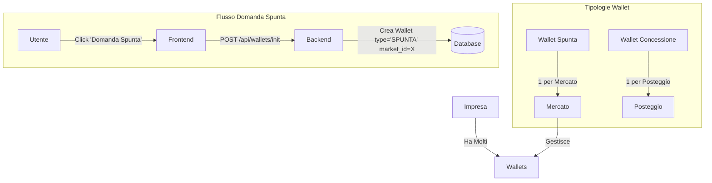

# 🔑 BLUEPRINT MIO HUB - AGGIORNATO 29 DICEMBRE 2025 (v3)

**DOCUMENTO DI CONTESTO PER NUOVE SESSIONI MANUS**

---

## 📋 INDICE

1. [Aggiornamento 29 Dicembre (Spunta & Storico)](#-aggiornamento-29-dicembre-2025-sessione-notturna---spunta--storico)
2. [Repository e Deploy](#-repository-e-deploy)
3. [Accesso Server Hetzner](#-accesso-server-hetzner)
4. [Database Neon PostgreSQL](#-database-neon-postgresql)
5. [Architettura Sistema Chat](#-architettura-sistema-chat)
6. [Schema Database agent_messages](#-schema-database-agent_messages)
7. [Flusso Messaggi e Mode](#-flusso-messaggi-e-mode)
8. [Logica di Rendering Frontend](#-logica-di-rendering-frontend)
9. [File Chiave da Conoscere](#-file-chiave-da-conoscere)
10. [Comandi Utili](#-comandi-utili)
11. [Agenti del Sistema](#-agenti-del-sistema)
12. [Wallet / PagoPA](#-wallet--pagopa)
13. [Imprese & Qualificazioni](#-imprese--qualificazioni)
14. [API Inventory (Integrazioni)](#-api-inventory-integrazioni)

---

## 💡 AGGIORNAMENTO 29 DICEMBRE 2025 (SESSIONE NOTTURNA - SPUNTA & STORICO)

### ✅ Nuove Funzionalità Implementate

1.  **Wallet Spunta Specifico per Mercato**
    -   **Architettura**: I wallet di tipo `SPUNTA` non sono più unici per azienda, ma specifici per ogni coppia `(Azienda, Mercato)`.
    -   **Motivazione**: I pagamenti della spunta devono confluire nelle casse specifiche del comune che gestisce quel mercato.
    -   **Visualizzazione**: Nella lista imprese, il badge "Spunta" mostra il saldo del wallet relativo al mercato che si sta visualiz35	2.  **Domanda Spunta**
36	    -   **Nuovo Flusso**: Aggiunto pulsante "Domanda Spunta" nel tab Autorizzazioni.
37	    -   **Funzionamento**: Permette di creare un nuovo wallet spunta per un'impresa in uno specifico mercato.
38	    -   **UX**: La modale mostra esplicitamente il Mercato e il Comune di riferimento per evitare errori.
39	    -   **Nota**: Per le imprese con molti wallet spunta, la visualizzazione è filtrata per mostrare solo quello pertinente al mercato corrente.
3.  **Fix Storico PagoPA**
    -   **Problema**: Crash della pagina storico dovuto a conflitti di nomi (`History` vs `window.history`) e dati sporchi.
    -   **Soluzione**: Rinominato componente in `HistoryIcon`, blindato il rendering delle date e filtrati i dati non validi.

4.  **Indicatori Visivi (Semafori)**
    -   **Lista Imprese**: Aggiunti semafori (Verde/Rosso) e importi per:
        -   Concessioni (Posteggi)
        -   Wallet Spunta (Ricaricabile)
    -   **Logica**: € 0.00 è considerato "Da Pagare" (Rosso) per le concessioni, mentre per la spunta dipende dal saldo positivo/negativo.

### 📐 Architettura Wallet Spunta



---

## 🚀 REPOSITORY E DEPLOY

### Frontend (Vercel)
| Campo | Valore |
|-------|--------|
| **Repository** | `https://github.com/Chcndr/dms-hub-app-new` |
| **Branch** | `master` |
| **URL Produzione** | `https://dms-hub-app-new.vercel.app` |
| **Deploy** | Automatico su push a master |
| **Framework** | Vite + React + TypeScript + TailwindCSS |

### Backend (Hetzner)
| Campo | Valore |
|-------|--------|
| **Repository** | `https://github.com/Chcndr/mihub-backend-rest` |
| **Branch** | `master` |
| **URL Produzione** | `https://orchestratore.mio-hub.me` |
| **Deploy** | Manuale: `git pull` + `pm2 restart` |
| **Framework** | Node.js + Express |

### Flusso di Lavoro OBBLIGATORIO
```
1. Modifiche locali nel sandbox
2. git add -A && git commit -m "messaggio" && git push origin master
3. Per backend: SSH su Hetzner → git pull → pm2 restart mihub-backend
4. Per frontend: Vercel fa deploy automatico
```

**⚠️ MAI modificare direttamente sul server Hetzner!**

---

## 🖥️ ACCESSO SERVER HETZNER

| Campo | Valore |
|-------|--------|
| **IP** | `157.90.29.66` |
| **User** | `root` |
| **Chiave SSH** | `/home/ubuntu/.ssh/manus_hetzner_key` |
| **Percorso Backend** | `/root/mihub-backend-rest` |

### Comando SSH
```bash
ssh -i /home/ubuntu/.ssh/manus_hetzner_key root@157.90.29.66
```

### Deploy Backend (dopo push su GitHub)
```bash
ssh -i /home/ubuntu/.ssh/manus_hetzner_key root@157.90.29.66 'cd /root/mihub-backend-rest && git pull && pm2 restart mihub-backend'
```

---

## 💾 DATABASE NEON POSTGRESQL

| Campo | Valore |
|-------|--------|
| **Host** | `ep-bold-silence-adftsojg-pooler.c-2.us-east-1.aws.neon.tech` |
| **Database** | `neondb` |
| **User** | `neondb_owner` |
| **Password** | `npg_lYG6JQ5Krtsi` |
| **SSL** | `require` |

---

## 🏗️ ARCHITETTURA SISTEMA CHAT

### Viste Frontend
| Vista | Descrizione | Mode | Conversation ID |
|-------|-------------|------|-----------------|
| **Chat MIO** | Chat principale con orchestratore | `auto` | `mio-main` |
| **Vista 4 Agenti** | Mostra coordinamento MIO→Agenti | `auto` | `mio-{agent}-coordination` |
| **Chat Singola Manus** | Chat diretta con Manus | `direct` | `user-manus-direct` |
| **Chat Singola Abacus** | Chat diretta con Abacus | `direct` | `user-abacus-direct` |
| **Chat Singola GPT Dev** | Chat diretta con GPT Dev | `direct` | `user-gptdev-direct` |
| **Chat Singola Zapier** | Chat diretta con Zapier | `direct` | `user-zapier-direct` |

---

## 📊 SCHEMA DATABASE agent_messages

```sql
CREATE TABLE agent_messages (
  id                uuid PRIMARY KEY DEFAULT gen_random_uuid(),
  conversation_id   varchar NOT NULL,    -- ID conversazione
  sender            varchar NOT NULL,    -- Chi ha inviato: 'user', 'mio', 'manus', 'abacus', 'gptdev', 'zapier'
  recipient         varchar,             -- Destinatario (opzionale)
  role              varchar NOT NULL,    -- 'user' | 'assistant'
  message           text NOT NULL,       -- Contenuto del messaggio
  agent             varchar,             -- Agente che ha risposto
  mode              varchar DEFAULT 'auto',  -- 'auto' | 'direct'
  meta              jsonb,               -- Metadati aggiuntivi
  tool_call_id      varchar,             -- ID chiamata tool (se presente)
  tool_name         varchar,             -- Nome tool usato
  tool_args         jsonb,               -- Argomenti tool
  error             boolean,             -- Flag errore
  created_at        timestamptz DEFAULT NOW()
);
```

### Valori Campi Chiave

| Campo | Valori Possibili | Descrizione |
|-------|------------------|-------------|
| **sender** | `user`, `mio`, `manus`, `abacus`, `gptdev`, `zapier` | Chi ha inviato il messaggio |
| **role** | `user`, `assistant` | Ruolo nel contesto LLM |
| **mode** | `auto`, `direct` | Modalità di routing |
| **agent** | `null`, `mio`, `manus`, `abacus`, `gptdev`, `zapier` | Agente che ha processato |

---

## 🔄 FLUSSO MESSAGGI E MODE

### Flusso Mode AUTO (User → MIO → Agente)

```
1. User scrive a MIO
   └→ Salvato: mio-main, sender='user', role='user', mode='auto'

2. MIO analizza e delega a Manus
   └→ Salvato: mio-manus-coordination, sender='mio', role='user', mode='auto'

3. Manus risponde
   └→ Salvato: mio-manus-coordination, sender='manus', role='assistant', mode='auto'
   └→ Salvato: mio-main, sender='manus', role='assistant', mode='auto'

4. MIO elabora e risponde all'utente
   └→ Salvato: mio-main, sender='mio', role='assistant', mode='auto'
```

### Flusso Mode DIRECT (User → Agente)

```
1. User scrive direttamente a Manus
   └→ Salvato: user-manus-direct, sender='user', role='user', mode='direct'

2. Manus risponde
   └→ Salvato: user-manus-direct, sender='manus', role='assistant', mode='direct'
```

---

## 🎨 LOGICA DI RENDERING FRONTEND

### Chat Principale MIO

**File**: `DashboardPA.tsx` (riga 4102)

```tsx
<span>da {msg.role === 'user' ? 'Tu' : msg.agentName?.toUpperCase() || 'MIO'}</span>
```

- Se `role === 'user'`, mostra **"Tu"**
- Altrimenti, mostra il nome dell'agente (es. "MANUS") o "MIO" come fallback

### Vista Singola (GPT Dev, Manus, Abacus, Zapier)

**File**: `DashboardPA.tsx` (riga 4368)

```tsx
<span>da {msg.role === 'user' ? 'Tu' : (msg.agent || 'agente')}</span>
```

- Se `role === 'user'`, mostra **"Tu"**
- Altrimenti, mostra il nome dell'agente (es. "gptdev") o "agente" come fallback

---

## 📁 FILE CHIAVE DA CONOSCERE

### Backend (mihub-backend-rest)

| File | Descrizione |
|------|-------------|
| `routes/orchestrator.js` | Endpoint principale `/api/mihub/orchestrator`, routing messaggi |
| `utils/direct_saver.js` | Salvataggio diretto messaggi nel database |
| `src/modules/orchestrator/database.js` | Funzioni database: `addMessage`, `saveDirectMessage`, `createConversation` |
| `src/modules/orchestrator/llm.js` | Chiamate agli agenti LLM (MIO, Manus, Abacus, GPT Dev) |
| `config/database.js` | Configurazione connessione PostgreSQL |

### Frontend (dms-hub-app-new)

| File | Descrizione |
|------|-------------|
| `api/mihub/get-messages.ts` | Endpoint Vercel per recuperare messaggi dal database |
| `api/mihub/orchestrator-proxy.ts` | Proxy per inoltrare messaggi all'orchestratore Hetzner |
| `client/src/contexts/MioContext.tsx` | Context React per chat MIO, gestisce invio/ricezione messaggi |
| `client/src/hooks/useAgentLogs.ts` | Hook per caricare messaggi agenti (Vista 4 + Chat Singole) |
| `client/src/pages/DashboardPA.tsx` | Pagina principale dashboard con tutte le chat |
| `client/src/api/orchestratorClient.ts` | Client per chiamare backend orchestrator |
| `client/src/lib/agentHelper.ts` | Helper per invio messaggi agli agenti |
| `client/src/components/WalletPanel.tsx` | 🆕 UI gestione wallet operatori |
| `server/walletRouter.ts` | 🆕 API wallet (20 endpoint) |
| `server/services/efilPagopaService.ts` | 🆕 Integrazione E-FIL PagoPA |
| `server/services/apiInventoryService.ts` | 🆕 Inventario 122+ endpoint API |

---

## 🛠️ COMANDI UTILI

### Test API Backend
```bash
# Test MIO mode=auto
curl -s -X POST https://orchestratore.mio-hub.me/api/mihub/orchestrator \
  -H "Content-Type: application/json" \
  -d '{"mode": "auto", "message": "Test", "conversationId": "mio-main"}' | jq .

# Test Manus mode=direct
curl -s -X POST https://orchestratore.mio-hub.me/api/mihub/orchestrator \
  -H "Content-Type: application/json" \
  -d '{"mode": "direct", "targetAgent": "manus", "message": "Test", "conversationId": "user-manus-direct"}' | jq .
```

### Query Database
```bash
cd /home/ubuntu/mihub-backend-rest && node -e "
const { Pool } = require('pg');
const pool = new Pool({
  host: 'ep-bold-silence-adftsojg-pooler.c-2.us-east-1.aws.neon.tech',
  database: 'neondb',
  user: 'neondb_owner',
  password: 'npg_lYG6JQ5Krtsi',
  ssl: { rejectUnauthorized: false }
});

async function check() {
  const result = await pool.query(\"
    SELECT conversation_id, sender, role, mode, LEFT(message, 50) as msg, created_at 
    FROM agent_messages 
    WHERE created_at > NOW() - INTERVAL '10 minutes'
    ORDER BY created_at DESC
    LIMIT 20
  \");
  console.log(result.rows);
  await pool.end();
}
check();
"
```

### PM2 Logs
```bash
ssh -i /home/ubuntu/.ssh/manus_hetzner_key root@157.90.29.66 'pm2 logs mihub-backend --lines 100'
```

---

## 🤖 AGENTI DEL SISTEMA

| Agente | Stato | Funzione |
|--------|-------|----------|
| **MIO** | ✅ OK | Orchestratore principale, coordina gli altri agenti |
| **Manus** | ✅ OK | Navigazione web, esecuzione comandi SSH, file system |
| **Abacus** | ✅ OK | Query SQL, accesso database PostgreSQL/Neon |
| **GPT Dev** | ✅ OK | Accesso repository GitHub, lettura file, operazioni Git |
| **Zapier** | ❌ Errore | Chiave API invalida (da configurare) |

---

## 💳 WALLET / PAGOPA

### Overview

Sistema di borsellino elettronico prepagato per operatori mercatali con integrazione **E-FIL Plug&Pay** per pagamenti PagoPA. Mercato pilota: **Comune di Grosseto**.

### Componenti

| File | Descrizione |
|------|-------------|
| `server/walletRouter.ts` | API tRPC per gestione wallet (20 endpoint) |
| `server/services/efilPagopaService.ts` | Integrazione SOAP E-FIL |
| `client/src/components/WalletPanel.tsx` | UI gestione wallet |
| `.env.efil.example` | Configurazione E-FIL |

### Tabelle Database

| Tabella | Descrizione |
|---------|-------------|
| `operatore_wallet` | Wallet per ogni impresa |
| `wallet_transazioni` | Storico movimenti |
| `tariffe_posteggio` | Tariffe per tipo posteggio |
| `avvisi_pagopa` | Avvisi PagoPA generati |

### API Endpoint Wallet (20)

| Endpoint | Metodo | Descrizione |
|----------|--------|-------------|
| `wallet.stats` | GET | Statistiche dashboard |
| `wallet.list` | GET | Lista wallet |
| `wallet.getById` | GET | Dettaglio wallet |
| `wallet.getByImpresa` | GET | Wallet per impresa |
| `wallet.create` | POST | Crea wallet |
| `wallet.updateStatus` | POST | Aggiorna stato |
| `wallet.transazioni` | GET | Storico transazioni |
| `wallet.ricarica` | POST | Ricarica wallet |
| `wallet.decurtazione` | POST | Decurtazione |
| `wallet.generaAvvisoPagopa` | POST | Genera avviso PagoPA |
| `wallet.pagamentoSpontaneo` | POST | Pagamento immediato |
| `wallet.verificaPagamento` | GET | Verifica IUV |
| `wallet.generaPdfAvviso` | GET | PDF avviso |
| `wallet.generaPdfQuietanza` | GET | PDF quietanza |
| `wallet.avvisiPagopa` | GET | Lista avvisi |
| `wallet.tariffe` | GET | Tariffe posteggio |
| `wallet.verificaSaldoPresenza` | POST | Verifica saldo check-in |
| `wallet.ricercaPagamentiGiornalieri` | GET | Ricerca pagamenti |
| `wallet.reportRiconciliazione` | GET | Report riconciliazione |
| `wallet.reportMercato` | GET | Report per mercato |

### UI WalletPanel

**Tab Wallet Operatori:**
- Statistiche: wallet attivi, saldo basso, bloccati, saldo totale
- Lista wallet con ricerca e filtri
- Dettaglio wallet con saldo, giorni coperti, transazioni
- Dialog "Genera Avviso PagoPA":
  - Input importo + bottoni suggeriti (€50, €100, €250, €500, €1000)
  - Preview nuovo saldo e giorni coperti
  - Generazione IUV e Codice Avviso (18 cifre)
  - Copia negli appunti, Download PDF, Paga Ora
- Dialog "Pagamento Immediato" con redirect checkout

**Tab PagoPA:**
- Statistiche: totale incassato, pagati, in attesa, scaduti
- Lista avvisi con stato (EMESSO, PAGATO, SCADUTO)
- Azioni: Download PDF, Paga Ora, Scarica Quietanza

**Tab Tariffe:**
- Lista tariffe per tipo posteggio
- CRUD tariffe

**Tab Riconciliazione:**
- Report ricariche/decurtazioni
- Sincronizzazione E-FIL

### Servizi E-FIL

| Servizio | Funzione |
|----------|----------|
| WSPayment | Pagamento spontaneo + checkout |
| WSFeed | Creazione avvisi PagoPA |
| WSDeliver | Verifica stato pagamenti |
| WSGeneratorPdf | PDF avviso/quietanza |
| WSPaymentNotify | Notifica fuori nodo |

### Flusso Check-in con Wallet

```
1. Operatore richiede check-in
2. Sistema verifica stato wallet
3. Sistema verifica saldo vs tariffa
4. Se OK: decurta e crea presenza
5. Se saldo < minimo: blocca wallet
6. Se bloccato: rifiuta check-in
```

### Configurazione E-FIL

```bash
EFIL_BASE_URL=https://test.plugnpay.efil.it/plugnpay
EFIL_USERNAME=<user>
EFIL_PASSWORD=<pass>
EFIL_APPLICATION_CODE=<fornito da E-FIL>
EFIL_ID_GESTIONALE=DMS-GROSSETO
DMS_PAGOPA_RETURN_URL=https://miohub.app/payments/return
DMS_PAGOPA_CALLBACK_URL=https://miohub.app/api/wallet/callback
```

---

## 🏢 IMPRESE & QUALIFICAZIONI

### API Endpoint Imprese (6)

| Endpoint | Metodo | Descrizione |
|----------|--------|-------------|
| `imprese.list` | GET | Lista imprese con filtri |
| `imprese.getById` | GET | Dettaglio impresa |
| `qualificazioni.list` | GET | Lista qualificazioni |
| `imprese.qualificazioni` | GET | Qualificazioni impresa |
| `imprese.rating` | GET | Semaforo Conformità |
| `imprese.migratePdnd` | POST | Migrazione PDND |

### Semaforo Conformità

Il sistema calcola automaticamente un rating di conformità per ogni impresa:

- 🟢 **VERDE** - Tutti i documenti in regola
- 🟡 **GIALLO** - Documenti in scadenza (< 30 giorni)
- 🔴 **ROSSO** - Documenti scaduti o mancanti

---

## 🔗 API INVENTORY (INTEGRAZIONI)

### Overview

La sezione **Integrazioni** nella Dashboard PA è il centro di controllo per tutte le API e integrazioni esterne. Mostra **127 endpoint API** catalogati per categoria.

### Categorie API

| Categoria | Endpoint | Descrizione |
|-----------|----------|-------------|
| **analytics** | 7 | Statistiche piattaforma |
| **system** | 5 | Health check, auth, config |
| **carbon** | 3 | Crediti di carbonio |
| **logs** | 2 | Log di sistema |
| **users** | 1 | Statistiche utenti |
| **sustainability** | 1 | Metriche sostenibilità |
| **businesses** | 1 | Attività commerciali |
| **inspections** | 1 | Ispezioni e violazioni |
| **notifications** | 1 | Notifiche |
| **civic** | 1 | Segnalazioni civiche |
| **mobility** | 1 | Dati mobilità TPER |
| **integrations** | 2 | TPER Bologna |
| **dms** | 30+ | Gestione mercati DMS |
| **guardian** | 5 | Monitoring e debug |
| **mihub** | 11 | Multi-agent system |
| **wallet** | 20 | 💳 Wallet/PagoPA |
| **imprese** | 6 | 🏢 Imprese & Qualificazioni |
| **sync** | 5 | 🔄 Sincronizzazione gestionale |

### Tab Disponibili (6)

| Tab | Funzione |
|-----|----------|
| **API Dashboard** | Lista 127 endpoint, API Playground con test tRPC, Statistiche utilizzo real-time |
| **Connessioni** | Lista connessioni esterne (DMS Legacy, Pepe GIS), Health check, Data Owner |
| **API Keys** | Gestione chiavi API per applicazioni esterne |
| **Webhook** | Configurazione webhook, Log chiamate |
| **Secrets** 🆕 | Gestione credenziali servizi esterni (LLM, GitHub, E-FIL, ecc.) |
| **Sync Status** 🆕 | Sincronizzazione gestionale Heroku (ora reale, non mock) |

### Sync Status - Sistema Reale

**Tabelle Database:**
- `sync_config` - Configurazione sincronizzazione
- `sync_jobs` - Job di sincronizzazione
- `sync_logs` - Log dettagliati

**API Endpoints Sync (5):**
| Endpoint | Metodo | Descrizione |
|----------|--------|-------------|
| `sync.status` | GET | Stato sincronizzazione |
| `sync.jobs` | GET | Lista job recenti |
| `sync.logs` | GET | Log dettagliati per job |
| `sync.trigger` | POST | Avvia sync manuale |
| `sync.updateConfig` | POST | Salva configurazione |
| `sync.getConfig` | GET | Ottieni configurazione |

### File Chiave

| File | Descrizione |
|------|-------------|
| `server/services/apiInventoryService.ts` | Inventario 127 endpoint |
| `server/integrationsRouter.ts` | Router con sync, apiKeys, webhook |
| `client/src/components/Integrazioni.tsx` | Pagina Integrazioni (6 tab) |
| `drizzle/schema.ts` | Tabelle sync_config, sync_jobs, sync_logs |
| `Chcndr/MIO-hub/api/index.json` | Single source of truth endpoint |

---

*Documento aggiornato il 29 Dicembre 2025 - Manus AI*
*Da allegare all'inizio di ogni nuova sessione di lavoro*
