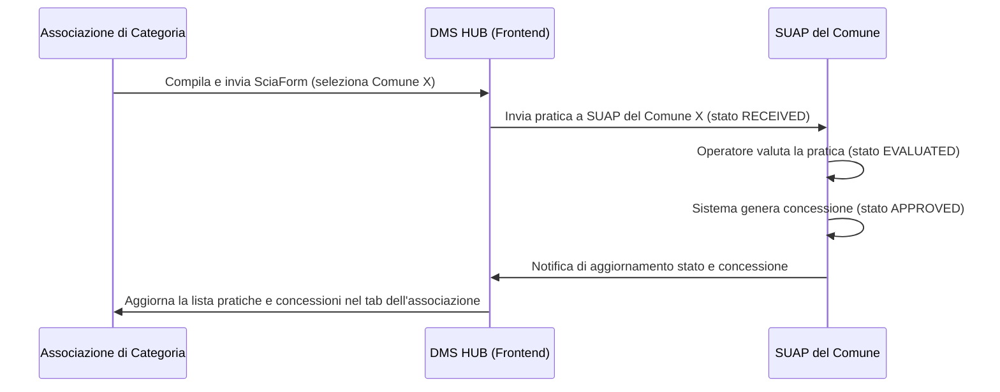

# PROGETTO: Modulo SCIA & Pratiche per Associazioni di Categoria

> **Versione:** v8.11.0
> **Data:** 21 Febbraio 2026
> **Autore:** Manus AI
> **Stato:** Progetto per Approvazione

---

## 1. Introduzione e Obiettivo Strategico

Questo documento delinea il progetto per l'integrazione di un nuovo modulo **"SCIA & Pratiche"** all'interno della sezione **"Enti e Associazioni"** della DashboardPA. L'obiettivo strategico è fornire alle associazioni di categoria uno strumento digitale per la compilazione e l'invio di pratiche amministrative (SCIA, Domande di Spunta) per conto dei loro associati. Questo potenzia il ruolo delle associazioni, le integra nel nostro ecosistema digitale e crea un nuovo flusso di ricavi basato su una percentuale per ogni pratica gestita, evitando la disintermediazione e rafforzando la partnership con attori chiave del settore.

## 2. Architettura e Riutilizzo dei Componenti

Il principio guida è il **massimo riutilizzo dei componenti esistenti** per garantire rapidità di sviluppo, stabilità e coerenza dell'interfaccia. Non verranno creati nuovi componenti, ma si orchestreranno quelli già presenti nel modulo SUAP.

| Componente | Path | Funzione nel Nuovo Modulo |
|---|---|---|
| `SciaForm` | `components/suap/SciaForm.tsx` | Form principale per la compilazione delle SCIA. Verrà configurato per permettere la selezione del Comune di destinazione. |
| `DomandaSpuntaForm` | `components/suap/DomandaSpuntaForm.tsx` | Form per la compilazione delle Domande di Spunta. |
| `ListaDomandeSpuntaSuap` | `components/suap/ListaDomandeSpuntaSuap.tsx` | Tabella per visualizzare le domande di spunta inviate dall'associazione. |
| `SuapPanel` (logica) | `components/SuapPanel.tsx` | La logica di gestione stato, liste pratiche e notifiche verrà riutilizzata per popolare le sezioni del nuovo modulo. |

Le API backend esistenti sono già in grado di supportare il flusso completo. L'unica modifica futura sarà l'aggiunta di un campo `associazione_id` alla tabella `suap_pratiche` per un tracciamento e una reportistica più efficaci.

## 3. Struttura Dettagliata del Nuovo Sotto-tab

Il nuovo sotto-tab **"SCIA & Pratiche"** sarà inserito come terza opzione nella sezione "Enti e Associazioni" e sarà organizzato in sezioni verticali per un'esperienza utente chiara e guidata.

### Sezione 1: Dashboard Pratiche
Una serie di KPI mostrerà una panoramica immediata dell'attività:
- **Pratiche Inviate:** Conteggio totale delle pratiche (SCIA + Spunta) inviate.
- **In Lavorazione:** Pratiche con stato `RECEIVED`, `PRECHECK`, `EVALUATED`.
- **Approvate:** Pratiche con stato `APPROVED`.
- **Concessioni Attive:** Conteggio delle concessioni generate e attualmente attive.

### Sezione 2: Azioni Rapide e Gestione Bollo

**Integrazione Bollo (Fase 1 - Dichiarazione Sostitutiva):**
- Il `SciaForm` e il `DomandaSpuntaForm` verranno modificati per includere i campi per l'inserimento dei dati delle **due marche da bollo da 16€** (numero seriale, data) e la casella per la **dichiarazione sostitutiva di atto di notorietà**.
- Questo permette di essere immediatamente operativi e conformi alla normativa, gestendo il requisito del bollo senza attendere l'integrazione tecnica con PagoPA.

Due bottoni principali per avviare i processi:
- **"Nuova SCIA"**: Apre il componente `SciaForm` in una modal full-page. Il form includerà un selettore per il **Comune di destinazione**, popolato con tutti i comuni attivi nel sistema. La selezione del comune filtrerà dinamicamente i mercati disponibili.
- **"Nuova Domanda Spunta"**: Apre il `DomandaSpuntaForm`.

### Sezione 3: Pratiche Inviate
Una tabella dettagliata mostrerà tutte le pratiche inviate dall'associazione, con funzionalità di ricerca e filtro. Le colonne includeranno:
- **Protocollo**
- **Impresa Associata**
- **Comune Destinazione**
- **Mercato**
- **Stato** (con badge colorato e semaforo identico a quello del SUAP)
- **Score** (se valutata)
- **Data Invio**
- **Azioni** (Dettaglio, Valuta, Genera Concessione - se l'associazione ha i permessi)

### Sezione 4: Lista Associati Tesserati
Questa sezione, cruciale per la gestione, mostrerà una lista di tutte le imprese associate, con la possibilità di cliccare su ciascuna per visualizzare una **scheda di dettaglio** contenente:
- Dati anagrafici dell'impresa.
- Storico delle pratiche presentate.
- Concessioni attive.
- Posizione nei mercati (posteggi assegnati).
- Wallet Spunta e storico presenze.

## 4. Flusso Operativo End-to-End

Il flusso di lavoro è progettato per essere trasparente e integrato con il modulo SUAP esistente.

## 5. Modello di Business e Vantaggi

Il modello di business si basa su una **commissione per ogni pratica** gestita tramite la piattaforma. Questo approccio offre molteplici vantaggi:

- **Nuovo Flusso di Ricavi:** Genera entrate ricorrenti e scalabili.
- **Partnership Strategica:** Trasforma le associazioni da potenziali concorrenti a partner e canali di vendita.
- **Effetto Lock-in:** L'efficienza e l'integrazione dello strumento rendono le associazioni dipendenti dalla piattaforma, aumentando la retention.
- **Valore Aggiunto:** Offre un servizio ad alto valore aggiunto che semplifica drasticamente il lavoro burocratico delle associazioni.

## 6. Prossimi Passi

1. **Approvazione del Progetto:** Revisione e approvazione di questo documento.
2. **Implementazione Frontend:** Modifica del file `DashboardPA.tsx` per aggiungere il nuovo sotto-tab e integrare i componenti esistenti.
3. **Sviluppo Backend (Futuro):** Aggiunta del campo `associazione_id` al modello dati `suap_pratiche` e creazione dell'endpoint per la lista associati.
4. **Test e Rilascio:** Fase di test completa e rilascio della versione v8.11.0.
