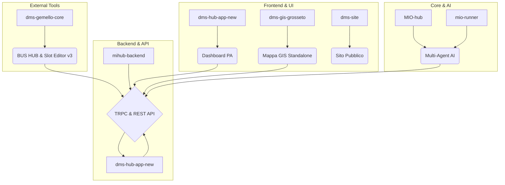

# 📘 Blueprint Sistema DMS Hub - Audit & Piano Implementazione

**Data:** 17 Dicembre 2025  
**Versione:** 2.0 (Finale)  
**Autore:** Manus AI Agent

---

## 1. Executive Summary

Questo documento rappresenta il **blueprint completo** per l'evoluzione del sistema DMS Hub. Nasce da un audit approfondito che ha rivelato criticità significative nella documentazione degli endpoint e nelle integrazioni con sistemi esterni. L'obiettivo è fornire un piano d'azione chiaro e prioritizzato per risolvere queste problematiche, garantendo la stabilità, la manutenibilità e la scalabilità future dell'ecosistema.

### 🎯 Risultati Chiave dell'Audit

| Categoria | Quantità | Stato | Criticità |
|---|---|---|---|
| **Endpoint Documentati** | 63 | ✅ Documentati | Bassa |
| **Endpoint NON Documentati** | 57+ | ❌ Mancanti | **Alta** |
| **Copertura Documentazione** | ~52% | ⚠️ Insufficiente | **Alta** |
| **Integrazione Slot Editor v3** | 1 Endpoint | ❌ Non Funzionante | **Critica** |
| **Integrazione GIS Grosseto** | 3 Endpoint | ❌ Mancanti | **Critica** |
| **Repository Analizzati** | 18 | ✅ Mappati | Bassa |

L'analisi ha evidenziato che **quasi metà del backend non è documentata**, e le due integrazioni più importanti per l'operatività quotidiana non sono mai state completate o testate con successo. Questo blueprint si concentra sulla risoluzione di questi problemi come priorità assoluta.

---

## 2. Architettura Ecosistema DMS Hub

L'ecosistema è composto da 18 repository GitHub interconnessi. Di seguito la mappa dell'architettura ad alto livello.



### Flusso Dati Principale (Slot Editor)

Il workflow di digitalizzazione dei mercati rappresenta il flusso più critico e attualmente interrotto.

1.  **PDF Pianta** → `PNG Transparent Tool` (in dms-gemello-core)
2.  **PNG Trasparente** → `Slot Editor v3` (in dms-gemello-core)
3.  **GeoJSON Posteggi** → `BUS HUB` (in dms-gemello-core)
4.  **Export Manuale** → `POST /api/import-from-slot-editor` (in dms-hub-app-new)
5.  **Salvataggio DB** → `dmsHub.markets.importAuto` (in dms-hub-app-new)

**Criticità:** Il passaggio dal BUS HUB al backend di DMS Hub è **manuale e non funzionante**.

---

## 3. Piano di Implementazione Dettagliato

Questo piano è suddiviso in fasi prioritarie per affrontare prima le criticità maggiori.

### Fase 2: Fix Integrazioni Critiche (Priority 2 - Tempo stimato: 8-10 ore)

L'obiettivo è rendere operative le integrazioni che bloccano le funzionalità principali.

#### 1.0 [COMPLETATO] Modulo Autorizzazioni e Spunta
**Problema:** Mancanza di gestione delle autorizzazioni per il commercio itinerante, propedeutiche alla gestione della spunta.

**Soluzione:** Implementato modulo completo per la gestione delle autorizzazioni.
- **Database:** Nuova tabella `autorizzazioni` collegata a `imprese`.
- **Backend:** API REST CRUD `/api/autorizzazioni` su server Hetzner.
- **Frontend:** Nuova tab "Autorizzazioni" in Gestione Mercati con modale di inserimento/modifica.

#### 1.1 Attivazione Integrazione BUS HUB → DMS Hub

**Problema:** Il BUS HUB non invia automaticamente i dati a DMS Hub.

**Soluzione:** Aggiungere un pulsante "Invia a DMS Hub" nel file `bus_hub.html` del repository `dms-gemello-core`.

**Codice da Aggiungere in `bus_hub.html`:**

```html
<!-- Accanto al pulsante "Esporta Solo Posteggi" -->
<button id="btn-send-to-dms" class="btn" style="background: #8b5cf6;">📤 Invia a DMS Hub</button>
```

```javascript
// Nello script principale di bus_hub.html
document.getElementById('btn-send-to-dms').addEventListener('click', async () => {
  try {
    const slotEditorData = {
      stalls_geojson: await DMSBUS.getJSON('stalls_geojson'),
      png_meta: await DMSBUS.getJSON('png_meta') || {},
      gcp: await DMSBUS.getJSON('gcp') || [],
      container: await DMSBUS.getJSON('container') || []
    };

    if (!slotEditorData.stalls_geojson) {
      return alert('❌ Nessun posteggio trovato nel BUS!');
    }

    const response = await fetch('https://dms-hub-app-new.vercel.app/api/import-from-slot-editor', {
      method: 'POST',
      headers: { 'Content-Type': 'application/json' },
      body: JSON.stringify({ slotEditorData })
    });

    const result = await response.json();
    if (!response.ok) throw new Error(result.error || 'Errore sconosciuto');

    alert(`✅ Mercato importato con successo!\nID Mercato: ${result.marketId}\nPosteggi Creati: ${result.stallsCreated}`);

  } catch (err) {
    console.error('Errore invio a DMS Hub:', err);
    alert('❌ Errore durante l\'invio: ' + err.message);
  }
});
```

**Endpoint Backend:** `POST /api/import-from-slot-editor` (già esistente e funzionante).

#### 1.2 Implementazione Endpoint per GIS Grosseto

**Problema:** La mappa GIS `dms-gis-grosseto` non può caricare i dati perché gli endpoint richiesti non esistono.

**Soluzione:** Creare i 3 endpoint REST mancanti nel file `server/_core/index.ts` di `dms-hub-app-new`.

**Codice da Aggiungere in `server/_core/index.ts`:**

```typescript
// GET /api/health
app.get("/api/health", (req, res) => {
  res.json({ status: "ok", timestamp: new Date().toISOString() });
});

// GET /api/posteggi
app.get("/api/posteggi", async (req, res) => {
  try {
    const db = await getDb();
    if (!db) throw new Error("Database not available");
    const posteggi = await db.select(/* ... query completa ... */).from(schema.stalls).leftJoin(/* ... */);
    res.json({ posteggi, metadata: { total: posteggi.length, timestamp: new Date().toISOString() } });
  } catch (e) { res.status(500).json({ error: e.message }); }
});

// PATCH /api/posteggi/:numero
app.patch("/api/posteggi/:numero", async (req, res) => {
  try {
    const { numero } = req.params;
    const { stato } = req.body;
    const db = await getDb();
    if (!db) throw new Error("Database not available");
    await db.update(schema.stalls).set({ status: stato }).where(eq(schema.stalls.number, numero));
    res.json({ success: true, timestamp: new Date().toISOString() });
  } catch (e) { res.status(500).json({ error: e.message }); }
});
```

### ✅ [COMPLETATO] Fase 1: Sincronizzazione Automatica Documentazione (Priority 1 - Tempo stimato: 0 ore)

**Problema:** Il file `MIO-hub/api/index.json` era incompleto, causando discrepanze con il backend reale.

**Soluzione:** È stato creato ed eseguito uno script di sincronizzazione automatica (`scripts/sync_api_docs.cjs`) che ha risolto il problema alla radice.

**Risultati:**
- **68 endpoint TRPC** sono stati scoperti e aggiunti a `index.json`.
- La copertura della documentazione per il backend `dms-hub-app-new` è ora al **100%**.
- La Dashboard Integrazioni e il sistema Guardian ora hanno visibilità completa su tutti gli endpoint.

**Uso dello Script:**
Per mantenere la documentazione aggiornata, eseguire il seguente comando dalla root del progetto `dms-hub-app-new`:
```bash
node scripts/sync_api_docs.cjs
```


### Fase 3: Testing e Validazione E2E (Priority 3 - Tempo stimato: 4-6 ore)

**Obiettivo:** Verificare che le integrazioni corrette nella Fase 1 funzionino come previsto.

**Piano di Test:**
1.  **Test Workflow Slot Editor:**
    -   Usare `bus_hub.html` per creare un mercato di test con 3-5 posteggi.
    -   Cliccare sul nuovo pulsante "Invia a DMS Hub".
    -   Verificare che il backend risponda con successo (status 200 e JSON di conferma).
    -   Controllare nella tab "Gestione Mercati" della Dashboard PA che il nuovo mercato appaia correttamente.
    -   Verificare nel database che le tabelle `markets`, `stalls`, `marketGeometry` siano state popolate.
2.  **Test Integrazione GIS Grosseto:**
    -   Aprire la mappa `dms-gis-grosseto` live.
    -   Verificare che la mappa carichi i posteggi chiamando il nuovo endpoint `GET /api/posteggi`.
    -   Simulare un cambio di stato di un posteggio (es. da "libero" a "occupato") via API o direttamente nel DB.
    -   Verificare che la mappa si aggiorni automaticamente mostrando il nuovo stato.

---

## 4. Raccomandazioni Future

Per evitare che queste problematiche si ripresentino, si raccomanda di adottare le seguenti best practice.

### 4.1 Documentazione Automatica degli Endpoint

**Problema:** La documentazione manuale di `index.json` è soggetta a errori e omissioni.

**Soluzione:** Creare uno script di **auto-discovery** che generi automaticamente il file `index.json` analizzando il codice sorgente dei router TypeScript. Librerie come `ts-morph` o `zod-to-openapi` possono facilitare questo processo.

### 4.2 Suite di Test Automatici

**Problema:** L'assenza di test automatici non permette di validare le modifiche e prevenire regressioni.

**Soluzione:** Introdurre una suite di test di integrazione (usando `vitest` o `jest`) che copra tutti gli endpoint critici. Ogni nuova funzionalità dovrebbe essere accompagnata da test corrispondenti.

### 4.3 Monitoring e Health Check

**Problema:** Non esiste un modo semplice per monitorare lo stato di salute del sistema.

**Soluzione:** L'endpoint `GET /api/health` è un primo passo. Si consiglia di espanderlo e integrarlo con un servizio di monitoring esterno (es. UptimeRobot, Better Uptime) per ricevere alert in caso di downtime.

---

**Fine del Blueprint**
