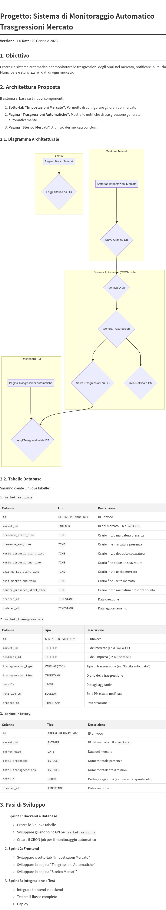

# Progetto: Sistema di Monitoraggio Automatico Trasgressioni Mercato

**Versione:** 1.0  
**Data:** 26 Gennaio 2026  
**Autore:** Manus AI

---

## 1. Obiettivo

Creare un sistema automatico per monitorare le trasgressioni degli orari nel mercato, notificare la Polizia Municipale e storicizzare i dati di ogni mercato. Il sistema deve integrarsi con la sezione "Gestione Mercati" esistente e con il modulo "Controlli e Sanzioni" della Polizia Municipale.

---

## 2. Architettura Proposta

Il sistema si basa su **3 nuovi componenti** che si integrano con l'infrastruttura esistente:

| Componente | Posizione | Funzione |
| :--- | :--- | :--- |
| **Sotto-tab "Impostazioni Mercato"** | Gestione Mercati → Test Mercato | Configurazione orari del mercato |
| **Pagina "Trasgressioni Automatiche"** | Controlli/Sanzioni → Nuovo sotto-tab | Visualizzazione notifiche automatiche |
| **Pagina "Storico Mercati"** | Gestione Mercati → Nuovo sotto-tab | Archivio mercati conclusi |

### 2.1. Diagramma Architetturale



```
┌─────────────────────────────────────────────────────────────────────────────┐
│                        GESTIONE MERCATI                                     │
│  ┌─────────────────────────────────────────────────────────────────────┐   │
│  │  Sotto-tab: IMPOSTAZIONI MERCATO                                    │   │
│  │  ┌─────────────────┐  ┌─────────────────┐  ┌─────────────────┐     │   │
│  │  │ Orari Presenza  │  │ Orari Spazzatura│  │ Orari Uscita    │     │   │
│  │  │ Start: 06:00    │  │ Start: 12:00    │  │ Start: 13:00    │     │   │
│  │  │ End: 08:00      │  │ End: 13:00      │  │ End: 14:00      │     │   │
│  │  └────────┬────────┘  └────────┬────────┘  └────────┬────────┘     │   │
│  │           │                    │                    │              │   │
│  └───────────┼────────────────────┼────────────────────┼──────────────┘   │
│              │                    │                    │                  │
│              ▼                    ▼                    ▼                  │
│  ┌─────────────────────────────────────────────────────────────────────┐   │
│  │                    TABELLA: market_settings                         │   │
│  └─────────────────────────────────────────────────────────────────────┘   │
└─────────────────────────────────────────────────────────────────────────────┘
                                    │
                                    │ CRON JOB (ogni 5 min)
                                    ▼
┌─────────────────────────────────────────────────────────────────────────────┐
│                    SISTEMA AUTOMATICO (Backend Hetzner)                     │
│  ┌─────────────────────────────────────────────────────────────────────┐   │
│  │  Verifica Orari vs Azioni Imprese                                   │   │
│  │  ┌─────────────────┐  ┌─────────────────┐  ┌─────────────────┐     │   │
│  │  │ Presenza fuori  │  │ Spazzatura fuori│  │ Uscita fuori    │     │   │
│  │  │ orario?         │  │ orario?         │  │ orario?         │     │   │
│  │  └────────┬────────┘  └────────┬────────┘  └────────┬────────┘     │   │
│  │           │ SÌ                 │ SÌ                 │ SÌ           │   │
│  │           ▼                    ▼                    ▼              │   │
│  │  ┌─────────────────────────────────────────────────────────────┐   │   │
│  │  │              GENERA TRASGRESSIONE AUTOMATICA                │   │   │
│  │  │  - Tipo: "Presenza anticipata/tardiva"                      │   │   │
│  │  │  - Tipo: "Deposito spazzatura fuori orario"                 │   │   │
│  │  │  - Tipo: "Uscita anticipata/tardiva"                        │   │   │
│  │  └─────────────────────────────────────────────────────────────┘   │   │
│  └─────────────────────────────────────────────────────────────────────┘   │
│                                    │                                       │
│              ┌─────────────────────┼─────────────────────┐                 │
│              ▼                     ▼                     ▼                 │
│  ┌───────────────────┐  ┌───────────────────┐  ┌───────────────────┐      │
│  │ market_transgressions│ │ notifiche (PM)    │ │ pm_watchlist      │      │
│  └───────────────────┘  └───────────────────┘  └───────────────────┘      │
└─────────────────────────────────────────────────────────────────────────────┘
                                    │
                                    ▼
┌─────────────────────────────────────────────────────────────────────────────┐
│                    DASHBOARD POLIZIA MUNICIPALE                             │
│  ┌─────────────────────────────────────────────────────────────────────┐   │
│  │  Sotto-tab: TRASGRESSIONI AUTOMATICHE                               │   │
│  │  ┌─────────────────────────────────────────────────────────────┐   │   │
│  │  │ Lista trasgressioni generate automaticamente                │   │   │
│  │  │ - Impresa: Mario Rossi                                      │   │   │
│  │  │ - Tipo: Uscita anticipata                                   │   │   │
│  │  │ - Orario: 12:30 (limite: 13:00)                             │   │   │
│  │  │ - Azione: [Emetti Verbale] [Ignora]                         │   │   │
│  │  └─────────────────────────────────────────────────────────────┘   │   │
│  └─────────────────────────────────────────────────────────────────────┘   │
└─────────────────────────────────────────────────────────────────────────────┘
                                    │
                                    │ A fine mercato
                                    ▼
┌─────────────────────────────────────────────────────────────────────────────┐
│                    STORICO MERCATI                                          │
│  ┌─────────────────────────────────────────────────────────────────────┐   │
│  │  TABELLA: market_history                                            │   │
│  │  - Data mercato                                                     │   │
│  │  - Totale presenze                                                  │   │
│  │  - Totale trasgressioni                                             │   │
│  │  - Dettagli JSON (presenze, spunta, incassi, etc.)                  │   │
│  └─────────────────────────────────────────────────────────────────────┘   │
└─────────────────────────────────────────────────────────────────────────────┘
```

---

## 3. Tabelle Database

### 3.1. Tabella `market_settings`

Memorizza le impostazioni degli orari per ogni mercato.

| Colonna | Tipo | Descrizione | Esempio |
| :--- | :--- | :--- | :--- |
| `id` | `SERIAL PRIMARY KEY` | ID univoco | 1 |
| `market_id` | `INTEGER NOT NULL` | ID del mercato (FK a `markets`) | 5 |
| `presence_start_time` | `TIME NOT NULL` | Orario inizio marcatura presenza | 06:00 |
| `presence_end_time` | `TIME NOT NULL` | Orario fine marcatura presenza | 08:00 |
| `spunta_presence_start_time` | `TIME NOT NULL` | Orario inizio marcatura presenza spunta | 07:30 |
| `waste_disposal_start_time` | `TIME NOT NULL` | Orario inizio deposito spazzatura | 12:00 |
| `waste_disposal_end_time` | `TIME NOT NULL` | Orario fine deposito spazzatura | 13:00 |
| `exit_market_start_time` | `TIME NOT NULL` | Orario inizio uscita mercato | 13:00 |
| `exit_market_end_time` | `TIME NOT NULL` | Orario fine uscita mercato | 14:00 |
| `is_active` | `BOOLEAN DEFAULT TRUE` | Se le impostazioni sono attive | true |
| `created_at` | `TIMESTAMP DEFAULT NOW()` | Data creazione | 2026-01-26 10:00:00 |
| `updated_at` | `TIMESTAMP DEFAULT NOW()` | Data aggiornamento | 2026-01-26 10:00:00 |

**Vincoli:**
- `UNIQUE(market_id)` - Un mercato può avere solo una configurazione
- `FK market_id → markets(id)`

**SQL di creazione:**
```sql
CREATE TABLE market_settings (
    id SERIAL PRIMARY KEY,
    market_id INTEGER NOT NULL UNIQUE REFERENCES markets(id),
    presence_start_time TIME NOT NULL,
    presence_end_time TIME NOT NULL,
    spunta_presence_start_time TIME NOT NULL,
    waste_disposal_start_time TIME NOT NULL,
    waste_disposal_end_time TIME NOT NULL,
    exit_market_start_time TIME NOT NULL,
    exit_market_end_time TIME NOT NULL,
    is_active BOOLEAN DEFAULT TRUE,
    created_at TIMESTAMP DEFAULT NOW(),
    updated_at TIMESTAMP DEFAULT NOW()
);
```

---

### 3.2. Tabella `market_transgressions`

Memorizza le trasgressioni rilevate automaticamente.

| Colonna | Tipo | Descrizione | Esempio |
| :--- | :--- | :--- | :--- |
| `id` | `SERIAL PRIMARY KEY` | ID univoco | 1 |
| `market_id` | `INTEGER NOT NULL` | ID del mercato | 5 |
| `market_date` | `DATE NOT NULL` | Data del mercato | 2026-01-26 |
| `business_id` | `INTEGER NOT NULL` | ID dell'impresa | 38 |
| `stall_id` | `INTEGER` | ID del posteggio (opzionale) | 12 |
| `transgression_type` | `VARCHAR(100) NOT NULL` | Tipo di trasgressione | USCITA_ANTICIPATA |
| `expected_time` | `TIME NOT NULL` | Orario previsto | 13:00 |
| `actual_time` | `TIME NOT NULL` | Orario effettivo | 12:30 |
| `difference_minutes` | `INTEGER NOT NULL` | Differenza in minuti | -30 |
| `severity` | `VARCHAR(20) DEFAULT 'MEDIA'` | Gravità (BASSA, MEDIA, ALTA) | MEDIA |
| `details` | `JSONB` | Dettagli aggiuntivi | {"note": "..."} |
| `notified_pm` | `BOOLEAN DEFAULT FALSE` | Se la PM è stata notificata | true |
| `notification_id` | `INTEGER` | ID della notifica inviata | 125 |
| `sanction_id` | `INTEGER` | ID del verbale emesso (se presente) | NULL |
| `status` | `VARCHAR(50) DEFAULT 'PENDING'` | Stato (PENDING, SANCTIONED, IGNORED) | PENDING |
| `created_at` | `TIMESTAMP DEFAULT NOW()` | Data creazione | 2026-01-26 12:30:00 |

**Tipi di trasgressione:**
| Codice | Descrizione |
| :--- | :--- |
| `PRESENZA_ANTICIPATA` | Marcatura presenza prima dell'orario consentito |
| `PRESENZA_TARDIVA` | Marcatura presenza dopo l'orario limite |
| `SPAZZATURA_ANTICIPATA` | Deposito spazzatura prima dell'orario consentito |
| `SPAZZATURA_TARDIVA` | Deposito spazzatura dopo l'orario limite |
| `USCITA_ANTICIPATA` | Uscita dal mercato prima dell'orario consentito |
| `USCITA_TARDIVA` | Uscita dal mercato dopo l'orario limite |
| `SPUNTA_PRESENZA_ANTICIPATA` | Marcatura presenza spunta prima dell'orario |
| `SPUNTA_PRESENZA_TARDIVA` | Marcatura presenza spunta dopo l'orario |

**SQL di creazione:**
```sql
CREATE TABLE market_transgressions (
    id SERIAL PRIMARY KEY,
    market_id INTEGER NOT NULL REFERENCES markets(id),
    market_date DATE NOT NULL,
    business_id INTEGER NOT NULL REFERENCES imprese(id),
    stall_id INTEGER REFERENCES posteggi(id),
    transgression_type VARCHAR(100) NOT NULL,
    expected_time TIME NOT NULL,
    actual_time TIME NOT NULL,
    difference_minutes INTEGER NOT NULL,
    severity VARCHAR(20) DEFAULT 'MEDIA',
    details JSONB,
    notified_pm BOOLEAN DEFAULT FALSE,
    notification_id INTEGER REFERENCES notifiche(id),
    sanction_id INTEGER REFERENCES sanctions(id),
    status VARCHAR(50) DEFAULT 'PENDING',
    created_at TIMESTAMP DEFAULT NOW()
);

CREATE INDEX idx_transgressions_market_date ON market_transgressions(market_id, market_date);
CREATE INDEX idx_transgressions_business ON market_transgressions(business_id);
CREATE INDEX idx_transgressions_status ON market_transgressions(status);
```

---

### 3.3. Tabella `market_history`

Memorizza lo storico completo di ogni giornata di mercato.

| Colonna | Tipo | Descrizione | Esempio |
| :--- | :--- | :--- | :--- |
| `id` | `SERIAL PRIMARY KEY` | ID univoco | 1 |
| `market_id` | `INTEGER NOT NULL` | ID del mercato | 5 |
| `market_date` | `DATE NOT NULL` | Data del mercato | 2026-01-26 |
| `day_of_week` | `VARCHAR(20)` | Giorno della settimana | Domenica |
| `total_stalls` | `INTEGER DEFAULT 0` | Totale posteggi disponibili | 50 |
| `total_presences` | `INTEGER DEFAULT 0` | Totale presenze registrate | 45 |
| `total_absences` | `INTEGER DEFAULT 0` | Totale assenze | 5 |
| `total_spunta_assigned` | `INTEGER DEFAULT 0` | Totale spunta assegnate | 3 |
| `total_transgressions` | `INTEGER DEFAULT 0` | Totale trasgressioni | 2 |
| `total_sanctions` | `INTEGER DEFAULT 0` | Totale verbali emessi | 1 |
| `total_revenue` | `DECIMAL(10,2) DEFAULT 0` | Incasso totale giornata | 1250.00 |
| `weather_conditions` | `VARCHAR(100)` | Condizioni meteo | Soleggiato |
| `notes` | `TEXT` | Note aggiuntive | Mercato regolare |
| `details` | `JSONB` | Dettagli completi | {...} |
| `closed_by` | `INTEGER` | ID utente che ha chiuso il mercato | 1 |
| `closed_at` | `TIMESTAMP` | Data/ora chiusura mercato | 2026-01-26 14:30:00 |
| `created_at` | `TIMESTAMP DEFAULT NOW()` | Data creazione | 2026-01-26 14:30:00 |

**Struttura campo `details` (JSONB):**
```json
{
  "presenze": [
    {"business_id": 38, "stall_id": 12, "arrival_time": "07:15", "exit_time": "13:45"}
  ],
  "spunta": [
    {"business_id": 42, "stall_id": 15, "assigned_at": "08:05"}
  ],
  "transgressions": [
    {"id": 1, "type": "USCITA_ANTICIPATA", "business_id": 38}
  ],
  "sanctions": [
    {"id": 1, "business_id": 38, "amount": 150.00}
  ],
  "incassi": {
    "cosap": 500.00,
    "spunta": 150.00,
    "altri": 600.00
  }
}
```

**SQL di creazione:**
```sql
CREATE TABLE market_history (
    id SERIAL PRIMARY KEY,
    market_id INTEGER NOT NULL REFERENCES markets(id),
    market_date DATE NOT NULL,
    day_of_week VARCHAR(20),
    total_stalls INTEGER DEFAULT 0,
    total_presences INTEGER DEFAULT 0,
    total_absences INTEGER DEFAULT 0,
    total_spunta_assigned INTEGER DEFAULT 0,
    total_transgressions INTEGER DEFAULT 0,
    total_sanctions INTEGER DEFAULT 0,
    total_revenue DECIMAL(10,2) DEFAULT 0,
    weather_conditions VARCHAR(100),
    notes TEXT,
    details JSONB,
    closed_by INTEGER REFERENCES users(id),
    closed_at TIMESTAMP,
    created_at TIMESTAMP DEFAULT NOW(),
    UNIQUE(market_id, market_date)
);

CREATE INDEX idx_history_market_date ON market_history(market_id, market_date);
```

---

## 4. Connessioni con Tabelle Esistenti

| Nuova Tabella | Tabella Esistente | Tipo Relazione | Descrizione |
| :--- | :--- | :--- | :--- |
| `market_settings` | `markets` | 1:1 | Ogni mercato ha una configurazione |
| `market_transgressions` | `markets` | N:1 | Molte trasgressioni per mercato |
| `market_transgressions` | `imprese` | N:1 | Molte trasgressioni per impresa |
| `market_transgressions` | `posteggi` | N:1 | Trasgressione legata a posteggio |
| `market_transgressions` | `notifiche` | 1:1 | Ogni trasgressione genera una notifica |
| `market_transgressions` | `sanctions` | 1:1 | Trasgressione può generare verbale |
| `market_history` | `markets` | N:1 | Molti storici per mercato |
| `market_history` | `users` | N:1 | Utente che chiude il mercato |

---

## 5. Endpoint API

### 5.1. Impostazioni Mercato

| Metodo | Endpoint | Descrizione |
| :--- | :--- | :--- |
| `GET` | `/api/market-settings/:market_id` | Ottieni impostazioni mercato |
| `POST` | `/api/market-settings` | Crea impostazioni mercato |
| `PUT` | `/api/market-settings/:market_id` | Aggiorna impostazioni mercato |

### 5.2. Trasgressioni Automatiche

| Metodo | Endpoint | Descrizione |
| :--- | :--- | :--- |
| `GET` | `/api/market-transgressions` | Lista trasgressioni (con filtri) |
| `GET` | `/api/market-transgressions/stats` | Statistiche trasgressioni |
| `PUT` | `/api/market-transgressions/:id/status` | Aggiorna stato (SANCTIONED/IGNORED) |
| `POST` | `/api/market-transgressions/:id/emit-sanction` | Emetti verbale da trasgressione |

### 5.3. Storico Mercati

| Metodo | Endpoint | Descrizione |
| :--- | :--- | :--- |
| `GET` | `/api/market-history` | Lista storico mercati (con filtri) |
| `GET` | `/api/market-history/:market_id/:date` | Dettaglio singola giornata |
| `POST` | `/api/market-history/close` | Chiudi mercato e salva storico |

---

## 6. Flusso Automatico (CRON Job)

Il sistema esegue un CRON job ogni **5 minuti** che:

1. **Legge le impostazioni** di tutti i mercati attivi
2. **Verifica le azioni** delle imprese (presenze, spazzatura, uscite)
3. **Confronta** orari effettivi vs orari consentiti
4. **Genera trasgressioni** se ci sono sforamenti
5. **Invia notifiche** alla PM per ogni trasgressione
6. **Aggiunge alla watchlist** l'impresa trasgressore

```javascript
// Pseudocodice CRON Job
async function checkMarketTransgressions() {
  const activeMarkets = await getActiveMarketsToday();
  
  for (const market of activeMarkets) {
    const settings = await getMarketSettings(market.id);
    const presences = await getTodayPresences(market.id);
    
    for (const presence of presences) {
      // Verifica presenza
      if (presence.arrival_time < settings.presence_start_time) {
        await createTransgression('PRESENZA_ANTICIPATA', presence);
      }
      if (presence.arrival_time > settings.presence_end_time) {
        await createTransgression('PRESENZA_TARDIVA', presence);
      }
      
      // Verifica uscita
      if (presence.exit_time && presence.exit_time < settings.exit_market_start_time) {
        await createTransgression('USCITA_ANTICIPATA', presence);
      }
      if (presence.exit_time && presence.exit_time > settings.exit_market_end_time) {
        await createTransgression('USCITA_TARDIVA', presence);
      }
    }
  }
}
```

---

## 7. Componenti Frontend

### 7.1. Sotto-tab "Impostazioni Mercato"

**Posizione:** Gestione Mercati → Test Mercato → Nuovo sotto-tab

**Campi del form:**

| Campo | Tipo | Label | Descrizione |
| :--- | :--- | :--- | :--- |
| `presence_start_time` | Time Picker | Inizio Marcatura Presenza | Prima non si può marcare |
| `presence_end_time` | Time Picker | Fine Marcatura Presenza | Dopo inizia assegnazione spunta |
| `spunta_presence_start_time` | Time Picker | Inizio Marcatura Spunta | Per chi arriva alla spunta |
| `waste_disposal_start_time` | Time Picker | Inizio Deposito Spazzatura | Da quando si può depositare |
| `waste_disposal_end_time` | Time Picker | Fine Deposito Spazzatura | Entro quando depositare |
| `exit_market_start_time` | Time Picker | Inizio Uscita Mercato | Prima non si può uscire |
| `exit_market_end_time` | Time Picker | Fine Uscita Mercato | Dopo non si può per pulizia |

### 7.2. Pagina "Trasgressioni Automatiche"

**Posizione:** Controlli/Sanzioni → Nuovo sotto-tab "Trasgressioni"

**Contenuto:**
- Lista trasgressioni con filtri (data, mercato, tipo, stato)
- Badge con conteggio nuove trasgressioni
- Pulsanti azione: "Emetti Verbale", "Ignora"
- Dettaglio trasgressione con orari e differenza

### 7.3. Pagina "Storico Mercati"

**Posizione:** Gestione Mercati → Nuovo sotto-tab "Storico"

**Contenuto:**
- Lista giornate di mercato concluse
- Filtri per mercato, data, periodo
- KPI: presenze, trasgressioni, incassi
- Dettaglio giornata con tutti i dati

---

## 8. Fasi di Sviluppo

| Sprint | Durata | Attività |
| :--- | :--- | :--- |
| **Sprint 1** | 3 giorni | Backend: Tabelle DB + Endpoint API |
| **Sprint 2** | 3 giorni | Frontend: Impostazioni Mercato + Trasgressioni |
| **Sprint 3** | 2 giorni | CRON Job + Storico Mercati |
| **Sprint 4** | 2 giorni | Test + Deploy + Integrazione |

---

## 9. Vincoli e Note Importanti

### ⚠️ COSA NON FARE

1. **NON modificare** il componente `MarketMapComponent.tsx` - È INTOCCABILE
2. **NON alterare** la struttura delle tabelle esistenti (`markets`, `imprese`, `posteggi`)
3. **NON rimuovere** funzionalità esistenti in "Gestione Mercati"
4. **NON creare** endpoint che sovrascrivono quelli esistenti
5. **NON usare** colonne che non esistono nelle tabelle (verificare sempre prima)

### ✅ COSA FARE

1. **Aggiungere** solo nuove tabelle e nuovi endpoint
2. **Integrare** con il sistema notifiche esistente (`notifiche`)
3. **Riutilizzare** il sistema verbali esistente (`sanctions`)
4. **Testare** ogni endpoint prima del deploy
5. **Documentare** ogni modifica nel Blueprint

---

## 10. Riferimenti

- **Master Blueprint MIO HUB:** `/home/ubuntu/work/mihub-backend-rest/MASTER_BLUEPRINT_MIOHUB.md`
- **Progetto Controlli e Sanzioni:** `/home/ubuntu/work/dms-hub-app-new/docs/PROGETTO_SEZIONE_CONTROLLI_E_SANZIONI.md`
- **Repository Backend:** `Chcndr/mihub-backend-rest` (branch: master)
- **Repository Frontend:** `Chcndr/dms-hub-app-new` (branch: master)
